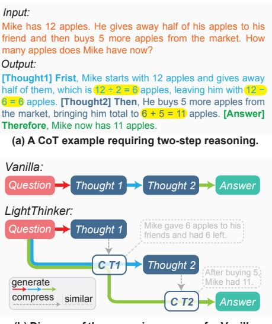

# 1 Introduction

Recent advancements in Large Language Models (LLMs) have demonstrated their remarkable capabilities in complex reasoning tasks [\(Zhao et al.,](#page-11-0) [2023;](#page-11-0) [Azaria et al.,](#page-8-0) [2024\)](#page-8-0). As research in this domain progresses, the reasoning patterns of these models have gradually evolved from "fast thinking" to "slow thinking". This transition is exemplified by methods such as Chain-of-Thought (CoT) [\(Wei](#page-11-1) [et al.,](#page-11-1) [2022\)](#page-11-1) prompting, which enhances reasoning by breaking down complex problems into sequential sub-steps. Building on this, the *o1-like*

> **[图片提取文字 (无描述)]:**
> Input: Mike has 12 apples. He gives away half of his apples to his friend and then buys 5 more apples from the market. How many apples does Mike have now? Output: [Thought1] Frist, Mike starts with 12 apples and gives away half of them, which is  $12 \div 2 = 6$  apples, leaving him with 12 -6 = 6 apples. [Thought2] Then, He buys 5 more apples from the market, bringing him total to 6 + 5 = 11 apples. [Answer] Therefore, Mike now has 11 apples. (a) A CoT example requiring two-step reasoning. Vanilla: Question Thought 1 Thought 2 LightThinker: Mike gave 6 apples to his Question Thought 1 friends and had 6 left. Thought 2 After buying 5, generate Mike had 11. compress similar

**(b) Diagram of the reasoning process for Vanilla and LightThinker**

Figure 1: (a) A CoT case. Tokens highlighted in yellow represent critical reasoning tokens, while the remaining tokens primarily ensure fluency. Humans typically only write the yellow parts when solving this problem. (b) Comparison of reasoning between Vanilla and Light-Thinker. "C Ti" denotes the i-th compressed thought representation, and we illustrate the semantic information potentially expressed after compression.

*thinking mode* [\(Jaech et al.,](#page-9-0) [2024;](#page-9-0) [Qwen.,](#page-10-0) [2024;](#page-10-0) [DeepSeek-AI et al.,](#page-8-1) [2025\)](#page-8-1) introduces multiple reasoning abilities such as trial-and-error, backtracking, correction, and iteration, further improving the success rate of models in solving complex problems. However, this performance improvement comes at the cost of generating a large number of tokens [\(Wu et al.,](#page-11-2) [2024b\)](#page-11-2). Given that current LLMs are predominantly based on the Transformer architecture [\(Vaswani et al.,](#page-11-3) [2017\)](#page-11-3), the computational complexity of the attention mechanism grows quadratically with the context length, while the storage overhead of the KV Cache increases linearly with the context length. For example, in the case of Qwen32B [\(Yang et al.,](#page-11-4) [2024\)](#page-11-4), when the context length reaches 104 , the KV Cache occupies

\* Equal Contribution.

† Corresponding Author.

a space comparable to the model itself. Consequently, the increase in token generation leads to a sharp rise in memory overhead and computational costs, severely limiting the practical efficiency of LLMs in long-text generation and complex reasoning tasks.

To mitigate this issue, two main approaches have been proposed, primarily differentiated by their intervention requirements during inference. The first category requires no additional intervention during inference, achieving efficiency through prompt engineering [\(Han et al.,](#page-9-1) [2024;](#page-9-1) [Ding et al.,](#page-9-2) [2024;](#page-9-2) [Nayab et al.,](#page-10-1) [2024\)](#page-10-1) or specialized training [\(Liu](#page-10-2) [et al.,](#page-10-2) [2024a;](#page-10-2) [Kang et al.,](#page-10-3) [2024;](#page-10-3) [Arora and Zanette,](#page-8-2) [2025;](#page-8-2) [Luo et al.,](#page-10-4) [2025;](#page-10-4) [Cheng and Durme,](#page-8-3) [2024;](#page-8-3) [Hao et al.,](#page-9-3) [2024\)](#page-9-3) to guide LLMs in generating fewer or even zero [\(Deng et al.,](#page-9-4) [2023,](#page-9-4) [2024\)](#page-9-5) intermediate tokens during reasoning. The second category operates through real-time token-by-token intervention during inference [\(Zhang et al.,](#page-11-5) [2023;](#page-11-5) [Chen et al.,](#page-8-4) [2024\)](#page-8-4), reducing memory usage by selectively retaining important parts of the KV Cache while discarding less critical ones. However, both approaches face distinct challenges: the first typically requires careful data construction and iterative refinement, while the second introduces substantial inference latency due to the computational overhead of token-wise importance assessment.

In this work, we propose a new approach by training LLMs to dynamically compress historical content during reasoning. Our motivation stems from two observations: 1) Tokens generated by the LLM serve dual purposes: ensuring linguistic fluency and facilitating actual reasoning (as highlighted in yellow in Fig. [1\(](#page-0-0)a)), making compression feasible. 2) When humans solve problems similar to the one in Fig. [1\(](#page-0-0)a), they typically write only key steps (highlighted in yellow), while storing the rest of the thought process mentally.

Based on these insights, we introduce Light-Thinker, a method that dynamically compresses intermediate thoughts during generation. As illustrated in Fig. [1\(](#page-0-0)b), after generating a lengthy thought step (e.g., Thought i), it is compressed into a compact representation (e.g., C Ti), and the original thought chain is discarded, with reasoning continuing based solely on the compressed content. This approach significantly reduces the number of tokens stored in the context window, thereby lowering memory overhead and computational costs.

In practice, we train the LLM to learn when and how to compress. Specifically, we construct data to teach the model when to compress; the hidden states of the thoughts to be compressed are reduced to a set of hidden states corresponding to a small number of special tokens (i.e., gist tokens [\(Mu](#page-10-5) [et al.,](#page-10-5) [2023\)](#page-10-5)). Through carefully designed attention masks, the LLM then learns how to compress and how to continue generating based on the compressed content. To quantify the amount of information used during reasoning, we further propose the Dependency (Dep) metric, defined as the total number of historical tokens each generated token depends on (see Fig. [3\)](#page-2-0). This metric effectively measures the degree of compression, with a lower Dep value indicating reduced reliance on the original long context and more significant compression.

We conduct extensive experiments across four datasets using two different models. The results indicate that, with the Qwen model, LightThinker reduces the peak token usage by 70% and decreases inference time by 26% compared to the Vanilla model, while maintaining comparable accuracy (with only a 1% drop). Our contributions are as follows: 1) We propose LightThinker, a method that dynamically compresses thought chains during reasoning, significantly reducing memory overhead and inference time. 2) We introduce the Dependency (Dep) metric to measure the compression ratio and the amount of information used during reasoning. 3) We demonstrate that Light-Thinker achieves a good balance between reasoning efficiency and accuracy, offering new insights for future LLM inference acceleration.

