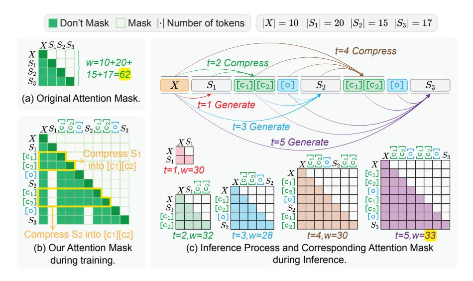
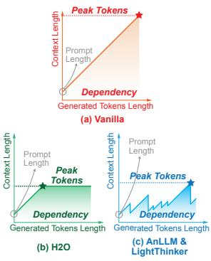

# 2 Background

Slow Thinking. The reasoning ability of LLMs is crucial [\(Qiao et al.,](#page-10-6) [2023\)](#page-10-6), especially in solving complex problems, necessitating a shift from the fast-thinking System 1 to the slow-thinking System 2 [\(Sloman,](#page-10-7) [1996;](#page-10-7) [Kahneman,](#page-10-8) [2011;](#page-10-8) [Booch et al.,](#page-8-5) [2021\)](#page-8-5). For instance, Chain-of-Thought (CoT) [\(Wei](#page-11-1) [et al.,](#page-11-1) [2022\)](#page-11-1) approaches decompose complex problems into sub-problems and solve them step-bystep. *o1-like thinking mode* [\(Jaech et al.,](#page-9-0) [2024;](#page-9-0) [Qwen.,](#page-10-0) [2024;](#page-10-0) [DeepSeek-AI et al.,](#page-8-1) [2025\)](#page-8-1) goes a step further by incorporating abilities such as trial, reflection, backtracking, and correction on top of the divide-and-conquer strategy. Empirical evidence [\(Jaech et al.,](#page-9-0) [2024;](#page-9-0) [DeepSeek-AI et al.,](#page-8-1) [2025\)](#page-8-1) shows that the *o1-like thinking mode* significantly enhances the model's ability to solve complex problems compared to CoT. This slow-thinking mode

> **[图片提取文字 (无描述)]:**
> |X| = 10  $|S_1| = 20$   $|S_2| = 15$   $|S_3| = 17$ Don't Mask Mask | Number of tokens  $XS_1S_2S_3$ t=4 Compress X $S_1 \\ S_2$ w=10+20+t=2 Compress 15+17=62  $[c_1][c_2][o]$  $[c_1][c_2][0]$ X $S_1$  $S_2$  $S_3$ (a) Original Attention Mask. t=1 Generate  $_XS_1$ ల్లోల్ల $S_2$ ల్లోల్ల $S_3$ t=3 Generate  $XS_1$ t=5 Generate compress S1 C1 into [c1][c2 Xt=1.w=30X $[c_1]$ Го  $[c_1]$  $[c_2]$  $XS_1\overline{\mathcal{L}}\overline{\mathbb{S}}$ X $[c_2]$ [o X [c1] 0 [C1] [C2  $[c_2]$  $S_2$  $[c_2]$ 0 [C1] [0]  $[c_1]$ [0] [Co] Compress S2 into [c1][c2] t=2.w=32t=3.w=28t=4, w=30t=5, w=33(b) Our Attention Mask (c) Inference Process and Corresponding Attention Mask during Inference. during training.

Figure 2: Overview of LightThinker, illustrated with an example requiring three-step reasoning. Fig. (a) shows the attention mask of Vanilla during both training and inference. Fig. (b) depicts the attention mask of LightThinker during the training. Fig. (c) presents the complete inference process of LightThinker along with the attention mask corresponding to each step. Here, 'w' denotes the size of the matrix.

> **[图片提取文字 (无描述)]:**
> Peak Tokens Context Lengtl Prompt Length Dependency Generated Tokens Length (a) Vanilla Context Length Context Length Prompt Length Prompt ength Peak Peak Tokens Tokens Dependency Dépendency Generated Tokens Length Generated Tokens Length (c) AnLLM & (b) H2O LightThinker

Figure 3: The relationship between context length and the number of generated tokens across different methods. The *Dependency* metric represents the area under the curve, while the *Peak Token* denotes the maximum value of the curve. See Appx. A for details.

can be instilled in models through carefully constructed data using Supervised Fine-Tuning (SFT). In terms of the number of output tokens, the token consumption of System 1, CoT, and *o1-like thinking mode* increases progressively.

**Inference Challenges.** Recent works on *o1-like* thinking mode (Wu et al., 2024b) highlight the necessity of generating a substantial number of tokens for complex problem-solving. As the core structure of Transformers (Vaswani et al., 2017), the attention mechanism faces two significant challenges during inference as token generation scales: 1) The memory overhead gradually increases. To speed up inference, each token's Key and Value are cached at every layer. For the Qwen-32B (Yang et al., 2024), when the context length reaches 104 tokens, the space occupied by the KV cache is comparable to that of the model itself. 2) The computational cost of generating a single token in an autoregressive manner also increases. Due to the attention mechanism in Transformers (Vaswani et al., 2017), the computational load grows quadratically with the number of tokens.

## 3 Methodology

We propose **LightThinker** to accelerate the reasoning process of LLMs, as illustrated in Figure 2. The core idea is to *train LLMs to dynamically compress the current thought during reasoning*, enabling subsequent generation to be based on the compressed

content rather than the original long thought.

#### 3.1 Overview

**Notation.** For clarity, we define the following notations. Lowercase letters, such as  $x_i$ , denote a single token. Uppercase letters, such as X, denote sequences of tokens. The notation '[·]' denotes a special token, such as '[c]', while '<·>' denotes an optional special token, such as '<w>'. The o1-like thinking mode dataset  $\mathcal{D} = \{(X,Y)_i\}_{i=1}^{|\mathcal{D}|}$  consists of  $|\mathcal{D}|$  samples, where  $X = \{x_i\}_{i=1}^{|X|}$  represents a question, and  $Y = \{y_i\}_{i=1}^{|Y|}$  represents the corresponding thought and final answer. Recent works (Team, 2025; DeepSeek-AI et al., 2025) show that SFT on  $\mathcal{D}$  significantly enhances LLM reasoning capabilities.

Design. To achieve the core idea, we focus on addressing two key questions: *i) When to compress?* The timing of compression significantly impacts reasoning efficiency and compression quality. We explore two different strategies. The first is *tokenlevel* (Zhang et al., 2024b), where compression is performed after a fixed number of tokens. This strategy is straightforward to implement but may ignore semantic boundaries. The second is *thoughtlevel* (Pang et al., 2024), where compression is performed after a complete "thought", defined as a sentence or paragraph. This strategy better preserves semantic information but requires a more complex segmentation function. *ii) How to compress?* 

The goal of compression is to encode the current lengthy thought into a more compact representation. We investigate two different approaches. The first is text compression, where the current thought is encoded into a shorter text (Jiang et al., 2023) or a chunk of continuous vectors (Chevalier et al., 2023; Ge et al., 2024). This method requires an additional encoding model and increases computational overhead. The second is *hidden state compression*, where the hidden state of the current thought is compressed into the hidden states of a few special tokens (i.e., gist tokens (Mu et al., 2023)). We choose this method as it does not require additional models. Specifically, in our work, we address the first question by reconstructing data and the second by constructing thought-based attention mask.

What content has been compressed? We do not aim to compress lengthy thought information into a compact representation without loss. Instead, our focus is on preserving only the information that is essential for subsequent reasoning. As highlighted by the gray dashed box in Figure 1(b), the lengthy thought is retained solely for the elements that contribute to further inference.

#### 3.2 LightThinker

Data Reconstruction. To enable LLMs to dynamically compress during generation, we reconstruct the original dataset  $\mathcal{D}$  as follows. First, we segment the output. Given the input X and output Y, we use a segmentation function Seg() to divide Y into k subsequences S, i.e.,  $Y = \{S_i\}_{i=1}^k$ . The function can be based on token-level or thought-level. Then, we insert the special tokens. Specifically, we insert a set of special tokens  $\{<w>, C, [o]\}$  between adjacent subsequences  $S_i$ , where <w> is an *optional* compression trigger, indicating the need to compress the preceding thought. It can be omitted if the Seg() is token-level or if  $\langle w \rangle \in S_i$ . The to- $\ker C = \{ [c_i] \}_{i=1}^{|C|} \text{ consists of } |C| \text{ special tokens,}$ serving as gist tokens to store compressed content. Here we refer to C as *cache tokens* and denote |C|as the cache size. The token [o] is a mandatory output token, enabling continual generation based on compressed content, inspired by Zhang et al... Finally, the enhanced data is

$$\hat{Y} = \{S_1, \leq w >, C, [o], S_2, \leq w >, C, [o], \dots, S_k\},\$$

and the enhanced dataset is defined as  $\hat{\mathcal{D}} = \{(X, \hat{Y})_i\}_{i=1}^{|\hat{\mathcal{D}}|}$ . For simplicity, we assume <w $> \in S_i$ , so we omit it. Additionally, we use superscripts

to distinguish different special tokens at different positions, such as  $C^{(1)}$  and  $[o]^{(1)}$  for tokens following  $S_1$ , though they are the same across different positions.

#### **Thought-based Attention Mask Construction.**

To enable LLMs to learn how to compress and how to generate based on the compressed content (i.e., how to understand the compressed content), we manipulate *Thought-based Mask Construction* as shown in Figure 2(b). Specifically, let  $S_{< i} = \{S_1, \ldots, S_{i-1}\}$  denotes the sequence before the i-th thought  $S_i$ .

During compression,  $C^{(i)}$  tokens can only attend to the question X, previous compressed content  $\{C, [o]\}^{(< i)}$ , and the current thought  $S_i$ , that is,

$$C^{(i)} \leftarrow \text{Cmp}(X, \\ \{C^{(1)}, [\mathbf{o}]^{(1)}, \dots, C^{(i-1)}, [\mathbf{o}]^{(i-1)}\}, S_i),$$

where Cmp() is compression operation. This allows the LLM to compress the key content of  $S_i$  into  $C^{(i)}$ . A detailed mathematical description of Cmp() is in Appx. B.

During generation, token  $[o]^{(i)}$  can only attend to the question X and the previous compressed content  $\{C, [o]\}^{(\leq i)}$ , that is,

$$S_{i+1} \leftarrow \mathrm{Gen}(X, \{C^{(1)}, [\mathtt{o}]^{(1)}, \dots, C^{(i)}, [\mathtt{o}]^{(i)}\}),$$

where Gen() is generation operation. This enables the LLM to continue reasoning based on the question and previous compressed content.

**Training and Inference.** Training objective is to maximize the following probability distribution:

$$P_{\theta}(S_1|X) \cdot P_{\theta}(S_2|X, C^{(1)}, [o]^{(1)}) \cdot \dots \cdot P_{\theta}(S_k|X, \{C^{(i)}, [o]^{(i)}\}_{i=1}^{k-1}),$$

where  $\theta$  represents the LLM parameters. Notably, during training, LLM is not allowed to predict the input X and the special tokens C and [o]. The training samples are drawn from the  $\hat{\mathcal{D}}$ , and we employ an attention mask to encourage the LLM to learn to compress and comprehend the compressed content. The entire training process remains based on next token prediction. The detailed inference procedure is illustrated in Fig. 1(b) and Fig. 2(c).

#### 4 Experiments

#### 4.1 Experimental Settings

**Baselines.** We conduct experiments on two LLMs: Qwen2.5-7B (Yang et al., 2024) and Llama3.1-8B (Dubey et al., 2024). To establish an upper

|                                       | GSM8K                                   |                                  |                                   | MMLU                               |                                         |                                  | GPQA                                     |                              | ВВН                             |                                 |                                    | AVG.                       |                                  |                                  |                                     |                                    |                                  |                                  |                                          |                               |
|---------------------------------------|-----------------------------------------|----------------------------------|-----------------------------------|------------------------------------|-----------------------------------------|----------------------------------|------------------------------------------|------------------------------|---------------------------------|---------------------------------|------------------------------------|----------------------------|----------------------------------|----------------------------------|-------------------------------------|------------------------------------|----------------------------------|----------------------------------|------------------------------------------|-------------------------------|
| Method                                | Acc↑                                    | Time ↓                           | Peak↓                             | Dep↓                               | Acc↑                                    | Time ↓                           | Peak↓                                    | Dep↓                         | Acc↑                            | Time ↓                          | Peak↓                              | Dep↓                       | Acc↑                             | Time ↓                           | Peak↓                               | Dep ↓                              | Acc↑                             | Time ↓                           | Peak↓                                    | Dep↓                          |
|                                       | Qwen2.5-7B Series                       |                                  |                                   |                                    |                                         |                                  |                                          |                              |                                 |                                 |                                    |                            |                                  |                                  |                                     |                                    |                                  |                                  |                                          |                               |
| CoT Distill-R1                     | 86.12 81.88                          | 1.66 5.60                     | 513 844                        | 0.1M 1.1M                       | 66.50 51.70                          | 1.77 14.31                    | 649 2483                              | 0.2M 7.5M                 | 26.76 24.75                  | 0.60 8.01                    | 968 6718                        | 0.5M 31M                | 65.45 57.78                   | 0.68 5.53                     | 570 1967                         | 0.1M 6.0M                       | 61.21 54.03                   | 1.18 8.36                     | 675 3003                              | 0.2M 11.3M                 |
| Vanilla + H2O + SepLLM AnLLM | 90.90 <u>89.92</u> 30.40 78.39 | 11.83 22.19 53.52 15.26 | 2086 <b>640</b> 1024 789 | 3.9M   1.2M   6.9M   1.6M | 59.98 59.69 10.81 54.63        | 20.61 29.02 53.45 14.13 | 3417 1024 1024 875              | 10M 3.2M 9.0M 2.0M  | 30.81 24.75 0.00 19.70 | 10.76 15.61 11.65 9.14 | 8055 1200 1024 3401       | 39M 9.8M 10M 11M  | 69.90 70.10 8.08 54.95  | 11.50 15.61 26.64 10.04 | 3786 <b>1024</b> 1024 1303 | 13M 3.5M 9.4M 3.8M        | 62.90 61.12 12.32 51.92 | 13.68 20.61 36.32 12.14 | 4336 <b>972</b> 1024 1592       | 16.6M 4.4M 8.9M 4.6M |
| Ours (tho.) Ours (token)           | <b>90.14</b> 87.11                      | <b>11.46</b> 11.48            | 676 1038                       | 1.0M 1.5M                       | <b>60.47</b> 57.35                      | 13.09 13.80                   | 944 <b>489</b>                        | <b>1.9M</b> 3.5M          | 30.30 28.28                  | 8.41 8.26                    | 2385 3940                       | <b>9.3M</b> 18M         | <b>70.30</b> 62.83               | <b>7.71</b> 8.95                 | 1151 1884                        | <b>2.7M</b> 5.6M                   | <b>62.80</b> 58.89               | 10.17 10.62                   | 1289 1838                             | <b>3.7M</b> 7.2M              |
|                                       | Llama3.1-8B Series                      |                                  |                                   |                                    |                                         |                                  |                                          |                              |                                 |                                 |                                    |                            |                                  |                                  |                                     |                                    |                                  |                                  |                                          |                               |
| CoT Distill-R1                     | 85.14 73.62                          | 2.15 2.58                     | 550 395                        | 0.2M 0.1M                       | 65.82 53.46                          | 2.39 2.97                     | 736 582                               | 0.3M 0.8M                 | 24.75 20.20                  | 0.96 5.24                    | 1231 3972                       | 0.9M 16M                | 66.46 61.21                   | 0.93 0.83                     | 642 380                          | 0.2M 0.2M                       | 60.54 52.12                   | 1.61 2.91                     | 790 1332                              | 0.4M 4.4M                  |
| Vanilla + H2O + SepLLM AnLLM | 91.43 <b>90.45</b> 26.25 77.33 | 12.06 20.23 50.05 17.92 | 1986 640 1024 <b>589</b> | 3.0M   1.0M   5.8M   1.1M | 69.62 <b>65.92</b> 25.12 58.62 | 14.82 27.11 50.11 16.53 | 2883 <u>736</u> 1024 <b>589</b> | 6.9M 1.8M 7.5M 1.2M | 40.91 31.81 2.53 31.31 | 7.98 12.55 12.62 7.19  | 6622 1536 1024 <b>838</b> | 26M 7.9M 10M 3.7M | 83.03 78.99 14.55 68.89 | 6.80 11.43 27.14 9.79   | 2793 1024 1024 <b>621</b>  | 5.9M   2.1M   8.5M   1.6M | 71.25 66.79 17.11 59.04 | 10.42 17.83 34.98 12.86 | 3571 <u>984</u> 1024 <b>659</b> | 10.5M 3.2M 8.0M 1.9M |
| Ours (tho.) Ours (token)           | 88.25 85.52                          | 12.65 13.87                   | 629 1104                       | <b>0.9M</b> 1.7M                | $\frac{63.39}{61.05}$                   | 14.88 15.85                   | 882 1538                              | $\frac{1.8M}{3.3M}$          | <b>36.36</b> 31.82              | <b>6.38</b> <u>6.94</u>         | 1796 3150                       | 6.4M 12M                | <b>79.39</b> 74.14               | 7.46 7.43                     | 911 1512                         | 1.9M 2.9M                       | <b>66.85</b> 63.13               | <b>10.34</b> <u>11.02</u>        | 1055 1826                             | 2.7M 4.8M                  |

Table 1: Main results. The CoT is based on the instruction model, while Vanilla, AnLLM, and LightThinker are based on Distill-R1. The light blue background indicates acceleration methods, with bold representing the best and underline the second best among them. The Acc of Vanilla serves as the upper bound for Acc of acceleration methods. Dep is measured in million, Time in hours, and Peak in counts. The compression ratio can be roughly estimated by the ratio of Dep between acceleration methods and Vanilla. See Appendix A for more details. Note that the results here are based on the same batch size. The results under the same memory budget are shown in Table 2.

bound performance, we perform full parameter instruction tuning using the Bespoke-Stratos-17k dataset (abbr. BS17K, with a data sample shown in Fig. 15), and the fine-tuned model is denoted as Vanilla. Notably, we initialize the training with the R1-Distill (DeepSeek-AI et al., 2025) (e.g., DeepSeek-R1-Distill-Qwen-7B) model, as we found that finetuning on instruction models (e.g., Qwen2.5-7B-instruct) yields limited improvements. We introduce five baselines for comparison: two training-free acceleration methods applied to Vanilla (H2O (Zhang et al., 2023) and SepLLM (Chen et al., 2024), which retain important KV Cache through specific strategies), one trainingbased method (AnLLM (Pang et al., 2024)), and two CoT (Wei et al., 2022) baselines (prompt the instruction model and the R1-Distill model). More details about baselines can be found in Appx. C.2.

Evaluation Metrics and Datasets. We evaluate LightThinker on four datasets: GSM8K (Cobbe et al., 2021), MMLU (Hendrycks et al., 2021), GPQA (Rein et al., 2024), and BBH (Suzgun et al., 2023). For MMLU and BBH, we randomly sample a portion of the data for evaluation. The evaluation focuses on both *effectiveness* and *efficiency*. For effectiveness, we use accuracy as the evaluation metric (*Acc*); for efficiency, we employ three metrics: inference time (*Time*), the peak number of tokens in the context during inference (*Peak*), and the sum of *dependency* of each generated token on

previous tokens during the generation (*Dep*). Fig. 3 visualizes the Peak and Dep metrics, where the value of Dep equals the area enclosed by the lines. The Dep metric characterizes the amount of information used during inference, with smaller values indicating more significant compression. We aim to compare the other three metrics under similar Dep values. It is important to note that Peak characterizes a momentary state, while Dep characterizes the entire inference process, so there is no direct correlation between the two. For more details about Dep, please refer to Appx. A.

**Implementation.** For LightThinker, we design two different segmentation functions Seg(). At the token level, we compress every 6 tokens into 2 tokens, i.e., |C|=2, denoted as "ours (token)". At the thought level, we use "\n\n" as a delimiter to simply segment the B17K data into several thoughts, denoted as "ours (tho.)". For the Qwen, we compress a thought into 9 tokens, i.e., |C|=9; for the Llama, we compress a thought into 7 tokens, i.e., |C|=7. In all experiments, we use greedy decoding with a maximum output length of 10240 tokens. Please refer to Appx. C for more details.

#### 4.2 Main Results

In Tab. 1, we report the results of four evaluation metrics for two models on four datasets. **Key observations include:** *1*) Distill-R1 performs worse than CoT across all datasets because its weaker

instruction-following ability [\(Li et al.,](#page-10-13) [2025\)](#page-10-13) prevents effective answer extraction using rules, even with attempts at evaluation using an LLM evaluator. However, this issue is not the focus of this paper. *2)* H2O effectively reduces memory usage while maintaining the performance of the vanilla, indicating that the greedy eviction policy is effective in long-text generation tasks. However, H2O significantly increases inference time compared to Vanilla, with an average increase of 51% ((20.61−13.68)/13.68 ≈ 0.51) on Qwen and 72% on Llama. This is attributed to the token-wise eviction policy of H2O, which introduces additional overhead for each generated token. *3)* SepLLM performs the worst in terms of performance, gradually losing language ability during generation, which results in the inability to output termination tokens and thus leads to excessive inference time. *4)* Compared to H2O, LightThinker (*tho.*) achieves similar performance with lower Dep values (i.e., similar compression rate), while reducing inference time by an average of 52% on Qwen and 41% on Llama. Additionally, LightThinker (*tho.*) retains higher accuracy and faster inference speed compared to AnLLM.

Based on these observations, we draw the following conclusions: *1)* B17K is an effective dataset. We find Vanilla outperforms CoT and Distill-R1 on most datasets, indicating that B17K is an effective dataset that mitigates the repetition issue in Distill-R1 through SFT. *2)* LightThinker is effective and achieves a good balance between effectiveness and efficiency in inference. Specifically, on the Qwen, LightThinker sacrifices 1% accuracy but saves 26% time, reduces the peak tokens by 70%, and decreases Dep. by 78% (i.e., achieves a 16.6/3.7=4.5x compression ratio). On the Llama, it sacrifices 6% accuracy but saves 1% inference time, reduces the peak tokens by 70%, and decreases Dep. by 74% (i.e., achieves a 10.5/2.7=3.9x compression ratio). *3)* The segmentation function is vital for LightThinker. The thought-level segmentation function outperforms the token-level, with accuracy improvements of 6.2% on Qwen and 5.6% on Llama. This suggests that token-level segmentation leads to the loss of semantic boundaries.

#### 4.3 Efficiency

For clarity, "LightThinker" hereafter denotes Light-Thinker (*tho.*). In this section, we conduct an indepth analysis of LightThinker's efficiency, focusing on the following four questions:

|              | GSM8K | MMLU  | GPQA  | BBH   | AVG   |
|--------------|-------|-------|-------|-------|-------|
| Vanilla      | 11.83 | 20.61 | 10.76 | 11.50 | 13.68 |
| LightThinker | 6.73  | 7.44  | 3.86  | 3.97  | 5.50  |

Table 2: Inference time comparison (in hours) for Vanilla and LightThinker on the Qwen model across four datasets under the same memory budget.

How does LightThinker accelerate under same memory budget? Inference efficiency is measured through memory consumption and inference speed. Tab. [1](#page-4-0) highlights LightThinker's ability to significantly reduce memory consumption at the same batch size. In practice, this reduction allows for larger batch sizes under the same memory budget, improving throughput. Experiments on four datasets with the Qwen model, conducted under the same memory constraints, show that LightThinker reduces inference time by an average of 2.5× compared to Vanilla, as demonstrated in Tab. [2.](#page-5-0) This indicates that LightThinker not only reduces both memory and time overhead at the same batch size (as shown in Tab. [1\)](#page-4-0) but also significantly lowers time overhead under the same memory budget, thereby improving throughput.

Does LightThinker generate more tokens compared to Vanilla? Fig. [4\(](#page-6-0)a) shows the average number of generated tokens for H2O, AnLLM, LightThinker, and Vanilla across four datasets (others in the Appx. [C.5\)](#page-14-0). We observe that: 1) Light-Thinker is the only method that reduces the number of generated tokens compared to Vanilla, with an average reduction of 15% on Qwen and 13% on Llama. This is one of the reasons for its faster inference speed. 2) H2O increases token generation by 10% on Qwen but reduces it by 7% on Llama. Despite the reduction in tokens for Llama, the inference time still increases as shown in Tab. [1,](#page-4-0) indicating that its eviction policy accumulates additional overhead as token generation grows.

