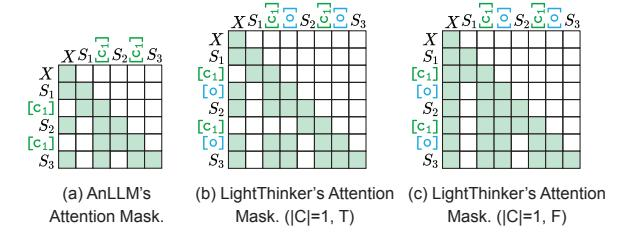

# A.1 Motivation

LightThinker and AnLLM [\(Pang et al.,](#page-10-9) [2024\)](#page-10-9) are dynamic compression methods, meaning the number of compressions and the compression ratio are determined by the LLM itself rather than being predefined hyperparameters. In contrast, H2O [\(Zhang](#page-11-5) [et al.,](#page-11-5) [2023\)](#page-11-5) and SepLLM [\(Chen et al.,](#page-8-4) [2024\)](#page-8-4) allow users to set hyperparameters to control the maximum number of tokens retained during inference. This fundamental difference makes it challenging to directly and fairly compare dynamic compression methods like LightThinker and AnLLM with KV cache compression approaches like H2O and SepLLM.

Traditionally, KV cache compression methods are compared by setting the same maximum peak token count, but this metric becomes inadequate in our context. As illustrated in Figure [6,](#page-12-1) which shows the relationship between generated tokens and context length for Vanilla, H2O, and Light-Thinker, LightThinker occasionally exceeds H2O in peak token count. However, this metric is misleading because LightThinker's peak memory usage occurs only momentarily, while H2O maintains a consistently high token count over time.

Moreover, previous KV cache compression methods often compress prompt parts only and assume a fixed prompt length, allowing compression ratios to be predefined. In our setting, however, the output is also needed to be compressed. The output token count is unknown, making it impossible to preset a global compression ratio. Consequently, relying solely on maximum peak token count as a comparison metric is insufficient.

To address these challenges, we propose a new metric called *Dependency*, which quantifies the total amount of information dependencies during the generation process. This metric enables fair comparisons between dynamic compression methods and traditional KV cache compression approaches by ensuring evaluations are conducted under similar effective compression ratios.

#### A.2 Definition

We introduce the Dependency (abbr., Dep) metric, defined as the sum of dependencies of each generated token on previous tokens during the generation of an output. Geometrically, it represents the area under the curve in Figure [6.](#page-12-1) Dependency can be calculated either from its definition or through its geometric interpretation. Here, we focus on the geometric approach. Let the initial prompt length be LP , the model's output length be LO, and the maximum context length set by KV cache compression methods be LC.

Dependency for Vanilla. The area under Vanilla's curve forms a right trapezoid, calculated as:

Dependency 
$$=\frac{(L_P+L_P+L_O)\times L_O}{2}$$
  $=\frac{{L_O}^2}{2}+L_P\times L_O$ 

Dependency for H2O. The area under H2O's curve consists of a trapezoid (left part in Figure [6\(](#page-12-1)b)) and a rectangle (right part in Figure [6\(](#page-12-1)b)):

$$\begin{split} S_{\mathsf{Trapezoid}} &= \frac{(L_P + L_C) \times (L_C - L_P)}{2} \\ S_{\mathsf{rectangle}} &= L_C \times (L_O - L_C + L_P) \\ \mathsf{Dependency} &= S_{\mathsf{Trapezoid}} + S_{\mathsf{rectangle}} \\ &= \frac{2L_P L_C + 2L_O L_C - L_P^2 - L_C^2}{2} \end{split}$$

Dependency for LightThinker and AnLLM. For LightThinker and AnLLM, Dependency does not have a closed-form solution and must be computed iteratively based on its definition.

#### A.3 Application

Value of Dependency. A higher Dependency value indicates that more tokens need to be considered during generation, reflecting greater information usage. Conversely, a lower Dependency value suggests a higher effective compression ratio.

**Dependency Ratio.** By dividing the Dependency of an accelerated method by that of Vanilla, we obtain the compression ratio relative to Vanilla. For example, in Table 1's "Avg." column, Vanilla's Dependency is 16.6M, H2O's is 4.4M, and LightThinker's is 3.7M. Thus, H2O achieves a compression ratio of  $\frac{16.6}{4.4} \approx 3.8$ , while LightThinker achieves  $\frac{16.6}{3.7} \approx 4.5$ .

This metric provides a unified framework for evaluating both dynamic and static compression methods, ensuring fair and meaningful comparisons.

> **[图片提取文字 (无描述)]:**
> [C1 CI Го 0 [C1 TO. [C1 (a) AnLLM's (b) LightThinker's Attention (c) LightThinker's Attention Mask. (|C|=1, T) Attention Mask. Mask. (|C|=1, F)

Figure 7: Illustration of Attention Mask in Table 4.

