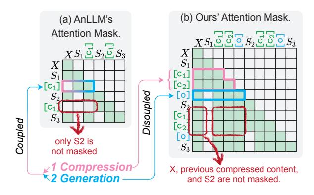

# E.1 Difference between LightThinker and AnLLM

AnLLM [\(Pang et al.,](#page-10-9) [2024\)](#page-10-9) is a work from 2023, at which time the concept of long-cot [\(Jaech et al.,](#page-9-0) [2024;](#page-9-0) [DeepSeek-AI et al.,](#page-8-1) [2025\)](#page-8-1) did not exist. AnLLM itself focuses more on prompt compression rather than output compression. Additionally, our method decouples compression and generation, allowing for scaling the number of cache tokens—something AnLLM cannot do. Therefore,

our work is only related to AnLLM in that both use sparse attention [\(Zhang et al.,](#page-11-5) [2023;](#page-11-5) [Li et al.,](#page-10-16) [2024\)](#page-10-16) to speed up processes, but they are not similar works.

AnLLM is a method related to ours. In Figure [9,](#page-16-0) we compare the differences in Attention Mask between LightThinker and AnLLM: 1) *Decoupling Generation and Compression.* In AnLLM, the [ci] token is tasked with both compressing historical information and generating subsequent content, as shown by the blue and pink arrows in Fig. [9.](#page-16-0) This design tightly couples generation and compression. In contrast, LightThinker decouples these tasks: the [ci] token solely compresses historical information, while the [o] token performs reasoning based on the compressed content. 2) *Context Visibility during Compression.* AnLLM can only access the current thought during compression. LightThinker, however, allows access to X, historical compressed content, and the current thought during compression, thereby enhancing contextual understanding. Ablation experiments in Section [4.4](#page-6-2) demonstrate that these designs significantly improve performance.

> **[图片提取文字 (无描述)]:**
> (b) Ours' Attention Mask. (a) AnLLM's Attention Mask.  $XS_1$ ပ်  $S_2$ ပ်  $S_3$ C1 Disoupled Coupled  $C_2$ only S2 is not masked ∠1 Compression → 
> 2 Generation — 
>  X, previous compressed content, and S2 are not masked.

Figure 9: Contrast of AnLLM and ours. Two differences are marked: one with a red box, and the other with blue and pink arrows.

