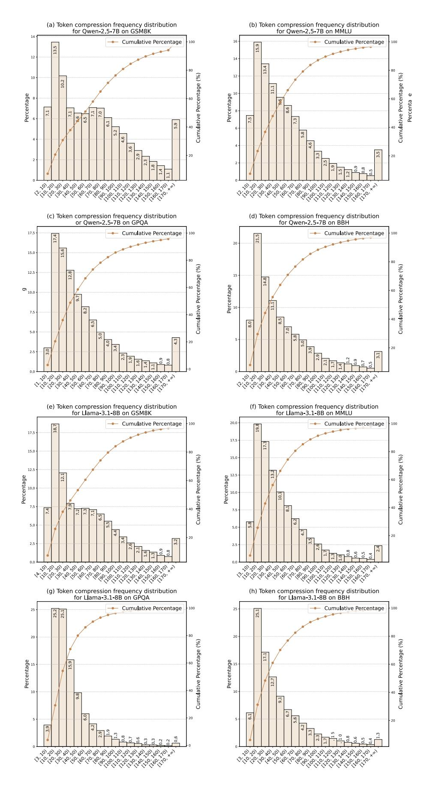

# E.4 Comparison with Implicit CoT Works

Both our work and implicit CoT methods operate in continuous spaces. While implicit CoT performs reasoning entirely in continuous space, LightThinker employs a hybrid approach combining continuous and discrete space reasoning. The overview differences are shown in Table [5.](#page-19-2) Below we clarify the key differences:

- Reasoning Acceleration Mechanism. *Implicit CoT* methods (e.g., System-1.5 [\(Wang](#page-11-11) [et al.,](#page-11-11) [2025\)](#page-11-11), SoftThinking [\(Zhang et al.,](#page-11-12) [2025\)](#page-11-12)) accelerate reasoning by reducing generation steps through continuous token representations. The entire reasoning process depends on full context. *LightThinker* accelerates inference by reducing the number of historical tokens needed for generation, without requiring full context dependence.
- Training Approach. Implicit CoT typically requires complex, multi-stage training with significant overhead (e.g., System-1.5's two-phase training [\(Wang et al.,](#page-11-11) [2025\)](#page-11-11) or Coconut's curriculum learning [\(Hao et al.,](#page-9-3) [2024\)](#page-9-3)). Some methods [\(Zhang et al.,](#page-11-12) [2025;](#page-11-12) [Cheng and Durme,](#page-8-3) [2024\)](#page-8-3) even require architecture modifications. LightThinker uses standard SFT with modified attention masks, requiring neither specialized training data nor architectural changes.
- Interpretability and Generalization. Current implicit CoT methods face interpretability challenges (due to continuous reasoning) and limited out-of-domain generalization (except SoftThinking [\(Zhang et al.,](#page-11-12) [2025\)](#page-11-12)). Light-Thinker maintains discrete tokens for better interpretability and shows promising out-ofdomain generalization in our experiments, as shown in Table [5.](#page-19-2)

<span id="page-17-0"></span>> **[图片提取文字 (无描述)]:**
> (b) Token compression frequency distribution (a) Token compression frequency distribution for Qwen-2.5-7B on GSM8K for Qwen-2.5-7B on MMLU Cumulative Percentage Cumulative Percentage 15.9 13,5 12 14 13.4 Cumulative Percentage (%) Cumulative Percentage (%) 12 10 10.2 11.1 Percentage Percentage 5.9 20 ૣઌ૽ઌ૱૱ૹૹૹૹૹૹઌૹ૱ઌ૽ઌ૽ઌ૽ઌ૽ઌ૽ૹ૽ૹઌઌ૽ૹઌઌ૱ ઌઌઌૹૹૹૹૹૹૹૹૹૹ ૣઌ*૽ઌૹ૽ૹ૽ૹઌૹઌૹૹૹઌૢઌ૽ઌ૽ૢઌ૽ૢઌ૽ૢઌ૽ૢઌ૽ૢઌ૽ઌ૽ૹ*ૹઌૹૹૹ ઌ૽ઌૹ૽ૹ૽ૹઌૹઌૹૹૹૹઌઌ૽ઌ૽૽ઌ૽ઌ૽ઌ૽ૹૹઌૹૹૹ (c) Token compression frequency distribution (d) Token compression frequency distribution or Qwen-2.5-7B on GPQA for Owen-2.5-7B on BBH Cumulative Percentage 17.5 Cumulative Percentage 100 21.5 20 Cumulative Percentage (%) Cumulative Percentage (%) 12.8 12.5 15 Percentage 7.5 6.5 8.0 5.0 - 20 ૡ૽૽ઌ૽૽ૡ૽ૺઌ૽ઌ૽ઌ૽ૹ૽ૹઌૹઌૹઌઌ૽ઌ૽ઌ૽ઌ૽ઌ૽ઌ૽ઌ૽ ૡ૽ૹ૽ૡ૽ૡ૽ઌ૽ઌ૽ૹૹૹઌૹઌૹઌઌઌઌઌઌઌઌઌઌ ૢ૽૱ૢ૽૱ૢ૽૱ૢઌ૽ૢઌૢઌ૽૱ૢ૱ઌ ૢ૱ૢ૽૱ૢ૽૱ૢઌ૽ૢઌૢઌ૽૱૱૱ઌઌ૱૱૱ઌઌ (e) Token compression frequency distribution (f) Token compression frequency distribution for Llama-3.1-8B on GSM8K for Llama-3.1-8B on MMLU Cumulative Percentage Cumulative Percentage 19. 18 17.5 17.5 15.0 nulative Percentage (%) nulative Percentage (%) 15.0 12.5 Percentage 10.0 Percentage 10 7.4 7.3 7.5 Š Š 6.2 5,5 5.0 - 20 20 2.5 ~;0;0;4;4;4;4;4;4;4;4;4;4;4;4;4;4;4;4;4; \$\\\\\\\\\\\\\\\\\\\\\\\\\\\\\\\\\\\\\ (g) Token compression frequency distribution (h) Token compression frequency distribution for Llama-3.1-8B on GPQA for Llama-3.1-8B on BBH Cumulative Percentage Cumulative Percentage 100 100 25 25.2 25.1 25.1 20 20 Cumulative Percentage (%) Cumulative Percentage (%) 17.1 Percentage Percentage 15,9 10 10 6.1 20 - 20 4.2 4,2 ૢઌૺઌૹ૱ૡઌૹઌઌૹઌૢઌૢઌ૽ઌ૽ઌ૽ૢઌ૽૽ઌ૽૽ૡ૽ઌ૽ઌ૽ઌ૽ઌ ૢ<u>ૼૼૼૼૼૼૼૼઌઌ૽ૹઌઌઌઌઌ</u>ૹઌઌ૽ઌ૽ઌ૽ઌ૽ઌ૽૽ઌ૽૽ઌ૽ૺઌ ૢૺ૱૽ૢઌ૽૽ૢઌ૽ૢઌ૽ૢઌ૽ઌ૽૱૱ઌ૽૱૽ ૢૺૺ૱૽ૢઌ૽ૢઌ૽ૢઌ૽ૢઌ૽ઌ૽૱૱ઌ૱૱૱૽ઌ૽ઌ૽૽ઌ૽૽ઌ૽ ૢૺૺૺૺઌ૽૽ઌ૽૽ઌ૽ઌ૽ઌ૽ઌઌ૱ઌ૱ઌઌ૽ઌ૽ઌ૽ઌ૽ઌ૽


Figure 10: Token compression frequency distribution for LightThinker.

```
System Prompt:
Below is a question. Please think through it step by step, and then provide the final answer. If
options are provided, please select the correct one.
## Output format:
Use "<THOUGHT>...</THOUGHT>" to outline your reasoning process, and enclose the final
answer in '\boxed{}'.
## Example 1:
Question:
What is 2 + 3?
Output:
<THOUGHT>First, I recognize that this is a simple addition problem. Adding 2 and 3 together
gives 5.</THOUGHT>
Therefore, the final answer is \boxed{5}.
## Example 2:
Question:
What is 2 + 3?
A. 4
B. 5
C. 10
Output:
<THOUGHT>First, I recognize that this is a simple addition problem. Adding 2 and 3 together
gives 5.</THOUGHT>
Therefore, the final answer is \boxed{B}.
```

Figure 11: System prompt for Qwen2.5-7B-Instruct and Llama3.1-8B-Instruct.

## <span id="page-18-1"></span>System Prompt:

Your role as an assistant involves thoroughly exploring questions through a systematic long thinking process before providing the final precise and accurate solutions. This requires engaging in a comprehensive cycle of analysis, summarizing, exploration, reassessment, reflection, backtracing, and iteration to develop well-considered thinking process. Please structure your response into two main sections: Thought and Solution. In the Thought section, detail your reasoning process using the specified format: <|begin\_of\_thought|> {thought with steps separated with '\n\n'} <|end\_of\_thought|> Each step should include detailed considerations such as analisying questions, summarizing relevant findings, brainstorming new ideas, verifying the accuracy of the current steps, refining any errors, and revisiting previous steps. In the Solution section, based on various attempts, explorations, and reflections from the Thought section, systematically present the final solution that you deem correct. The solution should remain a logical, accurate, concise expression style and detail necessary step needed to reach the conclusion, formatted as follows: <|begin\_of\_solution|> {final formatted, precise, and clear solution} <|end\_of\_thought|> Now, try to solve the following question through the above guidelines:

Figure 12: System prompt for Vanilla, H2O, SepLLM, AnLLM, and LightThinker for both Qwen-based model and Llama-based model.

