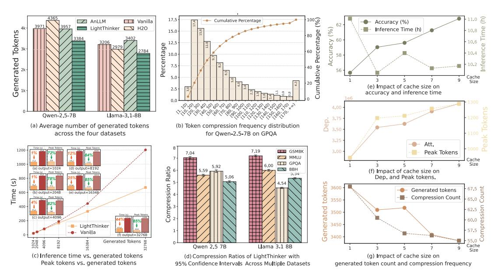

# What is the compression ratio of LightThinker?

Fig. [4\(](#page-6-0)d) illustrates the compression ratio across four datasets, Tab. [3](#page-6-1) reports the average compression counts, and Fig. [4\(](#page-6-0)b) shows the distribution of compressed token counts for GPQA using Qwen (other datasets are in the Appx. [C.5\)](#page-14-0). We find that: 1) Compression counts and ratios are more closely related to downstream tasks than to the model itself. Simple tasks like GSM8K exhibit lower compression counts and higher compression ratios, while complex tasks like GPQA require more frequent compressions and smaller compression ratios. 2)

> **[图片提取文字 (无描述)]:**
> 1008 17.5 Cumulative Percentage AnLLM ☐☐ Vanilla Accuracy (%) LightThinker N H2O (%) Inference Time (h) Tokens 15.0 Percentage 80 3402 Accuracy 85 99 Percentage nference 60 10.4 Generated 40 Cumulative 5.0 Cache Size (e) Impact of cache size on 2.5 accuracy and inference time 4.12.16.12.18.18.18.18.18.18.18.16.19.16.18.18.18.18.18.18.18.18.18.18.18.18.18. 4.00 Qwen-2.5-7B Llama-3.1-8B 3.75 3.50 (a) Average number of generated tokens (b) Token compression frequency distribution across the four datasets for Owen-2.5-7B on GPQA Att. 7,19 GSM8K Peak Tokens 7.04 MMLU. Cache GPQA Size 1000 3 6,00 5,92 Ratio (d) output=8192 BBH (f) Impact of cache size on Dep. and Peak tokens. (S) 800 tokens Compression ~ Time Generated tokens (e) output=16348 Compression Count 65.0 Senerated ompression 62.5 Deady Tricy (c) output=4096 60.0 200 LightThinker Vanilla (f) output=32768 3400 Generated Tokens 9601 Llama 3.1 8B Cache Owen 2.5 7B Size (c) Inference time vs. generated tokens (d) Compression Ratios of LightThinker with (g) Impact of cache size on Peak tokens vs. generated tokens 95% Confidence Intervals Across Multiple Datasets generated token count and compression frequency

Figure 4: Efficiency Analysis and Ablation Results. Fig.(a) represents the average tokens generated by the respective model on the specified dataset. Fig.(b) shows the percentage of tokens falling within specified ranges, while the cumulative percentage curve illustrates the total proportion of tokens up to each range. Fig.(c) illustrates the relationship between the number of generated tokens and inference time. Each subplot displays the inference time and peak token for various numbers of output tokens. Fig.(d) represents the average compression ratios with 95% confidence intervals indicated by error bars. Fig.(e-f) examines the impact of cache size (i.e., |C|) on accuracy, Dep, inference time, peak tokens, generated tokens, and compression frequency.

|       | GSM8K | MMLU | GPQA | BBH |
|-------|-------|------|------|-----|
| Qwen  | 20    | 37   | 115  | 48  |
| Llama | 26    | 47   | 139  | 55  |

Table 3: Statistics of the average number of compressions per dataset for LightThinker.

The distribution of compressed token counts follows a long-tail pattern.

How efficient is LightThinker in memory usage and inference for long-text generation? Fig. [4\(](#page-6-0)c) shows the inference time and peak tokens of LightThinker and Vanilla as a function of output token length. We set the prompt length to 125 and compressed 56 tokens to 8 tokens (i.e., |C| = 7). We observe that: 1) Our method significantly reduces inference time. For example, when generating 32K tokens, the inference time is reduced by 44%. For shorter texts (from 1K to 4K tokens), the reduction is more modest, ranging from 1% to 4%. 2) Even for shorter texts, LightThinker substantially reduces peak tokens. For instance, when generating 1K tokens, peak tokens are reduced by 72%, and for 32K tokens, it is reduced by 85%.

