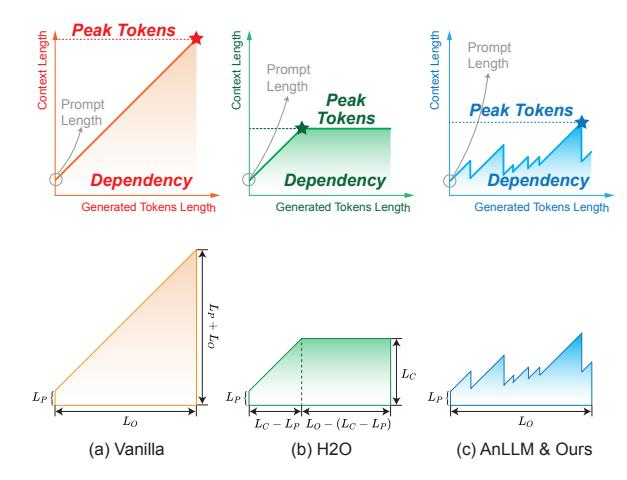

# A Metric: **Dependency**

> **[图片提取文字 (无描述)]:**
> Peak Tokens Context Length Context Length Context Length Prompt Length Prompt Length Peak Prompt Peak Tokens Tokens Length Dependency Dependency Dépendency Generated Tokens Length Generated Tokens Length Generated Tokens Length  $L_P + L_O$  $L_C$  $L_P$  $L_P$  $L_P$  $L_O$  $L_O$  $L_C - L_P L_O - (L_C - L_P)$ (a) Vanilla (b) H2O (c) AnLLM & Ours

Figure 6: Illustration of the metric Dependency.

