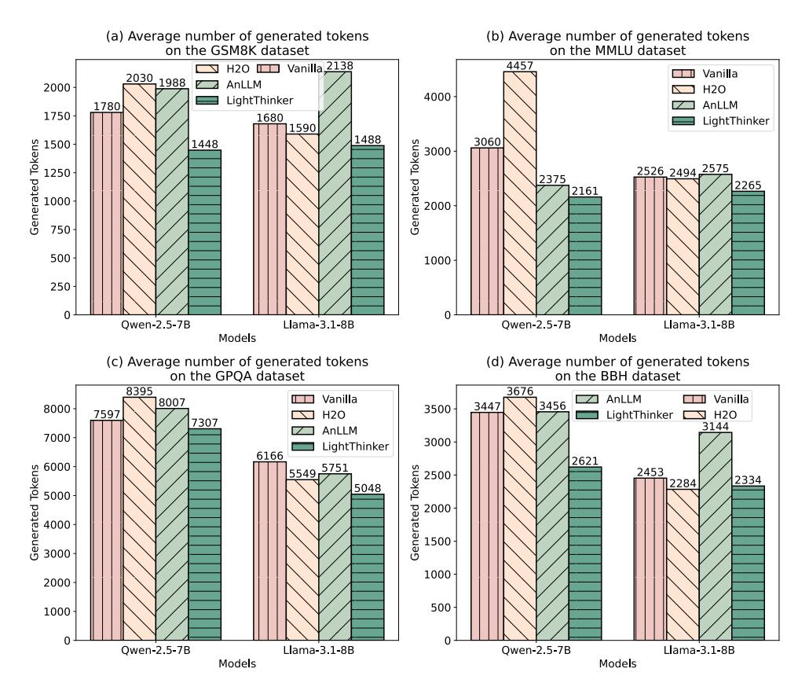

# D Related Work

Current research on accelerating the inference process of large language models (LLMs) primarily focuses on three categories of methods: *Quantizing Model*, *Generating Fewer Tokens*, and *Reducing KV Cache*. Quantizing Model includes both parameter quantization [\(Lin et al.,](#page-10-14) [2024;](#page-10-14) [Dettmers](#page-9-9) [et al.,](#page-9-9) [2022\)](#page-9-9) and KV Cache quantization [\(Liu et al.,](#page-10-15) [2024b;](#page-10-15) [Hooper et al.,](#page-9-10) [2024\)](#page-9-10), while this section will concentrate on the latter two categories. It is important to note that generating long texts and understanding long texts represent distinct application scenarios; therefore, acceleration methods specifically targeting the long-text generation phase (e.g.,

pre-filling stage acceleration techniques such as AutoCompressor [\(Chevalier et al.,](#page-8-6) [2023\)](#page-8-6), ICAE [\(Ge](#page-9-6) [et al.,](#page-9-6) [2024\)](#page-9-6), LLMLingua [\(Jiang et al.,](#page-10-10) [2023\)](#page-10-10), Activation Beacon [\(Zhang et al.,](#page-11-7) [2024b\)](#page-11-7), SnapKV [\(Li](#page-10-16) [et al.,](#page-10-16) [2024\)](#page-10-16), and PyramidKV [\(Cai et al.,](#page-8-8) [2024\)](#page-8-8)) are not discussed here. Below is a detailed overview of the last two categories.

Generating Fewer Tokens. This category can be further divided into three strategies based on the number and type of tokens used during inference. 1) *Discrete Token Reduction*. Techniques such as prompt engineering [\(Han et al.,](#page-9-1) [2024;](#page-9-1) [Ding](#page-9-2) [et al.,](#page-9-2) [2024;](#page-9-2) [Nayab et al.,](#page-10-1) [2024\)](#page-10-1), instruction finetuning [\(Liu et al.,](#page-10-2) [2024a;](#page-10-2) [Kang et al.,](#page-10-3) [2024\)](#page-10-3), or reinforcement learning [\(Arora and Zanette,](#page-8-2) [2025;](#page-8-2) [Luo et al.,](#page-10-4) [2025\)](#page-10-4) are used to guide LLMs to use fewer discrete tokens during inference. For example, TALE [\(Han et al.,](#page-9-1) [2024\)](#page-9-1) prompts LLMs to complete tasks under a predefined token budget. [Arora and Zanette](#page-8-2) construct specific datasets and employ reinforcement learning reward mechanisms to encourage models to generate concise and accurate outputs, thereby reducing token usage. 2) *Continuous Token Replacement*. These methods [\(Hao et al.,](#page-9-3) [2024;](#page-9-3) [Cheng and Durme,](#page-8-3) [2024\)](#page-8-3) explore using continuous-space tokens instead of traditional discrete vocabulary tokens. A representative example is CoConut [\(Hao et al.,](#page-9-3) [2024\)](#page-9-3), which leverages Curriculum Learning to train LLMs to perform inference with continuous tokens. 3)*No Token Usage*. By internalizing the inference process between model layers, the final answer is generated directly during inference without intermediate tokens [\(Deng et al.,](#page-9-5) [2024,](#page-9-5) [2023\)](#page-9-4). These three strategies are implemented after model training and do not require additional intervention during inference. Technically, the acceleration effect of these methods increases sequentially, but at the cost of a gradual decline in the generalization performance of LLMs. Additionally, the first strategy does not significantly reduce GPU memory usage.

Reducing KV Cache. This category can be divided into two types of strategies: pruning-based KV Cache selection in discrete space and mergingbased KV Cache compression in continuous space. 1) *Pruning-Based Strategies*. Specific eviction policies [\(Zhang et al.,](#page-11-5) [2023;](#page-11-5) [Xiao et al.,](#page-11-9) [2024;](#page-11-9) [Chen](#page-8-4) [et al.,](#page-8-4) [2024;](#page-8-4) [Wu et al.,](#page-11-10) [2024a\)](#page-11-10) are designed to retain important tokens during inference. For example, StreamingLLM [\(Xiao et al.,](#page-11-9) [2024\)](#page-11-9) considers the initial sink tokens and the most recent tokens as important. H2O [\(Zhang et al.,](#page-11-5) [2023\)](#page-11-5)

> **[图片提取文字 (无描述)]:**
> (a) Average number of generated tokens (b) Average number of generated tokens on the GSM8K dataset on the MMLU dataset 4457 H2O U Vanilla 2138 Vanilla 2030 1988 AnLLM 2000 4000 LightThinker 1780 AnLLM 1750 1680 LightThinker 1590 Generated 10kens 1500 250 750 1488 3060 1448 **Generated Tokens** 3000 2526 2494 2575 2375 2265 2161 2000 500 1000 250 Owen-2.5-7B Llama-3.1-8B Owen-2.5-7B Llama-3.1-8B Models Models (c) Average number of generated tokens (d) Average number of generated tokens on the GPQA dataset on the BBH dataset 8395 3676 ■ Vanilla ✓ AnLLM □□ Vanilla 8007 3456 3447 8000 3500 7597 H20 LightThinker **№** H2O 7307 3144 AnLLM 7000 3000 LightThinker 6166 Generated Tokens 0000 0000 0000 0000 2621 5549 5751 **Senerated Tokens** 2453 2500 2334 2284 5048 2000 1500 1000 2000 500 1000 0 Qwen-2.5-7B Llama-3.1-8B Qwen-2.5-7B Llama-3.1-8B Models Models

Figure 8: Average number of generated tokens.

focuses on tokens with high historical attention scores. SepLLM [\(Chen et al.,](#page-8-4) [2024\)](#page-8-4) emphasizes tokens corresponding to punctuation marks. 2) *Merging-Based Strategies*. Anchor tokens are introduced, and LLMs are trained to compress historically important information into these tokens, thereby achieving KV Cache merging [\(Pang et al.,](#page-10-9) [2024\)](#page-10-9). Both strategies require intervention during inference. The key difference is that the first strategy is training-free but applies the eviction policy for every generated token, while the second strategy is a training-based method and allows the LLM to decide when to apply the eviction policy.

