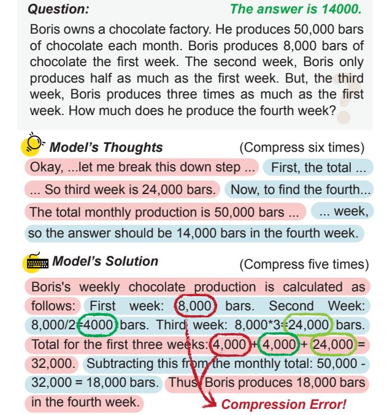

# 4.4 Ablation

Decoupled Token and Attention Mask Mode. LightThinker differs from AnLLM in two key as-

pects: the decoupled token design and the attention mask as shown in Figure [9.](#page-16-0) To validate the effectiveness of these mechanisms, we conduct ablation experiments. As shown in Table [4,](#page-7-0) under the same cache size setting and using AnLLM's attention mask mechanism ("AnLLM" vs. "Ours (|C| = 1, T)"), the decoupled design improves accuracy by 2%. Further adopting LightThinker's attention mask mode yields an additional 7% improvement. These results demonstrate the effectiveness of both the decoupled token and the attention mask mode in LightThinker.

Cache Size. We varied |C| in {1, 3, 5, 7, 9} to observe its impact on accuracy, inference time, dependency (i.e., Dep), peak tokens, generated token count, and compression frequency. Fig. [4\(](#page-6-0)e-g) illustrate these trends on the Qwen model. We observe that: 1) As shown in Figure [4\(](#page-6-0)e), increasing the cache size significantly improves accuracy while reducing inference time. This indicates that a larger cache size mitigates information loss caused by compression. 2) As shown in Figure [4\(](#page-6-0)g), increasing the cache size reduces both the compression frequency and the number of generated tokens. 3) Combining Fig. [4\(](#page-6-0)e) and Fig. [4\(](#page-6-0)g), we find that a smaller cache size leads to more frequent generation and compression to retain more information,

> **[图片提取文字 (无描述)]:**
> Question: The answer is 14000. Boris owns a chocolate factory. He produces 50,000 bars of chocolate each month. Boris produces 8,000 bars of chocolate the first week. The second week, Boris only produces half as much as the first week. But, the third week, Boris produces three times as much as the first week. How much does he produce the fourth week? Model's Thoughts (Compress six times) Okay, ...let me break this down step ... First, the total ... ... So third week is 24,000 bars. Now, to find the fourth... The total monthly production is 50,000 bars ... week, so the answer should be 14,000 bars in the fourth week. Model's Solution (Compress five times) Boris's weekly chocolate production is calculated as week: (8,000) bars. follows: First Second Week: 8,000/2(4000) bars. Third week: 8,000\*3:24,000) bars. Total for the first three weeks: (4,000)+(4,000)+(24,000)= 32,000. Subtracting this from the monthly total: 50,000 -32,000 = 18,000 bars. Thus Boris produces 18,000 bars in the fourth week. Compression Error!

Figure 5: Case Study. The figure illustrates partial inference results of a case from GSM8K. See App. C.5 for the complete content. Pink and light blue backgrounds are used to distinguish adjacent compression processes, where each color represents one compression.

while a larger cache size reduces this frequency.

## 4.5 Case Study

Fig. 5 illustrates a failure case from the GSM8K dataset. We observe that although the LLM arrives at the correct answer during the thinking process (see Model's Thoughts field in the Fig. 5), it makes an error in the final output (see Model's Solution field in the Figure). Specifically, in the third sentence of the Model's Solution field, the first occurrence of "4000" is incorrect. This indicates that information loss occurred during the second compression step (theoretically, "8000", "4000", and "24000" should have been compressed, but the LLM only compressed "4000" and "24000"), leading to subsequent reasoning errors. Such errors occur frequently in the GSM8K dataset, suggesting that the current compression method is not sufficiently sensitive to numerical values.

#### 5 Related Work

Current research on accelerating the inference process of LLMs primarily focuses on three categories of methods: *Quantizing Model, Generating Fewer Tokens*, and *Reducing KV Cache*. Quantizing Model includes both parameter quantizations.

|                 | GSM8K | MMLU  | GPQA  | BBH   | AVG   |
|-----------------|-------|-------|-------|-------|-------|
| AnLLM           | 78.39 | 54.63 | 19.70 | 54.95 | 51.92 |
| Ours ( C =1, T) | 78.32 | 58.23 | 20.71 | 55.35 | 53.15 |
| Ours ( C =1, F) | 80.21 | 58.23 | 22.22 | 62.02 | 55.67 |

Table 4: Ablation results on the Qwen, reporting accuracy on four datasets. "T" denotes the use of AnLLM's attention mask mechanism, while "F" indicates the use of LightThinker's attention mask mechanism.

tion (Liu et al., 2024) and KV Cache quantization (Liu et al., 2024b). Notably, generating long texts and understanding long-text represent distinct scenarios; therefore, acceleration methods specifically targeting the long-text generation phase (e.g., pre-filling stage acceleration techniques (Chevalier et al., 2023; Ge et al., 2024; Jiang et al., 2023; Zhang et al., 2024b; Li et al., 2024; Cai et al., 2024) are not discussed here. Due to page limits, we focus on the last one. See Appx. D for other details.

Reducing KV Cache. This category can be divided into two types of strategies: pruning-based KV Cache selection in discrete space and mergingbased KV Cache compression in continuous space. 1) Pruning-Based Strategies. Specific eviction policies (Zhang et al., 2023; Xiao et al., 2024; Chen et al., 2024) are designed to retain important tokens during inference. 2) Merging-Based Strategies. Anchor tokens are introduced, and LLMs are trained to compress historically important information into these tokens, thereby achieving KV Cache merging (Pang et al., 2024). Both strategies require intervention during inference. The key difference is that the first strategy is training-free but applies the eviction policy for every generated token, while the second is a training-based method and allows the LLM to decide when to apply the eviction policy.

#### 6 Conclusion

In this paper, we present LightThinker, a new approach to enhance the efficiency of LLMs in complex reasoning tasks by dynamically compressing intermediate thoughts during generation. By training the LLM to learn when and how to compress verbose thought steps into compact representations, LightThinker significantly reduces memory overhead and computational costs while maintaining competitive accuracy. We introduce the *Dependency* (abbr., Dep) metric to quantify the degree of compression across different accelerating methods. Extensive experiments demonstrate that LightThinker is an effective approach to balancing efficiency and performance.

