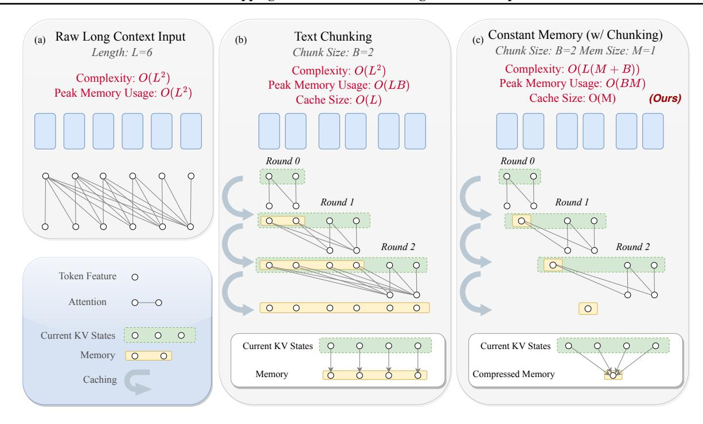

# 2.2. Long-Context Fine-tuning

The limited sequence length of pre-trained LLMs and their inability to handle long-context data effectively are major concerns for practitioners. To address this, strategies such as extending the context length through fine-tuning have been explored [Xiong et al.](#page-11-5) [\(2023\)](#page-11-5). The work of [Dai et al.](#page-9-3) [\(2019\)](#page-9-3) introduces a segment-level recurrence mechanism using fixed-length training segments. Other approaches include positional interpolation [\(Chen et al.,](#page-9-4) [2023a\)](#page-9-4), NTK-aware embedding [\(ntk,](#page-9-7) [2023\)](#page-9-7), Yarn [\(Peng et al.,](#page-10-16) [2023\)](#page-10-16), positional skipping [\(Zhu et al.,](#page-11-6) [2023\)](#page-11-6), self-extension [\(Jin et al.,](#page-10-17) [2024\)](#page-10-17), stabilized attention entropy [\(Zhang et al.,](#page-11-7) [2024\)](#page-11-7), and so on. Additionally, landmark attention [\(Mohtashami & Jaggi,](#page-10-18) [2023a\)](#page-10-18) introduces a gating mechanism based on landmark tokens, each representing a block of tokens. This method selectively retains "landmarks" in memory, utilizing other memory resources (e.g., CPU memory or disk) for storing the remaining tokens. [Tworkowski et al.](#page-11-8) [\(2023\)](#page-11-8) employs contrastive learning, LongLoRA [\(Chen et al.,](#page-9-6) [2023b\)](#page-9-6) introduces shifted sparse attention and parameter-efficient

fine-tuning. Zhang et al. (2023a) investigates the necessity of attending to long-context tokens in a layer-wise manner.

## 2.3. Attention Approximation

Efforts to mitigate the quadratic complexity of transformers primarily focus on attention approximation. A comprehensive review of the rich literature can be found in (Tay et al., 2022). Specifically, Child et al. (2019); Kitaev et al. (2020); Roy et al. (2021) leverages sparsity, and Choromanski et al. (2020); Katharopoulos et al. (2020); Wang et al. (2020) utilizes low-rank approximation. Beltagy et al. (2020); Zaheer et al. (2020) approximated the full attention with both local and global attention. Nevertheless, none of these approaches eliminate the memory bottleneck for the KV cache.

### 2.4. Language Model Design with Built-In Convolutions

(Dauphin et al., 2017) introduced the first convolutional language model that rivaled strong recurrent models on large-scale language tasks. More recently, (Poli et al., 2023; Arora et al., 2023) proposed using long convolutions to completely replace attention mechanisms in transformers. Additionally, state-space models (SSMs) can be computed as either convolutions or recurrences, achieving sub-quadratic training and constant inference complexity (Gu et al., 2021a). Architectures utilizing implicit convolutional filters (Poli et al., 2023) can be converted to SSMs via a simple distillation step (Poli et al., 2023; Massaroli et al., 2023). These designs inspired our research; however, our work has a different focus of providing "drop-in" components to enhance the long-context capability of pre-trained LLMs.

### 3. Methodology

## 3.1. Segment-Level Attention with Long Sequences

The attention mechanism (Vaswani et al., 2017) plays as a crucial component in transformers. Suppose the sequence length is L and the hidden dimension is d. In causal language modeling, an attention block receives query, key, and value matrices  $Q, K, V \in \mathbb{R}^{d \times L}$ , and computes outputs as:

$$\operatorname{Attn}(\boldsymbol{K},\boldsymbol{Q},\boldsymbol{V}) = \boldsymbol{V}\operatorname{softmax}\left(\boldsymbol{K}^{\top}\boldsymbol{Q}\odot\boldsymbol{M}/\sqrt{d}\right), \ \ (1)$$

where M is a lower-triangular causal mask. Intuitively, causal attention only allows tokens to aggregate information from past tokens. Given a sequence with L tokens  $X = \begin{bmatrix} x_1 & \cdots & x_L \end{bmatrix} \in \mathbb{R}^{d \times L}$ , the query, key, value matrices are computed as the linear projections of X:

$$K = W_K X, Q = W_O X, V = W_V X.$$
 (2)

As illustrated in the Figure 1 (a), acquiring full attention matrix softmax( $\mathbf{K}^{\top}\mathbf{Q}$ ) requires  $\mathcal{O}(L^2)$  peak memory cost.

```
Algorithm 1 Segment-level Attention (Training Time)Input: A full sequence of length L: x_1, \cdots, x_L, block size B, the number of segments N.Initialize an empty cached KV pairs as \widetilde{K}, \widetilde{V}.for n=1,\cdots,N doStep 1 - Let X_n = \begin{bmatrix} x_{nB} & \cdots & x_{(n+1)B-1} \end{bmatrix} \in \mathbb{R}^{d\times B} collect a sequence of the n-th segment.Step 2 - Calculate key, query, values: Q_n = W_Q X_n, K_n = W_K X_n, and V_n = W_V X_n.Step 3 - Perform attention as:O_n \leftarrow \operatorname{Attn}([\widetilde{K}, K_n], Q_n, [\widetilde{V}, V_n])Step 4 - Update cached KV pairs:\widetilde{K} \leftarrow [\widetilde{K}, K_n], \widetilde{V} \leftarrow [\widetilde{V}, V_n].end forReturn [O_1 & \cdots & O_N]
```

When L is large, i.e. handling long sequential data, full attention computation tend to run out of GPU memory rapidly.

Context chunking is a common practice for reducing peak memory usage during training. Owing to the causality, Transformer-XL (Dai et al., 2019) introduces a recurrent computation mechanism by caching and reusing the hidden states to extend the context length for both training and inference. Specifically, the whole sequence is divided into a couple of segments, each then processed sequentially. The intermediate key and value states will be stored in the memory. Previously cached KV pairs will be used for computing the token representation in the subsequent segments.

Algorithm 1 presents the detailed procedure for the training-time attention computation. Suppose the input sequence of length L can be divided into N segments, where each block has B tokens, i.e. L=NB. The symbol  $[\cdot,\cdot]$  therein denotes the concatenation of two matrices' columns.

Note that auto-regressive generation is a special case of segment-level attention at B=1. This is, tokens come in sequel and attention is only computed between the incoming query and past KV pairs. The cached KV pairs  $\widetilde{K}, \widetilde{V}$  are known as KV cache for short in the inference mode  $^1$ .

As illustrated in Figure 1(b), by performing context chunking, the memory used by attention for the r-th block is  $\mathcal{O}(B^2r)$ , and the memory to store past KV pairs is  $\mathcal{O}(Br)$ . Hence, the peak memory usage for computing the full attention is reduced to  $\mathcal{O}(LB)$ , which occurs at the N-th round when the last token needs to attend all previous key and value blocks  $\{K_n, V_n, n \in \{1, ..., N\}\}$ . The deduction of peak memory usage comes at the cost of increased caching memory, which grows linearly with the sequence length.

<span id="page-2-1"></span><sup>&</sup>lt;sup>1</sup>With a slight ambiguity, we also refer to the training-time saved KV pairs as the KV cache since their functionality is identical to their test-time counterparts.

> **[图片提取文字 (无描述)]:**
> (c) Constant Memory (w/ Chunking) (a) Raw Long Context Input Text Chunking (b) Chunk Size: B=2 Mem Size: M=1 Chunk Size: B=2 Length: L=6Complexity: O(L(M+B))Complexity:  $O(L^2)$ Complexity:  $O(L^2)$ Peak Memory Usage: O(BM)Peak Memory Usage: O(LB)Peak Memory Usage:  $O(L^2)$ Cache Size: O(M) Cache Size: O(L)(Ours) Round 0 Round 0 Round 1 Round 1 Round 2 Round 2 Token Feature 0 Attention 0 0 0 0 0 0 Current KV States 0 0 0 Current KV States Current KV States Memory O 0 ŏ Compressed Memory Memory Caching


Figure 1. Overview of our pipeline. We process the long sequences block-wisely and maintain a fixed-size compressed memory.

### 3.2. Convolution as a Context Compression Operator

So far, the peak memory footprint has been reduced from quadratic to linear concerning sequence length. However, this linear growth of the KV cache can still lead to excessive memory usage as the sequence length increases (Zhang et al., 2023b). Early attempts using k-NN lookup (Wu et al., 2022) and gating mechanisms (Mohtashami & Jaggi, 2023b) enable sparse token selection to save memory but still require caching all previous tokens, resulting in a cache size of  $\mathcal{O}(L)$ . In this section, we introduce a framework that further optimizes this linear complexity to a constant size.

Compressing past token information using a fixed-size hidden space is well-documented in the literature. Notably, State Space Models (SSMs) utilize a fixed-dimension latent vector to represent all prior tokens, showing great promise for long-sequence modeling (Gu et al., 2021b;a; 2020; 2022; Gupta et al., 2022; Fu et al., 2022; Gu & Dao, 2023). This hidden vector interacts with incoming tokens on behalf of all previous tokens.

Inspired by this, we propose allocating at most M slots to store past KV pairs, allowing subsequent sequence blocks to attend to these compressed KV states. We replace the simple concatenation in Step 4 with a KV compression operator  $\mathcal{C}$ :

$$\widetilde{\boldsymbol{K}} \leftarrow \mathcal{C}([\widetilde{\boldsymbol{K}}, \boldsymbol{K}_n]), \quad \widetilde{\boldsymbol{V}} \leftarrow \mathcal{C}([\widetilde{\boldsymbol{V}}, \boldsymbol{V}_n]),$$
 (3)

where C maps a longer sequence to a sequence of length M. We next elaborate on our instantiation of C.

#### 3.2.1. CONVOLUTIONAL TOKEN COMPRESSOR

There are various ways to implement the sequence function  $\mathcal{C}$  to meet the above definition. In this paper, we propose modeling the update rule of the KV cache as a weighted fusion between existing cache entries and newly input tokens. Formally, for all  $\forall i \in [M]$ :

<span id="page-3-1"></span><span id="page-3-0"></span>
$$\widetilde{\boldsymbol{k}}_i \leftarrow \sum_{j=1}^B w_{i,j} \boldsymbol{k}_j + \sum_{j=1}^M \widetilde{w}_{i,j} \widetilde{\boldsymbol{k}}_j$$
 (4)

<span id="page-3-2"></span>
$$\widetilde{\boldsymbol{v}}_i \leftarrow \sum_{j=1}^B w_{i,j} \boldsymbol{v}_j + \sum_{j=1}^M \widetilde{w}_{i,j} \widetilde{\boldsymbol{v}}_j,$$
 (5)

where  $w_{i,j}$  denotes the contribution of the j-th token in the input block to the i-th entry in the cache, and similarly  $\widetilde{w}_{i,j}$  the contribution of the j-th token in the existing cache to the i-th entry in the updated cache. Here weights for keys and values are shared to preserve token correspondence.

<span id="page-3-3"></span>We further identify three key properties desired for  $\{w_{i,j}\}$  and  $\{\widetilde{w}_{i,j}\}$ : 1) Efficiency: computing these weights is an intermediate step of performing attention, and hence its overheads should be negligible - otherwise we beat our purpose. 2) Learnability: Ad-hoc  $\{w_{i,j}\}$  and  $\{\widetilde{w}_{i,j}\}$ , such as averaging (i.e., uniform weights) or heuristic-based token dropping (i.e., many zero weights) (Zhang et al., 2023b), may not be flexible enough or introduce extra bias (e.g., locality (Chen et al., 2023b) or "lost in the middle" (Liu et al., 2023)). 3) Stationarity: the compression policy must

be globally informed and stable concerning token position, ensuring that compressed KV states update continuously as tokens are processed. This addresses the potential disruptions in KV states caused by dropping tokens during the generative process (Zhang et al., 2023b).

It has not escaped our notice that convolutional kernels fulfill all the aforementioned requirements. Therefore, we propose using convolutional layers to generate  $w_{i,j}$  and  $\widetilde{w}_{i,j}$ . Specifically, a 1D convolution will process all the pairs existing in the KV cache and the newly incoming segment, assigning each token an M-dimensional output that indicates its importance for each slot in the updated cache. Formally, we denote  $g: \mathbb{R}^{2d \times (M+B)} \to \mathbb{R}^{M \times (M+B)}$  as a Convolutional Neural Network (CNN) with 2d input channels and M output channels. Then weights  $\{w_{i,j}\}$  and  $\{\widetilde{w}_{i,j}\}$  are computed as:

$$\bm{W} \leftarrow \bm{g} \circledast \begin{bmatrix} \bm{K}_n & \widetilde{\bm{K}} \\ \bm{V}_n & \widetilde{\bm{V}} \end{bmatrix} \in \mathbb{R}^{M \times (M+B)},$$
 (6)

$$w_{i,j} \leftarrow \frac{\boldsymbol{W}_{i,j}}{\sum_{k=1}^{M+B} \boldsymbol{W}_{i,k}}, \quad \widetilde{w}_{i,j} \leftarrow \frac{\boldsymbol{W}_{i,j+B}}{\sum_{k=1}^{M+B} \boldsymbol{W}_{i,k}}, \quad (7)$$

where  $\circledast$  denotes multi-channel convolution operation along columns of two operands. Here we normalize the prediction from the CNN kernel g as the final blending weights. Convolution parameters are trained end-to-end with a small set of calibration data.

We name our approach as  $Long\ Context\ Compression\ by\ Dropping-In\ Convolutions$ , or LoCoCo for short. We summarize the outline of LoCoCo in Algorithm 2, where the major differences from Algorithm 1 are highlighted in Steps 4 and 5. When the number of KV entries to be stored  $\#(\widetilde{K},\widetilde{V})+B$  surpasses the number of slots M, we apply convolution-based compression between cached entries and newly added KV pairs. Otherwise, we preserve all KV pairs in the memory. In our implementation, we adopt a shallow CNN for each attention layer. The convolutional head consists of a single convolution layer with kernel size 21. In addition, we prepend a ReLU as the activation function.

## 3.2.2. COMPLEXITY ANALYSIS

With negligible computational overhead, LoCoCo achieves **constant memory** regardless of sequence length. In Step 3, the attention is computed between a group of M tokens and a group of B tokens. The memory cost for this step is maintained as  $\mathcal{O}(MB)$ . Step 4 synthesizes fusion weights via convolution, whose computation complexity can be as cheap as  $\mathcal{O}(L\log L)$  by Fourier transformation. Afterward, Step 5 leads to a constant-size cache, which guarantees the computation in the next round does not require more memory. Therefore, the total peak memory cost is  $\mathcal{O}(MB+M)$  with an extra  $\mathcal{O}(L\log L)$  computation overhead.

```
Algorithm 2 LoCoCo Attention (Training Time)
Input: A full sequence of length L: x_1, \dots, x_L, block
size B, the number of segments N, the number of total
cached KV entries M.
Initialize an empty cached KV pairs as \widetilde{K}, \widetilde{V}.
for n=1,\cdots,N do
    Step 1 - Let X_n = \begin{bmatrix} x_{nB} & \cdots & x_{(n+1)B-1} \end{bmatrix} \in
     \mathbb{R}^{d \times B} collect a sequence of the i-th segment.
    Step 2 - Calculate key, query, values: Q_n = W_Q X_n,
     \boldsymbol{K}_n = \boldsymbol{W}_K \boldsymbol{X}_n, and \boldsymbol{V}_n = \boldsymbol{W}_V \boldsymbol{X}_n.
     Step 3 - Perform attention as:
                  O_n \leftarrow \operatorname{Attn}([\widetilde{\boldsymbol{K}}, \boldsymbol{K}_n], \boldsymbol{Q}_i, [\widetilde{\boldsymbol{V}}, \boldsymbol{V}_n])
    if \#(\widetilde{\boldsymbol{K}}, \widetilde{\boldsymbol{V}}) + B \leq M then
        Fill KV cache: \widetilde{\widetilde{K}} \leftarrow [\widetilde{K}, K_n], \widetilde{V} \leftarrow [\widetilde{V}, V_n].
          Step 4 - Compute fusion weights as:
          \{w_{i,j}\} and \{\widetilde{w}_{i,j}\} \leftarrow Equations 6 and 7.
          Step 5 - Update cached KV pairs: \forall i \in [M],
          \widetilde{\boldsymbol{k}}_i \leftarrow \text{Equation 4, } \widetilde{\boldsymbol{q}}_i \leftarrow \text{Equations 5.}
    end if
end for
```

#### 3.2.3. Connection with Token Dropping

<span id="page-4-2"></span><span id="page-4-1"></span>**Return**  $[O_1 \cdots O_N]$ 

Zhang et al. (2023b) proposes to use accumulated attention scores to determine the importance of tokens. The method then auto-regressively keeps tokens with the top scores and discards others. That can be viewed as a special instance of operator  $\mathcal{C}$  in Equation 3. However, the heuristic-based method is less expressive compared to our learnable framework. Specifically, as detailed in Section 4.2 and Section 4.3, LoCoCo, empowered by the general learnable token compression paradigm, demonstrates superior performance compared to prior arts in token eviction. In addition, our method can be executed on top of other token eviction methods, as to be discussed in Section 5.2.

### 3.3. Dropping-In Integration of LoCoCo

In this section, we introduce how our technique can be easily integrated to pre-trained LLMs, for both long-context inference and long-context training purposes.

**Long-Context Efficient Inference** Standard LLMs cache all previous KV pairs, resulting in high memory usage that limits their applicability in memory-constrained inference. To address this, we "drop in" a compressor on top of the pre-trained weights. The compressor is optimized using Algorithm 2 with a minimal fraction of the training data (e.g., 104 million tokens, or 0.0052% of the 2 trillion tokens used for Llama-2 pre-training (Touvron et al., 2023)).

During the pre-filling stage, prompts are split into segments of size B before being fed into the LLM. These segments sequentially pass through the LLM, generating and compressing KVs via Equation [3,](#page-3-3) resulting in compressed KVs of length M that encapsulate the context information. In the generation stage, the segment length is set to 1. Detailed results are provided in Section Section [4.2.](#page-5-0)

As our "dropping-in" term implies, *the pre-trained weights remain unchanged*, allowing users to switch back to the uncompressed mode simply by removing the compressor heads, when sufficient resources are available for a linearly scaled KV cache.

Long-Context Extension Our method also supports long context extension through post-training tuning, allowing pretrained LLMs to handle longer contexts without incurring the excessive memory costs. We achieve this by leveraging positional interpolation [\(Chen et al.,](#page-9-4) [2023a\)](#page-9-4), inserting compressor heads, and adding LoRA adapters to fine-tune the pre-trained model, following [Chen et al.](#page-9-6) [\(2023b\)](#page-9-6)'s practice. The fine-tuning procedure is detailed in Algorithm [2.](#page-4-0)

