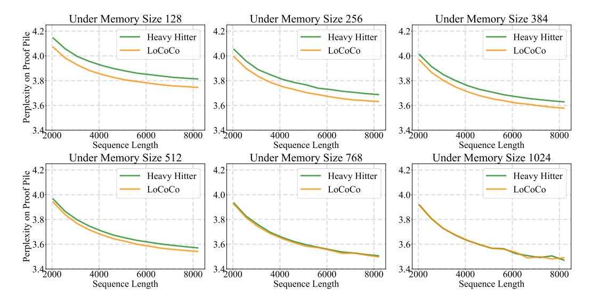

# 5. Ablation

### 5.1. Effectiveness under Different Memory Sizes

We vary the memory size during fine-tuning, ranging from 128 to 1024, and compare our method with [\(Zhang et al.,](#page-11-2) [2023b\)](#page-11-2). Based on the pre-trained model Llama-2 [\(Tou](#page-11-14)[vron et al.,](#page-11-14) [2023\)](#page-11-14) whose maximal context length is 4096, we extend it to the length of 8192, on dataset RedPajama [\(Computer,](#page-9-19) [2023\)](#page-9-19). We evaluate the models on Proof-Pile-2 [\(Azerbayev et al.,](#page-9-22) [2023\)](#page-9-22) in terms of perplexity. As in Figure [3,](#page-8-2) our method shows exceptional performance especially at large compression ratios, indicating that LoCoCo could generate more expressive compressed tokens compared to heavy-hitters.

> **[图片提取文字 (无描述)]:**
> Under Memory Size 128 Under Memory Size 256 Under Memory Size 384 4.2 4.2 Perplexity on Proof Pile 3.8 Heavy Hitter Heavy Hitter Heavy Hitter LoCoCo LoCoCo LoCoCo 4.0 4.0 3.8 3.8 3.6 3.6  $3.4\frac{1}{2000}$  $3.4^{1}_{2000}$  $3.41_{2000}$ 8000 4000 6000 4000 6000 8000 4000 6000 8000 Sequence Length Sequence Length Sequence Length Under Memory Size 768 Under Memory Size 1024 Under Memory Size 512 4.2 4.2 Perplexity on Proof Pile 3.8 Heavy Hitter Heavy Hitter Heavy Hitter LoCoCo LoCoCo LoCoCo 4.0 4.0 3.8 3.8 3.6 3.6  $3.4^{1}_{2000}$  $3.4^{1}_{2000}$ 2000 8000 8000 4000 6000 4000 6000 4000 6000 8000 Sequence Length Sequence Length Sequence Length

Figure 3. Varying memory sizes during fine-tuning, evaluated on Proof-Pile-2 [\(Azerbayev et al.,](#page-9-22) [2023\)](#page-9-22). Compared to [\(Zhang et al.,](#page-11-2) [2023b\)](#page-11-2), our method shows exceptional performance at large compression ratios, indicating the expressiveness of the merged token.

Table 6. Our method could be performed solely or combined with multiple token eviction methods.

| Method                 | Perplexity |
|------------------------|------------|
| H2O                    | 3.5714     |
| LoCoCo                 | 3.5451     |
| LoCoCo w. StreamingLLM | 3.5439     |
| LoCoCo w. H2O          | 3.5414     |

