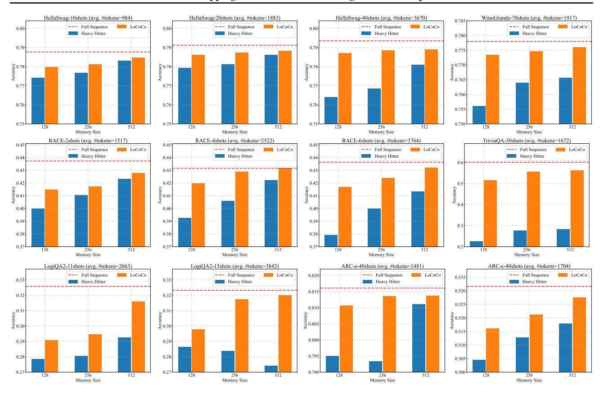

# 4.3. Extending Context Length with Limited Memory

In this section, we set the memory size to 512 and extend the pre-trained context length of Llama-2 [\(Touvron et al.,](#page-11-14) [2023\)](#page-11-14) from 4096 to 8192, 16384, and 32768 using the Red-

> **[图片提取文字 (无描述)]:**
> HellaSwag-10shots (avg. #tokens=984) HellaSwag-20shots (avg. #tokens=1883) HellaSwag-40shots (avg. #tokens=3670) WinoGrande-70shots (avg. #tokens=1917) --- Full Sequence --- Full Sequence --- Full Sequence --- Full Sequence LoCoCo LoCoCo 0.80 0.80 0.80 Heavy Hitter Heavy Hitter Heavy Hitter Heavy Hitter 0.79 0.79 Уоспио О.765 0.77 0.77 0.77 0.760 0.76 0.76 0.76 0.755 0.75 0.75 0.750 512 512 512 128 256 128 256 256 256 512 128 Memory Size Memory Size Memory Size Memory Size RACE-4shots (avg. #tokens=2522) RACE-6shots (avg. #tokens=3764) RACE-2shots (avg. #tokens=1517) TriviaQA-50shots (avg. #tokens=1672) 0.45 0.45 --- Full Sequence --- Full Sequence --- Full Sequence LoCoCo --- Full Sequence LoCoCo LoCoCo LoCoCo Heavy Hitter Heavy Hitter Heavy Hitter Heavy Hitter 0.44 0.44 0.44 0.43 0.43 0.42 0.42 0.40 0.40 0.40 0.39 0.39 0.39 0.38 0.38 0.38 0.37 0.37 0.37 256 Memory Size 256 Memory Size 128 512 128 512 512 128 128 512 Memory Size Memory Size LogiOA2-11shots (avg. #tokens=2663) LogiOA2-15shots (avg. #tokens=3842) ARC-e-40shots (avg. #tokens=1481) ARC-c-40shots (avg. #tokens=1704) --- Full Sequence --- Full Sequence --- Full Sequence LoCoCo --- Full Sequence LoCoCo LoCoCo LoCoCo 0.820 0.535 0.33 Heavy Hitter Heavy Hitter Heavy Hitter 0.530 0.81: 0.32 0.525 0.810 O.31 Vccnracy 0.30 0.31 g 0.520 0.805 ₽ 0.30 0.515 0.800 0.29 0.29 0.795 0.28 0.28 0.505 0.27 0.27 0.790 0.500 128 512 128 256 512 128 256 512 128 256 512 Memory Size Memory Size Memory Size Memory Size

Figure 2. Token merging via convolutional kernels as the drop-in" integration without modifying the original weights. Based on Llama-2- 7B [\(Touvron et al.,](#page-11-14) [2023\)](#page-11-14), we inserted the convolutional heads on the top of self-attention, and tested the model performance on various few-shot downstream tasks. The input sequence typically consists of about 2000 tokens. We compare our method with [Zhang et al.](#page-11-2) [\(2023b\)](#page-11-2), a token eviction strategy. We also provide the uncompressed case, where the model uses the full sequence.

Table 1. LoCoCo applied to the ChatGLM3-6B-32k [\(Du et al.,](#page-9-21) [2021\)](#page-9-21) base model, and validated on SCROLLS [\(Shaham et al.,](#page-10-5) [2022\)](#page-10-5).

| SCORLLS Task  | QuALITY | Qasper | SummScreen | GovReport | QMSum  | NarrativeQA |
|---------------|---------|--------|------------|-----------|--------|-------------|
| H2O           | 0.4351  | 0.3919 | 0.2498     | 0.3411    | 0.2137 | 0.2433      |
| ours          | 0.4689  | 0.4284 | 0.2611     | 0.3617    | 0.2310 | 0.2576      |
| full sequence | 0.4769  | 0.4314 | 0.2636     | 0.3669    | 0.2378 | 0.2605      |

Pajama pre-training dataset [\(Computer,](#page-9-19) [2023\)](#page-9-19). We conduct experiments on the 7B and 13B models and report perplexity on Proof-Pile-2 [\(Azerbayev et al.,](#page-9-22) [2023\)](#page-9-22). We also validate the model performance under shorter context lengths.

The results are provided in Table [2.](#page-7-1) Besides [Zhang et al.](#page-11-2) [\(2023b\)](#page-11-2), we also compare with StreamingLLM [\(Xiao et al.,](#page-11-3) [2023\)](#page-11-3), a method handling contexts longer than the pretrained length in a zero-shot manner. Additionally, we compare with LongLoRA [\(Chen et al.,](#page-9-6) [2023b\)](#page-9-6), which utilizes only local tokens without considering global information. Finally, we evaluate the model tuned with uncompressed full sequence length. When combining our proposed token merging with eviction, our method demonstrates superior performance over the aforementioned methods, and shows

comparable performance with the uncompressed scenario.

To further validate our effectiveness, we report our results on LongBench [\(Bai et al.,](#page-9-23) [2023\)](#page-9-23) in Table [4.](#page-7-2) We adopt Llama2- 13b [\(Touvron et al.,](#page-11-14) [2023\)](#page-11-14) and extend the maximum context length to 32K. Compared to LongLoRA [\(Chen et al.,](#page-9-6) [2023b\)](#page-9-6) and H2O [\(Zhang et al.,](#page-11-2) [2023b\)](#page-11-2), our method again achieves superior performance.

## 4.4. Memory and Throughput Measurement

We first test our GPU memory usage during training (tuning): the memory is measured when extending the context length of Llama2-7B to 16k. As shown in Table [5,](#page-7-3) performing training directly on the full sequence will exhaust all GPU memory (resulting in "OOM"). In contrast, our method

Table 2. Perplexity evaluated on Proof-Pile-2[\(Azerbayev et al.,](#page-9-22) [2023\)](#page-9-22). We fine-tuned Llama-2-7B [\(Touvron et al.,](#page-11-14) [2023\)](#page-11-14) to extend the context length from 4K to 8K, 16K, and 32K, respectively. Additionally, we fine-tuned Llama-2-13B, extending the 4K context length to 8K. T denotes the sequence length of the training data, whereas L indicates the chunk size.

|      | Training   |               | Attention        | Evaluation Context Length |        |        |        |        |
|------|------------|---------------|------------------|---------------------------|--------|--------|--------|--------|
| Size | Length (T) | Method        | Complexity       | 2048                      | 4096   | 8192   | 16384  | 32768  |
|      |            | StreamingLLM  | O(L × (L + 8))   | 4.0373                    | 4.0174 | 4.0551 | -      | -      |
|      |            | LongLoRA      | 2 O(L )    | 4.0526                    | 3.8111 | 3.6877 | -      | -      |
|      |            | H2O           | O(L × (L + 512)) | 3.9653                    | 3.7043 | 3.5706 | -      | -      |
|      | 8192       | Ours          | O(L × (L + 512)) | 3.9411                    | 3.6775 | 3.5414 | -      | -      |
|      |            | Full Sequence | O(L × T)         | 3.9325                    | 3.6558 | 3.5070 |        |        |
|      |            | StreamingLLM  | O(L × (L + 8))   | 4.0373                    | 4.0174 | 4.0551 | 4.0334 | -      |
|      |            | LongLoRA      | 2 O(L )    | 4.0704                    | 3.8125 | 3.6928 | 3.6279 | -      |
|      | 16384      | H2O           | O(L × (L + 512)) | 3.9842                    | 3.7173 | 3.5974 | 3.5458 | -      |
|      |            | Ours          | O(L × (L + 512)) | 3.9628                    | 3.6958 | 3.5763 | 3.5058 | -      |
| 7b   |            | Full Sequence | O(L × T)         | 3.9491                    | 3.6619 | 3.5094 | 3.4801 | -      |
|      |            | StreamingLLM  | O(L × (L + 8))   | 4.0373                    | 4.0174 | 4.0551 | 4.0334 | 4.0171 |
|      |            | LongLoRA      | 2 O(L )    | 4.0891                    | 3.8348 | 3.7161 | 3.6276 | 3.5916 |
|      | 32768      | H2O           | O(L × (L + 512)) | 4.0564                    | 3.8179 | 3.6570 | 3.5634 | 3.5102 |
|      |            | Ours          | O(L × (L + 512)) | 4.0253                    | 3.8078 | 3.5807 | 3.5145 | 3.4408 |
|      |            | Full Sequence | O(L × T)         | 3.9803                    | 3.7703 | 3.5011 | 3.4836 | 3.4012 |
|      |            | StreamingLLM  | O(L × (L + 8))   | 3.6979                    | 3.7013 | 3.7022 | -      | -      |
|      | LongLoRA   | 2 O(L ) | 3.7153           | 3.5902                    | 3.4511 | -      | -      |        |
|      |            | H2O           | O(L × (L + 512)) | 3.6823                    | 3.5482 | 3.4073 | -      | -      |
| 13b  | 8192       | Ours          | O(L × (L + 512)) | 3.6798                    | 3.4953 | 3.3697 | -      | -      |
|      |            | Full Sequence | O(L × T)         | 3.6412                    | 3.4506 | 3.3421 | -      | -      |

Table 3. Performance on representative long-context task SCROLLS. [\(Shaham et al.,](#page-10-5) [2022\)](#page-10-5)

| SCORLLS Task  | QuALITY | Qasper | SummScreen | GovReport | QMSum  | NarrativeQA |
|---------------|---------|--------|------------|-----------|--------|-------------|
| LongLoRA      | 0.3395  | 0.2421 | 0.1712     | 0.2891    | 0.1792 | 0.1754      |
| H2O           | 0.3461  | 0.2659 | 0.1885     | 0.2924    | 0.1913 | 0.1849      |
| LoCoCo        | 0.3528  | 0.2813 | 0.1903     | 0.3113    | 0.2089 | 0.1902      |
| full sequence | 0.3600  | 0.2828 | 0.1945     | 0.3125    | 0.2125 | 0.1942      |

Table 4. Evaluation on LongBench [\(Bai et al.,](#page-9-23) [2023\)](#page-9-23).

| Method    | LongLoRA | H2O   | LoCoCo |
|-----------|----------|-------|--------|
| LongBench | 34.7%    | 36.9% | 37.4%  |

Table 5. Comparison on memory usage (during training) and throughput (during inference).

| Method               | LongLoRA | H2O  | LoCoCo | Full Sequence |
|----------------------|----------|------|--------|---------------|
| Memory Usage         | 49GB     | 50GB | 50GB   | OOM           |
| Throughput (Token/s) | 25       | 32   | 33     | 11            |

only requires an additional 1GB of memory compared to LongLoRA [\(Chen et al.,](#page-9-6) [2023b\)](#page-9-6) and uses the same amount of memory as H2O [\(Zhang et al.,](#page-11-2) [2023b\)](#page-11-2).

We then measure the throughput during inference, at the pre-filling stage. The pre-filling length is set to be 16k. As shown in Table [5,](#page-7-3) our method achieves superior throughput compared to all baselines at inference. For all aforementioned experiments, we set the batch size to 1, and the block size and the KV cache memory size to both 512. We use Flash Attention v2 [\(Dao,](#page-9-24) [2023\)](#page-9-24) and DeepSpeed Stage 2 by

default. The measurements are conducted on the NVIDIA A100 80GB GPU, confirming our inference efficiency.

