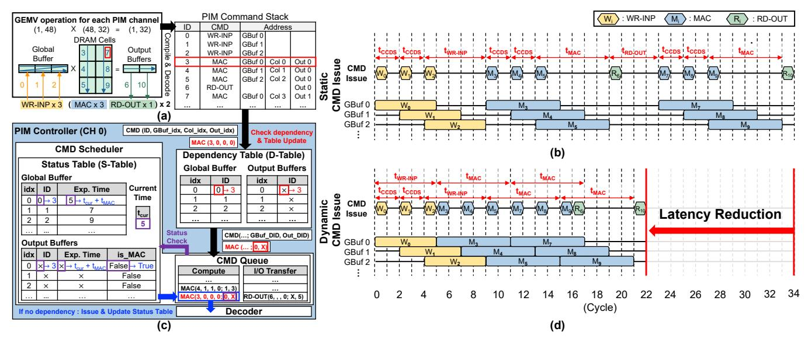
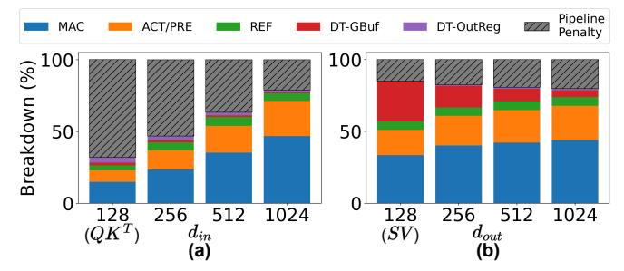

# B. Analysis of HFP under Tensor and Pipeline Parallelism

Tensor parallelism (TP) and pipeline parallelism (PP) organize LLM execution across PIM modules at different granularities—TP partitions attention heads across modules, while PP distributes consecutive layers. Under both schemes, however, the intra-module channel allocation remains governed by headfirst partitioning (HFP), which ultimately determines how workloads are mapped to individual PIM channels.

Load Imbalance from HFP under TP. Under TP, HFP leads to load imbalance when requests have different token lengths, leading to varied execution times across channels. Channels assigned to shorter sequences finish their computations earlier and must wait for those processing longer sequences, limiting the overall throughput to that of the slowest channel and reducing effective parallelism. For example, in Fig. 6(b), Channel 2 and 3 are assigned to Request 2 with a shorter token length and thus performs less computation, becoming idle while other channels continue execution. Although short-context systems can mitigate such imbalance by assigning multiple requests per channel for load balancing (e.g., NeuPIMs [21]), this approach becomes infeasible in long-context inference, where a single request can fully occupy a channel's memory capacity.

Sparse Channel Activation from HFP under PP. Under PP, HFP activates only the subset of channels associated with the request assigned to each pipeline stage. In long-context scenarios, where a single request can occupy an entire channel, this results in sparsely populated stages with many idle channels. As illustrated in Fig. 6(c), only a fraction of the available channels are active at any given time. This stage-

level idling, compounded by pipeline bubbles that form when subsequent stages are empty, results in persistent underutilization—a problem especially pronounced with the limited batch sizes of long-context workloads.

#### C. Intra-Module Token-Centric Partitioning

To overcome the channel underutilization inherent in HFP, we introduce Token-Centric PIM Partitioning (TCP). TCP partitions the token dimension of a single head across all available PIM channels, enabling token-level parallelism within each PIM module. In  $QK^T$  operations, each channel processes a distinct segment of tokens concurrently, enabling parallel computation across the module. In SV operations, each channel performs token-wise partial reduction over its assigned tokens, and the partial results are reduced through the shared PIM HUB and GPR to produce the final output. For example, in Fig. 6, assume each channel contains 16 banks, with a total token length of 16K and a head dimension of 32. Under this configuration,  $QK^T$  assigns 4K tokens to each channel for parallel computation, while SV assigns 2K tokens per channel and performs a single global reduction across channels through the PIM HUB to generate the final result.

TCP enables full channel activation in long-context inference, where the token sequence length is sufficiently large to keep all processing units active. As illustrated in Fig. 6(d) and (e), TCP distributes token computations across channels, ensuring full channel activation. Under TP, TCP mitigates token-length imbalance across requests that previously caused idle channels, while under PP, TCP allows all channels to participate concurrently regardless of the active pipeline stage. Under a commercial PIM module [62] configuration with 16 channels and 16 banks per channel, full channel activation is achieved once the token length exceeds 256 for QKT and 32 for SV.

Under TCP, each PIM channel produces partial outputs that must be combined within the module to form a complete result. This aggregation step operates at the inter-channel level,

> **[图片提取文字 (无描述)]:**
> PIM Command Stack : RD-OUT GEMV operation for each PIM channel CMD Address X (48, 32) = (1, 48)(1, 32)WR-INP GBuf 0 DRAM Cells WR-INP GBuf 1 Global Output WR-INP GBuf 2 Buffer Buffers GBuf 0 Col 0 Out 0 MAC CMD MAC GBuf 1 Col 1 Out 0 Static Issue GBuf 2 Col 2 Out 0 MAC Ś RD-OUT Out 0 Ð MAC GBuf 0 Col 3 Out 1 WR-INP x 3 (MAC x 3 RD-OUT x 1) x 2 GBuf 0 GBuf 1 Ma (a) GBuf 2 i-PIM Controller (CH 0) CMD (ID, GBuf\_idx, Col\_idx, Out\_idx) Check dependency & Table Update MAC (3, 0, 0, 0) CMD Scheduler (b) Dependency Table (D-Table) Status Table (S-Table) Global Buffer **Output Buffers** Global Buffer idx idx ID Current Exp. Time 0 → 3 × → 3 0 ssue Time 5 - tour + twac Dynamic CMD Issue GBuf 0 × **Latency Reduction** tcur Status CMD(...; GBuf DID, Out DID) Check **Output Buffers** MAC (...; 0, X) GBuf 1 Ma Ma is MAC Exp. Time CMD Queue Me GBuf 2  $\times \rightarrow 3 \times \rightarrow t_{our} + t_{MAC}$  False  $\rightarrow$  True I/O Transfer Compute False False MAC(4, 1, 1, 0; 1, 3) RD-OUT(6, , , 0; X, 5) MAC(3, 0, 0, 0; 0, X (Cycle) If no dependency: Issue & Update Status Table Decoder (d) (c)

Fig. 7: Dynamic PIM Command Scheduling. (a) A GEMV operation example and its command stack, (b) timing diagram for baseline PIM command schedule, (c) detailed Dynamic PIM Command Scheduling (DCS) example within the PIM controller, and (d) resulting timing diagram after DCS where MAC instructions can be executed in advance. In (b)&(d), Each GB 0/1/2 denotes an entry of a Global Buffer.

where outputs from different channels are gathered through the general-purpose registers (GPR) at the PIM HUB and finalized by the Extra Processing Unit (EPU) (Fig. 3(a)). For  $QK^T$ , the aggregation after matrix multiplication involves only concatenation during the subsequent Softmax in the EPU, incurring no measurable latency. Meanwhile, SV performs a single interchannel reduction per module, whose cost is minimal—below 0.2% of total attention latency for an LLM-7B with 16K tokens. Because TCP partitions tokens only within a module, it avoids inter-module synchronization, keeping aggregation and synchronization overhead negligible.

#### V. DYNAMIC PIM COMMAND SCHEDULING

#### A. PIM Command Execution Overview

Modern PIM architectures follow a command-driven execution model where primitive operations—WR-INP, MAC, and RD-OUT—are issued sequentially to hardware units (see Table III). WR-INP writes a 32B tile to a Global Buffer (GBuf) entry, MAC reads that entry for multiplication and accumulates results into per-bank OutRegs and RD-OUT drains a 2B result from all 16 banks concurrently (32B in total). These primitives are composed into a command stack to perform computation. For example, the FP16 GEMV in Fig. 7(a) is executed by streaming the input tiles via WR-INP, accumulating partial dot products with MAC, and retrieving the output tiles with RD-OUT. Due to the pipelined operation of the data bus, transferring 32B tiles has a minimum commandto-command interval  $(t_{CCDS})$ . As illustrated in Fig. 7(b), successive WR-INPs  $(W_0, W_1, W_2)$  are issued  $t_{CCDS}$  cycles apart, pipelining the streaming of input tiles.

Conventional PIM controllers [37], [62] execute commands using *static scheduling*: the controller issues commands strictly in-order in a fixed WR-INP  $\rightarrow$  MAC  $\rightarrow$  RD-OUT pattern (as generated from the instruction stream). To avoid data hazards,

it decides issue by enforcing time gaps derived from fixed command execution times ( $t_{\text{WR-INP}}$ ,  $t_{\text{MAC}}$ ,  $t_{\text{RD-OUT}}$ ) between commands. For example, a MAC must wait at least  $t_{\text{WR-INP}}$  after the preceding WR-INP to ensure the input tile is fully written into the GBuf. As shown in Fig. 7(b), this approach needlessly serializes operations, causing pipeline stalls even when no true data dependency exists between commands (e.g., the input write  $W_2$  and the computation  $M_3$ , or the output read  $R_6$  and computation  $M_7$ ).

#### B. I/O Bottleneck Analysis

Attention layers inherently incur frequent I/O transfers (WR-INP, RD-OUT) due to their significantly lower data reuse compared to fully-connected (FC) layers. This effect is particularly pronounced in Attention's core operations: in  $QK^T$ , a small input dimension  $(d_{in})$  reduces output reuse, while in SV, a small output dimension  $(d_{out})$  limits input reuse. In both cases, the reduced data reuse necessitates more frequent I/O transfers. Moreover, under conventional PIM controllers, these frequent transfers are executed with  $static\ scheduling$ , which can further amplify the resulting performance bottleneck.

Static scheduling enforces a fixed command ordering and timing without tracking per-entry data dependencies across GBuf and OutRegs. Consequently, it fails to overlap data transfer and computation, serializing them even when data hazards are cleared. This conservative scheduling blocks MAC execution even when resources are available, leading to substantial pipeline penalties and idle cycles. Fig. 8 quantifies the impact of this inefficiency, showing that as matrix dimensions ( $d_{in}$ ,  $d_{out}$ ) decrease, pipeline stall and I/O transfer time become dominant. In particular, for small dimensions typical of Attention (128, corresponding to a head dimension), MAC utilization drops sharply to 14.7%. This trend indicates that frequent I/O further exacerbates the limitations of static scheduling.

> **[图片提取文字 (无描述)]:**
> Pipeline Penalty MAC ACT/PRE REF DT-GBuf DT-OutReg Breakdown (%) 100 50 256 512 1024 128 256 512 128 1024  $d_{out}$  $d_{in}$  (a) (b)

Fig. 8: Latency breakdown across matrix dimensions. MAC is computation time; ACT/PRE and REF are DRAM activation/precharge and refresh time; DT-GBuf and DT-OutReg represent I/O transfers time; Pipeline Penalty captures cumulative stalls across PIM commands.

Since frequent I/O is unavoidable in Attention workloads, this fundamental limitation of *static scheduling* motivates the need for a more flexible, command-level, dependency-aware Dynamic Command Scheduling (DCS).

