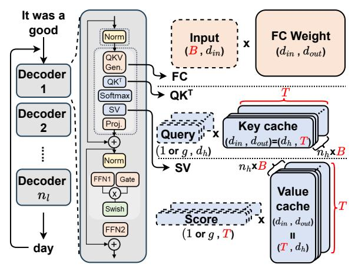
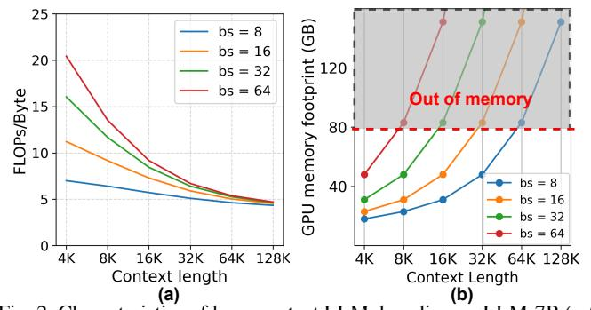
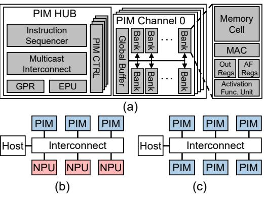
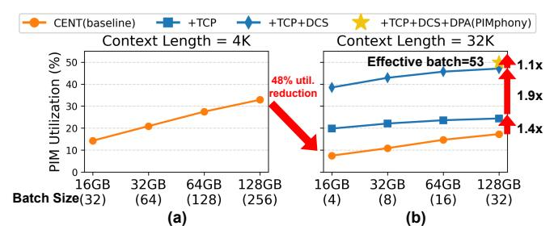
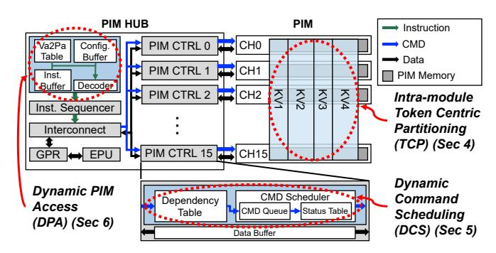
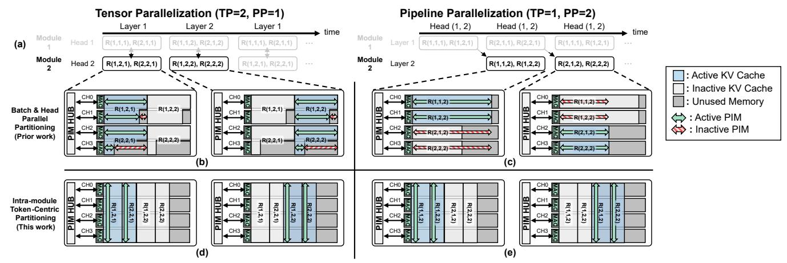

# I. INTRODUCTION

The rapid advancement of Large Language Models (LLMs) has transformed fields ranging from natural language processing to intelligent agents by enabling the generation of contextually relevant responses across diverse applications [\[9\]](#page-13-0), [\[10\]](#page-13-1), [\[15\]](#page-17-0), [\[26\]](#page-18-0), [\[53\]](#page-19-0). In particular, long-context LLMs, capable of maintaining coherence across hundreds of thousands of tokens, have significantly enhanced contextual relevance in various tasks. For instance, long document summarization [\[74\]](#page-20-0) generates cohesive summaries from dispersed information across different sections of extensive text, while repository-level code analysis [\[47\]](#page-19-1) extends programming assistants' capabilities to analyze entire codebases comprising thousands of lines. Furthermore, chain-of-thought (CoT) reasoning has recently

\*Equal contribution. ‡Corresponding author.

improved answer quality by leveraging multi-step contextual reasoning [\[9\]](#page-13-0), [\[50\]](#page-19-2), [\[52\]](#page-19-3), [\[70\]](#page-20-1).

As these LLMs continue to expand — some models exceeding 1T parameters and context windows of 1M tokens [\[48\]](#page-19-4), [\[65\]](#page-20-2), [\[66\]](#page-20-3) — the memory bandwidth and capacity are known to be the bottlenecks of overall system performance [\[16\]](#page-18-1), [\[57\]](#page-20-4). Conventional accelerators such as multi-GPUs suffer from poor compute utilization since large matrix-vector (GEMV) operations with low compute intensity dominate these autoregressive decoding phases [\[22\]](#page-18-2). Recent work such as FlashInfer [\[71\]](#page-20-5) and others [\[1\]](#page-13-2)–[\[3\]](#page-13-3) propose different frameworks to accelerate LLM on GPU-based systems through token-level parallel processing or dynamic batch-size optimization; however, their performance benefits are still bounded by GPU's limited memory bandwidth and capacity.

Recently, Processing-in-Memory (PIM) [\[5\]](#page-13-4), [\[19\]](#page-18-3), [\[36\]](#page-19-5), [\[51\]](#page-19-6) has been proposed to accelerate LLM by exploiting high internal memory bandwidth [\[16\]](#page-18-1), [\[21\]](#page-18-4), [\[54\]](#page-20-6). NeuPIMs [\[21\]](#page-18-4) proposes an NPU+PIM heterogeneous system where NPU is leveraged for compute-intensive kernels (i.e., GEMM) while PIM is leveraged for memory-bound kernels (i.e., GEMV) to accelerate LLM inference. PIM-only systems (e.g., CENT [\[16\]](#page-18-1)) have also been proposed as a multi-PIM node system to handle large LLMs via CXL-based memory expansion. While these prior works accelerate LLM inference with PIM, they primarily focus on relatively small input context lengths (e.g., 4K[1](#page-0-0) ). In this work, we revisit PIM for LLM inference but focus on long-context LLM (up to 1M tokens) and identify how PIM inefficiency becomes problematic as the Attention layers in decoding become a greater bottleneck with longer

1CENT does provide ablation study where they scale to 32K but the benefits of PIM decrease as sequence length increases. More importantly, this work identifies PIM inefficiency as the context length increases and maximizes overall performance from PIM.

> **[图片提取文字 (无描述)]:**
> It was a good FC Weight Norm Input X  $(B,d_{in})$  $(d_{in}, d_{out})$ QKV Gen Decoder → FC QKT → QKT Softmax SV Decoder Proj. Key cache Query : x  $(d_{in}, d_{out})=(d_h, T)$  $(1 \text{ or } g, d_h)$ Norm → SV  $n_h \mathbf{x} B$ FFN1 Gate Decoder Value  $n_l$ cache Swish Score x  $(d_{in}, d_{out})$ FFN2 (1 or q, T) $(T, d_h)$ day

Fig. 1: Decoding Computation for Long-Context LLM (*g*: group size of GQA [4])

TABLE I: LLM specification and the context window (CW).

| Model   | $n_l$ | $n_h$ | $d_h$ | $d_{in/out}$ | GQA               | Reference         | CW   |
|---------|-------|-------|-------|--------------|-------------------|-------------------|------|
| LLM-7B  | 32    | 32    | 128   | 4K-12K       | ×                 | QWEN1.5-7B [6]    | 32K  |
|         |       |       |       | 4K-12K       | $\checkmark(g=4)$ | Llama3.1-8B [13]  | 128K |
| LLM-72B | 80    | 64    | 128   | 8K-24K       | ×                 | Qwen1.5-72B [6]   | 32K  |
|         |       |       |       | 8K-24K       | $\checkmark(g=8)$ | Llama3.1-70B [13] | 128K |

context. In long-context scenarios, PIM inefficiency arises from workload imbalance that leaves channels underutilized and from a fixed write–compute–read pipeline that creates I/O bottlenecks and stalls processing units. KV cache remains problematic in terms of PIM memory capacity but *static* memory allocation based on maximum context length becomes problematic when context length can vary significantly across workloads [7], [45], [73].

To address these limitations, we propose PIMphony, a PIM orchestrator that enables efficient data mapping and movement to improve PIM utilization through three co-designed techniques. First, unlike the conventional head-first or batchdimension partitioning approach, Token-Centric PIM Partitioning (TCP) distributes tokens across all channels within a single PIM module to ensure high utilization and loadbalancing regardless of batch size. Second, to mitigate the PIM I/O bottleneck, Dynamic PIM Command Scheduling (DCS) issues commands based on real-time data dependencies to maximally overlap computation and data movement—a capability absent in static PIM schedulers. Finally, Dynamic PIM Access (DPA) overcomes the limitations of static memory management; by embedding loop bounds and operand modifications into the command stream, it enables dynamic KV cache allocation to improve memory utilization. As a result, PIMphony achieves higher efficiency by better exploiting the high internal bandwidth of each PIM channel by balancing workloads, continuously feeding data to its MAC units, and allocating memory on-demand.

We implement PIMphony by extending an MLIR-based compiler and runtime to generate the PIM commands for both token-level partitioning and dynamic KV cache allocation. We developed custom compiler passes that detect transformer decoder patterns, generate PIM commands with

> **[图片提取文字 (无描述)]:**
> 25 GPU memory footprint (GB)
> 08 07 bs = 8bs = 1620 bs = 32FLOPs/Byte bs = 64Out of memory bs = 85 bs = 16bs = 32bs = 644K 8K 16K 32K 64K 128K 4K 16K 32K 64K 128K Context length Context Length (b) . . . . . .

Fig. 2: Characteristics of long-context LLM decoding on LLM-7B (w/ GQA). (a) Compute intensity (FLOPs/Byte) decreases with context length. (b) GPU memory footprint grows with both context length and batch size; the dashed line marks the A100-80GB capacity.

TABLE II: Statistics of input context length.

| Statistic | LongBe | ench [7] | LV-Eval [73] |           |  |
|-----------|--------|----------|--------------|-----------|--|
|           | QMSum  | Musique  | multifieldqa | Loogle-SD |  |
| mean      | 13,966 | 16,362   | 60,780       | 50,693    |  |
| std       | 6,182  | 1,651    | 31,025       | 26,506    |  |
| max       | 30,456 | 17,917   | 119,480      | 109,221   |  |
| min       | 2,651  | 6,820    | 20,333       | 13,347    |  |

dynamic row/column indices, and handle the token-parallel mapping within each module. We also modified a cycle-accurate DRAM simulator to model PIM I/O output buffering and apply PIMphony to both a heterogeneous architecture (i.e., NeuPIMs [21]) and a PIM-only architecture (i.e., CENT [16]). Across representative long-context LLM workloads, our evaluations show up to  $11.3 \times$  improvement in performance compared to state-of-the-art PIM accelerators for LLM inference.

#### II. BACKGROUND/MOTIVATION

#### A. Long-Context LLM Inference/Decoding

Long-context LLMs are built on the Transformer decoder architecture [68], which, as shown in Fig. 1, consists of  $n_l$  layers, each containing a Multi-Head Attention (MHA) module and a Feed-Forward Network (FFN). Within each of the  $n_h$  attention heads, per-head feature dimension  $(d_h)$ , matrix dimension  $(d_{in}, d_{out})$  for weight parameters, Query/Key/Value vectors  $(Q, K, V \in \mathbb{R}^{d_h})$  are generated, and the K/V vectors are appended to a KV cache for all T tokens. To improve efficiency, some models employ architectural variants like Grouped-Query Attention (GQA) [4], where multiple query heads share a single set of Key and Value vectors per group. The subsequent Attention operations,  $QK^T$  and SV, access this cache. Representative LLM configurations, including GQA variants, are detailed in Table I, and benchmark characteristics are outlined in Table II.

Our analysis of long-context LLM workloads reveals memory bandwidth and capacity bottlenecks from Attention during decoding. As context length grows, compute intensity (OPs/Byte) drops sharply (Fig. 2(a)) as computation shifts from compute-intensive matrix-matrix (GEMM) to memory-bound matrix-vector (GEMV) operations for Attention—making performance heavily dependent on raw memory

> **[图片提取文字 (无描述)]:**
> PIM HUB Memory PIM Channel 0 Cell Instruction Bank Bank Sequencer Global PM MAC Multicast AF Out R Buffer Interconnect Bank Bank Regs Regs Bank Activation **GPR EPU** Func. Unit (a) PIM PIM PIM PIM Host Host Interconnect Interconnect NPU PIM PIM

Fig. 3: Overview of PIM module/node configuration. (a): PIM module architecture. (b) and (c): PIM node configuration - heterogeneous xPU+PIM and PIM-only.

bandwidth. This bandwidth pressure is compounded by capacity demand of the KV cache. Because the KV cache increases proportionally with context length and batch size, it dominates the growth of overall memory requirements and thus imposes significant capacity pressure in long-context LLM inference (Fig. 2(b)). In this work, we exploit a multi-node PIM system to provide both the required memory capacity and high internal memory bandwidth.

#### B. PIM Architecture and Instruction Execution

DRAM-based Processing-in-Memory (PIM) systems [33], [40] accelerate memory-bound GEMV operations by integrating computation directly into memory. As detailed in Fig. 3(a), a PIM module integrates vector MAC units within each DRAM bank, a shared Global Buffer (GBuf) for inputs, and Output Registers (OutRegs) for results, all orchestrated by a PIM Controller. An Activation Function Unit, with an associated Activation Function Registers, is also included to support non-linear activation functions via Look-Up Table (LUT) approximations. An Extra Processing Unit (EPU) performs auxiliary operations (e.g., Softmax), while a General-Purpose Register file (GPR) stores inputs/outputs (or intermediate results) of the computation. In operation, the PIM HUB receives compiler-generated PIM instructions. The Instruction Sequencer expands each instruction by unrolling its specified repetitions and forwards the resulting instruction stream to the Multicast Interconnect. The Multicast Interconnect then decodes these instructions into channel-specific PIM commands, multicasts them to the target channels, and routes the associated data to the corresponding PIM Controllers.

Each PIM instruction carries a set of arguments that determine how it is expanded and dispatched as PIM commands (Table III). Specifically, *Ch-mask* specifies the target PIM channels, *Op-size* determines repetition count, and *GPR-addr* provides the base access address when the instruction involves data movement between the GPR and the PIM (e.g., WR-INP or RD-OUT). The Instruction Sequencer uses *Op-size* to unroll a single instruction into a sequence of repeated instructions, which are subsequently decoded by the Multicast Interconnect

TABLE III: PIM instructions for LLM inference. *Ch-mask, Op-size, GPR-addr* guide the decoding of each instruction into channel-specific PIM commands, while *GBuf-Idx, Out-Idx, Row/Col* are used during PIM channel operation.

| Instructi | on | Description                    | Arguments                                   |  |
|-----------|----|--------------------------------|---------------------------------------------|--|
| WR-IN     | ΙP | Copy Input from GPR to GBuf    | Ch-mask Op-size GPR-addr GBuf-Idx        |  |
| MAC       |    | Dot-Product on a DRAM row      | Ch-mask Op-size GBuf-Idx Row/Col Out-Idx |  |
| RD-OU     | Т  | Copy Output from OutReg to GPR | Ch-mask Op-size GPR-adda Out-Idx         |  |

into channel-specific PIM commands accessing consecutive addresses (e.g., GPR-addr, GBuf-Idx, or column addresses).

## C. Multi-Node DRAM-PIM System

To accommodate large models, multiple nodes can be deployed in heterogeneous (xPU+PIM) or PIM-only configurations (Fig. 3(b,c)), leveraging model parallelism techniques such as Tensor Parallelism (TP) [60] and Pipeline Parallelism (PP) [23]. In TP, model parameters are partitioned across PIM modules, and parallel computation is performed on different tensor shards, with synchronization required to aggregate partial results. In contrast, PP partitions the model into transformer layers that are executed across PIM modules, allowing different micro-batches to be processed concurrently in a pipelined manner. Both approaches enable large transformer models to be mapped across multiple PIM modules by exposing parallelism at different granularities.

## D. Challenges

Although PIM systems offload memory-bound Attention operations, their efficiency drops sharply in long-context scenarios. We identify three fundamental limitations that create a critical performance bottleneck:

- Channel Underutilization. Prior PIM systems partition
  the KV cache by the head and batch dimensions to\nparallelize Attention across PIM channels [16], [21],
  [54]. However, this strategy is highly inefficient for
  long contexts. It leads to severe channel underutilization,\neither from workload imbalance when requests have
  different context lengths or from insufficient sub-batch
  sizes to keep all pipeline stages full.
- 2) I/O Bottleneck. Each dot-product in PIM follows a fixed command pipeline of WR-INP → MAC → RD-OUT (Table III), but limited I/O buffers—2KB input per channel and 4-byte output per bank [40]—frequently stall the MAC units. This issue is amplified in Attention layers, where the KV cache has a small feature dimension (dh; Fig. 1), limiting input/output reuse and increasing buffer turnover. Critically, static command scheduling fails to overlap data movement with computation, resulting in low MAC utilization even under optimal partitioning.
- 3) **Static Memory Management.** To handle variable context lengths, existing PIM systems pre-allocate a KV cache sized for the maximum context  $T_{max}$ , bounding the batch size to a worst-case capacity. Given that realworld workloads have diverse token lengths (Table II),

> **[图片提取文字 (无描述)]:**
> +TCP+DCS CENT(baseline) --------------------------------------+TCP+DCS+DPA(PIMphony) Context Length = 4KContext Length = 32K% Effective batch=53 50 48% util. PIM Utilization 40 reduction 1.9x 30 20 1.4x 10 **16GB** 32**GB** 64GB 128GB **16GB** 32GB 64GB 128GB Batch Size(32) (64)(128)(256)(4)(8)(16)(32)(b) (a)

Fig. 4: PIM utilization under (a) short(4K) and (b) long(32K) contexts using CENT [16] and PIMphony on LLM-7B-32K-GQA. Batch size scales inversely with context length due to the capacity constraint.

this static approach leads to severe memory inefficiency, with an observed average capacity utilization of only 36.2% (See Sec. VIII-C). The root cause is that PIM commands embed fixed physical addresses, making it impossible to repurpose these large, unused memory regions at runtime.

Taken together, the challenges of channel underutilization, I/O bottlenecks, and static memory waste show that conventional PIM systems are fundamentally underutilized for long-context LLM inference. This inefficiency is substantial; our analysis reveals that MAC unit utilization drops by 48% at a 32K context length (Fig. 4). Such systemic limitations cannot be solved with incremental optimizations, necessitating a holistic redesign of the PIM software and hardware stack—motivating the novel orchestrator we propose.

#### III. PIMPHONY OVERVIEW

We propose PIMphony, a PIM *orchestrator* that systematically resolves these inefficiencies to enable high performance for long-context LLM inference. PIMphony improves PIM utilization—a critical yet previously underexplored bottleneck—through three co-designed techniques (Fig. 5).

**Token-Centric PIM Partitioning (TCP).** To combat channel underutilization, PIMphony introduces TCP. Unlike conventional methods that rely on the volatile batch dimension, TCP reorients parallelism along the plentiful *token* axis. By distributing token-level work across all channels, TCP decouples performance from batch size, mitigating imbalance and ensuring consistently high channel utilization.

**Dynamic PIM Command Scheduling (DCS).** To eliminate the I/O bottleneck, PIMphony employs DCS, which enhances the PIM controller with the ability to issue commands out-of-order based on real-time data dependencies. This dynamic approach, impossible for rigid static schedulers, effectively hides I/O latency by overlapping data movement and computation, thus maximizing MAC pipeline throughput.

**Dynamic Memory Management with Dynamic PIM Access (DPA).** To address wasteful static memory allocation, PIMphony features DPA, which includes a novel on-module dispatcher, which effectively acts as a lightweight, pseudo-Memory Management Unit (MMU) for the PIM. This dispatcher enables runtime virtual-to-physical address translation, allowing for dynamic, on-demand memory allocation for the KV cache. This breaks free from the static pre-allocation

> **[图片提取文字 (无描述)]:**
> PIM HUB PIM Instruction Config. PIM CTRL 0 CH0 CMD Va2Pa Table Buffer Data PIM CTRL 1 CH1 PIM Memory Inst. Decoder Buffer PIM CTRL 2 CH2 Intra-module Inst. Sequencer Token Centric Partitioning Interconnect (TCP) (Sec 4) PIM CTRL 15 CH15 EPU Dynamic Dynamic PIM CMD Scheduler Command Dependency Access CMD Queue Status Table Table Scheduling (DPA) (Sec 6) (DCS) (Sec 5) Data Buffer

Fig. 5: High-level overview of PIMphony with the three main components highlighted.

model based on maximum context length and improves effective memory capacity utilization.

Together, TCP, DCS, and DPA form a cohesive orchestration framework that addresses PIM inefficiencies across parallelism, command scheduling, and memory management. Fig. 4(b) provides a preview of their cumulative impact on PIM utilization. Building on this architectural overview, the following sections describe each technique in detail, explaining how they jointly enable efficient long-context LLM inference.

## IV. TOKEN-CENTRIC PIM PARTITIONING

To understand the limitations of existing PIM workload partitioning strategies for long-context LLM inference, we first examine a simplified example that illustrates their impact on channel utilization. Fig. 6(a) visualizes a Transformer example workload with two attention heads, two layers, and a batch size of two, distributed across two PIM modules, each containing four independently operating channels. Computation tasks are labeled with the notation R(r, h, l), where r denotes the request ID, h the head index, and l the layer index, while active and inactive KV cache regions are shown in blue and shade, respectively. This example reflects long-context conditions, where a request typically consumes nearly the entire memory capacity of a single PIM channel, limiting each channel to serve only one request at a time. This example allows us to compare the effects of tensor parallelism (TP) and pipeline parallelism (PP) on channel activity, contrasting conventional PIM partitioning with our proposed token-centric PIM partitioning (TCP) approach.

#### A. Channel Underutilization Issue

Modern PIM-based LLM accelerators [16], [21], [54] suffer severe channel underutilization in long-context inference because existing KV cache partitioning schemes do not scale with growing context length. To distribute workload across channels within a PIM module, prior systems commonly adopt Head-First Partitioning (HFP), which assigns head-batch pairs to individual PIM channels for concurrent execution. HFP implicitly assumes the availability of sufficient head-batch parallelism to populate all channels. However, as context length increases, each request's KV cache footprint expands while the number of simultaneous requests (i.e., batch size) shrinks. In the extreme, a single long-context request can

> **[图片提取文字 (无描述)]:**
> Tensor Parallelization (TP=2, PP=1) Pipeline Parallelization (TP=1, PP=2) Head (1, 2) Layer 1 Layer 2 Layer 1 Head (1, 2) Head (1, 2) time Module Module R(1,1,1), R(2,1,1) R(1,1,2), R(2,1,2) R(1,1,1), R(1,2,1) R(2,1,1), R(2,2,1) (a) R(1,1,1), R(2,1,1) R(1,1,1), R(1,2,1) Module Module Layer 2 Head 2 R(1,2,1), R(2,2,1) R(1,2,2), R(2,2,2) R(1,2,1), R(2,2,1) R(2,1,2), R(2,2,2) R(1,1,2), R(1,2,2) : Active KV Cache : Inactive KV Cache : Unused Memory R(1,1,2) = R(1,1,2) R(1,2,1) R(1,2,2) R(1,2,2) PIM HUB R(1,2,1) Batch & Head R(1,2,2) ⇔: Active PIM =R(1,2,2) Parallel Partitioning : Inactive PIM R(2,1,2)  $\langle R(2,1,2) \Longrightarrow$ (Prior work) R(2,2,2) R(2,2,2) R(2,2,1) -R(2,2,1) R(2,2,2) ←R(2,2,2) ⇒ (b) (c) Intra-module R(2,2,1) R(1,2,2) R(2,2 R(2,2,2) Token-Centric Partitioning (This work) (d) (e)

Fig. 6: Comparison of KV cache partitioning strategies across PIM channels for tensor parallelism (TP) (b,d) and pipeline parallelism (PP) (c,e). Prior approach [16], [21], [54] (Head/Batch-First Partitioning (HFP)) is shown in (b,c) while the proposed Token-Centric Partitioning (TCP) is shown in (d,e). The example highlights the inefficient utilization of HFP across the PIM channels, as not all channels can be utilized simultaneously. For clarity, only one PIM module with four channels is shown. R(r, h, l) indicates Request r, Head h, and Layer l.

occupy an entire channel, drastically reducing the number of available head-batch tiles. As a result, HFP fails to sustain high channel utilization in long-context settings, leaving many channel-level MAC units idle despite abundant token-level parallelism. In the following, we analyze how this limitation of HFP manifests under tensor and pipeline parallelism.

