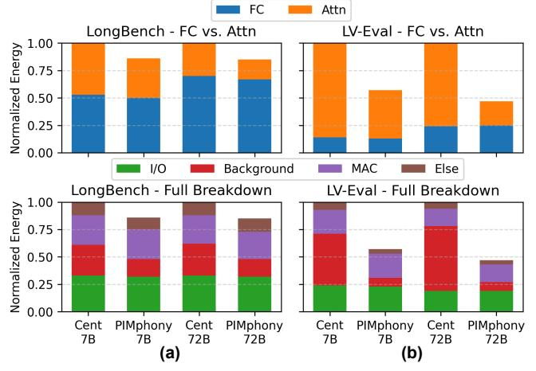
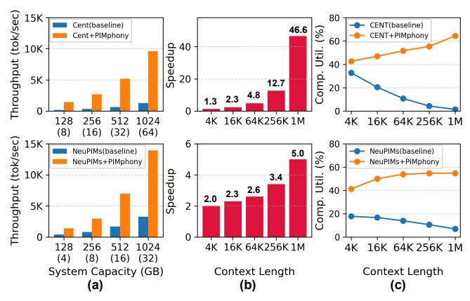
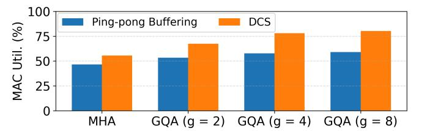
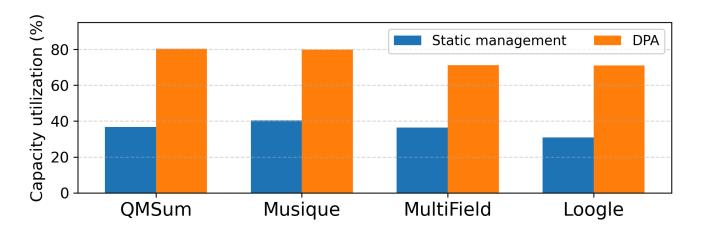
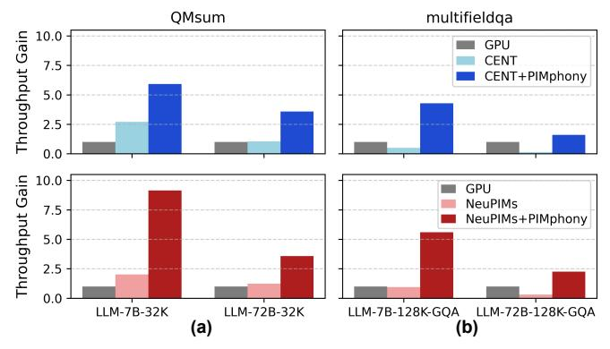

# *C. Ablation Study*

In this section, we evaluate the effectiveness of PIMphony across several key metrics: multi-PIM parallelization, latency and energy breakdowns, system and context length scalability, memory capacity utilization, and a direct throughput

> **[图片提取文字 (无描述)]:**
> FC Attn LongBench - FC vs. Attn LV-Eval - FC vs. Attn 1.00 Normalized Energy 0.75 0.50 -0.25 0.00 I/O Background MAC Else LongBench - Full Breakdown LV-Eval - Full Breakdown 1.00 Normalized Energy 0.75 0.50 0.25 0.00 **PIMphony PIMphony** Cent **PIMphony** Cent Cent **PIMphony** Cent 7B 7B 72B 72B **7B 7B** 72B 72B (a) (b)

Fig. 16: Energy breakdowns of CENT vs. CENT+PIMphony for 7B and 72B models: (a) non-GQA models evaluated on LongBench (32K), (b) GQA models evaluated on LV-Eval (128K). Top: FC and Attention. Bottom: MAC, I/O, Background, and Else.

comparison with GPU systems. Unless otherwise noted, we present results primarily from the PIM-only system to more distinctively illustrate the impact of PIMphony on PIM itself.

Tensor vs. Pipeline Parallelization. Fig. [15](#page-10-3) illustrates the impact of PIMphony's techniques on multi-node PIM parallelization, evaluated on CENT. We incrementally apply TCP, DCS, and DPA to assess their cumulative benefits. For LLM-7B-32K (woGQA), TCP significantly enhances TP efficiency by mitigating channel underutilization. DCS further improves Attention performance by reducing I/O idle time, while DPA increases the effective batch size, enabling PP to deliver marginally higher throughput. For LLM-7B-128K (wGQA),

> **[图片提取文字 (无描述)]:**
> Throughput (tok/sec) 15K 80 Cent(baseline) CENT(baseline) 46.6 % Cent+PIMphony CENT+PIMphony 60 40 Speedup 10K Ë. 40 Comp. 20 5K 12.7 20 4.8 1.3 0 0 128 256 1024 4K 16K 64K256K1M 16K 64K 256K 1M 512 (8)(16)(32)(64)Throughput (tok/sec) 15K 6 80 NeuPIMs(baseline) NeuPIMs(baseline) 5.0 % NeuPIMs+PIMphony NeuPIMs+PIMphony 60 Speedup 10K 4 ij. 3.4 2.6 40 2.3 2.0 Comp. 5K 2 20 0 16K 64K256K 1M 256 512 1024 16K 64K 256K 1M 128 4K (8)(16) (32)(4) System Capacity (GB) Context Length Context Length (b) (a) (c)

Fig. 17: Scalability of PIMphony on LLM-7B-128K-wGQA with 3 sigma context variation for CENT (Top) and NeuPIMs (Bottom). (a) At 64K context, throughput scales with capacity (128–1024GB; 8–64 modules for CENT, 4–32 for NeuPIMs). (b)(c) At 512GB, PIMphony outperforms baselines as context length increases from 4K to 1M.

DCS shows a more pronounced effect due to the intensified input transfer pressure from GQA. Additionally, KV cache reuse from GQA, combined with DPA, boosts batch size and further motivates PP, achieving 20% higher throughput improvement. These results demonstrate the effectiveness of PIMphony in maximizing multi-PIM system efficiency.

Energy Breakdown. PIMphony's energy efficiency stems from its dramatic reduction of runtime-dependent background energy. As shown in Fig. [16,](#page-10-4) the baseline's low MAC utilization causes background energy to constitute a staggering 71.5% of the total energy in Attention layers. By accelerating Attention execution by up to 19×, PIMphony drastically cuts the runtime, which in turn slashes the background energy's share to just 13.0% and achieves up to a 3.46× reduction in Attention. These gains are amplified in GQA-enabled models, as their higher speedup potential leads to an even greater reduction in runtime and, consequently, background energy.

Scalability with System Capacity and Context Length. PIMphony scales robustly with both system capacity and context length, widening its lead over baselines. Throughput improves with capacity (128GB–1024GB), confirming efficient module use (Fig[.17\(](#page-11-0)a)). Benefits are greater when scaling context length to 1M tokens on a fixed 512GB system. CENT collapses under pipeline bubbles, dropping to 2% utilization, while PIMphony achieves 46.6× speedup. NeuPIMs scale more stably via tensor parallelism, yet PIMphony still delivers 5.0× speedup (Fig[.17\(](#page-11-0)b)). Fig. [17\(](#page-11-0)c) explains this trend: PIMphony makes Attention more efficient than FC layers, so longer contexts—where Attention dominates—boost system utilization, unlike baselines where bottlenecks worsen. Importantly, these gains are not confined to long contexts; even at short contexts (e.g., 256 tokens), PIMphony achieved a 2.1× speedup over the baselines.

DCS vs. Ping-pong Buffering Prior works [\[25\]](#page-18-8), [\[29\]](#page-18-9) adopt *ping-pong buffering*: a single buffer is split into two regions so two operations that touch disjoint regions can overlap—thus, like DCS, it can overlap I/O transfers (WR-INP, RD-OUT)

> **[图片提取文字 (无描述)]:**
> Ping-pong Buffering DCS GQA (g = 2) GQA (g = 4)

Fig. 18: Compute utilization for Attention operations comparing *pingpong buffering* and DCS. X-axis: MHA and GQA with group size g ∈ 2, 4, 8. Both apply the *row-reuse mapping* in GQA.

> **[图片提取文字 (无描述)]:**
> Static management DPA 80 60 40 Loogle **QMSum** Musique MultiField

Fig. 19: Capacity utilization with and without DPA in PIMphony. QMSum/Musique use 7B-32K; MultiField/Loogle use 7B-128K.

with MAC to improve MAC utilization. However, because *static scheduling* does not know true data dependencies at the entry level, I/O transfers and MAC cannot access the same region concurrently to avoid data hazards; effectively, overlap is restricted to different regions. Consequently, when I/O transfers and MAC must switch which region they operate on, the swap can occur only after both regions become idle, which introduces hand-off pipeline stalls. In contrast, DCS keeps one buffer, tracks per-entry dependencies, and relaxes inter-command timing to enable entry-level overlap within the same buffer without hand-offs, yielding a longer, stall-resistant pipeline. With the same total buffer size, our ping-pong baseline for I/O hiding exhibits hand-off pipeline stalls—exacerbated by shorter pipelines from smaller perregion buffers—whereas DCS sustains overlap; across Attention settings, DCS achieves up to 1.4× higher compute-unit utilization (Fig. [18\)](#page-11-1).

Impact of DPA on Capacity Utilization. To assess DPA's capacity efficiency, we conduct an ablation comparing static memory management with DPA's dynamic approach. As shown in Fig. [19,](#page-11-2) static memory management severely underutilizes memory—capacity utilization ranges from 31.0% to 40.5% across workloads—due to coarse-grained reservations sized for maximum token lengths, which over-provision capacity. DPA instead uses lazy, on-demand allocation of non-contiguous chunks at runtime. Although this introduces minor fragmentation limited to each request's final chunk, it removes maximum-length reservations and markedly improves efficiency. Empirically, DPA raises average capacity utilization to 75.6%, more than doubling the static baseline.

Throughput Comparison with GPU System. We compare PIMphony-enabled systems with a strong GPU baseline—A100s with flash-decoding (FD) [\[11\]](#page-17-2) and pagedattention (PA) [\[34\]](#page-19-11)—using memory-matched configurations (Fig. [20\)](#page-12-0). PIMphony delivers substantial speedups, especially

> **[图片提取文字 (无描述)]:**
> QMsum multifieldga 10.0 Throughput Gain GPU CENT 7.5 CENT+PIMphony 5.0 2.5 0.0 10.0 Throughput Gain **GPU** NeuPIMs 7.5 NeuPIMs+PIMphony 5.0 2.5 0.0 LLM-7B-32K LLM-72B-32K LLM-7B-128K-GQA LLM-72B-128K-GQA (a) (b)

Fig. 20: Throughput comparison of GPU and PIMphony. (a) Non-GQA LLM on QMSum (LongBench). (b) GQA-enabled LLM on multifieldqa (LV-Eval). For fairness, GPU memory is matched to PIMphony: two A100-80GB for LLM-7B, eight for LLM-72B.

on non-GQA models with high memory demand. On larger 72B models, the GPU's advantage on compute-intensive FC layers narrows PIMphony's relative gains. Even so, PIMphony shows a key strength on GQA workloads: while KV cache reuse benefits GPUs, it creates an I/O bottleneck for PIMs due to repeated input transfers. Our DCS technique mitigates this by overlapping transfers with computation, hiding the overhead and unlocking significant gains even in workloads traditionally favorable to GPUs.

