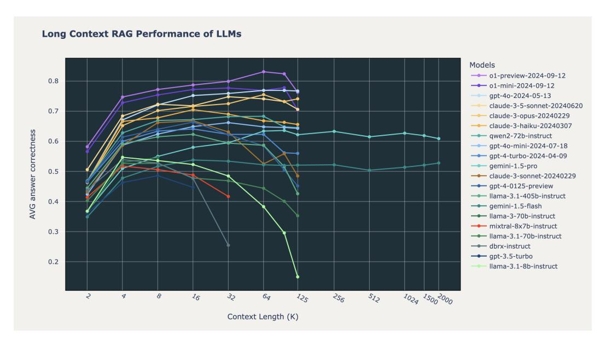

# 1 Introduction

The development of Large Language Models (LLMs) with increasingly longer context lengths has opened new possibilities for Retrieval Augmented Generation (RAG) applications. Recent models such as Anthropic Claude (200k tokens) [\[1\]](#page-5-0), GPT-4-turbo (128k tokens) [\[2\]](#page-5-1), OpenAI o1 (128k tokens) [\[3\]](#page-5-2), Llama 3 [\[4\]](#page-5-3) and Google Gemini 1.5 Pro (2 million tokens) [\[5\]](#page-5-4) have led to speculation about whether long context models might eventually subsume traditional RAG workflows entirely. In this study, we empirically investigate the impact of increased context length on RAG performance and explore the limitations and challenges that arise in long context scenarios.

RAG can enhance the accuracy of LLMs by retrieving information from external sources, enabling users to incorporate task-specific or private data into their LLM workflows. Published results using RAG-like methods have demonstrated benefits across many applications [\[6\]](#page-5-5) including machine

Workshop on Adaptive Foundation Models, 38th Conference on Neural Information Processing Systems (NeurIPS 2024).

∗Equal contribution

> **[图片提取文字 (无描述)]:**
> Long Context RAG Performance of LLMs Models -- o1-preview-2024-09-12 0.8 -- o1-mini-2024-09-12 qpt-4o-2024-05-13 claude-3-5-sonnet-20240620 0.7 claude-3-opus-20240229 claude-3-haiku-20240307 AVG answer correctness --- qwen2-72b-instruct 0.6 --- gpt-4o-mini-2024-07-18 --- qpt-4-turbo-2024-04-09 gemini-1.5-pro 0.5 --- claude-3-sonnet-20240229 -- gpt-4-0125-preview --- Ilama-3.1-405b-instruct 0.4 gemini-1.5-flash --- Ilama-3-70b-instruct mixtral-8x7b-instruct 0.3 --- Ilama-3.1-70b-instruct - dbrx-instruct -- qpt-3.5-turbo 0.2 llama-3.1-8b-instruct 8 32 512 4 16 64 256 1024 15002000 125 Context Length (K)

Figure 1: Long context RAG performance of o1, GPT-4, Claude 3/3.5, Gemini 1.5 (gemini-1.5-pro-001 and gemini-1.5-flash-001), Llama 3/3.1, Qwen 2, Mistral and DBRX models on 3 curated RAG datasets (Databricks DocsQA, FinanceBench, and Natural Questions). All values can be found in Table [S3.](#page-9-0) Model versions are listed in Table [S1.](#page-8-0)

translation [\[7\]](#page-5-6), semantic parsing [\[8\]](#page-5-7), question answering [\[9,](#page-5-8) [10,](#page-5-9) [11,](#page-5-10) [12\]](#page-5-11), and open-ended text generation [\[13\]](#page-6-0). With longer context lengths, LLM developers can feed more documents into their RAG applications. While there has been recent speculation that long context LLMs will *replace* RAG entirely [\[14\]](#page-6-1), in this paper we study whether long context LLMs can indeed be *used effectively* for RAG systems. How well do the best open source and commercial models do on long-context RAG tasks?

In this study, we apply a standard RAG approach and evaluate the performance of 20 popular open source and commercial LLMs with varying context lengths from 2,000 to 128,000 tokens (and 2 million tokens when possible). We then analyze distinct failure modes for different models across long context RAG scenarios. We show that:

- Using longer context does not uniformly increase RAG performance. The majority of models we evaluated first increase and then decrease RAG performance as context length increases. Only a handful of the most recent state of the art LLMs can maintain consistent accuracy at long context above 64k tokens.
- LLMs fail at long context RAG in unique ways as a function of context length. While some models tended to provide incorrect answers, others failed to follow instructions or refused to answer due to perceived copyright concerns.

