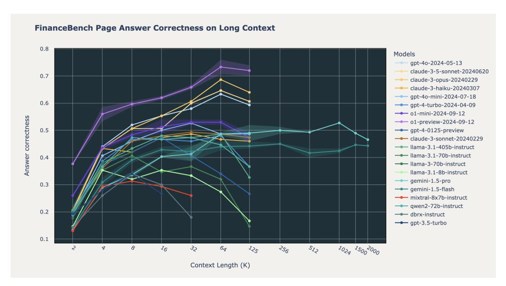

# 2 Background and Related Work

RAG combines the strengths of retrieval-based and generation-based approaches in natural language processing, and has shown significant improvements in the quality of question-answering systems across many domains and tasks [\[15,](#page-6-2) [16,](#page-6-3) [17\]](#page-6-4). The process typically involves two main steps, retrieval and generation. During the first stage, relevant information is retrieved from a corpus or database based on a user query. This often involves embedding documents and storing them in a vector database for similarity-based retrieval. During the generation stage, the retrieved information is combined with the user query as input to an LLM. Importantly, multiple retrieved documents can be included as input to the LLM depending on the maximum context length of the model.

Recent advancements in LLM capabilities have led to models with increasingly larger context lengths. While early models like GPT-3.5 had a context length of 4k tokens, newer models such as Anthropic Claude (200k tokens), OpenAI o1 (128k tokens) and Google Gemini 1.5 models (2 million tokens)

support much longer contexts. Open source models have followed a similar trend, with recent models like Mixtral [18] and DBRX [19] supporting 32k tokens, and Llama 3.1 reaching 128k tokens.

However, recent studies have identified limitations in long context models. For example, the "lost in the middle" paper [20] found that models struggle to retain and utilize information from the middle portions of long texts, leading to performance degradation as context length increases. Similarly, the RULER paper [21] found that the "effective context length" (usable context before performance decreases) can be much shorter than the claimed maximum context length. Recent studies have also tried to compare RAG to workflows where the entire corpus is included in the context window of the LLM [22]. This has only been possible to do with the very recent state of the art models such as o1, GPT-40, Claude 3.5, Gemini 1.5, Qwen 2 72B and Llama 3.1 405B, and the jury is still out on whether such an approach leads to accurate results and is cost effective. Other relevant studies and blogposts include [23, 24, 14, 25, 26, 22, 27, 28]. Similar to our study, Jin et al. find that increasing the number of retrieved passages does not consistently improve RAG performance for Gemma-7B, Gemma-2-9B, Mistral NeMo 12B but does for Gemini 1.5 Pro [29]. Our concurrent work corroborates this across 20 closed and open source models.

### 3 Methodology

We conducted RAG experiments using 20 popular open source and commercial LLMs, and evaluated their performance on three datasets: Databricks DocsQA, FinanceBench [30], and Natural Questions [31]. For the retrieval stage, we retrieved document chunks using the same embedding model across all settings (OpenAI text-embedding-3-large2 with a chunk size of 512 tokens and a stride of 256 tokens) and used FAISS3 (with IndexFlatL2 index) as the vector store. These chunks were then inserted into the context window of a generative model.

We then evaluated how generation performance changes as a function of the number of retrieved document chunks by varying the LLM context from 2,000 tokens to 128,000 tokens (and 2 million tokens when possible). We evaluated the following models: o1-mini, o1-preview, Gemini 1.5 Pro, Gemini 1.5 Flash, GPT-40, Claude 3.5 Sonnet, Claude 3 Opus, Claude 3 Sonnet, Claude 3 Haiku, GPT-40 mini, GPT-4 Turbo, GPT-4, Llama 3.1 405B, Llama 3 70B, Llama 3.1 70B, Llama 3.1 8B, Qwen 2 72B, Mixtral 8x7B, DBRX, and GPT-3.5 Turbo. These models represent some of the most popular API-based and open source LLMs as of this writing. A full list of the model versions used in this study can be found in Table S1.

For generation, we set the temperature to 0.0 and the maximum output sequence length to 1024. We used a simple prompt template to combine the retrieved documents with the user query for each model and dataset (Appendix E). The system had to correctly answer questions based on the retrieved documents, and the answer was judged by a calibrated "LLM-as-a-judge" using GPT-40 (see Appendix D for further details).

Finally, we analyzed the failure patterns for selected models (OpenAI o1, Gemini 1.5 Pro, Llama 3.1 405B, GPT-4, Claude 3 Sonnet, DBRX, and Mixtral) in long context scenarios by using GPT-40 to classify failures into broad categories such as "refusal" and "wrong answer" (Appendix F.1). We also include an analysis of retrieval performance (recall@k) in Appendix C.

#### 4 Results

### 4.1 Using longer context does not uniformly increase RAG performance

The best commercial models such as o1-mini/preview, GPT-40, and Claude 3.5 Sonnet steadily improve performance as a function of context length, while the majority of the open source models first increase and then decrease performance as context length increases (Figs. 1 and 2). Overall, we found that the following models show consistent accuracy improvement up to 100k tokens: o1-preview and o1-mini, GPT-40 and GPT-40 mini, Claude 3.5 Sonnet, Claude 3 Opus, and Gemini

&lt;sup>1Databricks DocsQA is a benchmark of technical questions and answers related to the Databricks platform.

&lt;sup>2https://openai.com/index/new-embedding-models-and-api-updates/

3https://github.com/facebookresearch/faiss

&lt;sup>4We used the versions of Gemini 1.5 released in June 2024, specifically gemini-1.5-pro-001 and gemini-1.5-flash-001 with 2 million token context windows.

&lt;sup>5We used the Claude 3.5 Sonnet released in June 2024, claude-3-5-sonnet-20240620

> **[图片提取文字 (无描述)]:**
> **FinanceBench Page Answer Correctness on Long Context** 0.8 Models gpt-4o-2024-05-13 claude-3-5-sonnet-20240620 0.7 claude-3-opus-20240229 claude-3-haiku-20240307 --- gpt-4o-mini-2024-07-18 0.6 --- gpt-4-turbo-2024-04-09 --- o1-mini-2024-09-12 Answer correctness --- o1-preview-2024-09-12 0.5 gpt-4-0125-preview --- claude-3-sonnet-20240229 --- llama-3.1-405b-instruct -- Ilama-3.1-70b-instruct 0.4 -- Ilama-3-70b-instruct llama-3.1-8b-instruct gemini-1.5-pro 0.3 gemini-1.5-flash mixtral-8x7b-instruct --- gwen2-72b-instruct 0.2 - dbrx-instruct gpt-3.5-turbo 0.1 9 8 16 35 256 512 1024 15002000 125 Context Length (K)

Figure 2: Long context RAG performance on FinanceBench

1.5 Pro. These models exhibit largely monotonic behavior where the results don't get significantly worse after they peak.

Among the open source models, Qwen 2 70B maintains consistent accuracy up to 64k. Llama 3.1 405B performance starts to decrease after 32k tokens, GPT-4-0125-preview starts to decrease after 64k tokens, and only a few models can maintain consistent long context RAG performance on all datasets. This demonstrates that while some models that boast long contexts can be used effectively to increase RAG performance, the majority of open source models can only handle effective RAG tasks up to roughly 16k-32k tokens.

We report very strong performance from the OpenAI o1 models; the o1 models seem to be a substantive improvement over GPT-4 and GPT-4o. Although the overall answer correctness of the Google Gemini 1.5 Pro and Gemini 1.5 Flash models is much lower than that of the o1 and GPT-4o models up to 128,000 tokens, the Gemini models maintain consistent performance at extremely long contexts up to 2,000,000 tokens. This is quite unique among the models we tested, and is an exciting example of how future LLMs will handle long context.

### 4.2 LLMs Fail at Long Context RAG in Different Ways

We found distinct failure patterns among different models in long context scenarios. Fig. [3](#page-4-0) displays the failure count and failure type as a function of context length on the Natural Questions (NQ) dataset. As shown in the top right plot of Fig. [3,](#page-4-0) Claude 3 Sonnet frequently refused to answer due to perceived copyright concerns, especially at longer context lengths. Gemini 1.5 Pro maintained consistent performance at extreme long context (up to 2 million tokens), but increasingly failed tasks at long context length due to overly sensitive safety filters (Fig. [3\)](#page-4-0).[6](#page-3-1) Among the open source models, Llama 3.1 405B maintained consistent failure performance up to 64k tokens, while many of the failures of Mixtral-8x7B at longer contexts were due to repeated or random content. Finally, DBRX often failed to follow instructions for context lengths above 16k, often summarizing content instead of answering questions directly. We include specific examples in Appendix [F.](#page-12-1)

