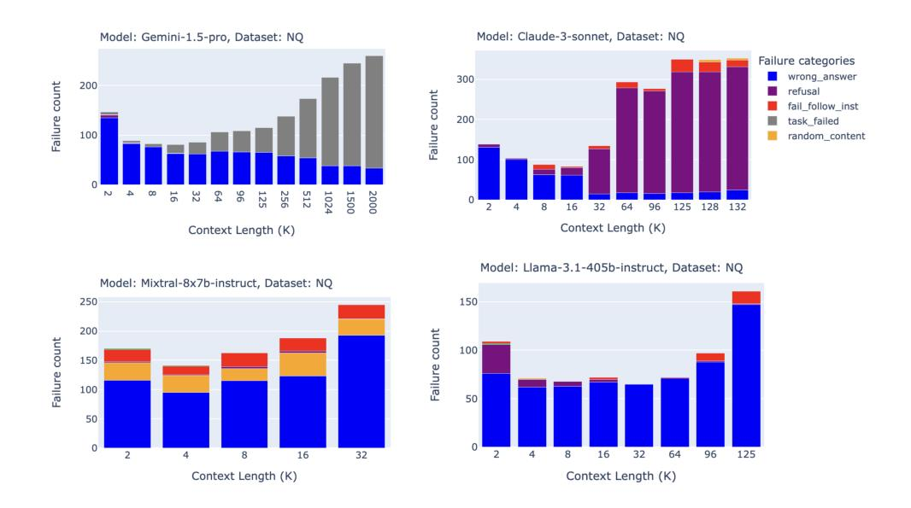

# 5 Discussion

In this study, we asked a straightforward question: can long context LLMs improve RAG performance? We found that for recent state of the art models such as o1, GPT-4o, Claude 3.5, Gemini 1.5,

6We note that we did not include any queries that failed in this way (i.e. by filtering) in the final accuracy score. On Natural Questions specifically, Gemini 1.5 Pro and Flash did remarkably well with answer correctness values above 0.85 at 2 million tokens context length (see Fig. [S2\)](#page-10-1).

> **[图片提取文字 (无描述)]:**
> Model: Claude-3-sonnet, Dataset: NQ Model: Gemini-1.5-pro, Dataset: NQ Failure categories wrong\_answer Failure count refusal Failure count fail\_follow\_inst task\_failed random\_content N 128 132 Context Length (K) Context Length (K) Model: Llama-3.1-405b-instruct, Dataset: NQ Model: Mixtral-8x7b-instruct, Dataset: NQ Failure count Failure count Context Length (K) Context Length (K)

Figure 3: Failure analysis on the Natural Questions (NQ) dataset for Gemini 1.5 Pro, Claude 3 Sonnet, Mixtral 8x7B, and Llama 3.1 405B. Gemini 1.5 Pro (gemini-1.5-pro-001) increasingly failed tasks at long context length due to overly sensitive safety filters, while Claude 3 Sonnet frequently refused to answer due to percieved copyright concerns.

and even Qwen 2 70B, longer contexts can consistently improve RAG performance. However, longer context is not uniformly beneficial across all models and datasets. Across the majority of models we analyzed, most LLMs only showed increasing RAG performance up to 16-32k tokens.

Why does o1 do so well? We hypothesize that the increased test-time compute abilities of o1 [\[3\]](#page-5-2) allow the model to handle confusing questions and avoid getting misled by retrieved documents that are irrelevant.

It is also interesting to note that for the NQ dataset, many of the failures were due to alignment (Claude 3 Sonnet) or safety filtering (Gemini 1.5 Pro). We speculate that this is because the training of those capabilities did not include long context; if a model is trained for helpfulness on short contexts, for example, it might not necessarily do as well with helpfulness on long contexts. It is surprising that alignment could fail at different prompt lengths; we leave a deep dive into this behavior for future work.

Our results imply that for a corpus smaller than 128k tokens (or 2 million in the case of Gemini), it may be possible to skip the retrieval step in a RAG pipeline and instead directly feed the entire dataset into the LLM. Is this a good idea? Although this would be prohibitively expensive and have potentially lower performance, such a setup could eventually allow developers to trade higher costs for a more simplified developer experience when building LLM applications.

The costs vary widely across models. For a *single query* with a maximum sequence length of 128k tokens, GPT-4o costs \$0.32, while o1-preview costs \$1.92, Claude 3.5 Sonnet costs \$0.384 and Gemini 1.5 Pro costs \$0.16.[7](#page-4-1) Using very long context for RAG is *much* more expensive than simply maintaining a vector database and retrieving a handful of relevant documents. Batch inference and corpus caching can likely mitigate these costs; this is an active area of development. In the past year alone we've seen the price per million input token drops from \$30 for GPT-4 to \$2.5 for GPT-4o;[8](#page-4-2) in the near future it is likely using 128k tokens will become more feasible financially.

7when only taking cost per input token into account. For a single query with a maximum sequence length of 2 million tokens, Gemini 1.5 Pro costs \$5.

8 <https://openai.com/api/pricing/>

