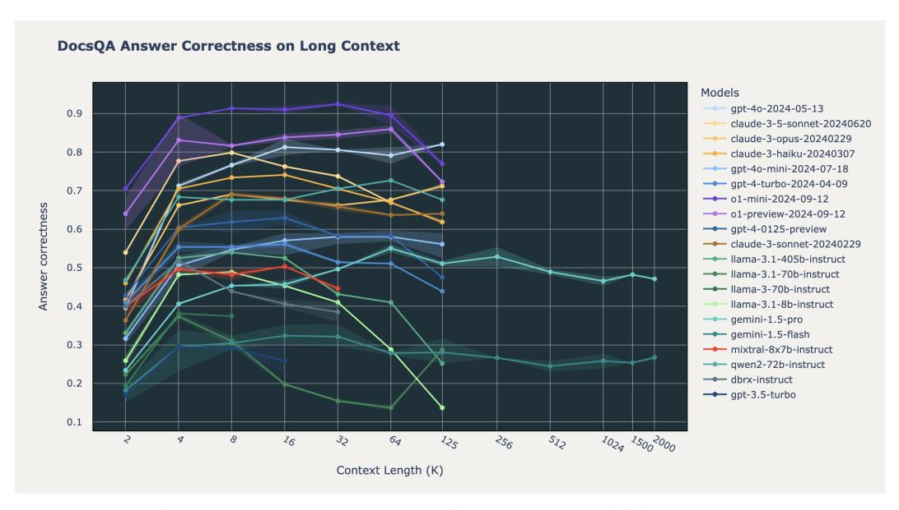
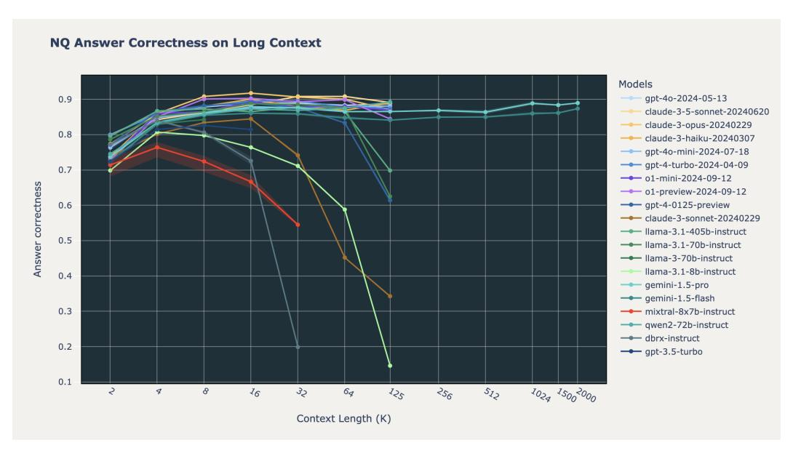

# B Dataset Details

In this study, we benchmarked all LLMs on 3 curated RAG datasets that were formatted for both retrieval and generation. These included Databricks DocsQA and [FinanceBench,](https://arxiv.org/abs/2311.11944) which represent industry use cases and Natural Questions (NQ), which is a standard academic benchmark. Below are the dataset details:

| Dataset                          | Corpus | Queries | Av. doc length (to kens) | Max doc length (to kens) |
|----------------------------------|--------|---------|-----------------------------|-----------------------------|
| Databricks DocsQA                | 7,563  | 139     | 2856                        | 225,941                     |
| FinanceBench                     | 53,399 | 150     | 811                         | 8,633                       |
| Natural Questions (dev split) | 7,369  | 534     | 11,354                      | 13,362                      |

Table S2: Dataset details for the 3 datasets used in our end-to-end RAG benchmark.

We inlcude the individual answer correctness plots for Databricks DocsQA and natural Questions in Figs. [S1](#page-9-1) and [S2.](#page-10-1)

The performance of the Gemini 1.5 models evaluated on up to 2 million tokens can be found in Table [S4.](#page-9-2)

| Model                      | av.   | 2k    | 4k    | 8k    | 16k   | 32k   | 64k   | 96k   | 125k  |
|----------------------------|-------|-------|-------|-------|-------|-------|-------|-------|-------|
| o1-preview-2024-09-12      | 0.763 | 0.582 | 0.747 | 0.772 | 0.787 | 0.799 | 0.831 | 0.824 | 0.763 |
| o1-mini-2024-09-12         | 0.731 | 0.566 | 0.728 | 0.754 | 0.772 | 0.777 | 0.769 | 0.778 | 0.704 |
| gpt-4o-2024-05-13          | 0.709 | 0.467 | 0.671 | 0.721 | 0.752 | 0.759 | 0.769 | 0.769 | 0.767 |
| claude-3-5-sonnet-20240620 | 0.695 | 0.506 | 0.684 | 0.723 | 0.718 | 0.748 | 0.741 | 0.732 | 0.706 |
| claude-3-opus-20240229     | 0.686 | 0.463 | 0.652 | 0.702 | 0.716 | 0.725 | 0.755 | 0.732 | 0.741 |
| claude-3-haiku-20240307    | 0.649 | 0.466 | 0.666 | 0.678 | 0.705 | 0.69  | 0.668 | 0.663 | 0.656 |
| qwen2-72b-instruct         | 0.637 | 0.469 | 0.628 | 0.669 | 0.672 | 0.682 | 0.683 | 0.648 | 0.645 |
| gpt-4o-mini-2024-07-18     | 0.61  | 0.424 | 0.587 | 0.624 | 0.649 | 0.662 | 0.648 | 0.646 | 0.643 |
| gpt-4-turbo-2024-04-09     | 0.588 | 0.465 | 0.6   | 0.634 | 0.641 | 0.623 | 0.623 | 0.562 | 0.56  |
| gemini-1.5-pro             | 0.584 | 0.368 | 0.51  | 0.55  | 0.58  | 0.595 | 0.634 | 0.636 | 0.622 |
| claude-3-sonnet-20240229   | 0.569 | 0.432 | 0.587 | 0.662 | 0.668 | 0.631 | 0.525 | 0.559 | 0.485 |
| gpt-4-0125-preview         | 0.568 | 0.466 | 0.614 | 0.64  | 0.664 | 0.622 | 0.585 | 0.505 | 0.452 |
| llama-3.1-405b-instruct    | 0.55  | 0.445 | 0.591 | 0.615 | 0.623 | 0.594 | 0.587 | 0.516 | 0.426 |
| gemini-1.5-flash           | 0.505 | 0.349 | 0.478 | 0.517 | 0.538 | 0.534 | 0.522 | 0.52  | 0.521 |
| llama-3-70b-instruct       | 0.48  | 0.365 | 0.53  | 0.546 | 0.555 | 0.562 | 0.573 | 0.583 | 0.593 |
| mixtral-8x7b-instruct      | 0.469 | 0.414 | 0.518 | 0.506 | 0.488 | 0.417 | -     | -     | -     |
| llama-3.1-70b-instruct     | 0.45  | 0.403 | 0.526 | 0.527 | 0.478 | 0.469 | 0.444 | 0.401 | 0.353 |
| dbrx-instruct              | 0.447 | 0.438 | 0.539 | 0.528 | 0.477 | 0.255 | -     | -     | -     |
| gpt-3.5-turbo              | 0.44  | 0.362 | 0.463 | 0.486 | 0.447 | -     | -     | -     | -     |
| llama-3.1-8b-instruct      | 0.411 | 0.368 | 0.547 | 0.536 | 0.523 | 0.485 | 0.383 | 0.296 | 0.15  |

Table S3: LLM answer correctness up to 125k tokens. Same data as Fig. [1.](#page-1-0)

| Model            | 256k  | 512k  | 1024k | 1500k | 2000k |
|------------------|-------|-------|-------|-------|-------|
| Gemini 1.5 Pro   | 0.633 | 0.615 | 0.627 | 0.619 | 0.609 |
| Gemini 1.5 Flash | 0.522 | 0.504 | 0.514 | 0.521 | 0.528 |

Table S4: Gemini performance above 125k tokens

> **[图片提取文字 (无描述)]:**
> **DocsQA Answer Correctness on Long Context** Models gpt-4o-2024-05-13 0.9 claude-3-5-sonnet-20240620 claude-3-opus-20240229 0.8 claude-3-haiku-20240307 --- gpt-4o-mini-2024-07-18 --- gpt-4-turbo-2024-04-09 0.7 --- o1-mini-2024-09-12 Answer correctness --- o1-preview-2024-09-12 0.6 gpt-4-0125-preview --- claude-3-sonnet-20240229 --- Ilama-3.1-405b-instruct 0.5 -- Ilama-3.1-70b-instruct --- Ilama-3-70b-instruct llama-3.1-8b-instruct 0.4 gemini-1.5-pro gemini-1.5-flash 0.3 mixtral-8x7b-instruct -- qwen2-72b-instruct - dbrx-instruct 0.2 gpt-3.5-turbo 0.1 1024 15002000 2 8 16 35 60 125 256 512 Context Length (K)

Figure S1: Long context RAG performance on Databricks DocsQA.

> **[图片提取文字 (无描述)]:**
> **NQ Answer Correctness on Long Context** Models gpt-4o-2024-05-13 0.9 claude-3-5-sonnet-20240620 claude-3-opus-20240229 0.8 claude-3-haiku-20240307 --- gpt-4o-mini-2024-07-18 --- gpt-4-turbo-2024-04-09 0.7 -- o1-mini-2024-09-12 Answer correctness --- o1-preview-2024-09-12 gpt-4-0125-preview 0.6 --- claude-3-sonnet-20240229 --- Ilama-3.1-405b-instruct 0.5 - Ilama-3.1-70b-instruct -- Ilama-3-70b-instruct llama-3.1-8b-instruct 0.4 gemini-1.5-pro gemini-1.5-flash 0.3 mixtral-8x7b-instruct -- qwen2-72b-instruct -- dbrx-instruct 0.2 gpt-3.5-turbo 0.1 256 1024 15002000 8 16 32 64 512 125 Context Length (K)

Figure S2: Long context RAG performance on Natural Questions

