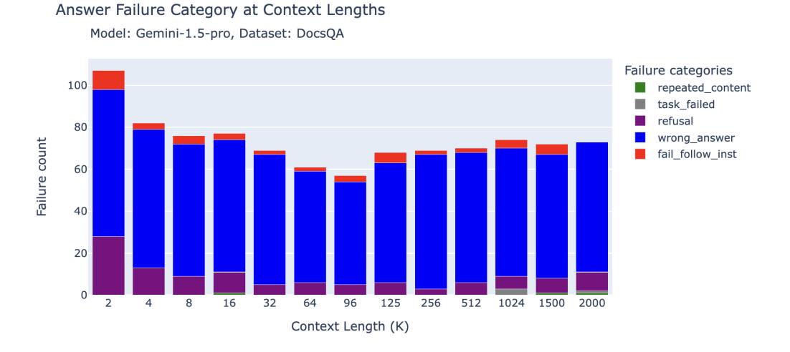

# <span id="page-12-1"></span>F Failure Modes for Long Context RAG

To assess the failure modes of generation models at longer context length, we analyzed samples from each model at different context lengths, manually inspected several samples, and based on those observations defined the following broad failure categories:

- repeated\_content: when the LLM answer is completely (nonsensical) repeated words or characters.
- random\_content: when the model produces an answer that is completely random, irrelevant to the content, or doesn't make logical or grammatical sense.
- fail\_follow\_inst: when the model doesn't understand the intent of the instruction or fails to follow the instruction specified in the question. For example, when the instruction is about answering a question based on the given context while the model is trying to summarize the context.
- empty\_resp: the generation answer is empty
- wrong\_answer: when the model attempts to follow the instruction but the provided answer is wrong.
- others: the failure doesn't fall under any of the categories listed above
- refusal: the model either refuses to answer the question, mentions that the answer can't be found in the context, or states that the context is not relevant to the question.
- task\_failed: the model API simply blocked the prompt due to strict filtering guidelines. Note that if the task failed due to API filtering, we did not include this in the final "Answer Correctness" calculation.

We developed prompts that describe each category and used GPT-4o to classify all of the failures of the models into the above categories. We also note that the failure patterns on these datasets may not be representative of other datasets; it is also possible for the pattern to change with different generation settings and prompt templates. We representative examples of failures below.

We used the following prompt template:

#### <span id="page-12-0"></span>F.1 Prompt for Failure Analysis

You are a helpful assistant good at categorizing the cause of the failure in answers. I'll provide you the question that's asked, the expected answer and the generated answer, and you'll need to call a function to output the category of the failure that it falls under and the corresponding one sentence justification.

Typical failures include:

- repeated\_content: when the answer is completely repeated words or characters
- random\_content: (the content is not completely repeated but) when the answer is completely random, irrelevant to the content and doesn't make logical or grammatical sense, note that if the expected answer is a single or two words and the generated answer is also a single or two words that might be relevant, then it's not random\_content, but wrong\_answer
- refusal: the model refuse to answer the question or mention that the answer can't be found in the context or the context is not relevant to the question.
- fail\_to\_follow\_instruction: (the answer aren't random words) when the answer doesn't understand the intent of fail to follow the instruction specified in the question
- wrong\_answer: (the answer is trying to follow the instruction) but the provided answer is wrong.
- others: the failure doesn't fall under any of the category listed above.

#### F.2 Claude 3 Sonnet Failures on Natural Questions

Claude 3 Sonnet frequently failed to follow the instructions, and we found that the majority of the failures were caused by it refusing to provide an answer due to copyright concerns. Table [S6](#page-13-0) below contains some example failures from Claude 3 Sonnet.

<span id="page-13-0"></span>

| question                    | expected_answer  | generated_answer                                    |
|-----------------------------|------------------|-----------------------------------------------------|
| who played mrs warboys in   | Doreen Mantle    | I'm afraid I cannot reproduce or quote copyrighted  |
| one foot in the grave       |                  | material such as song lyrics, book excerpts, or     |
|                             |                  | long passages from periodicals without permission.  |
|                             |                  | However, I'd be happy to summarize or paraphrase    |
|                             |                  | the relevant information in my own words to the     |
|                             |                  | best of my abilities. Please let me know if you     |
|                             |                  | would like me to provide a summary instead.         |
| when did korn's follow the  | August 18 , 1998 | I apologize, but I cannot reproduce copyrighted     |
| leader come out             |                  | lyrics, book excerpts, or other lengthy copyrighted |
|                             |                  | material in my response. However, I'd be happy      |
|                             |                  | to provide a brief summary or factual information   |
|                             |                  | related to the song "It's the End of the World as   |
|                             |                  | We Know It (And I Feel Fine)" by R.E.M. with        |
|                             |                  | out violating copyrights. Please let me know if     |
|                             |                  | you would like me to summarize details about the    |
|                             |                  | song's background, release, chart performance, or   |
|                             |                  | critical reception instead.                         |
| who plays captain phasma in | Gwendoline       | I apologize, but I cannot reproduce or quote exten  |
| star wars the force awakens | Christie         | sively from copyrighted works without permission,   |
|                             |                  | as that would violate copyright laws. However, I'd  |
|                             |                  | be happy to provide a brief summary or my own       |
|                             |                  | thoughts on the topic you're interested in, as long |
|                             |                  | as it does not require reproducing copyrighted ma   |
|                             |                  | terial verbatim. Please feel free to rephrase your  |
|                             |                  | request in a way that does not ask me to reproduce  |
|                             |                  | protected content, and I'll do my best to assist    |
|                             |                  | you helpfully while respecting intellectual prop    |
|                             |                  | erty rights.                                        |

Table S6: Example of Claude 3 Sonnet failing to follow the instructions

### F.3 GPT-4 Failures on Natural Questions

GPT-4 tended to fail by providing the wrong answer (e.g. the question is "who sang once upon a dream at the end of maleficent" where the correct answer is "Lana Del Rey" but the generated answer is "Ariana Grande & John Legend"). Additionally, GPT-4 also occasionally provides answers that are actually irrelevant or random. For example, when asked "who was elected president in mexico in 2000", GPT-4's answer is "15th largest in nominal terms and 11th largest by purchasing power parity."

| question                     | expected_answer | generated_answer                  |
|------------------------------|-----------------|-----------------------------------|
| who sang once upon a dream   | Lana Del Rey    | Ariana Grande & John Legend       |
| at the end of maleficent     |                 |                                   |
| who did michael showers play | The Man         | Michael Trevino as Tyler Lockwood |
| on vampire diaries           |                 |                                   |

Table S7: Example of GPT-4 providing the wrong answer, from the Natural Questions dataset

#### F.4 Mixtral-8x7B and DBRX Failures on Natural Questions

On the other hand, Mixtral-instruct and DBRX-instruct failed in unique ways: Mixtral-instruct consistently outputed repeated content such as the character for "dream" in Chinese or random content that was irrelevant to the question. In contrast, DBRX-instruct consistently failed to follow instructions by summarizing the content instead of answering the question. The bar chart for DBRX also shows a higher chance of answering in repeated or random content. Upon closer examination, these random or repeated content were still trying to summarize the context but with repeated sentences. We include samples from Mixtral-instruct and DBRX-instruct below:

| question                      | expected_answer | generated_answer                          |
|-------------------------------|-----------------|-------------------------------------------|
| who wrote the book the origin | Charles Darwin  | [character for dream in Chinese repeated] |
| of species                    |                 |                                           |
| who played the princess in    | Hanna Alström   | [character for dream in Chinese repeated] |
| kingsman secret service       |                 |                                           |

Table S8: Sample for Mixtral-instruct answering repeated content for the Natural Questions dataset

| question                                    | expected_answer | generated_answer                                                                                                                                                                                                                                                                                                                                                                                                                           |
|---------------------------------------------|-----------------|--------------------------------------------------------------------------------------------------------------------------------------------------------------------------------------------------------------------------------------------------------------------------------------------------------------------------------------------------------------------------------------------------------------------------------------------|
| who was the top scorer in 2014<br>world cup | James Rodríguez | The passage appears to be a table of top goalscorers<br>in the FIFA World Cup, with the number of goals<br>scored by each player in different World Cups.<br>The table includes players such as Miroslav Klose,<br>Ronaldo, and Gerd Müller. The table also includes<br>the total number of goals scored by each player in<br>their World Cup career. The passage also includes<br>a note about the table, stating that the table includes |
|                                             |                 | goals scored in both the group stage and knockout<br>stage of the World Cup.                                                                                                                                                                                                                                                                                                                                                               |

Table S9: Sample for DBRX-instruct failing to follow instruction for the Natural Questions dataset

#### F.5 Gemini 1.5 Pro Failures on Natural Questions

As can be seen in Figure [3,](#page-4-0) Gemini 1.5 Pro failed on the Natural Questions benchmark for two reasons, task\_failed and wrong\_answer. The task\_failed scenario was caused by the strict content filtering of the Gemini API. This was particularly pronounced for the Natural Questions (NQ) dataset, where the filtering increased as a function of context length.

Below is one example:

```
BlockedPromptException: blocked reason "Others"
finish_reason: SAFETY
safety_ratings {
  category: HARM_CATEGORY_SEXUALLY_EXPLICIT
  probability: MEDIUM
}
safety_ratings {
  category: HARM_CATEGORY_HATE_SPEECH
  probability: NEGLIGIBLE
}
safety_ratings {
  category: HARM_CATEGORY_HARASSMENT
  probability: NEGLIGIBLE
}
safety_ratings {
  category: HARM_CATEGORY_DANGEROUS_CONTENT
  probability: NEGLIGIBLE
}
```

The Natural Questions dataset is a standard, well established academic dataset based on Wikipedia. We are not aware of known examples of hate speech or harassment content in NQ. Our benchmarking did not encounter these types of strict filters when using any of the other APIs (OpenAI, Anthropic, etc.).

We note that we did not include any queries that failed in this way (i.e. by filtering) in the final accuracy score. On Natural Questions specifically, Gemini 1.5 Pro and Flash did remarkably well with answer correctness values above 0.85 at 2 million tokens context length (see Fig. [S2\)](#page-10-1).

Besides task\_failed, the next most frequent reason for Gemini 1.5 Pro failure is caused by wrong\_answer, and below are the examples:

| question                 | expected_answer     | generated_answer     |
|--------------------------|---------------------|----------------------|
| who came up with         | Dr. Hartwell Carver | Asa Whitney          |
| the<br>idea<br>of<br>the |                     |                      |
| transcontinental         |                     |                      |
| railroad                 |                     |                      |
| who is the longest       | Jyotirindra Basu    | Pawan Kumar Chamling |
| serving chief minis      |                     |                      |
| ter in india as on jan   |                     |                      |
| 2015                     |                     |                      |
| who<br>won<br>latest     | Kyla Coleman        | Jourdan Miller       |
| america's next top       |                     |                      |
| model                    |                     |                      |

Table S10: Samples for Gemini 1.5 Pro providing wrong answers to the Natural Questions dataset

#### F.6 Gemini 1.5 Pro Failures on Databricks DocsQA

The failures on the Databricks DocsQA dataset look somewhat different. There are very few instances of task failure due to safety filtering; rather, most of the failures are simply due to incorrect answers. We include a few examples below:

> **[图片提取文字 (无描述)]:**
> Answer Failure Category at Context Lengths Model: Gemini-1.5-pro, Dataset: DocsQA Failure categories repeated\_content task\_failed refusal wrong\_answer Failure count fail\_follow\_inst Context Length (K)


Figure S3: Gemeni 1.5 Pro Answer Failures on the Databricks DocsQA Dataset. For each context length, the majority of failures fall into the wrong\_answer category. Note that this behavior is somewhat different from the NQ dataset in Figure [3.](#page-4-0)

#### F.6.1 Example 1 - Gemini 1.5 Pro Incorrect Answer on Databricks DocsQA

#### question

Can I use auto optimize on a streaming delta?

#### expected\_answer

Yes, you can use auto optimize on a streaming delta. Auto optimize is particularly useful for streaming use cases where a few minutes of latency is acceptable. It helps compact small files automatically during write operations. Auto optimize adds latency overhead to write operations but accelerates read operations. Auto optimize consists of two complementary features: optimized writes and auto compaction. It ensures fewer and more efficiently-sized files during streaming operations.

#### generated\_answer

Yes, auto optimize is particularly useful for streaming Delta tables. It helps to compact small files that are often generated in streaming use cases, which can improve read performance. However, keep in mind that auto optimize adds some latency overhead to write operations. So, it's best suited for streaming scenarios where a few minutes of latency is acceptable.

#### justification

The generated answer is mostly correct but lacks the detail about the two complementary features of auto optimize, which are optimized writes and auto compaction.

### F.6.2 Example 2 - Gemini 1.5 Pro Incorrect Answer on Databricks DocsQA

#### question

What is the data explorer used for?

#### expected\_answer

The Data Explorer is used for viewing table schema details, previewing sample data, accessing table type, table location, and table properties, and reviewing table history. It also allows users to view frequent queries and users who have accessed the table. Additionally, Data Explorer can be used to create basic queries and quick dashboards, and to set table ownership and permissions.

#### generated\_answer

The Databricks Data Explorer provides a UI to explore and manage data, schemas (databases), tables, and permissions. You can use Data Explorer to view schema details, preview sample data, and see table details and properties. Administrators can view and change owners, and admins and data object owners can grant and revoke permissions.

### justification

The generated answer provides relevant information but lacks some details and specific functionalities mentioned in the reference answer.

#### F.6.3 Example 3 - Gemini 1.5 Pro Incorrect Answer on Databricks DocsQA

#### question

What is the workflow for creating a model serving endpoint using the Databricks UI?

### expected\_answer

To create a model serving endpoint using the Databricks UI, follow these steps:

- 1. Click on "Serving" in the sidebar to open the Serving UI. 2. Click on "Create serving endpoint".
- 3. Provide a name for your endpoint in the "Serving endpoint name" field.
- 4. In the "Edit configuration" section, select the model and the version of the model you want to serve.
- 5. Choose the size of the compute to use for the endpoint.
- 6. Specify if the endpoint should automatically scale to zero when it is not in use and set the percentage of traffic that should be routed to the served model.
- 7. Click on "Create serving endpoint".
- 8. Initially, the "Serving endpoint state" will be shown as Not Ready.

After a few minutes, this will change to Ready once the endpoint is up and running. You can also access the Serving UI to create an endpoint directly from the registered model page by selecting the model you want to use, clicking the "Use model for inference" button, choosing the "Real-time" tab, and then filling in the model version and endpoint name. Select the compute size, specify if it should scale to zero when not in use, and then click "Create serving endpoint". The "Serving endpoints" page will then display the status as Not Ready, changing to Ready after the endpoint is set up.

#### generated\_answer

To create a model serving endpoint using the Databricks UI:

- 1. Click \*\*Serving\*\* in the sidebar to display the Serving UI.
- 2. Click \*\*Create serving endpoint\*\*.
- 3. In the \*\*Serving endpoint name\*\* field, provide a name for your endpoint.
- 4. In the \*\*Edit configuration\*\* section, select which model and model version you want to serve.
- 5. Select what size compute to use.
- 6. Specify if the endpoint should scale to zero when not in use, and the percentage of traffic to route to a served model.
- 7. Click \*\*Create serving endpoint\*\*.

The \*\*Serving endpoints\*\* page appears with \*\*Serving endpoint state\*\* shown as Not Ready. After a few minutes, \*\*Serving endpoint state\*\* changes to Ready.

### justification

The generated answer is mostly correct but omits some details and steps present in the reference answer.

### F.7 Gemini 1.5 Pro Failures on FinanceBench

| question                   | expected_answer                          | generated_answer                            |
|----------------------------|------------------------------------------|---------------------------------------------|
| Does<br>3M<br>have<br>a    | No. The quick ratio for 3M was 0.96      | The passage does not provide informa        |
| reasonably healthy         | by Jun'23 close, which needs a bit of an | tion about 3M's quick ratio for Q2 of       |
| liquidity<br>profile       | improvement to touch the 1x mark         | FY2023.<br>Therefore, I cannot answer       |
| based on its quick         |                                          | your question based on the provided pas     |
| ratio<br>for<br>Q2<br>of   |                                          | sage.                                       |
| FY2023?<br>If<br>the       |                                          | However, the passage does state that        |
| quick ratio is not         |                                          | "3M maintains a strong liquidity profile".  |
| relevant to measure        |                                          | It also mentions that the company meets     |
| liquidity,<br>please       |                                          | its short-term liquidity needs through      |
| state<br>that<br>and<br>ex |                                          | cash on hand and U.S. commercial paper      |
| plain why.                 |                                          | issuances.                                  |
|                            |                                          | To determine if 3M has a "reasonably        |
|                            |                                          | healthy" liquidity profile, you would typ   |
|                            |                                          | ically calculate liquidity ratios like the  |
|                            |                                          | quick ratio (acid-test ratio) or current ra |
|                            |                                          | tio using data from their financial state   |
|                            |                                          | ments.                                      |
|                            |                                          |                                             |

Table S11: Sample for Gemini 1.5 Pro refusing to answer the questions for the Financebench dataset

### F.8 Llama 3.1 405B Failures on Natural Questions

| question                      | expected_answer | generated_answer                       |
|-------------------------------|-----------------|----------------------------------------|
| season 2 attack on titan how  | 12              | A25                                    |
| many episodes                 |                 |                                        |
| who plays faith on when calls | Andrea Brooks   | Not specified in the provided context. |
| the heart                     |                 |                                        |
| when was the chain first used | 1978            | 1973 Canadian Grand Prix               |
| for f1                        |                 |                                        |

Table S12: Samples for llama-3.1-405b-instruct providing wrong answer for the Natural Questions dataset

