# LONG-CONTEXT ATTENTION BENCHMARK: FROM KERNEL EFFICIENCY TO DISTRIBUTED CONTEXT PARALLELISM

Tao Bu∗ 1 Qiangang Wang∗ 1 Bowen Zeng2 Hanwen Sun3 Yunpeng Huang1 Chun Cao1 Jingwei Xu† 1

{butao,qgwang}@smail.nju.edu.cn, jingweix@nju.edu.cn

## ABSTRACT

Transformer-based large language models (LLMs) have achieved remarkable success, yet their standard attention mechanism incurs quadratic computation and memory costs with respect to sequence length, posing a major bottleneck for long-context training. Prior work tackles this challenge along two directions: (1) kernel-level optimizations, which accelerate dense and sparse attention operators; and (2) module-level strategies, often referred to as distributed attention or context parallel training, which scale attention across multiple devices. However, systematic evaluation still remains limited: operator-level comparisons are often incomplete, while context parallel strategies are typically framework-specific, with unclear performance analysis across contexts. To address these gaps, we propose a unified benchmark that integrates representative attention kernels and context parallel mechanisms with a modular and extensible interface for evaluation. The benchmark evaluates methods along two critical dimensions: (1) attention mask patterns, which strongly affect efficiency, scalability, and usability, and (2) sequence length and distributed scale, which determine performance under extreme long-context training. Through comprehensive experiments on the cluster of up to 96 GPUs, our benchmark enables reproducible comparisons, highlights methodspecific trade-offs, and provides practical guidance for designing and deploying attention mechanisms in long-context LLM training.

## 1 INTRODUCTION

The Transformer architecture, powered by the attention mechanism, has become the foundation of large language models (LLMs) [\(Achiam et al., 2023;](#page-9-0) [Team et al., 2023;](#page-15-0) [Dubey et al., 2024\)](#page-10-0). With the guidance of the scaling law [\(Kaplan et al., 2020;](#page-13-0) [Tay et al., 2022\)](#page-15-1), current state-of-the-art LLMs, such as GPT [\(Agarwal et al., 2025\)](#page-9-1), Gemini [\(Team et al., 2024\)](#page-15-2), and DeepSeek [\(Liu et al., 2024\)](#page-13-1), contain billions of parameters and are trained on trillions of data using large-scale distributed GPU clusters. However, as model size and training data continue to grow, the computational and memory costs of conventional attention scale quadratically with sequence length, posing a fundamental efficiency bottleneck for large-scale LLM training [\(Dai et al., 2024\)](#page-9-2). Although the context window of LLMs has expanded dramatically from 4K tokens to 128K [\(Grattafiori et al., 2024\)](#page-10-1), 1M [\(Yang](#page-15-3) [et al., 2025a\)](#page-15-3), and even 10M [\(Team et al., 2024\)](#page-15-2) tokens, the design and performance characteristics of long-context attention mechanisms at these scales in distributed training remain insufficiently understood [\(Gao et al., 2024b\)](#page-10-2).

Recent research on efficient long-context attention at scale has progressed along two main directions. The first focuses on kernel-level optimizations [\(Zhang et al.\)](#page-16-0), such as dense and sparse kernels,

1State Key Laboratory for Novel Software Technology, Nanjing University, China

2Zhejiang University, China

3Peking University, China

∗Equal contribution.

†Corresponding Author

reducing attention complexity on a single GPU. The second emphasizes module-level designs, or context parallelism [\(Duan et al., 2024\)](#page-10-3), which partition long sequences (e.g., 32K–128K tokens) across multiple GPUs with tailored communication and scheduling for scalability. Despite these advances, comprehensive analyses of long-context attention mechanisms remain lacking. Attention operators differ significantly in their support for mask patterns, and even the same operator can exhibit substantial performance variation across masks. Currently, no unified evaluation has been established. Furthermore, existing context parallel attention mechanisms are often tightly integrated with specific training frameworks (e.g., DeepSpeed [\(Rasley et al., 2020\)](#page-14-0) and InternEvo [\(Chen et al.,](#page-9-3) [2024\)](#page-9-3)), which limits reusability and hinders systematic comparison. As a result, researchers lack a clear understanding of the trade-offs between methods, and practitioners have no reliable benchmark or reference to guide the selection of attention mechanisms in long-context training.

To address these issues, we collect representative attention operators and context parallel mechanisms, and design a unified framework to systematically benchmark their capabilities, limitations, and potential risks in ultra-long context training. In our framework, we establish a unified data preparation interface that supports both non-distributed kernels and context parallel attention mechanisms, enabling fair evaluation across methods. Specifically, for non-distributed kernel scenarios, we integrate a variety of dense and sparse attention kernels, implementing standardized interfaces that eliminate inconsistencies in data representation and ensure comparability under the benchmark. For distributed scenarios, we reconstruct and optimize representative context parallel attention mechanisms within the unified framework, providing efficient, scalable implementations with modular interfaces. Building on the foundation, we conduct large-scale experiments and in-depth analyses along two critical dimensions: (1) attention mask patterns (up to 14 mask patterns), which are often overlooked but have a significant impact on efficiency, scalability, and usability, and (2) context length and distributed scale, where we systematically evaluate performance trends and capability limits as both the input length and distributed scale grow, reaching up to 512K on 96 GPUs. We hope our results offer valuable insights for research on long-context training of large models, as well as for the design and development of next-generation distributed attention mechanisms. Our contributions are threefold:

- 1. Unified benchmarking: we provide a standardized framework with consistent data preparation for fair evaluation of attention mechanisms across diverse long-context scenarios.
- 2. Modular components: we unify dense and sparse kernels under a high-level modular interface, and provide optimized distributed attention in terms of context parallelism.
- 3. In-depth analysis: we conduct extensive experiments across dense long-context scenarios to identify key factors affecting attention efficiency and scalability, providing valuable guidance for ultra-long context training and development.

## 2 LONGCA-BENCH

LongCA-bench is a benchmark designed to evaluate the efficiency of long-context attention across both single-device kernels and distributed context parallel mechanisms. The benchmark consists of three core components: (1) a unified data preparation interface that standardizes preprocessing, (2) a unified input representation interface that supports 7 dense and 5 sparse attention kernels, and (3) an optimized context parallelism framework that incorporates 5 distributed attention mechanisms. Together, these components provide a systematic and extensible platform for analyzing long-context attention, enabling fair comparisons across operator-level efficiency and distributed scalability.

#### 2.1 DATA PREPARATION

We first describe the data preparation process in the benchmark. To generate inputs practical for long-context attention benchmarking, we introduce a dedicated data preparation interface. Rather than directly using the downstream datasets, our interface combines *diverse mask patterns* with *variable lengths of sequence sampling*, ensuring that the evaluation data accurately reflects the characteristics and challenges of long-context training.

> **[图片提取文字 (无描述)]:**
> 12 Dense 2 Sparse Data Datasets Mask Generator Input Sampling Interface Preparation Distribution Masks Masks Data Component Long-Context Attention Benchmark Evaluation Hardware-NVIDIA H100 80 GB HBM3 GPUs Kernel Component Module Component Distributed Env Setup Interface Input Representation Interface Sequence Partition Interface Dense Kernel Sparse Kernel Distributed Module Flash Flex Flash VSA Ring Attention Naive VSA Ulysses Attention Attention Triton (P2P, All-Gather) Attention Infer cuDNN Fused Flash Torch FlashAttention2 Flex USP LoongTrain Sdpa Attention Mask Sparse Attention
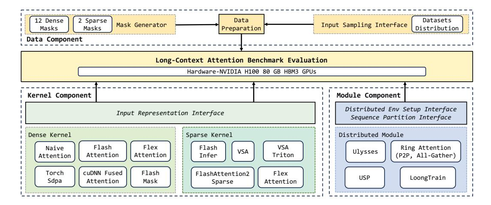

Figure 1: The architecture of LongCA benchmark

> **[图片提取文字 (无描述)]:**
> Full Sliding Window (FSW) Prefix LM Causal (PLC) Uniform Block Sparse Full (F) Full Document (FD) Causal Blockwise (CB) Global Sliding (GS) Prefix LM Document (PLD) Block Causal Document (BCD) Varible Block Sparse Causal (C) Causal Document (CD) Causal Sliding Window (CSW) Share Question (SQ) Regular Mask Heterogeneous Mask -- Static Mask -- Dynamic Mask-
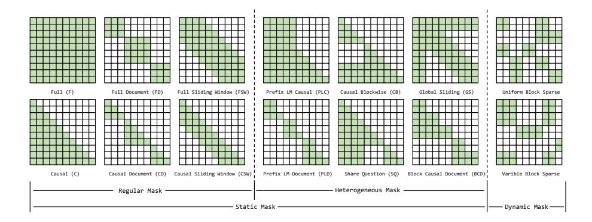

Figure 2: Attention mask patterns

#### 2.1.1 INPUT MASK PATTERNS

Different tasks require specific mask types based on the training scenario. In LongCA-bench, we categorize a total of 14 mask patterns into two major classes (see Figure 2): 12 static masks (6 regular and 6 heterogeneous), and 2 dynamic masks. The key distinction lies in whether the mask can be predetermined before training or must be generated adaptively during the training process.

**Static regular mask.** The FULL and CAUSAL masks are the most widely used in training (Vaswani et al., 2017). Considering the document-level variants, FULL DOCUMENT and CAUSAL DOCUMENT are employed for efficient sequence packing and in-batch/in-token processing (Krell et al., 2021; Dehghani et al., 2023). In addition, by applying the sliding window variants, FULL SLIDING WINDOW and CAUSAL SLIDING WINDOW can leverage sparsity to balance computational cost and token coverage (Beltagy et al., 2020).

Static heterogeneous mask. SHARED QUESTION mask used in reward models allows multiple answers to share the same question (Ouyang et al., 2022). GLOBAL SLIDING mask is designed to effectively capture both global context and local details (Zaheer et al., 2020). CAUSAL BLOCK-WISE mask, which is widely adopted in in-context learning, restricts demonstrations to local blocks while letting the test example attend globally, supporting long-context evaluation (Bertsch et al., 2024). The PREFIX LM CAUSAL and PREFIX DOCUMENT masks are specifically tailored to introduce a prefix for language modeling tasks (Raffel et al., 2020). BLOCK CAUSAL DOCUMENT mask combines the block and document concepts and is widely used in multimodal model training (Zewei & Yunpeng, 2025).

**Dynamic mask.** In long-context scenarios, block sparse masks reduce computational latency and memory usage by restricting attention computation to the most salient blocks of the input. Since

the selected blocks depend on the contextual input, the mask pattern varies across examples. Block sparse masks have been widely adopted in both natural language processing [\(Lu et al., 2025;](#page-13-3) [Yuan](#page-16-3) [et al., 2025;](#page-16-3) [Xu et al., 2025;](#page-15-5) [Guo et al., 2024;](#page-12-0) [Ye et al., 2025\)](#page-15-6) and visual generation [\(Zhang et al.,](#page-16-4) [2025d;](#page-16-4) [Zewei & Yunpeng, 2025;](#page-16-2) [Yang et al., 2025b\)](#page-15-7). We categorize block sparse masks into two types: uniform and variable (Figure [2\)](#page-2-0). The uniform block mask applies attention blocks of a fixed size (e.g., 64×64) across the entire attention map and computes the selected blocks during attention. In contrast, the variable block mask provides greater flexibility by allowing blocks of different sizes, offering a more efficient and expressive representation of sparse attention patterns.

#### 2.1.2 INPUT DATA SAMPLING

Dense data sampling. The mask specifies the area of attention interactions within a context window. As the context window expands (e.g., from 8K to 512K), input data sampling becomes crucial. To ensure that the benchmark data reflects realistic training scenarios, we analyzed several widely used public pretraining datasets, including Pile [\(Gao et al., 2020\)](#page-10-5), ProLong64K [\(Gao et al., 2024a\)](#page-10-6), ProLong512K [\(Gao et al., 2024a\)](#page-10-6), Slimpajama-Per-Source-Length-Upsample [\(Yaofu, 2024\)](#page-15-8), Open-WebText [\(Gokaslan et al., 2019\)](#page-10-7), and C4 [\(Raffel et al., 2020\)](#page-14-2) (see Appendix [A.1](#page-17-0) for details). Following prior findings [\(Fu et al., 2024;](#page-10-8) [Gao et al., 2024b\)](#page-10-2), we note that: (1) language model training typically requires datasets from diverse sources; (2) extending the context length requires maintaining domain diversity while upsampling long-sequence samples; and (3) mixing long-context sources (e.g., code repositories and books) with high-quality short-text data improves long-context modeling without sacrificing overall performance. In our benchmark, the data sampling method therefore uses the Pile dataset for samples up to 8K, ProLong64K for long-context samples up to 64K, and Pro-Long512K for ultra-long samples up to 512K. This combination ensures that evaluation data reflects realistic training scenarios across different context scales.

Sparse data sampling. Mask generation for block sparse attention in our benchmark follows standard methodology [\(Xia et al., 2025;](#page-15-9) [Lu et al., 2025;](#page-13-3) [Yuan et al., 2025;](#page-16-3) [Zhang et al., 2025d\)](#page-16-4). The attention matrix is first partitioned into a two-dimensional grid of blocks, with either uniform or variable pre-defined block sizes. An importance score is then computed for each block in the grid, which in multi-head attention may be assigned on a per-head or per-group basis. Guided by a target sparsity ratio, a top-K selection is performed for each query block to identify the most salient key blocks for attention computation. In our benchmark, however, we simplify the process to specifically evaluate kernel performance under varying sparsity levels (e.g., 0.2, 0.5, and 0.8). Instead of computing explicit important scores, we simulate the scoring and selection process by randomly generating block masks to achieve the desired sparsity. To create real-world workloads, we evaluate sequence lengths from 32K to 128K, sampled at 32K intervals. This range is derived from analyzing prominent benchmarks for block sparse attention's primary applications in video generation (e.g., VBench [\(Huang et al., 2024\)](#page-12-1)) and LLMs (e.g., RULER [\(Hsieh et al., 2024\)](#page-12-2)). Our evaluation covers both MHA and GQA using uniform block sizes of 64×64 and 128×128 (see Appendix [A.2](#page-20-0) for full results).

#### 2.2 ATTENTION KERNEL

Efficient attention kernels aim to reduce time and memory complexity without compromising expressiveness. The most straightforward approach is hardware acceleration, which speeds up computation without altering the original attention logic. Another common strategy leverages the inherent sparsity of attention, skipping unnecessary computations, often guided by a dynamic sparse mask.

Dense attention kernel. We integrate seven dense attention kernels and categorize their support for different mask types (see Table [1\)](#page-4-0). Since kernels often apply for different requirements on data structure and mask formats, we implement dedicated adapter interfaces for each. These interfaces generate kernel-specific input representations from a unified data format, eliminating inconsistencies in data expression across kernels. This design simplifies input preparation for diverse mask scenarios, ensures comparability within the benchmark, and provides a unified solution for future kernel extensions.

As baselines in our benchmark, we include both the step-by-step na¨ıve attention and PyTorch's fused scaled dot product attention (SDPA) [\(PyTorch Contributors, 2024b\)](#page-14-3), both construct full 2D masks and theoretically support arbitrary masking patterns. For hardware-optimized kernels, we

Table 1: Dense kernel support across mask patterns

|                       | Dense Kernels |      |          |          |                  |          |           |
|-----------------------|---------------|------|----------|----------|------------------|----------|-----------|
| Mask Type             | Naive-Torch   | SDPA | FA2      | FA3      | cuDNN-Fused-Attn | FlexAttn | FlashMask |
| FULL                  | ✓             | ✓    | <b>√</b> | <b>√</b> | ✓                | <b>√</b> | ✓         |
| CAUSAL                | ✓             | ✓    | ✓        | ✓        | ✓                | ✓        | ✓         |
| FULL SLIDING WINDOW   | ✓             | ✓    | ✓        | ✓        | ✓                | ✓        | ✓         |
| CAUSAL SLIDING WINDOW | ✓             | ✓    | ✓        | ✓        | ✓                | ✓        | ✓         |
| FULL DOCUMENT         | ✓             | ✓    | ✓        | ✓        | ✓                | ✓        | ✓         |
| CAUSAL DOCUMENT       | ✓             | ✓    | ✓        | ✓        | ✓                | ✓        | ✓         |
| SHARE QUESTION        | ✓             | ✓    | Х        | Х        | X                | ✓        | ✓         |
| CAUSAL BLOCKWISE      | ✓             | ✓    | Х        | Х        | X                | ✓        | ✓         |
| GLOBAL SLIDING        | ✓             | ✓    | Х        | Х        | X                | ✓        | ✓         |
| PREFIX LM CAUSAL      | ✓             | ✓    | Х        | Х        | ×                | ✓        | ✓         |
| PREFIX LM DOCUMENT    | ✓             | ✓    | X        | X        | X                | ✓        | ✓         |
| BLOCK CAUSAL DOCUMENT | ✓             | ✓    | X        | X        | X                | ✓        | ✓         |

Table 2: Characteristics of sparse kernels

|                        | Sparse Kernels |              |              |               |              |  |  |  |
|------------------------|----------------|--------------|--------------|---------------|--------------|--|--|--|
| Characteristics        | VSA            | Triton VSA   | FA2 Sparse   | FlexAttention | FlashInfer   |  |  |  |
| Uniform/Variable Masks | Uniform only   | Uniform only | Uniform only | Both          | Both         |  |  |  |
| Forward/Backward       | Both           | Both         | Forward only | Both          | Forward only |  |  |  |
| Block Size             | 64 only        | 64 only      | 128 only     | Arbitrary     | Arbitrary    |  |  |  |
| GQA Support            | x ·            | X ·          | ✓            | ✓ *           | ✓ .          |  |  |  |
| GPU Support            | > sm90         | > sm80       | > sm80       | > sm80        | > sm80       |  |  |  |
| Performance ↑          | High           | Medium       | Medium       | Low           | Medium       |  |  |  |
| Memory Overhead ↓      | Low            | Low          | Low          | High          | Medium       |  |  |  |

integrate the FlashAttention series, including FA (Dao et al., 2022), FA2 (Dao, 2023), FA3 (Shah et al., 2024), as well as cuDNN fused kernels (NVIDIA Corporation, 2025). These kernels employ advanced techniques such as shared memory, block-wise partitioning, warp scheduling, FP8, and asynchronous processing. For flexible kernels, we integrate FlexAttention (Flex) (Dong et al., 2024), a general fused operator with memory complexity close to  $O(S^2)$ , where S denotes the sequence length, that generates specialized kernels based on per-position boolean functions and enables compatibility with arbitrary masks. We also include FlashMask (Wang et al., 2025a), which introduces a column-wise representation to optimize heterogeneous computation.

**Sparse attention kernel.** Sparse attention significantly reduces the computational complexity of attention for long sequences. Due to its versatile mask representation, block sparse attention is widely used in state-of-the-art sparse attention methods (Lu et al., 2025; Zhang et al., 2025b; Yuan et al., 2025; Zhang et al., 2025d; Xu et al., 2025). Therefore, our benchmark incorporates five block sparse attention kernels to evaluate long-context sparse attention.

We categorize these kernels into two main types. The first type consists of dedicated block sparse attention kernels, which are highly optimized for sparse patterns with uniform block sizes (e.g., 64×64). Representative implementations include VSA (Zhang et al., 2025d), its Triton-based version (Triton VSA), and the FlashAttention-2-based block sparse attention (FA2 Sparse) (Guo et al., 2024). The second type comprises general-purpose sparse attention kernels, which offer greater flexibility and support arbitrary block structures. They are compatible with both uniform and variable block sparse masks. This category includes FlexAttention (Dong et al., 2024) and FlashInfer (Ye et al., 2025). These kernels exhibit different characteristics, as summarized in Table 2 (refer to Appendix A.3 for details). We evaluate performance through comparisons using two mask types: uniform block mask and variable block mask. Note that backward computation in training is supported by only a limited set of block-sparse attention kernels. For comprehensiveness, we select FA2 Sparse and FlashInfer, two inference-side methods, for comparisons in our benchmark.

#### 2.3 DISTRIBUTED ATTENTION MECHANISM

In our benchmark, we reproduce and optimize 5 representative distributed attention mechanisms under a unified framework, including Ulysess, Ring P2P, Ring All-Gather, USP, and LoongTrain. We establish a unified infrastructure that standardizes distributed setup and sequence partitioning, ensuring a consistent invocation protocol across all methods. The integrated distributed attention mechanisms can be categorized into three architectural designs:

All-to-all based design. DeepSpeed's Ulysses [\(Jacobs et al., 2023\)](#page-13-4) partitions both the sequence and head dimensions in multi-head attention, using All-to-All communication to switch parallel dimensions. This approach is simple, general, and numerically precise, but the scalability is constrained by the number of attention heads, particularly under GQA, MQA, or tensor parallelism.

Ring P2P based design. Ring P2P [\(Liu et al., 2023\)](#page-13-5) uses multi-round ring-structured point-to-point communication, while Ring All-Gather [\(NVIDIA, 2025\)](#page-13-6) performs a single all-gather of key-value tensors, relying on ring topologies. These approaches exhibit strong scalability and naturally overlap computation with communication via pipelining. However, they suffer from lower efficiency and potential numerical error accumulation.

Hybrid design. USP [\(Fang & Zhao, 2024\)](#page-10-11) and LoongTrain [\(Gu et al., 2024\)](#page-12-3) extend Ulysses and ring-based designs into a two-dimensional scheme. An inner layer applies Ulysses with All-to-All for intra-node bandwidth, while an outer layer uses ring-based attention to enhance scalability and enable compute–communication overlap. LoongTrain further proposes DoubleRing Attention, enhancing Ring P2P with a two-level sliding window to improve communication efficiency.

In our reproduction and optimization, we draw inspiration from TransformerEngine [\(NVIDIA,](#page-13-6) [2025\)](#page-13-6), achieving perfect load balancing through double-parallel partitioning combined with headto-tail reordering [\(zhuzilin, 2024\)](#page-16-6). We also incorporate optimizations such as double buffering and multi-stream overlap of computation. For each method, we implement backend support for both Flash Attention v3 and cuDNN Fused Attention operators. We extend the input layout to a variablelength (varlen) format, allowing multiple sequences of different lengths to be concatenated along the sequence dimension while handling padding tokens. This ensures the flexibility and usability of varlen inputs under different distributed scales. Since varlen inputs can introduce substantial synchronization and waiting overhead across devices, we precompute the necessary meta-information for all distributed strategies as a one-time preprocessing step, thereby minimizing distributionrelated performance degradation. Despite these extensions and optimizations, our benchmark remains constrained by the underlying distributed attention designs, thus currently supporting only FULL, CAUSAL, FULL/CAUSAL DOCUMENT masks.

## 3 EVALUATION

In this section, we present experiments evaluating the speed and memory efficiency of different attention methods under long-context scenarios. The speed is measured in TFLOPs/s metric, and peak memory usage is reported in gigabytes (GB). Kernel performance is evaluated on a single GPU, while the performance of distributed context parallel attention is assessed across multi-GPU clusters of varying scales. All experiments are conducted on NVIDIA H100 GPUs with 80GB HBM3 memory. The code is publicly available for the community[1](#page-5-0) .

#### 3.1 DENSE ATTENTION KERNEL PERFORMANCE

We evaluate dense kernels across 12 static mask configurations to assess both expressiveness and efficiency. Sequence lengths range from 1K to 48K, with BFloat16 precision, a hidden dimension of 128, and two head settings: GQA (64:8) and MHA (64:64)[2](#page-5-1) . We record forward and backward throughput as well as peak memory usage (see Appendix [A.4](#page-21-0) for full results).

Figure [3](#page-6-0) and [7](#page-21-1) report TFLOPs at 8K sequence length under GQA (64:8), where ✗ denotes unsupported configurations. The six groups on the left correspond to static regular masks, and the remaining on the right show static heterogeneous masks. Note that the FA series and cuDNN fused kernels do not support heterogeneous masks. In particular, cuDNN fused kernel does not support the FULL SLIDING WINDOW mask with GQA (64:8), though other configurations are recommended.

Although the na¨ıve implementation and Torch SDPA theoretically support arbitrary masks, their quadratic complexity leads to severe efficiency degradation and excessive memory overhead, making them impractical in long-context settings. Under computation-intensive dense settings (e.g., FULL or CAUSAL), SDPA achieves performance comparable to general fused operators such as

1The implementation is accessible at: <https://github.com/NJUDeepEngine/LongCA-bench>

> **[图片提取文字 (无描述)]:**
> GQA Fwd Flops (8k) H100 fa2 cudnn flex flash\_mask sdpa fa3 torch 800 700 Speed (teraFLOPs/s) 600 500 400 300 200 100 F C CSW FD CD SQ GS BCD **FSW** CB PLC PLD
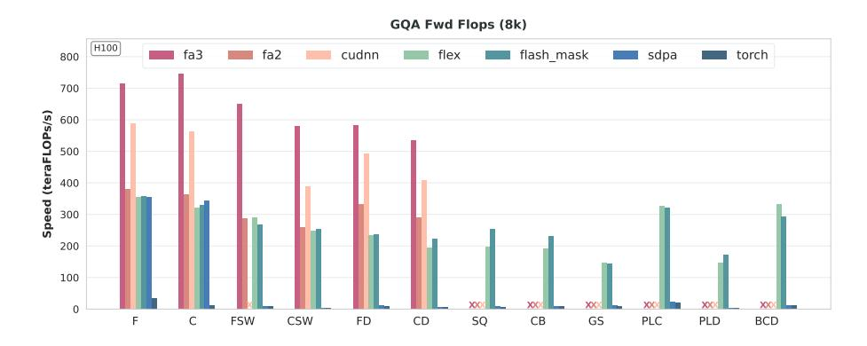

Figure 3: Forward TFLOPs of dense kernels with different masks (8K length)

FlexAttention. These results provide a baseline for fused operators without hardware-specific optimizations. FlashMask, another generic fused operator, leverages a column-wise mask representation to mitigate computational sparsity. While optimized for heterogeneous masks, its column-wise representation cannot cover all scenarios, making it less general than FlexAttention.

For regular scenarios, FA series and cuDNN fused attention are all hardware-optimized kernels. On H100 GPUs, FA3, specifically optimized for the Hopper architecture, achieves the best performance. cuDNN fused attention supports multiple architectures but imposes stricter constraints on data patterns (e.g., GQA (64:8) with FULL SLIDING WINDOW). While some of these limitations can be circumvented by preprocessing techniques such as padding, doing so introduces extra overhead. Note that although FA2 and cuDNN fused attention yield lower performance, kernel selection should be guided by the target hardware architecture.

#### 3.2 Sparse attention kernel performance

To comprehensively evaluate the functionality and computational efficiency of various sparse kernels, we include VSA (Zhang et al., 2025d), Triton VSA, FA2 sparse (Guo et al., 2024) and Flash-Infer (Ye et al., 2025) in our evaluation (see Appendix A.5 for full results). We perform kernel-level evaluations across two kinds of block sizes (64 and 128), both forward and backward computation, two attention variants (MHA (64:64) and GQA (64:8)), and sequence lengths ranging from 32K to 128K. Note that FlexAttention (Dong et al., 2024) is excluded due to severe out-of-memory (OOM) issues originating from its mask representations.

From a functionality perspective, comparisons in Figure 4 (a) and (b) reveal that FA2 sparse does not support a block size of 64, while FlashInfer lacks backward computation. As shown in Figure 4 (a), (c), and (d), VSA does not support a block size of 128. Due to its specific design for the MHA architecture in video diffusion models, VSA does not currently support GQA. In contrast, FlashInfer is prone to OOM errors at longer sequence lengths and smaller block sizes, stemming from the substantial metadata storage it requires.

These limitations highlight the need for further engineering optimizations in block-sparse kernels. Backward computation is essential for trainable sparse attention, particularly in GQA and MHA. Flexibility across block sizes is required to support diverse sparse attention designs, and memory challenges in block-sparse mask representations also need to be addressed.

From a performance perspective, Figure 4 (a) and (b) show that VSA outperforms both Triton VSA and FlashInfer, while Figures 4 (c) and (d) indicate that FlashInfer outperforms fa2 sparse. Across all kernels, the forward pass consistently achieves a higher percentage of theoretical TFLOPs than the backward pass (with theoretical TFLOPs taken from FA3 in Figure 7). Additionally, Figure 4 (c) and (d) show minimal performance differences between MHA and GQA, though GQA achieves better GPU memory efficiency. By comparing Figures 4 (a) and (c), we observe that FlashInfer performs significantly better with a block size of 128 than with 64, suggesting that larger block sizes are more effective for achieving higher performance.

> **[图片提取文字 (无描述)]:**
> 600 H100 fa2\_sparse flashinfer vsa\_triton vsa raFLOPs/s) 500 400 300 200 100 32k 64k 96k 128k 32k 64k 96k 128k 32k 64k 96k 128k 32k 64k 96k 128k (a) Fwd, MHA, Block=64 (b) Bwd, MHA, Block=64 (c) Fwd, GQA, Block=128 (d) Fwd, MHA, Block=128 Sequence Length
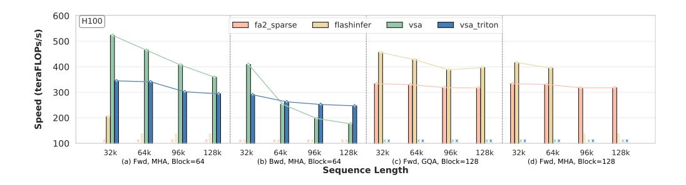

Figure 4: Performance results (TFLOPs) of sparse kernels with a 50% sparsity ratio

> **[图片提取文字 (无描述)]:**
> full\_document\_fwd\_flops H100 ulysses ring\_p2p loongtrain usp Speed (teraFLOPs/s) Distributed Scale (#GPUs)
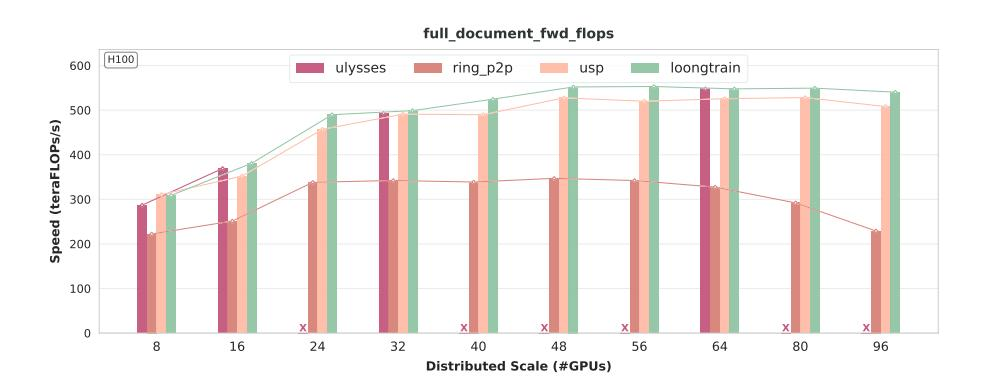

Figure 5: Forward TFLOPs of Context Parallel Attention on FULL DOCUMENT.

Overall, these results demonstrate that performance in block sparse attention is significantly improved through specialization, where kernels tailored to particular parameters (e.g., block size or hardware architecture) consistently outperform general implementations. Meanwhile, the backward pass remains a major bottleneck, underscoring an urgent need for optimization. A key future direction is the development of more flexible, comprehensive kernels that deliver high performance across a wide range of block sizes. Achieving this goal requires moving beyond single-parameter tuning toward deeper, hardware-level optimizations.

#### 3.3 CONTEXT PARALLEL ATTENTION PERFORMANCE

We evaluate four mask patterns: FULL, CAUSAL, FULL DOCUMENT, and CAUSAL DOCUMENT. The per-device sequence length is fixed at 8K with hidden size 128, validated under the GQA (64:8) setting. Experiments are conducted on NVIDIA H100 GPUs, scaling from 8 to 96 GPUs across 12 servers, with total context windows from 64K to 512K. Since Ulysses requires divisibility constraints, GQA is converted to MHA by replicating KV heads (X indicates divisibility failure). Performance under FULL DOCUMENT is shown in Figure 5 and 23, with additional details provided in Appendix A.63.

Context parallel attention inevitably involves distributed communication, raising two major concerns: (1) whether communication effectively overlaps with computation, and if not, how efficient the communication is; and (2) whether workload balance is achieved in terms of both data volume and computation across devices. Ideally, a context parallel strategy should behave close to a non-distributed setting. Inter-node communication constitutes the dominant bottleneck compared to computation and intra-node communication. In our experiments, we fix the large-load AllToAll groups within the mixed architecture to 8 per node, while the small-load P2P groups are placed across nodes and scale with the number of nodes. For the secondary P2P communication groups in LoongTrain, we adopt a balanced configuration (e.g.,  $12 = 3 \times 4$ ) to maximize inter-node bandwidth utilization. All experiments are performed on the FA3 backend for consistency.

&lt;sup>3Due to resource constraints, we temporarily omit the experimental results for Ring All-Gather.

Ulysses' AllToAll communication is entirely exposed outside the computation. Thanks to its collective communication pattern [\(NVIDIA Corporation, 2020\)](#page-14-6) with low communication overhead and its head-sharded computation pattern leading to perfectly balanced workloads, Ulysses still delivers solid performance. However, its scalability is bounded by the number of attention heads. A loadbalanced Ring P2P ensures that each GPU processes the same amount of computation and communication per iteration. However, Ring P2P communication is mask-independent, always transferring in a fixed ratio of D/N, where D is the total data and N is the world size, meaning performance depends entirely on the amount of computation workload. Ring P2P performs optimally in the FULL scenario. However, in the DOCUMENT scenario, variable-length padding depends on scale and sampling, leading to noticeable per-GPU computation variation and performance fluctuations.

The hybrid architecture alleviates the above issues. While the intra-node AllToAll communication group still remains exposed outside computation, its per-communication volume is reduced from D × (N − 1)/N in Ulysses to D × (8 − 1)/N per group (one-way). Meanwhile, the inter-node Ring P2P computation volume increases from D/N in pure Ring P2P to D/K, enabling USP and LoongTrain to achieve optimal performance improvements, where K denotes the size of the internode communication group. Additionally, LoongTrain introduces a secondary P2P architecture to further improve inter-node bandwidth utilization, providing modest forward speedups compared to USP. However, because the secondary architecture involves extra window synchronization, the Ring backward pass cannot directly continue from the forward state, negating the overall performance gains. Overall, the experimental results demonstrate that fully leveraging MHA by first partitioning the heads yields significant performance benefits.

## 4 RELATED WORK

Long context language modeling. Models such as BERT [\(Devlin et al., 2019\)](#page-10-12) and GPT [\(Brown](#page-9-7) [et al., 2020\)](#page-9-7) can process thousands of tokens, supporting document and dialogue level tasks, with full document understanding and long range retrieval emerging as key challenges. Recently, model context windows have expanded dramatically, from 4K tokens to 128K [\(Dubey et al., 2024\)](#page-10-0), 1M [\(Yang](#page-15-3) [et al., 2025a\)](#page-15-3), and even 10M tokens [\(Team et al., 2024\)](#page-15-2). The ability to model ultra-long contexts enables continuous reference, reasoning, and summarization over extended input sequences. This enhances advanced capabilities such as long-text reasoning [\(Guo et al., 2025;](#page-12-4) [Muennighoff et al.,](#page-13-7) [2025\)](#page-13-7), improved in-context learning [\(Li et al., 2025;](#page-13-8) [Team et al., 2024\)](#page-15-2), efficient information compression [\(Lee et al., 2024;](#page-13-9) [Wang et al., 2024\)](#page-15-11), and multimodal understanding [\(Weng et al., 2024\)](#page-15-12).

Attention kernels. Attention is the core component in Transformers with the time complexity of O(n 2 ) in terms of context length. Hardware-efficient attention leverages hardware features to reduce the time and memory costs. [Dao et al.](#page-10-9) [\(2022\)](#page-10-9); [Dao](#page-9-6) [\(2023\)](#page-9-6); [Shah et al.](#page-14-4) [\(2024\)](#page-14-4) employs matrix tiling and kernel fusion. [Zhang et al.](#page-16-7) [\(2024b](#page-16-7)[;a;](#page-16-8) [2025a\)](#page-16-9) uses quantization to leverage low-bit Tensor Cores. Sparse Kernels use the inherent sparsity [\(Child et al., 2019;](#page-9-8) [Zhang et al., 2025b\)](#page-16-5) of the attention map P = Softmax(QK⊤/ √ d) to accelerate computation. Other directions include KV cache compression [\(Zhao et al., 2023a\)](#page-16-10) via weight sharing [\(Ainslie et al., 2023\)](#page-9-9) or low-rank decomposition [\(Liu et al., 2024\)](#page-13-1) to reduce memory overhead without extra computation.

Parallelism for distributed training. Various parallel paradigms have been developed to tackle resource challenges in large-scale distributed model training. Data parallelism [\(PyTorch Contrib](#page-14-7)[utors, 2024a;](#page-14-7) [Rajbhandari et al., 2020;](#page-14-8) [Zhao et al., 2023b\)](#page-16-11) partitions data along the batch dimension. Tensor parallelism [\(Shoeybi et al., 2019;](#page-14-9) [Xu & You, 2023;](#page-15-13) [Wang et al., 2022\)](#page-15-14), pipeline parallelism [\(Huang et al., 2019;](#page-12-5) [Li & Hoefler, 2021;](#page-13-10) [Narayanan et al., 2019;](#page-13-11) [Qi et al., 2024\)](#page-14-10) [39–42], and expert parallelism [\(Gale et al., 2023;](#page-10-13) [Hwang et al., 2023;](#page-13-12) [Li et al., 2023;](#page-13-13) [Liu et al., 2024\)](#page-13-1) partition model parameters along different dimensions. Hybrid parallel strategies [\(Smith et al., 2022;](#page-14-11) [Ge et al., 2025;](#page-10-14) [Wang et al., 2025b\)](#page-15-15) are used to meet diverse needs and balance computation and memory. However, these strategies cannot fully address activation memory overhead from ultra-long sequences. Context parallelism [\(Korthikanti et al., 2023;](#page-13-14) [Li et al., 2021\)](#page-13-15) partitions data by sequence, but faces challenges in computation–communication overlap, balancing, scalability, and usability; many designs remain underexplored, and near-linear scalability is still difficult.

## 5 CONCLUSION

The complexity of distributed environments is far greater than that of single-device settings. In ultra-long context training, selecting or developing appropriate kernels and context parallel strategies poses significant challenges and requires substantial effort and resources. To address this, we present a fair and unified benchmark for attention mechanisms in ultra-long context training, covering the spectrum from single-device kernels to large-scale distributed context parallel methods. Although our work has limitations, it aims to improve fairness in comparing different approaches, expose their performance trade-offs and constraints, and provide objective references to guide future research and development in ultra-long context training.

## REFERENCES

- Josh Achiam, Steven Adler, Sandhini Agarwal, Lama Ahmad, Ilge Akkaya, Florencia Leoni Aleman, Diogo Almeida, Janko Altenschmidt, Sam Altman, Shyamal Anadkat, et al. Gpt-4 technical report. *arXiv preprint arXiv:2303.08774*, 2023.
- Sandhini Agarwal, Lama Ahmad, Jason Ai, Sam Altman, Andy Applebaum, Edwin Arbus, Rahul K Arora, Yu Bai, Bowen Baker, Haiming Bao, et al. gpt-oss-120b & gpt-oss-20b model card. *arXiv preprint arXiv:2508.10925*, 2025.
- Sand. ai, Hansi Teng, Hongyu Jia, Lei Sun, Lingzhi Li, Maolin Li, Mingqiu Tang, Shuai Han, Tianning Zhang, W. Q. Zhang, Weifeng Luo, Xiaoyang Kang, Yuchen Sun, Yue Cao, Yunpeng Huang, Yutong Lin, Yuxin Fang, Zewei Tao, Zheng Zhang, Zhongshu Wang, Zixun Liu, Dai Shi, Guoli Su, Hanwen Sun, Hong Pan, Jie Wang, Jiexin Sheng, Min Cui, Min Hu, Ming Yan, Shucheng Yin, Siran Zhang, Tingting Liu, Xianping Yin, Xiaoyu Yang, Xin Song, Xuan Hu, Yankai Zhang, and Yuqiao Li. Magi-1: Autoregressive video generation at scale, 2025. URL <https://arxiv.org/abs/2505.13211>.
- Joshua Ainslie, James Lee-Thorp, Michiel De Jong, Yury Zemlyanskiy, Federico Lebron, and Sumit ´ Sanghai. Gqa: Training generalized multi-query transformer models from multi-head checkpoints. *arXiv preprint arXiv:2305.13245*, 2023.
- Iz Beltagy, Matthew E Peters, and Arman Cohan. Longformer: The long-document transformer. *arXiv preprint arXiv:2004.05150*, 2020.
- Amanda Bertsch, Maor Ivgi, Emily Xiao, Uri Alon, Jonathan Berant, Matthew R Gormley, and Graham Neubig. In-context learning with long-context models: An in-depth exploration. *arXiv preprint arXiv:2405.00200*, 2024.
- Tom Brown, Benjamin Mann, Nick Ryder, Melanie Subbiah, Jared D Kaplan, Prafulla Dhariwal, Arvind Neelakantan, Pranav Shyam, Girish Sastry, Amanda Askell, et al. Language models are few-shot learners. *Advances in neural information processing systems*, 33:1877–1901, 2020.
- Qiaoling Chen, Diandian Gu, Guoteng Wang, Xun Chen, YingTong Xiong, Ting Huang, Qinghao Hu, Xin Jin, Yonggang Wen, Tianwei Zhang, et al. Internevo: Efficient long-sequence large language model training via hybrid parallelism and redundant sharding. *arXiv preprint arXiv:2401.09149*, 2024.
- Tianqi Chen, Bing Xu, Chiyuan Zhang, and Carlos Guestrin. Training deep nets with sublinear memory cost. *arXiv preprint arXiv:1604.06174*, 2016.
- Rewon Child, Scott Gray, Alec Radford, and Ilya Sutskever. Generating long sequences with sparse transformers. *arXiv preprint arXiv:1904.10509*, 2019.
- Liuyao Dai, Hao Qi, Weicong Chen, and Xiaoyi Lu. High-speed data communication with advanced networks in large language model training. *IEEE Micro*, 44(2):31–40, 2024.
- Tri Dao. Flashattention-2: Faster attention with better parallelism and work partitioning. *arXiv preprint arXiv:2307.08691*, 2023.

- Tri Dao, Dan Fu, Stefano Ermon, Atri Rudra, and Christopher Re. Flashattention: Fast and memory- ´ efficient exact attention with io-awareness. *Advances in neural information processing systems*, 35:16344–16359, 2022.
- Mostafa Dehghani, Basil Mustafa, Josip Djolonga, Jonathan Heek, Matthias Minderer, Mathilde Caron, Andreas Steiner, Joan Puigcerver, Robert Geirhos, Ibrahim M Alabdulmohsin, et al. Patch n'pack: Navit, a vision transformer for any aspect ratio and resolution. *Advances in Neural Information Processing Systems*, 36:2252–2274, 2023.
- Jacob Devlin, Ming-Wei Chang, Kenton Lee, and Kristina Toutanova. Bert: Pre-training of deep bidirectional transformers for language understanding. In *Proceedings of the 2019 conference of the North American chapter of the association for computational linguistics: human language technologies, volume 1 (long and short papers)*, pp. 4171–4186, 2019.
- Juechu Dong, Boyuan Feng, Driss Guessous, Yanbo Liang, and Horace He. Flex attention: A programming model for generating optimized attention kernels. *arXiv preprint arXiv:2412.05496*, 2024.
- Jiangfei Duan, Shuo Zhang, Zerui Wang, Lijuan Jiang, Wenwen Qu, Qinghao Hu, Guoteng Wang, Qizhen Weng, Hang Yan, Xingcheng Zhang, et al. Efficient training of large language models on distributed infrastructures: a survey. *arXiv preprint arXiv:2407.20018*, 2024.
- Abhimanyu Dubey, Abhinav Jauhri, Abhinav Pandey, Abhishek Kadian, Ahmad Al-Dahle, Aiesha Letman, Akhil Mathur, Alan Schelten, Amy Yang, Angela Fan, et al. The llama 3 herd of models. *arXiv e-prints*, pp. arXiv–2407, 2024.
- Jiarui Fang and Shangchun Zhao. Usp: A unified sequence parallelism approach for long context generative ai. *arXiv preprint arXiv:2405.07719*, 2024.
- Yao Fu, Rameswar Panda, Xinyao Niu, Xiang Yue, Hannaneh Hajishirzi, Yoon Kim, and Hao Peng. Data engineering for scaling language models to 128k context. *arXiv preprint arXiv:2402.10171*, 2024.
- Zichuan Fu, Wentao Song, Yejing Wang, Xian Wu, Yefeng Zheng, Yingying Zhang, Derong Xu, Xuetao Wei, Tong Xu, and Xiangyu Zhao. Sliding window attention training for efficient large language models. *arXiv preprint arXiv:2502.18845*, 2025.
- Trevor Gale, Deepak Narayanan, Cliff Young, and Matei Zaharia. Megablocks: Efficient sparse training with mixture-of-experts. *Proceedings of Machine Learning and Systems*, 5:288–304, 2023.
- Leo Gao, Stella Biderman, Sid Black, Laurence Golding, Travis Hoppe, Charles Foster, Jason Phang, Horace He, Anish Thite, Noa Nabeshima, et al. The pile: An 800gb dataset of diverse text for language modeling. *arXiv preprint arXiv:2101.00027*, 2020.
- Tianyu Gao, Alexander Wettig, Howard Yen, and Danqi Chen. Enabling large language models to generate text with citations. 2024a.
- Tianyu Gao, Alexander Wettig, Howard Yen, and Danqi Chen. How to train long-context language models (effectively). *arXiv preprint arXiv:2410.02660*, 2024b.
- Hao Ge, Junda Feng, Qi Huang, Fangcheng Fu, Xiaonan Nie, Lei Zuo, Haibin Lin, Bin Cui, and Xin Liu. Bytescale: Efficient scaling of llm training with a 2048k context length on more than 12,000 gpus. *arXiv preprint arXiv:2502.21231*, 2025.
- Aaron Gokaslan, Vanya Cohen, Ellie Pavlick, and Stefanie Tellex. Openwebtext corpus. [http:](http://Skylion007.github.io/OpenWebTextCorpus) [//Skylion007.github.io/OpenWebTextCorpus](http://Skylion007.github.io/OpenWebTextCorpus), 2019.
- Aaron Grattafiori, Abhimanyu Dubey, Abhinav Jauhri, Abhinav Pandey, Abhishek Kadian, Ahmad Al-Dahle, Aiesha Letman, Akhil Mathur, Alan Schelten, Alex Vaughan, Amy Yang, Angela Fan, Anirudh Goyal, Anthony Hartshorn, Aobo Yang, Archi Mitra, Archie Sravankumar, Artem Korenev, Arthur Hinsvark, Arun Rao, Aston Zhang, Aurelien Rodriguez, Austen Gregerson, Ava Spataru, Baptiste Roziere, Bethany Biron, Binh Tang, Bobbie Chern, Charlotte Caucheteux,

Chaya Nayak, Chloe Bi, Chris Marra, Chris McConnell, Christian Keller, Christophe Touret, Chunyang Wu, Corinne Wong, Cristian Canton Ferrer, Cyrus Nikolaidis, Damien Allonsius, Daniel Song, Danielle Pintz, Danny Livshits, Danny Wyatt, David Esiobu, Dhruv Choudhary, Dhruv Mahajan, Diego Garcia-Olano, Diego Perino, Dieuwke Hupkes, Egor Lakomkin, Ehab AlBadawy, Elina Lobanova, Emily Dinan, Eric Michael Smith, Filip Radenovic, Francisco Guzman, Frank Zhang, Gabriel Synnaeve, Gabrielle Lee, Georgia Lewis Anderson, Govind That- ´ tai, Graeme Nail, Gregoire Mialon, Guan Pang, Guillem Cucurell, Hailey Nguyen, Hannah Korevaar, Hu Xu, Hugo Touvron, Iliyan Zarov, Imanol Arrieta Ibarra, Isabel Kloumann, Ishan Misra, Ivan Evtimov, Jack Zhang, Jade Copet, Jaewon Lee, Jan Geffert, Jana Vranes, Jason Park, Jay Mahadeokar, Jeet Shah, Jelmer van der Linde, Jennifer Billock, Jenny Hong, Jenya Lee, Jeremy Fu, Jianfeng Chi, Jianyu Huang, Jiawen Liu, Jie Wang, Jiecao Yu, Joanna Bitton, Joe Spisak, Jongsoo Park, Joseph Rocca, Joshua Johnstun, Joshua Saxe, Junteng Jia, Kalyan Vasuden Alwala, Karthik Prasad, Kartikeya Upasani, Kate Plawiak, Ke Li, Kenneth Heafield, Kevin Stone, Khalid El-Arini, Krithika Iyer, Kshitiz Malik, Kuenley Chiu, Kunal Bhalla, Kushal Lakhotia, Lauren Rantala-Yeary, Laurens van der Maaten, Lawrence Chen, Liang Tan, Liz Jenkins, Louis Martin, Lovish Madaan, Lubo Malo, Lukas Blecher, Lukas Landzaat, Luke de Oliveira, Madeline Muzzi, Mahesh Pasupuleti, Mannat Singh, Manohar Paluri, Marcin Kardas, Maria Tsimpoukelli, Mathew Oldham, Mathieu Rita, Maya Pavlova, Melanie Kambadur, Mike Lewis, Min Si, Mitesh Kumar Singh, Mona Hassan, Naman Goyal, Narjes Torabi, Nikolay Bashlykov, Nikolay Bogoychev, Niladri Chatterji, Ning Zhang, Olivier Duchenne, Onur C¸ elebi, Patrick Alrassy, Pengchuan Zhang, Pengwei Li, Petar Vasic, Peter Weng, Prajjwal Bhargava, Pratik Dubal, Praveen Krishnan, Punit Singh Koura, Puxin Xu, Qing He, Qingxiao Dong, Ragavan Srinivasan, Raj Ganapathy, Ramon Calderer, Ricardo Silveira Cabral, Robert Stojnic, Roberta Raileanu, Rohan Maheswari, Rohit Girdhar, Rohit Patel, Romain Sauvestre, Ronnie Polidoro, Roshan Sumbaly, Ross Taylor, Ruan Silva, Rui Hou, Rui Wang, Saghar Hosseini, Sahana Chennabasappa, Sanjay Singh, Sean Bell, Seohyun Sonia Kim, Sergey Edunov, Shaoliang Nie, Sharan Narang, Sharath Raparthy, Sheng Shen, Shengye Wan, Shruti Bhosale, Shun Zhang, Simon Vandenhende, Soumya Batra, Spencer Whitman, Sten Sootla, Stephane Collot, Suchin Gururangan, Sydney Borodinsky, Tamar Herman, Tara Fowler, Tarek Sheasha, Thomas Georgiou, Thomas Scialom, Tobias Speckbacher, Todor Mihaylov, Tong Xiao, Ujjwal Karn, Vedanuj Goswami, Vibhor Gupta, Vignesh Ramanathan, Viktor Kerkez, Vincent Gonguet, Virginie Do, Vish Vogeti, V´ıtor Albiero, Vladan Petrovic, Weiwei Chu, Wenhan Xiong, Wenyin Fu, Whitney Meers, Xavier Martinet, Xiaodong Wang, Xiaofang Wang, Xiaoqing Ellen Tan, Xide Xia, Xinfeng Xie, Xuchao Jia, Xuewei Wang, Yaelle Goldschlag, Yashesh Gaur, Yasmine Babaei, Yi Wen, Yiwen Song, Yuchen Zhang, Yue Li, Yuning Mao, Zacharie Delpierre Coudert, Zheng Yan, Zhengxing Chen, Zoe Papakipos, Aaditya Singh, Aayushi Srivastava, Abha Jain, Adam Kelsey, Adam Shajnfeld, Adithya Gangidi, Adolfo Victoria, Ahuva Goldstand, Ajay Menon, Ajay Sharma, Alex Boesenberg, Alexei Baevski, Allie Feinstein, Amanda Kallet, Amit Sangani, Amos Teo, Anam Yunus, Andrei Lupu, Andres Alvarado, Andrew Caples, Andrew Gu, Andrew Ho, Andrew Poulton, Andrew Ryan, Ankit Ramchandani, Annie Dong, Annie Franco, Anuj Goyal, Aparajita Saraf, Arkabandhu Chowdhury, Ashley Gabriel, Ashwin Bharambe, Assaf Eisenman, Azadeh Yazdan, Beau James, Ben Maurer, Benjamin Leonhardi, Bernie Huang, Beth Loyd, Beto De Paola, Bhargavi Paranjape, Bing Liu, Bo Wu, Boyu Ni, Braden Hancock, Bram Wasti, Brandon Spence, Brani Stojkovic, Brian Gamido, Britt Montalvo, Carl Parker, Carly Burton, Catalina Mejia, Ce Liu, Changhan Wang, Changkyu Kim, Chao Zhou, Chester Hu, Ching-Hsiang Chu, Chris Cai, Chris Tindal, Christoph Feichtenhofer, Cynthia Gao, Damon Civin, Dana Beaty, Daniel Kreymer, Daniel Li, David Adkins, David Xu, Davide Testuggine, Delia David, Devi Parikh, Diana Liskovich, Didem Foss, Dingkang Wang, Duc Le, Dustin Holland, Edward Dowling, Eissa Jamil, Elaine Montgomery, Eleonora Presani, Emily Hahn, Emily Wood, Eric-Tuan Le, Erik Brinkman, Esteban Arcaute, Evan Dunbar, Evan Smothers, Fei Sun, Felix Kreuk, Feng Tian, Filippos Kokkinos, Firat Ozgenel, Francesco Caggioni, Frank Kanayet, Frank Seide, Gabriela Medina Florez, Gabriella Schwarz, Gada Badeer, Georgia Swee, Gil Halpern, Grant Herman, Grigory Sizov, Guangyi, Zhang, Guna Lakshminarayanan, Hakan Inan, Hamid Shojanazeri, Han Zou, Hannah Wang, Hanwen Zha, Haroun Habeeb, Harrison Rudolph, Helen Suk, Henry Aspegren, Hunter Goldman, Hongyuan Zhan, Ibrahim Damlaj, Igor Molybog, Igor Tufanov, Ilias Leontiadis, Irina-Elena Veliche, Itai Gat, Jake Weissman, James Geboski, James Kohli, Janice Lam, Japhet Asher, Jean-Baptiste Gaya, Jeff Marcus, Jeff Tang, Jennifer Chan, Jenny Zhen, Jeremy Reizenstein, Jeremy Teboul, Jessica Zhong, Jian Jin, Jingyi Yang, Joe Cummings, Jon Carvill, Jon Shepard, Jonathan McPhie, Jonathan Torres, Josh Ginsburg, Junjie Wang, Kai Wu, Kam Hou U, Karan Saxena, Kartikay Khandelwal, Katayoun Zand, Kathy Matosich, Kaushik Veeraraghavan, Kelly Michelena, Keqian Li, Kiran Jagadeesh, Kun Huang, Kunal Chawla, Kyle Huang, Lailin Chen, Lakshya Garg, Lavender A, Leandro Silva, Lee Bell, Lei Zhang, Liangpeng Guo, Licheng Yu, Liron Moshkovich, Luca Wehrstedt, Madian Khabsa, Manav Avalani, Manish Bhatt, Martynas Mankus, Matan Hasson, Matthew Lennie, Matthias Reso, Maxim Groshev, Maxim Naumov, Maya Lathi, Meghan Keneally, Miao Liu, Michael L. Seltzer, Michal Valko, Michelle Restrepo, Mihir Patel, Mik Vyatskov, Mikayel Samvelyan, Mike Clark, Mike Macey, Mike Wang, Miquel Jubert Hermoso, Mo Metanat, Mohammad Rastegari, Munish Bansal, Nandhini Santhanam, Natascha Parks, Natasha White, Navyata Bawa, Nayan Singhal, Nick Egebo, Nicolas Usunier, Nikhil Mehta, Nikolay Pavlovich Laptev, Ning Dong, Norman Cheng, Oleg Chernoguz, Olivia Hart, Omkar Salpekar, Ozlem Kalinli, Parkin Kent, Parth Parekh, Paul Saab, Pavan Balaji, Pedro Rittner, Philip Bontrager, Pierre Roux, Piotr Dollar, Polina Zvyagina, Prashant Ratanchandani, Pritish Yuvraj, Qian Liang, Rachad Alao, Rachel Rodriguez, Rafi Ayub, Raghotham Murthy, Raghu Nayani, Rahul Mitra, Rangaprabhu Parthasarathy, Raymond Li, Rebekkah Hogan, Robin Battey, Rocky Wang, Russ Howes, Ruty Rinott, Sachin Mehta, Sachin Siby, Sai Jayesh Bondu, Samyak Datta, Sara Chugh, Sara Hunt, Sargun Dhillon, Sasha Sidorov, Satadru Pan, Saurabh Mahajan, Saurabh Verma, Seiji Yamamoto, Sharadh Ramaswamy, Shaun Lindsay, Shaun Lindsay, Sheng Feng, Shenghao Lin, Shengxin Cindy Zha, Shishir Patil, Shiva Shankar, Shuqiang Zhang, Shuqiang Zhang, Sinong Wang, Sneha Agarwal, Soji Sajuyigbe, Soumith Chintala, Stephanie Max, Stephen Chen, Steve Kehoe, Steve Satterfield, Sudarshan Govindaprasad, Sumit Gupta, Summer Deng, Sungmin Cho, Sunny Virk, Suraj Subramanian, Sy Choudhury, Sydney Goldman, Tal Remez, Tamar Glaser, Tamara Best, Thilo Koehler, Thomas Robinson, Tianhe Li, Tianjun Zhang, Tim Matthews, Timothy Chou, Tzook Shaked, Varun Vontimitta, Victoria Ajayi, Victoria Montanez, Vijai Mohan, Vinay Satish Kumar, Vishal Mangla, Vlad Ionescu, Vlad Poenaru, Vlad Tiberiu Mihailescu, Vladimir Ivanov, Wei Li, Wenchen Wang, Wenwen Jiang, Wes Bouaziz, Will Constable, Xiaocheng Tang, Xiaojian Wu, Xiaolan Wang, Xilun Wu, Xinbo Gao, Yaniv Kleinman, Yanjun Chen, Ye Hu, Ye Jia, Ye Qi, Yenda Li, Yilin Zhang, Ying Zhang, Yossi Adi, Youngjin Nam, Yu, Wang, Yu Zhao, Yuchen Hao, Yundi Qian, Yunlu Li, Yuzi He, Zach Rait, Zachary DeVito, Zef Rosnbrick, Zhaoduo Wen, Zhenyu Yang, Zhiwei Zhao, and Zhiyu Ma. The llama 3 herd of models, 2024. URL <https://arxiv.org/abs/2407.21783>.

- Diandian Gu, Peng Sun, Qinghao Hu, Ting Huang, Xun Chen, Yingtong Xiong, Guoteng Wang, Qiaoling Chen, Shangchun Zhao, Jiarui Fang, et al. Loongtrain: Efficient training of longsequence llms with head-context parallelism. *arXiv preprint arXiv:2406.18485*, 2024.
- Suriya Gunasekar, Yi Zhang, Jyoti Aneja, Caio Cesar Teodoro Mendes, Allie Del Giorno, Sivakanth ´ Gopi, Mojan Javaheripi, Piero Kauffmann, Gustavo de Rosa, Olli Saarikivi, et al. Textbooks are all you need. *arXiv preprint arXiv:2306.11644*, 2023.
- Daya Guo, Dejian Yang, Haowei Zhang, Junxiao Song, Ruoyu Zhang, Runxin Xu, Qihao Zhu, Shirong Ma, Peiyi Wang, Xiao Bi, et al. Deepseek-r1: Incentivizing reasoning capability in llms via reinforcement learning. *arXiv preprint arXiv:2501.12948*, 2025.
- Junxian Guo, Haotian Tang, Shang Yang, Zhekai Zhang, Zhijian Liu, and Song Han. Block Sparse Attention. <https://github.com/mit-han-lab/Block-Sparse-Attention>, 2024.
- Cheng-Ping Hsieh, Simeng Sun, Samuel Kriman, Shantanu Acharya, Dima Rekesh, Fei Jia, Yang Zhang, and Boris Ginsburg. Ruler: What's the real context size of your long-context language models? *arXiv preprint arXiv:2404.06654*, 2024.
- Yanping Huang, Youlong Cheng, Ankur Bapna, Orhan Firat, Dehao Chen, Mia Chen, HyoukJoong Lee, Jiquan Ngiam, Quoc V Le, Yonghui Wu, et al. Gpipe: Efficient training of giant neural networks using pipeline parallelism. *Advances in neural information processing systems*, 32, 2019.
- Ziqi Huang, Yinan He, Jiashuo Yu, Fan Zhang, Chenyang Si, Yuming Jiang, Yuanhan Zhang, Tianxing Wu, Qingyang Jin, Nattapol Chanpaisit, et al. Vbench: Comprehensive benchmark suite for video generative models. In *Proceedings of the IEEE/CVF Conference on Computer Vision and Pattern Recognition*, pp. 21807–21818, 2024.

- Changho Hwang, Wei Cui, Yifan Xiong, Ziyue Yang, Ze Liu, Han Hu, Zilong Wang, Rafael Salas, Jithin Jose, Prabhat Ram, et al. Tutel: Adaptive mixture-of-experts at scale. *Proceedings of Machine Learning and Systems*, 5:269–287, 2023.
- Sam Ade Jacobs, Masahiro Tanaka, Chengming Zhang, Minjia Zhang, Shuaiwen Leon Song, Samyam Rajbhandari, and Yuxiong He. Deepspeed ulysses: System optimizations for enabling training of extreme long sequence transformer models. *arXiv preprint arXiv:2309.14509*, 2023.
- Jared Kaplan, Sam McCandlish, Tom Henighan, Tom B Brown, Benjamin Chess, Rewon Child, Alec Gray, Scott ..and Radford, Jeffrey Wu, and Dario Amodei. Scaling laws for neural language models. *arXiv preprint arXiv:2001.08361*, 2020.
- Vijay Anand Korthikanti, Jared Casper, Sangkug Lym, Lawrence McAfee, Michael Andersch, Mohammad Shoeybi, and Bryan Catanzaro. Reducing activation recomputation in large transformer models. *Proceedings of Machine Learning and Systems*, 5:341–353, 2023.
- Mario Michael Krell, Matej Kosec, Sergio P Perez, and Andrew Fitzgibbon. Efficient sequence packing without cross-contamination: Accelerating large language models without impacting performance. *arXiv preprint arXiv:2107.02027*, 2021.
- Jinhyuk Lee, Anthony Chen, Zhuyun Dai, Dheeru Dua, Devendra Singh Sachan, Michael Boratko, Yi Luan, Sebastien MR Arnold, Vincent Perot, Siddharth Dalmia, et al. Can long-context lan- ´ guage models subsume retrieval, rag, sql, and more? *arXiv preprint arXiv:2406.13121*, 2024.
- Aonian Li, Bangwei Gong, Bo Yang, Boji Shan, Chang Liu, Cheng Zhu, Chunhao Zhang, Congchao Guo, Da Chen, Dong Li, et al. Minimax-01: Scaling foundation models with lightning attention. *arXiv preprint arXiv:2501.08313*, 2025.
- Jiamin Li, Yimin Jiang, Yibo Zhu, Cong Wang, and Hong Xu. Accelerating distributed {MoE} training and inference with lina. In *2023 USENIX Annual Technical Conference (USENIX ATC 23)*, pp. 945–959, 2023.
- Shenggui Li, Fuzhao Xue, Chaitanya Baranwal, Yongbin Li, and Yang You. Sequence parallelism: Long sequence training from system perspective. *arXiv preprint arXiv:2105.13120*, 2021.
- Shigang Li and Torsten Hoefler. Chimera: efficiently training large-scale neural networks with bidirectional pipelines. In *Proceedings of the International Conference for High Performance Computing, Networking, Storage and Analysis*, pp. 1–14, 2021.
- Aixin Liu, Bei Feng, Bin Wang, Bingxuan Wang, Bo Liu, Chenggang Zhao, Chengqi Dengr, Chong Ruan, Damai Dai, Daya Guo, et al. Deepseek-v2: A strong, economical, and efficient mixtureof-experts language model. *arXiv preprint arXiv:2405.04434*, 2024.
- Hao Liu, Matei Zaharia, and Pieter Abbeel. Ring attention with blockwise transformers for nearinfinite context. *arXiv preprint arXiv:2310.01889*, 2023.
- Enzhe Lu, Zhejun Jiang, Jingyuan Liu, Yulun Du, Tao Jiang, Chao Hong, Shaowei Liu, Weiran He, Enming Yuan, Yuzhi Wang, et al. Moba: Mixture of block attention for long-context llms. *arXiv preprint arXiv:2502.13189*, 2025.
- Niklas Muennighoff, Zitong Yang, Weijia Shi, Xiang Lisa Li, Li Fei-Fei, Hannaneh Hajishirzi, Luke Zettlemoyer, Percy Liang, Emmanuel Candes, and Tatsunori Hashimoto. s1: Simple test-time ` scaling. *arXiv preprint arXiv:2501.19393*, 2025.
- Deepak Narayanan, Aaron Harlap, Amar Phanishayee, Vivek Seshadri, Nikhil R Devanur, Gregory R Ganger, Phillip B Gibbons, and Matei Zaharia. Pipedream: Generalized pipeline parallelism for dnn training. In *Proceedings of the 27th ACM symposium on operating systems principles*, pp. 1–15, 2019.
- NVIDIA. Transformer engine. <https://github.com/NVIDIA/TransformerEngine>, 2025. Accessed: 2025-09-23.

- NVIDIA Corporation. Collective communication functions. [https://docs.nvidia.com/](https://docs.nvidia.com/deeplearning/nccl/user-guide/docs/api/colls.html) [deeplearning/nccl/user-guide/docs/api/colls.html](https://docs.nvidia.com/deeplearning/nccl/user-guide/docs/api/colls.html), 2020. Accessed: 2025- 09-23.
- NVIDIA Corporation. fused attn.h. [https://docs.nvidia.com/deeplearning/](https://docs.nvidia.com/deeplearning/transformer-engine-releases/release-2.3/user-guide/api/c/fused_attn.html) [transformer-engine-releases/release-2.3/user-guide/api/c/fused\\_](https://docs.nvidia.com/deeplearning/transformer-engine-releases/release-2.3/user-guide/api/c/fused_attn.html) [attn.html](https://docs.nvidia.com/deeplearning/transformer-engine-releases/release-2.3/user-guide/api/c/fused_attn.html), 2025. Accessed: 2025-09-23.
- Long Ouyang, Jeffrey Wu, Xu Jiang, Diogo Almeida, Carroll Wainwright, Pamela Mishkin, Chong Zhang, Sandhini Agarwal, Katarina Slama, Alex Ray, et al. Training language models to follow instructions with human feedback. *Advances in neural information processing systems*, 35: 27730–27744, 2022.
- PyTorch Contributors. Distributed data parallel. [https://docs.pytorch.org/docs/](https://docs.pytorch.org/docs/stable/notes/ddp.html) [stable/notes/ddp.html](https://docs.pytorch.org/docs/stable/notes/ddp.html), 2024a.
- PyTorch Contributors. torch.nn.functional.scaled dot product attention. [https://docs.](https://docs.pytorch.org/docs/2.6/generated/torch.nn.functional.scaled_dot_product_attention.html) [pytorch.org/docs/2.6/generated/torch.nn.functional.scaled\\_dot\\_](https://docs.pytorch.org/docs/2.6/generated/torch.nn.functional.scaled_dot_product_attention.html) [product\\_attention.html](https://docs.pytorch.org/docs/2.6/generated/torch.nn.functional.scaled_dot_product_attention.html), 2024b.
- Penghui Qi, Xinyi Wan, Guangxing Huang, and Min Lin. Zero bubble (almost) pipeline parallelism. In *The Twelfth International Conference on Learning Representations*, 2024.
- Colin Raffel, Noam Shazeer, Adam Roberts, Katherine Lee, Sharan Narang, Michael Matena, Yanqi Zhou, Wei Li, and Peter J Liu. Exploring the limits of transfer learning with a unified text-to-text transformer. *Journal of machine learning research*, 21(140):1–67, 2020.
- Samyam Rajbhandari, Jeff Rasley, Olatunji Ruwase, and Yuxiong He. Zero: Memory optimizations toward training trillion parameter models. In *SC20: International Conference for High Performance Computing, Networking, Storage and Analysis*, pp. 1–16. IEEE, 2020.
- Jeff Rasley, Samyam Rajbhandari, Olatunji Ruwase, and Yuxiong He. Deepspeed: System optimizations enable training deep learning models with over 100 billion parameters. In *Proceedings of the 26th ACM SIGKDD international conference on knowledge discovery & data mining*, pp. 3505–3506, 2020.
- Jie Ren, Samyam Rajbhandari, Reza Yazdani Aminabadi, Olatunji Ruwase, Shuangyan Yang, Minjia Zhang, Dong Li, and Yuxiong He. {Zero-offload}: Democratizing {billion-scale} model training. In *2021 USENIX Annual Technical Conference (USENIX ATC 21)*, pp. 551–564, 2021.
- Jay Shah, Ganesh Bikshandi, Ying Zhang, Vijay Thakkar, Pradeep Ramani, and Tri Dao. Flashattention-3: Fast and accurate attention with asynchrony and low-precision. *Advances in Neural Information Processing Systems*, 37:68658–68685, 2024.
- Mohammad Shoeybi, Mostofa Patwary, Raul Puri, Patrick LeGresley, Jared Casper, and Bryan Catanzaro. Megatron-lm: Training multi-billion parameter language models using model parallelism. *arXiv preprint arXiv:1909.08053*, 2019.
- Shaden Smith, Mostofa Patwary, Brandon Norick, Patrick LeGresley, Samyam Rajbhandari, Jared Casper, Zhun Liu, Shrimai Prabhumoye, George Zerveas, Vijay Korthikanti, et al. Using deepspeed and megatron to train megatron-turing nlg 530b, a large-scale generative language model. *arXiv preprint arXiv:2201.11990*, 2022.
- Daria Soboleva, Faisal Al-Khateeb, Robert Myers, Jacob R Steeves, Joel Hestness, and Nolan Dey. SlimPajama: A 627B token cleaned and deduplicated version of RedPajama. [https://cerebras.ai/blog/](https://cerebras.ai/blog/slimpajama-a-627b-token-cleaned-and-deduplicated-version-of-redpajama) [slimpajama-a-627b-token-cleaned-and-deduplicated-version-of-redpajama](https://cerebras.ai/blog/slimpajama-a-627b-token-cleaned-and-deduplicated-version-of-redpajama), 2023. URL <https://huggingface.co/datasets/cerebras/SlimPajama-627B>.
- Benjamin F Spector, Simran Arora, Aaryan Singhal, Daniel Y Fu, and Christopher Re. Thunderkit- ´ tens: Simple, fast, and adorable ai kernels. *arXiv preprint arXiv:2410.20399*, 2024.

- Yi Tay, Jason Wei, Hyung Won Chung, Vinh Q Tran, David R So, Siamak Shakeri, Xavier Garcia, Huaixiu Steven Zheng, Jinfeng Rao, Aakanksha Chowdhery, et al. Transcending scaling laws with 0.1% extra compute. *arXiv preprint arXiv:2210.11399*, 2022.
- Gemini Team, Rohan Anil, Sebastian Borgeaud, Jean-Baptiste Alayrac, Jiahui Yu, Radu Soricut, Johan Schalkwyk, Andrew M Dai, Anja Hauth, Katie Millican, et al. Gemini: a family of highly capable multimodal models. *arXiv preprint arXiv:2312.11805*, 2023.
- Gemini Team, Petko Georgiev, Ving Ian Lei, Ryan Burnell, Libin Bai, Anmol Gulati, Garrett Tanzer, Damien Vincent, Zhufeng Pan, Shibo Wang, et al. Gemini 1.5: Unlocking multimodal understanding across millions of tokens of context. *arXiv preprint arXiv:2403.05530*, 2024.
- Ashish Vaswani, Noam Shazeer, Niki Parmar, Jakob Uszkoreit, Llion Jones, Aidan N Gomez, Łukasz Kaiser, and Illia Polosukhin. Attention is all you need. *Advances in neural information processing systems*, 30, 2017.
- Boxiang Wang, Qifan Xu, Zhengda Bian, and Yang You. Tesseract: Parallelize the tensor parallelism efficiently. In *Proceedings of the 51st International Conference on Parallel Processing*, pp. 1–11, 2022.
- Guoxia Wang, Jinle Zeng, Xiyuan Xiao, Siming Wu, Jiabin Yang, Lujing Zheng, Zeyu Chen, Jiang Bian, Dianhai Yu, and Haifeng Wang. Flashmask: Efficient and rich mask extension of flashattention, 2025a. URL <https://arxiv.org/abs/2410.01359>.
- Liang Wang, Nan Yang, Xiaolong Huang, Linjun Yang, Rangan Majumder, and Furu Wei. Large search model: Redefining search stack in the era of llms. In *ACM SIGIR Forum*, volume 57, pp. 1–16. ACM New York, NY, USA, 2024.
- Zheng Wang, Anna Cai, Xinfeng Xie, Zaifeng Pan, Yue Guan, Weiwei Chu, Jie Wang, Shikai Li, Jianyu Huang, Chris Cai, et al. Wlb-llm: Workload-balanced 4d parallelism for large language model training. *arXiv preprint arXiv:2503.17924*, 2025b.
- Yuetian Weng, Mingfei Han, Haoyu He, Xiaojun Chang, and Bohan Zhuang. Longvlm: Efficient long video understanding via large language models. In *European Conference on Computer Vision*, pp. 453–470. Springer, 2024.
- Yifei Xia, Suhan Ling, Fangcheng Fu, Yujie Wang, Huixia Li, Xuefeng Xiao, and Bin Cui. Training-free and adaptive sparse attention for efficient long video generation. *arXiv preprint arXiv:2502.21079*, 2025.
- Qifan Xu and Yang You. An efficient 2d method for training super-large deep learning models. In *2023 IEEE International Parallel and Distributed Processing Symposium (IPDPS)*, pp. 222–232. IEEE, 2023.
- Ruyi Xu, Guangxuan Xiao, Haofeng Huang, Junxian Guo, and Song Han. Xattention: Block sparse attention with antidiagonal scoring. *arXiv preprint arXiv:2503.16428*, 2025.
- An Yang, Bowen Yu, Chengyuan Li, Dayiheng Liu, Fei Huang, Haoyan Huang, Jiandong Jiang, Jianhong Tu, Jianwei Zhang, Jingren Zhou, et al. Qwen2. 5-1m technical report. *arXiv preprint arXiv:2501.15383*, 2025a.
- Shuo Yang, Haocheng Xi, Yilong Zhao, Muyang Li, Jintao Zhang, Han Cai, Yujun Lin, Xiuyu Li, Chenfeng Xu, Kelly Peng, et al. Sparse videogen2: Accelerate video generation with sparse attention via semantic-aware permutation. *arXiv preprint arXiv:2505.18875*, 2025b.
- Yaofu. Slimpajama per source length upsample, 2024. URL [https://huggingface.co/](https://huggingface.co/datasets/yaofu/slimpajama-per-source-length-upsample) [datasets/yaofu/slimpajama-per-source-length-upsample](https://huggingface.co/datasets/yaofu/slimpajama-per-source-length-upsample). Accessed: 2025- 09-15.
- Zihao Ye, Lequn Chen, Ruihang Lai, Wuwei Lin, Yineng Zhang, Stephanie Wang, Tianqi Chen, Baris Kasikci, Vinod Grover, Arvind Krishnamurthy, et al. Flashinfer: Efficient and customizable attention engine for llm inference serving. *arXiv preprint arXiv:2501.01005*, 2025.

- Jingyang Yuan, Huazuo Gao, Damai Dai, Junyu Luo, Liang Zhao, Zhengyan Zhang, Zhenda Xie, Y. X. Wei, Lean Wang, Zhiping Xiao, Yuqing Wang, Chong Ruan, Ming Zhang, Wenfeng Liang, and Wangding Zeng. Native sparse attention: Hardware-aligned and natively trainable sparse attention, 2025. URL <https://arxiv.org/abs/2502.11089>.
- Manzil Zaheer, Guru Guruganesh, Kumar Avinava Dubey, Joshua Ainslie, Chris Alberti, Santiago Ontanon, Philip Pham, Anirudh Ravula, Qifan Wang, Li Yang, et al. Big bird: Transformers for longer sequences. *Advances in neural information processing systems*, 33:17283–17297, 2020.
- Tao Zewei and Huang Yunpeng. Magiattention: A distributed attention towards linear scalability for ultra-long context, heterogeneous mask training. [https://github.com/SandAI-org/](https://github.com/SandAI-org/MagiAttention/) [MagiAttention/](https://github.com/SandAI-org/MagiAttention/), 2025.
- Jintao Zhang, Rundong Su, Chunyu Liu, Jia Wei, Ziteng Wang, Pengle Zhang, Haoxu Wang, Huiqiang Jiang, Haofeng Huang, Chendong Xiang, et al. A survey of efficient attention methods: Hardware-efficient, sparse, compact, and linear attention.
- Jintao Zhang, Haofeng Huang, Pengle Zhang, Jia Wei, Jun Zhu, and Jianfei Chen. Sageattention2: Efficient attention with thorough outlier smoothing and per-thread int4 quantization. *arXiv preprint arXiv:2411.10958*, 2024a.
- Jintao Zhang, Jia Wei, Haofeng Huang, Pengle Zhang, Jun Zhu, and Jianfei Chen. Sageattention: Accurate 8-bit attention for plug-and-play inference acceleration. *arXiv preprint arXiv:2410.02367*, 2024b.
- Jintao Zhang, Jia Wei, Pengle Zhang, Xiaoming Xu, Haofeng Huang, Haoxu Wang, Kai Jiang, Jun Zhu, and Jianfei Chen. Sageattention3: Microscaling fp4 attention for inference and an exploration of 8-bit training. *arXiv preprint arXiv:2505.11594*, 2025a.
- Jintao Zhang, Chendong Xiang, Haofeng Huang, Jia Wei, Haocheng Xi, Jun Zhu, and Jianfei Chen. Spargeattn: Accurate sparse attention accelerating any model inference. *arXiv preprint arXiv:2502.18137*, 2025b.
- Peiyuan Zhang, Yongqi Chen, Runlong Su, Hangliang Ding, Ion Stoica, Zhengzhong Liu, and Hao Zhang. Fast video generation with sliding tile attention. *arXiv preprint arXiv:2502.04507*, 2025c.
- Peiyuan Zhang, Haofeng Huang, Yongqi Chen, Will Lin, Zhengzhong Liu, Ion Stoica, Eric Xing, and Hao Zhang. Vsa: Faster video diffusion with trainable sparse attention. *arXiv preprint arXiv:2505.13389*, 2025d.
- Wayne Xin Zhao, Kun Zhou, Junyi Li, Tianyi Tang, Xiaolei Wang, Yupeng Hou, Yingqian Min, Beichen Zhang, Junjie Zhang, Zican Dong, et al. A survey of large language models. *arXiv preprint arXiv:2303.18223*, 1(2), 2023a.
- Yanli Zhao, Andrew Gu, Rohan Varma, Liang Luo, Chien-Chin Huang, Min Xu, Less Wright, Hamid Shojanazeri, Myle Ott, Sam Shleifer, et al. Pytorch fsdp: experiences on scaling fully sharded data parallel. *arXiv preprint arXiv:2304.11277*, 2023b.
- zhuzilin. [feature request] balancing computation with zigzag blocking. [https://github.](https://github.com/zhuzilin/ring-flash-attention/issues/2) [com/zhuzilin/ring-flash-attention/issues/2](https://github.com/zhuzilin/ring-flash-attention/issues/2), Feb 2024.

## A APPENDIX

#### A.1 DETAILS OF DENSE DATA SAMPLING

In large language model construction, the quality and diversity of the training data are crucial for enhancing model performance [\(Gunasekar et al., 2023\)](#page-12-6). Numerous studies have explored various methods to improve data quality. Our benchmark builds upon these efforts by systematically analyzing several publicly available, high-quality, and widely used English datasets. Full results are presented in Figure [6.](#page-19-0)

We mainly analyze the Pile and SlimPajama [\(Soboleva et al., 2023\)](#page-14-12) datasets to study their effects on the model's short-context modeling capabilities. The Pile dataset is a large-scale, diverse English text corpus designed for training large language models, with a total size of 825 GB. It consists of 22 high-quality subsets, many drawn from academic or professional sources, including Common Crawl, Wikipedia, OpenWebText, ArXiv, and PubMed. Such diversity across multiple domains and topics substantially increases the richness and variety of the training data. SlimPajama is an open-source dataset obtained from the original RedPajama corpus through multiple preprocessing steps such as NFC normalization, cleaning, deduplication, and document interleaving, comprising a total of 627B tokens. Compared to Pile, SlimPajama contains less web data and more content from Books, ArXiv, and Wikipedia. These are high-quality long-form text sources that help improve the model's long-context modeling capabilities. Owing to its large scale, SlimPajama is not fully sampled; instead, our benchmark samples sequences of up to 8k tokens from Pile, which is sufficient to represent realistic short-context modeling scenarios.

The above data cleaning mainly focused on a limited context window (e.g., 8k). To extend the model's context window, recent studies have begun exploring data mixing strategies for long contexts. We follow the findings of [\(Fu et al., 2024\)](#page-10-8) and [\(Gao et al., 2024b\)](#page-10-2): (1) continual pretraining on long-context data can significantly improve the model's ability to accurately retrieve information in long contexts; (2) when extending the context length, oversampling long sequences while preserving the original domain diversity of the pretraining dataset is crucial; (3) mixing high-quality long-context sources with high-quality short-context sources is essential for enhancing long-context modeling capability while maintaining performance on short contexts. In our benchmark, we collected statistics on the publicly available long-text upsampled dataset slimpajama-per-source-lengthupsample (referred to as Upsampled SlimPajama) [\(Yaofu, 2024\)](#page-15-8) from [\(Fu et al., 2024\)](#page-10-8), as well as the datasets prolong-data-64K (ProLong64K) [\(Gao et al., 2024a\)](#page-10-6) and prolong-data-512K (Pro-Long512K) [\(Gao et al., 2024a\)](#page-10-6) from [\(Gao et al., 2024b\)](#page-10-2), which are used to extend the model's context window to 64K and 512K tokens, respectively.

Considering the significant differences resulting from various tokenization methods, we directly split English samples by spaces in our statistics (approximately reflecting tokenized lengths). All statistics are shown in Figure [6,](#page-19-0) with short-context and long-context distributions arranged side by side. It is worth noting that datasets are generally expressed in terms of the number of tokens rather than the number of samples. Although long-text tokens in datasets such as ProLong64 and ProLong512K account for up to 60%, their prominence in the length distribution may still be limited.

> **[图片提取文字 (无描述)]:**
> Proportion Proportion 0.02 0 0 0 0 0 0 0 0 0 0 0 0 .00 .00 .01 .03 .04 .05 .06 .07 .01 .04 .06 .03 .05 02 (0,64) (032) (6496) (032) \$\\\\\\\\\\\\\\\\\\\\\\\\\\\\\\\\\\\\\ 2.99% 4.12% (0,00) (12,00) (0,00) (0,00) 5.44% 6.40% 5.75% 6.49% 126/2/2/2/2/2/2/2/2/2/2/2/2/2/2/2/2/2/2/ 5.57% 7.01% 5.20% 7.17% 4.83% 7.00% 4.46% 6.77% 4.14% 5.94% 13 13 13 13 14 14 14 14 14 14 14 14 14 14 14 14 14 3.86% 5.37% Prolong 3.50% 3.81% 3.21% 3.07% Pile 3.01% 18 18 18 18 18 18 18 18 18 18 18 18 18 1 2.59% 2.86% 2.24% 2.67% 64k Dataset 1.94% 2.62% 2.47% 1.72% 1584576) Dataset 2.19% 1.51% (5)6,608) 1.99% 1.36% 1606 640) 1606 640) 1204 768) Binned 1.84% 1.23% 1.68% 1.11% 1.57% Binned 1.00% 15/06/32/06/25/26/25/26/25/26/25/26/25/26/25/26/25/25/25/25/25/25/25/25/25/25/25/25/25/ 1.47% 1.77% Length 1.37% 1.54% 60 10 10 10 10 10 10 10 10 10 10 10 10 10 1.27% 1.34% 1.19% **Length Distribution** 1.16% 1.08% 1.01% 1.92% Distribution 1.30% 1.67% 1.07% 1.53% 1.28% 1.18% 1.09% 1.22% 1.39% 1.00% 1.13% 1.09% 1.25% 1.09% 1.04% 1.06% 1.01% 1.06% 1.10% 1.05% 1.04% 1.01% 1.02% [14200 4 14 500 ) 1.01% 1.01% 1.02% 1.01% 1.01% 1.00% 1.00% 1.00% 0.27% 0.15% Proportion Proportion 0.00 0.01 0.04 0.05 0.02 0.03 0 0 0 0 0 0 0 .02 .03 .04 .05 .06 .00 .01 (0) (8) (8) (8) (8) (8) (8) (8) (8) (8) (8 4.65% 1.01% 4.62% 3.60% 4.65% 5.85% 4.53% 6.28% 4.40% 6.06% 4.29% 5.62% 4.15% 5.16% 3.89% 4.70% 3.65% OpenWe Prolong 4.35% 3.43% 3.98% 3.20% 3.03% 3.59% 2.85% 3.26% · NAB) 2.66% bText 512k 2.49% 2.85% 2.37% 2.65% 2.25% 2.63% Dataset Dataset 2.13% 2.42% 2.02% 2.13% 1.91% 1.92% 1.82% 1.76% 1.71% Binned Binned 1.60% 1.61% 1.50% 1.49% 1.40% 1.39% 1.31% 1.28% Length Length 1.22% 1.18% 1.15% 1.10% 1.08% 1.92% 1.01% 1.63% 1.79% Distribution Distribution 1.48% 1.56% 1.28% 1.36% 1.07% 1.19% 1.04% 1.34% 1.33% 1.09% 1.12% 1.18% 1.22% 1.19% 1.21% 1.04% 1.14% 1.04% 1.01% (10012 100 12 10 10 10 10 10 10 10 10 10 10 10 10 10 1.04% 1.05% 15.664, 49926) 1.04% 1.05% 1.00% 1.03% 1.00% 1.01% 0.78% 0.89%
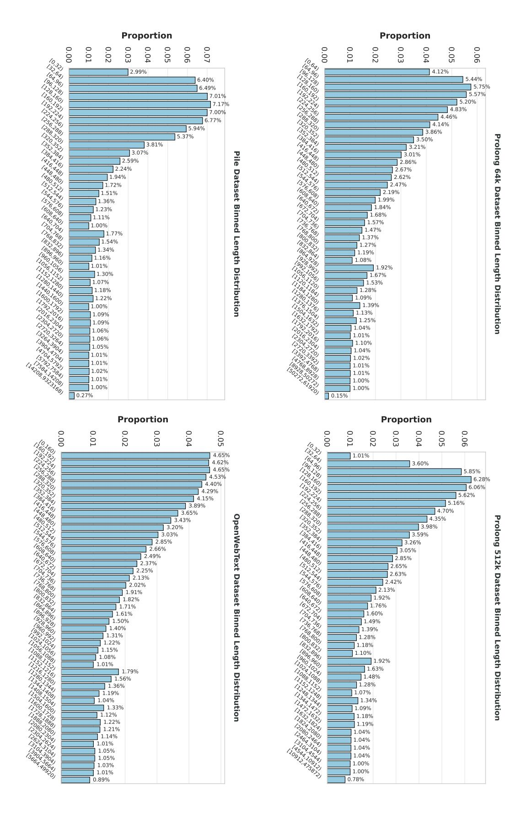

> **[图片提取文字 (无描述)]:**
> Proportion Proportion 0.00 0.00 0.05 0.07 0.08 0.02 0.04 0.06 0.08 0.10 0.12 0.01 0.02 0.03 0.04 0.06 10,32) 132,6g) 7.43% 3.69% 164,96) 7.41% 12.24% 6.25% 196,128) 5.42% 11.67% (128,160) 4.71% 4.18% 9.13% (160,192) 3.70% 7.32% (192,224) 3.35% 3.01% 6.03% (2) 4.5° (5) 2.70% 2.43% 5.07% (256,288) SlimPajama 2.23% 4.36% (288,320) 2.04% 1.85% (320,352) 3.80% 2 1.71% 1352,384) 3.40% 1.54% Dataset 1.38% 2.98% (384,416) 1.26% 1.13% (416,448) 2.70% Dataset 1.03% 2.52% (448,480) 1.83% Binned 1.55% 1480,512) 2.21% 1.33% 1.96% 1.14% 1512,544) **Binned Length Distribution** 1.00% (544.576) 1.80% 1.27% Length 1.03% 1576,608, 1.59% 1.12% 1.39% 1.11% 1.04% 1.24% (640,70A) 1.07% Distribution 1.08% (704.768) 1.11% 1.03% 1.89% 1.17% 1.10% (832,896) 1.58% 1.12% 1.04% 1896,992) 1.31% 1.17% 1992,1088) .08% 1.01% 1.07% 1.33% 1.08% (1216,1408) 1.03% 1.06% (1408,1696) 1.02% 1.01% 1.05% (1696,2208) 1.02% 1.06% 1.01% 1.02% 1.01% 1.01% 1.02% 1.01% 1.00% 1.00% 1.00% 0.47% 0.67% (a) C4 Dataset Distribution (b) Upsampled SlimPajama Dataset Distribution
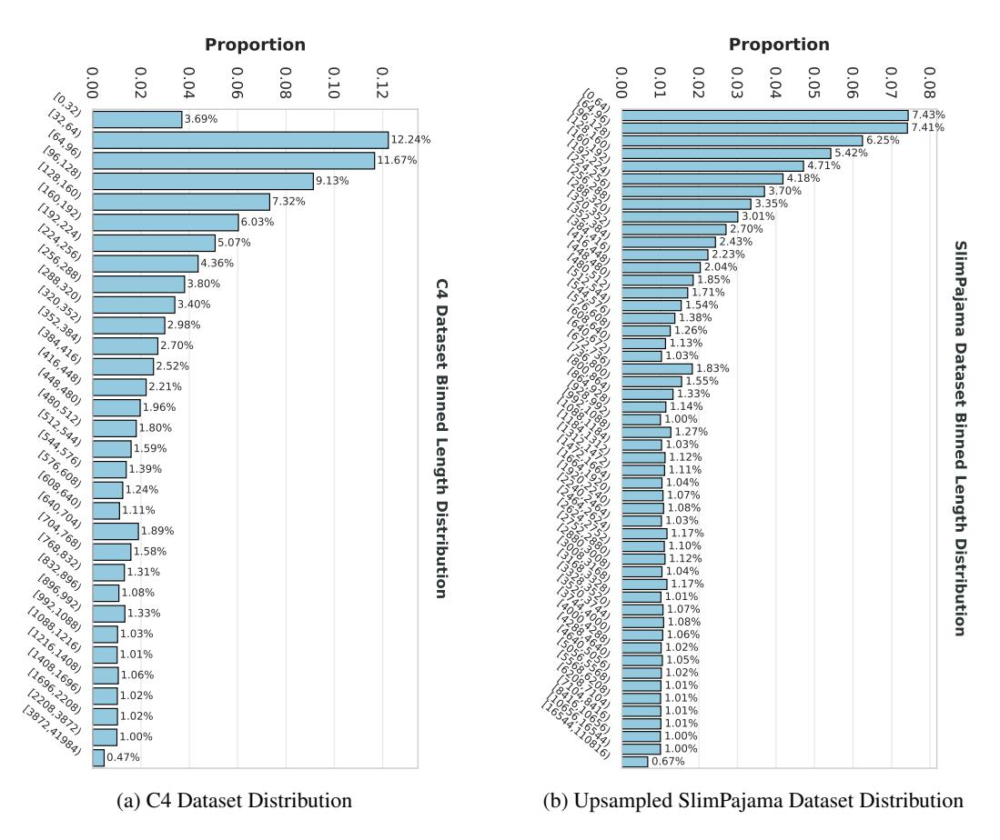

Figure 6: Pretraining Dataset Length Distributions.

20

## A.2 DETAILS OF SPARSE DATA SAMPLING

Referencing common block sparse mask generation methods, our block sparse mask generation process is as follows:

- 1. Block Partitioning: For a task with an input sequence length of seqlen, we can conceptualize a seqlen × seqlen attention map. Based on the provided q block lists and k block lists, this two-dimensional attention map is partitioned into len(q block lists) × len(k block lists) blocks. For a uniform block mask, the block sizes within q block lists and k block lists are the same. In contrast, for a variable block mask, these block sizes can differ.
- 2. Score Calculation: Common block sparse methods typically calculate a score for each block in some manner (e.g., by applying mean pooling over each block) and generate a score matrix which represents the importance of the block. Blocks with higher importance are more likely to be selected. It is important to note that scores may vary across different attention heads. Generally, a distinct mask is generated for each KV head. This means for Multi-Head Attention, the score matrix can be unique for each head. For Grouped-Query Attention, masks are the same within a group but can differ between groups. In our experiments, we abstract away the specifics of score calculation and use randomly generated numbers, thereby focusing on the final block sparse attention computation.
- 3. Top-k Selection: For each block in the query dimension (q), we select the top-k blocks from the key dimension (k) for computation. The overall degree of sparsity can be expressed as the fraction k len(k block lists) . We define a sparsity ratio to represent this degree of sparsity, which has a direct conversion relationship with top-k and is essentially equivalent. To observe the kernel's performance under different sparsity levels, we select 0.2, 0.5, and 0.8 as representative sparsity ratios.

#### A.3 DETAILS OF SPARSE ATTENTION KERNELS

VSA [\(Zhang et al., 2025d\)](#page-16-4) is a trainable block sparse attention implementation designed specifically for video diffusion models. It employs a two-stage methodology. In the coarse-grained stage, it applies a token rearrangement strategy from STA [\(Zhang et al., 2025c\)](#page-16-12) to increase computational density. It then calculates inter-block scores via cube partition and mean-pooling on the QK matrix, which selects the top-k K blocks for each Q block. Subsequently, in the fine-grained stage, it utilizes ThunderKittens [\(Spector et al., 2024\)](#page-14-13) to develop a high-performance block sparse attention kernel. This kernel is customized for Hopper GPUs to maximize hardware utilization. According to VSA's analysis, the fine-grained stage accounts for over 80% of latency at context lengths of 32K or more. This finding highlights the critical need to optimize the block sparse attention kernel, and our performance benchmarks also focus on this kernel for fair comparisons. As a variant, Triton VSA implements the algorithm in the Triton language. This approach aims to enhance cross-hardware compatibility but results in some performance degradation. However, both implementations are specifically optimized for video models and they do not support common LLM attention modes like Grouped-Query Attention (GQA). FA2 Sparse [Guo et al.](#page-12-0) [\(2024\)](#page-12-0) is an open-source implementation based on the FlashAttention-2 [\(Dao, 2023\)](#page-9-6) codebase. It enables block sparse functionality by modifying the computation logic, allowing each Q block to traverse only its designated KV blocks. The primary limitation of this implementation is its lack of support for the backward pass and without optimization for advanced GPUs like NVIDIA Hopper GPUs. FlexAttention [Dong et al.](#page-10-10) [\(2024\)](#page-10-10) leverages compiler technology to introduce a more flexible mask description method. This approach enables it to support sparse attention in the form of a block mask. However, the representation for block masks is relatively complex. Its compilation technique can therefore degenerate to instantiating a full O(S 2 ) mask, which causes significant memory overhead. FlashInfer [Ye et al.](#page-15-6) [\(2025\)](#page-15-6) is a general-purpose kernel library oriented toward LLM inference. It designs a block sparse matrix structure as a unified format for the KV cache. This design allows block sparse attention input to be converted into a paged attention format where page size equals to 1. This process enables the reuse of its efficient attention kernel and supports arbitrary block sizes. Due to its positioning as an inference library, it does not support the backward pass.

#### A.4 DETAILS OF DENSE KERNEL PERFORMANCE

For single-sequence samples such as FULL/CAUSAL and SLIDING WINDOW, we conduct 2 runs of sampling, with each run followed by 5 warm-up steps and 20 kernel computation steps. For multi-sequence data such as DOCUMENT and SHARE QUESTION, considering the sparsity differences introduced by sampling, we perform 30 runs with independent sampling in each run, also followed by 5 warm-up steps and 20 kernel computation steps. We record the median values of FLOPS and peak memory. It is worth noting that our results represent the expected outcomes under these specific settings, and occasional large deviations in individual kernel runs are considered normal.

#### A.4.1 PERFORMANCE METRIC: FLOPS

> **[图片提取文字 (无描述)]:**
> GQA Bwd Flops (8k) H100 fa3 fa2 cudnn flex flash\_mask sdpa torch 600 500 Speed (teraFLOPs/s) 400 300 200 100 0 CSW FD CD SQ GS C FSW CB BCD F PLC PLD
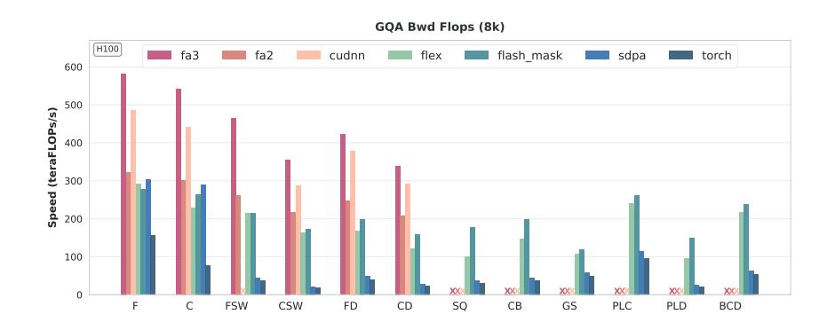

Figure 7: Backward TFLOPs of dense kernels with different masks (8K length)

FULL and CAUSAL are the most common masks used in language model pretraining, as shown in Figure 8. SDPA and Flex approximately represent the baselines of fused operators without hardware-specific optimization. In general, increasing sequence length improves kernel performance, which typically stabilizes around 16K. The results highlight the importance of hardware-aware optimization: on the H100 Hopper architecture, FA3 achieve significant performance gains.

FULL/CAUSAL DOCUMENT is primarily designed for concatenating variable-length input sequences to reduce unnecessary padding while preserving full or causal connectivity. It is important to note that concatenating variable-length sequences can introduce computational instability, which becomes particularly pronounced when the data contains many small fragmented chunks, as shown in Figure 9.

In our experiments, we fixed the sliding window size to 1024, as shown in Figure 10, though we recommend evaluating with other window sizes as well (Fu et al., 2025).

Overall, in heterogeneous mask scenarios, Flex and FlashMask show varying performance gains depending on the context.

PREFIX LM and PREFIX LM DOCUMENT extend the standard language model regular mask by introducing a prefix, allowing the prefix to attend to all tokens. In our experiments, a prefix is randomly generated for each run, and the median across multiple runs is reported to reflect expected performance in realistic scenarios with varying prefixes, as shown in Figure 11. Models trained with a prefix demonstrate advantages in handling long-text and multi-turn dialogue tasks. This approach enables the model to better leverage contextual information, improving performance in generation tasks (Raffel et al., 2020).

SHARE QUESTION and CAUSAL BLOCKWISE can be viewed as variants of DOCUMENT, as shown in Figure 12. SHARE QUESTION allows all query tokens to share the key tokens from the first document and is commonly used in Reward Models (RM) as a shared-question mask, enabling multiple answers to reference the same question (Ouyang et al., 2022). This eliminates redundant computation and accelerates training. CAUSAL BLOCKWISE, on the other hand, allows all key tokens to share the query tokens from the last document and is typically applied in demonstration–test tasks, where test examples can attend to all demonstrations. This facilitates studying model performance improvements in long-context tasks (Bertsch et al., 2024).

> **[图片提取文字 (无描述)]:**
> full\_GQA\_fwd\_flops 800 H100 fa3 fa2 cudnn cudnn flex sdpa torch flash\_mask 700 Speed (teraFLOPs/s) 600 500 400 300 200 100 0 1k 2k 4k 8k 16k 24k 32k 40k 48k Sequence Length (a) FULL GQA Fwd TFLOPS full\_GQA\_bwd\_flops 700 H100 fa3 fa2 cudnn cudnn flex flash\_mask sdpa torch 600 Speed (teraFLOPs/s) 500 400 300 200 100 0 2k 1k 4k 8k 16k 24k 32k 40k 48k Sequence Length (b) FULL GQA Bwd TFLOPS full\_MHA\_fwd\_flops H100 fa3 fa2 800 cudnn cudnn flex flash\_mask sdpa torch 700 Speed (teraFLOPs/s) 600 500 400 300 200 100 0 1k 2k 4k 8k 16k 24k 32k 40k 48k Sequence Length (c) FULL MHA Fwd TFLOPS full\_MHA\_bwd\_flops 700 H100 cudnn cudnn flex torch fa3 fa2 flash\_mask sdpa sdpa 600 Speed (teraFLOPs/s) 500 400 300 200 100 0 1k 2k 4k 8k 16k 24k 32k 40k 48k Sequence Length (d) FULL MHA Bwd TFLOPS
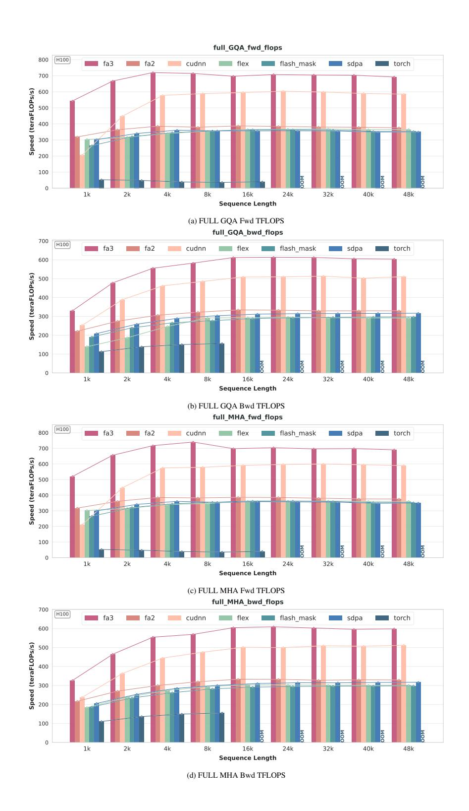

GLOBAL SLIDING combines global attention with sliding-window attention. In each run, we randomly sample a window size, treating the leftmost window\_size tokens in the Query and Key as global tokens, which attend to all Key and Query tokens, respectively. Due to the increased sparsity of the mask, the performance of Flex and FlashMask correspondingly decreases, as shown in Figure 13.

> **[图片提取文字 (无描述)]:**
> causal\_GQA\_fwd\_flops H100 fa3 fa2 cudnn cudnn flex flash\_mask sdpa torch 800 700 Speed (teraFLOPs/s) 600 500 400 300 200 100 0 40k 48k 1k 2k 4k 8k 16k 24k 32k Sequence Length (e) CAUSAL GQA Fwd TFLOPS causal\_GQA\_bwd\_flops H100 flash\_mask fa3 \_\_\_\_ fa2 cudnn flex sdpa torch 600 Speed (teraFLOPs/s) 500 400 300 200 100 0 1k 2k 4k 8k 24k 32k 40k 48k 16k Sequence Length (f) CAUSAL GQA Bwd TFLOPS causal\_MHA\_fwd\_flops H100 800 fa3 \_\_\_\_ fa2 cudnn cudnn flex flash\_mask sdpa torch 700 Speed (teraFLOPs/s) 600 500 400 300 200 100 0 1k 2k 4k 8k 16k 24k 32k 40k 48k Sequence Length (g) CAUSAL MHA Fwd TFLOPS causal\_MHA\_bwd\_flops H100 600 Speed (teraFLOPs/s) 500 400 300 200 100 0 1k 2k 4k 8k 16k 24k 32k 40k 48k Sequence Length (h) CAUSAL MHA Bwd TFLOPS
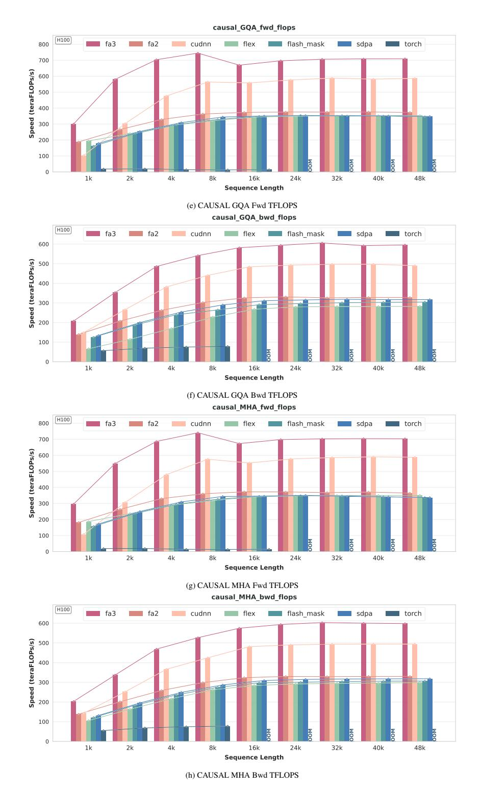

Figure 8: TFLOPS of FULL and CAUSAL

> **[图片提取文字 (无描述)]:**
> full\_document\_GQA\_fwd\_flops 700 H100 fa2 cudnn cudnn flex sdpa torch fa3 flash\_mask 600 Speed (teraFLOPs/s) 500 400 300 200 100 0 1k 2k 48k 4k 8k 16k 24k 32k 40k Sequence Length (a) FULL DOCUMENT GQA Fwd TFLOPS full\_document\_GQA\_bwd\_flops H100 fa3 fa2 cudnn flex flash\_mask sdpa torch 500 Speed (teraFLOPs/s) 400 300 200 100 MOO MOO 0 32k 1k 2k 4k 8k 16k 24k 40k 48k Sequence Length (b) FULL DOCUMENT GQA Bwd TFLOPS full\_document\_MHA\_fwd\_flops 700 H100 fa2 fa3 cudnn cudnn flex flash\_mask sdpa torch 600 Speed (teraFLOPs/s)
> 400
> 200
> 200 100 0 1k 2k 4k 8k 16k 24k 32k 40k 48k Sequence Length (c) FULL DOCUMENT MHA Fwd TFLOPS full\_document\_MHA\_bwd\_flops H100 flex cudnn cudnn flash\_mask torch fa3 fa2 sdpa 500 Speed (teraFLOPs/s) 400 300 200 100 0 1k 2k 4k 8k 16k 24k 32k 40k 48k Sequence Length (d) FULL DOCUMENT MHA Bwd TFLOPS
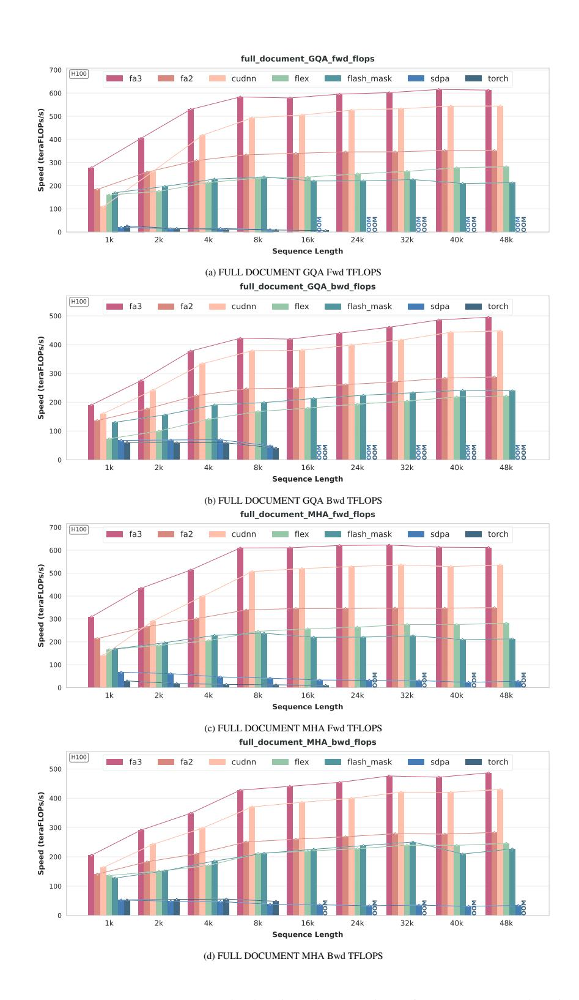

BLOCK CAUSAL DOCUMENT can also be viewed as a variant of DOCUMENT, elevating computation from the token level to the block level. In our experiments, we fix block\_size = 1024, as shown in Figure 14. This approach is commonly used in training autoregressive multimodal large models (ai et al., 2025).

> **[图片提取文字 (无描述)]:**
> causal\_document\_GQA\_fwd\_flops H100 fa3 fa2 cudnn flex sdpa torch flash\_mask 600 Speed (teraFLOPs/s) 500 400 300 200 100 MOO 0 40k 48k 1k 2k 4k 8k 16k 24k 32k Sequence Length (e) CAUSAL DOCUMENT GQA Fwd TFLOPS causal\_document\_GQA\_bwd\_flops H100 fa3 fa2 sdpa cudnn flex flash\_mask torch 400 Speed (teraFLOPs/s) 300 200 100 MOO MOO 000 000 M MOO 0 1k 2k 4k 8k 24k 32k 40k 16k 48k Sequence Length (f) CAUSAL DOCUMENT GQA Bwd TFLOPS causal\_document\_MHA\_fwd\_flops H100 fa3 fa2 cudnn flex sdpa torch flash\_mask 600 500 Speed (teraFLOPs/s) 400 300 200 100 0 1k 2k 4k 8k 16k 24k 32k 40k 48k Sequence Length (g) CAUSAL DOCUMENT MHA Fwd TFLOPS causal\_document\_MHA\_bwd\_flops [H100] flex flash\_mask sdpa sdpa fa3 cudnn 400 Speed (teraFLOPs/s) 300 200 100 0 1k 2k 4k 32k 40k 8k 16k 24k 48k Sequence Length (h) CAUSAL DOCUMENT MHA Bwd TFLOPS
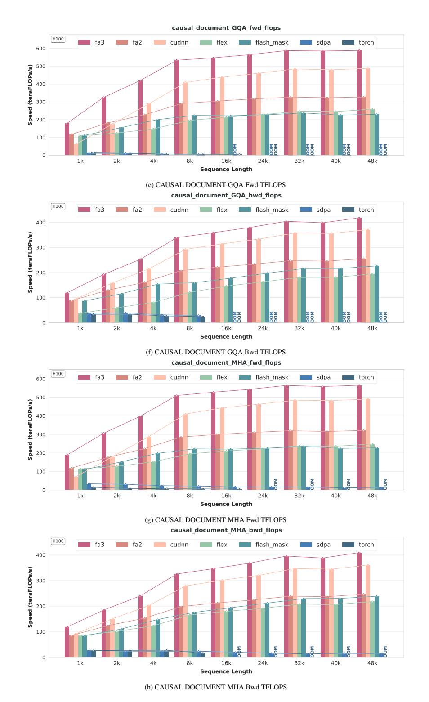

Figure 9: TFLOPS of FULL/CAUSAL DOCUMENT

> **[图片提取文字 (无描述)]:**
> sliding\_window\_full\_GQA\_fwd\_flops H100 flash\_mask 700 fa3 fa2 flex sdpa torch 600 Speed (teraFLOPs/s) 500 400 300 200 100 MOG MOOM MOO MOO MOOM 0 2k 8k 16k 1k 4k 24k 32k 40k 48k Sequence Length (a) FULL SLIDING WINDOW GQA Fwd TFLOPS
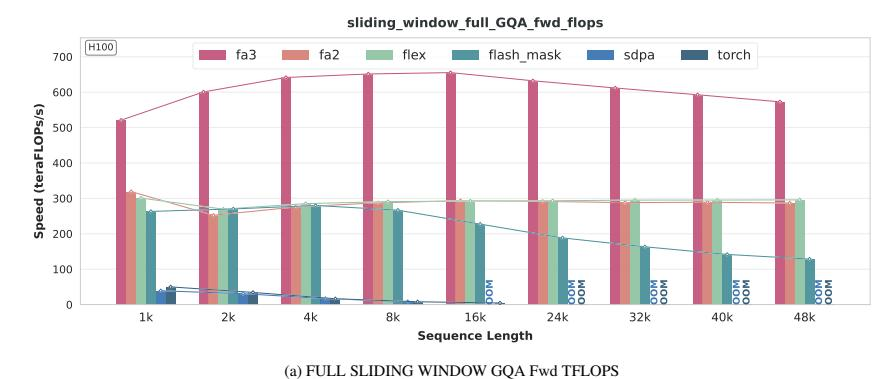

> **[图片提取文字 (无描述)]:**
> (a) FULL SLIDING WINDOW GQA FWG I FLOPS sliding\_window\_full\_GQA\_bwd\_flops H100 fa3 fa2 flash\_mask sdpa torch 500 flex 400 300 200 100 MOO MOO MOO 000 000 M MOO 0 1k 4k 8k 16k 2k 24k 32k 40k 48k Sequence Length
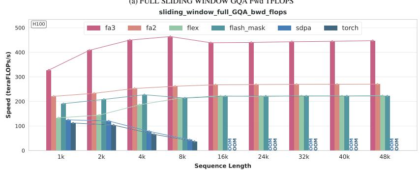

> **[图片提取文字 (无描述)]:**
> (b) FULL SLIDING WINDOW GQA Bwd TFLOPS sliding\_window\_full\_MHA\_fwd\_flops H100 700 fa3 fa2 flex flash\_mask sdpa torch 600 Speed (teraFLOPs/s) 500 400 300 200 100 MO MOC MOC MOC 0 1k 2k 4k 8k 16k 24k 32k 40k 48k Sequence Length
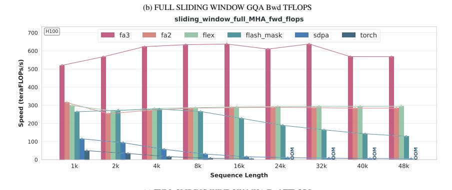

> **[图片提取文字 (无描述)]:**
> (c) FULL SLIDING WINDOW MHA Fwd TFLOPS sliding\_window\_full\_MHA\_bwd\_flops 500 H100 fa3 flash mask fa2 flex sdpa torch 400 Speed (teraFLOPs/s) 300 200 100 OM DOM MO OM 0 1k 2k 4k 8k 16k 24k 32k 40k 48k Sequence Length
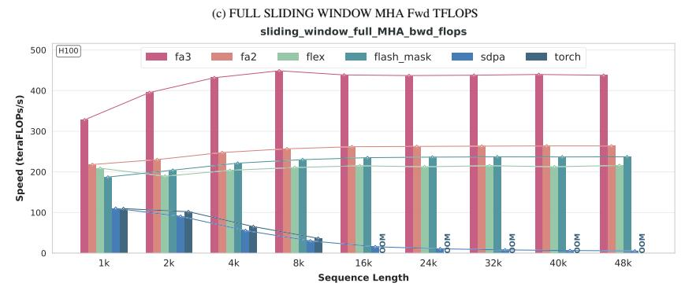

> **[图片提取文字 (无描述)]:**
> sliding\_window\_causal\_GQA\_fwd\_flops H100 fa3 fa2 cudnn cudnn flex flash\_mask sdpa torch 600 500 Speed (teraFLOPs/s) 400 300 200 100 0 40k 48k 1k 2k 4k 8k 16k 24k 32k Sequence Length (e) CAUSAL SLIDING WINDOW GQA Fwd TFLOPS sliding\_window\_causal\_GQA\_bwd\_flops 400 H100 fa3 fa2 cudnn flex flash\_mask sdpa torch 350 Speed (teraFLOPs/s) 300 250 200 150 100 50 MOO MOO MOO MOO MOO 0 8k 1k 2k 4k 32k 40k 48k 16k 24k Sequence Length (f) CAUSAL SLIDING WINDOW GQA Bwd TFLOPS sliding\_window\_causal\_MHA\_fwd\_flops H100 fa2 fa3 flex cudnn cudnn flash\_mask sdpa torch 600 500 Speed (teraFLOPs/s) 400 300 200 100 DOM MOC 0 1k 2k 4k 8k 16k 24k 32k 40k 48k Sequence Length (g) CAUSAL SLIDING WINDOW MHA Fwd TFLOPS sliding\_window\_causal\_MHA\_bwd\_flops H100 fa2 cudnn cudnn flex flash\_mask torch fa3 sdpa 350 300 Speed (teraFLOPs/s) 250 250 150 100 50 0 1k 2k 4k 8k 16k 24k 32k 40k 48k Sequence Length (h) CAUSAL SLIDING WINDOW MHA Bwd TFLOPS
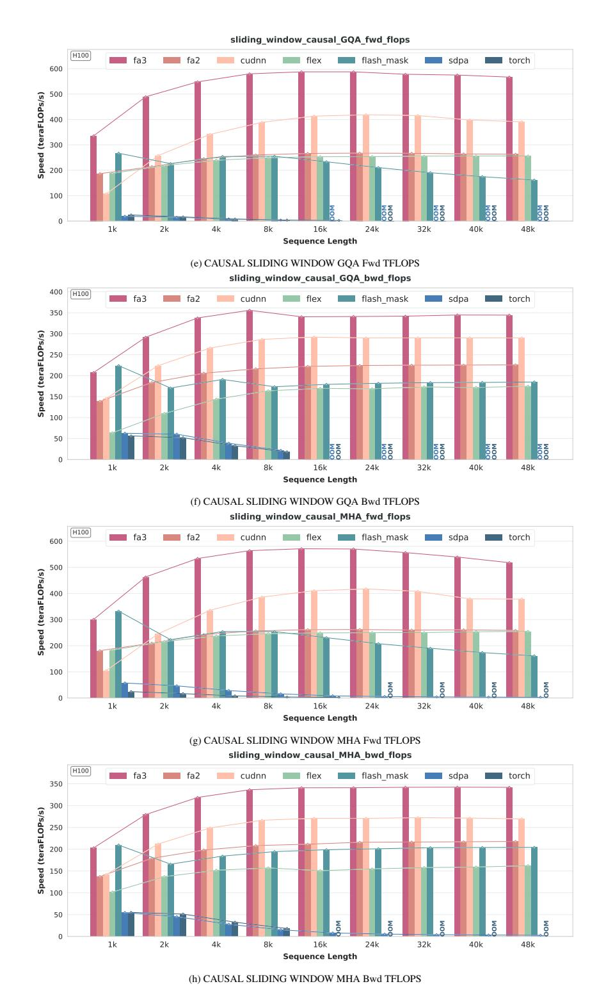

Figure 10: TFLOPS of FULL/CAUSAL SLIDING WINDOW

> **[图片提取文字 (无描述)]:**
> prefix\_lm\_GQA\_fwd\_flops 400 H100 flex flash\_mask sdpa torch 350 300 Speed (teraFLOPs/s) 250 200 150 100 50 MOO 000 000 M M00 00M 00M 00M MOO 0 1k 2k 4k 8k 16k 24k 32k 40k 48k Sequence Length
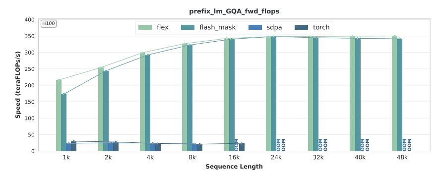

#### (a) PREFIX LM GQA Fwd TFLOPS prefix\_lm\_GQA\_bwd\_flops

> **[图片提取文字 (无描述)]:**
> prefix\_im\_GQA\_bwa\_flops H100 flash\_mask flex torch sdpa 300 250 (teraFLOPs/s) 200 150 Speed 100 50 MOO 00 M MOO MOO MOO 0 1k 2k 4k 8k 16k 24k 32k 40k 48k Sequence Length
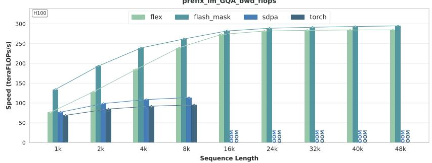

> **[图片提取文字 (无描述)]:**
> (b) PREFIX LM GQA Bwd TFLOPS prefix\_lm\_MHA\_fwd\_flops 400 H100 flex flash mask sdpa torch 350 300 250 200 150 100 50 MOG MOG 0 1k 2k 4k 8k 16k 24k 32k 48k 40k Sequence Length
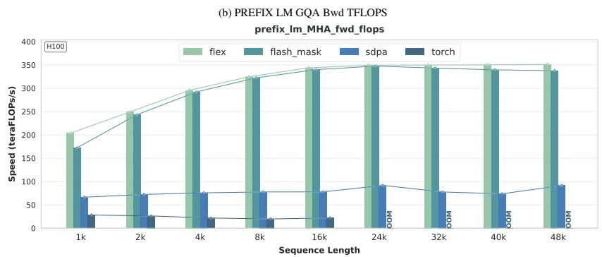

## (c) PREFIX LM MHA Fwd TFLOPS

> **[图片提取文字 (无描述)]:**
> prefix\_lm\_MHA\_bwd\_flops H100 flex flash mask sdpa torch 300 (teraFLOPs/s) 250 200 150 Speed 100 50 MOO 0 16k 48k 1k 2k 4k 8k 24k 32k 40k Sequence Length
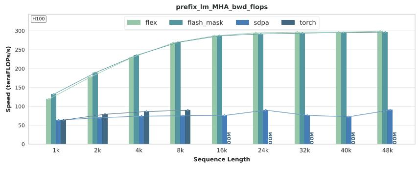

(d) PREFIX LM MHA Bwd TFLOPS

> **[图片提取文字 (无描述)]:**
> prefix\_lm\_document\_GQA\_fwd\_flops H100 250 flex flash\_mask torch sdpa sdpa 200 Speed (teraFLOPs/s) 150 100 50 MOO MOOM MOO MOO 0 1k 2k 4k 8k 24k 32k 40k 48k 16k Sequence Length (e) PREFIX LM DOCUMENT GQA Fwd TFLOPS prefix\_lm\_document\_GQA\_bwd\_flops H100 flex flash\_mask sdpa torch 200 Speed (teraFLOPs/s) 150 100 50 MOO MOOM MOO MOO MOO 0 1k 2k 4k 8k 32k 40k 16k 24k 48k Sequence Length (f) PREFIX LM DOCUMENT GQA Bwd TFLOPS prefix\_lm\_document\_MHA\_fwd\_flops 250 H100 flex sdpa sdpa torch flash\_mask 200 Speed (teraFLOPs/s) 150 100 50 0 1k 2k 4k 8k 16k 24k 32k 40k 48k Sequence Length (g) PREFIX LM DOCUMENT MHA Fwd TFLOPS prefix\_lm\_document\_MHA\_bwd\_flops flash\_mask torch flex sdpa sdpa 200 Speed (teraFLOPs/s) 150 100 50 0 1k 2k 4k 16k 24k 32k 40k 48k 8k Sequence Length (h) PREFIX LM DOCUMENT MHA Bwd TFLOPS
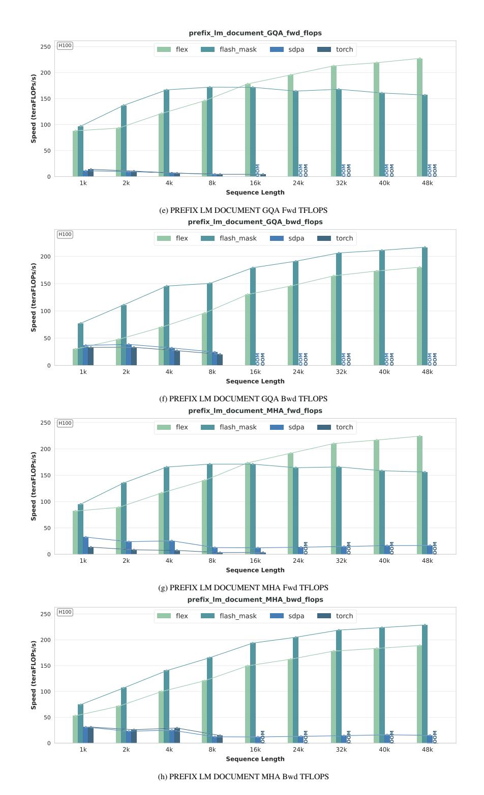

Figure 11: TFLOPS of PREFIX LM and PREFIX LM DOCUMENT

> **[图片提取文字 (无描述)]:**
> share\_question\_GQA\_fwd\_flops 300 H100 flex flash mask sdpa torch 250 Speed (teraFLOPs/s) 200 150 100 50 MOD MOO MOO MOO MOO 0 8k 1k 2k 4k 16k 24k 32k 40k 48k Sequence Length (a) SHARE QUESTION GQA Fwd TFLOPS
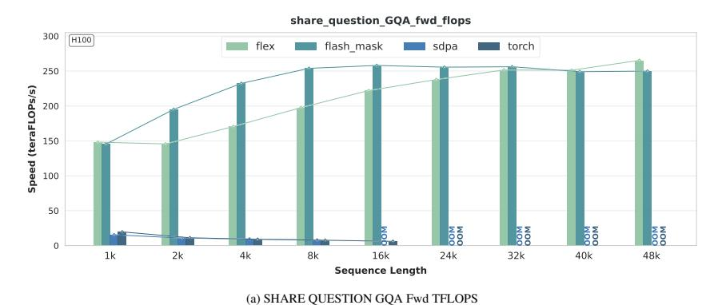

#### $share\_question\_GQA\_bwd\_flops$ 250 H100 flex flash\_mask sdpa torch Speed (teraFLOPs/s) 1200 50 2k 4k 8k 16k Sequence Length 24k 32k 40k 48k

> **[图片提取文字 (无描述)]:**
> (b) SHARE QUESTION GQA Bwd TFLOPS share\_question\_MHA\_fwd\_flops 300 H100 flex flash\_mask sdpa torch 250 Speed (teraFLOPs/s) 200 150 100 50 8k 48k 1k 2k 4k 16k 24k 32k 40k Sequence Length
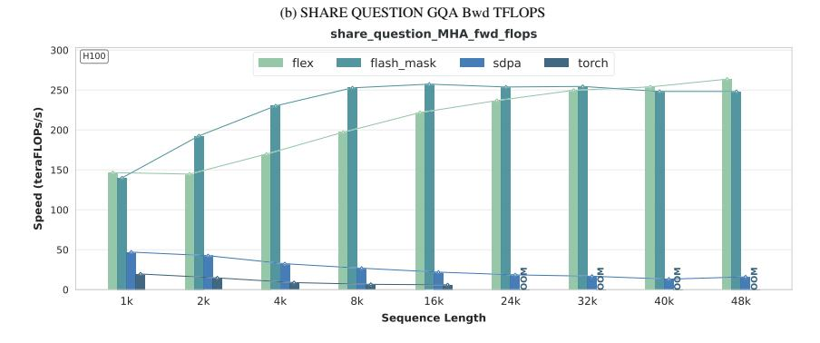

> **[图片提取文字 (无描述)]:**
> (c) SHARE QUESTION MHA Fwd TFLOPS share\_question\_MHA\_bwd\_flops H100 flex flash mask torch sdpa 250 200 Speed (teraFLOPs/s) 150 100 50 MOC 00 0 1k 2k 4k 8k 16k 24k 32k 40k 48k Sequence Length
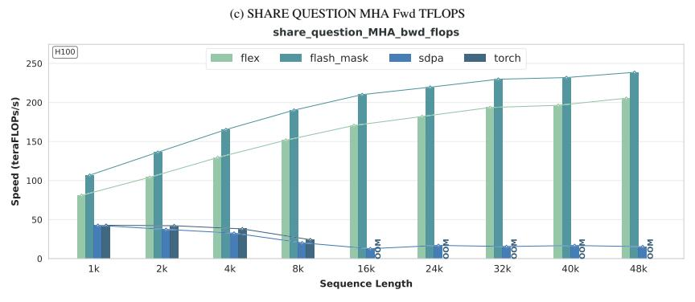

> **[图片提取文字 (无描述)]:**
> causal\_blockwise\_GQA\_fwd\_flops H100 300 flex flash\_mask torch sdpa 250 Speed (teraFLOPs/s) 200 150 100 50 000 00M MOO MOO MOO 0 1k 2k 24k 32k 40k 4k 8k 16k 48k Sequence Length (e) CAUSAL BLOCKWISE GQA Fwd TFLOPS causal\_blockwise\_GQA\_bwd\_flops H100 flex flash\_mask torch sdpa 250 Speed (teraFLOPs/s) 200 150 100 50 MOO 000 000 W MOO MOO M00 00M 0 1k 2k 4k 8k 16k 24k 32k 40k 48k Sequence Length (f) CAUSAL BLOCKWISE GQA Bwd TFLOPS causal\_blockwise\_MHA\_fwd\_flops H100 300 sdpa flex flash\_mask torch 250 Speed (teraFLOPs/s) 200 150 100 50 MOO 0 1k 2k 4k 8k 16k 24k 32k 40k 48k Sequence Length (g) CAUSAL BLOCKWISE MHA Fwd TFLOPS causal\_blockwise\_MHA\_bwd\_flops flash\_mask sdpa sdpa torch flex 250 Speed (teraFLOPs/s) 200 150 100 50 0 1k 2k 4k 8k 16k 24k 32k 40k 48k Sequence Length (h) CAUSAL BLOCKWISE MHA Bwd TFLOPS
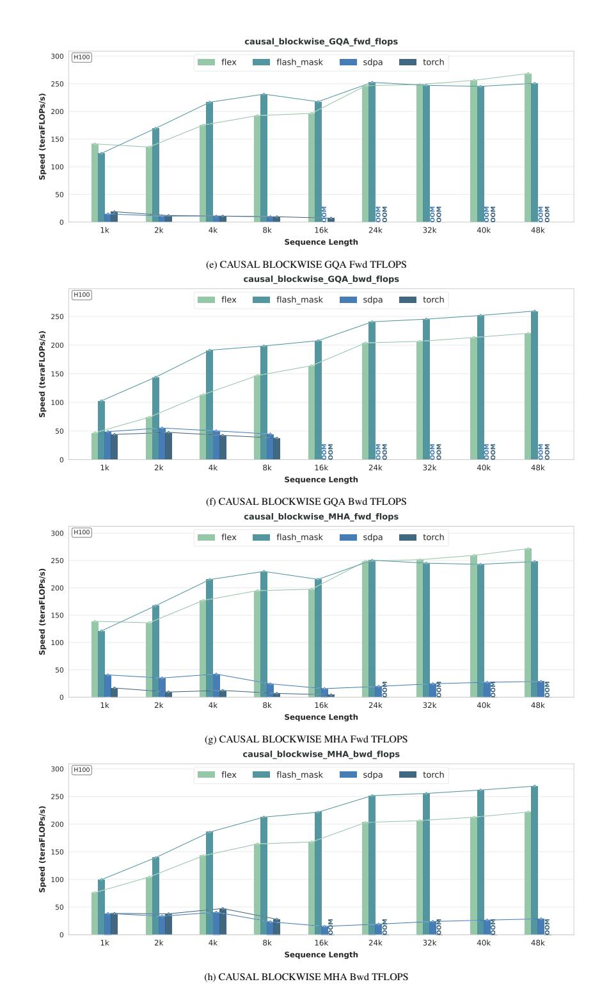

Figure 12: TFLOPS of SHARE QUESTION and CAUSAL BLOCKWISE

> **[图片提取文字 (无描述)]:**
> global\_sliding\_GQA\_fwd\_flops 200 H100 flex flash\_mask sdpa sdpa torch 175 150 Speed (teraFLOPs/s) 125 100 75 50 25 00M MOO 00 M 0 2k 4k 8k 24k 32k 40k 48k 1k 16k Sequence Length (a) GLOBAL SLIDING GQA Fwd TFLOPS global\_sliding\_GQA\_bwd\_flops H100 160 flex flash\_mask sdpa torch 140 Speed (teraFLOPs/s) 120 100 80 60 40 20 MOO MOO 00 M MOO MOO 0 1k 2k 4k 32k 40k 48k 8k 16k 24k Sequence Length (b) GLOBAL SLIDING GQA Bwd TFLOPS global\_sliding\_MHA\_fwd\_flops H100 flex flash\_mask torch sdpa 175 150 Speed (teraFLOPs/s) 125 100 75 50 25 0 1k 2k 4k 8k 16k 24k 32k 40k 48k Sequence Length (c) GLOBAL SLIDING MHA Fwd TFLOPS global\_sliding\_MHA\_bwd\_flops 160 H100 140 Speed (teraFLOPs/s) 120 100 80 60 40 20 0 1k 2k 4k 40k 48k 8k 16k 24k 32k Sequence Length (d) GLOBAL SLIDING MHA Bwd TFLOPS
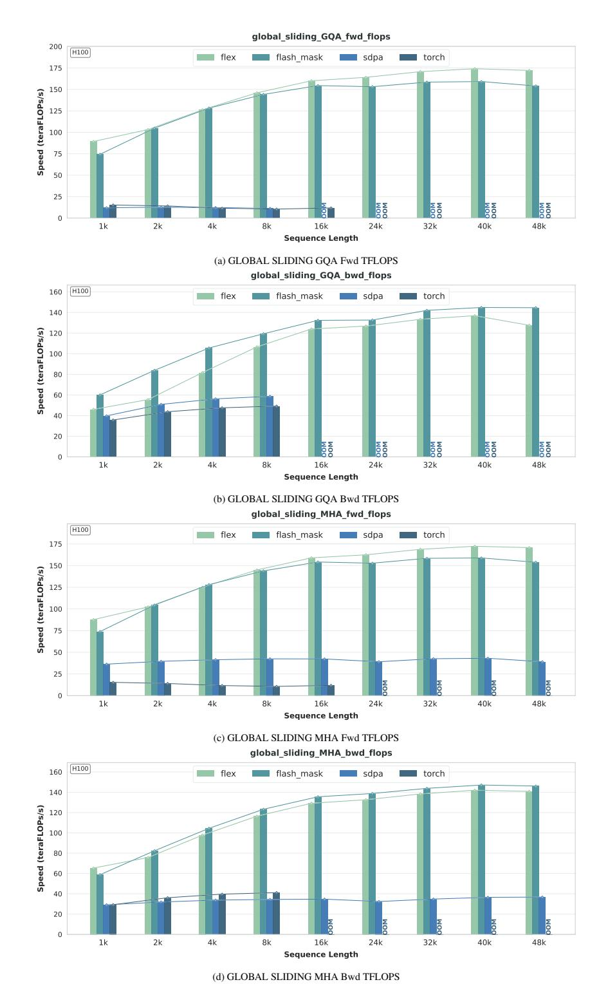

Figure 13: TFLOPS of GLOBAL SLIDING

> **[图片提取文字 (无描述)]:**
> block\_causal\_document\_GQA\_fwd\_flops 400 H100 flex flash\_mask torch sdpa 350 300 Speed (teraFLOPs/s) 250 200 150 100 50 MOO M00 00M MOO MOO 0 1k 2k 4k 24k 32k 40k 8k 16k 48k Sequence Length (a) BLOCK CAUSAL DOCUMENT GQA Fwd TFLOPS block\_causal\_document\_GQA\_bwd\_flops H100 flex flash\_mask torch sdpa 250 Speed (teraFLOPs/s) 200 150 100 50 MOO MOO MOO MOO MOO 0 1k 4k 8k 24k 32k 40k 48k 2k 16k Sequence Length (b) BLOCK CAUSAL DOCUMENT GQA Bwd TFLOPS block\_causal\_document\_MHA\_fwd\_flops H100 flex torch flash\_mask sdpa 350 300 Speed (teraFLOPs/s) 250 200 150 100 50 OM 0 1k 2k 4k 8k 16k 24k 32k 40k 48k Sequence Length (c) BLOCK CAUSAL DOCUMENT MHA Fwd TFLOPS block\_causal\_document\_MHA\_bwd\_flops 300 H100 flex flash\_mask sdpa torch 250 Speed (teraFLOPs/s) 200 150 100 50 0 1k 2k 4k 8k 24k 32k 40k 48k 16k Sequence Length (d) BLOCK CAUSAL DOCUMENT MHA Bwd TFLOPS
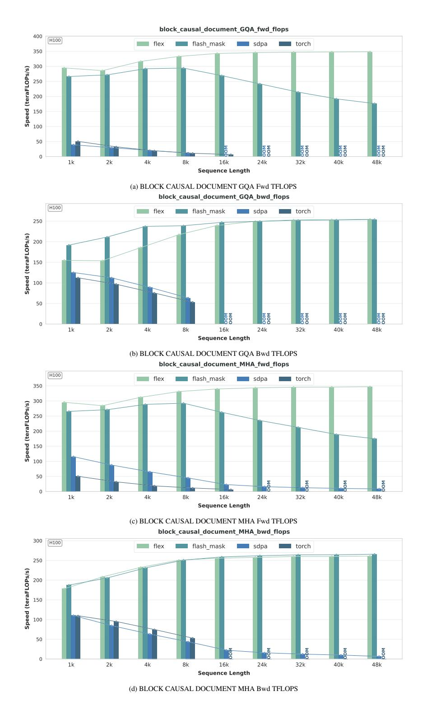

Figure 14: TFLOPS of BLOCK CAUSAL DOCUMENT

34

## A.4.2 PERFORMANCE METRIC: PEAK MEMORY USAGE

We report the peak memory usage of the kernel as a reference. The memory plots (Figure [16,](#page-40-0) Figure [17\)](#page-46-0) clearly illustrate the detrimental impact of quadratic storage complexity on training: Naive Attention and SDPA scale only up to around 16K in the forward pass and about 8K in the backward pass. We truncate the plots at certain points and annotate the corresponding values. Under the same mask setting, different kernels exhibit similar peak memory in the forward pass, but show noticeable differences in the backward pass. Overall, the trend of peak memory scaling with sequence length across different kernels aligns well with intuition. Since sequence length is extended on a single GPU, model parameters remain fixed, and the growth in peak memory is entirely determined by activations. In the standard attention module, activation memory is computed as 11bshd + 5bhs2 + 2bshd, where b is the batch size, s the sequence length, h the number of heads, and d the hidden dimension (see Figure [15\)](#page-34-0). We do not consider any gradient checkpointing [\(Chen](#page-9-11) [et al., 2016\)](#page-9-11) or offloading [\(Ren et al., 2021\)](#page-14-14) techniques. Although different kernels may employ various strategies to optimize memory usage, the overall growth trend of activations still approximately follows a quadratic curve, which is confirmed by our experimental results. At the same time, recording peak memory further highlights the performance bottlenecks of the attention mechanism when handling ultra-long contexts. Due to the presence of activations, other distributed strategies such as tensor parallelism and data parallelism are insufficient to alleviate peak memory usage. Only context parallelism, which balances the workload across devices along the sequence dimension, can effectively address this issue.

> **[图片提取文字 (无描述)]:**
> 2bhs^2 bshd
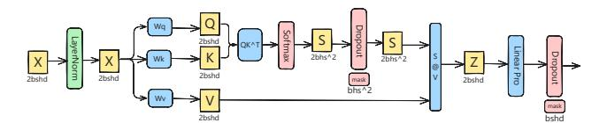

Figure 15: Full Activations in Attention Module

> **[图片提取文字 (无描述)]:**
> full\_GQA\_fwd\_mem H10 Trunc fa3 fa2 cudnn flex flash\_mask sdpa torch 3.0 2.5 Peak Memory (GB) 2.0 1.5 1.0 0.5 0.0 1k 2k 4k 8k 16k 24k 32k 40k 48k Sequence Length (a) FULL GQA Fwd Peak Memory
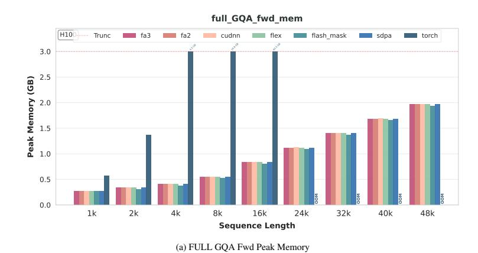

> **[图片提取文字 (无描述)]:**
> (a) FULL GQA Fwd Peak Memory full\_GQA\_bwd\_mem H100-Trunc fa2 cudnn flex flash\_mask sdpa fa3 torch 10 8 6 4
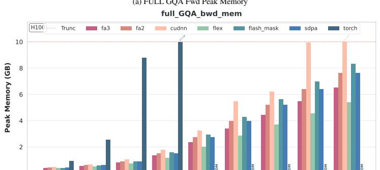

16k

24k

2k

4k

> **[图片提取文字 (无描述)]:**
> (b) FULL GQA Bwd Peak Memory full\_MHA\_fwd\_mem H100 Trunc fa3 fa2 cudnn flash\_mask torch flex sdpa 4 Peak Memory (GB) 3 0 1k 2k 4k 8k 16k 24k 32k 40k 48k Sequence Length (c) FULL MHA Fwd Peak Memory
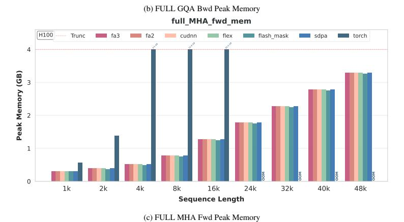

> **[图片提取文字 (无描述)]:**
> full\_MHA\_bwd\_mem H100----Trunc fa3 fa2 cudnn flex flash\_mask sdpa torch 12 10 Peak Memory (GB) 6 4 2 1k 2k 4k 8k 16k 24k 32k 40k 48k Sequence Length
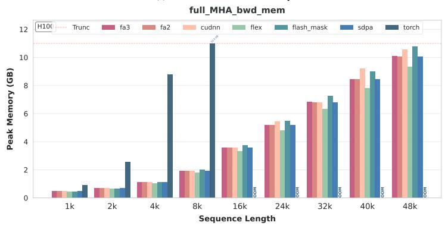

> **[图片提取文字 (无描述)]:**
> causal\_GQA\_fwd\_mem H100 Trunc fa3 fa2 cudnn flash\_mask sdpa flex torch 3.0 2.5 Peak Memory (GB) 2.0 1.5 1.0 0.5 0.0 1k 2k 4k 8k 16k 24k 32k 40k 48k Sequence Length
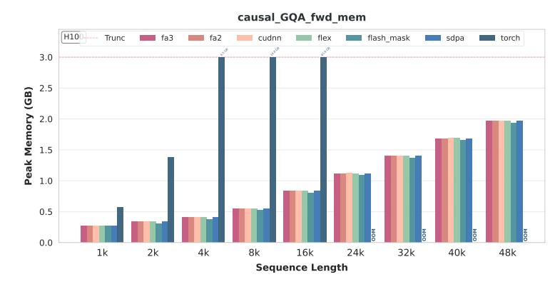

#### (e) CAUSAL GQA Fwd Peak Memory

> **[图片提取文字 (无描述)]:**
> causal\_GQA\_bwd\_mem H100 flash\_mask Trunc fa3 fa2 cudnn flex sdpa torch 8 Peak Memory (GB) 0 1k 2k 4k 8k 16k 24k 32k 40k 48k Sequence Length
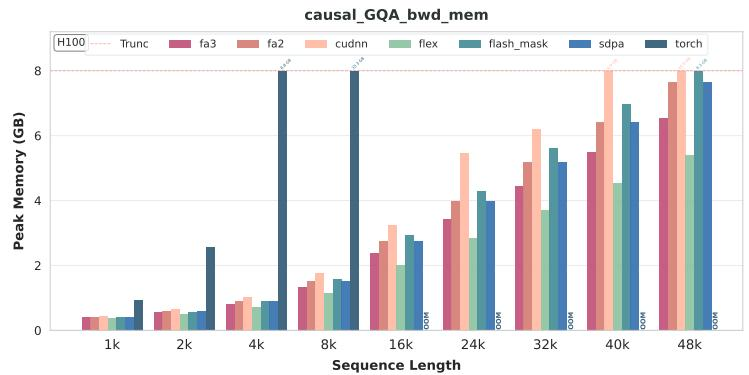

> **[图片提取文字 (无描述)]:**
> (f) CAUSAL GQA Bwd Peak Memory
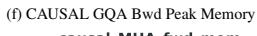

> **[图片提取文字 (无描述)]:**
> causal\_MHA\_fwd\_mem H100 Trunc cudnn flex flash\_mask fa3 fa2 sdpa torch 5 Peak Memory (GB) 0 1k 2k 4k 8k 16k 24k 32k 40k 48k Sequence Length
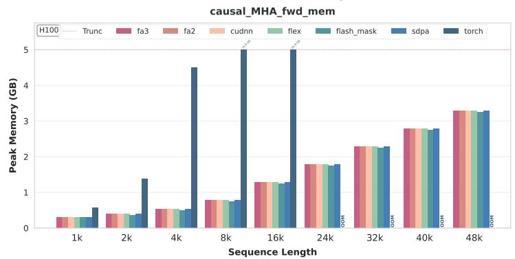

(g) CAUSAL MHA Fwd Peak Memory

> **[图片提取文字 (无描述)]:**
> causal MHA bwd mem H100 ----Trunc fa2 flash\_mask fa3 cudnn flex sdpa torch 12 10 Peak Memory (GB) 6 2 0 16k 24k 32k 40k 48k 1k 2k 4k 8k Sequence Length
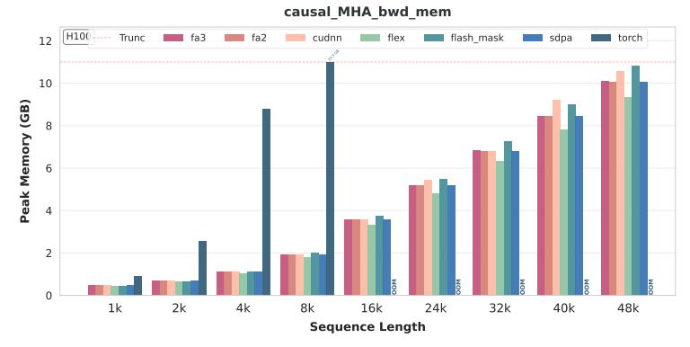

(h) CAUSAL MHA Fwd Peak Memory

> **[图片提取文字 (无描述)]:**
> full\_document\_GQA\_fwd\_mem H100 Trunc fa3 fa2 cudnn flex flash\_mask sdpa torch 6 Peak Memory (GB) MOO 0 1k 2k 4k 8k 16k 24k 32k 40k 48k Sequence Length
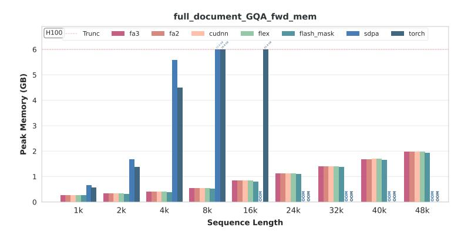

(i) FULL DOCUMENT GQA Fwd Peak Memory

> **[图片提取文字 (无描述)]:**
> full document GQA bwd mem H100 Trunc fa2 cudnn flex flash\_mask fa3 sdpa torch 12 10 Peak Memory (GB) 6 2 MOC 1k 2k 16k 32k 40k 48k 4k 8k 24k Sequence Length
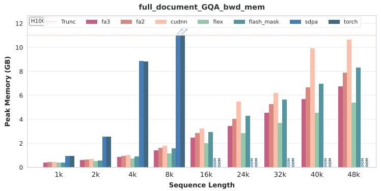

> **[图片提取文字 (无描述)]:**
> (j) FULL DOCUMENT GQA Bwd Peak Memory full\_document\_MHA\_fwd\_mem
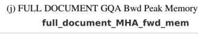

> **[图片提取文字 (无描述)]:**
> H100 Trunc fa3 fa2 cudnn flex flash\_mask sdpa torch 12 10 Peak Memory (GB) 6 2 0 1k 2k 4k 8k 16k 24k 32k 40k 48k **Sequence Length**
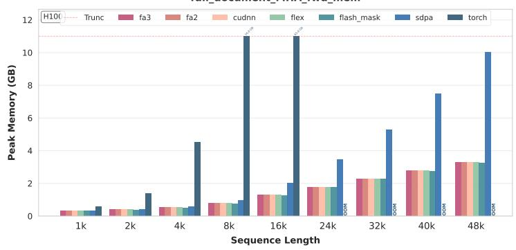

(k) FULL DOCUMENT MHA Fwd Peak Memory

> **[图片提取文字 (无描述)]:**
> full document MHA bwd mem H100 ----Trunc fa3 fa2 cudnn flex flash\_mask torch sdpa 12 10 Peak Memory (GB) 8 6 2 0 4k 1k 2k 8k 16k 24k 32k 40k 48k Sequence Length
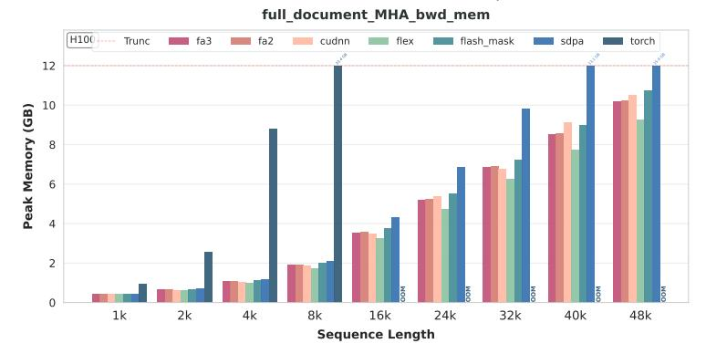

(l) FULL DOCUMENT MHA Fwd Peak Memory

> **[图片提取文字 (无描述)]:**
> causal\_document\_GQA\_fwd\_mem H100 Trunc flash\_mask fa3 fa2 cudnn flex sdpa torch 6 Peak Memory (GB) MOO 1k 2k 4k 8k 16k 24k 32k 40k 48k Sequence Length
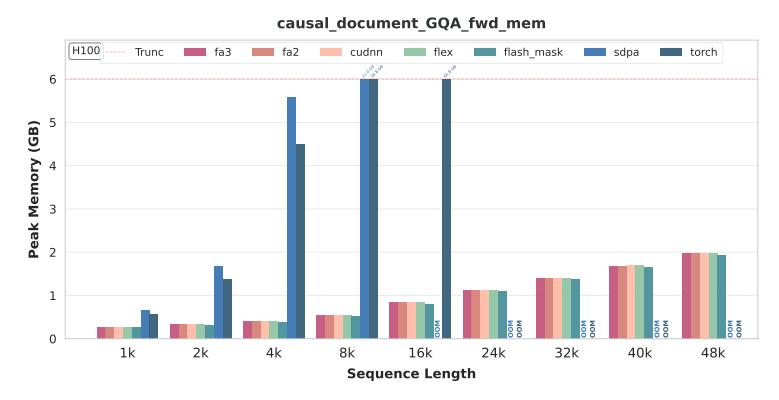

(m) CAUSAL DOCUMENT GQA Fwd Peak Memory

> **[图片提取文字 (无描述)]:**
> causal\_document\_GQA\_bwd\_mem H100----Trunc fa2 cudnn flex flash\_mask fa3 sdpa torch 12 10 Peak Memory (GB) 6 2 0 1k 2k 4k 8k 16k 24k 32k 40k 48k Sequence Length
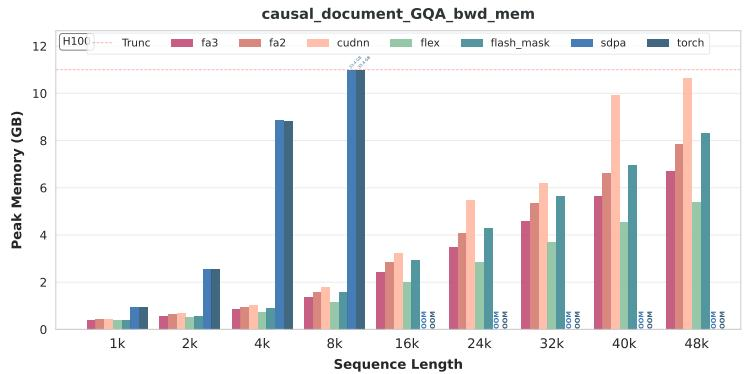

> **[图片提取文字 (无描述)]:**
> (n) CAUSAL DOCUMENT GQA Bwd Peak Memory causal document\_MHA\_fwd\_mem
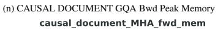

> **[图片提取文字 (无描述)]:**
> caasar\_accamene\_rnn=\_rna\_mem H100 Trunc \_\_\_\_ fa3 fa2 cudnn flex flash\_mask sdpa torch 12 10 Peak Memory (GB) 8 6 2 0 1k 4k 24k 32k 2k 8k 16k 40k 48k **Sequence Length**

(o) CAUSAL DOCUMENT MHA Fwd Peak Memory

> **[图片提取文字 (无描述)]:**
> causal document MHA bwd mem H100 ... flex flash\_mask Trunc fa3 fa2 cudnn sdpa torch 12 10 Peak Memory (GB) 6 0 16k 24k 1k 2k 4k 8k 32k 40k 48k Sequence Length
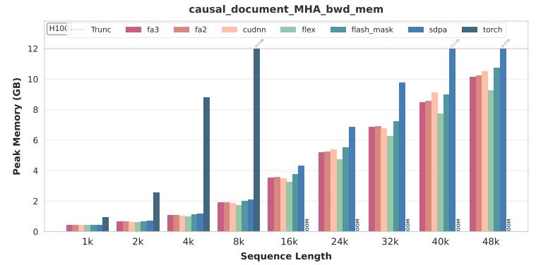

(p) CAUSAL DOCUMENT MHA Fwd Peak Memory

> **[图片提取文字 (无描述)]:**
> sliding\_window\_full\_GQA\_fwd\_mem H100 Trunc fa3 fa2 flex flash\_mask sdpa torch 6 Peak Memory (GB) MOO MOC M000 0 1k 16k 48k 2k 4k 8k 24k 32k 40k Sequence Length
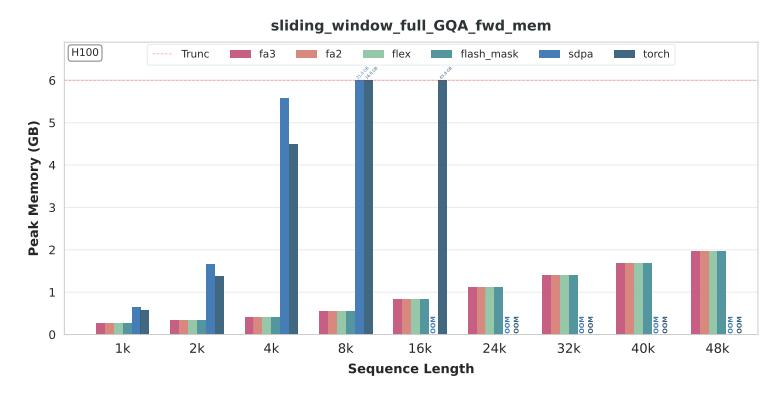

(q) FULL SLIDING WINDOW GQA Fwd Peak Memory sliding\_window\_full\_GQA\_bwd\_mem

> **[图片提取文字 (无描述)]:**
> Siluling\_willuow\_ruil\_dQA\_bwu\_illelii H100 Trunc fa3 fa2 flex flash\_mask sdpa torch 10 Peak Memory (GB) 8 6 4 2 MOC MOO MOO MOO 0 2k 4k 48k 1k 8k 16k 24k 32k 40k Sequence Length
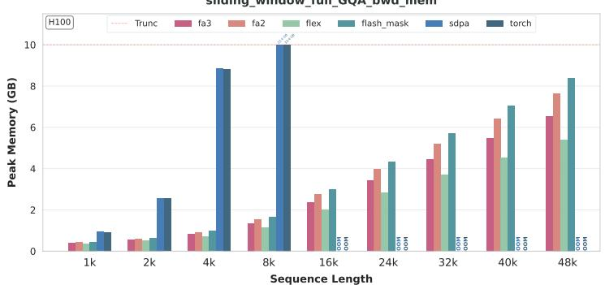

(r) FULL SLIDING WINDOW GQA Bwd Peak Memory sliding\_window\_full\_MHA\_fwd\_mem

> **[图片提取文字 (无描述)]:**
> shunig\_window\_run\_MHA\_rwu\_mem H100 Trunc flash\_mask sdpa torch fa3 fa2 flex 8 (GB) 0 1k 8k 16k 48k 2k 4k 24k 32k 40k **Sequence Length**
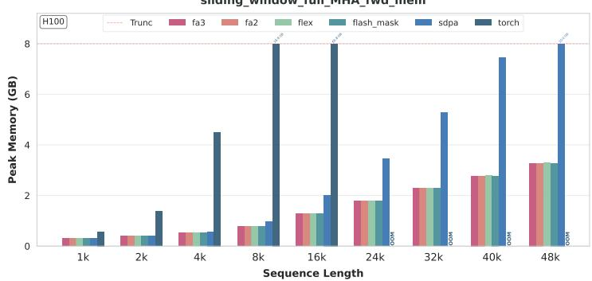

(s) FULL SLIDING WINDOW MHA Fwd Peak Memory

> **[图片提取文字 (无描述)]:**
> sliding window full MHA bwd mem H100 flash\_mask Trunc fa3 fa2 flex sdpa torch 12 10 Peak Memory (GB) 2 MOC 0 4k 1k 2k 8k 16k 24k 32k 48k 40k Sequence Length
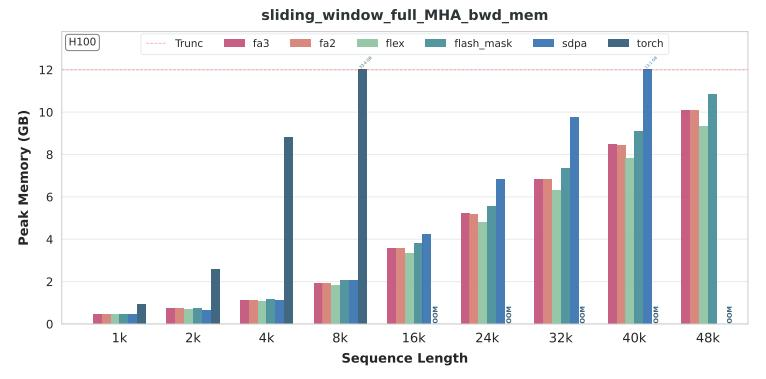

(t) FULL SLIDING WINDOW MHA Bwd Peak Memory

> **[图片提取文字 (无描述)]:**
> sliding\_window\_causal\_GQA\_fwd\_mem H100 Trunc fa3 fa2 cudnn cudnn flex flash\_mask sdpa sdpa ■ torch 6 5 Peak Memory (GB) 3 2 1 0 2k 4k 40k 48k 1k 8k 16k 24k 32k Sequence Length (u) CAUSAL SLIDING WINDOW GQA Fwd Peak Memory sliding\_window\_causal\_GQA\_bwd\_mem H100 Trunc fa3 fa2 cudnn cudnn flex flash\_mask sdpa torch 10 Peak Memory (GB) 8 6 4 2 0 1k 2k 4k 8k 16k 24k 32k 40k 48k Sequence Length (v) CAUSAL SLIDING WINDOW GQA Fwd Peak Memory sliding\_window\_causal\_MHA\_fwd\_mem H100 Trunc fa3 === fa2 cudnn cudnn flex flash\_mask torch sdpa 8 Peak Memory (GB) 6 2 0 1k 2k 4k 8k 24k 32k 40k 48k 16k Sequence Length (w) CAUSAL SLIDING WINDOW MHA Fwd Peak Memory sliding\_window\_causal\_MHA\_bwd\_mem H100 Trunc fa3 fa2 cudnn cudnn flex flash\_mask ■ sdpa torch 12 10 Peak Memory (GB) 8 6 4 2 0 1k 2k 4k 8k 24k 32k 40k 48k 16k Sequence Length (x) CAUSAL SLIDING WINDOW MHA Bwd Peak Memory
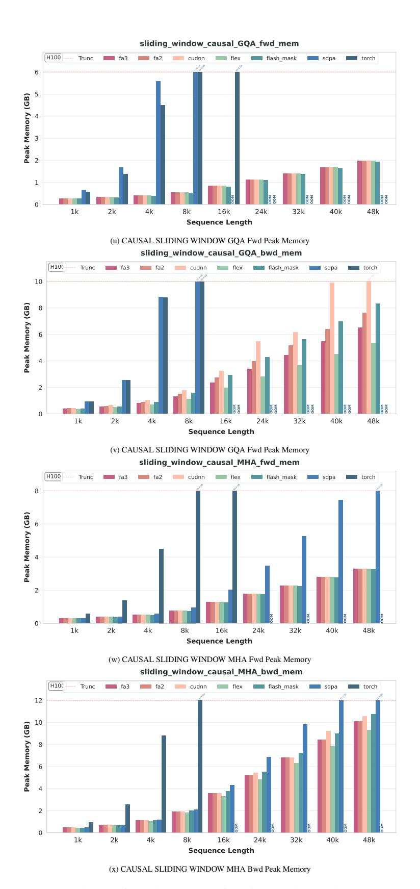

Figure 16: Peak Memory of Static Regular Masks

> **[图片提取文字 (无描述)]:**
> prefix\_Im\_GQA\_fwd\_mem H100 flash\_mask Trunc flex sdpa torch 6 5 Peak Memory (GB) 3 00 M 00M 0 1k 4k 2k 8k 16k 24k 32k 40k 48k Sequence Length (a) PREFIX LM GQA Fwd Peak Memory
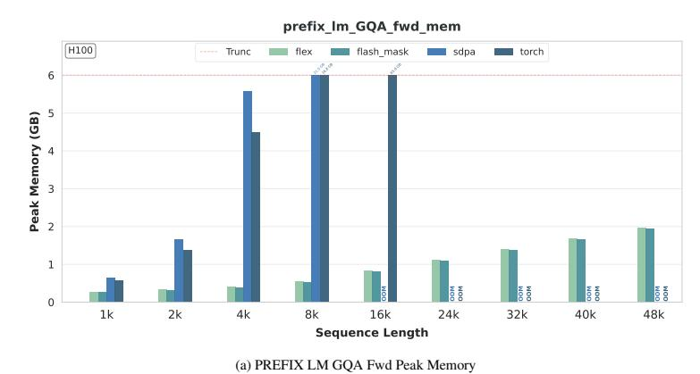

## (a) PREFIX LM GQA Fwd Peak Memory prefix\_lm\_GQA\_bwd\_mem

> **[图片提取文字 (无描述)]:**
> prenx\_im\_GQA\_bwa\_mem H100 Trunc flex flash\_mask sdpa torch 10 Peak Memory (GB) 8 6 2 MOO MOO MOO MOO MOO 0 1k 2k 4k 16k 24k 32k 40k 48k 8k Sequence Length
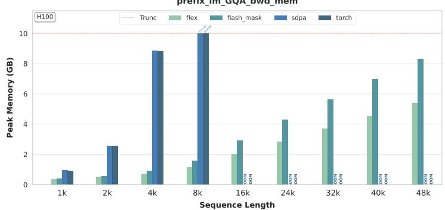

## (b) PREFIX LM GQA Bwd Peak Memory

> **[图片提取文字 (无描述)]:**
> prefix\_lm\_MHA\_fwd\_mem H100 Trunc flex flash\_mask sdpa torch 8 0 1k 2k 4k 8k 16k 24k 48k 32k 40k **Sequence Length**
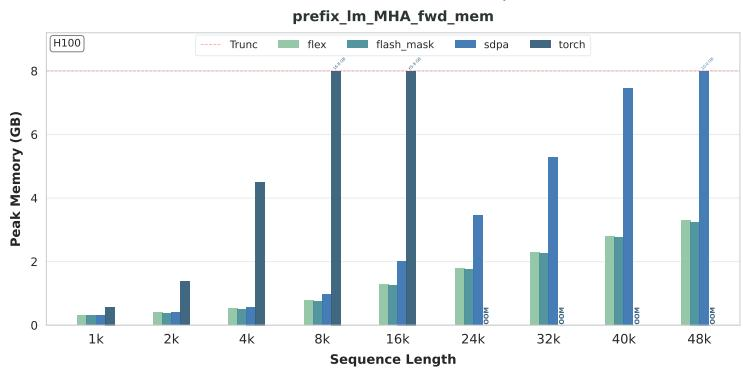

(c) PREFIX LM MHA Fwd Peak Memory

> **[图片提取文字 (无描述)]:**
> prefix\_lm\_MHA\_bwd\_mem H100 Trunc flash\_mask 12 flex sdpa torch 10 Peak Memory (GB) 0 1k 2k 4k 8k 16k 24k 32k 40k 48k Sequence Length
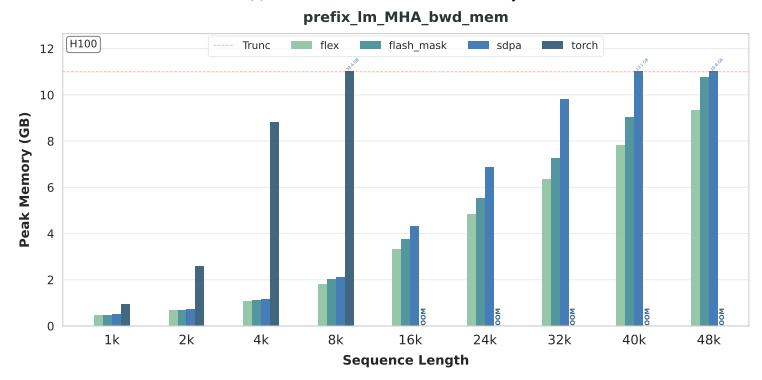

(d) PREFIX LM MHA Bwd Peak Memory

> **[图片提取文字 (无描述)]:**
> prefix\_lm\_document\_GQA\_fwd\_mem H100 Trunc flex flash\_mask sdpa torch 6 5 (GB) Peak Memory MOO MOO M000 00M 00M 1k 4k 8k 16k 48k 2k 24k 32k 40k Sequence Length
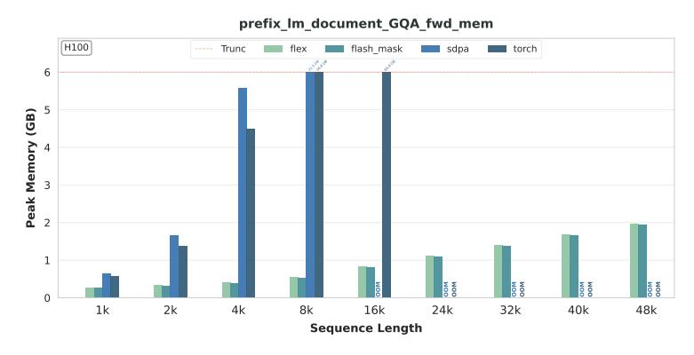

(e) PREFIX LM DOCUMENT GQA Fwd Peak Memory prefix\_lm\_document\_GQA\_bwd\_mem

> **[图片提取文字 (无描述)]:**
> prefix\_im\_document\_GQA\_bwd\_mem H100 Trunc flex flash\_mask sdpa torch 10 Peak Memory (GB) 8 6 2 MOO MOO MOO MOO 0 1k 2k 4k 8k 16k 24k 32k 40k 48k Sequence Length
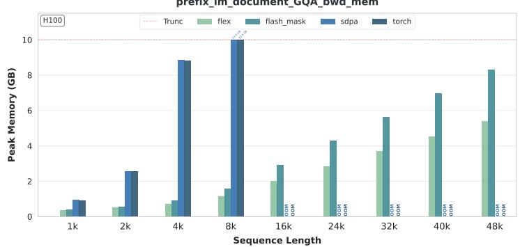

(f) PREFIX LM DOCUMENT GQA Bwd Peak Memory prefix\_Im\_document\_MHA\_fwd\_mem

> **[图片提取文字 (无描述)]:**
> prenz ini document MHA iwa mem H100 Trunc flex flash\_mask sdpa torch 12 10 6 4 8k 16k 24k 48k 1k 2k 4k 32k 40k Sequence Length
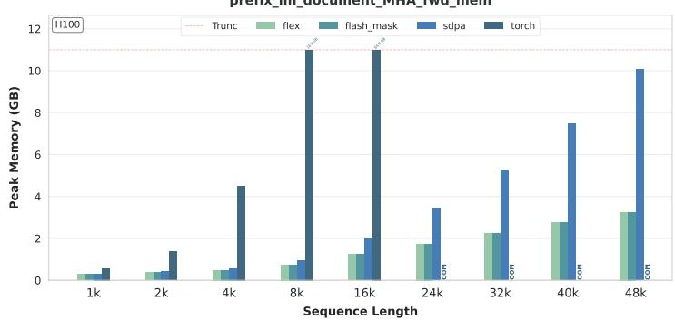

(g) PREFIX LM DOCUMENT MHA Fwd Peak Memory

> **[图片提取文字 (无描述)]:**
> prefix Im document MHA bwd mem 16 H100 flash\_mask flex sdpa sdpa Trunc torch 14 12 Peak Memory (GB) 10 6 4 2 0 1k 2k 4k 8k 16k 24k 32k 40k 48k Sequence Length
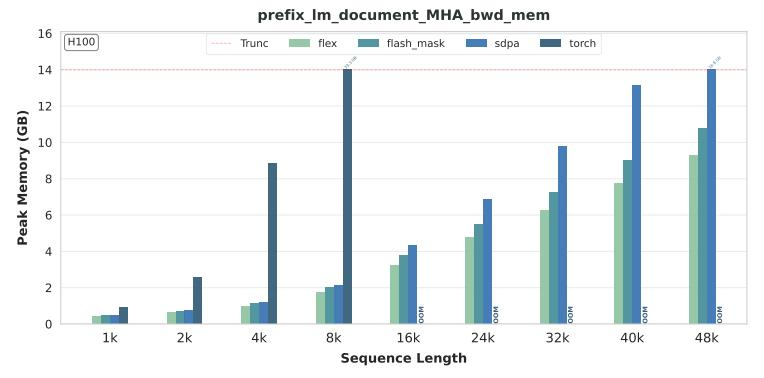

(h) PREFIX LM DOCUMENT MHA Bwd Peak Memory

> **[图片提取文字 (无描述)]:**
> share\_question\_GQA\_fwd\_mem H100 flex flash\_mask sdpa torch Trunc 6 Peak Memory (GB) 0 1k 2k 4k 8k 16k 24k 32k 40k 48k Sequence Length

## (i) SHARE QUESTION GQA Fwd Peak Memory

> **[图片提取文字 (无描述)]:**
> share\_question\_GQA\_bwd\_mem H100 flex flash\_mask Trunc sdpa torch 10 Peak Memory (GB) 8 6 4 2 MOO MOO 0 2k 4k 16k 24k 32k 40k 1k 8k 48k Sequence Length
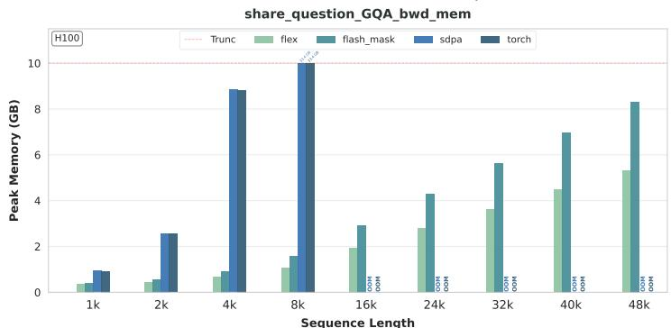

> **[图片提取文字 (无描述)]:**
> (j) SHARE QUESTION GQA Bwd Peak Memory share question\_MHA\_fwd\_mem
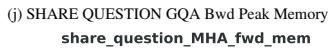

> **[图片提取文字 (无描述)]:**
> snare\_question\_MHA\_two\_mem H100 Trunc flex flash\_mask sdpa torch (GB) 0 16k 24k 1k 2k 4k 8k 32k 40k 48k Sequence Length
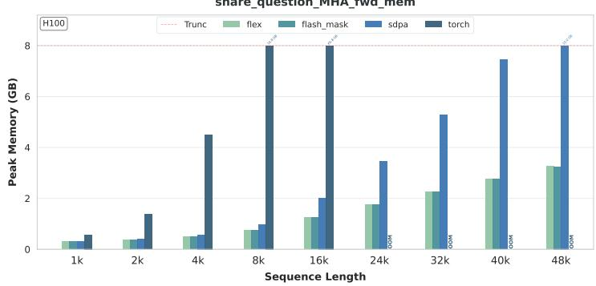

### (k) SHARE QUESTION MHA Fwd Peak Memory

> **[图片提取文字 (无描述)]:**
> share question MHA bwd mem H100 flash\_mask flex sdpa sdpa torch Trunc 12 10 Peak Memory (GB) 6 0 1k 2k 4k 8k 16k 24k 32k 40k 48k Sequence Length
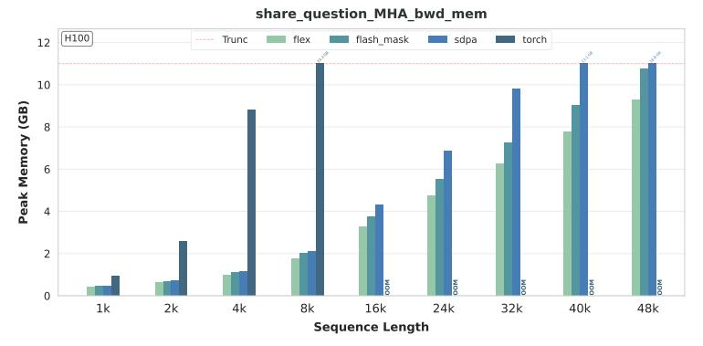

(l) SHARE QUESTION MHA Bwd Peak Memory

> **[图片提取文字 (无描述)]:**
> causal\_blockwise\_GQA\_fwd\_mem H100 flash\_mask sdpa sdpa Trunc flex \_\_\_ torch 6 5 Peak Memory (GB) MOO MO0 00M MOO 1k 2k 4k 8k 16k 24k 32k 40k 48k Sequence Length
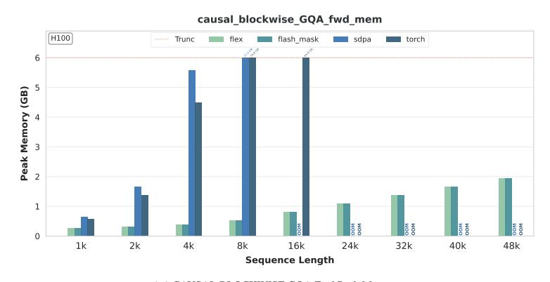

(m) CAUSAL BLOCKWISE GQA Fwd Peak Memory causal\_blockwise\_GQA\_bwd\_mem

> **[图片提取文字 (无描述)]:**
> causai\_blockwise\_GQA\_bwd\_mem H100 Trunc flex flash\_mask sdpa torch 10 Peak Memory (GB) 8 6 4 2 MOO MOO MOO MOO 0 2k 4k 8k 24k 32k 48k 1k 16k 40k Sequence Length
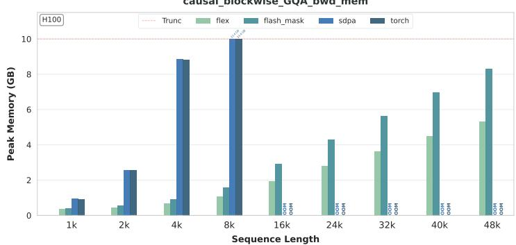

(n) CAUSAL BLOCKWISE GQA Bwd Peak Memory causal\_blockwise\_MHA\_fwd\_mem

> **[图片提取文字 (无描述)]:**
> causai\_blockwise\_MITA\_IWU\_IIIeIII H100 Trunc flash\_mask sdpa sdpa flex torch 12 10 Peak Memory (GB) 6 4 2 0 1k 4k 8k 16k 24k 40k 48k 2k 32k Sequence Length
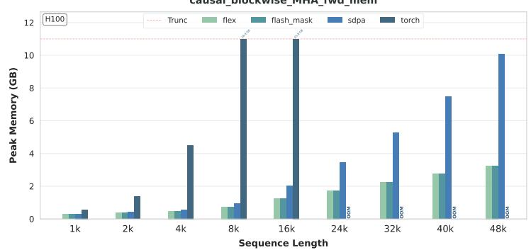

(o) CAUSAL BLOCKWISE MHA Fwd Peak Memory causal\_blockwise\_MHA\_bwd\_mem

> **[图片提取文字 (无描述)]:**
> causai\_blockwise\_MHA\_bwu\_mem H100 Trunc flex flash\_mask sdpa torch 12 10 Peak Memory (GB) 8 6 4 2 MOC 0 1k 2k 4k 8k 16k 24k 32k 40k 48k **Sequence Length**
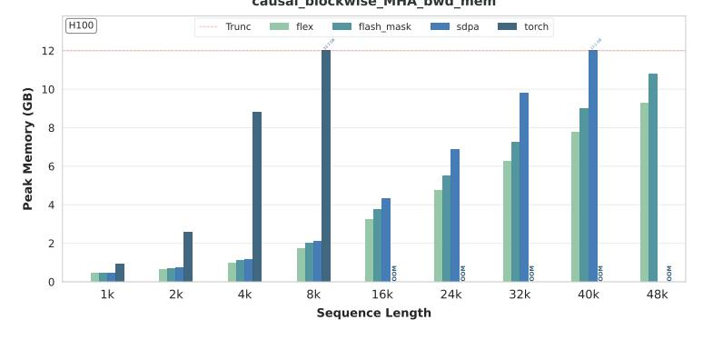

(p) CAUSAL BLOCKWISE MHA Bwd Peak Memory

> **[图片提取文字 (无描述)]:**
> global\_sliding\_GQA\_fwd\_mem H100 Trunc flash\_mask sdpa torch flex 6 Peak Memory (GB) MOO MOO 1k 2k 4k 16k 8k 24k 32k 40k 48k Sequence Length
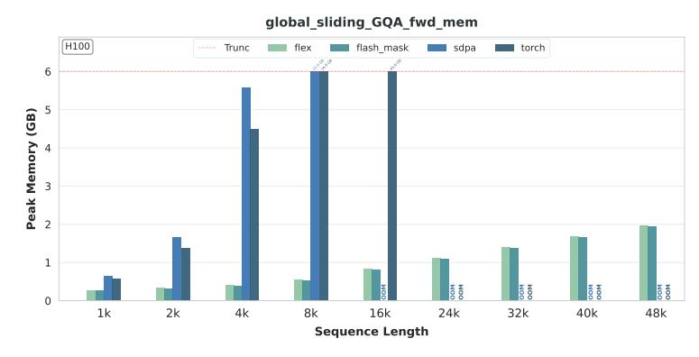

(q) GLOBAL SLIDING GQA Fwd Peak Memory

> **[图片提取文字 (无描述)]:**
> global\_sliding\_GQA\_bwd\_mem H100 flash\_mask sdpa Trunc flex torch 10 8 Peak Memory (GB) 6 4 2 MOO MOO MOO MOO 0 1k 16k 2k 4k 8k 24k 32k 40k 48k Sequence Length
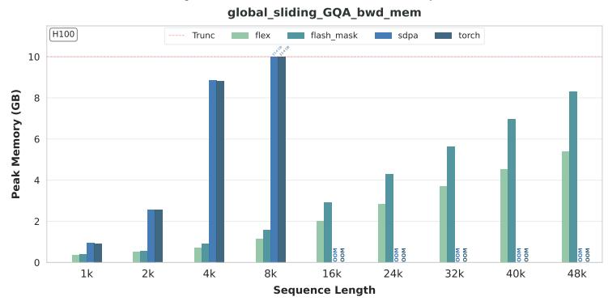

> **[图片提取文字 (无描述)]:**
> (r) GLOBAL SLIDING GQA Bwd Peak Memory global sliding MHA fwd mem
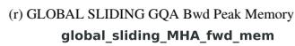

> **[图片提取文字 (无描述)]:**
> global\_sliding\_MHA\_twd\_mem H100 Trunc flex flash\_mask sdpa torch (GB) 0 16k 24k 1k 2k 4k 8k 32k 40k 48k Sequence Length

(s) GLOBAL SLIDING MHA Fwd Peak Memory

> **[图片提取文字 (无描述)]:**
> global\_sliding\_MHA\_bwd\_mem H100 flash\_mask 12 Trunc flex sdpa torch 10 Peak Memory (GB) MOO 0 4k 1k 2k 8k 16k 24k 32k 40k 48k Sequence Length
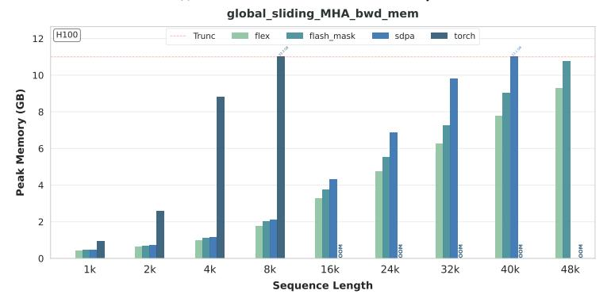

(t) GLOBAL SLIDING MHA Bwd Peak Memory

> **[图片提取文字 (无描述)]:**
> block\_causal\_document\_GQA\_fwd\_mem H100 Trunc flex flash\_mask sdpa 6 5 Peak Memory (GB) 2 1 MOO 0 1k 2k 4k 8k 24k 32k 40k 48k 16k Sequence Length (u) BLOCK CAUSAL DOCUMENT GQA Fwd Peak Memory block\_causal\_document\_GQA\_bwd\_mem H100 flex flash\_mask Trunc sdpa 10 Peak Memory (GB) 8 6 4 2 00M MOO MOO 0 1k 2k 4k 8k 16k 24k 32k 40k 48k Sequence Length (v) BLOCK CAUSAL DOCUMENT GQA Bwd Peak Memory block\_causal\_document\_MHA\_fwd\_mem H100 flash\_mask Trunc flex sdpa sdpa 12 10 Peak Memory (GB) 8 6 4 2 1k 2k 4k 8k 16k 24k 32k 40k 48k Sequence Length (w) BLOCK CAUSAL DOCUMENT MHA Fwd Peak Memory block\_causal\_document\_MHA\_bwd\_mem 16 H100 Trunc flex flash\_mask sdpa sdpa 14 12 Peak Memory (GB) 10 8 6 4 2 0 1k 2k 4k 8k 16k 24k 32k 40k 48k Sequence Length (x) BLOCK CAUSAL DOCUMENT MHA Bwd Peak Memory
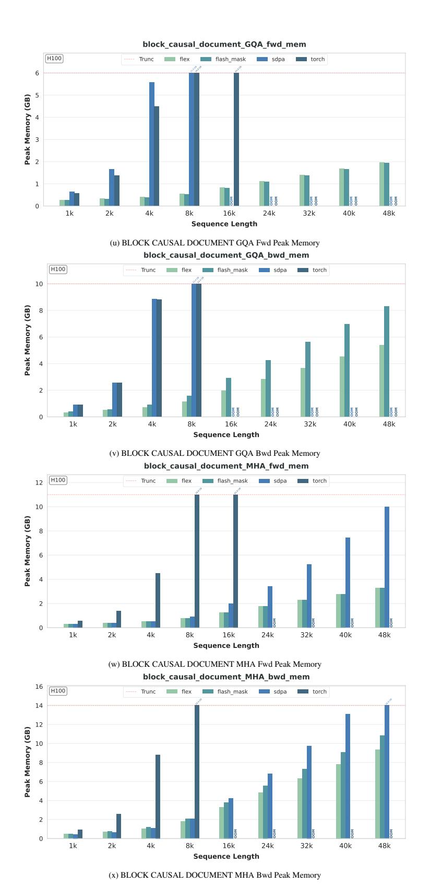

Figure 17: Peak Memory of Static Heterogeneous Masks

## A.5 DETAILS OF SPARSE KERNEL PERFORMANCE

In this section, we present the detailed comparisons for sparse kernels, including TFLOPS performance and peak memory usage. There are only partial baselines in each figure or table because current block sparse kernels have such limitations in functionality: VSA and Triton VSA do not support GQA and 128 block size, FA2 Sparse does not support 64 block size, FA2 Sparse and Flash-Infer do not support backward computation, and FlexAttention faces severe memory issues so we discuss it separately.

#### A.5.1 PERFORMANCE METRIC: FLOPS

TFLOPS of MHA with 64 block size. We report the performance of block sparse attention kernels with MHA and 64 block size in Figure [18.](#page-48-0) Only VSA, Triton VSA and FlashInfer support this setting. The left side shows the foward FLOPS with different sparsity ratios while the right side shows the backward FLOPS. Our findings reveal that VSA performs stably across different sparsity ratios, showing their robustness with adaptive computation. FlashInfer also performs stably but suffers from OOM issues with higher sparsity ratios because there are more blocks to compute, causing memory overhead with its metadata. However, we find that the performance of VSA reduces with the increase of the context length, especially for backward computation. This indicates that there may exists optimization opportunities for larger context lengths and backward computation for training scenarios.

TFLOPS of MHA with 128 block size. We report the performance of block sparse attention kernels with MHA and 128 block size with forward computation in Table [4.](#page-49-0) Only FlashInfer and FA2 Sparse support this setting. Comparing with the performance of 64 block size in Figure [18,](#page-48-0) the TFLOPS of FlashInfer in 128 block size increases about 2x, proportional to the block size increase, showing the scalability of FlashInfer block sparse kernels. Its OOM issues also decrease compared with 64 block size, because larger block size means smaller number of blocks, leading to smaller metadata storage. For the TFLOPS of FA2 Sparse, it demonstrates robustness across different sparsity ratios and context lengths. Its average performance is about 300+ FLOPS because it is not optimized for NVIDIA Hopper GPUs. There exists opportunities for tailored optimizations for specific hardware platforms to unleash the hardware performance.

Separate explanation of FlexAttention TFLOPS. FlexAttention is separately discussed because it is hard to generate the dynamic block sparse block through compilation, causing severe memory overhead with O(S 2 ) block mask representations. So we only test its TFLOPS performance with 4 heads and 16K context length in Table [5.](#page-49-1) It performs bad in 64 block size due to the lack of optimizations with small block size. While in 128 block size, it is comparable to TFLOPS of FA2 Sparse in Table [4.](#page-49-0) The reason behind is that FlexAttention uses 128 as its default block size, so the kernels it generates demonstrate relative good TFLOPS. It also supports backward computation with the similar performance.

#### A.5.2 PERFORMANCE METRIC: PEAK MEMORY USAGE

Peak memory of MHA with 64 block size. We report the peak memory of block sparse attention kernels with MHA and 64 block sizes in Figure [19.](#page-50-0) Only VSA, Triton VSA and FlashInfer support this setting. The left side window shows the forward pass with different sparsity ratio while the right side window shows the backward pass. VSA and VSA trition share the same memory usage while flashinfer exhibit higher GPU memory consumption which may because of its metadata representation for block sparse. It is also clear that The GPU memory consumption of VSA and VSA trition shows almost no correlation with the sparsity ratio. In contrast, the memory footprint of FlashInfer grows in proportion to the increase in the sparsity ratio. Peak memory in GQA scenarios. As shown in Table [6,](#page-50-1) in GQA scenarios, FlashInfer's GPU memory usage is significantly lower than in MHA scenarios, for both block sizes of 64 and 128. This is because the metadata required to represent the block sparse structure is greatly reduced. As for FA2 Sparse, its' memory consumption is greatly lower than flashinfer, which indicates flashinfer's poor performance in terms of GPU memory usage. Peak memory of MHA with 128 block size. We report the peak memory of block sparse attention kernels with MHA and 64 block sizes in Table [7,](#page-51-0) compared with MHA with 64 block size, flashinfer consumes less GPU memory. However, FA2 Sparse utilizes more GPU memory compared with GQA scenerio. Separate explanation of FlexAttention peak memory. FlexAttention

> **[图片提取文字 (无描述)]:**
> sparsity0.2\_MHA\_fwd\_flops sparsity0.2\_MHA\_bwd\_flops H100 H100 fa2\_sparse flashinfer vsa\_triton fa2\_sparse vsa\_triton 400 500 Speed (teraFLOPs/s) Speed (teraFLOPs/s) 300 300 200 100 100 0 16k 16k 32k 48k 64k 80k 96k 112k 128k 32k 48k 64k 80k 96k 112k 128k Sequence Length Sequence Length (a) MHA Fwd TFLOPS with 0.2 sparsity ratio (b) MHA Bwd TFLOPS with 0.2 sparsity ratio sparsity0.5\_MHA\_fwd\_flops sparsity0.5\_MHA\_bwd\_flops 600 H100 H100 wsa\_triton 500 400 Speed (teraFLOPs/s) Speed (teraFLOPs/s) 300 200 100 100 16k 32k 48k 80k 96k 112k 128k 16k 32k 48k 64k 80k 96k 112k 128k 64k Sequence Length **Sequence Length** (c) MHA Fwd TFLOPS with 0.5 sparsity ratio (d) MHA Bwd TFLOPS with 0.5 sparsity ratio sparsity0.8\_MHA\_fwd\_flops sparsity0.8\_MHA\_bwd\_flops 500 H100 H100 600 fa2\_sparse flashinfer flashinfer 500 400 Speed (teraFLOPs/s) Speed (teraFLOPs/s) 300 200 200 100 100 0 0 16k 16k 32k 48k 64k 80k 96k 112k 128k 32k 48k 64k 80k 96k 112k 128k Sequence Length Sequence Length (e) MHA Fwd TFLOPS with 0.8 sparsity ratio (f) MHA Bwd TFLOPS with 0.8 sparsity ratio
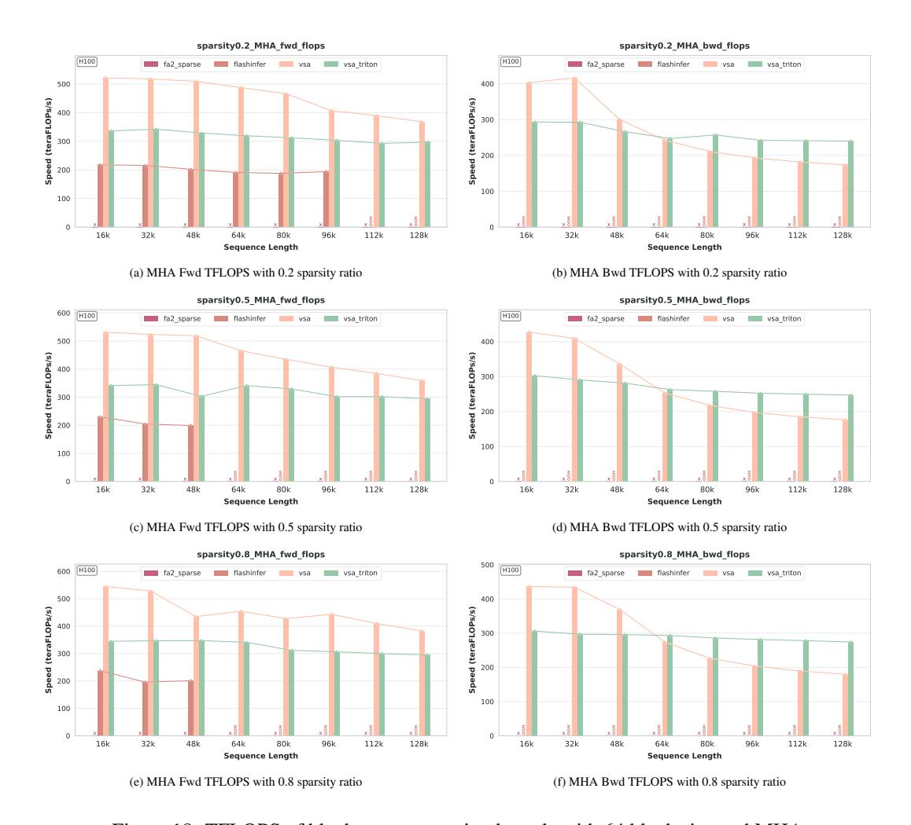

Figure 18: TFLOPS of block sparse attention kernels with 64 block size and MHA

is separately discussed because it is hard to generate the dynamic block sparse block through compilation, causing severe memory overhead with  $O(S^2)$  block mask representations. So we only test its TFLOPS performance with 4 heads and 16K context length in Table 5, most of FlexAttention's GPU memory is consumed during mask creation, while its runtime memory usage is not high. In block sparse scenarios, an efficient mask representation is crucial for GPU memory consumption.

Table 3: TFLOPs of Sparse Kernels for GQA (64:8) Forward

Note: Seqlen = Sequence Length, SR = Sparsity Ratio, X = Not Supported.

|             |        | BlockSize 64 |        |        | BlockSize 128 |        |        |
|-------------|--------|--------------|--------|--------|---------------|--------|--------|
| Kernels     | Seqlen | SR 0.2       | SR 0.5 | SR 0.8 | SR 0.2        | SR 0.5 | SR 0.8 |
|             | 16k    | 211.78       | 236.30 | 247.83 | 387.63        | 449.79 | 472.52 |
|             | 32k    | 232.81       | 243.77 | 203.54 | 422.95        | 455.97 | 485.06 |
|             | 48k    | 211.50       | 218.30 | 215.47 | 413.11        | 434.61 | 432.16 |
| FlashInfer  | 64k    | 190.73       | 210.82 | 204.16 | 414.25        | 427.77 | 399.22 |
| riasiiiiiei | 80k    | 201.71       | 198.39 | 206.43 | 351.87        | 393.34 | 410.88 |
|             | 96k    | 202.03       | 197.48 | 201.42 | 393.16        | 387.89 | 398.73 |
|             | 112k   | 198.14       | 196.82 | 199.41 | 393.41        | 389.33 | 397.02 |
|             | 128k   | 196.47       | 195.61 | 197.93 | 389.55        | 396.90 | 393.80 |
|             | 16k    | Х            | Х      | Х      | 312.54        | 326.62 | 332.00 |
|             | 32k    | X            | X      | X      | 327.46        | 333.45 | 339.16 |
|             | 48k    | X            | X      | X      | 331.99        | 281.27 | 331.24 |
| EAO C       | 64k    | Х            | Х      | Х      | 328.84        | 329.88 | 329.99 |
| FA2 Sparse  | 80k    | X            | X      | X      | 293.43        | 330.62 | 319.52 |
|             | 96k    | X            | X      | X      | 328.38        | 318.18 | 321.05 |
|             | 112k   | X            | X      | X      | 298.22        | 316.92 | 322.47 |
|             | 128k   | ×            | ×      | X      | 317.48        | 317.11 | 321.04 |

Table 4: Forward TFLOPs of Sparse MHA Kernels (64:64, Block Size = 128)

Note: Seqlen = Sequence Length, SR = Sparsity Ratio, X = Not Supported.

| Kernels     | Seqlen | SR 0.2 | SR 0.5 | SR 0.8 |
|-------------|--------|--------|--------|--------|
|             | 16k    | 414.93 | 447.76 | 484.21 |
|             | 32k    | 425.38 | 416.37 | 425.88 |
|             | 48k    | 407.67 | 401.60 | 402.69 |
| FlashInfer  | 64k    | 398.01 | 394.79 | 392.05 |
| riasiiiiiei | 80k    | 342.30 | 384.46 | OOM    |
|             | 96k    | 388.09 | OOM    | OOM    |
|             | 112k   | 380.67 | OOM    | OOM    |
|             | 128k   | 384.05 | OOM    | OOM    |
|             | 16k    | 315.12 | 326.09 | 331.27 |
|             | 32k    | 327.63 | 333.32 | 337.07 |
|             | 48k    | 331.79 | 282.22 | 335.95 |
| EA2 Sparae  | 64k    | 325.86 | 330.73 | 329.45 |
| FA2 Sparse  | 80k    | 295.20 | 328.64 | 318.44 |
|             | 96k    | 325.09 | 317.42 | 320.26 |
|             | 112k   | 301.61 | 318.13 | 322.56 |
|             | 128k   | 308.39 | 317.80 | 321.67 |

Table 5: TFLOPs of Sparse FlexAttention (SeqLen = 16K)

Note: Seqlen = Sequence Length, SR = Sparsity Ratio.

|           |     | Block   | Size 64  | BlockSize 128 |          |  |
|-----------|-----|---------|----------|---------------|----------|--|
| Mode      | SR  | Forward | Backward | Forward       | Backward |  |
| GQA (4:1) | 0.2 | 29.05   | 57.22    | 339.74        | 299.43   |  |
|           | 0.5 | 48.21   | 95.33    | 352.09        | 312.76   |  |
|           | 0.8 | 99.80   | 170.40   | 358.55        | 325.52   |  |
| MHA (4:4) | 0.2 | 28.75   | 63.14    | 341.55        | 305.37   |  |
|           | 0.5 | 48.76   | 103.37   | 345.84        | 337.60   |  |
|           | 0.8 | 101.58  | 186.44   | 352.18        | 349.00   |  |

> **[图片提取文字 (无描述)]:**
> sparsity0.2\_MHA\_fwd\_mem sparsity0.2\_MHA\_bwd\_mem H100 H100 Trunc === flashinfer vsa\_triton === flashinfer wsa\_triton 30 30 Deak Memory (GB)
> 15
> 10 25 Peak Memory (GB) 20 15 10 10 5 16k 48k 96k 112k 16k 32k 48k 112k 128k 32k 64k 80k 128k 80k 96k Sequence Length Sequence Length (a) MHA Fwd peak memory with 0.2 sparsity ratio (b) MHA Bwd peak memory with 0.2 sparsity ratio sparsity0.5\_MHA\_fwd\_mem sparsity0.5\_MHA\_bwd\_mem 35 35 H100 H100 Trunc vsa\_triton Trunc flashinfer wsa\_triton flashinfer 30 30 Deak Memory (GB) 15 10 Deak Memory (GB) 15 10 10 10 16k 32k 48k 64k 80k 96k 112k 128k 16k 32k 48k 64k 80k 96k 112k 128k Sequence Length Sequence Length (c) MHA Fwd peak memory with 0.5 sparsity ratio (d) MHA Bwd peak memory with 0.5 sparsity ratio sparsity0.8\_MHA\_fwd\_mem sparsity0.8\_MHA\_bwd\_mem 35 35 H100 H100 Trunc flashinfer fa2\_sparse flashinfer 30 25 20 20 15 15 10 10 Peak Memory (GB) 15 10 10 5 5 16k 32k 48k 64k 96k 112k 128k 16k 32k 48k 64k 80k 96k 112k 128k 80k Sequence Length Sequence Length (e) MHA Fwd peak memory with 0.8 sparsity ratio (f) MHA Bwd peak memory with 0.8 sparsity ratio
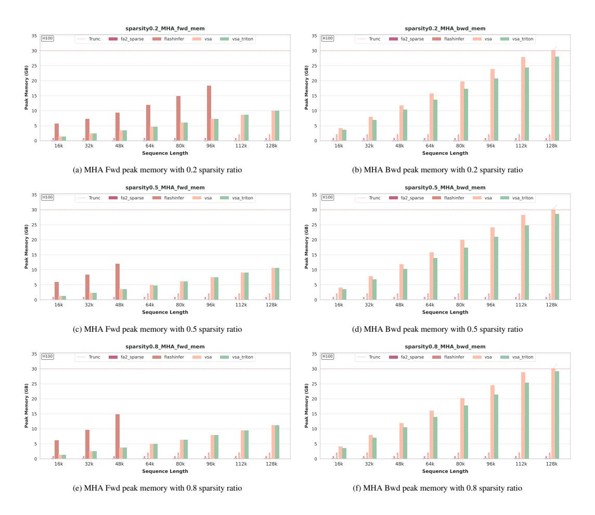

Figure 19: Peak memory of block sparse attention kernels with 64 block size and MHA

Table 6: Peak Memory (GB) of Sparse Kernels for GQA (64:8) Forward

Note: Seqlen = Sequence Length, SR = Sparsity Ratio, X = Not Supported.

|            |        | BlockSize 64 |        |        | Bl     | lockSize 1 | 28     |
|------------|--------|--------------|--------|--------|--------|------------|--------|
| Kernels    | Seqlen | SR 0.2       | SR 0.5 | SR 0.8 | SR 0.2 | SR 0.5     | SR 0.8 |
|            | 16k    | 5.468        | 5.502  | 5.540  | 5.448  | 5.466      | 5.485  |
|            | 32k    | 6.620        | 6.770  | 6.920  | 6.552  | 6.627      | 6.702  |
|            | 48k    | 7.837        | 8.174  | 8.512  | 7.684  | 7.853      | 8.022  |
| El1-1-6    | 64k    | 9.115        | 9.715  | 10.317 | 8.845  | 9.145      | 9.444  |
| FlashInfer | 80k    | 10.455       | 11.393 | 12.330 | 10.034 | 10.502     | 10.970 |
|            | 96k    | 11.857       | 13.207 | 14.557 | 11.250 | 11.923     | 12.599 |
|            | 112k   | 13.322       | 15.159 | 16.997 | 12.493 | 13.413     | 14.331 |
|            | 128k   | 14.846       | 17.247 | 19.647 | 13.766 | 14.964     | 16.165 |
|            | 16k    | Х            | Х      | Х      | 0.810  | 0.810      | 0.810  |
|            | 32k    | X            | X      | X      | 1.393  | 1.393      | 1.393  |
|            | 48k    | X            | X      | X      | 1.986  | 1.986      | 1.986  |
| EA2 Spores | 64k    | X            | X      | X      | 2.590  | 2.590      | 2.590  |
| FA2 Sparse | 80k    | X            | X      | X      | 3.205  | 3.205      | 3.205  |
|            | 96k    | X            | X      | X      | 3.830  | 3.830      | 3.830  |
|            | 112k   | X            | X      | X      | 4.466  | 4.466      | 4.466  |
|            | 128k   | Х            | Х      | Х      | 5.113  | 5.113      | 5.113  |

Table 7: Forward Peak Memory of Sparse MHA Kernels (64:64, Block Size = 128)

Note: Seqlen = Sequence Length, SR = Sparsity Ratio, ✗ = Not Supported.

| Kernels    | Seqlen | SR 0.2 | SR 0.5 | SR 0.8 |
|------------|--------|--------|--------|--------|
|            | 16k    | 5.477  | 5.627  | 5.776  |
|            | 32k    | 6.791  | 7.392  | 7.991  |
|            | 48k    | 8.316  | 9.666  | 11.015 |
|            | 64k    | 10.051 | 12.452 | 14.849 |
| FlashInfer | 80k    | 11.994 | 15.746 | OOM    |
|            | 96k    | 14.148 | OOM    | OOM    |
|            | 112k   | 16.514 | OOM    | OOM    |
|            | 128k   | 19.085 | OOM    | OOM    |
|            | 16k    | 1.251  | 1.251  | 1.251  |
|            | 32k    | 2.281  | 2.281  | 2.281  |
|            | 48k    | 3.329  | 3.329  | 3.329  |
|            | 64k    | 4.395  | 4.395  | 4.395  |
| FA2 Sparse | 80k    | 5.478  | 5.478  | 5.478  |
|            | 96k    | 6.587  | 6.578  | 6.578  |
|            | 112k   | 7.696  | 7.696  | 7.696  |
|            | 128k   | 8.832  | 8.832  | 8.832  |

Table 8: Peak Memory (GB) of Sparse FlexAttention (SeqLen = 16K)

Note: Seqlen = Sequence Length, SR = Sparsity Ratio.

|           |     |         | BlockSize 64 | BlockSize 128 |          |  |
|-----------|-----|---------|--------------|---------------|----------|--|
| Mode      | SR  | Forward | Backward     | Forward       | Backward |  |
| GQA (4:1) | 0.2 | 0.285   | 0.383        | 0.294         | 0.392    |  |
|           | 0.5 | 0.287   | 0.384        | 0.296         | 0.394    |  |
|           | 0.8 | 0.288   | 0.386        | 0.297         | 0.395    |  |
| MHA (4:4) | 0.2 | 0.304   | 0.449        | 0.313         | 0.458    |  |
|           | 0.5 | 0.306   | 0.450        | 0.315         | 0.460    |  |
|           | 0.8 | 0.307   | 0.452        | 0.316         | 0.461    |  |

#### A.6 DETAILS OF CONTEXT PARALLEL ATTENTION PERFORMANCE

Performance of ring P2P. The main limitation of ring P2P is that its communication volume cannot be adjusted. In each iteration, while computing with the KV pairs for the current stage, each device simultaneously sends its own KV to the next device in the topology and receives the KV needed for the next stage. In a multi-node, multi-GPU setup, all GPUs are connected in a ring-based P2P topology. The communication bottleneck is determined by the slowest inter-node link, forcing intranode communication to synchronize with the inter-node transfers, which leads to substantial overall bandwidth underutilization.

Ultimately, the overall efficiency of Ring P2P is determined by the actual per-GPU computation, which manifests in whether communication can be overlapped with computation. The FULL scenario represents the optimal performance case for Ring P2P. As shown in the Figure [20,](#page-53-0) in this scenario, each GPU executes the largest per-kernel computation. When inter-node communication can also be effectively overlapped with computation, further scaling the distributed setup does not significantly change the balance between computation and communication efficiency, so the overall computational efficiency remains essentially constant.

In the CAUSAL scenario, the per-GPU communication volume of Ring P2P remains the same as in the FULL scenario. Even after load balancing, the per-stage computation per GPU is roughly half of that in the FULL scenario (except for the first stage, which is 3/4). The reduced computation may no longer fully overlap with communication, leading to a performance drop in Ring P2P under CAUSAL, as shown in the Figure [21.](#page-54-0) During the forward pass, when scaling to 8 nodes, we observe further performance degradation. We attribute this mainly to machine instability: even if only a single GPU underperforming in the ring, for example from a sudden drop in computation efficiency, can stall the entire topology and greatly reduce overall efficiency. In large-scale distributed settings, such effects are inevitable, and we report the experimental results faithfully.

For the DOCUMENT scenario, as shown in the Figure [22,](#page-54-1) Ring P2P exhibits similar trends in both the CAUSAL DOCUMENT and FULL DOCUMENT settings. Unlike the FULL/CAUSAL scenarios, it does not maintain a relatively constant trend, which is expected. First, when handling variable-length data, each segment must be padded according to its specific scale, leading to significant variation in per-GPU computation per iteration, while communication volume remains constant. Second, sampling of variable-length data introduces differences in computational sparsity across iterations, resulting in fluctuations in the overall trend.

Hybrid Design. USP and LoongTrain share very similar overall architectures, using the Ulysses design intra-node and Ring P2P inter-node. Overall, they achieve significant and stable performance improvements in the FULL and CAUSAL scenarios, as shown in Figure [20](#page-53-0) and [21.](#page-54-0) In the FULL DOCUMENT and CAUSAL DOCUMENT scenarios, performance gradually decreases due to reduced overall computation, which aligns with expectations. Additionally, in the DOCUMENT scenario, as shown in Figure [23](#page-55-0) and [22,](#page-54-1) both architectures demonstrate improved stability, mitigating the limitations of using only Ulysses or Ring P2P.

Here, we primarily explain why LoongTrain generally outperforms USP during the forward pass, yet performs on par with or slightly worse than USP during the backward pass.

In our benchmark reproduction and optimization, USP and Ring P2P both use the same RingAttn class. In the ring-topology iterations, the forward and backward data flows are essentially opposite. For example, during the forward pass, GPUi receives data from GPUi−1 and sends data to GPUi+1; in the backward pass, GPUi receives from GPUi+1 and sends to GPUi−1.

This design is both necessary and reasonable. At the end of the forward pass, GPU0 actually holds the initial-stage KV data of GPU1, and so on, with GPUN−1 finally holding GPU0's initial data. If the backward pass rotated data in the same direction as the forward pass, it would require either an additional P2P communication or storing the initial-stage KV on each GPU in advance, both of which incur extra overhead.

Instead, we exploit the time difference between KV and gradient generation: the backward pass directly continues from the forward-pass KV states in reverse rotation, while gradients computed in the current stage are sent during the next stage. After completing the same number of rotations, each GPU receives exactly its corresponding gradient (e.g.,  $GPU_0$  receives the gradient for  $KV_0$ , and so on).

For LoongTrain's DoubleRingAttn, the forward pass is consistent with USP. In addition, LoongTrain leverages a heterarchical P2P architecture to implement a two-level sliding window, decomposing the full ring topology into intra-window and inter-window groups. The intra-window group is identical to the RingAttn class, but in the first stage, an additional P2P communication is performed for the inter-window group to prefetch the initial data for each GPU after the next inter-window rotation. This design fully utilizes inter-node bandwidth, resulting in superior forward-pass performance compared to USP.

However, LoongTrain's backward pass cannot directly leverage the forward-pass end states. While this poses no issue for the last inter-window, it alters the initial state for each subsequent interwindow, and the final states differ depending on the specific intra- and inter-window configuration. As a result, LoongTrain performs forward and backward passes using the same rotation order. Each GPU additionally stores the initial KV data, and to ensure correct gradient propagation, an extra P2P communication and synchronization of gradients is performed at the end of each inter-window. This guarantees that in the next inter-window, each GPU receives the corresponding KV data and gradients. Consequently, LoongTrain gains no significant backward-pass advantage from the heterarchical architecture, yet overall maintains performance comparable to USP. The observed fluctuations in trends are similarly attributed to the instability introduced by the additional P2P communications.

**Ulysess.** For Ulysess, the results are straightforward: different sampling patterns naturally lead to variations in computation, and we recommend evaluating performance based on the specific application scenario.

> **[图片提取文字 (无描述)]:**
> full\_fwd\_flops H100 ulysses loongtrain ring\_p2p usp Speed (teraFLOPs/s) Distributed Scale (#GPUs) full\_bwd\_flops H100 ulysses loongtrain ring\_p2p usp Speed (teraFLOPs/s) Distributed Scale (#GPUs)
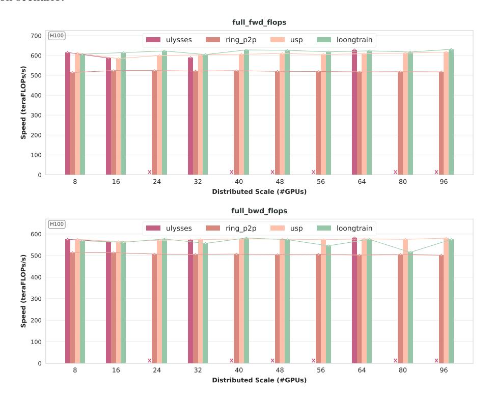

Figure 20: Forward and Backward TFLOPs of Context Parallel Attention on FULL

> **[图片提取文字 (无描述)]:**
> causal\_fwd\_flops H100 loongtrain ulysses ring\_p2p usp Speed (teraFLOPs/s) Distributed Scale (#GPUs) causal\_bwd\_flops H100 ulysses loongtrain ring\_p2p usp Speed (teraFLOPs/s) Distributed Scale (#GPUs)
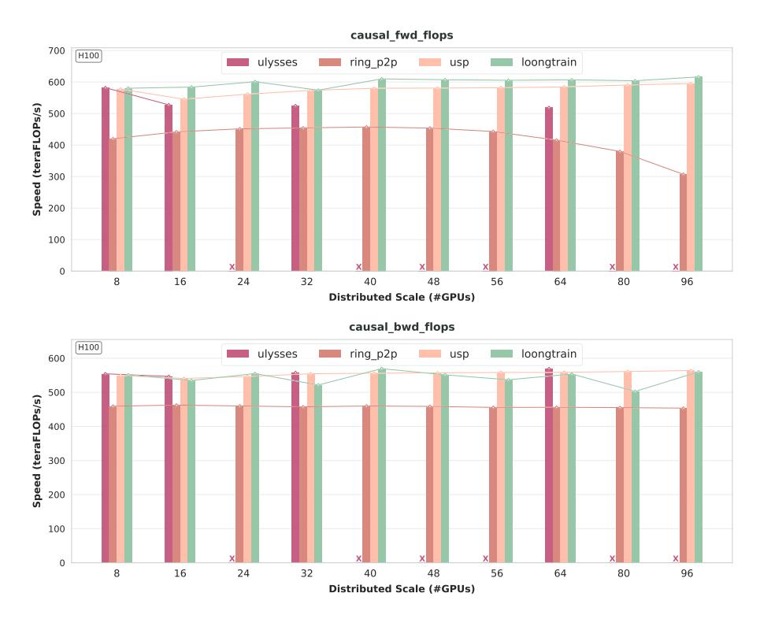

Figure 21: Forward and Backward TFLOPs of Context Parallel Attention on CAUSAL

> **[图片提取文字 (无描述)]:**
> causal\_document\_fwd\_flops H100 loongtrain ulysses ring\_p2p usp Speed (teraFLOPs/s) Distributed Scale (#GPUs) causal\_document\_bwd\_flops H100 ulysses ring\_p2p loongtrain usp Speed (teraFLOPs/s) Distributed Scale (#GPUs)
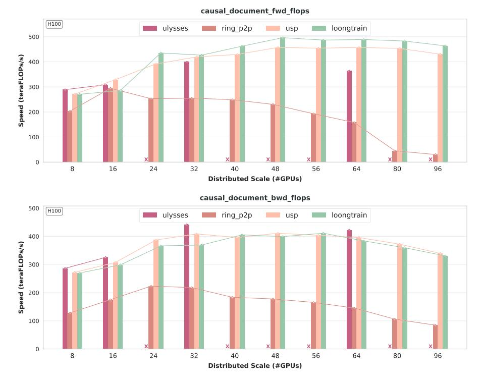

Figure 22: Forward and Backward TFLOPs of Context Parallel Attention on CAUSAL DOCU-MENT

> **[图片提取文字 (无描述)]:**
> full\_document\_bwd\_flops H100 ulysses ring\_p2p loongtrain usp Speed (teraFLOPs/s) Distributed Scale (#GPUs)
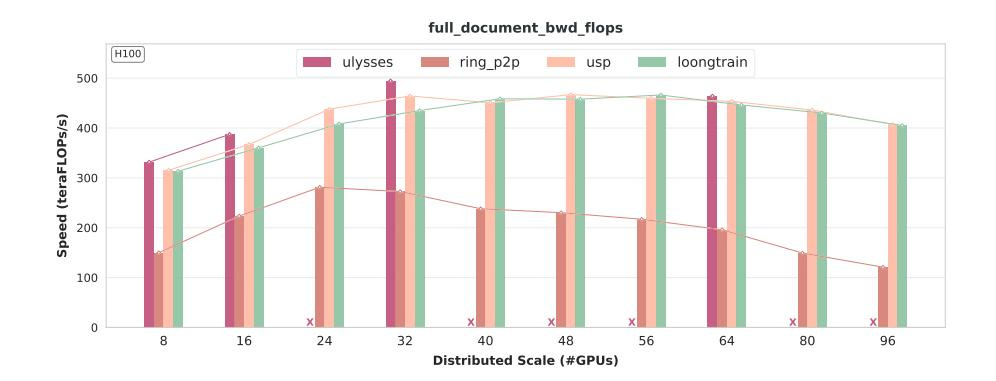

Figure 23: Backward TFLOPs of Context Parallel Attention on FULL DOCUMENT