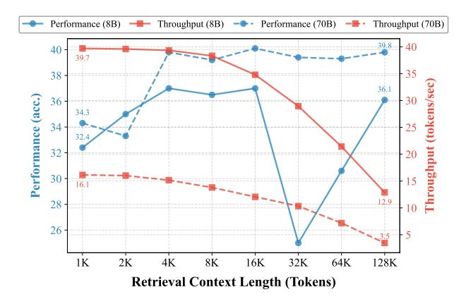

# 1. Introduction

Large language models (LLMs) have traditionally relied on retrieval-augmented generation (RAG) to process extensive documents by selectively retrieving relevant text segments. While effective, the performance of RAG is inherently bounded by the capability of the retriever to extract pertinent information across diverse queries [\(Gao et al.,](#page-8-0) [2023\)](#page-8-0). The recent emergence of long-context LLMs, capable of directly processing million-word documents [\(Team](#page-10-0) [et al.,](#page-10-0) [2024\)](#page-10-0), suggests a promising alternative to complex RAG pipelines. However, this breakthrough is bottlenecked by the computational efficiency of long-context inference, where processing extensive key-value (KV) caches becomes memory-bound and introduces substantial latency [\(Pope](#page-9-0) [et al.,](#page-9-0) [2022\)](#page-9-0).

Speculative Decoding (SD) [\(Chen et al.,](#page-8-1) [2023;](#page-8-1) [Leviathan](#page-9-1) [et al.,](#page-9-1) [2023\)](#page-9-1) is a prevalent approach to accelerate LLM inference without compromising generation quality. By leveraging a smaller draft model to propose multiple candidates for single-pass validation by the target model, SD achieves significant speedup when candidates are accepted. The benefits of SD hinge on two critical factors: the computational efficiency of the draft model in generating candidates, as well as its capability to produce high-quality and acceptable candidates. However, SD will become less effective in longcontext scenarios, as memory-bound KV cache operations prevent smaller LLMs from maintaining significant speed benefits over larger models [\(Pope et al.,](#page-9-0) [2022;](#page-9-0) [Ainslie et al.,](#page-8-2) [2023b\)](#page-8-2). As depicted in [Figure 1,](#page-1-0) the throughput gains of LLaMA-3.1-8B over LLaMA-3.1-70B diminish drastically (23.6 → 9.4) with increasing context lengths from 1K to 128K tokens.

In this work, we introduce Retrieval-Augmented SPeculatIve Decoding (RAPID), to bridge the gap of SD for accelerating long-context inference while enhancing generation quality. RAPID employs a *RAG drafter*—the draft LLM operating on shortened context from RAG—to speculate the generation of long-context LLM following the SD process. We propose that RAG drafter can serve as *ideal draft model* for long-context target LLM, as it

\*Equal contribution 1National University of Singapore 2DAMO Academy, Alibaba Group 3Hupan Lab, 310023, Hangzhou, China. Correspondence to: Guanzheng Chen <gc.chen@u.nus.edu>, Michael Qizhe Shieh <michaelshieh@comp.nus.edu.sg>.

> **[图片提取文字 (无描述)]:**
> Performance (8B) — Throughput (8B) — Performance (70B) — Throughput (70B) 39.8 40 40 39.7 35 38 36.1 Performance (acc.) 36 34.3 34 32.4 32 20 30 15 16.1 12.9 28 10 26 1K 2K 4K 8K 16K 32K 64K 128K Retrieval Context Length (Tokens)

Figure 1. Performance (accuracy, left axis) and throughput (tokens/sec, right axis) of LLaMA-3.1-8B (serving on 1×A800) and LLaMA-3.1-70B (serving on 8×A800) on LongBench v2 (Long) across different retrieval context lengths.

demonstrates the potential to approach the capabilities of long-context LLM [\(Li et al.,](#page-9-2) [2024b\)](#page-9-2) while offering superior computational efficiency. As illustrated in [Figure 1,](#page-1-0) LLaMA-3.1-8B with RAG on 4K∼16K tokens can recover most performance achieved with full 128K tokens. This indicates that the RAG drafter is capable of producing high-quality candidates for long-context target LLM with high acceptance rate, while eliminating the memory-bound KV cache operations over long-context to accelerate the inference process.

In addition, our RAPID opens a new paradigm for SD that *leveraging the same-scale or even larger LLMs as the RAG drafters to accelerate smaller target LLMs.* This paradigm shift is possible since RAG drafters, operating on shortened contexts (e.g., 4K), potentially maintain higher efficiency than target LLMs of the same or even larger scale on long contexts (e.g., 128K) as evidenced in [Figure 1.](#page-1-0) Therefore, our RAPID operates on two settings: (1) *self-speculation*, where long-context target LLM and RAG drafter are of the same scale; and (2) *upward-speculation*, where RAG drafter involves larger parameter scale than target LLM. Moreover, in the both settings, the generation quality of RAG drafter may surpass that of long-context target models in some scenarios [\(Li et al.,](#page-9-3) [2024a\)](#page-9-3). However, the native SD, utilizing target LLM prediction as ground-truth distribution to perform rejection sampling, may neglect the candidates of high quality from the stronger RAG drafter. This would result in unnecessary rejection of valid candidates, thereby impeding both efficiency and performance gains.

To address this limitation, RAPID implements a retrievalaugmented target distribution, which incorporates the native long-context target distribution in SD with an *inference-time knowledge transfer*. Specifically, we reversely position the RAG drafter as teacher and long-context target LLM as the

student, to derive a distilled logits shift towards the RAG drafter during inference. By incorporating the shift into the prediction logits of target LLM, we obtain an enriched target distribution that is more receptive to high-quality speculative candidates.

Our RAPID can serve as a drop-in decoding method during long-context inference. We conduct experiments on LLaMA-3.1 (8B, 70B) [\(Dubey et al.,](#page-8-3) [2024\)](#page-8-3) and Qwen2.5 (7B, 72B) [\(Yang et al.,](#page-10-1) [2024\)](#page-10-1) series on ∞Bench [\(Zhang](#page-10-2) [et al.\)](#page-10-2) and LongBench v2 [\(Bai et al.,](#page-8-4) [2024b\)](#page-8-4). The experimental results demonstrate that RAPID successfully integrates the complementary strengths of long-context LLMs and RAG while maintaining significant inference speedups. In self-speculation settings, RAPID achieves consistent performance improvements (e.g., 42.83 vs 39.33 on InfiniteBench for LLaMA-3.1-8B) with significant speedup (up to 2.69×) over the long-context target LLMs. The upward-speculation setting further boosts performance through effective knowledge transfer from larger RAG drafters (e.g., improving LLaMA-3.1-8B from 42.83 to 49.98 on InfiniteBench), with comparable efficiency with the smaller long-context target LLMs. With moderate retrieval length (≤16K) for RAG drafter, we found RAPID consistently achieves speedup when target long-context length beyond 32K. Our analyses also indicate that RAPID demonstrates robustness to retrieval quality and potentially superior generation quality in real-world multi-turn dialogue tasks. These results validate RAPID as an effective decoding method for accelerating long-context inference and, at the same time, enhancing generation quality through retrieval-augmented speculation.

