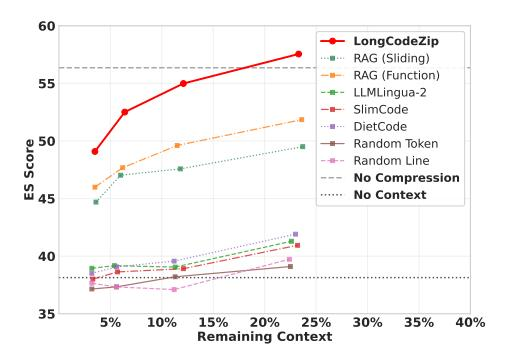

# **?** Finding 3

Our LongCodeZip generalizes well across different types and sizes of models in the cross-model setting, using a 0.5B model can also bring promising performance.

## D. RQ4: Efficiency Analysis

To evaluate the practical efficiency of LongCodeZip, we analyze the Long Code Completion task using Qwen2.5-Coder-7B by measuring both compression overhead and downstream benefits. We select several representative baselines based on their downstream performance in Table IX. The GPU memory costs represent peak memory usage per stage, with generation memory cost referring to additional memory for forward propagation during generation beyond base model parameters (28.37GB). Due to the space limit, we only report the results with several representative baselines. Note that SlimCode and DietCode require no GPU memory for compression because they are not based on neural models.

Table IX demonstrates that LongCodeZip achieves superior compression efficiency while maintaining the best performance. While our method requires a slightly higher compression overhead of 2.58s and additional GPU memory compared to the baselines, it significantly reduces input token costs by 77% and decreases generation latency from 15.70s to 6.59s compared to no compression. This also translates to substantial

> **[图片提取文字 (无描述)]:**
> 60 LongCodeZip RAG (Sliding) RAG (Function) 55 LLMLingua-2 SlimCode DietCode 50 ES Score Random Token Random Line No Compression No Context 40 35 5% 10% 15% 20% 25% 30% 35% 40% Remaining Context

Fig. 3: Performance (ES) vs remaining context (%).

cost savings when using expensive commercial LLM APIs, where pricing is primarily based on input token count. More importantly, as demonstrated in RQ3, the compression overhead can be effectively mitigated by using a lightweight 0.5B model without sacrificing quality. And the efficiency gains can also be further enhanced through techniques like quantization [43], making our approach highly practical for real-world deployment scenarios where cost efficiency is paramount.

