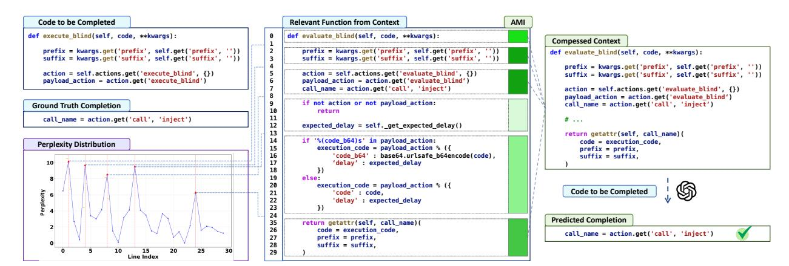

# **9** Finding 4

Our LongCodeZip achieves 4.3× compression ratio with only 2.6s overhead, reduces generation time from 15.7s to 6.6s, yet it still maintains high downstream performance.

#### VI. DISCUSSION

### A. Compression vs Performance

Understanding the relationship between compression ratio and model performance is essential for evaluating the effectiveness of code compression methods in long-context scenarios. Figure 3 presents the ES score versus the percentage of remaining context, showing Qwen2.5-Code-7B results for representative methods on the Long Code Completion task. LongCodeZip consistently achieves the highest ES scores across all compression ratios, demonstrating its strong ability to identify and retain the most relevant context for code completion. Notably, LongCodeZip can effectively leverage additional context, resulting in substantial performance gains—especially at severe compression ratios (with remaining context less than 10%) where context is extremely limited. This gain becomes less pronounced at more relaxed compression ratios, which is reasonable since our method

> **[图片提取文字 (无描述)]:**
> Code to be Completed Relevant Function from Context AMI def execute blind(self, code, \*\*kwargs): def evaluate blind(self, code, \*\*kwargs): Compessed Context prefix = kwarqs.get('prefix', self.get('prefix', '')) 2 prefix = kwarqs.get('prefix', self.get('prefix', '')) def evaluate blind(self, code, \*\*kwargs): suffix = kwarqs.get('suffix', self.get('suffix', '')) suffix = kwarqs.get('suffix', self.get('suffix', '')) prefix = kwarqs.get('prefix', self.get('prefix', '')) action = self.actions.get('evaluate blind', {}) action = self.actions.get('execute blind', {}) 5 suffix = kwarqs.get('suffix', self.get('suffix', '')) payload action = action.get('execute blind') payload action = action.get('evaluate blind') call name = action.get('call', 'inject') action = self.actions.get('evaluate blind', {}) payload action = action.get('evaluate blind') if not action or not payload action: call name = action.get('call', 'inject') **Ground Truth Completion** return 11 call name = action.get('call', 'inject') # ... 12 expected delay = self, get expected delay() return getattr(self, call name)( if '%(code b64)s' in payload action: code = execution code. Perplexity Distribution execution code = payload action % ({ 15 prefix = prefix. 16 'code b64' : base64.urlsafe b64encode(code), suffix = suffix. 17 'delay' : expected delay 10 18 19 else: execution\_code = payload\_action % ({ Code to be Completed 'code' : code. 22 'delay' : expected delay 23 1) 24 Predicted Completion 35 return getattr(self, call name)( 26 code = execution code, call name = action.get('call', 'inject') 27 prefix = prefix, 28 suffix = suffix. 25 Line Index

Fig. 4: Example of fine-grained compression process on long code completion.

ranks and selects the most relevant functions early on, so the marginal benefit of extra context diminishes. In contrast, most baselines perform close to random selection, and adding more context does not significantly improve their ES scores. Among the baselines, RAG-based methods do exhibit improvement as more context is retained, but their overall ES scores remain significantly lower than those of LongCodeZip.

