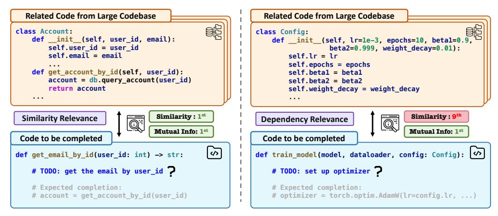
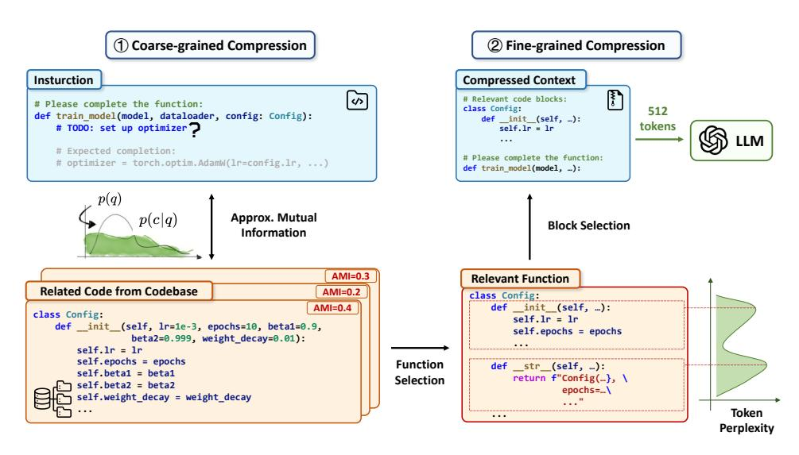

# I. INTRODUCTION

LLMs specialized for code have revolutionized software development by demonstrating remarkable capabilities in code completion [\[1\]](#page-11-0), [\[2\]](#page-11-1), translation [\[3\]](#page-11-2), [\[4\]](#page-11-3), program synthesis [\[5\]](#page-11-4), [\[6\]](#page-11-5), [\[7\]](#page-11-6) and program repair [\[8\]](#page-11-7), [\[9\]](#page-11-8). Models like DeepSeek-Coder [\[10\]](#page-11-9), Qwen2.5-Coder [\[11\]](#page-11-10), Seed-Coder [\[12\]](#page-11-11) can reason over diverse programming languages and significantly enhance productivity. As code LLMs are increasingly deployed for real-world tasks like repository-level question answering [\[13\]](#page-11-12) and long-context code completion [\[1\]](#page-11-0), there is a growing demand for handling contexts that span tens of thousands of tokens. This need has motivated efforts to extend LLM context windows [\[14\]](#page-11-13), [\[11\]](#page-11-10), [\[15\]](#page-11-14). However, effective handling of long code contexts remains a central bottleneck. Three major challenges arise in such long code context scenarios. First, as the input context grows, the quadratic complexity of the transformer attention mechanism [\[16\]](#page-11-15) leads to decreased generation efficiency. At the same time, processing longer inputs with LLMs results in rapidly increasing API costs, especially when pricing models are expensive [\[17\]](#page-11-16), [\[18\]](#page-11-17). Second, LLMs struggle to identify and utilize relevant content amid lengthy inputs [\[19\]](#page-11-18), [\[20\]](#page-11-19). Third, even though recent LLMs support extended context windows to 128k tokens, these limits can still be reached when processing large files and long conversation histories, leading to context truncation and degraded outputs [\[21\]](#page-11-20).

These issues are particularly pronounced in code LLMs. Unlike natural language text, source code is highly structured with complex dependencies spanning across functions, classes, and files. Dependencies between variable declarations, function definitions, and their uses often extend beyond what current context windows can accommodate. As a result, LLMs frequently produce code that fails to compile, violates existing patterns, or ignores critical constraints when the relevant context exceeds their window size [\[22\]](#page-11-21). Consequently, context compression has emerged as a key demand for enabling longcontext code understanding.

Existing approaches to address long context limitations have notable shortcomings when applied to code. General text compression methods like LLMLingua [\[23\]](#page-11-22) and Selective Context [\[24\]](#page-11-23) fail to account for code-specific characteristics and often break code structure. Retrieval-augmented generation (RAG) [\[25\]](#page-11-24) reduce context length by selecting relevant code snippets from the repository context, but it merely rely on text similarities, and may overlook implicit dependencies within the context. Traditional code compressors such as DietCode [\[26\]](#page-11-25) and SlimCode [\[27\]](#page-11-26) improve syntax and structure awareness but are generally limited to function-level pruning or short code examples, leaving compression of long context for code largely unaddressed.

To overcome these limitations, we introduce LongCodeZip, a training-free, model-agnostic, and plug-and-play context compression framework for code LLMs. Our approach leverages the inherent structure of code through a novel twostage compression strategy that preserves code semantics while significantly reducing token consumption. First, we perform coarse-grained compression by identifying and ranking function-level chunks based on their relevance to the instruction. Then, within the selected functions, it applies perplexitybased block detection followed by fine-grained block-level

1Our code and data are available at [https://github.com/YerbaPage/](https://github.com/YerbaPage/LongCodeZip) [LongCodeZip](https://github.com/YerbaPage/LongCodeZip)

\* Xiaodong Gu is the corresponding author

> **[图片提取文字 (无描述)]:**
> Related Code from Large Codebase Related Code from Large Codebase class Account: class Config: def \_\_init\_\_(self, user\_id, email): def init (self, lr=1e-3, epochs=10, betal=0.9, self.user\_id = user\_id beta2=0.999, weight decay=0.01): self.email = email self.lr = lr self.epochs = epochs def get account by id(self, user id): self.betal = betal account = db.query account(user id) self.beta2 = beta2 return account self.weight decay = weight decay . . . Similarity: 9th Similarity: 1st Similarity Relevance Dependency Relevance Mutual Info: 1st Mutual Info: 1st Code to be completed Code to be completed 3 def get email by id(user id: int) -> str: def train model(model, dataloader, config: Config): # TODO: get the email by user\_id ? # TODO: set up optimizer ? # Expected completion: # Expected completion: # account = get account by id(user id) # optimizer = torch.optim.AdamW(lr=config.lr, ...)

Fig. 1: Challenge for RAG, a similarly-based context compression method.

compression to maximize relevance under an adaptive token budget. To the best of our knowledge, LongCodeZip is the first framework specifically designed for long-context code compression and to introduce perplexity-based block detection, providing an efficient and general-purpose solution that preserves task-critical content within strict token limitations.

We evaluate LongCodeZip across multiple code benchmarks with long contexts, including Long Code Completion [1], Long Module Summarization [21], and RepoQA [13]. Results demonstrate that our approach achieves up to a 5.6× compression ratio without sacrificing performance, generalizes well across tasks and models (even with only 0.5B model as the compressor), and significantly reduces generation time and token costs.

Our main contributions include:

- A novel long-context, code-specific hierarchical compression approach that performs function-level chunking and selection, followed by perplexity-based block detection and block-level pruning.
- 2) An adaptive budget allocation and 0/1 knapsack selection mechanism that prioritizes relevant blocks and maximizes critical detail within the token budget.
- 3) A comprehensive evaluation demonstrating that Long-CodeZip outperforms baselines on code completion, summarization, and question answering tasks, achieving up to a 5.6× compression ratio without sacrificing performance.

#### II. MOTIVATION

Code generation under long context is becoming increasingly important in LLM-based software development. Such tasks often require referencing numerous related files across an entire project repository, resulting in input contexts that span tens of thousands of tokens. However, these long contexts typically contain scattered and redundant information, which can distract the model and degrade output quality. Moreover, the substantial computational cost of processing such large inputs further exacerbates latency and resource constraints, creating a significant bottleneck for practical deployment.

Retrieval-augmented generation (RAG) [28], [29] provides an efficient way to condense overly lengthy contexts. RAG retrieves and appends relevant code snippets to the prompt, leveraging embedding models such as UniXcoder [30] or CodeBERT [31], and similarity measures such as cosine similarity. While RAG effectively reduces context length, it primarily relies on surface-level lexical similarity between snippets. Consequently, it often fails to capture code segments with deeper semantic or functional dependencies—particularly when such relationships are implicit, abstracted, or span multiple components.

Consider the examples in Figure 1. In the first scenario, the task is to complete an get\_email\_by\_id function. Retrieving Account class and the get\_account\_by\_id function proves effective, as they share similar function and parameter names. In this case, RAG works well due to strong lexical and structural overlap. In the second scenario, however, the task is to implement a train\_model function that relies on configuration values defined in a separate Config class. Here, crucial context like Config is often missed, since RAG may not identify these implicit or non-lexical dependencies. This omission can lead to incomplete or incorrect code generation.

This example highlights the need for context selection criteria that extend beyond surface-level similarity. In both scenarios, an effective similarity measure should assign high relevance to <code>get\_account\_by\_id</code> in the first case and, critically, to <code>Config</code> in the second—even when there is minimal lexical overlap between the configuration class and the training function.

#### III. METHODOLOGY

#### A. Problem Formulation

Given a long code context  $c = \{c_1, \ldots, c_n\}$  with n tokens and a task instruction  $q = \{q_1, \ldots, q_m\}$ , the goal of context compression is to produce a compressed context  $c' \subseteq c$  such that  $|c'| \leq B$ , where B is the computational budget in tokens. The objective is to maximize task performance while satisfying the budget constraint. For instance, in the code completion task, the instruction could be: "Complete the following function [code to be completed]". The long context could consist of the unfinished code along with retrieved code snippets.

> **[图片提取文字 (无描述)]:**
> 1 Coarse-grained Compression 2 Fine-grained Compression Insturction Compressed Context \$ # Relevant code blocks: # Please complete the function: class Config: 512 def train\_model(model, dataloader, config: Config): def init (self, ..): tokens # TODO: set up optimizer self.lr = lr # Expected completion: # Please complete the function: # optimizer = torch.optim.AdamW(lr=config.lr, ...) def train model(model, ...): p(q)Approx. Mutual p(c|q)**Block Selection** Information AMI=0.3 Relevant Function Related Code from Codebase AMI=0.2 class Config: def \_\_init\_\_(self, ...): AMI=0.4 class Config: self.lr = lr def init (self, lr=1e-3, epochs=10, beta1=0.9, self.epochs = epochs beta2=0.999, weight decay=0.01): self.lr = lr self.epochs = epochs Function def \_\_str\_\_(self, ...): self.beta1 = beta1 return f"Config(...}, \ Selection self.beta2 = beta2 epochs=...\ self.weight decay = weight decay Token Perplexity

Fig. 2: Overview of the LongCodeZip framework.

Rather than relying solely on embedding similarity between q and c, we propose to select context snippets based on their mutual information, specifically, how much they reduce the perplexity (PPL) of generating q. Specifically, for each candidate context c, we define the approximated mutual information AMI(c,q) as the reduction in perplexity when c is provided:

$$AMI(c,q) = PPL(q) - PPL(q \mid c)$$
 (1)

where  $PPL(q \mid c)$  is the conditional perplexity of q given c, lower values indicate higher likelihood of q [23]:

$$PPL(q|c) = \exp\left(-\frac{1}{N}\sum_{i=1}^{N}\log P(q_i|q_{< i}, c)\right)$$
 (2)

Similarly,  $\mathrm{PPL}(q)$  denotes the perplexity of q without the context:

$$PPL(q) = \exp\left(-\frac{1}{N}\sum_{i=1}^{N}\log P(q_i|q_{< i})\right)$$
(3)

Here, P denotes the model's next-token prediction probability, and  $q_{< i}$  is the sequence of preceding tokens before  $q_i$ . A higher AMI score indicates that c enables the model to better predict q, capturing both surface-level and dependency-based relevance. We therefore compress long contexts by retaining code snippets with the highest mutual information, ensuring that the most essential information for code generation is preserved.

#### B. Overview

The overview of LongCodeZip is illustrated in Figure 2. Given input of long source code, a task instruction, and a token budget, LongCodeZip follows a *coarse-to-fine* compression pipeline. In the coarse-grained compression stage (Section III-C), the source code is divided into function-level chunks, which are ranked by their relevance to the instruction using conditional perplexity. The top N functions are then selected under a coarse budget, effectively filtering out irrelevant code and avoiding unnecessary computation. In the fine-grained

compression stage (Section III-D), each retained function is further segmented into semantic blocks via perplexity-based chunking. An adaptive retention ratio is assigned to each function according to its estimated importance. Within each function, the most relevant blocks are selected by formulating the problem as a 0/1 knapsack optimization, ensuring that the retained content maximizes relevance while fitting within the allocated token budget.

By combining coarse-grained filtering with fine-grained pruning, LongCodeZip achieves a balance between aggressive compression and semantic preservation, thereby improving both efficiency and task performance.

