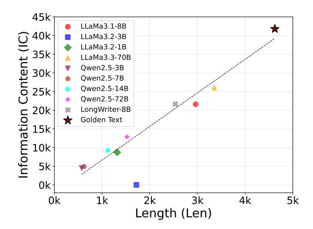
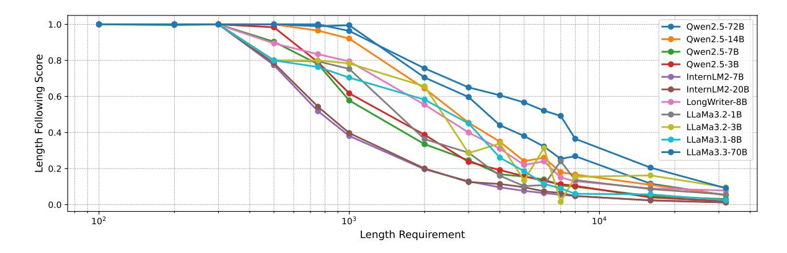

# LongEval: A Comprehensive Analysis of Long-Text Generation Through a Plan-based Paradigm

Siwei Wu1\* Yizhi Li1\* Xingwei Qu1 Rishi Ravikumar1 Yucheng Li2

Tyler Loakman3 Shanghaoran Quan4 Xiaoyong Wei5 Riza Batista-Navarro1 Chenghua Lin1†

1University of Manchester 2University of Surrey 3University of Sheffield

4Peking University 5Hong Kong Polytechnic University

{siwei.wu-2,chenghua.lin}@manchester.ac.uk

#### **Abstract**

Large Language Models (LLMs) have achieved remarkable success in various natural language processing tasks, yet their ability to generate long-form content remains poorly understood and evaluated. Our analysis reveals that current LLMs struggle with length requirements and information density in long-text generation, with performance deteriorating as text length increases. To quantitively locate such a performance degradation and provide further insights on model development, we present LongEval, a benchmark that evaluates longtext generation through both direct and planbased generation paradigms, inspired by cognitive and linguistic writing models. The comprehensive experiments in this work reveal interesting findings such as that while model size correlates with generation ability, the smallscale model (e.g., LongWriter), well-trained on long texts, has comparable performance. All code and datasets are released in https: //github.com/Wusiwei0410/LongEval.

#### 1 Introduction

Large Language Models (LLMs) have revolutionized Natural Language Processing (NLP), achieving remarkable performance across a wide range of generation tasks including dialogue generation (Abdullin et al., 2024), story creation (Zhao et al., 2023), open-ended text generation (Zhou et al., 2024), and complex reasoning task (Zhang et al., 2023; Wu et al., 2024). Although LLMs have been increasingly deployed in real-world applications, their ability to handle long-document generation remains underexplored despite their significance.

While there are recent studies seeking to improve the long-text generation ability (Bai et al., 2024; Que et al., 2024) and long context understanding capability (Xu et al., 2023; Li et al., 2023a, 2024a;

> **[图片提取文字 (无描述)]:**
> 45k LLaMa3.1-8B 40k LLaMa3.2-3B Information Content (IC) 35k-30k-30k-30k-30k-30k-30k-30k-30k-30k-30 LLaMa3.2-1B LLaMa3.3-70B Qwen2.5-3B Owen2.5-7B Qwen2.5-14B Qwen2.5-72B \* LongWriter-8B Golden Text 0k 1k 2k 3k 4k 0k 5k Length (Len)

Figure 1: The information content of LLMs-generated text and the golden human-authored text. We calculate information entropy using the frequency of each word in a document and determine the information content by multiplying the total word count by information entropy.

Ding et al., 2024; Zhang et al., 2024d), the evaluation of long-text generation has been largely overlooked. Most existing benchmarks focus solely on long-context retrieval and understanding tasks (Bai et al., 2024; Zhang et al., 2024b; Pham et al., 2024a; Quan et al., 2024; Tang et al., 2024; An et al., 2024). A recent parallel work HelloBench (Que et al., 2024) proposes to evaluate the long-text generation by selecting samples from existing tasks (e.g., open-ended QA), where the tasks do not inherently require long generation capability.

To comprehensively explore the long-generation capability of LLMs, we started with collecting a set of long and informative documents and using selected prevalent LLMs to directly reproduce the full documents from given summaries of those long documents. As shown in Figure 1, the information content in the documents is positively related to the length, which suggests the necessity of long text generation ability. Furthermore, it could be observed that the prevalent LLMs (with parameters from 1B to 70B) still remain a large gap to

\*Equal Contribution.

&lt;sup>†Corresponding Author.

> **[图片提取文字 (无描述)]:**
> --- Qwen2.5-72B Qwen2.5-14B → Qwen2.5-7B Following Score 9.0 → Qwen2.5-3B - InternLM2-7B ── InternLM2-20B - LongWriter-8B -- LLaMa3.2-1B LLaMa3.2-3B Length | LLaMa3.1-8B LLaMa3.3-70B 102  $10^{3}$ Length Requirement

Figure 2: Th relation of the length requirement with the model-generated text length. Given the content plans, we require the LLMs to generate the text under various length requirements ranging from 100 to 32k. Specifically, we use the ratio of the generated text length to the requested length in the input as a score to evaluate the model's ability to follow length instructions.

the golden references regarding both information content and length dimensions. We then tried to explore whether the LLMs could produce such long and informative documents by simply requiring to generate in specified lengths but failed. LLMs tend to exhibit declining length-following abilities as the required length increases, with significant deterioration observed for texts exceeding 1k words, as revealed in Figure 2.

Inspired by the cognitive writing theory, which posits that effective writing emerges from the process of "cooking knowledge stored in long-term memory" through planning, translating, and reviewing (Flower and Hayes, 1981), we suspect that current generation paradigm of LLMs may be misaligned with human writing practices for long documents: LLMs often struggle to maintain consistency and provide deep insights in one-shot long-form writing, compared to plan-based writing. Specifically, the planning phase serves as a crucial foundation for developing coherent arguments and structured thoughts (Scardamalia and Bereiter, 1987), yet existing studies largely overlook this aspect of text generation.

To address these limitations, we introduce **LongEval**, a comprehensive benchmark designed to evaluate LLMs' long-text generation capabilities by supporting both direct and plan-based approaches. Our framework incorporates two key innovations: *i*) a dual evaluation paradigm that assesses both zero-shot direct and plan-based structured generation that more closely align with human writing practices; *ii*) reliable automatic evaluation metrics that focus on content quality, structural coherence, and information density across various

long text generation domains.

Since scientific texts and popular science articles often follow a prescribed writing structure, we select **three** long-text generation domains (i.e., arXiv papers, blogs, and Wikipedia articles) that necessitate that LLMs generate long-form texts (exceeding 2K words) to build the benchmark for supporting a robust evaluation. Different from similar work, HelloBench (Que et al., 2024) (300 samples from general tasks) and LongWriter (Bai et al., 2024) (120 synthetic samples for evaluation), we collect 166 high-quality human-authored samples that come from the long text generation domain. We design a data production pipeline that leverages an advanced open-source LLM Qwen2.5-72B-Instruct1 to process documents from permissibly licensed sources across these different domains. In each document, sections are first summarized into comprehensive content as plans, with each major point elaborated in 4-5 sentences and verified by human annotators.

During the plan-based evaluation, the models are required to generate the full-text section-by-section using the summarized content plans as guidance, whilst required to maintain semantic consistency from previously generated sections. This approach systematically evaluates LLMs' long-text generation capabilities while aligning with the direct generation paradigm for sections. Additionally, we design eight metrics to evaluate the generated long texts on different dimensions of quality. *i*) To determine whether the LLM can follow instructions and whether the generated content is reasonable, we

1https://huggingface.co/Qwen/Qwen2.
5-72B-Instruct

design the following domain-agnostic metrics at the Document level: Content-following (Cont-fol), Redundancy (Red), Length (Len), and Consistency (Con). *ii)* We design domain-specific metrics for the prescriptive domain of arXiv research papers that evaluate the following sections: Introduction (Intro), Related Work (RW), Method (ME), and Experimental Analysis (EA).

## 2 Related Work

Long Text Generation Recent research on long text generation has primarily focused on enhancing model performance [\(Pham et al.,](#page-9-5) [2024a;](#page-9-5) [Zhang](#page-9-4) [et al.,](#page-9-4) [2024b;](#page-9-4) [Bai et al.,](#page-8-1) [2024;](#page-8-1) [Quan et al.,](#page-9-6) [2024;](#page-9-6) [Tang et al.,](#page-9-7) [2024;](#page-9-7) [Quan,](#page-9-9) [2024\)](#page-9-9). A common approach involves constructing large-scale instruction-following datasets tailored for longtext generation and employing various optimization strategies to improve the capabilities of LLMs. Beyond direct model training, plan-based methods have gained traction for long-text generation. LongWriter [\(Bai et al.,](#page-8-1) [2024\)](#page-8-1) demonstrates that synthetic datasets, generated using a structured planning approach with GPT-4o, can effectively enhance LLMs' ability to produce extended text. Similarly, [Wang et al.](#page-9-10) [\(2024\)](#page-9-10) propose a framework for generating survey papers section by section, while [Lu et al.](#page-9-11) [\(2024\)](#page-9-11) employ a similar strategy to generate entire scientific articles. These studies suggest that structured generation methods can improve coherence and control over long-text outputs.

Long Context Understanding A key challenge in long-text generation is ensuring that LLMs effectively comprehend and utilize long contexts. Research in this area has focused on enhancing models' long-context understanding while extending their input length, leveraging their strong in-context learning capabilities [\(Chen et al.,](#page-8-7) [2023;](#page-8-7) [Jiang et al.,](#page-8-8) [2023;](#page-8-8) [Li et al.,](#page-9-12) [2023b;](#page-9-12) [Jin et al.,](#page-8-9) [2024;](#page-8-9) [Zhang et al.,](#page-9-13) [2024a;](#page-9-13) [Ding et al.,](#page-8-4) [2024\)](#page-8-4). These efforts primarily target tasks such as reading comprehension, where models extract relevant information from lengthy inputs, as exemplified by benchmarks like Long-ICLBench [\(Li et al.,](#page-8-3) [2024a\)](#page-8-3), ∞BENCH [\(Zhang](#page-10-2) [et al.,](#page-10-2) [2024d\)](#page-10-2), and LonGLE [\(Li et al.,](#page-8-2) [2023a\)](#page-8-2). Despite these advancements, prior work has largely overlooked the challenge of generating coherent and contextually consistent long-form text beyond mere retrieval or summarization.

Long Text Evaluation Evaluating long-form text remains an open challenge. HelloBench [\(Que et al.,](#page-9-2) [2024\)](#page-9-2) attempts to address this by selecting longtext samples of general tasks and evaluating LLMs through using direct generation method. Most existing evaluation frameworks rely on LLM-based scoring, but their robustness and reliability remain debated. As an alternative, [Zhang et al.](#page-9-14) [\(2024c\)](#page-9-14) propose a reward model specifically designed for long-text evaluation.

Additionally, several datasets have been developed to support long-text evaluation. Suri [\(Pham](#page-9-15) [et al.,](#page-9-15) [2024b\)](#page-9-15) employs a plan-based approach and backtranslation [\(Li et al.,](#page-9-16) [2024b;](#page-9-16) [Köksal et al.,](#page-8-10) [2024\)](#page-8-10) to generate instructional texts, though its focus is primarily on creative writing and blogs rather than academic content. In contrast, [Köksal](#page-8-10) [et al.](#page-8-10) [\(2024\)](#page-8-10) construct a long-text dataset based on Wikipedia and CommonCrawl, prioritizing direct text generation over structured planning. These studies highlight the need for high-quality datasets and evaluation metrics that account for both planbased and direct-generation methods, particularly in domains requiring structured and coherent longform outputs.

## 3 The LongEval Benchmark

To fill the gap in the evaluation of long document generation, we propose LongEval, a benchmark built upon a unified framework for long-text generation, and introduce a comprehensive evaluation system. Compared with similar studies, LongEval provides a robust evaluation system distinct across the dimension of data collection, generation paradigms, domain-specific and hierarchical metrics, as shown in [Table 1.](#page-3-0) In this section, we first introduce a unified perspective of long text generation paradigms and then describe the accordingly designed evaluation systems.

#### 3.1 Long Text Generation Paradigms

The cognitive writing theory underscores the significance of planning in human writing [\(Flower](#page-8-6) [and Hayes,](#page-8-6) [1981\)](#page-8-6), and the plan-based paradigm has been effectively used to generate synthetic long-text data for training LLMs [\(Bai et al.,](#page-8-1) [2024\)](#page-8-1). Therefore, generating ultra-long texts segment by segment is the mainstream paradigm [\(Wang et al.,](#page-9-10) [2024;](#page-9-10) [Bai et al.,](#page-8-1) [2024\)](#page-8-1). In this regard, this paper uses two methods (i.e., direct generation and planbased generation) for long-text generation.

> **[图片提取文字 (无描述)]:**
> (a) Plan-based Long Text Generation (b) Long Text Evaluation **Document Level** concat Generated Headline i Required Generated Criterion Whole Text . Len Len **LLMs** Section i Context Cont-fol Red Con Len Score Generated Length l Experiment Text Results Section Level J==T (Related Work **EA Score** Or Wikipedia) **RW Score** LLMs Golden I Generated LLMs Intro Score Headline i Text Section **ME Score** References **Determining Expert Analysis**

Figure 3: The Framework of our Long Text Generation method. Part (a) is the Plan-based method and part (b) is the Long Text Evaluation method.

| Benchmarks      |           |            | Characteristics |                          |
|-----------------|-----------|------------|-----------------|--------------------------|
|                 | Real Data | Plan Based | Domain Specific | Section & Document Level |
| LongReward      | Х         | Х          | Х               | ×                        |
| LongWriter      | X         | ✓          | X               | ×                        |
| HelloBench      | ✓         | X          | ✓               | ×                        |
| LongEval (Ours) | ✓         | ✓          | ✓               | ✓                        |

Table 1: Comparison of different long-text generation benchmarks.

**Direct Generation** Although the direct generation method is applied to most NLP tasks, as shown in Figure 2, most LLMs cannot directly generate text that exceeds 1k words. In this work, we also evaluate the end-to-end long text generation capability of LLMs. Specifically, we additionally perform direct generation by inputting the section content plan p, the article's length l, and other possible writing materials (e.g., experimental results exp, references ref) into LLMs.

**Plan-Based Generation** The plan-based methods are applied to generate long-length text due to its better performance than the direct method (Bai et al., 2024; Lu et al., 2024). Our experiments also analyze the length-following abilities of LLMs. To better understand the models' limitations, we conduct an in-depth investigation of LLM-generated content across different domains. Figure 1 illustrates our quantitative analysis of the relationship between text length and information content, using human-written texts as a baseline. Therefore, as suggested by Figure 2, we assume that current LLMs cannot meet the requirements of users who want to generate text with a large amount of information. We design a unified plan-based generation method that uses the LLM to generate long text by section which ensures LLMs can generate text

aligned with the length requirement.

As for each sample, we input the content plan p of a section and the length requirement l to make LLMs generate the whole article by section. We additionally consider domain-specific writing requirements (e.g., for the arXiv paper domain, we use the experimental results as extra input to generate the results analysis section and for Wikipedia articles, we input the references to ensure the authenticity of the content). A detailed description of our plan-based generation method can be found in Appendix B.

#### 3.2 Evaluation System and Prompts

Previous works have primarily focused on studying the long-context understanding ability of LLMs (Xu et al., 2023; Li et al., 2024a; Jin et al., 2024; Zhang et al., 2024d). Most of these tasks resemble reading comprehension tasks and have standard answers (e.g., asking questions like 'How old is Jack?' based on a long context). Although HelloBench (Que et al., 2024) has also evaluated the long-text generation ability of LLMs, their evaluation metrics do not take into account the characteristics of ultra-long text generation (such as the instruction-following ability in ultra-long text generation). In this work, we evaluate the generation of long articles both at the **Document level** and the

Section level.

## 3.2.1 Domain-Agnostic Document-level Metrics

Content-following (Cont-fol) Score. The input for generating long texts includes the writing outline (i.e., the content plan generated in [§4.2\)](#page-5-0) of the entire article. Whether the model-generated text adheres to the requirements of the outline is a key factor in evaluating the quality of the generated text. Therefore, as shown in [Figure 4](#page-13-0) in Appendix [A,](#page-11-1) we designed specialized prompts and input each section of the model-generated text along with the corresponding prompts to evaluate the model's ability to follow instructions for long-text generation.

Length-following (Len) Score For each section, we use the following method to calculate the length score:

$$s = \begin{cases} \frac{l_{\text{gen}}}{l_{\text{req}}}, & \text{if } l_{\text{gen}} < l_{\text{req}}, \\ 1, & \text{otherwise.} \end{cases}$$

where lgen represents length of generated text, and lreq represents length requirement in the prompt. For section-level metrics, the final score is obtained by averaging the scores of all individual sections.

Redundancy (Red) Score. When generating long texts, LLMs tend to treat each section as being independent, leading to potential redundancy across sections by repeating content. To address this, as shown in [Figure 4,](#page-13-0) we specifically designed a prompt to evaluate whether the content generated by the model contains redundant elements.

Consistency (Con) Score. For long-text writing, ensuring the connection between sections and paragraphs is crucial. Therefore, for model-generated text, as shown in [Figure 4](#page-13-0) in Appendix [A,](#page-11-1) we designed a prompt to evaluate its consistency.

#### 3.2.2 Domain-Specific Section-Level Metrics

Due to some domains being more prescriptive in their format than others, we designed a range of evaluation criteria for the arXiv research paper and Wikipedia article domains that consider the expected structures of these more prescriptive formats.

Introduction (Intro) & Related Work (RW) Scores. Since we provide a detailed writing outline and relevant references, we design a prompt to evaluate the Introduction and Related Work sections of arXiv papers, as shown in [Figure 4](#page-13-0) in Ap-

pendix [A.](#page-11-1) Using the original paper as the gold reference, we employed an LLM to assess the similarity between the generated text and the gold answer. The blog writing format does not require the inclusion of references. While only papers contain specific related work sections, Wikipedia articles require extensive references throughout to ensure the authenticity of their content. Therefore, we treat the entire content of a Wikipedia article as a single related work section for evaluation.

Experiment Analysis (EA) Score. In the research paper domain, based on our observation, current LLMs struggle to determine which sections require the use of experimental results (e.g., they would use the results of the experiment in method). Furthermore, LLMs tend to merely reiterate the key points outlined without delving into the underlying reasons or connecting the causes behind different experimental results. Therefore, as shown in [Figure 4](#page-13-0) in Appendix [A,](#page-11-1) we design an evaluation prompt to compare the experimental analysis sections of the original article with those generated by the model.

Method (ME) Score. For method descriptions, the content generated by LLMs often consists of vague descriptions of methods without providing detailed design plans or formulaic explanations. To address this, as shown in [Figure 4](#page-13-0) in Appendix [A,](#page-11-1) we specifically designed a prompt to compare the method section of the original article with that generated by the model.

## 4 Dataset Curation

In previous studies [\(Que et al.,](#page-9-2) [2024\)](#page-9-2), one way to build the dataset for long-text generation evaluation is to filter long texts[2](#page-4-0) from existing tasks such as dialogue continuation. Some of these tasks typically do not require long-text writing, making it difficult to fully assess the model's long-text generation capabilities in realistic scenarios. Long-form content is prevalent across various domains, particularly in academic papers, blogs, and Wikipedia articles. Therefore, we construct a benchmark for long-text generation using data from these three domains to evaluate generation capabilities on naturally lengthy content.

2The HelloBench study uses texts that are at least 1000 words long.

|           | GT_len   | Input_len | ICR   | Num |
|-----------|----------|-----------|-------|-----|
| arXiv     | 4,754.28 | 1,038.46  | 21.84 | 50  |
| Wikipedia | 3,323.54 | 844.09    | 25.40 | 68  |
| Blog      | 2,623.10 | 766.19    | 29.21 | 48  |

Table 2: Data comparison across arXiv, Wikipedia, and blogs. IC presents Information Compression Ration.

#### 4.1 Data Collection Pipeline

We design an automatic pipeline that collects documents from web pages without copyright restrictions and splits them into different sections according to predefined rules. We collect data from arxiv.org for papers, wikipedia.org for articles, and HuggingFace for blogs. These sources have permissible copyright licenses. To ensure the quality of our benchmark, we hired one Postgrad student, who is familiar with the NLP, to manually check the processed data. Specifically, we delete the samples that do not follow a predefined format (e.g., a paper that does not have an abstract or a blog that misses an introduction).

## 4.2 Content Plan Generation

In order to support the plan-based long textgeneration method introduced in [§3.1,](#page-3-1) we use Qwen2.5-72B-Instruct to generate a content plan. Specifically, we pass each section of a document into the model and design a prompt to make the model summarize each section into 4-5 sentences. This forms the content plan for the section.

