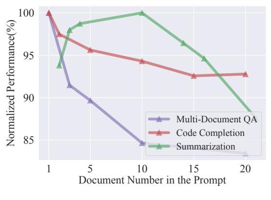
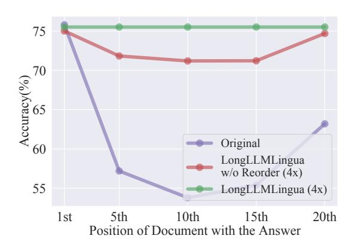

## *LongLLMLingua*: Accelerating and Enhancing LLMs in Long Context Scenarios via Prompt Compression

## Huiqiang Jiang, Qianhui Wu, Xufang Luo, Dongsheng Li, Chin-Yew Lin, Yuqing Yang, Lili Qiu

Microsoft Corporation {hjiang,qianhuiwu,xufluo,dongsli,cyl,yuqyang,liliqiu}@microsoft.com

## Abstract

In long context scenarios, large language models (LLMs) face three main challenges: higher computational cost, performance reduction, and position bias. Research indicates that LLM performance hinges on the density and position of key information in the input prompt. Inspired by these findings, we propose LongLLM-Lingua for prompt compression towards improving LLMs' perception of the key information to simultaneously address the three challenges. Our extensive evaluation across various long context scenarios demonstrates that LongLLMLingua not only enhances performance but also significantly reduces costs and latency. For instance, in the NaturalQuestions benchmark, LongLLMLingua boosts performance by up to 21.4% with around 4x fewer tokens in GPT-3.5-Turbo, leading to substantial cost savings. It achieves a 94.0% cost reduction in the LooGLE benchmark. Moreover, when compressing prompts of about 10k tokens at ratios of 2x-6x, LongLLMLingua can accelerate end-to-end latency by 1.4x-2.6x.[1](#page-0-0)

## 1 Introduction

Large language models (LLMs) have revolutionized user-oriented language technologies and are serving as crucial components in more and more applications. Carefully designing prompts is necessary to achieve better performance in specific downstream tasks. The commonly used technologies such as In-Context Learning (ICL) [\(Min et al.,](#page-10-0) [2022;](#page-10-0) [Dong et al.,](#page-9-0) [2023\)](#page-9-0), Retrieval Augment Generation (RAG) [\(Lewis et al.,](#page-9-1) [2020;](#page-9-1) [Asai et al.,](#page-8-0) [2024\)](#page-8-0), and Multi-turn Agent [\(Shen et al.,](#page-10-1) [2024;](#page-10-1) [Park et al.,](#page-10-2) [2023;](#page-10-2) [Wu et al.,](#page-10-3) [2023a\)](#page-10-3) are driving prompts to be increasingly longer, even reaching thousands of tokens. Scenarios such as multi-document question answering, code completion, and document summarization also necessitate the processing of long contexts.

There are three main challenges when LLMs are used in long context scenarios: (1) Higher computational costs, encompassing both financial and latency expenses. (2) Longer prompts introduce irrelevant and redundant information, which can weaken LLMs' performance [\(Shi et al.,](#page-10-4) [2023\)](#page-10-4), as illustrated in Figure [1a.](#page-1-0) (3) LLMs exhibit position bias [\(Kamradt,](#page-9-2) [2023\)](#page-9-2), also known as the "lost in the middle" issue [\(Liu et al.,](#page-10-5) [2024\)](#page-10-5), suggesting that the placement of key information within the prompt significantly affects LLMs' performance. This is demonstrated by the purple curve in Figure [1b.](#page-1-1)

Inspired by these observations, we propose *LongLLMLingua* to address the three challenges. Specifically, we use LLMLingua [\(Jiang et al.,](#page-9-3) [2023a\)](#page-9-3) as the backbone for prompt compression to address the first challenge, *i.e.*, reduce cost and latency. However, in the case of long contexts, the distribution of question-relevant key information in the prompt is generally dynamic and sparse. Existing prompt compression methods like LLMLingua [\(Jiang et al.,](#page-9-3) [2023a\)](#page-9-3) and Selective-Context [\(Li](#page-9-4) [et al.,](#page-9-4) [2023c\)](#page-9-4) that often fail to consider question during compression, resulting in retention of excessive noise and decreased performance. LongLLM-Lingua aims to improve LLMs' perception of key information pertinent to the question, thereby overcoming the noise and position bias issues in long contexts, shown in Figure [1b.](#page-1-1) The underlying principle of LongLLMLingua is that small LM are inherently capable of capturing the distribution of key information relevant to a given question.

Our main contributions are five-fold: (1) We propose a question-aware coarse-to-fine compression method to improve the key information density in the prompt (Sec. [4.1\)](#page-2-0); (2) We introduce a document reordering strategy to minimize position bias in LLMs. (Sec. [4.2\)](#page-3-0); (3) We establish dynamic compression ratios for precise control between coarse and fine compression levels (Sec. [4.3\)](#page-3-1); (4) We propose a post-compression

1Access our code at <https://aka.ms/LongLLMLingua>.

> **[图片提取文字 (无描述)]:**
> 100 Normalized Performance(%) 95 90 Multi-Document QA Code Completion 85 Summarization 20 10 Document Number in the Prompt

> **[图片提取文字 (无描述)]:**
> 75 Accuracy(%) Original LongLLMLingua w/o Reorder (4x) 55 LongLLMLingua (4x) 1st 5th 10th 15th 20th Position of Document with the Answer

(a) Performance v.s. Document Number

(b) Performance v.s. Key Information Position

Figure 1: (a) LLMs' performance in downstream tasks decreases with increased noise in prompts. In this case, we keep k most relevant documents/paragraphs based on the ground-truth or LongLLMLingua  $r_k$ . A larger k implies more noise introduced into the prompt. To improve the key information density in the prompt, we present question-aware coarse-to-fine compression. (b) LLMs' ability to capture the relevant information depends on their positions in the prompt. To reduce information loss in the middle, we introduce a document reordering mechanism.

subsequence recovery strategy to improve the integrity of the key information (4.4). (5) We evaluate LongLLMLingua across five benchmarks, *i.e.*, NaturalQuestions (Liu et al., 2024), LongBench (Bai et al., 2023), ZeroSCROLLS (Shaham et al., 2023), MuSicQue (Trivedi et al., 2022), and LooGLE (Li et al., 2023b), covering a variety of long context scenarios. Experimental results reveal that LongLLMLingua's compressed prompts outperform original prompts in terms of performance, cost efficiency, and system latency.

#### 2 Problem Formulation

Following LLMLingua (Jiang et al., 2023a), we use  $\mathbf{x} = (\mathbf{x}^{\text{ins}}, \mathbf{x}_1^{\text{doc}}, \cdots, \mathbf{x}_K^{\text{doc}}, \mathbf{x}^{\text{que}})$  to represent a prompt, including the instruction  $\mathbf{x}^{\text{ins}}$ , K documents  $\mathbf{x}_i^{\text{doc}}$ , and the question  $\mathbf{x}^{\text{que}}$ . However, this definition can be adjusted for specific scenarios. The objective of a prompt compression system can be formulated as:

$$\min_{\widetilde{\mathbf{x}}} D_{\phi}(\mathbf{y}, \widetilde{\mathbf{y}}) + \lambda \|\widetilde{\mathbf{x}}\|_{0}, \tag{1}$$

where  $\widetilde{\mathbf{x}}$  represents the compressed prompt, a token-level subsequence of  $\mathbf{x}$ .  $\mathbf{y}$  and  $\widetilde{\mathbf{y}}$  represent the LLM-generated results from  $\mathbf{x}$  and  $\widetilde{\mathbf{x}}$ , respectively.  $D_{\phi}$  measures the distance function, such as KL divergence.  $\lambda$  serves as a hyper-parameter balancing the compression ratio. Additionally, this study explores a permutation operation space over the K documents  $(\mathbf{x}_1^{\mathrm{doc}}, \cdots, \mathbf{x}_K^{\mathrm{doc}})$  for joint optimization.

## 3 Preliminary: LLMLingua

LLMLingua (Jiang et al., 2023a) utilizes a small language model  $\mathcal{M}_S$  to evaluate the perplexity of each prompt token, removing those with lower perplexities. This method is premised on the idea that tokens with lower perplexities have a negligible effect on the language model's overall entropy gain, implying their removal slightly impacts the LLMs' contextual understanding. This process is viewed as an application of "LM is Compression" (Delétang et al., 2023). LLMLingua include three key components: budget controller, iterative token-level prompt compression, and distribution alignment, highlighted by italic text in Figure 2. The budget controller assigns varying compression ratios to different parts of the prompt (i.e., instruction, demonstrations, question), implementing coarse-level prompt compression. Subsequent steps involve dividing intermediate results into segments and applying token-level compression iteratively, where each token's perplexity based on preceding compressed segments. To aware different target LLMs, LLMLingua fine-tunes  $\mathcal{M}_S$  using data from the target LLM.

#### 4 LongLLMLingua

LongLLMLingua builds on LLMLingua to better compress prompts in long context scenorias. It tackles three main issues in handling lengthy contexts, as introduced in Sec. 1. This approach focuses on making LLMs more effective at recognizing key

> **[图片提取文字 (无描述)]:**
> **Original Prompt** LongLLMLingua Black-box LLMs Instruction: Answer the question based I Budget Controller on the given passages. Only give me the **Ouestion-aware Coarse-Grained** answer and do not output any other Compression words. The following are given w/ document reordering passages. Document 1: Alberic III of Dammartin Alberic III of Dammartin (Aubry de Subsequence III Execution with Dammartin) (c. 1138 – 19 September Distribution Recovery Compressed Prompt 1200) was a French count and son of Alianment Alberic II, Count of Dammartin, and Clémence de Bar, daughter of Reginald **Compressed Prompt** I. Count of Bar... Small Document 2: Answer the question based on the given Model Response passages. ... Passage 4:was a Roman **Document N:** Pope Agapetus II noblewo who was the alleged mistress Pope Agapetus II (died 8 November 955) of Pope Sergius III and was given the was the bishop of Rome and ruler of the unprecedented titles senatrix Papal States from 10 May 946 to his ("senatoress") and patricia of Rome by death. A nominee of the princeps of Pope John X., when Ottosys, the of and, Rome, Alberic II of Spoleto, his II Iterative Token-level were to to discusss Rome and other pontificate occurred during ... Question-aware Fine-Grained more important, were us was to the Question: Who gave the mother of dispute the the of Re... Who gave the Compression Alberic II of Spoleto the title "patricia" mother of Alberic II of Spoleto the title w/ dynamic compression ratio of Rome? "patricia" of Rome? ~13k tokens ~2k tokens

Figure 2: Framework of LongLLMLingua. Gray Italic content: As in LLMLingua.

information related to the question in the prompt. It encompasses three perspectives and further incorporates a subsequence recovery strategy, as shown in Figure 2, to enhance the accuracy and reliability of the information provided to users. In this section, we detail how each part of LongLLMLingua works to improve the LLMs deal with long context.

## 4.1 How to improve key information density in the prompt?

### **Question-Aware Coarse-Grained Compression**

In coarse-grained compression, we aim to figure out a metric  $r_k$  to evaluate the importance of each document  $\mathbf{x}_k^{\mathrm{doc}} = \{x_{k,i}^{\mathrm{doc}}\}_{i=1}^{N_k}$ , where  $N_k$  is the number of tokens in  $\mathbf{x}_k^{\mathrm{doc}}$ . We only keep  $\mathbf{x}_k^{\mathrm{doc}}$  with higher  $r_k$  as the intermediate compressed results. One approach to improve key information density in the compressed prompts is to calculate document-level perplexity conditioned on the question  $p(\mathbf{x}_k^{\mathrm{doc}}|\mathbf{x}^{\mathrm{que}})$ . However, this method may not be effective because documents often contain a significant amount of irrelevant information. Even when conditioned on  $\mathbf{x}^{\mathrm{que}}$ , the perplexity scores computed for entire documents may not be sufficiently distinct, rendering them an inadequate metric for document-level compression.

We propose to use the perplexity of the question  $\mathbf{x}^{\text{que}}$  conditioned on different contexts  $\mathbf{x}_k^{\text{doc}}$   $p(\mathbf{x}^{\text{que}}|\mathbf{x}_k^{\text{doc}})$  to represent the association between them. We also append a restrictive statement2  $\mathbf{x}^{\text{restrict}}$  after  $\mathbf{x}^{\text{que}}$  to strengthen the interconnection

of  $\mathbf{x}^{\text{que}}$  and  $\mathbf{x}_k^{\text{doc}}$ . It can be regarded as a regularization term that mitigates the impact of hallucinations. This can be formulated as:

$$r_k = -\frac{1}{N_c} \sum_{i}^{N_c} \log p(x_i^{\text{que,restrict}} | \mathbf{x}_k^{\text{doc}}), \quad (2)$$
$$k \in \{1, 2, \dots, K\},$$

where  $x_i^{\text{que},\text{restrict}}$  is the i-th token in the concatenated sequence of  $\mathbf{x}^{\text{que}}$  and  $\mathbf{x}^{\text{restrict}}$  and  $N_c$  in the number of tokens.

Figure 3a displays the recall distribution of different retrieval methods, including traditional relevance methos (BM25, Gzip (Jiang et al., 2023b)), embedding-based methods (OpenAI-embedding, Voyageai³, BGE-large-en v1.5 (Xiao et al., 2023), Sentence-BERT (Reimers and Gurevych, 2019), Jina (Günther et al., 2023)), and reranker methods (Cohere-Rerank⁴, BGE-llmembeder, BGE-Rankerlarge), which demonstrates that our coarse-level compression approach achieves the highest recall with different numbers of retained documents, suggesting that it preserves the most key information from the contexts in the compressed results.

## Question-Aware Fine-Grained Compression In fine-grained compression, we assess the importance of each token in the instruction $\mathbf{x}^{ins}$ , the ques-

tance of each token in the instruction  $\mathbf{x}^{\text{ins}}$ , the question  $\mathbf{x}^{\text{que}}$ , and K' documents  $\{\mathbf{x}_i^{\text{doc}}\}_{i=1}^{K'}$  retained after coarse-grained compression. We incorporate the

&lt;sup>2Specifically, "We can get the answer to this question in the given documents".

3https://www.voyageai.com/

4https://cohere.com/rerank

> **[图片提取文字 (无描述)]:**
> 100 LLMLingua BM25 OpenAI 80 Voyageai BGE-large-en v1.5 Recall(%) 60 SBERT Gzip Cohere-Rerank 40 BGE-Ilmembeder Jina LongLLMLingua  $r_k$ 20 w/o restrict BGE-Ranker-large LongLLMLingua rk 0 10 20 Number of Retained Documents (a) Recall Distribution

> **[图片提取文字 (无描述)]:**
> 1.0 Perplexity Document Avg. Perplexity 70 9.0 9.0 8.0 8.0 Contrastive Perplexity 0.0 20 Document Position in the Prompt (1) D 1 ', D', '1 ,' (5.1)

(b) Perplexity Distribution (5th)

Figure 3: (a) Comparison of recall on NaturalQuestions Multi-documemnt QA dataset, which increases from top to bottom in terms of Recall@1. Different colors represent different types of methods. Among them, yellow represents traditional relevance methods, green signifies embedding-based methods, and red denotes rerank-based methods. (b) Comparison between perplexities and contrastive perplexities of tokens in the prompt from Multi-documemnt QA dataset. The document containing the ground-truth information is located in the 5th position. More results on position can be found in the Appendix C.1.

iterative compression mechanism following LLM-Lingua and directly calculate token perplexities to compress  $\mathbf{x}^{\text{ins}}$  and  $\mathbf{x}^{\text{que}}$ . In this section, we investigate how to make the fine-grained token-level compression over  $\{\mathbf{x}_k^{\text{doc}}\}_{k=1}^{K'}$  aware of the question  $\mathbf{x}^{\text{que}}$ , so that the compressed results could contain more question-relevant key information.

A straightforward solution for the awareness of  $\mathbf{x}^{\text{que}}$  is to simply concatenate it at the beginning of the whole context. However, this will result in low perplexities of relevant tokens in the context following the condition of question  $\mathbf{x}^{\text{que}}$ , further reducing their differentiation from other tokens.

In this paper, we propose *contrastive perplexity*, *i.e.*, the distribution shift caused by the condition of the question, to represent the association between the token and the question. The contrastive perplexity based importance metric  $s_i$  for each token  $x_i$  in  $\{\mathbf{x}_k^{\text{doc}}\}_{k=1}^{K'}$  can be formulated as:

$$s_i = \operatorname{perplexity}(x_i|x_{< i}) - \operatorname{perplexity}(x_i|x^{\operatorname{que}}, x_{< i}). \eqno(3)$$

Additionally, we provide the derivation of its mathematical significance in the Appendix A, concluding that it is equivalent to conditional pointwise mutual information (Church and Hanks, 1989).

Figure 3b illustrates the difference between perplexities and contrastive perplexities. The distribution of perplexities appears random, making it challenging to extract information related to the question. However, tokens with high contrastive perplexities tend to cluster near the ground-truth

document, which contains information relevant to the question. This suggests that the proposed contrastive perplexity can better distinguish tokens relevant to the question, thus improving the key information density in the compressed results.

## **4.2** How to reduce information loss in the middle?

As demonstrated in Figure 1b, LLM achieves the highest performance when relevant information occurs at the beginning and significantly degrades if relevant information is located in the middle of long contexts. After the coarse-grained compression, we have obtained a set of documents  $\{\mathbf{x}_k^{\mathrm{doc}}\}_{k=1}^{K'}$  with their corresponding importance scores  $\{r_k\}_{k=1}^{K'}$  indicating their association with the question  $\mathbf{x}^{\mathrm{que}}$ . Therefore, we reorder documents using their importance scores to better leverage LLMs' information perception difference in positions:

$$(\mathbf{x}^{\text{ins}}, \mathbf{x}_{1}^{\text{doc}}, \cdots, \mathbf{x}_{K'}^{\text{doc}}, \mathbf{x}^{\text{que}}) \xrightarrow{r_{k}} (\mathbf{x}^{\text{ins}}, \mathbf{x}_{r1}^{\text{doc}}, \cdots, \mathbf{x}_{rK'}^{\text{doc}}, \mathbf{x}^{\text{que}})$$

$$(4)$$

