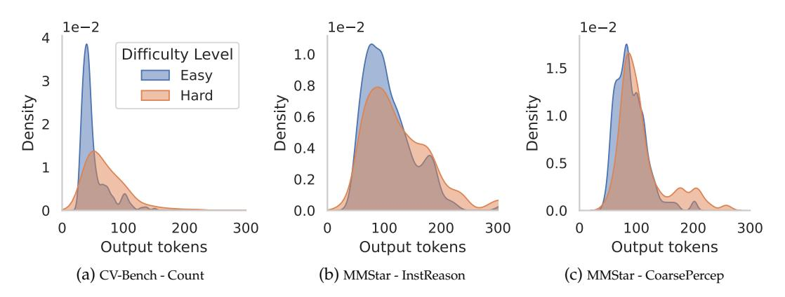
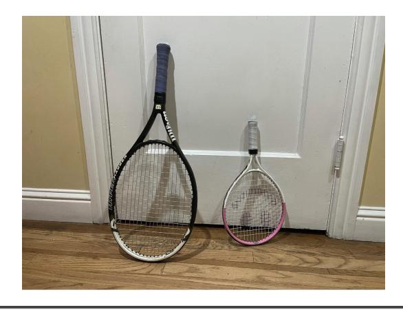

# **A Table of Content**

- 1. Sec. [B](#page-15-0) elaborates the details of the considered five vision-centric benchmarks
- 2. Sec. [D](#page-16-3) provides additional experimental results including additional comparison with self-training and our efforts to improve VLAA-thinking and Virgo.
- 3. Sec. [E](#page-16-2) provides the full evaluation results on text-only reasoning benchmark, MMLU-Pro.
- 4. Sec. [F](#page-16-0) provides implementation details in dataset generation, VLM training, and VLM inference.
- 5. Sec. [G](#page-18-1) provides additional qualitative results of our dataset generation pipeline.
- 6. Sec. [C](#page-15-1) provides the analysis of fine-tuned VLM's response length versus question difficulties.

## <span id="page-15-0"></span>**B Benchmark details**

We describe the details of each benchmark:

- 1. CV-Bench [\(Tong et al.,](#page-13-4) [2024a\)](#page-13-4) is a comprehensive benchmark of over 2k manuallyinspected examples, evaluating visual understanding across domains such as object recognition, scene understanding, and visual reasoning.
- 2. V <sup>∗</sup> Bench [\(Wu & Xie,](#page-13-0) [2024\)](#page-13-0) targets fine-grained visual reasoning tasks that demand detailed analysis of visual elements.
- 3. MMVP [\(Tong et al.,](#page-13-12) [2024b\)](#page-13-12) tests visual pattern recognition using "CLIP-blind pairs"—visually distinct images perceived as similar by CLIP—highlighting systematic limitations in VLMs.
- 4. MMStar-V includes tasks assessing instance-level reasoning, fine-grained perception (detecting subtle visual details), and coarse perception (understanding overall scene context).
- 5. MME-RW-V. MME-RealWorld evaluates real-world visual understanding across domains such as autonomous driving, remote sensing, monitoring, diagrams, tables, and OCR, testing both perception and reasoning. From these, we select three perception tasks—Remote Sensing, Monitoring, and Autonomous Driving—and two reasoning tasks—Monitoring and Autonomous Driving—to form MME-RealWorld-V.

As a result, our evaluation provides a comprehensive view on the perceptual capabilities enabled by the training datasets under consideration. Table [3](#page-15-2) shows the basic statistics of the considered benchmarks.

## <span id="page-15-1"></span>**C Response length vs. question difficulty**

Following prior works , we define question difficulty with respect to a base VLM, *i.e*. Qwen2.5-VL-7B-Instruct. For each question, we estimate the model's accuracy using 11 samples and bin the questions into two quantiles: easy and hard. Our analysis focuses on the outputs of the VLM fine-tuned via DPO on LongPerceptualThoughts. Fig [4](#page-19-0) shows the distribution of response lengths across the easy and hard bins for four different tasks. We observe that the model naturally allocates more test-time compute—reflected in longer

<span id="page-16-1"></span>

| Approach               | Avg   | CV-Bench | V* Bench | MMVP  | MMStar-V | MME-RW-V |
|------------------------|-------|----------|----------|-------|----------|----------|
| Qwen2.5-VL-7B-Instruct | 58.47 | 74.74    | 48.51    | 73.67 | 63.73    | 31.68    |
| VLAA-thinking          | 42.32 | 68.50    | 53.53    | 66.67 | 0.53     | 22.38    |
| + only natural images  | 34.96 | 61.91    | 28.86    | 55.00 | 6.20     | 22.86    |
| Virgo                  | 50.87 | 67.22    | 44.14    | 57.67 | 57.60    | 27.71    |
| + improved formatting  | 52.58 | 68.94    | 46.54    | 66.33 | 53.47    | 27.60    |

Table 4: Attempted improvements on top of VLAA-Thinking and Virgo baselines.

<span id="page-16-4"></span>

|                                 | Avg                     | Biology                 | Business                | Chemistry               | CompSci.                | Econ.                   | Engin.                 | Health                  | History                 | Law                     | Math                    | Phil.                   | Physics                 | Psych.                  | Other                   |
|---------------------------------|-------------------------|-------------------------|-------------------------|-------------------------|-------------------------|-------------------------|------------------------|-------------------------|-------------------------|-------------------------|-------------------------|-------------------------|-------------------------|-------------------------|-------------------------|
| Qwen2.5-VL-7B-Instruct          | 48.07                   | 68.62                   | 55.77                   | 44.79                   | 49.51                   | 61.26                   | 34.26                  | 47.68                   | 43.57                   | 24.89                   | 50.41                   | 38.88                   | 47.19                   | 60.65                   | 45.56                   |
| DOCCI<br>VLAA-Thinking<br>Virgo | 32.99<br>21.56<br>37.95 | 51.60<br>25.24<br>64.02 | 42.33<br>27.76<br>44.36 | 22.61<br>15.11<br>28.98 | 37.32<br>20.73<br>36.59 | 43.48<br>25.47<br>50.36 | 18.89<br>7.64<br>10.63 | 32.76<br>24.45<br>38.63 | 22.31<br>29.40<br>37.27 | 10.26<br>13.35<br>21.16 | 40.19<br>26.72<br>41.67 | 29.46<br>20.04<br>33.07 | 25.56<br>17.78<br>33.18 | 51.13<br>21.43<br>53.88 | 33.98<br>26.73<br>37.45 |
| Ours - SFT<br>Ours - SFT + DPO  | <b>50.77</b> 50.20      | 71.83<br><b>73.08</b>   | <b>56.78</b> 55.26      | <b>50.35</b> 45.94      | 51.22<br>48.29          | <b>62.68</b> 62.09      | <b>38.49</b> 37.98     | 50.86<br><b>51.10</b>   | 42.78<br><b>45.41</b>   | 25.07<br>28.25          | <b>64.25</b> 59.07      | <b>40.88</b> 40.68      | <b>50.65</b> 48.73      | 60.78<br><b>62.28</b>   | 44.16<br>44.70          |

Table 5: Results for all categories of the MMLU-Pro dataset.

<span id="page-16-3"></span>responses—for harder questions, where its original (pre-fine-tuning) performance was worse.

#### D Additional Results

**VLAA-Thinking and Virgo adjustments.** As we saw degradation in performance when training on both, Virgo and VLAA-Thinking, we spent additional time investigating the datasets and the model behavior they are causing which lead to these results.

We found that VLAA-Thinking consists of large proportions of math questions whereas natural image data is dominating the considered benchmarks as we focus on perceptual tasks. We hypothesize that this distribution shift might lead to lower performance. To investigate, we consider a version of VLAA-Thinking where we only keep the image subsets containing natural images, *i.e.*, ALLaVA-LAION and VizWiz, and randomly sample a subset of the same size. For Virgo, we found that predictions would not consistently respect the system prompt when formatting answers leading to inconsistencies with our regexbased evaluation. We thus explore a version of the dataset where we only copy the answer provided inside \boxed{} into <answer> tags, discarding the justification part of the answer, while keeping the thinking part of the dataset the same.

The results of both adjustments can be found in Table 4. We observe that training on only natural images in VLAA-Thinking hurts performance further, likely due to the limited data diversity. One the other hand, when applying improved answer formatting the results on Virgo improve slightly from 50.87% to 52.58%. However, despite these adjustments, the datasets still fail to improve beyond the base model.

### <span id="page-16-2"></span>**E** Full MMLU-Pro Evaluation Results

We provide the detailed results on all MMLU-Pro categories in Table 5. We observe that the model fine-tuned on our LongPerceptualThoughts dataset consistently outperforms the baselines and provides improvements on top of the base model except for the 0ther category.

### <span id="page-16-0"></span>F Implementation Details

#### F.1 LongPerceptualThoughts

**Data generation.** Our framework consists of three stages: generates verifiable multiple-choice questions using  $\mathcal{M}_{LLM}$ , extracts simple chains of thought (CoTs) from vision-

language models  $\mathcal{M}_{VLM}$ , and expands them into rich, long-form reasoning traces using frontier reasoning models  $\mathcal{M}_{Reason}$ .

- 1. In Stage 1, we use gpt-4o-mini-2024-07-18 with temperature 0.7. First, we prompt GPT-4o using the prompt in Fig. 5 to generate multiple-choice questions. Then, we parse the outputs by prompting GPT-4o again using the prompt in Fig. 6.
- 2. In Stage 2, we use Qwen2.5-VL-7B-Instruct with temperature 0.7, top\_p 0.8, repetition\_penalty, 1.05, and set number of samples per input to 3
- 3. In Stage 3, we use R1-Distill-Qwen-32B with temperature 0.7, top\_p 0.8, top\_k 50, repetition\_penalty, 1.05, and set number of samples per input to 3. To avoid outputs include phrases like "As the description says", we explicitly define bad\_words as "describe, description, described, describes, descriptions, mention, mentions, mentioned, misread, text, stated, says, mental"

### F.2 Training details

**SFT Training.** We fine-tune the language decoder with a batch size of 256, sweeping learning rates over  $\{10^{-5}, 8 \times 10^{-6}, 6 \times 10^{-6}\}$ . Training runs for up to 5 epochs with early stopping based on the average validation accuracy. We set the maximum image resolution to  $512 \times 512$  and the input cutoff length to 1024.

**DPO Training.** We fine-tune the language decoder with a batch size of 256, sweeping learning rates over  $\{1 \times 10^{-6}, 5 \times 10^{-7}, 1 \times 10^{-7}\}$ . Training runs for up to 3 epochs with early stopping based on the average validation accuracy. We set the maximum image resolution to 512 × 512 and the input cutoff length to 1024. For DPO, we set  $\beta$  to 1. and following Pang et al. (2024), we include SFT loss with a weight of 0.5.

### F.3 DOCCI Captions

We select the same 500 images used to generate our dataset. Next, we format the training dataset with the user prompt "Provide a detailed description of the image.", prepending the image token and use the dense description provided in the dataset as the target answer of the model without further processing. We train the model using learning rate  $8\times10^{-6}$  with batch size 256 for a maximum of 20 epochs. The training reaches maximum average accuracy on the validation set in the third epoch and we subsequently use this checkpoint to report results in the main paper.

#### <span id="page-17-2"></span>F.4 VLAA-thinking

We preprocess the dataset into two different versions, discarding samples where no reasoning trace could be extracted. The first version uses 24,035 randomly selected samples from the original dataset containing 158,827 samples. The second version also 24,035 random samples, however, we filter the dataset for images from ALLaVA-LAION and VizWiz. The latter specifically contains natural images - similar to the setting we train and evaluate on. We use the official dataset<sup>3</sup> provided and apply some minor processing to the dataset to format the samples into a similar format as ours. In particular, we extract the thinking process and the answer from the *ds\_answer* column of the dataset and place these into <think> and <answer> tags respectively. We use the same system prompt as for our model (see Sec. F.7).

**Training.** We finetune the language decoder using batch size 256. For both versions, we perform hyper parameter tuning by sweeping learning rates  $\{10^{-5}, 8 \times 10^{-6}, 6 \times 10^{-6}\}$ . We train for a maximum of 5 epochs and perform early stopping based on the average accuracy on the validation datasets.

#### F.5 Virgo

We use the dataset introduced in Virgo (Du et al., 2025) as  $D_{SD}^4$  as other versions are not publicly available and it provides the best average performance in their experiments. As

<span id="page-17-0"></span><sup>&</sup>lt;sup>3</sup>https://huggingface.co/datasets/UCSC-VLAA/VLAA-Thinking

<span id="page-17-1"></span> $<sup>^4</sup>$ https://huggingface.co/datasets/RUC-AIBOX/Virgo-Visual-Long-Thought-Dataset

instructed on the webpage we use the "conversation" column of the dataset which the authors report to be the final data used to train the Virgo-7B model. The conversation column is constructed as the correct response with the shortest length of 5 samples given each prompt.

We apply minor processing to the dataset to follow our format by replacing the <|begin of solution|> and <|end of solution|> with <answer> and </answer>. Similarly, we replace <|begin of thought|> and <|end of thought|> with <think> and </think>. Finally, we append "Format the answer with the letter of the correct option in parentheses." to the system prompt if the question is a multiple choice question. Overall, the resulting training dataset contains 14, 540 samples.

**Training.** For training, we follow the setup described in [F.4,](#page-17-2) *i.e*., performing basic hyper parameter tuning, with the only change to limit training to 3 epochs as we found that the model performance peaks early during training. Surprisingly, we achieve the best validation performance before the first epoch ends.

### **F.6 Evaluation**

<span id="page-18-2"></span>**Inference setup.** We use vLLM [\(Kwon et al.,](#page-10-13) [2023\)](#page-10-13) for inferencing all models with greedy decoding. Detailed settings can be found in Tbl. [6.](#page-18-2) Further, we resize images' longer side to 512 pixels preserving the aspect ratio if necessary. As the reasoning traces for MMLU-Pro tend to be longer for all models due to the difficulty of the task, we double the maximum number of new tokens generated. We use four NVIDIA RTX6000.

| Setting        | Value                    |
|----------------|--------------------------|
| cutoff length  | 2048                     |
| max new tokens | 1024 (2048 for MMLU-Pro) |
| temperature    | 0.0                      |
| top p          | 1.0                      |
| dtype          | half                     |

Table 6: vLLM inference settings.

### <span id="page-18-0"></span>**F.7 Training and Evaluation Prompts**

We provide the prompts for training and evaluation:

- 1. Fig. [7:](#page-21-1) The prompt used to train VLMs on DOCCI descriptions.
- 2. Fig. [8:](#page-21-2) The prompt used to evaluate VLMs to provide direct answers.
- 3. Fig. [9:](#page-22-0) Inspired by the prompt provided by DeepSeek-R1 [\(DeepSeek-AI et al.,](#page-9-0) [2025\)](#page-9-0), we design the prompt used to evaluate VLMs to provide thoughts and answers.

### <span id="page-18-1"></span>**G Qualitative dataset example**

We provide an example of our dataset in Fig. [10.](#page-23-0)

<span id="page-19-0"></span>> **[图片提取文字 (无描述)]:**
> 1e-2 1e-2 1e-2 Difficulty Level 1.0 1.5 Easy 3 0.8 Hard Density ∾ Density Density 1.0 0.6 0.4 0.5 0.2 0 0.0 0.0 300 300 100 200 100 200 300 100 200 0 Output tokens Output tokens Output tokens (c) MMStar - CoarsePercep (a) CV-Bench - Count (b) MMStar - InstReason


Figure 4: **Response lengths vs. question difficulties.** We analyze the responses of the VLM fine-tuned on LongPerceptualThoughts via DPO. Interestingly, we find that the model finetuned in our data naturally allocates more test-time compute for hard questions. We follow Lightman et al. (2024); Snell et al. (2025) and determine question complexity using rollouts on the base model.

```
System: You are an assistant that converts image descriptions to
,→ multi-choice visual questions.
User: Task:
You are given a detailed description of an image. Your goal is to
    generate diverse vision-centric, detailed questions that require a
    careful examination of the image for subtle visual details. Each
    question should be answerable in a brief sentence or single phrase.
,→
,→
,→
Instructions:
- Focus on Visual Detail:
    - Ask questions that require examining fine details such as textures,
    ,→ patterns, and small or hidden elements.
    - Encourage the reader to analyze spatial relationships like object
    ,→ overlap, perspective, and layout.
    - Include aspects of lighting, shadows, and color gradients that
    ,→ affect the image's mood and depth.
- Comprehensive Coverage:
    - Ensure that the questions, as a group, address the majority of
    ,→ important details mentioned in the image description.
- Design for Multiple-Choice:
    - For each question, provide 4 answer options labeled A, B, C, and D.
    - Include one correct answer and three plausible distractors.
- Encourage Careful Inspection:
    - Design each question so that it cannot be answered without a close,
    ,→ careful visual inspection of the image.
   - Avoid generic or overly broad questions; each should target specific
    ,→ visual cues mentioned or implied in the description.
- Clarity, Specificity, and Brevity in Answers:
    - Formulate questions that are clear and focused on visual elements.
    - Ensure each question is detailed enough to challenge the reader to
    ,→ look beyond the surface.
    - Avoid questions that can be answered with general knowledge or
    ,→ assumptions.
    - Each question should be answerable in a brief sentence or even a
    ,→ single phrase.
- Structured Output:
    - Provide the questions in a numbered list.
    - Example Format: 1. <question> question here </question> <choices>
        (A) ... (B) ... (C) ... (D) ... </choices> <answer> short answer
        here </answer>
    ,→
    ,→
Image Description:
[IMAGE DESCRIPTIONS]
Assistant:
```

Figure 5: **Text prompt converting descriptions to multi-choices questions.**

```
User: You are given a text containing multiple multi-choice questions.
    Each question includes a question statement, several choices, and an
    answer. Your task is to reformat the text so that each multi-choice
    question follows the structure below:
,→
,→
,→
1. <question> question text here </question> <choices> (A) choice A text
    (B) choice B text (C) choice C text (D) choice D text </choices>
    <answer> answer text here </answer>
,→
,→
Please ensure that:
- Each question is numbered sequentially (e.g., 1., 2., 3., . . . ).
- The question portion is enclosed within the `<question>` tags.
- All answer options are enclosed within the `<choices>` tags, with each
,→ option clearly labeled (A), (B), (C), (D).
- The answer is enclosed within the `<answer>` tags.
- The original content is preserved, but any formatting issues are
,→ corrected according to the template above.
Here is the original content: [PREVIOUS_RESPONSE]
Assistant:
```

Figure 6: **Text prompt to parse the response of Fig. [5](#page-20-0) to multi-choices questions.**

```
System: A conversation between User and Assistant. The user asks a visual
    question, and the Assistant solves it. The answer are enclosed within
    <answer> </answer> tags, respectively, i.e., <answer> answer here
    </answer>. Format the answer with the letter of the correct option in
    parentheses.
,→
,→
,→
,→
User: <image>Provide a detailed description of the image.
Assistant: [IMAGE DESCRIPTION]
```

Figure 7: **Training prompt for training on DOCCI descriptions.**

```
System: A conversation between User and Assistant. The user asks a visual
    question, and the Assistant solves it. The answer are enclosed within
    <answer> </answer> tags, respectively, i.e., <answer> answer here
    </answer>. Format the answer with the letter of the correct option in
    parentheses.
,→
,→
,→
,→
User: <image>[QUESTION]
Select from the following choices.
[CHOICES]
Assistant:
```

Figure 8: **Evaluation prompt for direct answers.**

```
System: A conversation between User and Assistant. The user asks a visual
    question, and the Assistant solves it. The assistant first thinks
    about the reasoning process in the mind and then provides the user
    with the answer. The reasoning process and answer are enclosed within
    <think> </think> and <answer> </answer> tags, respectively, i.e.,
    <think> reasoning process here </think> <answer> answer here
    </answer>. Format the answer with the letter of the correct option in
    parentheses.
,→
,→
,→
,→
,→
,→
,→
User: <image>[QUESTION]
Select from the following choices.
[CHOICES]
Assistant:
```

Figure 9: **Evaluation prompt for thoughts and answers.**

<span id="page-23-0"></span>

**Question**: How is the smaller tennis racket decorated within its strings? Select from the following choices.

- (A) A smiley face
- (B) A floral design
- (C) A logo
- (D) A pattern of stars

% Correct answer: (A) A smiley face

### **Simple CoT**

<think>

Upon examining the smaller tennis racket, I can see that there is a distinct pattern of stars within its strings. This pattern is consistent across the strings, making it clear what the design is. ,→ ,→ </think>

<answer> (D) </answer>

#### **Ours**

<think>

Upon examining the smaller tennis racket, I can see that there is a

- distinct pattern of stars within its strings. This pattern is ,→
- consistent across the strings, making it clear what the design is. ,→
- Wait, no, hold on. Actually, the image shows a smiley face inside the ,→
- strings, but it's upside down. So that must be the decoration. ,→

Wait, maybe I got confused. Let me double-check. The smaller racket has a

- smiley face printed in black within the strings. So the correct ,→
- answer should be A smiley face. But wait, the options include both A ,→
- and C. Hmm, could it be a logo? No, because the Wilson racket has a ,→
- logo, but the smaller one has a smiley face. So the decoration is a ,→
- smiley face, which is option A. ,→

</think>

<answer> (A) </answer>

Figure 10: Qualitative example of our LongPerceptualThoughts dataset performing verification.