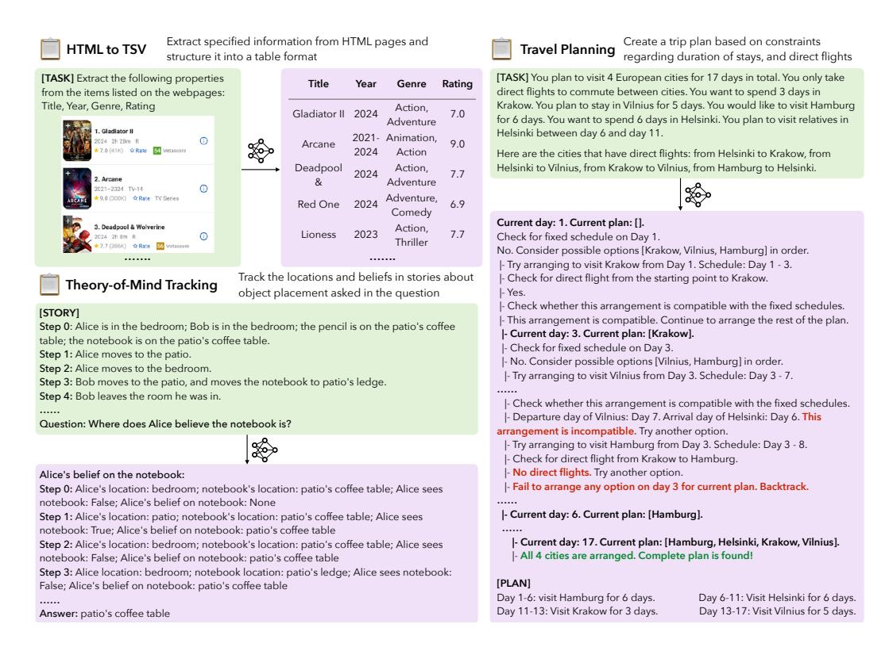

# LongProc: Benchmarking Long-Context Language Models on Long Procedural Generation

Xi Ye Fangcong Yin Yinghui He Joie Zhang Howard Yen Tianyu Gao Greg Durrett Danqi Chen
Princeton Language and Intelligence The University of Texas at Austin xi.ye@princeton.edu

#### Abstract

Existing benchmarks for evaluating long-context language models (LCLMs) primarily focus on long-context recall, requiring models to produce short responses based on a few critical snippets while processing thousands of irrelevant tokens. We introduce LONGPROC (Long Procedural Generation), a new benchmark that requires both the integration of highly dispersed information and long-form generation. LONGPROC consists of six diverse procedural generation tasks, such as extracting structured information from HTML pages into a TSV format and executing complex search procedures to create travel plans. These tasks challenge LCLMs by testing their ability to follow detailed procedural instructions, synthesize and reason over dispersed information, and generate structured, long-form outputs (up to 8K tokens). Furthermore, as these tasks adhere to deterministic procedures and yield structured outputs, they enable reliable rule-based evaluation. We evaluated 23 LCLMs, including instruction-tuned models and recent reasoning models, on LONGPROC at three difficulty levels, with the maximum number of output tokens set at 500, 2K, and 8K. Notably, while all tested models claim a context window size above 32K tokens, open-weight models typically falter on 2K-token tasks, and closed-source models like GPT-40 show significant degradation on 8K-token tasks. Reasoning models achieve stronger overall performance in long-form generation, benefiting from long CoT training. Further analysis reveals that LCLMs struggle to maintain long-range coherence in long-form generations. These findings highlight critical limitations in current LCLMs and suggest substantial room for improvement.1

### 1 Introduction

Recent research has expanded the context window of pretrained language models from hundreds of tokens (Devlin et al., 2019; Raffel et al., 2020) to millions (Anthropic, 2024; Gemini Team, 2023), driven by advances in pre-training (Llama-3 Team, 2024), architectures (Gu & Dao, 2024; Sun et al., 2024), and data engineering methods (Fu et al., 2024; Gao et al., 2024). This rapid growth in context window capacity presents new challenges for evaluating these long-context language models (LCLMs). A majority of existing benchmarks focus on tasks that require processing long inputs while producing relatively short outputs, such as answering a simple question or generating a short summary (Kamradt, 2023; Hsieh et al., 2024; Yen et al., 2025). Moreover, these benchmarks typically only test *low-dispersion* scenarios (Goldman et al., 2024), requiring LCLMs to locate and use a few relevant snippets within the long contexts. Such evaluations provide limited insight into LCLMs' performance on more practical long-context tasks that require integration of dispersed information and long-form generation, such as a web agent that synthesizes information across multiple pages while generating lengthy trajectories.

\*Authors contributing to dataset generation.

&lt;sup>1Data and code available at: https://princeton-pli.github.io/LongProc.

> **[图片提取文字 (无描述)]:**
> Extract specified information from HTML pages and Create a trip plan based on constraints HTML to TSV Travel Planning structure it into a table format regarding duration of stays, and direct flights [TASK] You plan to visit 4 European cities for 17 days in total. You only take [TASK] Extract the following properties Title Rating Year Genre direct flights to commute between cities. You want to spend 3 days in from the items listed on the webpages: Krakow. You plan to stay in Vilnius for 5 days. You would like to visit Hamburg Title, Year, Genre, Rating Action. Gladiator II 2024 7.0 for 6 days. You want to spend 6 days in Helsinki. You plan to visit relatives in Adventure 1. Gladiator II Helsinki between day 6 and day 11. 2021- Animation, 0 9.0 Arcane 7.0 (41K) Whate M veracore 2024 Action Here are the cities that have direct flights: from Helsinki to Krakow, from Helsinki to Vilnius, from Krakow to Vilnius, from Hamburg to Helsinki. Deadpool Action. 2024 7.7 8 Adventure 9091-9094 TV-14 0 9,0 (DODK) Adventure, 6.9 Red One 2024 Comedy Current day: 1. Current plan: []. Action, 2023 7.7 Lioness Check for fixed schedule on Day 1. Thriller Rate Wetzsseen No. Consider possible options [Krakow, Vilnius, Hamburg] in order. |- Try arranging to visit Krakow from Day 1. Schedule: Day 1 - 3. Track the locations and beliefs in stories about - Check for direct flight from the starting point to Krakow. Theory-of-Mind Tracking object placement asked in the question - Yes. Check whether this arrangement is compatible with the fixed schedules. **ISTORY** |- This arrangement is compatible. Continue to arrange the rest of the plan. Step 0: Alice is in the bedroom; Bob is in the bedroom; the pencil is on the patio's coffee |- Current day: 3. Current plan: [Krakow]. table; the notebook is on the patio's coffee table. I- Check for fixed schedule on Day 3. Step 1: Alice moves to the patio. |- No. Consider possible options [Vilnius, Hamburg] in order. Step 2: Alice moves to the bedroom. |- Try arranging to visit Vilnius from Day 3. Schedule: Day 3 - 7. Step 3: Bob moves to the patio, and moves the notebook to patio's ledge. Step 4: Bob leaves the room he was in. I- Check whether this arrangement is compatible with the fixed schedules. |- Departure day of Vilnius: Day 7. Arrival day of Helsinki: Day 6. This Question: Where does Alice believe the notebook is? arrangement is incompatible. Try another option. |- Try arranging to visit Hamburg from Day 3. Schedule: Day 3 - 8. I- Check for direct flight from Krakow to Hamburg. |- No direct flights. Try another option. Alice's belief on the notebook: - Fail to arrange any option on day 3 for current plan. Backtrack. Step 0: Alice's location: bedroom; notebook's location: patio's coffee table; Alice sees notebook: False; Alice's belief on notebook: None |- Current day: 6. Current plan: [Hamburg]. Step 1: Alice's location: patio; notebook's location: patio's coffee table; Alice sees notebook: True; Alice's belief on notebook: patio's coffee table |- Current day: 17. Current plan: [Hamburg, Helsinki, Krakow, Vilnius]. Step 2: Alice's location: bedroom; notebook's location: patio's coffee table; Alice sees |- All 4 cities are arranged. Complete plan is found! notebook: False; Alice's belief on notebook: patio's coffee table Step 3: Alice location: bedroom; notebook location: patio's ledge; Alice sees notebook: [PLAN] False; Alice's belief on notebook: patio's coffee table Day 1-6: visit Hamburg for 6 days. Day 6-11: Visit Helsinki for 6 days. Day 11-13: Visit Krakow for 3 days. Day 13-17: Visit Vilnius for 5 days. Answer: patio's coffee table

Figure 1: Three (out of six) representative tasks in LONGPROC: HTML to TSV, Theory-of-Mind Tracking, Travel Planning. Each task requires LCLMs to follow a given procedure and generate outputs in a **specified format** detailed by instructions. This leads to natural long-form outputs that can be evaluated reliably with rule-based metrics. Refer to appendix F for examples of all six tasks.

Given the limitations of existing benchmarks, we propose a new paradigm for evaluating LCLMs through **long procedural generation**, which requires models to follow specified procedures and generate structured outputs. As shown in Figure 1, example tasks include extracting target information from lengthy unstructured HTML documents into structured TSV files, or creating trip plans by executing prolonged search procedures. Because these procedures involve multiple generation steps, each requiring LCLMs to use information from the context and previous steps, such tests naturally require integration of dispersed information and long-form generation.

Based on this design principle, we introduce LONGPROC (Long Procedural generation), a new benchmark consisting of six distinct tasks (see Table 2 for details). This set of tasks poses diverse challenges in accessing information, multi-step reasoning, and complex search procedures, with direct relevance to practical applications such as web agents (Li et al., 2024c; Zhou et al., 2023) and real-world planning tasks (Zheng et al., 2024; Xie et al., 2024). The required ability for long-context reasoning serves as a foundation to recent advances demonstrated by OpenAI o1/o3 (OpenAI, 2024) and DeepSeek-R1 (Guo et al., 2025) models. In addition, since all tasks follow deterministic procedures and produce structured outputs, they enable reliable rule-based evaluation of extended generations.

LONGPROC features three difficulty levels by categorizing the task instances based on required output lengths: 500, 2K, and 8K tokens. These levels effectively differentiate the capabilities of models across different families and scales. We evaluate 23 LCLMs, covering both instruction-tuned models and recent reasoning models. Our results reveal key limitations in current LCLMs' capabilities for long procedural generation: all tested models, including frontier proprietary models, largely fail at 8K-token tasks despite their advertised 128K context windows. Comparisons between reasoning models and instruct models sug-

gest benefits of long CoT training for long procedural generation tasks. Further analysis demonstrates that that models make more mistakes in later generation segments, high-lighting models' challenges in maintaining long-range coherence. In summary, LONGPROC serves as a testbed for evaluating LCLMs, exposing limitations that emphasize substantial room for future research in long-context modeling.

