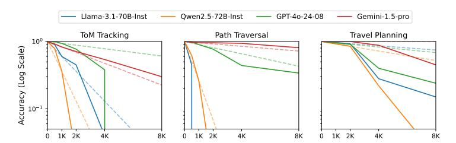

# **A.4 Qualitative Analysis**

|                      | Main Capability | Typical Recall Errors                                   | Typical Reasoning Errors                                |
|----------------------|--------------------|---------------------------------------------------------|---------------------------------------------------------|
| HTML to TSV (8K)     | Extract Info       | skipping rows (8/20) hallucinating details (7/20)    | −                                                       |
| ToM Tracking (8K)    | Reasoning          | −                                                       | incorrect inferences about locations changes (19/20) |
| Travel Planning (8K) | Search             | hallucinating non-existential direct flights (10/20) | incorrect state updates and state transitions (8/20) |

Table 7: Summary of qualitatively analysis on outputs (GPT-4o). GPT-4o makes both longcontext recall and long-range inference errors in the extensive generation process. Note that GPT-4o rarely makes these errors in easier settings (0.5K or 2K) as demonstrated by its almost perfect performance.

We qualitatively analyze the typical errors made by LCLMs. Table [7](#page-17-2) provides a summary of these errors, with concrete examples available in Appendix [G.](#page-33-0) We broadly categorize these errors into two types: long-context recall errors (where the model restates information inconsistent with the context) and long-range reasoning errors (where the model outputs entries that cannot be logically deduced from the context and previous entries). We find that the frequency of both error types increases substantially as task difficulty increases. In contrast, GPT-4o rarely exhibits these errors in the 0.5K or 2K settings, where it achieves almost perfect performance.

**Errors in extracting information.** On the HTML to TSV task, models only need to copy information from the input. We analyzed 20 errors at 8K tokens made by GPT-4o on the HTML to TSV task. We found that 8 out of 20 errors were caused by the model skipping intermediate rows or only generating the first few rows, and 7 errors were caused by the model hallucinating details in some properties (e.g. adding a wrong street name to the address property). These errors indicate the model is not able to consistently identify and recall all relevant information from long context windows to the long outputs.

**Errors in deductive reasoning.** In the ToM Tracking task, models must perform long-range deduction by inferring location changes of people or objects based on distant context. We analyzed 20 errors made by GPT-4o. Our analysis reveals that 19 out of 20 errors in this task stemmed from incorrect long-range inferences about location changes, rather than reasoning within local context windows (e.g., determining if a person and object are in the same room). **Errors in executing search.** In search-based tasks, models struggle with both following complex search procedures and maintaining context adherence. Analysis of 20 GPT-40 errors in Travel Planning shows that 10 cases involved hallucinating non-existent direct flights between cities, while 8 cases demonstrated failures in either exploring possible options or correctly updating search states (Appendix G).

### A.5 Analysis of Performance Degradation Pattern

> **[图片提取文字 (无描述)]:**
> Llama-3.1-70B-Inst Gemini-1.5-pro Qwen2.5-72B-Inst ---- GPT-40-24-08 ToM Tracking Path Traversal Travel Planning 100 Accuracy (Log Scale) 10-1 4K 8K 4K

Figure 6: Analysis of performance with respect to generation length. Dashed lines represent *hypothetical* trends assuming constant per-entry error rates (where log accuracy is proportional to length). While this model fits certain cases, such as Gemini-1.5-Pro on ToM tracking and Path Traversal, the observed performance trends generally indicate higher error rates at longer lengths, suggesting models struggle to maintain coherence over extended sequences.

We analyze whether performance degradation follows a **simple error accumulation** pattern as generation length increases. Under an error accumulation assumption, if LCLMs have a probability p of correctly predicting each entry  $y_i$ , then for a procedure of length L with average entry length t, the overall accuracy should be  $p^{\frac{L}{t}}$ . This implies the log-accuracy should be proportional to length:  $\log(acc) \propto L$ .

Figure 6 compares actual log-scaled model accuracy against hypothetical trends extrapolated from model performance at 1K and 2K tokens. We find that the observed performance degradation generally deviates from hypothetical trends, except for Gemini-1.5-Pro on ToM tracking and Path Traversal tasks. The increasing per-entry error rate suggests that performance deterioration extends beyond simple error accumulation, highlighting the challenges in long-form generation.

#### A.6 Analysis on Robustness to Irrelevant Context

|                    | Extract All (No Filter) | Filtering |
|--------------------|-------------------------|-----------|
| LLaMA-3.1-70B      | 55.7                    | 38.4      |
| GPT-40-2024-08     | 78.1                    | 52.8      |
| Gemini-1.5-Pro-001 | 77.5                    | 62.5      |

Table 8: Performance on HTML-TO-TSV (8K) task with and without filtering. The filtering setting introduces more irrelevant information, leading to a notable drop in performance.

While our primary focus is on long-form generation and synthesis over dispersed information, we include an analysis on model robustness to irrelevant context through the HTML to TSV task. This task includes two settings (refer to Appendix B.1 for details on how this task is constructed): 1) Extract All (No Filter): The model is asked to extract all relevant items from the input HTML page (e.g., "all movies in the page"), and 2) Filtering: The model must extract only a subset of relevant items that satisfy certain conditions (e.g., "all action movies in the page").

The filtering setting introduces additional irrelevant information into the context and requires the model to robustly identify and extract only the relevant items. Table 8 shows the performance of several representative models on both settings for the 8K-token output level. We observe a substantial drop in the filtering setting, suggesting that current LLMs struggle with selective extraction in the presence of irrelevant information.

