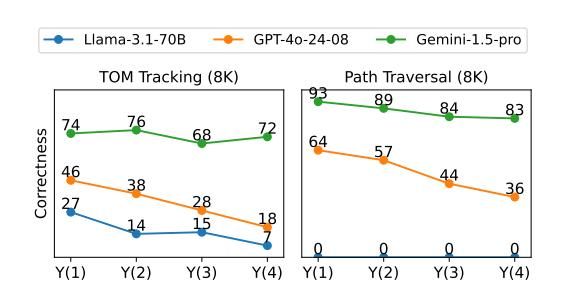
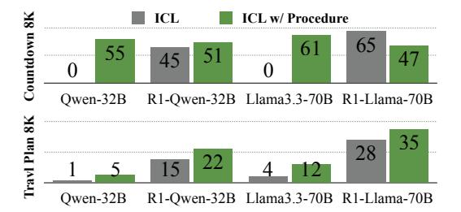

# **5 Analysis**

Our analysis focuses on the challenges of long procedural generation and discussion around reasoning models. Refer to Appendix [A](#page-16-0) for additional analysis, such as comparison to low dispersion task (RULER), small scale human evaluation, and qualitative analysis

**Comparison of performance across tasks.** Figure [3](#page-7-1) presents the performance comparison across tasks and generation lengths for 8 representative models. We leave the complete results of all models in Appendix [E.](#page-24-0) In general, We observe **steeper performance degra-** dation in tasks requiring long-range reasoning. Gemini-1.5-Pro, the best model on the 8K set overall, shows more significant performance decline on tasks requiring reasoning (ToM Tracking, Countdown, and Travel Planning) compared to more straightforward tasks (HTML to TSV). This discrepancy arises from the dependent nature of reasoning tasks, where generating each entry relies on context from previous entries. Such variances in performance degradation rate also highlight the task diversity in LONGPROC.

**Models struggle to maintain long-range coherence.** We analyze how models degrade during generation to better understand the challenges of long procedural generation. Specifically, we examine output correctness across different segments of the generated text. We divide Y into four even segments  $\mathbf{Y}^{*(1)}$ ,  $\mathbf{Y}^{*(2)}$ ,  $\mathbf{Y}^{*(3)}$ , and  $\mathbf{Y}^{*(4)}$ , and evaluate the model correctness for each segment. When evaluating the correctness of the *i*-th segment, we *prefill the prompt with ground truth segments*  $\mathbf{Y}^{*(1)}$  to  $\mathbf{Y}^{*(i-1)}$  to make generation conditioned on the correct prefix.

> **[图片提取文字 (无描述)]:**
> Llama-3.1-70B GPT-40-24-08 Gemini-1.5-pro TOM Tracking (8K) Path Traversal (8K) 89 84 83 76 68 Correctness 64 57 46 44 38 36 28 18 Y(1) Y(2)Y(3)Y(4) Y(1) Y(2)Y(3)Y(4)

Figure 4: Performance of different segments in the outputs. Models achieve lower performance in the later segments.

Figure 4 shows the per-segment correctness on Path Traversal and ToM Tracking in the

8K token setting. We observe clear **performance degradation in the later segments of the generation**. This trend indicates that, as the generated outputs accumulate, models increasingly struggle to maintain coherence with both the input and previously generated text. We also provide a qualitative analysis in Appendix A.4, which reveals that LCLMs make both recall errors and reasoning errors when handling long-range dependencies.

Comparison between reasoning models and instruct models across tasks. Results in §4 suggest that the reasoning models achieve strong overall performance, and we further investigate which specific tasks benefit more from long CoT training. As shown in Figure 3, the most substantial improvements are observed in Path Traversal, with R1-Qwen-32B also showing gains in HTML to TSV compared to Qwen-32B-Inst. Interestingly, these two tasks are considered less reasoning-intensive, with their difficulty mainly lying in identifying relevant information amid similar contexts. For the three reasoning-focused tasks (bottom row), reasoning models substantially outperform their instruction-tuned counterparts in ToM Tracking and Travel Planning (8K). However, reasoning models show some performance degradation on Countdown (8K) and Travel Planning (2K). This occurs because they cannot generate final solutions within the 16K output token budget (see Appendix A.2 for details).

Benefits of procedural generation. We highlight that the ability to execute long-form procedures is advantageous for applications requiring extended reasoning steps. In Figure 5, we compare models' performance on two tasks requiring systematic search procedures when prompted using two methods: 1) ICL (in-context learning) that provides input and output pairs (where output examples also help specify the formats) 2) ICL with Procedure that provides detailed procedure (see Figure 2 for a concrete example).

As shown in Figure 5, using procedures in prompt generally improves performance for both instruct and reasoning models. No-

> **[图片提取文字 (无描述)]:**
> ICL ICL w/ Procedure R1-Qwen-32B Llama3.3-70B R1-Llama-70B R1-Owen-32B Llama3.3-70B R1-Llama-70B

Figure 5: Performance comparison between standard ICL (input-output pairs) and ICL with procedure. Using procedure in prompts can enhance performance of both instruct and reasoning models.

tably, instruct models prompted with procedures achieve substantial performance gains compared to ICL, sometimes even reaching comparable performance to reasoning models with standard ICL.We note that even with standard ICL, models are still instructed to "think carefully" and allowed to use CoT. Our findings suggest that instruct models already possess branching and backtracking capabilities, which are often characterized as distinctive features of reasoning models [\(Guo et al.,](#page-11-7) [2025\)](#page-11-7).

