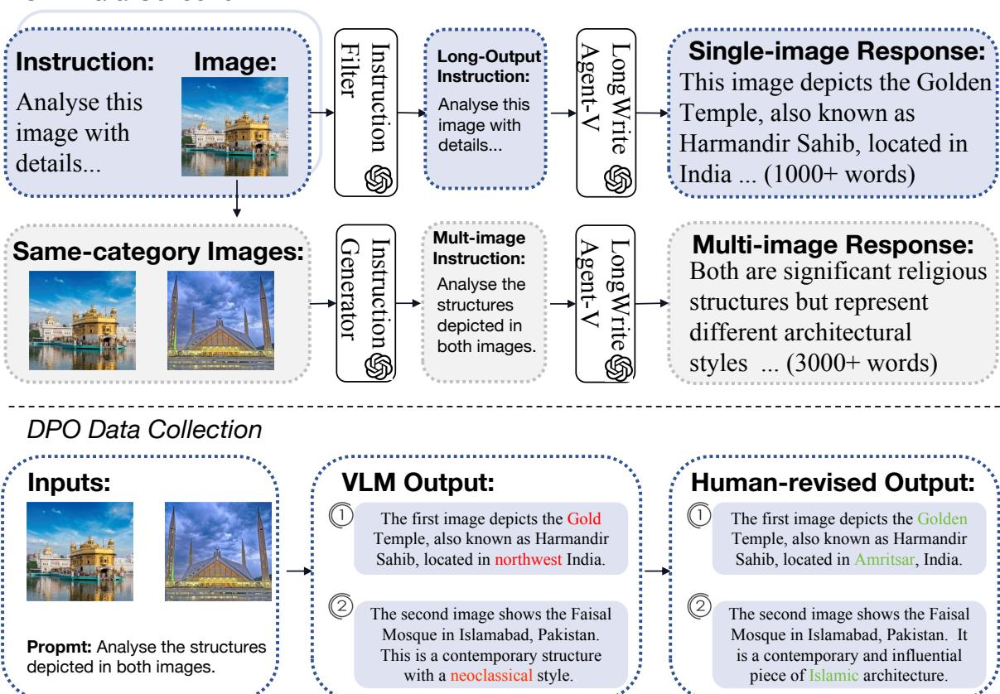
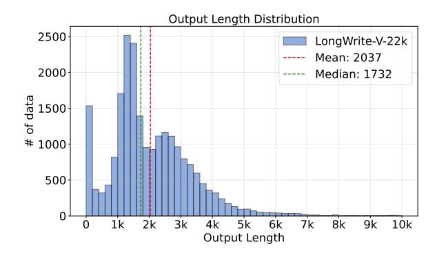
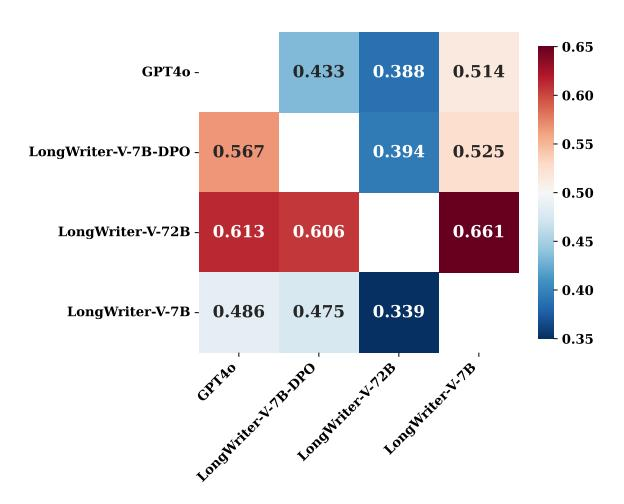

# 3 LongWriter-V: Data and Training

In this section, we will introduce the data collection and training process for unlocking the long generation capability of vision-language models.

## 3.1 Data Collection

Figure [4](#page-3-0) depicts the overall pipeline of our data collection process, which consists of two phases: SFT and DPO data collection.

## 3.1.1 SFT Data Collection

Existing VLMs fail to directly generate texts exceeding 1k tokens, so we develop a two-stage method to generate long texts as SFT data.

LongWrite Agent-V. Before introducing our method, we first formalize the task's objective. Given several input images v and an user instruction x, our goal is to generate a text y ∗ that aligned with user's length and quality requirements:

$$y^* = \arg\max_{y} (s_l(y) + s_q(y)) P_{\theta}(y|v, x)$$
 (1)

where sl and sq is the scoring function for judging the length and quality of the output, respectively. Pθ is the function representing the end-to-end solution, while existing VLMs may not be directly applied as their maximum output lengths are below 1k. To utilize off-the-shelf VLMs, we propose

> **[图片提取文字 (无描述)]:**
> Single-image Response: Instruction LongWrite Long-Output Instruction: Image: Instruction: This image depicts the Golden Analyse this Analyse this Temple, also known as image with image with Harmandir Sahib, located in details... details... India ... (1000+ words) **(S)** Mult-image Multi-image Response: Same-category Images: Instruction \_ongWrite Instruction: Both are significant religious Analyse the structures but represent structures depicted in different architectural both images. styles ... (3000+ words) DPO Data Collection **VLM Output: Human-revised Output:** Inputs: The first image depicts the Gold The first image depicts the Golden Temple, also known as Harmandir Temple, also known as Harmandir Sahib, located in northwest India. Sahib, located in Amritsar, India. The second image shows the Faisal The second image shows the Faisal Mosque in Islamabad, Pakistan. Mosque in Islamabad, Pakistan. It **Propmt:** Analyse the structures This is a contemporary structure is a contemporary and influential depicted in both images. piece of Islamic architecture. with a neoclassical style.

Figure 4: SFT and DPO data collection pipeline of LongWriter-V. The SFT data includes both single-image and multi-image input for long text output. The DPO data contains human revision over each paragraph of VLM's long output. We conduct iterative direct preference optimization to learn the fine-grained human feedback.

a two-stage method for generating long texts. Inspired by the plan-and-write method from Long-Writer (Bai et al., 2024), we first prompt the VLM to generate an outline o that structures the output, plans the content, and specifies the word count for each paragraph. This outline breaks down the complex long-output task into manageable sub-tasks. Next, we use the VLM to fill in each paragraph and concatenate them to form the final output:

$$y^* = \arg\max_{o} P_1(o|v, x) \arg\max_{y} (s_l(y) + s_q(y)) P_2$$
(2)

$$P_2(y|v, x, o) = \prod_{i=0}^{n} p(y_i|v, x, o_i, y_{< i})$$
 (3)

where  $P_1$  is the modeling function for first stage, which takes input images and instruction to write an n-paragraph outline  $o = \{o_i, i = 1, ..., n\}$ .  $P_2$  refers to the second stage, where the VLM outputs the content  $y_i$  paragraph by paragraph based on the input information, outline  $o_i$  and previous paragraphs  $y_{< i}$ . In practice, we design two detailed prompts for guiding VLM to implement the two

stages, which are listed in Appendix B.2.

Visual Instruction Collection. To collect longoutput visual instructions for SFT, we choose MMEvol (Luo et al., 2024) as our primary data source. MMEvol is a large-scale, opendomain dataset containing 480k image-text instruction pairs, sourced from diverse datasets such as LLaVA-Instruct (Liu et al., 2024a) and ShareGPT4V (Chen et al., 2024a). However, the average output length in this dataset is relatively short (54.85 tokens), necessitating a filtering process to identify long-output instructions. We first check the original response length of e ach example and select those with output length over 128, yielding 55,835 valid data. Next, we utilized GPT-40 to verify whether each instruction genuinely requires a long output and whether the associated image was sufficiently relevant to the instruction. Finally, we get 8,115 single-image instructions.

**Multi-image Instruction Generation**. As the original data in MMEvol only has one image for each instruction, we synthesize some multi-image instructions to increase the diversity of SFT data.

We select three subsets of MMEvol: wikiart, weblandmark, web-celebrity. Each subset contains hundreds of images in the same category. For example, images in web-landmark are all landmark pictures taken from different world attractions. We randomly sample 2 or 4 same-category images and then ask gpt-40 to generate an instruction that require long output for these images. We obtain 6,313 multi-image instructions in this way. Apart from synthetic data, we also collect natural multi-image data from an open-source PPT dataset, Zenodo10K (Zheng et al., 2025). We transform these slides into images to use them as visual inputs and set the instruction as "Write a lecture script for these slides". We choose those slides that has at least 2 pages and at most 30 pages, resulting in 7,730 data. Backtranslation. Through above processes, we collect 22,158 single-image and multi-image instructions in total. Using the LongWrite Agent-V pipeline, we generate long output for each visual instruction as SFT data. We call this training data LongWrite-V-22k. But most instructions don't specify the exact word count requirement, models trained on these data may lack the ability to follow the writing instruction with word count requirements. Therefore, we sample 5,000 data from LongWrite-V-22k and calculate the length of the output L then add a requirement "Please write L-word in total." to the end of the instruction and use gpt-4o-mini for rephrasing the instruction to maintain consistency. This is inspired by previous backtranslation (Li et al., 2023) method on training long-output LLMs (Pham et al., 2024).

#### 3.1.2 DPO Data Collection

The SFT data aims to extend VLMs' output length. But the longer outputs may bring more hallucinations and repetitions. So the follow up question is: how to improve the generation fidelity of long output VLM? Previous works often adapt direct preference optimization (Rafailov et al., 2024; Liu et al., 2024c) to correct the hallucinations of VLMs. We follow the data format in RLHF-V (Yu et al., 2024a) which utilizes the human-annotated segment-level corrections on VLM's outputs as feedback.

**VLM Output Collection**. To collect long responses, we select 100 slides that were not included in LongWrite-V-22k for VLM to generate scripts. These slides were previously used for teaching on MOOC platforms (Yu et al., 2020) and cover 10 subjects such as Computer Science, Math and Physics. Each subject may contain 4 to 16

> **[图片提取文字 (无描述)]:**
> Output Length Distribution 2500 LongWrite-V-22k Mean: 2037 2000 Median: 1732 of data 1500 # 1000 500 8k 1k 2k 3k 4k 5k 6k 7k 9k 10k Output Length

Figure 5: Output length statistics of LongWrite-V-22k.

slides and each slide may have 10 to 30 pages. We use LongWriter-V-7B, the VLM trained on our SFT data, to generate scripts for each slide. The long scripts are segmented by sections and aligned with each page of the given slide. We find that LongWriter-V-7B tends to output fewer sections than the number of total pages, which is one of the issues that we would ask human annotators to fix. Human Revision Collection. To get high-quality feedback on the flawed output of SFT model, we hire 10 college students from 10 different majors corresponding to the subjects of our slides. We required annotators to have a GPA above 3.8 to ensure their expertise. To facilitate the annotation process, we build an online platform (See Appendix C.1). Each annotator will get slides that match with their major. The platform displays each slide page alongside the corresponding script segment generated by the SFT model. We ask annotators to check and revise each page's script for the following error types: factual errors, missing information, relevance to the image, coherence of sentences, and repetition of words. After completing the annotation of a slide, our authors will review the annotation quality. Ultimately, we get 72 valid scripts with fine-grained human corrections.

#### 3.2 Training

Supervised Fine-tuning. We conduct model training based on two open-source VLMs with different parameter sizes: Qwen2.5-VL-7B-Instruct and Qwen2.5-VL-72B-Instruct (Team, 2025). We choose Qwen2.5-VL series as base model because they support a context window of 32k tokens. By resizing the input image's width and height to 280x280, the Qwen2.5-VL models can process up to 30 images. As shown in Figure 5, the output length in LongWrite-V-22k are distributed between 0 and 10k with two peaks around 0 and 1.5k. The

peak at 0 indicates some short output data is mixed in the LongWrite-V-22k, which are mainly the results of those simple instructions. To get a better length distribution, we sample 10k data from LongWrite-V-22k with an average output length of 2.8k as training data. We then fine-tune the two models for 3 epochs with a learning rate of 1e-5 for Qwen2.5-VL-7B-Instruct and 7e-6 for Qwen2.5-VL-72B-Instruct, resulting in two SFT models: LongWriter-V-7B and LongWriter-V-72B.

Iterative Direct Preference Optimization. After SFT phase, DPO (Rafailov et al., 2024) is a widely-used method to optimize VLM's output quality, which learns from a dataset of preference pairs  $\mathcal{D} = \{(v, x, y_w, y_l)\}$ , where the winning output  $y_w$  is preferred over the losing output  $y_l$  given the same visual input v and text input x. The optimization objective of DPO is to maximize the difference between likelihood of preference pairs:

$$\mathcal{L}_{DPO}(\pi_{\theta}; \pi_{ref}) = -\mathbb{E}_{(v, x, y_w, y_l) \sim \mathcal{D}} \left[ \log \sigma(\beta \log \frac{\pi_{\theta}(y_w | v, x)}{\pi_{ref}(y_w | v, x)} - \beta \log \frac{\pi_{\theta}(y_l | v, x)}{\pi_{ref}(y_l | v, x)}) \right]$$
(4)

In our annotation process, v represents the images of a slide, x is the instruction for generating scripts,  $y_l$  is the flawed output script of VLM and  $y_w$  is the slide's lecture after human revision. However, collecting human feedback on long output is very time-consuming and expensive. As mentioned in Section 3.1.2, we gather 72 preference pairs on the scripts, which costs one week and around 1,000 \$ to finish. To make most use of these data, we propose to iteratively learn the fine-grained human correctional feedback on the long output. As the  $y_w = \{y_w^i, i=1,...N\}$  is a revised script for an N page slide, we increasingly view each page's script  $y_w^i$  as a winning segment over the flawed script:

$$\mathcal{L}_{\text{IterDPO}}(\pi_{\theta}; \pi_{\text{ref}}) = -\mathbb{E}_{(v, x, y_w, y_l) \sim \mathcal{D}} \sum_{i=1}^{N} \left[ \log \sigma(\beta \log \frac{\pi_{\theta}(y_w^{\leq i} | v_{\leq i}, x)}{\pi_{\text{ref}}(y_w^{\leq i} | v_{\leq i}, x)} - \beta \log \frac{\pi_{\theta}(y_l^{\leq i} | v_{\leq i}, x)}{\pi_{\text{ref}}(y_l^{\leq i} | v_{\leq i}, x)} \right) \right]$$
(5)

where  $y_w^{\leq i}$ ,  $y_l^{\leq i}$  is the revised and unrevised scripts until page i, and  $v_{\leq i}$  are the corresponding images. We view  $y_w^{\leq i}$  as a new wining response over the flawed output  $y_l^{\leq i}$ , this can help VLM learn the fine-grained feedback on the long output and extend the number preference pairs for N times. In this way, we get 1,477 iterative pairs for training. Apart from human feedback, we also utilize AI

feedback by employing the gpt4o as the reward model. Following RLAIF (Yu et al., 2024b), we sample responses from the SFT model for 1,367 long-output instructions and use GPT-4o for assigning length and quality scores for the responses to construct preference pairs. Our final DPO model is trained with 2,844 mixed preference pairs,

## 4 Experiments

#### 4.1 Experimental Setup

**Metric**. Following Bai et al. (2024), we evaluate the VLM's output length and quality using two metrics:  $S_l$  and  $S_q$ .  $S_l$  is the output score that measures how close that the VLM's output length  $l_v$  is to the required length  $l_r$ :

$$S_{l} = \begin{cases} 100 \cdot \max\left(0, 1 - \frac{(l_{v}/l_{r} - 1)}{3}\right) & \text{if } l_{v} > l_{r}, \\ 100 \cdot \max\left(0, 1 - \frac{(l_{r}/l_{v} - 1)}{2}\right) & \text{if } l_{v} \leq l_{r}. \end{cases}$$
(6)

We also use gpt-4o-2024-08-06 to assign the quality score  $S_q$  for six aspects: Relevance, Accuracy, Coherence, Clarity, Breadth and Depth, and Reading Experience. We list the scoring prompt in Appendix D. Note that we have asked gpt-4o not to take the output length into account so that the quality score is independent with the length score. The overall score  $\overline{S}$  is the mean of  $S_l$  and  $S_q$ .

**Baselines**. We evaluate 3 proprietary VLMs, 3 open-source VLMs and 4 LLMs on MMLongBench-Write (model details about models are listed in Table 3). Given that LLMs can also process visual instructions via reading the image caption (Ma et al., 2024), we first use gpt-40 to describe the input images and then feed the caption and writing instruction to the LLM.

#### 4.2 Main Results

We report the performance of baselines and our trained models in Table 1. To study the effective output length of models, we divide the MMLongBench-Write benchmark into four subsets based on the instruction's required word count: 0-1500 words, 1500-2000 words, 2000-3000 words, and over 3000 words. The highest length and quality scores for each subset among models are in bold. We have three observations on the results: (1) Most existing models struggle to satisfy the length requirement over 2000 words, while LongWriter-V models can generate enough words for such instructions. By checking the length score  $S_l$  across different length intervals, we find that most models

|                             |      | Overall |      |      | [0,1500) |      | [1500,2000) |      | [2000,3000) |      | [3000,4000) |
|-----------------------------|------|---------|------|------|----------|------|-------------|------|-------------|------|-------------|
| Model                       | S    | Sl      | Sq   | Sl   | Sq       | Sl   | Sq          | Sl   | Sq          | Sl   | Sq          |
| Caption + LLMs              |      |         |      |      |          |      |             |      |             |      |             |
| GLM-4-9B-Chat               | 71.3 | 62.0    | 80.6 | 87.9 | 72.2     | 65.7 | 82.4        | 44.7 | 76.7        | 24.2 | 93.5        |
| GPT-4o-2024-08-06           | 77.1 | 66.6    | 87.5 | 86.7 | 81.2     | 68.9 | 88.3        | 58.7 | 85.8        | 33.5 | 97.2        |
| Mistral-Large-Instruct-2407 | 78.9 | 69.6    | 88.2 | 89.7 | 84.7     | 70.9 | 89.9        | 58.4 | 83.0        | 47.2 | 94.9        |
| DeepSeek-R1                 | 82.4 | 70.3    | 94.5 | 87.2 | 92.4     | 73.4 | 95.7        | 59.8 | 92.0        | 38.1 | 95.8        |
| Open-source VLMs            |      |         |      |      |          |      |             |      |             |      |             |
| MiniCPM-V2.6                | 54.1 | 30.3    | 77.8 | 56.1 | 68.9     | 31.3 | 81.7        | 15.0 | 69.4        | 4.5  | 86.1        |
| Qwen2.5-VL-7B-Instruct      | 54.4 | 45.3    | 63.5 | 62.9 | 51.1     | 46.6 | 70.5        | 37.6 | 50.6        | 16.1 | 67.6        |
| Qwen2.5-VL-72B-Instruct     | 83.3 | 79.9    | 86.7 | 80.0 | 78.4     | 84.5 | 90.3        | 71.6 | 79.7        | 65.3 | 91.7        |
| Proprietary VLMs            |      |         |      |      |          |      |             |      |             |      |             |
| Claude-3-Opus-20240229      | 61.7 | 41.5    | 82.0 | 52.0 | 64.7     | 42.8 | 87.5        | 36.1 | 74.6        | 23.3 | 89.8        |
| GPT-4o-2024-08-06           | 62.7 | 42.7    | 82.6 | 86.6 | 91.2     | 37.7 | 83.1        | 34.2 | 71.6        | 14.2 | 88.4        |
| Gemini-1.5-Pro              | 83.0 | 74.8    | 91.2 | 88.7 | 93.0     | 78.1 | 91.8        | 62.2 | 86.2        | 50.5 | 95.4        |
| Our trained VLMs            |      |         |      |      |          |      |             |      |             |      |             |
| LongWriter-V-7B             | 81.8 | 82.5    | 81.1 | 63.3 | 72.8     | 87.8 | 86.4        | 81.2 | 69.2        | 86.8 | 87.5        |
| LongWriter-V-7B-DPO         | 84.6 | 86.2    | 82.9 | 69.5 | 82.5     | 90.5 | 86.9        | 87.1 | 69.0        | 87.4 | 85.2        |
| LongWriter-V-72B            | 84.9 | 84.3    | 85.5 | 73.2 | 83.3     | 86.2 | 89.3        | 88.4 | 75.8        | 81.4 | 85.2        |

Table 1: Evaluation results (%) on MMLongBench-Write. Note that LLMs are tested with input images transformed into captions. We report scores on different subsets of the benchmark, where [0,1000) means the expected output length falls within 0 to 1000 tokens. S, Sl , Sq is the overall score, length score and quality score respectively.

perform poorly on the [2000, 3000) range, with their Sl below 70. In contrast, our LongWriter-V models can generate outputs with effective length and high quality even on the range of [3000, 4000). (2) The scaling law effect on our benchmark is striking: smaller models like Qwen2.5-VL-7B-Instruct perform poorly in our evaluation with an overall score of 54.4, while its larger counterpart Qwen2.5- VL-72B-Instruct achieves a notably higher score of 83.3. Besides, after training the two VLMs on our LongWrite-V-22k data, both models improve significantly on long generation. The performance gap between the two sizes' models is narrowed after SFT (LongWriter-V-7B's 81.8 vs. LongWriter-V-72B's 84.9). (3) DPO can improve both the VLM's output quality and the ability to follow the length requirements of long generation. LongWriter-V-7B-DPO, which is the model trained on LongWriter-V-7B with 2,844 preference pairs, achieves improvement on both Sl (+3.7) and Sq (+1.8), showing that DPO is effective for boosting the long generation capabilities of VLMs.

## 4.3 Human Evaluation

As the quality score Sq is assigned by the GPT-4o automatically, the evaluation results may have bias as LLM tends to favor the responses generated by itself [\(Wang et al.,](#page-10-10) [2023;](#page-10-10) [Li et al.,](#page-9-14) [2024a\)](#page-9-14). To get a more fair quality comparison for the mod-

els, we conduct a human evaluation to capture the actual human preferences on model responses. Specifically, we select responses from four models: the three models trained by us and the GPT-4o-2024-08-06 baseline. We ask two human annotators to vote for their preferred response between two selected models on the 120 responses of MMLongBench-Write. For each annotator, we collect 720 votes and calculate the average win rate among models using two annotators' feedback.

The results are shown in Figure [6,](#page-7-0) where we surprisingly find that two of our trained models receive more votes from humans in the comparison with the GPT-4o-2024-08-06 baseline. While in the automatic quality score comparison, the two models also surpass the GPT-4o on the quality score. This indicates that our trained models have gained some advantages over the GPT-4o baseline in the human preference, which is consistent with the automatic evaluation on the quality score of responses.

### 4.4 Ablation Study

We conduct ablation experiments on both the SFT and DPO process of LongWriter-V models. For the LongWriter-V-7B model trained on LongWrite-V-22k data, we control the three data sources of LongWrite-V-22k to observe how they contribute to the final performance of the SFT model. We run the SFT process on Qwen2.5-VL-7B-Instruct with-

> **[图片提取文字 (无描述)]:**
> 0.65 0.433 0.388 0.514 GPT4o -0.60 - 0.55 0.525 0.567 0.394 LongWriter-V-7B-DPO - 0.50 0.613 0.606 0.661 LongWriter-V-72B -- 0.45 -0.400.339 LongWriter-V-7B - 0.486 0.475 0.35

Figure 6: Human evaluation results on MMLongBench-Write, where each block of the matrix represents the model of the row's win rate over the model of the column. The win rate is voted by two annotators.

out (w/o) single-image, multi-image or backtranslation data respectively and evaluate the trained models on MMLongBench-Write. As shown in Table 2, removing any of these data sources may lead to a decline in the overall score, where multi-image data is the most essential one, causing a decrease of 15.3 overall score. These results indicate that these sources are useful for training long output VLMs.

To explore the effectiveness of our iterative DPO strategy over the small size preference data on longoutput VLM alignment, we run the DPO process without those extra pairs extended by the iterative strategy. Results in Table 2 demonstrates that the model gains +1.1 length score but -1.1 quality score and -2.5 PPT task score over the DPO model with full data, which means the extended data is useful for the generation quality and the PPT script task. To examine the effectiveness of mixing AI preference pairs, we then train the SFT model with the human revised preference pairs only, resulting in a even worse performance (-1.1 overall score against the SFT model). This suggests that incorporating AI-generated pairs can improve model performance by providing additional training signals.

## 5 Related Work

Recent advancements in Vision-Language Models have focused on enhancing their ability to process long-context inputs (Ge et al., 2024; Li et al., 2024b; Chen et al., 2024c). There are abundant benchmarks and datasets that designed for multimodal long context understanding including MMLongBench-Doc (Ma et al., 2024), Long-

| Model                   | S    | $S_l$ | $S_q$ | $S_{PPT}$ |
|-------------------------|------|-------|-------|-----------|
| LongWriter-V-7B         | 81.8 | 82.5  | 81.1  | 83.1      |
| w/o single-image data   | 79.6 | 79.5  | 79.6  | 83.4      |
| w/o multi-image data    | 66.5 | 60.3  | 72.7  | 29.3      |
| w/o backtranslation     | 80.7 | 80.0  | 81.3  | 82.4      |
| LongWriter-V-7B-DPO     | 84.6 | 86.3  | 82.9  | 85.8      |
| w/o iterative pairs     | 84.6 | 87.4  | 81.8  | 83.3      |
| w/o 1.4k gpt4o feedback | 80.7 | 78.7  | 82.7  | 71.7      |

Table 2: Scores (%) on MMLongBench-Write for models trained under different conditions, where S,  $S_l$  and  $S_q$  is the overall, length and quality score on all tasks and  $S_{PPT}$  is the overall score on the PPT script task.

DocURL (Deng et al., 2024), LongViTU (Wu et al., 2025), ShareGPT4Video (Chen et al., 2024b), LongVideoBench (Wu et al., 2024a) and LVBench (Wang et al., 2024c). However, the long-output generation abilities of VLMs have been less explored. In our work, we find that current VLMs struggle to generate an output with over 1000 tokens, which is much shorter than their max input context length (>16,000 tokens) (Wang et al., 2024a). To fill this gap, we explore how to extend the maximum output length of VLMs.

Although we show that supervised fine-tuning can align VLMs with user's instructions on length requirements, it is also important to improve the quality of long output (Wu et al., 2024b). Previous works mainly focus on how to improve VLMs' generation quality on short output tasks via post training methods such as RLHF-V (Yu et al., 2024a), RLAIF-V (Yu et al., 2024b), POVID (Zhou et al., 2024) and MIA-DPO (Liu et al., 2024c). However, none of these methods have explored how to effectively use human correctional feedback on long output for aligning VLMs. We propose to iteratively use each segment of the revised long output as the preferred response, which extends the number of preference pairs and successfully improves the long generation quality of VLM.

#### 6 Conclusion

Our work introduces MMLongBench-Write, a comprehensive benchmark for evaluating long-generation tasks with visual inputs, and LongWriter-V-22k, a novel supervised fine-tuning dataset designed to enhance the long-output capabilities of VLMs. Furthermore, our proposed IterDPO method effectively leverages human feedback to improve the fidelity of long outputs, addressing issues such as hallucination. Future

research may explore more efficient training strategies and larger datasets to further push the boundaries of long-output generation in VLMs.

## Limitations

We acknowledge some limitations in our work, which are listed below: 1. Dataset Size: The size of our LongWriter-V-22k dataset may not be sufficiently large to fully capture the diversity of longoutput generation tasks. While this dataset size is adequate for initial exploration and training, it may limit the robustness of our findings and the generalizability of our model's performance. Expanding the dataset to include more examples would require significant additional resources, both in terms of data collection and annotation costs. 2. Language Limitation: The current dataset and benchmark are limited to English and Chinese only. This restricts our ability to evaluate the performance of VLMs across multiple languages, which is crucial for real-world applications where multilingual support is often required. Future work should consider expanding the dataset to include other languages to provide a more comprehensive evaluation of VLMs' long-output capabilities. 3. Human Feedback Efficiency: While our IterDPO method significantly improves the efficiency of utilizing human feedback for long outputs, the process of collecting high-quality human corrections remains time-consuming and costly. This limits the scalability of our approach and the frequency with which we can update and refine the training data. Future work should explore more efficient methods for obtaining and incorporating human feedback to further enhance model performance.

