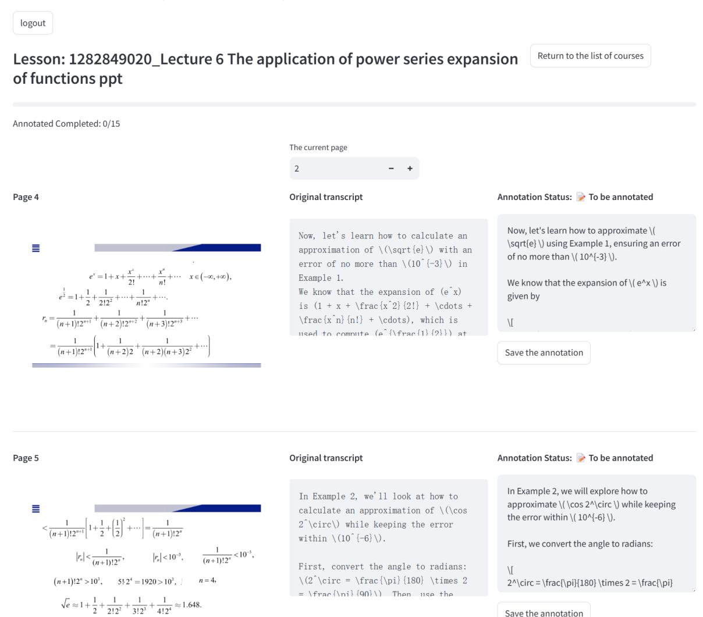
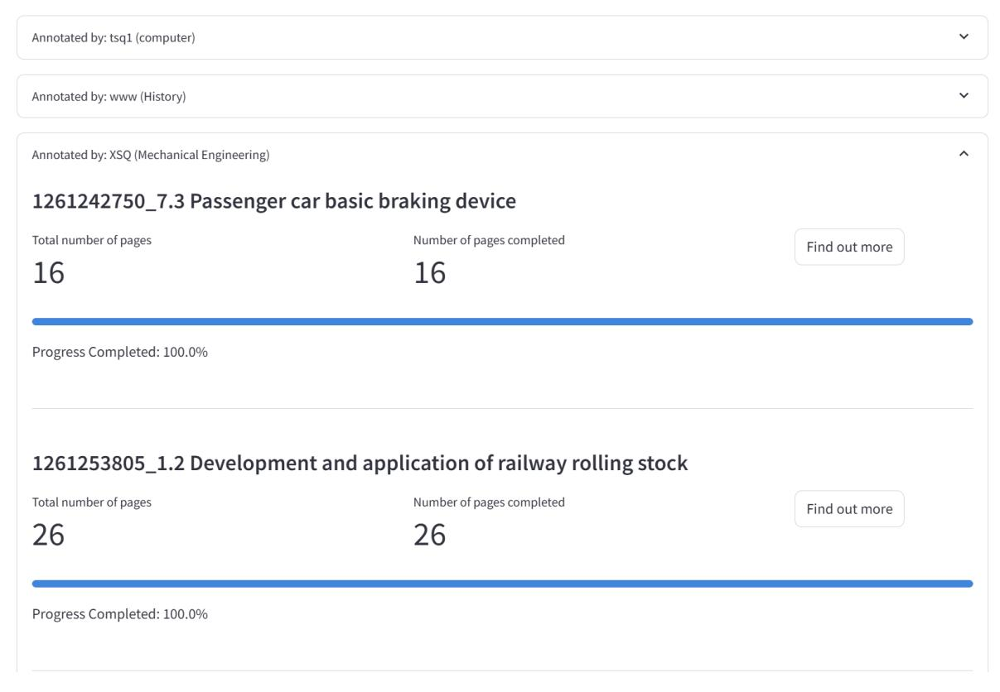
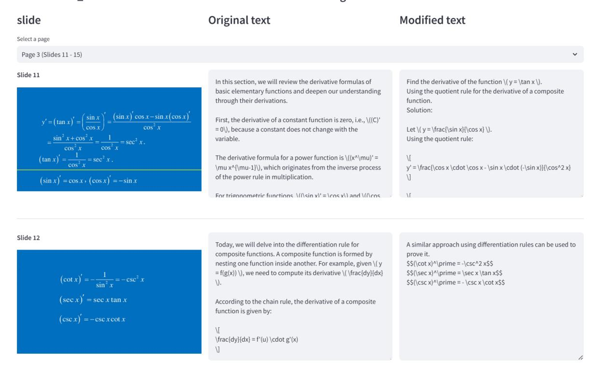
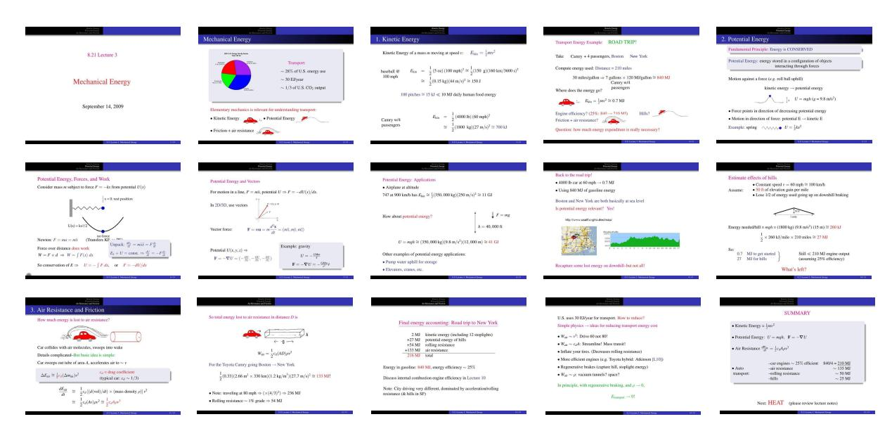

# C Annotation Details

### C.1 Annotation Platform

Our annotation platform consists of two main pages: annotation page and admin page.

Annotation page. This page provides the core annotation interface for users. As shown in Figure [7,](#page-13-0) after logging in, users first see a course selection interface where they can view available courses in their major. Each course is displayed with a progress bar showing completion status and the total number of annotated pages. After selecting a course, users enter the annotation interface shown in Figure [8,](#page-14-0) where the page is divided into three columns: the lecture slide, original transcript, and annotation area. Users can navigate through slides using pagination controls and save their annotations for each slide individually.

Admin page. This page provides administrative oversight of the annotation process. As shown in Figure [9,](#page-15-0) administrators can monitor annotation progress across all majors and courses, with detailed statistics grouped by annotator's major. The interface displays progress bars and completion rates for each course, helping administrators track the overall project status. When reviewing annotations, administrators can examine both original and modified scripts side by side, as shown in Figure [10.](#page-16-0)

Figure 7: Screenshot of the annotation page (course selection). After logging in, annotators can view available courses in their major, with progress bars showing completion status and the number of annotated pages.

> **[图片提取文字 (无描述)]:**
> logout Return to the list of courses Lesson: 1282849020\_Lecture 6 The application of power series expansion of functions ppt Annotated Completed: 0/15 The current page 2 Annotation Status: > To be annotated Original transcript Page 4 Now, let's learn how to approximate \( Now, let's learn how to calculate an \sqrt{e} \) using Example 1, ensuring an error approximation of \(\sqrt{e}\) with an of no more than  $(10^{-3})$ . error of no more than \((10^{-3}\)) in  $e^x = 1 + x + \frac{x^2}{2!} + \dots + \frac{x^n}{n!} + \dots \quad x \in (-\infty, +\infty),$ Example 1. We know that the expansion of  $(e^x)$  is We know that the expansion of (e'x)  $e^{\frac{1}{2}} = 1 + \frac{1}{2} + \frac{1}{2!2^2} + \dots + \frac{1}{n!2^n} + \dots$ given by is  $(1 + x + \frac{x^2}{2!} + \cdot + + + + \cdot + + \cdot + + \cdot + \cdot + \cdot + \cdot$  $r_n = \frac{1}{(n+1)!2^{n+1}} + \frac{1}{(n+2)!2^{n+2}} + \frac{1}{(n+3)!2^{n+3}} + \cdots$  $\frac{x^n}{n!} + \cdot dots$ , which is 1/ used to compute (e^{\frac{1}{2}}) at  $= \frac{1}{(n+1)!2^{n+1}} \left[ 1 + \frac{1}{(n+2)2} + \frac{1}{(n+2)(n+3)2^2} + \cdots \right]$ Save the annotation Annotation Status: > To be annotated Original transcript Page 5 In Example 2, we will explore how to In Example 2, we'll look at how to approximate \(\cos 2^\circ\) while keeping calculate an approximation of \(\cos the error within  $(10^{-6})$ .  $<\frac{1}{(n+1)!2^{n+1}}\left[1+\frac{1}{2}+\left(\frac{1}{2}\right)^2+\cdots\right]=\frac{1}{(n+1)!2^n}$ 2 \circ\) while keeping the error within  $(10^{-6})$ . First, we convert the angle to radians:  $|r_n| < \frac{1}{(n+1)!2^n}, \qquad |r_n| < 10^{-3}, \qquad \frac{1}{(n+1)!2^n} < 10^{-3},$ First, convert the angle to radians:  $\(2^{\circ} = \frac{\pi}{180} \times 2$  $(n+1)!2^n > 10^3$ ,  $5!2^4 = 1920 > 10^3$ , n=4 $2^{circ} = \frac{\pi^{pi}{180} \times 2 = \frac{\pi^{pi}}{180}}$ = \frac(\ni)(90)\) Then use the  $\sqrt{e} \approx 1 + \frac{1}{2} + \frac{1}{212^2} + \frac{1}{312^3} + \frac{1}{412^4} \approx 1.648.$ Save the annotation

Figure 8: Screenshot of the annotation page (annotation). The page displays the lecture slide (left), original transcript (middle), and annotation area (right). Users can modify transcripts while viewing the corresponding slides and track their annotation status.

> **[图片提取文字 (无描述)]:**
> Annotated by: tsq1 (computer) V Annotated by: www (History) Annotated by: XSQ (Mechanical Engineering) 1261242750\_7.3 Passenger car basic braking device Number of pages completed Total number of pages Find out more 16 16 Progress Completed: 100.0% 1261253805\_1.2 Development and application of railway rolling stock Total number of pages Number of pages completed Find out more 26 26 Progress Completed: 100.0%

Figure 9: Screenshot of the admin page (progress overview). Administrators can monitor annotation progress across different majors, view detailed statistics for each course, and track overall completion status.

> **[图片提取文字 (无描述)]:**
> sh - 1286008270 Derivative of Functions courseware

> **[图片提取文字 (无描述)]:**
> Modified text slide Original text Select a page Page 3 (Slides 11 - 15) Slide 11 In this section, we will review the derivative formulas of Find the derivative of the function  $(y = \tan x)$ . basic elementary functions and deepen our understanding Using the quotient rule for the derivative of a composite through their derivations. function. Solution:  $y' = \left(\tan x\right)' = \left(\frac{\sin x}{\cos x}\right)' = \frac{\left(\sin x\right)'\cos x - \sin x\left(\cos x\right)'}{\cos^2 x}$ First, the derivative of a constant function is zero, i.e., \((C)' = 0\), because a constant does not change with the Let  $(y = \frac{\sin x}{\cos x})$ .  $= \frac{\sin^2 x + \cos^2 x}{\cos^2 x} = \frac{1}{\cos^2 x} = \sec^2 x.$ variable. Using the quotient rule:  $(\tan x)' = \frac{1}{\cos^2 x} = \sec^2 x$ . The derivative formula for a power function is  $((x^{mu})' =$ \mu x^{\mu-1}\), which originates from the inverse process  $y' = \frac{x \cdot (\cos x \cdot \sin x \cdot (-\sin x)}{(\cos^2 x)}$  $(\sin x)' = \cos x \cdot (\cos x)' = -\sin x$ of the power rule in multiplication. For trigonometric functions  $\langle (/\sin x)' = \cos x \rangle$  and  $\langle (/\cos x)' = \cos x \rangle$ Slide 12 Today, we will delve into the differentiation rule for A similar approach using differentiation rules can be used to composite functions. A composite function is formed by prove it. nesting one function inside another. For example, given \( \( \forall \) \$\$(\cot x)^\prime = -\csc^2 x\$\$ =  $f(g(x)) \)$ , we need to compute its derivative  $\ (\frac{dy}{dx})$  $\sc x^n = \sec x \tan x$  $\left(\cot x\right)' = -\frac{1}{\sin^2 x} = -\csc^2 x$ 1).  $$$(\csc x)^p = -\csc x \cot x$  $(\sec x)' = \sec x \tan x$ According to the chain rule, the derivative of a composite function is given by:  $(\csc x)' = -\csc x \cot x$  $\frac{dy}{dx} = f'(u) \cdot dot g'(x)$ V

Figure 10: Screenshot of the admin page (review interface). Reviewers can examine both original and modified scripts side by side.

## C.2 Annotation Guidelines

## Guidelines for the data annotators:

- 1. Click on "Register" in the left bottom part of the annotation page if this is the first time that you enter our system. You should choose your major, username and password during registration. We will assign annotation tasks according to your major. You can return to the annotation page and login via your username and password.
- 2. After logging in, you will see a list of PPTs that require modifications to the presentation scripts. Click on "Start Annotating" to proceed.
- 3. After opening a PPT, you will see the original script for each slide. These scripts are generated by AI and may have issues such as factual errors, missing information from the PPT, irrelevance to the topic, awkward phrasing, or repetitive wording. Your task is to edit the script for each slide in the "Annotation Area." After making your changes, click on "Save Annotations."
- 4. Note that this is a one-way system. If you press the browser's back button, the login process will restart (there are only three pages: login, list, and annotation). If you want to return to the list page from the annotation page, you can click on "Return to Course List" at the top. Remember to save your annotations promptly after completing them! Click "Save Annotations" immediately after finishing your annotations! If the PPT is not clear enough, you can use the button at the top-right corner of the image to enlarge it to full screen.
- 5. If you have finished marking a PPT, you can contact us for acceptance inspection. We will check each page for the following:
- Whether there are factual errors.
- Whether too much information from the PPT is missing in the script.
- Whether the content is irrelevant to the topic.
- Whether the sentences are awkward or not smooth.
- Whether there is repetitive wording.
- 6. Compensation:
- If every page of the PPT passes the acceptance inspection, you will receive a base payment of 80 CNY for each PPT.
- If a PPT fails the acceptance inspection three or more times, each subsequent failure will result in a deduction of 20 CNY from the payment, to compensate for the time spent by the inspector.
- If the original script of the PPT is empty on six or more pages, and the PPT passes the acceptance inspection, you will receive an additional 20 CNY in compensation for the time spent by the annotator in writing the script from scratch.

After reading the above requirements, start data annotation now!

## C.3 Data Collection Cost

We spend approximately 7,000 CNY on human correction data collection.

## D More Evaluation Details

## D.1 Evaluation Setting

In the Image + VLM setting, we set the generation sampling parameters to max\_new\_tokens=8192. In the Caption + LLM setting, for the first model call where we use gpt-4o for generating the caption, we set max\_new\_tokens=1024. For the following model call where the LLM outputs the final response for the writing instruction and caption, we set max\_new\_tokens=8192 except for claude-3-opus, which we set max\_new\_tokens=4096.

## D.2 Evaluation Prompts

Prompt for gpt-4o on generating caption for the *Caption + LLM* setting.

Please provide a detailed and comprehensive description of the image, paying special attention to both visual elements and textual content. Consider the following aspects:

- 1. Main Subject(s):
- What are the primary objects, people, or figures in the image?
- Their positioning, size, and prominence
- Any diagrams, charts, or graphical elements
- 2. Textual Content:
- All text visible in the image, including:
- \* Headers, titles, or captions
- \* Labels or annotations
- \* Body text or paragraphs
- \* Numbers, equations, or mathematical notation
- The relationship between text and visual elements
- 3. Visual Details:
- Colors, lighting, and overall composition
- Textures and materials visible
- Any notable patterns, designs, or visual hierarchies
- Quality and clarity of text/figures
- 4. Information Structure:
- How information is organized (e.g., flowcharts, tables, lists)
- Connections or relationships indicated by arrows or lines
- Legend or key elements if present
- Reading order or flow of information
- 5. Technical Elements:
- Presence of graphs, charts, or scientific figures
- Any coordinate systems or axes
- Units of measurement or scales
- Technical symbols or notation
- 6. Context and Purpose:
- The apparent purpose of the image (educational, technical, decorative, etc.)
- Target audience or field of study
- Any relevant domain-specific context

Please provide a clear, structured description that captures both the visual and textual elements, ensuring no significant details are omitted.

### Prompt for LLMs on generating response for the *Caption + LLM* setting.

Please analyze the following image captions and writing requirement carefully, then provide a detailed response that:

- 1. Directly addresses the writing requirement
- 2. Incorporates relevant details from the image captions
- 3. Uses clear, well-structured writing
- 4. Maintains appropriate tone and style for the context

Writing requirement: {*User Instruction*}

Image captions: {*CAPTIONS*}

Please provide a comprehensive response that fully satisfies the writing requirement while effectively utilizing the information from the image captions.

## Prompt for gpt-4o on scoring the quality of responses.

You are an expert in evaluating text quality. Please evaluate the quality of an AI assistant's response to a user's writing request with several corresponding images. Be as strict as possible.

You need to evaluate across the following six dimensions, with scores ranging from 1 to 5. The scoring criteria from 5 to 1 for each dimension are as follows:

- 1. Relevance: From content highly relevant and fully applicable to the user's request and images to completely irrelevant or inapplicable.
- 2. Accuracy: From content completely accurate with no factual errors or misleading information to content with numerous errors and highly misleading.
- 3. Coherence: From clear structure with smooth logical connections to disorganized structure with no coherence.
- 4. Clarity: From clear language, rich in detail, and easy to understand to confusing expression with minimal details.
- 5. Breadth and Depth: From both broad and deep content with a lot of information to seriously lacking breadth and depth with minimal information.
- 6. Reading Experience: From excellent reading experience, engaging and easy to understand content to very poor reading experience, boring and hard to understand content.

Please evaluate the quality of the following response to a user's request according to the above requirements.

<User Request>

{*INST*}

</User Request>

<Response>

{*RESPONSE*}

</Response>

Please evaluate the quality of the response. You must first provide a brief analysis of its quality, then give a comprehensive analysis with scores for each dimension. The output must strictly follow the JSON format: "Analysis": ..., "Relevance": ..., "Accuracy": ..., "Coherence": ..., "Clarity": ..., "Breadth and Depth": ..., "Reading Experience": .... You do not need to consider whether the response meets the user's length requirements in your evaluation. Ensure that only one integer between 1 and 5 is output for each dimension score.

### D.3 Deployment Details

All the experiments were conducted on an Ubuntu 20.04.4 server equipped with 104 Intel Xeon(R) Platinum 8470 CPU cores, and graphic cards that contained 8 NVIDIA A800 SXM 80GB GPUs. Besides, the CUDA version is 12.2. The supervised fine-tuning (SFT) phase for LongWriter-V-7B on the LongWrite-V-22k dataset took approximately six hours using 8 GPUs. For the LongWriter-V-72B model, the SFT process required 72 hours with the same GPU configuration. The Direct Preference Optimization (DPO) process for LongWriter-V-7B, using 2,844 mixed preference pairs, completed in 1.5 hours.

#### D.4 Case Study

> **[图片提取文字 (无描述)]:**
> Mechanical Energy 2. Potential Energy 1. Kinetic Energy Transport Energy Example: ROAD TRIP! Pantagorial Principle: Tourgy is CONNERVED Kinetic Energy of a mass or moving at speed  $v_1 = E_{\text{kin}} = \frac{1}{3} m v^2$ 8.21 Lecture 3 SECTION AND DESCRIPTIONS Take Carery + 4 passengers, Boston New York: Potential Energy: energy stored in a configuration of objects Transport interacting through forces Compute energy used: Distance = 210 rates baseball 8:  $E_{\rm ini} = \frac{1}{4} (5 \, es) (100 \, {\rm mph})^2 \approx \frac{1}{4} (150 \, {\rm g}) (160 \, {\rm km}/3600 \, s)^2$ ~ 28% of U.S. energy use 30 miles/gallon to T gallons × 120 Mb/gallon ≈ 840 MJ ~ 50 EDwar Motion against a force (e.g. roll hall upfall) Mechanical Energy  $\approx \frac{1}{2}(0.15 \text{ kg})(44 \text{ m/s})^2 \approx 150 \text{ J}$ Carrry will ~ 1.3 of U.S. CO: cetest passengers kinetic energy -- potential energy Where does the energy go? 100 pixhes = 15 kJ -c; 10 MJ daily human food energy . U = mgh (g = 9.8 m/s) \_\_\_\_\_\_\_\_\_\_\_\_\_\_\_\_\_\_\_\_\_\_\_\_\_\_\_\_\_\_\_\_\_\_\_\_\_ September 14, 2009 Elementary mechanics is referred for understanding transport. · Force points in direction of decreasing potential energy Engine officiency? (25%: 846-250 Mf) BBIG? Ebin = \frac{1}{2} (4000 fe) (60 mpb)2 Kinetic Energy ... • Potential Energy ... Motion in direction of force: potential E — kinetic E Friction + sir resource? Cenry w/4 passengers  $\approx -\frac{1}{4}(1800 \text{ kg})(27 \text{ m/s})^7 \approx 300 \text{ kg}$ Excepts: spring  $\wedge \wedge \wedge \wedge \bullet U = \frac{1}{2}kr^2$ . Question: how much energy expenditure is mally necessary? Friction + air resistance Back to the mal trip! Estimate effects of hills Potential Energy, Forces, and Work Potential Energy: Applications Potential Energy and Vectors 4000 b car at 60 mph → 0.7 MJ. Constant speed v = 60 mph ≈ 100 km/h Consider mass we subject to force  $F = -4\pi$  from potential U(x)· Airplane at altitude . 50 ft of elevation usin per mile . Using 840 MJ of assoline energy For motion in a line,  $F=a \bar{a} \bar{a}$ , potential  $U \Rightarrow F=-dU(x)/dx$ . . Lose 1/2 of energy used going up on downhill braking  $747 \text{ at } 900 \text{ km/s} \text{ has } E_{\text{lat}} \cong \{(390,000 \text{ kg})(290 \text{ m/s})^2 \cong 11 \text{ GJ} \}$ x = 0 not position Boston and New York are both busically at sea level In 20/30, use vectors ~~~ Is potential energy relevant? Yes! \$ F - mg How about potential energy? Mp turns sealf organizations  $\mathbf{F} = \mathbf{e}\mathbf{u} = \mathbf{e}\mathbf{e}\frac{d^2\mathbf{x}}{dt} = (\mathbf{e}\mathbf{x}^{\dagger}, \mathbf{e}\mathbf{x}^{\dagger}, \mathbf{e}\mathbf{x}^{\dagger})$  $A = 40,000 \, \mathrm{ft}$ Energy needed/sill =  $sigh = (1800 \log ) (9.8 \text{ m/s}^2) (15 \text{ m}) \approx 260 \text{ M}$ Morrow Income × 260 kJ/mile × 210 miles ≈ 27 MJ Newton: F = 100 = 201 (Transfers KF -- 700)  $U = \log 6 \cong (350,000 \text{ kg})(9.8 \text{ m/s}^2)(12,000 \text{ m}) \cong 41 \text{ GH}$ Count S-rest-FS Example: gravity Force over distance does work Potential  $U(x,y,z) \Rightarrow$  $E_k + U = const. \Rightarrow \frac{d_k}{d_k} = -F\frac{d_k}{d_k}$ 0.7 MJ to get started Still << 210 MJ engine output  $W - F \times d \Rightarrow W - \int F(x) dx$ Other examples of potential energy applications: F------------------------------------27 Mil for hills (assuraing 25% efficiency) . Pump water upbill for storage  $\mathbf{F} = -\nabla U = -600 \epsilon$ So conservation of E == 17 - 17 - 17 or F == -111/dr Recapture some hot energy on dewedill-but not all! + Elevators, crames, etc. What's left? 3. Air Resistance and Friction SUMMARY So total energy lost to air notistance in distance D is U.S. uses 30 EWyear for transport. How to induce? How much energy is list to air missiance? Final energy accounting: Road trip to New York. . Kinetic Energy is last? Simple physics -- lakes for reducing transport energy cost 2 MJ kinetic energy (including 12 stoplights) Wer ~ r2: Drive 60 not 80! Potential Energy: U = mgk, F = −∇U +27 MJ powerful energy of hills • Was - c.A: Streamline! Mass transit! +54 MJ rolling resistance Car collides with air molecules, weeeps into wake Air Resistance \* - leader\* +133 MJ streenstance . Inflate your tires. (Decreases soling resistance) Depth countered-list base idea is strede. 216-50 total . More efficient engines (e.g. Toyota hybrid: Atkinson (1.10)) Car sweeps out tabe of area A, accelerates air to  $\sim \tau$ For the Toyota Carry going Boston - New York. -cur engines ~ 25% efficient 8404 = 210 MJ Energy in gasoline: 840 MJ, energy efficiency ~ 25% · Regenerative brakes (capture hill, stoplight energy) Appr. ~ 135 MI -last reconsistance to a drag cooliniest Wstr ~ or sociam timels? seace? transport: -colling resistance - 50 MI  $\Delta E_{as} = \{r_2(\Delta m_d)r^2$  $\frac{1}{2}(0.33)(2.66 \text{ m}^2 \times 330 \text{ km})(1.2 \text{ kg/m}^2)(27.7 \text{ m/s})^2 \approx 133 \text{ MH}$ (terical care to ~ 1/3). Discuss internal combustion engine efficiency in Lecture 10. -6De ~ 25 MJ In principle, with regonerative broking, and  $\mu = 0$ , Note: City driving very different, dominated by acceleration/tolling  $\frac{dE_{ab}}{dt} \equiv \frac{1}{2}\epsilon_{d}[(d(vol)/dt) \times (mass density, p)]r^{2}$ • Note: traveling at 80 mph  $\Rightarrow (\times (4/3)^2) \Rightarrow 236$  MJ polytopec (& billy in SF) F------------------------------------- $\equiv \frac{1}{4}c_0(4\epsilon)\mu^2 \equiv \frac{1}{4}c_0(\mu^4)$ • Rolling resistance -- 1% grade -> 54 MJ Next HEAT (please review lecture notes)

Figure 11: Input images of the example for the PPT script generation task.

To illustrate the actual outputs of our tested models, we select a case from MMLongBench-Write. As shown in Figure 11, this case includes 15 input images. The instruction for this case is as follows: "Write a 3000-word lecture script based on these PPT images. The script should be suitable for a teacher to read aloud in class and must not contain any unreadable content. It should align with the teaching goals of the PPT without merely repeating its content. The script should be clear, well-structured, and possess educational and inspirational value. Please output the script directly, without additional content such as subtitles or questions, and ensure it is fully readable." We present the responses from GPT-4o-2024-08-06, LongWriter-V-72B, and LongWriter-V-7B-DPO below:

#### Response of GPT-40-2024-08-06:

Ladies and gentlemen, welcome to today's lecture on Mechanical Energy. Our focus will be on understanding the fundamental concepts of kinetic energy, potential energy, and the roles of air resistance and friction. These concepts are not just theoretical; they have practical implications in our daily lives, especially in the context of transportation.

Let's begin by considering the significance of transportation in energy consumption. In the United States, transportation accounts for approximately 28% of total energy use, which translates to about 30 exajoules per year. This sector also contributes to one-third of the country's CO2 emissions. Understanding the mechanics behind transportation can help us devise strategies to reduce energy use and emissions.

First, let's delve into kinetic energy, which is the energy of motion. The formula for kinetic energy is  $E_{\rm kin}=\frac{1}{2}mv^2$ , where m is mass and v is velocity. Consider a baseball thrown at 100 mph; its kinetic energy is around 150 joules. While this is a small amount of energy, it illustrates the concept effectively. Now, imagine a car like a Toyota Camry with four passengers moving at 60 mph. The kinetic energy here is approximately 700 kilojoules, demonstrating how energy scales with mass and velocity.

Let's explore a practical example: a road trip from Boston to New York, a distance of 210 miles. Suppose the car in question achieves 30 miles per gallon and consumes 7 gallons of fuel for the trip, equating to 840 megajoules of energy. However, not all this energy is used for motion. The kinetic energy required is only about 0.7 megajoules. So, where does the rest of the energy go? Factors like engine efficiency, air resistance, and friction play significant roles.

Next, we'll explore potential energy, which is stored energy based on an object's position or configuration. A fundamental principle here is energy conservation: energy cannot be created or destroyed,

only transformed. Consider a ball rolling uphill; kinetic energy is converted into potential energy. The potential energy, U, is given by U=mgh, where g is the acceleration due to gravity, and h is height. Springs are another example, where potential energy is stored as  $U=\frac{1}{2}kx^2$ .

Now, let's consider potential energy in the context of forces and work. For a mass subject to a force, the work done is the force multiplied by the distance moved. This work results in energy transfer, such as converting potential energy to kinetic energy. In vector terms, for motion in a line, force is related to potential energy by  $F = -\frac{dU}{dx}$ .

Let's apply these concepts to real-world scenarios. Consider an airplane cruising at altitude; its kinetic energy is significant. But potential energy also plays a crucial role, especially at high altitudes. Other applications include using potential energy to pump water uphill or using elevators and cranes.

Returning to our road trip example, we must consider the potential energy effects of hills. A constant speed of 60 mph with elevation gains requires additional energy. Suppose the car gains 50 feet per mile; the energy needed per hill becomes substantial. Despite this, the total energy for hills remains less than the energy output from the engine, highlighting the inefficiency of energy conversion in transportation.

Air resistance and friction are also critical factors in energy consumption. As a car moves, it collides with air molecules, creating a wake. This interaction results in energy loss, calculated using the drag coefficient. For example, a Toyota Camry traveling from Boston to New York loses a considerable amount of energy to air resistance. The drag force depends on factors like speed and surface area, and reducing these can improve efficiency.

Finally, let's summarize our findings. The total energy expenditure for our road trip includes kinetic energy, potential energy of hills, rolling resistance, and air resistance. The gasoline energy far exceeds these values, illustrating the inefficiency of internal combustion engines, which are only about 25% efficient. This inefficiency is even more pronounced in city driving, where acceleration and rolling resistance dominate.

To reduce transport energy costs, we can apply simple physics principles. Driving at lower speeds, streamlining vehicles, inflating tires, using more efficient engines, and employing regenerative braking are effective strategies. In an ideal world, with these measures and advanced technologies like vacuum tunnels, we could drastically reduce transport energy expenditure.

In conclusion, understanding mechanical energy, particularly in transportation, provides insights into improving energy efficiency and reducing environmental impact. As we continue to innovate and apply these principles, we move closer to a more sustainable future.

Thank you for your attention. Please review your lecture notes in preparation for our next topic: Heat.

#### **Response of LongWriter-V-72B:**

- 1. Today, we delve into mechanical energy, a crucial topic in physics with broad applications, especially in transportation. The U.S. dedicates nearly 28% of its energy to transport, amounting to about 30 exajoules annually and contributing to a third of the nation's CO2 emissions. Grasping this impact is essential for developing sustainable solutions. We'll examine how kinetic and potential energy, along with friction and air resistance, shape transport dynamics. This understanding not only illuminates our current energy use but also fuels innovation for future efficiency. As we proceed, reflect on how these principles connect to real-world challenges and inspire advancements in energy conservation.
- 2. Building on our introduction to mechanical energy, let's examine its pivotal role in transportation. The U.S. dedicates around 28% of its energy to this sector, which consumes approximately 30 exajoules annually and accounts for a third of the country's CO2 emissions. This underscores the necessity for sustainable practices. To tackle these challenges, we must understand kinetic and potential energy, as well as friction and air resistance. Kinetic energy is the energy of motion, while potential energy is stored energy with the potential to perform work. Friction and air resistance are forces that impede motion, impacting energy efficiency. Grasping these concepts is crucial for

optimizing transportation systems. As we delve deeper, consider how these principles can inform innovations in energy conservation and efficiency, driving progress toward a more sustainable future.

3. Let's delve into kinetic energy, the energy a moving object possesses. The formula for kinetic energy is  $E_{\rm kin}=\frac{1}{2}mv^2$ , where m represents mass and v represents velocity. This equation reveals that kinetic energy is proportional to an object's mass and the square of its speed.

Consider a baseball traveling at 100 mph. Its kinetic energy is approximately 150 joules. Now, think about a Camry carrying four passengers moving at 60 mph; its kinetic energy jumps to around 700 kilojoules. This comparison illustrates how both mass and velocity significantly affect kinetic energy. To further clarify, let's examine the energy needed for 100 pitches of a baseball. This amounts to about 15 kilojoules, a small fraction of the 10 megajoules of energy a person typically consumes daily through food.

These examples highlight the importance of understanding kinetic energy in various contexts, from sports to transportation. As we proceed, consider how these principles apply to real-world scenarios and how they can inform innovations in energy efficiency and sustainability.

4. Let's delve into a real-world application of energy principles by considering a road trip from Boston to New York in a Camry with four passengers. This 210-mile journey requires about 7 gallons of gasoline, equating to roughly 840 megajoules of energy. But where does this energy go?

Firstly, kinetic energy is a factor; a 4000-pound car at 60 mph possesses about 0.7 megajoules of kinetic energy. Yet, this is a small portion of the total energy used. We must also consider the engine's efficiency, typically around 25%, meaning much of the energy is lost as heat.

Moreover, friction and air resistance play significant roles. These forces oppose the car's motion, necessitating additional energy to maintain speed. Climbing hills further increases energy demands, converting kinetic energy into potential energy.

This scenario prompts us to question the necessity of such energy expenditures. Are there ways to optimize our vehicles and driving habits to enhance efficiency? Reflect on how understanding these principles can lead to more sustainable practices in transportation. By grasping where energy is utilized and wasted, we can explore innovative solutions to reduce consumption and environmental impact.

5. Now, let's turn our attention to potential energy, a fundamental idea in physics. It represents stored energy within a system, ready to perform work. The principle of energy conservation is key here: energy cannot be created or destroyed, only transformed from one form to another.

Consider lifting an object; as it ascends, its kinetic energy converts into potential energy, expressed as U = mgh, where m is mass, g is gravitational acceleration, and h is height. This potential energy can revert to kinetic energy if the object falls.

A practical example is a compressed spring. The energy you expend to compress it becomes potential energy,  $U = \frac{1}{2}kx^2$ , with k as the spring constant and x as the displacement. When released, this energy transforms back into kinetic energy.

Understanding potential energy is vital for analyzing systems and predicting motion. It enables us to calculate energy transformations and optimize processes, from elevators to water pumps. Reflect on how these concepts apply to everyday technologies and how they might inspire innovations in energy storage and efficiency.

6. Building on our understanding of potential energy, let's explore its relationship with forces and work. When an object is displaced in a potential field, like gravity or a spring, a force acts upon it. This force is derived from the potential energy gradient, expressed as  $F = -\frac{dU}{dx}$ , where U is potential energy and x is position.

Work is done when a force moves an object over a distance, quantified as  $W = F \times d$ . In the context of potential energy, this work equates to the change in potential energy,  $\Delta U$ . For instance, lifting an object increases its gravitational potential energy, while compressing a spring increases its elastic potential energy.

These concepts are crucial in physics, as they enable us to analyze and predict system behavior. By understanding the forces and work involved, we can optimize energy use in various applications, from

designing efficient machines to developing renewable energy systems. Consider how these principles apply to real-world scenarios and inspire innovations in energy efficiency and sustainability.

7. Expanding on our discussion, let's delve into potential energy in two and three dimensions using vectors. In 2D and 3D spaces, potential energy becomes a function of multiple variables, such as U(x, y, z).

The gradient of potential energy, denoted as ∇U, is a vector that points in the direction of the greatest increase in potential energy. The force acting on an object can be derived from this gradient, expressed as F = −∇U. The negative sign indicates that the force acts in the direction of decreasing potential energy.

For example, in a gravitational field, the potential energy is given by U = − GMm r , where G is the gravitational constant, M and m are masses, and r is the distance between them. The corresponding force is F = −∇U = − GMm r 2 ˆr, which is the familiar inverse-square law of gravity.

Understanding these vector relationships is essential for analyzing complex systems, such as planetary motion or electromagnetic interactions. It allows us to predict and explain the behavior of objects under various forces, inspiring innovations in fields like robotics and aerospace engineering. Reflect on how these principles apply to real-world technologies and consider their potential to drive future advancements.

8. Let's delve into the practical applications of potential energy, beginning with aircraft. At cruising altitude, a 747 carries substantial potential energy, calculated as U = mgh, where m is the aircraft's mass, g is gravitational acceleration, and h is its height. For a 747 at 40,000 feet, this equates to about 41 gigajoules.

Potential energy is also pivotal in energy storage systems. Pumped-storage hydroelectricity is a prime example, where water is pumped uphill to a reservoir during off-peak hours. When demand rises, the water is released to generate electricity, effectively converting stored potential energy into kinetic energy, which then powers turbines.

In urban settings, potential energy is harnessed in elevators and cranes. Elevators utilize counterweights to minimize energy consumption during vertical movement, while cranes employ potential energy to lift heavy loads efficiently.

These examples underscore the significance of potential energy in modern engineering and its role in sustainable energy solutions. Reflect on how these principles can inspire innovations in energy efficiency and storage, contributing to a greener future.

9. Let's revisit our road trip scenario to delve into the role of potential energy. Even though Boston and New York are at sea level, the journey between them involves elevation changes that significantly impact energy consumption.

As you ascend hills, your vehicle converts kinetic energy into potential energy, stored due to increased height. This process demands extra energy, which is then partly recovered as you descend, converting potential energy back into kinetic energy. However, not all energy is recaptured due to losses from friction and air resistance.

Understanding these dynamics is vital for optimizing vehicle efficiency. By analyzing elevation profiles, we can better predict energy requirements and improve fuel economy. This knowledge not only enhances road trip efficiency but also informs the development of smarter navigation systems and more fuel-efficient vehicles.

Consider how these principles might be applied to other modes of transport, such as trains or ships, to reduce energy usage and environmental impact. Reflect on potential innovations that could further minimize energy loss, contributing to sustainable transportation solutions.

10. To estimate the energy impact of hills during a road trip, consider a car traveling at a steady 60 mph, encountering a 50-foot elevation gain per mile. This incline necessitates additional energy to elevate the vehicle, calculated using the potential energy formula U = mgh, where m is the car's mass, g is gravitational acceleration, and h is the height increase.

For a 1800 kg car, the energy required to climb each hill is approximately 260 kJ. Over a 210-mile trip, this accumulates to about 27 MJ. However, descending the hills doesn't fully recover this energy due to energy losses from braking and friction.

These calculations highlight the significant energy demands of hilly terrains. By understanding these dynamics, we can develop strategies to optimize fuel efficiency, such as using regenerative braking systems to capture energy during descents.

Reflect on how this knowledge can inform route planning and vehicle design to enhance efficiency and sustainability. Consider potential innovations that could further minimize energy loss, contributing to a greener future in transportation.

11. Now, let's delve into the impact of air resistance on vehicle energy efficiency. As a car moves, it displaces air molecules, creating drag that reduces efficiency. The energy lost to air resistance can be calculated using the formula ∆Eair = 1 2 cd(∆mair)v 2 , where cd is the drag coefficient, ∆mair is the mass of displaced air, and v is the velocity.

For a typical car traveling at 60 mph, this results in a substantial energy loss. The loss increases with the square of the velocity, meaning higher speeds lead to significantly greater energy expenditure. For instance, a Toyota Camry traveling from Boston to New York at 60 mph loses about 133 MJ to air resistance, but this increases to 236 MJ at 80 mph.

Understanding these dynamics is crucial for enhancing vehicle efficiency. Designing more aerodynamic vehicles with lower drag coefficients can mitigate these losses. Additionally, maintaining optimal speeds can drastically improve fuel efficiency.

Reflect on how these principles can be applied to everyday driving to reduce energy consumption and environmental impact. Consider potential innovations in vehicle design and technology that could further minimize air resistance and contribute to sustainable transportation solutions.

12. Let's delve deeper into the energy lost to air resistance during a road trip. For a Toyota Camry traveling from Boston to New York at 60 mph, approximately 133 MJ is lost to air resistance. This significant amount highlights the impact of aerodynamics on fuel efficiency.

Increasing speed exacerbates this issue. At 80 mph, the energy loss rises to about 236 MJ, demonstrating that higher speeds demand more energy to overcome air resistance. This is because the energy loss is proportional to the square of the velocity.

In addition to air resistance, rolling resistance also plays a role. This is the energy lost due to tire deformation and road friction. For a typical car, rolling resistance can account for around 54 MJ over the same distance.

Understanding these factors is crucial for improving vehicle efficiency. Designing more aerodynamic vehicles and maintaining optimal speeds can significantly reduce energy loss. Keeping tires properly inflated is another simple yet effective way to minimize rolling resistance.

Reflect on how these principles can be applied to everyday driving to enhance efficiency and reduce environmental impact. Consider potential innovations in vehicle design and technology that could further mitigate these energy losses, contributing to sustainable transportation solutions.

13. Now, let's wrap up our energy analysis for the road trip from Boston to New York. We start with kinetic energy, about 2 MJ, accounting for stops along the way. Then, there's the 27 MJ for potential energy, spent on climbing hills. Rolling resistance adds another 54 MJ, and air resistance claims a significant 133 MJ. Altogether, these factors total 216 MJ of energy used.

However, the gasoline used provides 840 MJ, indicating an overall efficiency of roughly 25%. This means only a quarter of the fuel's energy is utilized for motion, with the rest lost as heat and other inefficiencies.

This analysis underscores the inefficiencies in automobile energy usage. By grasping these components, we can pinpoint areas for improvement. For instance, enhancing aerodynamics, reducing rolling resistance, and optimizing vehicle weight can boost efficiency.

Reflect on how these insights can inform future innovations in vehicle design and technology. Consider how better understanding these dynamics can lead to more sustainable and efficient transportation solutions, reducing our environmental impact.

14. To enhance transport efficiency, we can apply fundamental physics principles. Reducing air resistance is key, as it significantly impacts energy consumption. By traveling at lower speeds—opting for 60 mph instead of 80 mph—we diminish drag and boost fuel efficiency. Streamlined vehicle designs also help cut through air more effortlessly.

Public transportation offers another efficient alternative, as buses and trains inherently possess lower per capita drag. Maintaining vehicles with properly inflated tires is crucial, as it reduces rolling resistance and conserves energy.

Innovative technologies, like regenerative braking, capture energy during braking, which can be reused, enhancing overall efficiency. This technology is particularly effective in stop-and-go traffic, maximizing energy savings.

Looking ahead, concepts such as vacuum tunnels and magnetic levitation could revolutionize transportation by drastically reducing air and rolling resistance. While these ideas are futuristic, they demonstrate the potential for significant advancements in energy efficiency.

Reflect on how these principles and innovations might be integrated into everyday travel. Consider their role in reducing environmental impact and fostering sustainable transportation solutions.

15. In conclusion, we've delved into the core concepts of mechanical energy, emphasizing kinetic and potential energy, and the effects of air resistance and friction. These elements are pivotal in understanding energy consumption in transportation.

We learned that kinetic energy, calculated as  $\frac{1}{2}mv^2$ , is essential for vehicle motion. Meanwhile, potential energy, expressed as mgh, becomes significant when navigating hills or elevated terrains. Air resistance, quantified by  $\frac{1}{2}c_dA\rho v^2$ , plays a crucial role in energy efficiency, especially at higher speeds. Minimizing this resistance can markedly enhance fuel economy.

Our energy analysis of a road trip revealed that out of the 840 MJ provided by gasoline, only 216 MJ is used for motion, highlighting the need for more efficient engines and innovative technologies.

Looking ahead, we'll explore the concept of heat and its impact on energy systems. I encourage you to review your lecture notes and reflect on how these principles can be applied to real-world challenges. Thank you for your attention, and I look forward to continuing our exploration of physics in the next session.

## Response of LongWriter-V-7B-DPO:

## \*\*1. Kinetic Energy\*\*

Let's continue our exploration of mechanical energy by examining kinetic energy, an essential element of transportation. The formula for kinetic energy is  $E_{\rm kin}=\frac{1}{2}mv^2$ , where m is the mass and v is the speed. This formula reveals kinetic energy's direct relationship with both mass and velocity squared. Imagine a baseball traveling at 100 mph. Its kinetic energy can be calculated using the formula, revealing the significant energy involved in fast-moving objects. Now, consider a car with four passengers traveling from Boston to New York. The kinetic energy involved in this journey highlights the extensive energy requirements in transportation.

Beyond calculations, understanding kinetic energy's role is vital. It affects how vehicles accelerate, brake, and navigate, influencing both safety and efficiency. Recognizing these dynamics encourages us to critically consider transportation systems' energy use and environmental impact.

As we move forward, think about how kinetic energy considerations might lead to advancements in more efficient and sustainable transport methods. Reflect on the broader implications for energy use and conservation in our daily lives.

#### \*\*2. Mechanical Energy\*\*

Transportation is a major player in the U.S. energy scene, using up about 28% of the nation's energy resources. In 2001, transportation sector energy consumption was roughly 30 Exajoules annually, accounting for approximately one-third of the U.S. CO2 emissions. Grasping the mechanics of transportation is essential to tackle energy use and environmental concerns effectively.

Within transportation, the kinetic and potential energy involved in vehicles' movement are crucial. Kinetic energy relates to moving vehicles, impacting acceleration, speed, and braking. In contrast, potential energy arises from height or position, like when a car climbs a hill. Both types of energy are interwoven with the forces of friction and air resistance, which dissipate energy and affect efficiency.

Analyzing these energy forms helps us critically assess the efficiency and sustainability of our transportation methods. As we delve deeper, consider how a solid foundation in these mechanical principles can inspire innovations for a more energy-efficient future. Reflect on the potential to minimize environmental impact while maximizing energy use in transportation systems.

#### \*\*3. Kinetic Energy\*\*

Let's delve deeper into the concept of kinetic energy, which is crucial for understanding transportation. The formula for kinetic energy is  $E_{\rm kin} = \frac{1}{2} m v^2$ , where m is the mass and v is the speed. This formula reveals that kinetic energy is directly proportional to the mass and the square of the velocity.

Imagine a baseball traveling at 100 mph. Its kinetic energy can be calculated to appreciate the energy of fast-moving objects. Now, consider a car with four passengers on a journey from Boston to New York. The kinetic energy involved highlights the significant energy requirements in transportation.

Kinetic energy plays a vital role in transportation by influencing everything from fuel efficiency to emissions. Understanding these energy dynamics encourages critical thinking about how we can enhance transportation systems to make them more efficient and environmentally friendly. Reflect on how these principles might inspire innovations in the design and operation of vehicles.

For instance, think about how reducing a car's mass or modifying its speed can substantively affect its kinetic energy. How might these changes lead to greater fuel efficiency and lower emissions? Grasping these concepts not only enhances appreciation for mechanical principles but also encourages us to envision a sustainable future.

\*\*4. Transport Energy Example: Road Trip\*\*

Let's examine a practical example of transport energy using a road trip from Boston to New York. This journey covers about 210 miles and requires a Camry with four passengers.

To begin, we calculate the energy consumption. The car's fuel efficiency is 30 miles per gallon, and gasoline contains roughly 120 megajoules per gallon. Thus, for this trip, the Camry will consume 7 gallons of gasoline, totaling approximately 840 megajoules of energy.

But where does all this energy go? Part of it is used to overcome kinetic energy—the energy of motion—while the car travels at speeds of around 60 miles per hour. The remaining energy is used to counteract forces like friction and air resistance, which work to slow the car down.

This example prompts us to ponder: Is the full 840 megajoules truly necessary? Are there ways to optimize energy use? By reflecting on these questions, we can explore strategies to enhance efficiency and sustainability in transportation.

Understanding energy expenditure in road trips allows us to critically evaluate transportation systems. It invites us to consider how reducing friction, optimizing speed, and improving fuel efficiency could lead to substantial energy savings. Such insights are vital for developing more sustainable transportation methods.

As we proceed, think about how these principles can be applied to other forms of transport. How might they help us craft a future with lower energy costs and a smaller environmental footprint?

\*\*5. Potential Energy\*\*

Now, let's turn our attention to potential energy, a crucial component of mechanical energy. Potential energy is the energy stored in an object due to its position or configuration. A classic example is a ball placed atop a hill—its height confers potential energy, which can be converted into kinetic energy as it rolls down the hill.

Grasping the conservation of energy is essential. This principle tells us that energy cannot be created or destroyed, only transformed from one form to another. As the ball rolls, its potential energy diminishes, and kinetic energy increases. At the same time, the force of gravity acts upon the ball, driving its descent and converting energy from one form to another.

Another instance is a stretched spring. The potential energy stored in the spring is due to its deformed state. When released, this energy is transferred into kinetic energy as the spring unravels.

These examples illustrate how potential energy manifests and evolves. By exploring these principles, we gain insights into energy efficiency and sustainability. Understanding these dynamics is vital for developing systems that minimize energy waste and maximize output.

As we proceed, think about applying these concepts to technological innovations. How can the principles of potential energy and conservation be harnessed to promote a more sustainable future? Reflect on these possibilities as we delve deeper into the interplay of energy forms.

\*\*6. Potential Energy, Forces, and Work\*\*

Let's delve into the connection between potential energy, forces, and work. Consider a mass m under the influence of a force F = -kx, which is a spring force arising from a potential energy function U(x). The negative sign indicates that the force tends to reduce potential energy.

Newton's second law,  $F = ma = m\ddot{x}$ , describes the force as the mass times its acceleration. This equation reveals how forces influence the motion of objects, altering their kinetic energy.

When a force acts over a distance, it performs work. The work W done by a force is given by  $W = \int F(x) dx$ . In the case of a spring, the work performed equals the change in potential energy,  $W = -\Delta U$ .

Conservation of energy is pivotal. It states that the total energy, the sum of kinetic energy  $E_k$  and potential energy U, remains constant in the absence of external dissipative forces. Mathematically,  $E_k + U = \text{constant}$ . This principle is fundamental in many areas of physics and engineering, as it allows us to analyze complex systems by tracking energy flow and conservation.

Reflect on how these principles can be applied to real-world scenarios, such as oscillating systems or mechanical devices. How can an understanding of forces and potential energy aid in designing more efficient systems? As we proceed, consider these applications and the broader implications for energy efficiency and sustainability.

\*\*7. Potential Energy and Vectors\*\*

Now, let's delve into the role of vectors in potential energy and force expressions. When objects move along a line, we use a one-dimensional vector,  $F = m\ddot{x}$ , to depict the force. This vector form emphasizes the direction and magnitude of the force acting on an object.

In two or three dimensions, we employ three-dimensional vectors to fully capture the force's effect. A three-dimensional vector force is expressed as  $\mathbf{F} = m\mathbf{a} = m\frac{d^2\mathbf{x}}{dt^2} = (m\ddot{x}, m\ddot{y}, m\ddot{z})$ .

The potential energy landscape varies in complexity with dimensions. For a system with a potential energy function U(x,y,z), the force can be expressed as a gradient vector:  $\mathbf{F} = -\nabla U = \left(-\frac{\partial U}{\partial x}, -\frac{\partial U}{\partial y}, -\frac{\partial U}{\partial z}\right)$ .

A key example is gravitational force, given by  $\mathbf{F} = -\nabla U = -\frac{GMm}{r^2}\hat{r}$ . This equation illustrates how gravity acts to decrease potential energy, always pointing towards the center of mass.

Understanding vector representations of potential energy and forces allows us to analyze complex systems, such as planetary orbits and mechanical structures. How can the principles of vector calculus and potential energy aid in solving real-world engineering challenges? Reflect on these applications as we continue to explore the connections between these mathematical concepts and their significance in physics and beyond.

\*\*8. Potential Energy: Applications\*\*

Let's examine some practical applications of potential energy. Consider an airplane at high altitude. The potential energy an airplane possesses is given by U=mgh, where m is the mass, g is the acceleration due to gravity, and h is the height. For a 747 traveling at 900 km/h, this potential energy can reach an impressive 11 gigajoules at an altitude of 40,000 feet.

Potential energy is equally important on a smaller scale. Take, for example, water pumps that lift water uphill to storage tanks. This process converts electrical energy into potential energy, allowing the water to be stored until needed. Similarly, elevators and cranes utilize potential energy to lift loads against gravity, showcasing the versatility of potential energy in both engineering and everyday life. These examples highlight the significance of potential energy in both everyday applications and large-scale industrial processes. Understanding potential energy not only helps in appreciating the efficiency of various machines but also prompts us to think creatively about energy storage and utilization in new technologies.

As we proceed, consider how these principles can be applied to sustainable energy solutions. How

can the understanding of potential energy contribute to developing more efficient energy systems? Reflect on these possibilities as we continue to explore the dynamic interplay between energy forms and their applications in the world around us.

\*\*9. Back to the Road Trip\*\*

Let's return to our road trip scenario, where we calculated an energy expenditure of 840 megajoules for a 4000 lb car traveling at 60 mph from Boston to New York. Both cities are at sea level, so does potential energy play a role here?

Surprisingly, even at sea level, potential energy is significant due to the road's elevation profile. As you travel, the road's elevation changes can alter the car's potential energy. Climbing a hill increases potential energy, while descending allows some energy recapture through kinetic energy.

On our typical road trip, minor elevation changes occur, particularly on highways like I-95, which have noticeable elevation gains. These variations in elevation mean that potential energy is not just a theoretical concept but a practical consideration in energy accounting.

Taking potential energy into account can influence how we approach fuel efficiency. Understanding these energy dynamics encourages us to think critically about optimizing vehicle efficiency and considering the natural landscape's impact on energy use.

As we continue, think about how these principles can be applied to other real-world situations. How can recognizing potential energy help us in everyday activities or in the design of efficient transportation systems? Reflect on these possibilities and their potential to enhance our understanding of energy in the world around us.

\*\*10. Estimate Effects of Hills\*\*

When planning a road trip from Boston to New York, examining the impact of hills on energy use is essential. Even with a constant speed of 60 mph, elevation changes significantly affect a vehicle's energy consumption.

Each mile gained in elevation requires approximately 50 feet of elevation gain. Assuming this scenario, 27 megajoules of energy are needed just to tackle the hills—this calculation is based on the energy cost of climbing a hill, mgh, where m is the mass, g is the acceleration due to gravity, and h is the height gained.

This energy is partly recovered when descending, but not entirely, due to friction and other losses. Thus, some energy is recaptured on the way down, not all of it is regained.

The implications for energy use are noteworthy. Even minor hills can result in a substantial portion of the total energy expenditure during a journey. This highlights the need to consider elevation changes when evaluating energy efficiency in driving.

These calculations encourage critical thinking about route planning and energy efficiency. As we delve deeper into energy use in transportation, think about how overcoming hills affects overall fuel consumption and what strategies could reduce this impact. How might engineering solutions or driving habits be improved to address these challenges?

\*\*11. Air Resistance and Friction\*\*

During a road trip, dealing with air resistance is an inevitable challenge that hampers a car's efficiency. As a vehicle moves, it interacts with air molecules, creating resistance that reduces fuel efficiency. This air resistance, or drag, is calculated using the formula ∆Eair = 1 2 cd(∆mair)v 2 , where cd is the drag coefficient, ∆mair is the mass of air displaced, and v is the velocity of the vehicle.

The drag coefficient varies with a vehicle's design; for typical cars, cd is approximately 1/3. This formula reveals that energy lost to air resistance is directly linked to the vehicle's speed and the density of the air. At higher speeds, the energy loss escalates significantly.

Streamlining a car's design can substantially decrease this energy loss. By reducing the drag coefficient and minimizing surface area, vehicles can cut down on air resistance and improve fuel efficiency. This principle is evident in the aerodynamic designs of modern vehicles.

Understanding these dynamics not only highlights the importance of engineering in enhancing vehicle efficiency but also encourages us to think critically about optimizing energy use in transportation. As we proceed, consider how these principles can be applied to create more sustainable transportation methods. How might these ideas influence the future of car design and other forms of travel? Reflect on these possibilities and their potential to transform our approach to energy efficiency in the coming years.

\*\*12. Total Energy Lost to Air Resistance\*\*

Now, let's delve into the energy lost due to air resistance during a road trip from Boston to New York. Using the formula derived earlier, Wair = 2 cd(AD)ρv2 , we can estimate this energy loss.

The drag coefficient (cd) for a typical car is about 0.33. For a journey of 330 kilometers at a speed of 27.7 meters per second, the total energy lost to air resistance is approximately 133 megajoules.

But how does this stack up with other energy expenditures during the trip? Consider that rolling resistance and hills each consume around 54 and 27 megajoules, respectively. Compared to the 210 megajoules total energy available from the gasoline burned, a significant portion is attributed to air resistance.

This analysis highlights the importance of reducing air resistance to enhance fuel efficiency. Streamlining a car's design, increasing tire pressure, and maintaining a moderate speed can mitigate this energy loss.

Exploring these strategies offers promising avenues to optimize vehicle efficiency. As we wrap up this lecture, think about how these insights might be applied to real-world transportation challenges. How can we harness these principles to foster more sustainable travel options? Reflect on these possibilities and their potential to transform our approach to energy efficiency in the years ahead. \*\*13. Final Energy Accounting\*\*

Let's recap the various energy expenditures during our hypothetical road trip from Boston to New York. We began by accounting for kinetic energy, estimating about 2 megajoules necessary for maintaining speed and managing stoplights.

Adding to this, the energy required to conquer hills amounts to around 27 megajoules, considering an average elevation gain of 50 feet per mile. Rolling resistance also claims approximately 54 megajoules, emulating a 1% grade, while air resistance incurs a substantial 133 megajoules, assuming a constant speed of 60 mph.

The total energy usage for this journey is roughly 216 megajoules. It's crucial to recognize that these calculations are based on a 25% efficient internal combustion engine, with 840 megajoules of gasoline energy consumed during a 330 km trip.

This energy accounting highlights the impact of various factors on fuel efficiency. It directs our attention to optimization possibilities, such as enhancing engine efficiency, reducing air resistance, and exploring alternative propulsion systems.

As we analyze city driving conditions, which are heavily influenced by acceleration, rolling resistance, and stoplights, we must consider how these elements differ from long highway trips. City driving tends to consume more energy due to frequent stopping and starting.

This examination of energy use in transportation prompts us to contemplate future innovations. How can we refine our approach to energy efficiency in vehicles? Reflect on these potential advancements and their possible transformation of our relationship with energy.

\*\*14. Reducing Transport Energy Costs\*\*

Now, let's explore how to cut down on transport energy costs. A key piece of advice is to drive at lower speeds, as air resistance (Wair) is proportional to the square of the speed. Thus, choosing a speed of 60 mph instead of 80 mph can significantly cut down on energy use.

Designing vehicles to be more streamlined is another effective strategy. By reducing the drag coefficient (cd) and the vehicle's cross-sectional area (A), we can greatly lessen air resistance. Additionally, mass transit systems offer a sustainable solution by carrying more passengers, thereby reducing the energy required per person.

Proper tire inflation is often overlooked but is crucial for reducing rolling resistance. Ensuring tires are adequately inflated can enhance fuel efficiency by decreasing the force needed to roll the tires. Modern engines, like those in Toyota hybrids, also play a vital role. They optimize the energy used during acceleration and deceleration, improving overall efficiency. Regenerative braking systems are another feature that capture energy during braking, storing it for future use.

Looking to the future, technologies such as vacuum tunnels and space-based railways offer theoretically near-zero energy solutions. Although not yet practical, these concepts hold promise for future transportation.

Implementing these strategies can lead to substantial energy cost reductions and a more sustainable future. As you consider these ideas, think about their application in your daily life. How can you contribute to energy efficiency in transportation? Reflect on these possibilities and their potential to transform our approach to energy use in the years ahead.

\*\*15. Lecture Summary and Next Steps\*\*

In today's lecture, we delved into mechanical energy, starting with the fundamentals of kinetic and potential energy and their roles in transportation. We examined how factors like air resistance and friction impact energy efficiency during a road trip. Understanding these concepts is essential as they directly influence fuel consumption and emissions.

We covered strategies to reduce energy costs, such as maintaining optimal speed, enhancing vehicle design, and utilizing advanced engine technologies. Our aim is to spark practical applications in everyday driving and future innovations.

Next, we will explore the topic of heat, a critical area in understanding energy efficiency and thermodynamics. This new journey will build on the mechanical energy principles we just discussed, promising to be both engaging and thought-provoking. Review your notes and reflect on the connections between these subjects as you prepare for the upcoming lecture. Your participation and engagement will be key as we continue to explore these vital topics.