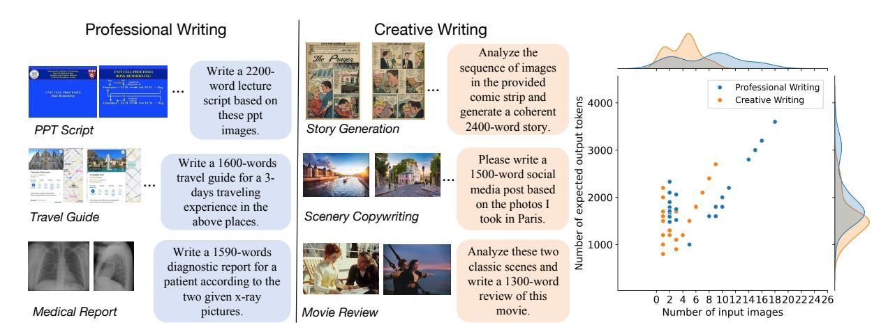
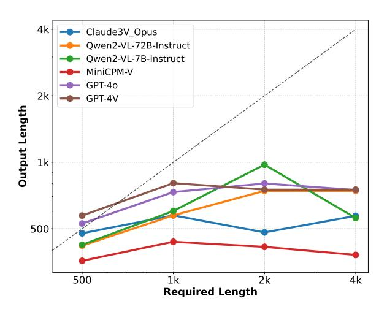
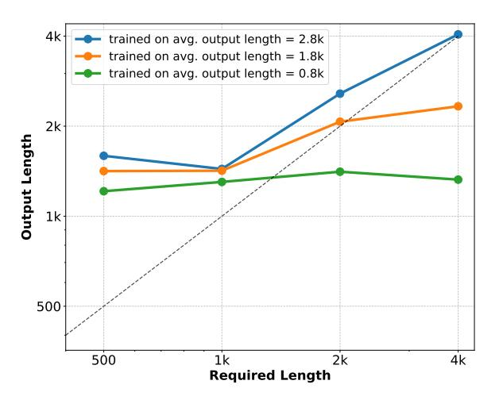

# LongWriter-V: Enabling Ultra-Long and High-Fidelity Generation in Vision-Language Models

Shangqing Tu1∗ ,Yucheng Wang1∗ , Daniel Zhang-Li1 , Yushi Bai1 , Jifan Yu1 , Yuhao Wu2 , Lei Hou1 , Hui-Qin Liu1 , Zhiyuan Liu1 , Bin Xu1 , Juanzi Li1

> 1Tsinghua University, 2Singapore University of Technology and Design <https://github.com/THU-KEG/LongWriter-V>

## Abstract

Existing Large Vision-Language Models (LVLMs) can process inputs with context lengths up to 128k visual and text tokens, yet they struggle to generate coherent outputs beyond 1,000 words. We find that the primary limitation is the absence of long output examples during supervised fine-tuning (SFT). To tackle this issue, we introduce LongWriter-V-22k, a SFT dataset comprising 22,158 examples, each with multiple input images, an instruction, and corresponding outputs ranging from 0 to 10,000 words. Moreover, to achieve long outputs that maintain high-fidelity to the input images, we employ Direct Preference Optimization (DPO) to the SFT model. Given the high cost of collecting human feedback for lengthy outputs (e.g., 3,000 words), we propose IterDPO, which breaks long outputs into segments and uses iterative corrections to form preference pairs with the original outputs. Additionally, we develop MMLongBench-Write, a benchmark featuring six tasks to evaluate the long-generation capabilities of VLMs. Our 7B parameter model, trained with LongWriter-V-22k and IterDPO, achieves impressive performance on this benchmark, outperforming larger proprietary models like GPT-4o.

## 1 Introduction

Recent advancements in Large Vision-Language Models (LVLMs) have significantly enhanced their capabilities in processing visual and textual inputs [\(Alayrac et al.,](#page-8-0) [2022;](#page-8-0) [Zhang et al.,](#page-10-0) [2024\)](#page-10-0). Notably, there have been substantial breakthroughs in the long-context capabilities of VLMs [\(Xue et al.,](#page-10-1) [2024;](#page-10-1) [Shu et al.,](#page-9-0) [2024\)](#page-9-0). For instance, Qwen2- VL [\(Wang et al.,](#page-10-2) [2024a\)](#page-10-2) can now understand videos up to 20 minutes, with a context window of 32k tokens. This progress has significantly expanded the scope of tasks that VLMs can handle, making them more applicable to real-world scenarios.

However, despite the increased input context window, the effective output length of VLMs remains limited. To verify this limitation, we collect a benchmark comprising six tasks that require VLMs to generate long texts based on visual inputs (as shown in Figure [1\)](#page-1-0). By adjusting the required output length in the instructions, we found that all existing models struggle to generate outputs exceeding 1,000 words (Section [2\)](#page-1-1). In real-world scenarios, such long-output queries are common user demands [\(Chou et al.,](#page-8-1) [2024\)](#page-8-1). For example, (1) creative writing tasks may require generating detailed stories or essays based on visual prompts [\(Hong](#page-9-1) [et al.,](#page-9-1) [2023\)](#page-9-1), and (2) professional writing tasks may involve writing comprehensive reports or analyses from visual data [\(Hartsock and Rasool,](#page-9-2) [2024\)](#page-9-2). To meet these practical needs, it is essential to enhance the long-output capabilities of VLMs.

To investigate the reasons behind the limited long-output capability of VLMs, we are inspired by the LongWriter [\(Bai et al.,](#page-8-2) [2024\)](#page-8-2), which adjusts the output length distribution of the supervised finetuning (SFT) data to observe changes in model output length. Our experiments revealed that the proportion of long-output examples in the SFT data determines the model's output length. This finding explains why VLMs typically have an output length limit of around 1,000 words. Existing visual instruction tuning datasets [\(Schuhmann et al.,](#page-9-3) [2022\)](#page-9-3), such as LLaVA [\(Liu et al.,](#page-9-4) [2024a\)](#page-9-4), mainly contain tasks like grounding [\(Liu et al.,](#page-9-5) [2024b\)](#page-9-5) and caption generation [\(Wang et al.,](#page-10-3) [2022\)](#page-10-3), with most outputs being less than 300 words [\(Lin et al.,](#page-9-6) [2014\)](#page-9-6).

To fill the gap, we select long-output instructionimage pairs from MMEvol [\(Luo et al.,](#page-9-7) [2024\)](#page-9-7) as inputs. In addition to single-image inputs, we also constructed other forms of data, including multiimage inputs and backtranslated instructions [\(Wang](#page-10-4) [et al.,](#page-10-4) [2024b\)](#page-10-4), to enrich the diversity of the input data. To generate long outputs, we propose a planand-write approach: LongWriter-Agent-V. This

\*Equal contribution.

> **[图片提取文字 (无描述)]:**
> Professional Writing Creative Writing Analyze the The Prayer sequence of images Write a 2200-UNIT CHILL PROCESSES in the provided word lecture Professional Writing comic strip and tokens 4000 script based on Creative Writing generate a coherent these ppt 2400-word story. PPT Script Story Generation images. 3000 Please write a Write a 1600-words 1500-word social travel guide for a 3media post based days traveling 2000 on the photos I experience in the Travel Guide Scenery Copywriting took in Paris. above places. 1000 Write a 1590-words Analyze these two diagnostic report for a classic scenes and patient according to the write a 1300-word review of this two given x-ray 0 2 4 6 8 101214161820222426 Medical Report Movie Review movie. pictures. Number of input images

Figure 1: Left: Six examples for each type of task in MMLongBench-Write. They are divided into two categories: professional writing and creative writing. The former requires professional knowledge, while the latter does not. Right: The joint distribution of the number of input images and the expected output length for data in both categories. Most data requires a 1000+ word output with given images, challenging the long-generation capabilities of VLMs.

method involves providing input images and writing instructions to GPT-40 to first generate an outline and then sequentially write the text in segments. Through this approach, we collect LongWrite-V-22k, a dataset of 22k long-output examples.

Using LongWrite-V-22k for SFT, the output length of Qwen2.5-VL-7B-Instruct (Team, 2025) can be extended beyond 3,000 words. However, longer outputs often introduce issues such as repetition and hallucination (Favero et al., 2024). To improve the fidelity of long outputs, we adapted the approach from RLHF-V (Yu et al., 2024a), where human experts revise the model's outputs to form preference pairs for Direct Preference Optimization (DPO). Since traditional DPO (Rafailov et al., 2024) is typically performed on short texts of around 300 words, and LongWriter-V's output length can exceed 3,000 words, the annotation cost is extremely high. To enhance the efficiency of preference data utilization, we proposed IterDPO, which divides long outputs into N segments, treating each segment's revision as a preference pair. This method allows the model to learn fine-grained human corrections for each segment and effectively multiplies the use of a single long-output preference pair by N times. Through LongWriter-V-22k SFT and IterDPO, our 7B model achieves impressive performance in both output length and quality, surpassing powerful VLMs like GPT-4o.

In summary, our contributions are as follows:

We construct MMLongBench-Write to evaluate the long-output capabilities of VLMs and find that the output length limit of existing

VLMs is around 1,000 words.

- We collect the SFT dataset LongWrite-V-22k, enabling VLMs for 3,000+ word generation.
- We propose IterDPO, which effectively improves the text quality of long-output VLM.

#### 2 Preliminaries

In the preliminary experiments, we first collect MMLongBench-Write, a benchmark with visual inputs and long-output requirements. Then, we conduct an evaluation on this benchmark to explore the maximum output length of VLMs. Besides, we reveal that the main reason for bounded output length lies in the length distribution of SFT data.

MMLongBench-Write. The ability to write long texts based on visual inputs is a fundamental skill in various real-world applications and can be broadly categorized into professional writing and creative writing, depending on whether specialized knowledge is required (Taavitsainen and Pahta, 2000). To evaluate how well that VLMs master the two skills, we design three specific tasks for each skill. For each task, we curate 20 representative instructions with input images as test data. To ensure diversity, half instructions are in English and half are in Chinese. Figure 1 shows six examples of the benchmark and data distribution. It highlights that professional writing tasks typically involve more input images and require longer output lengths.

**LongWrite-V-Ruler**. To explore the maximum output length of VLMs, we select 8 examples from MMLongBench-Write benchmark, with four

> **[图片提取文字 (无描述)]:**
> 4k Claude3V Opus Qwen2-VL-72B-Instruct Qwen2-VL-7B-Instruct MiniCPM-V GPT-40 2k GPT-4V Output Length 1k 500 2k 4k 500 1k Required Length

Figure 2: LongWriter-V-Ruler test across different output length requirements. The horizontal line show the overall upper bound for current VLMs.

samples in English and four in Chinese. As depicted in Figure [1,](#page-1-0) each instruction is in the form of *"Write an* L*-word article for the given pictures"*. We construct a diverse test set by changing the length requirement L. This test set uses L ∈ {500, 1000, 2000, 4000}, which consists of 32 test prompts in total.

Evaluation Result. We conduct the LongWrite-V-Ruler test on three open-source VLMs and three proprietary models. In Figure [2,](#page-2-0) we plot the required output length (x-axis) and the corresponding average output length (y-axis) for 12 instructions. We can observe that there exists an upper bound of 1000 output length for all models.

Preliminary Experiment. As the controlled experiments in LongWriter [\(Bai et al.,](#page-8-2) [2024\)](#page-8-2) has revealed that the maximum output length of LLM is correlated with the maximum output length of SFT data, we further explore how the average output length of SFT data can influence the long-generation capabilities of VLM. We fine-tune Qwen2-VL-7B-Instruct [\(Wang et al.,](#page-10-2) [2024a\)](#page-10-2) on three visual instruction datasets sampled from our final SFT data. Each dataset has 10k examples with different average output length respectively (0.8k, 1.8k and 2.8k). Figure [3](#page-2-1) shows the trained models' performance on LongWrite-V-Ruler, we observe that the model's maximum output length increases with the average output length of SFT data. Besides, we find that the number of long-output examples is crucial for extending the output length of VLMs. For example, the training set with an average length of 1.8k contains 1% data exceeding 4k output length, but the model trained on it fails to generate 4k to-

> **[图片提取文字 (无描述)]:**
> trained on avg. output length = 2.8k trained on avg. output length = 1.8ktrained on avg. output length = 0.8k 2k **Output Length** 1k 500 500 1k 2k 4k **Required Length**

Figure 3: LongWriter-V-Ruler test for Qwen2-VL-7B-Instruct trained on 10k SFT data samples with different average output lengths.

kens (orange line). In contrast, the model trained with 21% data exceeding 4k output length is able to do that (blue line). This result indicates that the main reason that limits the VLM's output length is lack of enough long-output examples in SFT data.

