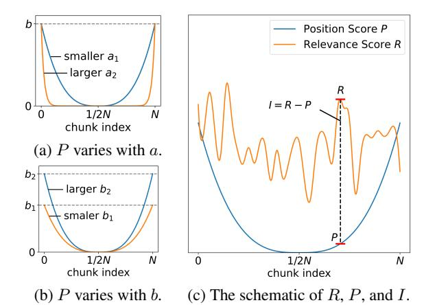

# 1 Introduction

While long-context large language models (LLMs) demonstrate proficient comprehension of extensive inputs, they often fail to generate sufficiently lengthy outputs as human instructions. For instance, when instructed to produce a 10,000 word paper, these models typically yield responses under 2,000 words. Numerous methods have been proposed to enhance the ability of LLMs to adhere to instructions and generate lengthy texts, including multi-step agent inferencing [\(Quan](#page-8-0) [et al.,](#page-8-0) [2024\)](#page-8-0), long response supervised fine-tuning (SFT) [\(Bai et al.,](#page-8-1) [2024\)](#page-8-1), and preference alignment techniques [\(Pham et al.,](#page-8-2) [2024\)](#page-8-2).

However, these works primarily focus on scenar-

ios where LLMs generate long content from short

ple, generating analytical reports from extensive system logs, creating summaries based on documents, and continuing to write articles using existing content. To the best of our knowledge, there remains a research gap in addressing long-input and long-output tasks, which require both extensive context comprehension and sustained content generation. In the context of long-input and long-output

inputs, but we believe that in reality, long-input and long-output tasks are also meaningful. For exam-

tasks, there are two main challenges: (1) As illustrated in Table [1,](#page-1-0) the existing benchmarks for longcontext LLMs do not feature both lengthy inputs and outputs simultaneously; (2) When the input is lengthy, it becomes particularly prone to the "lostin-the-middle" phenomenon [\(He et al.,](#page-8-3) [2024;](#page-8-3) [An](#page-8-4) [et al.,](#page-8-4) [2024;](#page-8-4) [Zhang et al.,](#page-9-0) [2024b\)](#page-9-0), wherein LLMs often overlook the content positioned in the middle of the input. We believe this issue will similarly arise (proved in Figure [7b\)](#page-7-0), requiring targeted solutions to ensure the coherence and completeness of generated long outputs.

To address the challenge of the lack of benchmarks, we propose the Long Input and Output Benchmark (LONGINOUTBENCH), which includes datasets featuring long-input and longoutput, as well as a convincing evaluation framework. Specifically, we first manually collect scientific papers from arXiv [1](#page-0-0) and design a long-text writing task, which involves generating a comprehensive summary based on multiple papers. We then develop an evaluation framework to assess the summary through three criteria, including length evaluation, consistency evaluation, and quality evaluation. As illustrated in Figure [1,](#page-1-1) the benchmark requires LLMs to read three full-length academic papers, each spanning hundreds of thousands of tokens, and subsequently generate a summary of pre-

\*Corresponding author

1 <https://arxiv.org/>

| Method                                        | Long Input (> 8K) | Long Output (> 1K) | Real-world Aligned | Consistency Evaluation | Quality Evaluation |
|-----------------------------------------------|-------------------|--------------------|-----------------------|---------------------------|-----------------------|
| NIAH(Kamradt, 2023)                           | ✓                 | X                  | Х                     | ✓                         | X                     |
| RULER(Hsieh et al., 2024)                     | $\checkmark$      | ×                  | ×                     | $\checkmark$              | ×                     |
| ∞Bench(Zhang et al., 2024a)                   | $\checkmark$      | ×                  | $\checkmark$          | $\checkmark$              | ×                     |
| SummHay(Laban et al., 2024)                   | $\checkmark$      | ×                  | $\checkmark$          | $\checkmark$              | X                     |
| LongGenBench 1 (Wu et al., 2024)   | Х                 | <b>√</b>           | Х                     | ×                         | Х                     |
| LongGenBench 2 (Liu et al., 2024b) | ×                 | ✓                  | ×                     | ×                         | ×                     |
| LongWriter(Bai et al., 2024)                  | ×                 | $\checkmark$       | $\checkmark$          | ×                         | $\checkmark$          |
| ProxyQA(Tan et al., 2024)                     | X                 | $\checkmark$       | $\checkmark$          | $\checkmark$              | ×                     |
| LONGINOUTBENCH (Ours)                         | ✓                 | ✓                  | ✓                     | ✓                         | ✓                     |

Table 1: Recent representative benchmarks for evaluating long-context LLMs. "Real-world Aligned" refers to tasks within the benchmark that align with real-world application requirements, "Consistency Evaluation" refers to checking the correctness of knowledge during evaluation, and "Quality Evaluation" refers to assessing the language proficiency and structural quality of output content.

> **[图片提取文字 (无描述)]:**
> Referenced Papers Read these papers carefully and write a summary based on them. The following are the key points to note: Remember to mention important data in your summary. Total word count should be about {length}. Length Evaluation Title **Consistency Evaluation** Data Tabel **Quality Evaluation** Summary

Figure 1: Overview of LONGINOUTBENCH.

scribed length that faithfully captures the core contributions and critical conclusions from the source materials.

Additionally, to mitigate the "lost-in-the-middle" issue, we propose the Retrieval-Augmented Long-Text Writer (RAL-WRITER), which explicitly identifies and preserves information that is both essential and susceptible to being lost. In general, RAL-WRITER comprises a Writing Step Planner and a Retrieve-and-Restate Writer. The Planner is tasked with creating the overarching framework and defining the writing steps for producing long outputs after analyzing extensive inputs. Subsequently, the Writer sequentially generates content by follow-

ing the steps established during the planning phase. Specially, during the writing phase, we adapt the retrieval-augmented framework to retrieve important but potentially lost contents and restate them to explicitly prompt the LLM for the "lost-in-the-middle" mitigation.

In short, the main contributions of this paper are as follows:

- We propose the LONGINOUTBENCH, which is the first benchmark specially designed for long-input long-output tasks, including relevant datasets and evaluation framework.
- We introduce RAL-WRITER, which retrieves and restates crucial yet lost content, forming an explicit prompt for "lost-in-the-middle" mitigation.
- Comprehensive experiments on LongInOut-BENCH demonstrate the effectiveness of our RAL-WRITER.

### 2 Related Work

Relevant prior work includes methods for extending the context length of LLMs, investigations into LLMs' comprehension mechanisms for long-context information, and alignment techniques for generating high-quality long-form outputs.

Long-context LLMs The extended context window is essential for LLMs as it allows them to process more reference information, understand longer documents, and learn from additional examples in few-shot learning. However, processing excessively long contexts can result in significant

computational overhead and substantial memory pressure. [Dao et al.](#page-8-9) [\(2022\)](#page-8-9) significantly reduced the memory dependency of LLMs using IO-aware attention computation mechanism. Methods based on Rotary Position Embedding[\(Su et al.,](#page-9-4) [2024;](#page-9-4) [Peng et al.,](#page-8-10) [2023;](#page-8-10) [Zhu et al.,](#page-9-5) [2023\)](#page-9-5) allow LLMs to process extended contexts in inference, despite not having been trained on equivalently long text sequences. LM-Infinite[\(Han et al.,](#page-8-11) [2024\)](#page-8-11), LongLoRA[\(Chen et al.,](#page-8-12) [2023\)](#page-8-12), and LongQLoRA[\(Yang,](#page-9-6) [2023\)](#page-9-6) employ specialized attention mechanisms to extend the context size of models. Although LLMs can generate text with lower perplexity in long-context scenarios, there remains uncertainty regarding whether the models adequately attend to and effectively utilize this information.

Long output generation In the domain of longform text generation, recent advancements have aimed at enhancing the capabilities of LLMs to produce coherent and high-quality outputs over extended lengths.

Suri-I-ORPO [\(Pham et al.,](#page-8-2) [2024\)](#page-8-2) is a pioneer in this long-form text generation model, employing the I-ORPO method to train models up to approximately 5k output context length. LongWriter[\(Bai](#page-8-1) [et al.,](#page-8-1) [2024\)](#page-8-1) utilizes the AgentWrite approach to gather datasets for training long-text output models. LongDPO [\(Ping et al.,](#page-8-13) [2025\)](#page-8-13) improves upon the length and quality metrics by constructing preference data and utilizing DPO for training, building on LongWriter.

### 3 LONGINOUTBENCH Benchmark

To effectively assess the model's ability for longtext understanding and long-text generation, we construct a LONGINOUTBENCH, which involves generating a long scientific paper summary by reading long input, consisting of multiple papers on similar topics. Additionally, we design three metrics, including length score, consistency score, and quality score, to comprehensively evaluate the generated long text.

### 3.1 Data Construction

For each sample in the dataset, we manually collect three thematically similar papers from arXiv. Specifically, we download the TeX source files and preprocess the data by removing noisy elements such as comments, preambles, and appendices. The cleaned text retained TeX markup to preserve structural information, which is advantageous for LLM

comprehension. Noted, papers with inconsistent formatting or insufficient length were also excluded. Consequently, we construct a final dataset of 100 samples, totaling 300 papers. Figure [2](#page-2-0) presents key statistical characteristics of the curated dataset, including arXiv category distribution and paper length distribution.

> **[图片提取文字 (无描述)]:**
> 50 of Papers 20.38% 18.47% cs.Al cs.LG 21.97% 10.51% cs.CL Num. cs.CV 20 22.29% 3.18% Others cs.SD 10 3.18% eess.AS 5k 10k 15k 20k 25k 30k Paper Length

(a) Category distribution (b) Length distribution

Figure 2: Statistical information of in LONGINOUT-BENCH. Noted, categories in (a) with proportions less than 3% are grouped into "Others".

### 3.2 Evaluation Metric

As shown in Figure [1,](#page-1-1) we evaluate the LLMgenerated summaries from three aspects: length, consistency, and quality.

Length Evaluation Whether the length of generated summaries meets the requirements is a key metric for long-text generation. Inspired by LongBench-Write [\(Bai et al.,](#page-8-1) [2024\)](#page-8-1), we utilize a linear piecewise function to evaluate the length score Sl , defined as follows:

$$S_{l} = \begin{cases} \max\left(0, 1 - \frac{l/l' - 1}{2}\right) &, l' < l\\ 1 &, l' > l \end{cases}$$
 (1)

where l ′ is the length of generated summary, and l is the required length. When l ≥ l ′ , the score attains its max value of 1, indicating that the generated summary has sufficient length as required. When l ′ is lower than l, the score diminishes.

Consistency Evaluation Following ProxyQA [\(Tan et al.,](#page-9-3) [2024\)](#page-9-3), we construct specialized question-answer (QA) pairs for each sample to evaluate whether the generated summary has captured critical information from multiple referenced papers. Generally, these pairs can be divided into two types: *Single-Context* Question, which is answerable using a single paper, e.g., "What categories and total samples does Dataset A contain?",

> **[图片提取文字 (无描述)]:**
> **Original Input Original Input** Lengthy docs (Long text) Writing Steps Result ✓ Background (600 words) Read instruction above Task description Planner ✓ Introduce...(1000 words) and continued writing. Other constraints Here are writing steps: Join ✓ Conclusion (400 words) Read the instruction Writing Steps Step by step of a writing task and break it down ... Already written text: ✓ Introduce...(1000 words) **Text Splitter** Written Text **Embedding** Model  $\mathbf{E}_{\text{key}}$ Now, wtite step: R(i)Chunk 1 New **Current Step** Chunk, I'll restate some parts of Chunk 2 I(i) = R(i) - P(i)the instruction that may ▶Top-k . . . need to be used: Position Selected chunks Chunk n Score Score Restatement Writer

Figure 3: Illustration of RAL-WRITER.

and *Cross-Context* Question, which requires synthesis of multiple papers, e.g., "Compared with Method B, in which tasks does Method A perform better?". We initialize a set of QA pairs using GPT-4o2, followed by an iterative refinement process that incorporates both human and LLM verification to ensure factual accuracy and logical coherence. Ultimately, for each sample, we generate 6 *Single-Context* and 6 *Cross-Context* Questions, yielding a total of 1,200 QA pairs.

In this context, as the answers to *Cross-Context* Question are complex, these QA pairs cannot be evaluated through simple matching. Therefore, we adopt the LLM-as-a-judge method (Zheng et al., 2023) to score the answers. Especially, a judger LLM first answers prepared questions solely based on the generated summary, then an evaluator LLM scores the judger's responses against gold answers from 0 to 1. Given the need for robust semantic understanding and contextual reasoning capabilities in both the judger and evaluator, GPT-40 is employed as the foundational model. Consequently, the Consistency Score  $S_c$  is defined as follows:

$$S_c = \frac{\bar{S}_{\text{single}} + \bar{S}_{\text{cross}}}{2},\tag{2}$$

where  $\bar{S}_{\text{single}}$  denotes the average score for all Single-Context questions and  $\bar{S}_{\text{cross}}$  for all Cross-Context questions. Higher values indicate closer alignment with gold answers.

**Quality Evaluation** We believe that the intrinsic quality of the generated summary, such as language fluency and structural logic, is also a crucial aspect of evaluating long-text generation. Given the timeconsuming nature and prohibitive costs of human evaluation, coupled with the inability of metrics like perplexity, ROUGE, and BLEU to capture semantic adequacy, we adopt the LLM-as-a-judge methodology to assess Quality Scores, following the protocol established in our Consistency Score calculation framework. In contrast to most previous work (Bai et al., 2024), which evaluates LLM's response solely based on simple dimensions such as relevance and accuracy, we develop a more comprehensive checklist for evaluation, inspired by HelloBench (Que et al., 2024).

In total, we establish C=8 quality aspects, with each aspect comprising N=5 metrics. Detailed information about the quality checklist is presented in Appendix A. The quality score  $S_q$  is then calculated as the average of all metrics across all aspects:

$$S_q = \frac{1}{C} \sum_{i=1}^{C} \left( \frac{1}{N} \sum_{j=1}^{N} S_{i,j} \right)$$
 (3)

where  $S_{i,j}$  is the quality score of the j-th item in the i-th evaluation aspects.

### 4 RAL-WRITER

The representative long-text generation method, AgentWrite (Bai et al., 2024), has demonstrated that generating long-form output can be achieved

2https://openai.com/index/hello-gpt-4o/

through the "Plan and Write" procedure. However, their methods are primarily based on short input. In reality, numerous scenarios necessitate the comprehension of lengthy inputs and the generation of extensive outputs, including multiturn dialog systems, long-form document-based writing, and extensive data analysis. In cases of processing extensive contextual long inputs, AgentWrite is prone to encountering the "lost-in-the-middle", which has been proven to frequently occur when LLMs handle long inputs (Liu et al., 2024a). To mitigate the tendency of losing critical information in the middle of long inputs, we introduce the RAL-WRITER, which explicitly identifies and preserves information that is both essential and susceptible to being lost. In particular, the RAL-WRITER contains a writing step Planner and a retrieve augmented Writer. The Planner initially generates a writing plan derived from the content of the long text. Following this plan, the Writer retrieves crucial yet overlooked chunks, strategically rephrases them, and appends the restated paragraphs to the end of the input context, forming an explicit prompt for writing. The complete workflow of RAL-WRITER is schematically illustrated in Figure 3.

### 4.1 Writing Steps Planner

The Planner is designed to generate the overall structure and writing steps for long outputs after comprehending lengthy inputs. Typically, the input consists of a long text and an instruction specifying the desired output length, as shown in Appendix G. After processing the entire input, the Planner produces a comprehensive writing plan comprising multiple steps, with each step including specific writing requirements and expected length. The total length of all steps is expected to precisely match the target length specified by the user.

### 4.2 Retrieve-and-Restate Writer

At this stage, the Writer sequentially generates content in alignment with the steps outlined during the planning phase. Each step corresponds to a single writing invocation, with the prompt encompassing the original input, the text already composed, and the requirements of the current step. To enhance the previous prompt with information that shouldn't be lost, we introduce a refined retrieve-and-restate mechanism, which incorporates long-text chunking, crucial chunk retrieval, and strategic restatement of the retrieved chunks.

Long-text Chunking To ensure contextual coherence within each chunk, we follow text chunking techniques from LangChain (Chase, 2022) and implement a recursive text splitter. Especially, it splits long texts into small chunks based on logical structures (such as paragraphs, tables, and lists) and combines adjacent chunks until reaching a preset size. Meanwhile, to avoid information loss after splitting, the merged chunks also have a certain amount of text overlap.

Important Chunks Retrieval As analyzed by Liu et al. (2024a), when the input text is lengthy, the "lost-in-the-middle" issue naturally arises. To explicitly prompt the model to focus on important yet overlooked information, we propose an important chunk retrieval mechanism based on the retrieval-augmented framework. Intuitively, a chunk with a higher relevance score for a given writing step, yet suffering more severely from the "lost-in-the-middle" issue (i.e., positioned closer to the middle), is considered more crucial.

Formally, denote the *i*-th chunk embedding as  $\mathbf{E}_i$ , and the embedding of the current step as  $\mathbf{E}_{key}$ , the relevance score R(i) of each chunk can be defined as:

$$R(i) = \frac{\langle \mathbf{E}_i, \mathbf{E}_{\text{key}} \rangle}{||\mathbf{E}_i|| ||\mathbf{E}_{\text{key}}||}$$
(4)

In addition to relevance, we introduce a position score for each chunk based on the observed "lost-in-the-middle" phenomenon. As illustrated in Figure 4, chunks closer to the middle position are more likely to be overlooked. We hypothesize a mathematical function f to quantitatively model this trend:

$$f(x) = b|(2x - 1)^{a}|, (5)$$

Where x ranges from [0,1], representing the relative position of the chunk in the original input. The positive parameters a and b control the variation amplitude at both ends and the maximum value of the function, respectively. As shown in Figure 4a and 4b, this function reaches its maximum value b at x=0 and x=1, and its minimum value 0 at x=1/2. The trend is similar to the experimental results of "lost-in-the-middle" in previous studies.

Considering there are N chunks indexed as [0, 1, ..., N-1], the i-th chunk can be linearly mapped to x = i/N. Therefore, the position score P(i) of the i-th chunk is:

$$P(i) = f\left(\frac{i}{N}\right) = b\left|\left(2\frac{i}{N} - 1\right)^a\right|. \quad (6)$$

Consequently, the importance score I for each chunk is defined as the difference between the relevance score R and the position score P, which can be formulated as:

$$I(i) = R(i) - P(I). \tag{7}$$

A chunk with a higher importance score indicates that it should be reinforced in the prompt to strengthen the Writer LLM's attention to it. Ultimately, the top-k chunks with higher importance score I will be retrieved to enter the subsequent restatement stage. Figure [4](#page-5-0) illustrates the actual curves of relevance scores and position scores for a given sample.

Restatement of Retrieved Chunks The retrieved chunks will be embedded in the prompt of the Writer LLM during the writing phase. These text chunks are systematically concatenated at the tail of the input prompt, a strategic placement designed to amplify the LLM's attention allocation toward the appended content. This architectural choice capitalizes on the positional sensitivity inherent in transformer-based attention mechanisms, where later input segments typically receive heightened computational prioritization during token prediction. Noted, to avoid the "lost-in-the-middle" issue during the writing process, we sort the retrieved chunks in ascending order of their importance scores. This ensures that the more important chunks are positioned closer to the end, minimizing the risk of them being lost.

### 5 Experiments

### 5.1 Experimental Setting

The results on our custom-built LONGINOUT-BENCH are presented in Table [2.](#page-6-0) We adopt three open-source models as backbone architectures for generation tasks: Qwen2.5-14B-Instruct, Qwen2.5- 32B-Instruct [\(Yang et al.,](#page-9-8) [2024\)](#page-9-8), and LongWriterglm4-9b [\(Bai et al.,](#page-8-1) [2024\)](#page-8-1). Models were deployed using the vLLM inference framework [\(Kwon et al.,](#page-8-17) [2023\)](#page-8-17) on NVIDIA 40GB A100 GPU. We have also incorporated the single invocation of GPT-4o. All the LLMs used are equipped with a 128k-token context window. To ensure a certain level of creativity, during the writing process, the temperature of LLM was set to 0.3. During the question-answering, answer verification, and quality assessment phases, we utilized the GPT-4o-mini model to ensure objective and accurate evaluation. To ensure stable

> **[图片提取文字 (无描述)]:**
> b Position Score P Relevance Score R smaller a1 larger a2 I = R - P0 1/2Nchunk index (a) P varies with a. b2 larger b2  $b_1$ smaler b1 0 1/2NN 1/2N N chunk index chunk index (b) P varies with b. (c) The schematic of R, P, and I.

Figure 4: (a) A larger a means that the slope of P is greater near both ends, while the middle part is closer to 0. (b) A larger b indicates that P can achieve a greater maximum value at both ends. (c) Importance I is defined as the difference between P and R; the stronger the relevance of a chunk to the current step and the closer its position is to the middle, the greater the value of I becomes.

evaluation results, the temperature is set to 0 during this phase.

