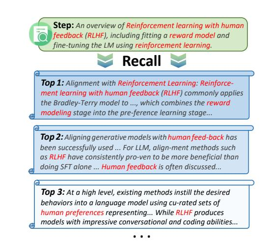
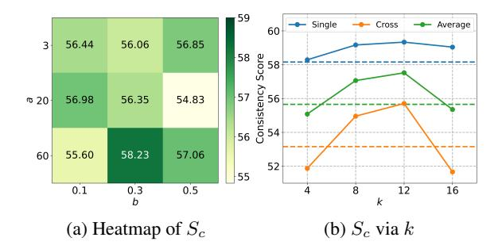

# 5.2 Baselines

Single In the RAL-WRITER system, we employed bge-base-en-v1.5 [\(Xiao et al.,](#page-9-9) [2023\)](#page-9-9) as the embedding model to calculate text embedding of writing steps and chunks.

AgentWrite Similar to RAL-WRITER, this approach employs structured writing planning with sequential paragraph composition but omits the retrieval and restatement mechanisms.

Compress We implemented and evaluated the Compress method, which retains AgentWrite's core workflow but introduces a preprocessing stage using LLMLingua model [\(Jiang et al.,](#page-8-18) [2023\)](#page-8-18) to achieve 50% text compression before paper ingestion. This compression strategy aims to alleviate LLMs' contextual processing burden by eliminating non-essential content and reducing input context length, while theoretically preserving critical information through semantic-aware compression.

### 5.3 Main Results

Table [2](#page-6-0) shows the main results of RAL-WRITER and baselines. From the Table, we observe:

(1) A model with a larger number of parameters does not necessarily equate to stronger long-context input-output capabilities. Qwen2.5- 32B-Instruct did not demonstrate the expected superiority over Qwen2.5-14B-Instruct in our evalu-

| Backbone           | Method     |       | Overall |       |        | 4k    |       |       | 8k    |       |       | 16k   |       |
|--------------------|------------|-------|---------|-------|--------|-------|-------|-------|-------|-------|-------|-------|-------|
| Баскропе           |            | $S_l$ | $S_c$   | $S_q$ | $S_l$  | $S_c$ | $S_q$ | $S_l$ | $S_c$ | $S_q$ | $S_l$ | $S_c$ | $S_q$ |
| GPT-40             | Single     | 0.00  | 23.14   | 56.06 | 0.00   | 24.77 | 57.52 | 0.00  | 22.91 | 55.87 | 0.00  | 21.73 | 54.79 |
| LongWriter-glm4-9b | Single     | 40.18 | 35.29   | 72.79 | 79.85  | 33.17 | 71.90 | 39.15 | 36.71 | 72.48 | 1.53  | 36.00 | 74.00 |
|                    | Single     | 6.92  | 40.12   | 66.73 | 19.41  | 38.02 | 65.03 | 1.34  | 40.83 | 67.32 | 0.00  | 41.52 | 67.84 |
| Qwen2.5-14B        | AgentWrite | 79.25 | 54.10   | 74.49 | 100.00 | 51.35 | 74.22 | 93.90 | 55.66 | 74.51 | 43.86 | 55.15 | 74.75 |
|                    | Compress   | 64.33 | 44.49   | 74.01 | 100.00 | 43.67 | 74.87 | 84.84 | 44.85 | 74.24 | 8.14  | 44.94 | 72.93 |
|                    | RAL-WRITER | 75.15 | 55.28   | 75.68 | 100.00 | 53.17 | 75.49 | 87.07 | 58.23 | 75.93 | 38.39 | 54.43 | 75.62 |
|                    | Single     | 4.90  | 40.46   | 66.63 | 14.63  | 39.06 | 66.28 | 0.06  | 40.69 | 66.00 | 0.00  | 41.63 | 67.62 |
| Qwen2.5-32B        | AgentWrite | 61.34 | 52.39   | 74.11 | 97.18  | 49.98 | 73.19 | 74.18 | 54.08 | 74.79 | 12.67 | 53.10 | 74.34 |
|                    | Compress   | 52.28 | 46.47   | 73.69 | 92.46  | 43.31 | 73.33 | 60.50 | 50.17 | 74.03 | 3.88  | 45.94 | 73.70 |
|                    | RAL-WRITER | 77.09 | 54.15   | 75.67 | 99.83  | 53.77 | 74.68 | 91.22 | 55.54 | 76.83 | 40.22 | 53.15 | 75.51 |

Table 2: The main results on the LONGINOUTBENCH.  $S_l$ ,  $S_c$ , and  $S_q$  stand for the length score, consistency score, and quality score, respectively. 4k, 8k, and 16k indicate the required lengths of the generated summary.

ation metrics. Instead, it actually exhibited slight performance degradation in both the "Single" and "AgentWrite" methodologies. We hypothesize that the increased computational overhead associated with larger model parameters may lead to performance attenuation under extreme long-context conditions. Consequently, compared to the 32B-parameter model, deploying the 14B variant for long-input long-output tasks may offer better cost-effectiveness. Future work could systematically investigate whether this scaling paradox persists across diverse parameter configurations and architectures.

(2) RAL-WRITER enhances the long input and output capabilities of LLMs. The experimental outcomes reveal that RAL-WRITER achieves statistically superior performance in both  $S_c$  and  $S_q$  metrics compared to baseline approaches. This empirically substantiates that the retrieve-and-restate mechanism effectively enhances knowledge fidelity and linguistic quality in long-form generation tasks. Notably in length adherence evaluation, RAL-WRITER maintained competitive performance relative to baseline methods, demonstrating the superiority in output regulation while achieving marked improvement when implemented with the Owen2.5-32B-Instruct architecture.

(3) LLM Agents continue to face challenges in generating long-form text at the 16k words scale. Even when utilizing the Plan-Write framework for 16k-token generation tasks, consistent length compliance remains unattainable. Through analysis of Planning steps, we identified failures in step-wise word count allocation: LLMs occasionally produce planning sequences with insufficient cumulative word count targets, resulting in shorter summaries. This limitation likely stems from inherent reason-

> **[图片提取文字 (无描述)]:**
> Step: An overview of Reinforcement learning with human feedback (RLHF), including fitting a reward model and fine-tuning the LM using reinforcement learning. Recall Top 1: Alignment with Reinforcement Learning: Reinforcement learning with human feedback (RLHF) commonly applies the Bradley-Terry model to ..., which combines the reward modeling stage into the pre-ference learning stage... Top 2: Aligning generative models with human feed-back has been successfully used ... For LLM, align-ment methods such as RLHF have consistently pro-ven to be more beneficial than doing SFT alone ... Human feedback is often discussed... Top 3: At a high level, existing methods instill the desired behaviors into a language model using cu-rated sets of human preferences representing... While RLHF produces models with impressive conversational and coding abilities...

Figure 5: With actual data, employing the optimal parameters, a demonstration of chunks recall during the Write phase.

ing deficiencies in the Planner LLM's capability to decompose long-context writing tasks.

### 5.4 Discussion

**Impact of Parameter** a **and** b In Equation (6), parameters a and b control which chunks are affected and to what extent during the retrieval process, making their values crucial for retrieval. To investigate the optimal values for a and b, we conducted 9 experiments testing all combinations where a was set to values in  $\{5, 20, 60\}$  and b to values in  $\{0.1, 0.3, 0.5\}$ . Since the  $S_c$  metric reflects whether generated summaries contain key information, which is closely related to retrieval quality, we selected  $S_c$  as the criterion. The experimental results are shown in Figure 6a. Adopting the bestperforming configuration (a = 60, b = 0.3), we printed and analyzed the retrieved chunks, observing that top-ranked chunks indeed exhibited higher semantic relevance to the content requirements of

> **[图片提取文字 (无描述)]:**
> 59 Single Cross Average 60 3 56.44 56.06 56.85 Score se 58 57 56 Consistency 54 56 56.98 56.35 54.83 @ 20· 55.60 58.23 57.06 60 52 55 0.5 0.1 0.3 8 12 16 k (a) Heatmap of  $S_c$ (b)  $S_c$  via k

Figure 6: (a) Heatmap of  $S_c$  for various a and b; (b)  $S_c$  of RAL-WRITER when k takes different values. "Single" indicates the score on Single-Context Questions, "Cross" indicates the score on Cross-Context Questions, and "Average" represents the average of the two. The dashed line shows the score of AgentWrite on the corresponding questions.

the current writing step, as shown in Figure 5.

Impact of Retrieved Chunks Number k The more text chunks retrieved (i.e., the larger k) means that comprehensive relevant information can be included, but it also mixes in a greater number of irrelevant chunks. This not only increases the input length but also distracts the model's attention and may even mislead the model. Therefore, it is necessary to determine an appropriate k value to optimize the model's performance. We fixed the parameters a = 10 and b = 0.2 in the position attention A, set the target generation length to 8000 words, and used the Owen2.5-14B-Instruct model. We adjusted k to take values in [4, 8, 12, 16] and tested the Consistency Score in LONGINOUT-BENCH. The results, as shown in Figure 6b, indicate that the best performance was achieved at k = 12, and beyond this value, the Consistency Score dropped sharply. Our analysis revealed that at k = 16, a considerable portion of the LLM prompt lengths approached or even exceeded the model's maximum context length of 128k, leading to a decline in the quality of the model's output.

