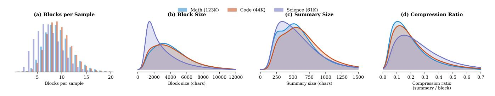

# **3 OPENMEMENTOS Dataset**

Training models to simultaneously reason and manage context requires high-quality annotated data: reasoning traces segmented into semantically coherent blocks, paired with dense summaries. A core challenge is that typical reasoning traces are not a sequence of independent thoughts; they are a continuous stream without "natural" boundaries. Here we describe our data generation pipeline (Figure [0,](#page-1-1) top left), which takes raw CoT traces and produces structured traces annotated with mementos.

**Design rationale.** Each stage in our pipeline reflects a deliberate design choice. Early on, we tried having a frontier LLM directly segment CoTs into semantically coherent blocks. This failed. Even strong models struggle with a combinatorial optimization problem that considers all possible partitions, requiring simultaneous reasoning about block coherence, size balance, and semantic boundaries.

To simplify, we factored the problem: boundary *scoring* asks a local question ("is this a good place to slice the CoT?"), which LLMs handle well, while the global optimization of boundary selection given the LLM scores is handled algorithmically. We then use an LLM judge to grade the quality of summarization. Defining "good summary" programmatically is difficult, but LLMs can give reasonable scores against explicit rubrics. We then chose iterative refinement of mementos over single-shot summarization as initial mementos often miss key formulas or intermediate values; a zero-shot approach achieves only 28% pass rate (scoring ≥ 8/10 on our rubric), while the judge-feedback loop brings this to 92%.

**Stage 0: Seed selection.** We source 228K reasoning traces from OpenThoughts-v3 [\(Guha et al.,](#page-15-0) [2025\)](#page-15-0), a widely-adopted dataset of CoT traces generated by QwQ-32B, and process them through our annotation pipeline to produce the final OPENMEMENTOS dataset. While we could regenerate traces using stronger teachers, we leverage OpenThoughts because: (1) substantial effort has already been invested in generating these traces at scale; (2) the OpenThinker-3 paper provides extensive baselines, making it an ideal testbed; and (3) our hypothesis that traces from a relatively strong reasoner (QwQ-32B) should transfer across model families is confirmed empirically (works for Qwen3, Phi-4, Olmo 3).

**Stage 1: Sentence splitting.** We partition reasoning traces into atomic "sentences": complete, modular thoughts that can stand alone. Code blocks and multi-line math are detected and protected as atomic units. Plain text is split at sentence boundaries (avoiding splits inside parentheses, inline math, or abbreviations). Finally, we merge logically connected fragments: sentences ending with colons are attached to the next; continuation words (Therefore, Thus, So) signal a need to merge with the preceding sentence; short

fragments (<5 tokens) and consecutive math expressions are consolidated. This structure-aware splitting reduces candidate boundaries by  $\sim$ 2× vs. naive sentence splitting (397  $\rightarrow$  187 per trace on average).

**Stage 2: Boundary scoring.** An LLM judge (GPT-5.x in our case) evaluates each inter-sentence boundary as a potential breakpoint, scoring from 0 (mid-thought, would disrupt flow) to 3 (major transition, natural chapter boundary). The prompt instructs: "Never score 2–3 mid-calculation. Score 0 if previous sentence ends with ':' or '='." Because traces contain hundreds of boundaries, we score them in batches: the judge sees a window of consecutive sentences and scores each boundary within that window. See Figure 1 for an example of boundary scoring.

| Boundary scoring example — complex-plane geometry trace                              |     |  |  |  |
|--------------------------------------------------------------------------------------|-----|--|--|--|
| [177] "Hence, this approach again leads to the only solution being zero."            | 0.0 |  |  |  |
| [178] "Therefore, unless I made a mistake the answer is the trivial solution."       | 1.5 |  |  |  |
| [179] "Perhaps the problem's answer is indeed zero, so the distance is zero."        | 2.0 |  |  |  |
| [180] "Alternatively, maybe I made an error in interpretation."                      | 3.0 |  |  |  |
| [181] "Let me check with an example."                                                | 0.5 |  |  |  |
|                                                                                      |     |  |  |  |
| [185] "Suppose I take $r=2$ . Then $u=5, v=\pm\sqrt{7}$ "                            | 0.0 |  |  |  |
| [186] "But $\sqrt{56} \approx 7.48, 8\sqrt{2} \approx 11.31$ , which are not equal." | 0.0 |  |  |  |
|                                                                                      |     |  |  |  |

Figure 1: Boundary scoring assigns each inter-sentence boundary a score from 0 to 3. Sentence 179 wraps up a conclusion (score 2.0); sentence 180 pivots to a new strategy (score 3.0—the strongest possible boundary); sentences 185–186 are mid-derivation (scores 0.0—never split here). The segmentation optimizer selects cuts at high-scoring transitions.

**Stage 3: Segmentation.** Given n sentences with boundary scores  $s_1, \ldots, s_{n-1}$ , we partition the trace into K contiguous blocks by maximizing  $\frac{1}{K}\sum_{b\in \text{boundaries}} s_b - \lambda \cdot \sigma(\ell_1, \ldots, \ell_K) / \mu(\ell_1, \ldots, \ell_K)$ , subject to every block containing at least 200 tokens. Here, b is the boundary positions,  $\ell_k$  is the token count of the k-th block,  $\mu$  and  $\sigma$  are the mean and standard deviation of the block sizes, and  $\lambda = 0.5$ . We optimize over valid partitions and values of K. We observe that the first term rewards cutting at strong semantic boundaries: a partition that places cuts at score-3 transitions (major topic changes) scores higher than one cutting low-score transitions (mid-derivation). The second term penalizes uneven block sizes. The coefficient of variation  $\sigma/\mu$  is scale-invariant, so the penalty applies equally whether the trace is 5K or 50K tokens. Without this term, the optimizer would greedily cut at the top-scoring boundaries regardless of balance, often producing one very long block and several tiny ones.

**Stage 4: Iterative memento generation.** Each block is compressed into a memento: a terse state representation that preserves all logically relevant information (definitions, formulas, intermediate values, chosen strategies, rejected approaches) needed for subsequent blocks to succeed. Unlike traditional summarization, the goal is "lossless compression" of reasoning state: mementos must capture everything a future reasoning step might need, targeting  $\sim$ 15–25% of original tokens while being purely extractive (no new derivations or error corrections).

**Compressor.** The compressor call (using GPT-5.x) receives all blocks and produces one memento per block using terse notation (semicolon-separated clauses, "name: value" pairs, compact math). The prompt instructs: "You are a STATE-COMPRESSOR. Minimize tokens subject to fully capturing all logically relevant information."

**Judge.** A separate LLM call (again using GPT-5.x) evaluates each memento on a 0–10 scale across six dimensions: (1) formulas extracted verbatim (0–3), (2) numerical values preserved (0–2), (3) methods

explicitly named (0–2), (4) validation included (0–1), (5) no hallucinations (0–1), and (6) result-first structure (0–1). If the score falls below the acceptance threshold *τ* = 8 (out of 10), the judge provides actionable feedback (e.g., "Missing formula: *K* 2 − 3*K* + 3") used to refine the memento; mementos scoring ≥ *τ* are accepted without refinement. We use max *T* = 2 iterations, i.e., Compressor → Judge → Compressor → Judge. Adding more iterations does not significantly improve memento quality and results in longer mementos. See Figure [10](#page-19-0) for an example of the iterative improvement of mementos.

**Iterative refinement is essential.** Single-pass memento generation achieves only 28% pass rate (≥ 8/10 judge score). Two iterations of judge feedback bring this to 92%. Initial mementos often miss critical formulas or intermediate values that downstream blocks need to reason correctly.

**Dataset statistics.** Figure [2](#page-5-0) characterizes the final OPENMEMENTOS dataset (228K samples: 54% math, 19% code, 27% science). Math and code traces produce more blocks per sample (median 9) than science (median 7), and math has the largest blocks (median 3.8K chars). Summary sizes are remarkably stable across domains (median 509–603 chars), yielding median compression ratios of 0.16 (math), 0.18 (code), and 0.23 (science)—corresponding to ∼4–6× block-level compression. Across the full dataset, the average block contains ∼1,150 tokens and the average memento ∼194 tokens, for a trace-level compression of ∼6× (from ∼10,900 block tokens to ∼1,850 memento tokens per trace).

> **[图片提取文字 (无描述)]:**
> Code (44K) Math (123K) Science (61K) (a) Blocks per Sample (b) Block Size (c) Summary Size (d) Compression Ratio 20 4000 10000 12000 1250 6000 8000 500 1000 1500 0.0 Block size (chars) Blocks per sample Summary size (chars) Compression ratio (summary / block)

Figure 2: **OPENMEMENTOS dataset distributions by domain** (228K samples). **(a)** Math and code have ∼9 blocks/sample; science has ∼7. **(b)** Block sizes range from 2.3K (science) to 3.8K (math) chars. **(c)** Summary sizes cluster around 509–603 chars across all domains, indicating a stable compression target. **(d)** Math achieves the tightest compression ratio (median 0.16) due to its larger blocks.

