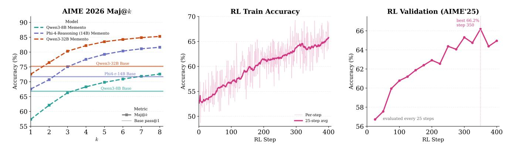

# **5 Improving Accuracy via RL**

**Capability under compression.** We first investigate whether we can match the baseline performance with MEMENTO or there is some inherent limitation due to compression. We focus on math, which is the most challenging domain for compression (Table [1\)](#page-7-0). Generating *n*=64 independent completions per problem for all three model families on AIME 2024/25/26, we find that coverage (pass@64) is nearly identical: the gap averages only 2.6 pp and the Jaccard similarity between Base and MEMENTO solved sets averages 96.4%, reaching 100% in two of nine settings (Table [2\)](#page-9-1).

**Majority voting recovers the gap.** The coverage analysis above shows that MEMENTO models *can* solve nearly the same problems as their base counterparts—they just do so less consistently. Majority voting (maj@*k*) makes this concrete: as shown in the left panel of Figure [6,](#page-10-1) all three MEMENTO SFT models match or exceed the Base pass@1 accuracy with just *k*=2–3 samples. For Qwen3-32B on AIME'26, maj@2 already surpasses the Base pass@1 line. This tells us two things: (1) the accuracy gap after SFT is a *consistency* problem, not a *capa-*

Table 2: **Problem coverage** (pass@64) and solved-set overlap for Base vs. MEMENTO on AIME (*n*=64 per problem, 30 problems per benchmark).

| Model            | Bench.                        | Base                 | MEMENTO              | Ret.                  | Jacc.                 |
|------------------|-------------------------------|----------------------|----------------------|-----------------------|-----------------------|
| Qwen3-8B         | AIME'24                       | 93.3                 | 90.0                 | 96.4                  | 96.4                  |
|                  | AIME'25                       | 93.3                 | 86.7                 | 92.9                  | 92.9                  |
|                  | AIME'26                       | 86.7                 | 90.0                 | 100.0                 | 96.3                  |
| Phi-4-r (14B) | AIME'24 AIME'25 AIME'26 | 93.3 93.3 93.3 | 93.3 90.0 90.0 | 100.0 96.4 96.4 | 100.0 96.4 96.4 |
| Qwen3-32B        | AIME'24                       | 93.3                 | 93.3                 | 100.0                 | 100.0                 |
|                  | AIME'25                       | 90.0                 | 83.3                 | 92.6                  | 92.6                  |
|                  | AIME'26                       | 93.3                 | 90.0                 | 96.4                  | 96.4                  |

*bility* problem—the correct answers are in the distribution, they are just not the mode; and (2) RL is a natural fix, since it can sharpen the distribution toward correct traces without needing to teach new skills.

> **[图片提取文字 (无描述)]:**
> AIME 2026 Maj@k RL Train Accuracy RL Validation (AIME'25) best 66.2% Model 90 step 350 - Qwen3-8B Memento 66 Phi-4-Reasoning (14B) Memento 85 Qwen3-32B Memento 65 Accuracy (%) 64 Accuracy (%) (%) Qwen3-32B Base Phi4-r-14B Base 60 Qwen3-8B Base 65 58 Metric 60 -m- Maj@k Per-step 50 evaluated every 25 steps - 25-step avg Base pass@1 55 56 300 100 200 300 400 200 400 100 RL Step RL Step

Figure 6: **Majority-vote headroom and Qwen3-8B CISPO (MiniMax et al., 2025) RL trajectory.** Left: AIME 2026 maj@k for the three MEMENTO SFT models (Table 1); horizontal lines show each Base model's pass@1. All models match Base accuracy by k=2–3. Middle: per-step RL training accuracy (faint raw trace with 25-step moving average). Right: AIME'25 validation accuracy evaluated every 25 steps, peaking at 66.2% at step 350 (used in Table 1). Majority voting uses uniform tie-breaking among tied majority answers.

**Recovering accuracy via RL.** Given that the correct answers are already present in the MEMENTO distribution, RL should improve pass@1 by reallocating probability mass toward correct compressed traces rather than by teaching entirely new skills. We fine-tune the Qwen3-8B MEMENTO SFT checkpoint with CISPO (MiniMax et al., 2025), Clipped Importance-Sampled Policy Optimization, a GRPO (Shao et al., 2024) variant that clips and detaches the importance-sampling weight. Similarly to MiniMax et al. (2025), we found CISPO to be more stable than standard GRPO during training. We also add a KL penalty ( $\beta$ =0.001) to prevent the response-length collapse we observed in initial runs without regularization, and adopt rule-based math rewards.

Rollouts use memento attention block masking via our custom vLLM engine (Section 6). Training uses sparse block-masked attention (similar to Stage 2 of SFT) to match the inference-time masking pattern. Full hyperparameters and training details are provided in Section A.2.3.

**CISPO algorithm.** We use CISPO (MiniMax et al., 2025) (Clipped Importance-Sampled Policy Optimization), a GRPO (Shao et al., 2024) variant that replaces the PPO (Schulman et al., 2017) clipped surrogate objective with a stop-gradient clipped importance-sampling weight:

$$L = -\operatorname{sg}(\operatorname{clip}(r_t(\theta), 1 - \epsilon_{\text{low}}, 1 + \epsilon_{\text{high}})) \cdot A_t \cdot \log \pi_{\theta}(a_t \mid s_t), \tag{1}$$

where  $r_t(\theta) = \pi_\theta / \pi_{\theta_{old}}$  is the importance ratio and sg denotes stop-gradient. Unlike PPO clipping, which zeros out gradients when the ratio exceeds the trust region, CISPO ensures every token contributes a gradient signal—the clipped ratio acts as a fixed per-token weight. We add a KL penalty term  $\beta \cdot D_{KL}(\pi_\theta || \pi_{ref})$  with  $\beta = 0.001$  to prevent excessive drift from the SFT checkpoint.

**Block length capping.** Because we use accuracy as the sole reward signal, we observed the model learning to generate fewer and longer reasoning blocks, undermining the KV cache savings that block masking provides. To maintain low peak KV cache occupancy during RL rollouts, we cap individual blocks at 7K tokens: when a block exceeds this limit during generation, the vLLM engine forces a <|block\_end|> token and the model continues from a new block.

The middle and right panels of Figure 6 show the training and validation trajectories. Train accuracy rises from 52.7% to 65.8% (25-step moving average) over 400 steps, while AIME'25 validation peaks at 66.2% at step 350. After RL, MEMENTO+RL raises AIME'26 from 57.3 to 64.9 and Comp. Math from 45.1 to 49.4, while also improving GPQA-D from 55.8 to 62.9 above the 61.4 vanilla baseline. The compression remains substantial: peak KV rises from 1.08 to 1.48 GB after RL, still well below the 2.71 GB vanilla footprint. RL therefore converts the majority-voting headroom into stronger single-sample accuracy while preserving much of MEMENTO's memory advantage.

**Matching the baselines with RL.** The pass@1 drop after SFT on OPENMEMENTOS reflects reduced consistency, not lost knowledge. Without any additional training, majority voting at *k*=3 already recovers base-model accuracy (Figure [6,](#page-10-1) left). With RL fine-tuning we can significantly improve pass@1 accuracy and match or improve over the control run for Qwen3-8B (Table [1\)](#page-7-0).

