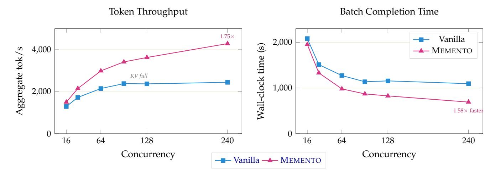
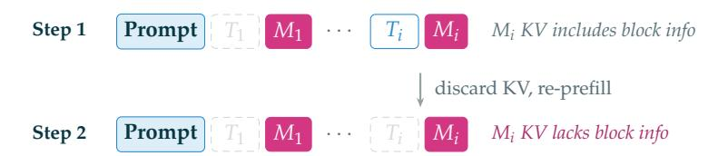
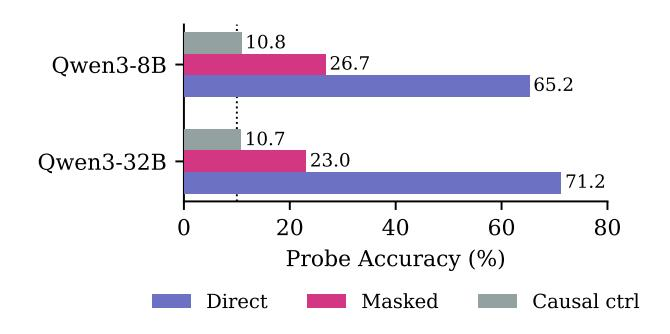

# **6.1 Serving Memento Models with vLLM**

MEMENTO's block masking requires *non-standard, data-dependent sparse attention*: which tokens are masked depends on the generated sequence itself, not on a fixed pattern known at compile time. To the best of our knowledge, no production inference framework, including vLLM [\(Kwon et al.,](#page-15-4) [2023\)](#page-15-4), SGLang [\(Zheng et al.,](#page-17-6) [2024\)](#page-17-6), or TensorRT-LLM, provides a built-in mechanism for request-level custom sparse attention masks that evolve during generation. We therefore build native block masking support directly into vLLM's V1 engine, extending it so that it *physically* removes masked tokens from the KV cache. Our approach operates purely at the Python level of vLLM, can be installed as a simple patch on top of an existing vLLM installation, and works with the vanilla FlashAttention and FlashInfer kernels, requiring no custom sparse attention kernel. For more details on the implementation, see Section [A.3.2.](#page-24-0)

> **[图片提取文字 (无描述)]:**
> **Batch Completion Time** Token Throughput  $1.75 \times$ Vanilla 2,000 (s) 4,000 → MEMENTO Aggregate tok/s KV full Wall-clock 1,000 2,000 1.58× faster 0 64 240 16 64 128 240 16 128 Concurrency Concurrency ── Vanilla ── MEMENTO

Figure 7: **Serving throughput (Qwen3-8B, 1**× **B200 GPU).** AIME24 × 8 repetitions (240 requests, 32K max tokens). Left: MEMENTO sustains 1.75× higher token throughput at full concurrency. Right: 1.58× faster batch completion. Vanilla plateaus as KV cache fills GPU memory.

**Throughput experiments.** We benchmark serving throughput on Qwen3-8B with AIME24 × 8 repetitions (240 concurrent requests) with 32K max tokens on a single B200 GPU. At high concurrency, vanilla vLLM becomes KV-cache-bound: throughput plateaus as the KV cache fills GPU memory. MEMENTO's block masking frees KV cache entries as blocks complete, allowing the engine to sustain higher batch sizes and throughput throughout the run. MEMENTO sustains 4,290 tok/s vs. 2,447 for vanilla (1.75×) and completes the batch in 693s vs. 1,096s (1.58× faster). This infrastructure was also crucial for enabling RL fine-tuning with MEMENTO: generating 32K-token training rollouts requires an inference engine that natively supports block masking during generation, since each rollout must produce and compact blocks on the fly. Without the vLLM integration, generating these long traces at the scale required for RL would be infeasible.

**Memento + vLLM.** MEMENTO's vLLM integration physically removes masked KV entries, sustaining 1.75× higher throughput at full concurrency on a single B200 GPU. Our vLLM implementation enabled us to perform reasoning RL by supporting on-the-fly block masking during 32K-token rollout generation.

#### 6.2 The Dual Information Stream

### 6.2.1 KV Cache Ablation: Do Memento KV States Carry Block Information?

Under memento attention, block content is masked for *future* tokens, but the memento's KV values were computed *during generation* while the model could still attend to the full block. Do these KV states carry useful information beyond the memento text itself? We denote thinking block i as  $T_i$  and its corresponding memento as  $M_i$ .

**Experiment.** We compare two inference modes on the *same* Qwen3-8B memento attention checkpoint:

- **Memento attention** (normal): While generating  $M_i$ , the model attends to all tokens in  $T_i$  as well as the prompt and all preceding mementos. Once  $M_i$  is complete,  $T_i$  is masked from all subsequent attention—but  $M_i$ 's KV cache entries, which were computed with block context, are retained. Future tokens therefore attend to memento KV states that implicitly encode block content.
- Memento attention + restart: Generation of each memento proceeds in two steps. Step 1 (generation):  $M_i$ 's text is generated identically to normal memento attention: the model attends to  $T_i$  and produces the same summary tokens. Step 2 (KV recomputation): After  $M_i$  is complete, we discard the KV cache and run a fresh prefill pass over the effective context: prompt  $+ M_1 + M_2 + \cdots + M_i$  (with standard causal masking within and across mementos). Critically, all past blocks are now masked and each memento's KV entries are recomputed attending only to the prompt and preceding mementos, not to the block it originally summarized. The generated memento text is identical in both conditions; only the KV representations differ. This isolates the question: does the information encoded in the KV states (from having attended to the block during generation) matter beyond what the memento text conveys?

The 15 pp drop confirms that memento KV states carry significant information from the masked blocks. Mementos function as compressed pointers into cached reasoning state, not just standalone text replacements. This distinguishes MEMENTO from prior iterative summarization methods Yan et al. (2025); Wang et al. (2025) which discard original tokens entirely after summarization: unlike those methods, MEMENTO retains the KV cache, and this retention is critical.

**KV** states carry reasoning capacity. Recomputing memento KVs without block access drops AIME24 accuracy from 66.1% to 50.8%. Mementos are not standalone text replacements—their cached KV representations form a high-bandwidth implicit channel that restart-based methods discard.

Table 3: **KV ablation** on full AIME24 (30 problems, Qwen3-8B memento attention checkpoint, 32K generation). Block masking accuracy is from the 64-repetition evaluation in Table 1; the restart experiment uses 8 repetitions.

| Inference mode                                  | Pass@1         |
|-------------------------------------------------|----------------|
| Memento att. (normal) Memento att. + restart | 66.1% 50.8% |
| Δ                                               | −15.3 pp       |

> **[图片提取文字 (无描述)]:**
> **Prompt**  $T_1$   $M_1$   $\cdots$   $T_i$   $M_i$   $M_i$  KV includes block info Step 1 discard KV, re-prefill **Prompt**  $T_1 M_1 \cdots T_i M_i M_i$  KV lacks block info

Figure 8: **Restart ablation.** Step 1:  $M_i$  is generated with full attention to  $T_i$  (same as normal memento attention). Step 2: KV cache is discarded and recomputed via prefill over prompt  $+ M_{1..i}$  only— $T_i$  is masked, so  $M_i$ 's KV states no longer encode block information. The 15 pp accuracy drop (Table 3) shows the KV channel carries significant reasoning capacity.

## 6.2.2 Probing the Implicit KV Channel

The KV ablation in Section 6.2.1 shows that memento KV states matter for downstream accuracy. But *what* information do they carry? We design a probing experiment that injects a known signal into a masked

block and measures how much of it can be recovered from downstream memento KV states that never directly attended to that block.

**Experimental design.** We inject a random 5-digit "passcode" (00000–99999) into the content of a target block *T*2 in a real AIME'25 reasoning trace, then run a forward pass with MEMENTO block masking (keep last n blocks=0). We extract KV states (keys and values concatenated) from memento token positions at specific layers and train a probe (MLP, 512×256 hidden units, 128 bottleneck) to predict the 5 individual digits from these features. We report the average accuracy across the 5 predictions (one for each passcode digit) with the random prediction baseline being 10%. Crucially, the validation split is *label-unique*: no digit combination appears in both train and validation, preventing memorization.

We evaluate three probing conditions:

- **Direct:** Probe the KV states of memento *M*2, which *can* attend to the target block *T*2. This measures the upper bound of information encoded in a single memento's KV states.
- **Masked:** Probe the KV states of memento *M*3, which *cannot* attend to *T*2 as *T*2 has already been evicted from the KV cache by the time *M*3 is computed. Any signal recovered here must have propagated through the memento chain.
- **Causal control:** Probe the KV states of memento *M*1, which *precedes* the target block *T*2 in the sequence. Since *M*1 is computed before *T*2 is even generated, it cannot contain any information about the passcode. This serves as a sanity check; we expect chance-level accuracy (10%).

We run this experiment at two scales:

- **Qwen3-8B**: 15K samples from AIME'25 traces generated by the 8B model, with injected passcodes, probing at layers 3 and 35.
- **Qwen3-32B**: 15K samples from AIME'25 traces generated by the 32B model, with injected passcodes, probing at layers 3 and 63.

**Results.** Figure [9](#page-14-3) summarizes the findings. At the direct position, the memento text itself bears no relation to the passcode, yet the KV states recover the injected digits with 60–70% accuracy, demonstrating that KV representations encode far more information than the corresponding tokens. At the masked position, where the memento *cannot* attend to the target block, both models still recover the passcode well above chance (26.7% for Qwen3-8B, 23.0% for Qwen3-32B vs. 10% chance). The causal control, probing a memento that *precedes* the target block, shows exactly chance-level accuracy, confirming that the recovered signal is real and directional. Table [4](#page-14-3) further shows that leakage concentrates in deeper layers. In Qwen3-8B, an early layer (the 4th) shows near-chance masked accuracy (10.8%) while the last layer (the 36th) reaches 26.5%; the pattern repeats in Qwen3-32B (12.8% at the 4th layer vs. 22.4% at the 64th). The same trend holds for the direct condition, where deeper layers carry substantially more signal (64.9% vs. 51.6% for 8B; 68.7% vs. 53.8% for 32B). This is consistent with the residual stream accumulating information across layers. We further validate these findings with a controlled toy transformer experiment (Section [A.4.2\)](#page-26-1): a 4-layer model trained on synthetic data exhibits the same leakage pattern (24.9% masked accuracy vs. 10% chance), with signal decaying gradually over distance but persisting up to 7 hops from the target block. Leakage remains constant across training checkpoints even as task accuracy improves, confirming the channel is architectural—not learned.

**KV states carry an implicit information channel.** Memento KV representations propagate block information across masked boundaries—an architectural effect that complements the explicit memento text and explains why single-pass MEMENTO outperforms restart-based methods.

> **[图片提取文字 (无描述)]:**
> 10.8 26.7 Qwen3-8B -65.2 10.7 Qwen3-32B 23.0 71.2 20 60 80 Probe Accuracy (%) Direct Masked Causal ctrl

Figure 9: **Probing the implicit KV channel.** Both Qwen3-8B and Qwen3-32B recover the passcode well above 10% chance from *masked* memento positions (26.7% and 23.0%), while causal controls show exactly chance-level accuracy. The dotted line marks 10% chance (random guessing over 10 digits).

Table 4: **Deeper layers carry the signal.** Per-layer probe accuracy (%) under direct and masked conditions (keep0). The leaked signal concentrates in deeper layers; early layers show near-chance masked accuracy.

|                   |        | Qwen3-8B | Qwen3-32B |        |  |
|-------------------|--------|----------|-----------|--------|--|
|                   | Direct | Masked   | Direct    | Masked |  |
| 4th layer (early) | 51.6   | 10.8     | 53.8      | 12.8   |  |
| Last layer        | 64.9   | 26.5     | 68.7      | 22.4   |  |
| Both layers       | 65.2   | 26.7     | 71.2      | 23.0   |  |
| Chance            | 10.0   |          |           |        |  |

