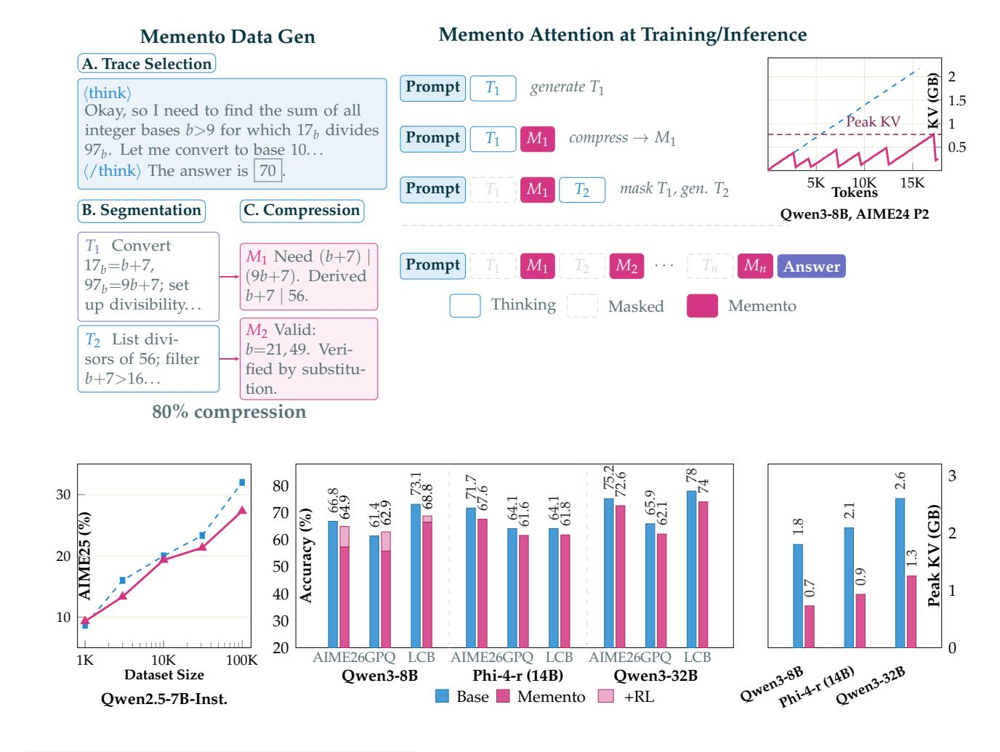

# MEMENTO: Teaching LLMs to Manage Their Own Context

Vasilis Kontonis\* Yuchen Zeng Shivam Garg Lingjiao Chen Hao Tang Ziyan Wang Ahmed Awadallah Eric Horvitz John Langford Dimitris Papailiopoulos\* Microsoft Research

♠ Code: https://github.com/microsoft/memento

@ OPENMEMENTOS: https://huggingface.co/datasets/microsoft/OpenMementos

Reasoning models think in long, unstructured streams with no mechanism for compressing or organizing their own intermediate state. We introduce MEMENTO: a method that teaches models to segment reasoning into blocks, compress each block into a *memento*, i.e., a dense state summary, and reason forward by attending only to mementos, reducing context, KV cache, and compute. To train MEMENTO models, we release OPENMEMENTOS, a public dataset of 228K reasoning traces derived from OpenThoughts-v3, segmented and annotated with intermediate summaries. We show that a two-stage SFT recipe on OPENMEMENTOS is effective across different model families (Qwen3, Phi-4, Olmo 3) and scales (8B–32B parameters). Trained models maintain strong accuracy on math, science, and coding benchmarks while achieving  $\sim$ 2.5× peak KV cache reduction. We extend vLLM to support our inference method, achieving  $\sim$ 1.75× throughput improvement while also enabling us to perform RL and further improve accuracy. Finally, we identify a *dual information stream*: information from each reasoning block is carried both by the memento text and by the corresponding KV states, which retain implicit information from the original block. Removing this channel drops accuracy by 15 pp on AIME24.

> **[图片提取文字 (无描述)]:**
> Memento Attention at Training/Inference Memento Data Gen A. Trace Selection Prompt generate T1 (think) 1.5 Okay, so I need to find the sum of all · Peak KV integer bases b>9 for which  $17_b$  divides Prompt  $compress \rightarrow M_1$ 0.5  $97_h$ . Let me convert to base 10...(/think) The answer is 70. 5K Tokens 15K Prompt mask  $T_1$ , gen.  $T_2$ B. Segmentation C. Compression Qwen3-8B, AIME24 P2 T1 Convert  $M_1$  Need (b+7)Prompt  $17_{h}=b+7$ ,  $M_1$ Answer (9b+7). Derived  $97_{h} = 9b + 7$ ; set b+7 | 56.Thinking up divisibility... Memento Masked M2 Valid: T2 List divib=21,49. Verisors of 56; filter fied by substitub+7>16...tion. 80% compression 3 80 30 65.9 62.1 70 Accuracy (%) AIME25 (%) 60 Peak KV 20 50 40 10 30 Owen3-9B [14B] 20 AIME26GPO LCB AIME26GPQ LCB AIME26GPO LCB Qwen3-32B 1K 10K 100K **Dataset Size** Phi-4-r (14B) Qwen3-8B Qwen3-32B ■ Base ■ Memento ■ +RL Qwen2.5-7B-Inst.

\*Corresponding authors. Emails: {vkontonis, zengyuchen, shigarg, lingjiaochen, tanghao, t-ziyanwang, ahmed.awadallah, horvitz, jcl, dimitriosp}@microsoft.com

Figure 0: **MEMENTO overview. Top left:** SFT data generation pipeline. Starting from a reasoning trace, we split text into sentences, use an LLM to score each sentence boundary as a potential stopping point, optimize boundary selection algorithmically, and finally use an LLM to summarize each block into a memento. **Top right:** Sparse attention during inference. The model produces alternating thinking blocks (*Ti* ) and mementos (*Mi* ); once a memento is generated, KV cache entries for its preceding thinking block are physically removed. The sawtooth KV trace shows the resulting memory pattern. **Bottom left:** Data scaling on Qwen2.5-7B-Instruct (AIME25); MEMENTO scales similarly to vanilla SFT on OpenThoughts [\(Guha et al.,](#page-15-0) [2025\)](#page-15-0) across dataset sizes (Figure [3\)](#page-6-0). **Bottom center:** Accuracy across three models on AIME26, GPQA-D, and LCB; lighter bars show RL gains for Qwen3-8B (Section [5\)](#page-10-0). **Bottom right:** Peak KV cache (GB), averaged across all benchmark categories, showing ∼2–2.5× reduction.

