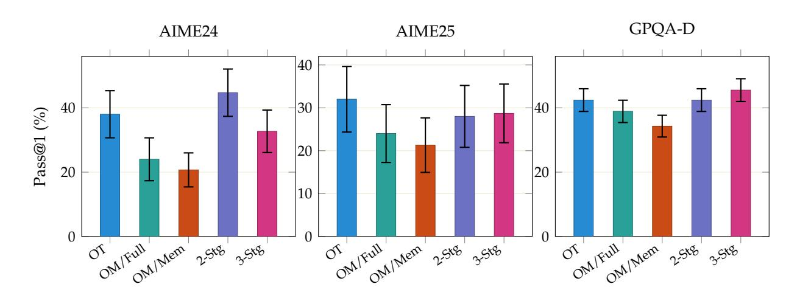
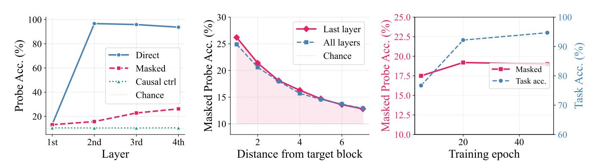

# **A.2.2 Evaluation Details**

**Inference Backend.** We evaluate all models using a standalone evaluation script (evaluate vllm.py) built on a custom vLLM fork (branch token-span-removal) that implements native BlockMaskingConfig support for KV-cache-level block masking. The fork is installed as a Python overlay on top of the container's vLLM installation. The script operates in two modes:

- 1. **Offline mode** (default): Uses vLLM's Python LLM class for fast batched generation. All problems × repetitions are submitted as a single batch, and vLLM handles scheduling internally.
- 2. **Server mode** (--track kv): Launches vLLM as OpenAI-compatible HTTP servers (one per GPU), sends requests sequentially per GPU, and polls the /metrics endpoint to record per-request KV cache usage over time. This mode produces kv trace.csv files used for the KV cache simulation validation in Section [A.3.1.](#page-24-1)

### **Block masking configuration.** The BlockMaskingConfig specifies:

- keep last n blocks: −1 (vanilla, no masking), 0 (memento attention, compact all blocks), or *N* (keep last *N* blocks visible).
- mask delimiters: False for Qwen3 and Olmo 3 (block delimiters remain visible); True for Phi-4 (delimiters are also masked).
- compact on summary end: True—block content is evicted from the KV cache when <|summary end|> is generated.
- enable prefix caching: **must be False** when block masking is active, since block eviction modifies the KV cache in ways incompatible with prefix sharing.

**Generation Parameters.** All evaluations use the same generation parameters unless otherwise noted: temperature 0.6, top-*p* 0.95, top-*k* 20, min-*p* 0.0, max new tokens 32,000, and skip special tokens=False (to preserve block/summary tokens in the output for post-hoc analysis). Competition-math benchmarks (AIME, HMMT, BrUMO, SMT, CMIMC; ≤53 problems each) receive 64 independent generations per problem. Larger benchmarks (MATH-500, GPQA-Diamond, LiveCodeBench) receive 2 generations per problem. We report pass@1 accuracy: the per-problem correct fraction averaged across all generations.

**Hardware and Parallelism.** Evaluations run on NVIDIA B200 GPUs. All models use tensor parallelism (TP) = 1 with data parallelism (DP) = 8 across 8 GPUs on a single node. The vLLM engine is configured with max model length=32768, max num batched tokens=32768, and gpu memory utilization=0.85.

**Benchmarks.** Table [5](#page-22-0) summarizes the 14 benchmarks used in our evaluation. All benchmarks use 0-shot evaluation (no few-shot examples).

Table 5: **Benchmark details.** Competition-math benchmarks use 64 generations per problem; MATH-500, GPQA, and Live-CodeBench use 2 generations. All use temperature 0.6 and 32K max output tokens.

| Benchmark        | Source                         | # Problems | Answer format                 |
|------------------|--------------------------------|------------|-------------------------------|
| AIME 2024        | HuggingFaceH4/aime 2024        | 30         | Integer (0–999),              |
| AIME 2025        | yentinglin/aime 2025           | 30         | Integer (0–999),              |
| AIME 2026        | MathArena/aime 2026            | 30         | Integer (0–999),              |
| HMMT Feb 2023    | MathArena/hmmt feb 2023        | 30         | Math expression               |
| HMMT Feb 2024    | MathArena/hmmt feb 2024        | 30         | Math expression               |
| HMMT Feb 2025    | MathArena/hmmt feb 2025        | 30         | Math expression               |
| HMMT Feb 2026    | MathArena/hmmt feb 2026        | 33         | Math expression               |
| HMMT Nov 2025    | MathArena/hmmt nov 2025        | 30         | Math expression               |
| BrUMO 2025       | MathArena/brumo 2025           | 30         | Math expression               |
| SMT 2025         | MathArena/smt 2025             | 53         | Math expression               |
| CMIMC 2025       | MathArena/cmimc 2025           | 40         | Math expression               |
| MATH-500         | HuggingFaceH4/MATH-500         | 500        | Math expression               |
| GPQA-Diamond     | Idavidrein/gpqa                | 198        | Multiple choice (A–D)         |
| LiveCodeBench v6 | lighteval/code generation lite | 1,055      | Python code (execution-based) |

**Answer verification.** For mathematics benchmarks (AIME, HMMT, BrUMO, SMT, CMIMC, MATH-500), answer verification follows a two-stage pipeline adapted from OlmoMathReward [\(Team Olmo et al.,](#page-16-11) [2025\)](#page-16-11):

- 1. **Candidate extraction**: Multiple strategies are tried in order—\boxed{. . . } content, "Final Answer: . . . " patterns, last \$. . . \$ content, and raw normalized text.
- 2. **Equivalence checking**: Each candidate is compared against the ground truth using two methods: (a) SymPy-based symbolic equivalence (LaTeX is parsed to symbolic expressions and their difference is simplified with a 5-second timeout), and (b) Hendrycks-style string normalization (strip \left/\right delimiters, \dfrac→\frac, whitespace, and unit strings). A candidate is accepted if either method succeeds.

For GPQA-Diamond, we extract the last letter choice (A/B/C/D) from the response and compare against the gold label. For LiveCodeBench, generated Python code is executed against public and private test cases; a solution passes only if all test cases succeed.

**Competition-math benchmarks.** All eleven competition-math benchmarks are sourced from Math-Arena [\(Balunovic et al.](#page-14-4) ´ , [2025\)](#page-14-4), a platform that evaluates LLMs on recently held math competitions to minimize contamination risk. The individual competitions are:

- **AIME** (American Invitational Mathematics Examination, 2024/2025/2026): A pre-olympiad competition administered by the Mathematical Association of America (MAA). Each year comprises two 15-problem papers (AIME I and II, 30 total) with integer answers in the range 0–999.
- **HMMT** (Harvard-MIT Mathematics Tournament, Feb 2023/2024/2025/2026 and Nov 2025): A major university-organized competition with problems in algebra, combinatorics, geometry, and number theory. February and November tournaments are held separately; most editions contribute 30 problems (HMMT Feb 2026 has 33).
- **BrUMO** (Brown University Mathematics Online, 2025): An online math competition organized by Brown University; 30 problems.
- **SMT** (Stanford Mathematics Tournament, 2025): A competition organized by Stanford University students covering algebra, combinatorics, geometry, and number theory; 53 problems.

• **CMIMC** (Carnegie Mellon Informatics and Mathematics Competition, 2025): A competition organized by Carnegie Mellon University; 40 problems spanning algebra, combinatorics, geometry, and number theory.

All competition datasets are available on HuggingFace under the MathArena organization ([https://](https://huggingface.co/MathArena) [huggingface.co/MathArena](https://huggingface.co/MathArena)).

**Metrics.** We report pass@1 accuracy: for each problem, we average the binary correctness indicator across all generations (64 for competition math, 2 for MATH-500/GPQA/LCB), then average across problems. For the main table (Table [1\)](#page-7-0), competition math ("Comp. Math") is the unweighted average of pass@1 across eleven competition-math benchmarks (AIME'24/25/26, HMMT Feb'23/24/25/26, Nov'25, BrUMO'25, SMT'25, CMIMC'25). Standard errors are computed as the standard error of per-problem means across problems.

### **A.2.3 RLVR Training Details**

**Rollout infrastructure.** During RL rollouts, block masking must be active so that the policy generates under the same conditions as deployment. We use our custom vLLM engine (Section [6\)](#page-11-0) with BlockMaskingConfig(enable=True, keep last n blocks=0) to physically compact KV cache entries after each summary, exactly as at inference time. Training forward passes use a corresponding sparse block-masked attention implementation so that the gradient computation matches the masked generation pattern.

**Training configuration.** We fine-tune the Qwen3-8B MEMENTO SFT checkpoint (the keep-0 model from Stage 2 of our two-stage SFT recipe) using the DolciMath training set (29,670 prompts) with rule-based olmo math rewards (sympy-based LaTeX answer verification, no LLM judge). Key hyperparameters:

- **Compute:** 24 GPUs (3 nodes × 8), FSDP with optimizer offload
- **Group size:** 8 rollouts per prompt (train), 64 per prompt (eval)
- **Batch size:** 240 prompts per step
- **Optimizer:** AdamW, lr = 10−6 , cosine warmup (10 steps), gradient clipping 1.0
- **Clipping:** *ϵ*low = *ϵ*high = 0.2
- **KL coefficient:** *β* = 0.001
- **Normalization:** batch-level advantage normalization, group-total loss normalization
- **Sampling:** temperature 1.0 (train), 0.6 (eval); prompt length 1024, response length 31744
- **Evaluation:** AIME'24 and AIME'25 every 25 steps
- **Selected checkpoint:** step 350 (best AIME'25 validation at 66.2%)

**Detailed results.** After 350 steps, the MEMENTO+RL model improves across all benchmarks relative to MEMENTO SFT: AIME'26 rises from 57.3% to 64.9%, Comp. Math from 45.1% to 49.4%, GPQA-D from 55.8% to 62.9% (above the 61.4% vanilla baseline), LCB v6 from 66.5% to 68.8%, and MATH-500 from 90.1% to 91.0%. The KV footprint increases modestly: peak KV rises from 1.08 to 1.48 GB (still 45% below vanilla's 2.71 GB) and KV AUC from 10.7 to 16.4 GB·ktok (roughly half of vanilla's 30.9). RL trades a small amount of compression for substantially improved single-sample accuracy.

#### A.3 Inference and KV Cache Details

#### A.3.1 KV Cache Simulation Validation

The KV cache metrics in Table 1 are computed via offline simulation rather than live profiling, enabling measurement across all 14 benchmarks and 64 repetitions per problem (>80,000 total completions). We validate this approach against real KV cache tracking data.

**Simulation procedure.** For each generated response, we tokenize the full output and replay generation step-by-step. At each step, we track the number of tokens in the KV cache, detecting <|block\_start|>, <|block\_end|>, and <|summary\_end|> tokens. In memento attention mode, all completed blocks are evicted from the KV cache when the summary ends. This produces a per-token KV trajectory from which we extract peak KV (maximum occupancy) and average KV (area under curve / generation length).

**Token-to-GB conversion.** We convert token counts to memory using the exact model architecture:

GB = tokens 
$$\times \underbrace{2}_{\text{K+V}} \times n_{\text{layers}} \times n_{\text{kv\_heads}} \times d_{\text{head}} \times \underbrace{2}_{\text{bf16 bytes}} / 10^9$$

This yields 144 KB/token for Qwen3-8B (36 layers, 8 KV heads, d = 128), 256 KB/token for Qwen3-32B (64 layers), and 200 KB/token for Phi4-RP (40 layers, 10 KV heads).

**Validation against real measurements.** We previously ran evaluations with vLLM's KV cache tracking enabled (Prometheus metric polling) on Qwen3-8B/32B across 4 benchmarks in vanilla and memento attention modes (12,680 paired observations on  $1 \times B200$  GPU, TP=1). For each sample, we compare the simulated peak KV (in tokens) against the real measured peak KV (as a fraction of the GPU's KV pool). The linear correlation yields  $R^2 > 0.999$  for all model/benchmark/mode combinations, with mean absolute error below 0.02 GB. The measured KV pool sizes are consistent with the B200's 192 GB HBM: after accounting for model weights and vLLM overhead ( $\sim$ 6–16 GB), the observed pools match theoretical predictions to within 6–10%.

## A.3.2 vLLM Block Masking Implementation

We extend vLLM (branch token-span-removal) with a BlockMaskingConfig that enables KV-cache-level block compaction during autoregressive generation, requiring no changes to the model weights or attention kernels. Even systems that implement fixed sparse patterns (e.g., DeepSeek-V3's Multi-head Latent Attention (DeepSeek-AI, 2024)) do so by modifying the model architecture rather than providing a general-purpose masking API. The implementation has three components:

- (i) Per-request state machine. Each request carries a BlockMaskingState that tracks open blocks, completed blocks, and pending compactions. A lightweight BlockMaskingProcessor inspects each generated token for the four special tokens (<|block\_start|>, <|block\_end|>, <|summary\_start|>, <|summary\_end|>) and drives state transitions. When <|summary\_end|> is produced, the corresponding reasoning block is marked for compaction.
- (ii) Physical KV cache compaction. Unlike logical masking (which would require custom attention kernels), we physically remove masked tokens from the KV cache. When a block is compacted, the scheduler computes the set of active (non-masked) logical positions, translates them to physical KV cache locations, and issues a compact\_kv\_cache operation that copies the active entries into contiguous slots and frees trailing KV blocks. This means standard FlashAttention and paged-attention kernels work unmodified—they simply never see the evicted tokens. A logical-to-physical translation layer (via sorted spans and binary search) maintains  $O(\log n)$  position lookups across multiple compactions per request.
- (iii) Scheduler integration. The scheduler orchestrates compaction between forward passes: it collects pending KV copy operations and block table truncations, dispatches them to the GPU worker, and updates

the request's num\_computed\_tokens. In restart mode (Section 6.2.1), the scheduler additionally rewinds the request to the summary start position, triggering a re-prefill of memento tokens with a clean KV cache from which block content has been removed.

The keep\_last\_n\_blocks parameter controls compaction aggressiveness: -1 disables masking (vanilla), 0 compacts all completed blocks (memento attention), and N>0 keeps the last N blocks visible while compacting older ones. This provides a knob for trading off KV savings against the informational value of recent block context.

### A.3.3 Throughput Details

See Figure 7 in the main text for the throughput figure.

## A.4 Additional Experiments and Ablations

#### A.4.1 Multi-Stage SFT Ablation

Our two-stage SFT recipe is a key design choice. What happens if we skip stages? We compare five training strategies on Qwen2.5-7B, varying the curriculum:

- **OT**: trained on OpenThoughts-v3 only (standard reasoning SFT).
- OM/Full: trained directly from the base model on OPENMEMENTOS with full causal loss.
- **OM/Mem**: trained directly from the base model on OPENMEMENTOS while masking all thinking-block content.
- OT → OM/Full: first trained on OpenThoughts-v3, then fine-tuned on OPENMEMENTOS with full causal loss.
- OT  $\rightarrow$  OM/Full  $\rightarrow$  OM/Mem (Ours): first train a reasoning model, then apply two-stage memento SFT.

> **[图片提取文字 (无描述)]:**
> GPQA-D AIME24 AIME25 40 40 30 40 Pass@1 (%) 20 20 20 10 OM Full OM Men 2588 3588 0 On Full Men 2548 3548 ON Full Men 2:548 3:548

Figure 11: **Multi-stage SFT ablation** on AIME 2024, AIME 2025, and GPQA-Diamond (Pass@1, n=8, Qwen2.5-7B). OT = OpenThoughts only; OM/Full = OPENMEMENTOS Full Attention; OM/Mem = OPENMEMENTOS Memento Attention; 2-Stg = OT  $\rightarrow$  OM/Full; 3-Stg = OT  $\rightarrow$  OM/Full  $\rightarrow$  OM/Mem (Ours). Training directly on OPENMEMENTOS from the base model (OM variants) substantially underperforms vanilla reasoning SFT (OT). Our three-stage pipeline enables block masking while retaining strong performance.

Training directly on OPENMEMENTOS from the base model (OM/Full and OM/Mem) substantially underperforms the vanilla reasoning model (OT) across all three benchmarks, indicating that the blockmemento format is difficult to learn without first acquiring strong reasoning abilities. Fine-tuning the reasoning model in a single step (OT  $\rightarrow$  OM/Full) recovers and sometimes exceeds OT—most notably on

AIME 2024, where it improves from 38.0% to 44.7%—but this model cannot benefit from block masking at inference. Our full pipeline (OT  $\rightarrow$  OM/Full  $\rightarrow$  OM/Mem) enables block masking while retaining strong performance: 32.7% on AIME 2024, 28.7% on AIME 2025, and 45.5% on GPQA-Diamond—the highest GPQA-Diamond score among all configurations.

For models that already have reasoning skills (Qwen3-8B/32B), the OpenThoughts stage is unnecessary and we use two-stage SFT directly.

**Staged training helps.** For Qwen2.5-7B, acquiring reasoning ability first (OT), then learning the block-memento format (Full Attention), and finally adapting to block masking (Memento Attention) yields the best results. The full pipeline achieves the highest GPQA-Diamond score among all configurations.

### A.4.2 Toy Transformer: KV Channel is Architectural

**Experiment setup.** To verify that the implicit KV channel is an architectural property rather than an artifact of large-scale training, we replicate the probing experiment on a controlled toy transformer (4 layers, d=128, 810K parameters) trained on synthetic sequences of 10 blocks with keep\_last\_n\_blocks=0. Each block contains 5 random digits followed by a 3-digit cumulative sum. We train probes on 50K samples to predict the injected digits from memento KV states.

**Results.** The toy model exhibits the same leakage patterns as the production models (Figure 12). The left panel shows how leakage varies with layer depth. The first layer carries almost no signal for any condition, but deeper layers progressively encode more—the last layer reaches 26.2% masked accuracy compared to 13.1% at the first layer. The right panel shows how masked accuracy decays with distance from the target block: a sharp drop from block\_index=+1 (26.2%) to block\_index=+2 (21.4%), followed by gradual attenuation, with signal still 1.3× chance at block\_index=+7. The right panel confirms that the channel is architectural rather than learned: masked leakage stays roughly constant (17–19%) across training checkpoints even as task accuracy climbs from 77% to 95%.

> **[图片提取文字 (无描述)]:**
> © 30° 100 + \$ 22.5 Last layer Acc. (%) All layers 80 Direct Chance 20.0 Probe 50 J 60 Masked Masked - 80 Probe A Task acc. Causal ctrl ..... 40 Chance 15.0 -Masked 20 -10.0 60 4th 2nd 3rd 1st Distance from target block Training epoch Layer

Figure 12: **Toy transformer KV probing (keep0). Left:** Probe accuracy by layer depth—deeper layers carry more signal, especially for the masked condition. **Center:** Masked probe accuracy decays with distance from the target block but remains above chance even 7 hops away. **Right:** Leakage stays constant (17–19%) across training checkpoints even as task accuracy climbs from 77% to 95%, confirming the channel is architectural.

### A.5 Example Memento Traces

We present representative MEMENTO traces from AIME'26 (Section A.5.1), LiveCodeBench (Section A.5.2), and GPQA Diamond (Section A.5.3), showing how the model segments reasoning into blocks and generates compressed mementos.

#### A.5.1 AIME'26

Find the sum of the 10th terms of all arithmetic sequences of integers that have first term equal to 4 and include both 24 and 34 as terms.

