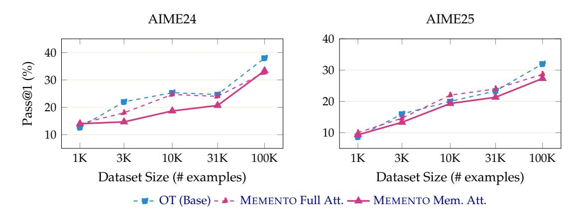
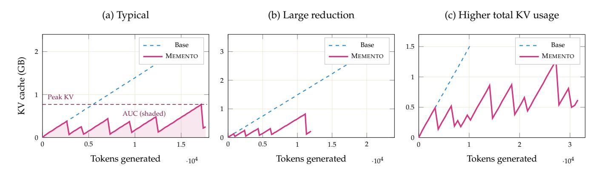
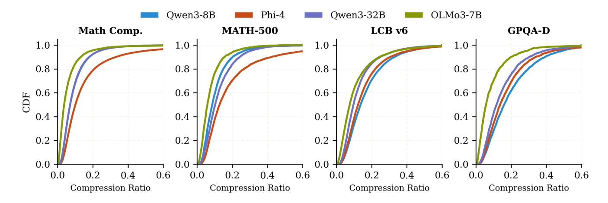

# **4 Training the MEMENTO Models**

We use a two-stage SFT procedure on OPENMEMENTOS that separates format learning from context management. The intuition follows standard curriculum learning: we first let the model acquire the block-memento format under normal conditions, then introduce the harder constraint of operating without access to masked content, see Section [A.4.1](#page-25-0) for an ablation.

**Stage 1: Full Attention**: Standard causal attention over all tokens. Loss is computed on all tokens, including thinking blocks, mementos, special tokens, and the final answer. The model learns the block-memento format without any context management pressure.

**Stage 2: Memento Attention**: After each completed memento, *the preceding thinking block is masked from all subsequent attention*. This teaches the model to produce self-contained mementos that carry all information needed for downstream reasoning.

The attention mask implementation maintains a **block cache** that tracks whether each token belongs to a thinking block, summary, or other content. When <|summary end|> is generated, the preceding block is marked as completed and masked from future attention. For training, this mask is constructed upfront as a dense matrix; for inference, the block cache is stateful across autoregressive steps. Four special tokens (<|block start|>, <|block end|>, <|summary start|>, <|summary end|>) are added and initialized as the mean embedding of semantically related existing tokens (e.g., <|block start|> from *block, start, begin, section, step*) plus small Gaussian noise.

**Data Scaling.** When training "from scratch" a non-reasoning model (Qwen2.5-7B-Instruct), data scaling follows a similar monotonic trend as standard reasoning SFT [\(Guha et al.,](#page-15-0) [2025\)](#page-15-0). We study how performance scales with the amount of OPENMEMENTOS training data by fine-tuning Qwen2.5-7B-Instruct on varying amounts of data (1K, 3K, 10K, 31K, 100K examples), comparing vanilla OpenThoughts (OT), OPEN-MEMENTOS with full attention (OM/Full), and OPENMEMENTOS with memento attention (OM/Mem). As shown in Figure [3,](#page-6-0) all three methods improve monotonically from 1K to 100K. OT achieves the highest accuracy across all data budgets, while OM/Full and OM/Mem trail by a modest margin.

> **[图片提取文字 (无描述)]:**
> AIME24 AIME25 40 40 Pass@1 (%) 30 30 20 20 10 10 3K 10K 3K 10K 1K 31K 100K 1K 31K 100K Dataset Size (# examples) Dataset Size (# examples) - ■- OT (Base) - ▲- MEMENTO Full Att. — MEMENTO Mem. Att.

Figure 3: **Training data scaling.** Pass@1 accuracy on AIME24 and AIME25 for Qwen2.5-7B-Instruct fine-tuned on 1K–100K examples. All methods improve monotonically with data size.

**Fine-Tuning Reasoning Models.** When starting with already strong reasoning models, we found that training for more epochs on fewer samples is more effective than training on more samples with fewer epochs. We train on 31K samples from the 228K OPENMEMENTOS pool with 32K sequence length, as further gains are more effectively attainable through reinforcement learning (Section [5\)](#page-10-0) rather than additional supervised data. We release the full 228K dataset to support future research in both directions.

**Hyperparameters.** We use the same hyperparameters for all models and stages. Key hyperparameters: learning rate 8 × 10−5 , cosine schedule with 5% warmup, 5 epochs per stage, AdamW (*β*1=0.9, *β*2=0.999), no weight decay, bfloat16 precision, batch size 512, and 32 B200 GPUs. See Section [A.2.1](#page-19-1) for details.

**Results and Evaluation.** We evaluate MEMENTO across four model families and scales: Qwen3-8B, Phi-4 reasoning (14B), Qwen3-32B, and Olmo-3-7B. Example MEMENTO traces from Qwen3-32B are provided in Section [A.5.](#page-26-0) All results report pass@1 accuracy. We evaluate on 14 benchmarks spanning competition mathematics (11 contests sourced from MathArena, grouped as "Comp. Math" in Table [1\)](#page-7-0), standard math (MATH-500), science (GPQA Diamond), and code (LiveCodeBench v6); Table [1](#page-7-0) summarizes accuracy alongside KV cache footprints.

**Control Runs.** To decouple the effect of performing SFT on already strong reasoning models (that leads to some performance loss) we do control (shown in Gray in Table [1\)](#page-7-0) runs where we train the base models on the original unmodified OpenThoughts subsets. As one may expect the highest performance loss, both for MEMENTO and the control runs, happens for the most challenging Competition math benchmarks while for easier benchmarks such as MATH-500 MEMENTO is able to match baselines almost perfectly.

**Scale Helps.** Within the Qwen3 family the accuracy gap shrinks with scale, from −6.3 pp at 8B to −3.5 pp at 32B (averaged across the five benchmark groups in Table [1\)](#page-7-0). This suggests that larger models manage compressed context more effectively and that further gains may be achievable at greater scale.

Table 1: MEMENTO achieves 2–3× peak KV reduction on models with uniform attention layers while maintaining strong reasoning performance; RL on top of our Qwen3-8B further improves accuracy. Olmo-3-7B shows more modest savings (∼0.85–0.93×) due to its hybrid sliding-window architecture (Section [4\)](#page-8-0). The ∆ columns show changes of MEMENTO and Mem.+RL relative to Control: accuracy deltas are additive (pp); KV deltas are multiplicative (Method / Control, so 0.39× means 61% KV reduction). *Metrics.* Accuracy (%): pass@1 accuracy. Peak KV (GB): peak KV cache size; determines the minimum memory required to serve a request. AUC KV (GB·ktok): area under the KV-occupancy-vs-token curve, capturing total memory-time cost that penalizes both large footprints and long generations (see Figure [4](#page-8-1) for an illustration). *Rows.* For each model we report Base (unmodified), Control (Base fine-tuned on the same OpenThoughts source traces used to create OPENMEMENTOS, but without block/memento annotations, for the same number of training examples), and MEMENTO (SFT on OPENMEMENTOS with block masking); for Qwen3-8B we additionally report MEMENTO+RL (Section [A.2.3\)](#page-23-0). Olmo-3 MEMENTO competition-math evaluations use 8 generations per problem (vs. 64 for all other models) and are run with HuggingFace Transformers rather than vLLM. See Section [A.2.2](#page-21-0) for full benchmark and evaluation details.

|               |                   |                          | AIME'26                 |                        | Comp. Math              |                        | MATH-500                |                        | GPQA-D                  |                        | LCB v6                  |                        |
|---------------|-------------------|--------------------------|-------------------------|------------------------|-------------------------|------------------------|-------------------------|------------------------|-------------------------|------------------------|-------------------------|------------------------|
|               |                   |                          | Val                     | ∆                      | Val                     | ∆                      | Val                     | ∆                      | Val                     | ∆                      | Val                     | ∆                      |
| Qwen3-8B      | Base              | Acc Peak KV AUC KV | 66.81.1 2.41 25.3 |                        | 54.30.3 2.71 30.9 |                        | 90.50.9 0.84 4.3  |                        | 61.42.4 1.23 6.6  |                        | 73.11.0 1.76 15.6 |                        |
|               | Control           | Acc Peak KV AUC KV | 64.71.1 2.59 28.3 |                        | 49.20.3 2.82 33.1 |                        | 89.71.0 0.88 4.7  |                        | 57.82.5 1.60 11.8 |                        | 70.01.0 1.89 19.2 |                        |
|               | MEMENTO           | Acc Peak KV AUC KV | 57.31.1 1.02 9.7  | −7.4 0.39× 0.34× | 45.10.3 1.08 10.7 | −4.1 0.38× 0.32× | 90.10.9 0.41 1.9  | +0.4 0.47× 0.40× | 55.82.5 0.56 4.0  | −2.0 0.35× 0.34× | 66.51.0 0.60 5.6  | −3.5 0.32× 0.29× |
|               | Mem. + RL Peak KV | Acc AUC KV            | 64.91.1 1.45 14.9 | +0.2 0.56× 0.53× | 49.40.3 1.48 16.4 | +0.2 0.52× 0.50× | 91.00.9 0.68 3.2  | +1.3 0.77× 0.68× | 62.92.4 1.24 9.2  | +5.1 0.77× 0.78× | 68.81.0 1.12 10.3 | −1.2 0.59× 0.54× |
| Phi-4-r (14B) | Base              | Acc Peak KV AUC KV | 71.71.0 2.65 28.8 |                        | 55.10.3 3.06 35.9 |                        | 87.31.1 1.43 17.8 |                        | 64.12.4 0.80 3.7  |                        | 64.11.0 2.45 29.2 |                        |
|               | Control           | Acc Peak KV AUC KV | 69.81.0 3.04 28.6 |                        | 51.40.3 3.48 36.7 |                        | 90.60.9 1.04 4.9  |                        | 64.12.4 2.11 14.2 |                        | 65.01.0 2.64 26.8 |                        |
|               | MEMENTO           | Acc Peak KV AUC KV | 67.61.1 1.17 11.3 | −2.2 0.38× 0.40× | 48.70.3 1.25 13.1 | −2.7 0.36× 0.36× | 89.71.0 0.51 2.6  | −0.9 0.49× 0.53× | 61.62.4 0.80 6.2  | −2.5 0.38× 0.44× | 61.81.1 0.92 9.5  | −3.2 0.35× 0.35× |
|               | Base              | Acc Peak KV AUC KV | 75.21.0 3.24 26.7 |                        | 62.70.3 3.67 34.7 |                        | 91.90.9 1.26 5.5  |                        | 65.92.4 1.89 9.7  |                        | 78.00.9 2.88 22.9 |                        |
| Qwen3-32B     | Control           | Acc Peak KV AUC KV | 74.11.0 3.83 35.2 |                        | 58.50.3 4.51 48.5 |                        | 91.80.9 1.36 6.2  |                        | 64.62.4 2.45 15.7 |                        | 75.30.9 3.05 27.7 |                        |
|               | MEMENTO           | Acc Peak KV AUC KV | 72.61.0 1.67 14.0 | −1.5 0.44× 0.40× | 56.20.3 1.74 15.7 | −2.3 0.39× 0.32× | 91.10.9 0.64 2.8  | −0.7 0.47× 0.45× | 62.12.4 1.07 7.6  | −2.5 0.44× 0.48× | 74.01.0 1.12 9.3  | −1.3 0.37× 0.34× |
| Olmo 3 (7B)   | Base              | Acc Peak KV AUC KV | 67.91.1 3.95 50.8 |                        | 52.70.3 4.21 60.1 |                        | 91.30.9 2.11 10.7 |                        | 50.82.5 3.21 30.8 |                        | 64.51.0 3.33 40.0 |                        |
|               | Control           | Acc Peak KV AUC KV | 59.81.1 3.51 37.1 |                        | 48.30.3 3.78 46.0 |                        | 90.40.9 2.00 9.1  |                        | 45.72.5 2.94 23.8 |                        | 58.81.1 3.22 37.6 |                        |
|               | MEMENTO           | Acc Peak KV AUC KV | 55.43.2 3.21 37.8 | −4.4 0.91× 1.02× | 48.10.9 3.43 43.6 | −0.2 0.91× 0.95× | 91.10.9 1.70 8.5  | +0.7 0.85× 0.93× | 49.52.5 2.72 25.2 | +3.8 0.93× 1.06× | 56.01.1 2.21 20.6 | −2.8 0.69× 0.55× |

**Peak KV cache and AUC savings.** We observe that peak KV is reduced by 2–3× and KV AUC (area under the KV-cache-size curve over generation steps) capturing total memory-time cost, by 2–3.5× on competition math, with even larger reductions on benchmarks where the base model generates long responses. Figure [4](#page-8-1) illustrates the range of per-problem KV cache behaviors produced by block masking.

> **[图片提取文字 (无描述)]:**
> (b) Large reduction (a) Typical (c) Higher total KV usage Base Base Base 1.5 MEMENTO MEMENTO MEMENTO cache (GB) Peak KV 0.5 AUC (shaded) 0.5 1.5 0.5 1.5 Tokens generated Tokens generated Tokens generated  $\cdot 10^{4}$  $\cdot 10^{4}$  $\cdot 10^{4}$

Figure 4: **KV cache traces on individual problems (Qwen3-8B, both answers correct). (a)** AIME24 P2: typical sawtooth pattern with 6 compactions; peak 0.77 vs 2.17 GB (2.8× reduction). **(b)** AIME24 P26: MEMENTO solves the problem in 12k tokens (vs 23k); frequent compactions keep peak at 0.82 vs 3.41 GB (4.2×). **(c)** AIME24 P5: MEMENTO generates 3× more tokens (31k vs 10k) with many compactions. Peak is still lower (1.27 vs 1.55 GB), but the total KV area-under-curve is 2.1× *higher* than the base—a failure mode where block masking induces excessive generation.

**Memento on Olmo-3-7B-Think.** We applied our OPENMEMENTOS dataset and training recipe to Olmo-3-7B-Think, which uses a hybrid attention architecture: 24 of its 32 layers employ sliding-window attention (window size 4096), while only 8 layers use full causal attention. Additionally, Olmo 3 uses multihead attention (MHA, 32 KV heads) rather than grouped query attention (GQA, 8 KV heads in Qwen3). MEMENTO transferred with no architecture-specific modifications: accuracy is well preserved, with Comp. Math dropping only 0.2 pp relative to Control and MATH-500 *improving* by 0.7 pp (Table [1\)](#page-7-0). However, KV cache savings are substantially more modest than for the other model families (∼0.85–0.93× peak vs. 0.35–0.47×). This is because sliding-window layers already cap their KV cache at 4096 tokens regardless of block masking—so 75% of layers gain nothing from eviction. Only the 8 full-attention layers benefit, limiting the overall reduction. On some benchmarks, the AUC metric is even slightly *worse* for MEMENTO (e.g., AIME'26: 1.02×), because summaries lengthen the response, increasing total memory-time cost despite a lower peak. LCB shows the largest savings (0.69× peak, 0.55× AUC), likely because code problems have shorter responses where fewer tokens exceed the sliding window.

**Models learn to summarize their own reasoning.** After SFT on OPENMEMENTOS, models internalize the block-and-summarize process as a new capability: they produce self-contained mementos that reduce peak KV cache by 2–3× on models with uniform attention while maintaining strong accuracy across benchmarks. On MATH-500 the gap is under 1 pp; on the hardest competition math benchmarks Qwen3-32B stays within 2.6 pp on AIME'26. The gap shrinks with scale (−6.3 pp at 8B → −3.5 pp at 32B), suggesting MEMENTO becomes increasingly effective at larger model sizes. MEMENTO also transfers to Olmo-3-7B's hybrid sliding-window architecture with minimal accuracy loss, though KV savings are inherently limited by the sliding window's bounded cache.

**Compression behavior.** How does compression vary across model families and benchmarks? Summary sizes are remarkably stable (median 260–615 chars), matching the training distribution (Figure [2\)](#page-5-0), while block sizes vary widely across models and tasks. This confirms the model learns a consistent compression skill that generalizes to harder problems. Figure [5](#page-9-0) shows the full CDF of compression ratios across all four MEMENTO models, revealing that the bulk of blocks achieve 5–20× compression with a thin tail of low-compression outliers.

> **[图片提取文字 (无描述)]:**
> Qwen3-8B Phi-4 Qwen3-32B OLMo3-7B Math Comp. **GPQA-D MATH-500** LCB v6 1.0 -1.0 -1.0 1.0 8.0 8.0 8.0 8.0 0.6 0.6 0.6 0.6 0.4 0.4 0.40.40.2 0.2 0.2 0.2 0.0 0.0 0.0 0.00.6 0.6 0.6 0.2 0.0 0.2 0.0 0.2 0.0 0.6 0.0 0.40.40.40.2 0.4Compression Ratio Compression Ratio Compression Ratio Compression Ratio

Figure 5: **CDF of compression ratio** (summary chars / block chars). OLMo3-7B and Qwen3-8B achieve the tightest compression on competition math. Phi-4 has the widest compression spread, especially on MATH-500.

**Summary length is stable; compression scales with difficulty.** Across four model families and four benchmarks, mementos converge to ∼260–615 characters regardless of block length, matching training targets. Compression is strongest on competition math (9–27×) and weakest on shorter-block benchmarks (6–9×), confirming the model learns a stable summary skill, not a fixed ratio.

