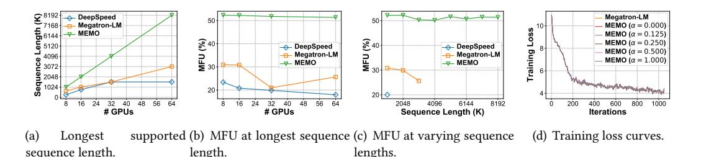

# 5 Experiments

In this section, we conduct experiments across various model sizes and input sequence lengths to show that Memo achieves superior efficiency in long context training of LLMs.

53:18 Pinxue Zhao et al.

## 5.1 Setup

Hardware: Our experiments are conducted on an A800 GPU cluster, with each node equipped with 8 NVIDIA A800 GPUs (80GB). The GPUs within each node are interconnected via NVLinks (400GB/s), while the nodes are interconnected through Infiniband (200GB/s). Each node has 2TB CPU memory, and the GPU-CPU communication bandwidth is 32GB/s.

Baselines: We select two widely-used LLM training frameworks as baselines. The first is Megatron-LM (commit id: ccfeda47cb) [\[77\]](#page-26-6) in conjunction with TransformerEngine (v1.3) [\[56\]](#page-25-7). Megatron-LM, maintained by NVIDIA, is renowned for its comprehensive support of hybrid parallelisms, including DP, TP, PP, SP, and CP. The other baseline is Megatron-Deepspeed (commit id 7eb36a11b3) paired with DeepSpeed (v0.14.3) [\[69\]](#page-26-7), which is recognized for ZeRO optimizers and DeepSpeed-Ulysses [\[28\]](#page-24-3), a novel parallel training strategy designed for long context LLM training. For all baselines, we employ FlashAttention [\[11,](#page-23-10) [12\]](#page-23-11) and mixed-precision training [\[31,](#page-24-15) [49\]](#page-25-13), which are commonly used in LLM training.

Metrics: We use three important evaluation metrics to measure the training efficiency: Model FLOPs Utilization (MFU), Tokens per GPU per Second (TGS), and wall-clock time. MFU is defined as the ratio of model FLOPs per second to the theoretical peak FLOPs per second of the GPU (e.g. 312 TFLOPS for NVIDIA A800 GPUs) [\[35\]](#page-24-8). Based on FlashAttention [\[11,](#page-23-10) [12\]](#page-23-11) and considering the causal mask, the exact formula for calculating model FLOPS per sample is:

$$6 \cdot s \cdot P + 6 \cdot n \cdot h \cdot s^2.$$

MFU is a standard metric that measures the training efficiency of how model FLOPs utilize computational resources. On the other hand, TGS directly measures training throughput, and wall-clock time reflects the latency of training each batch, providing a clear view of how quickly a model can be trained using a given amount of training samples. All metrics are crucial for LLM researchers and engineers, enabling comparisons among various training strategies (including distributed parallelisms and activation recomputation).

Workloads: Our experiments cover a wide range of workloads to examine the strength of Memo. In particular, we consider training the 7B, 13B, 30B and 65B GPT models on 8, 16, 32, and 64 GPUs, respectively, with various sequence lengths ranging from 4K to 1408K. The detailed model configurations are shown in Table [2.](#page-16-1)

#### 5.2 End-to-end Evaluation

We compare the end-to-end training efficiency of Memo and two baselines. Table [3](#page-18-0) shows the MFU, TGS, and wall-clock time of DeepSpeed-Ulysses, Megatron-LM and Memo under different training workloads. During evaluation, we manually adjust the distributed parallelism strategies for each system and each workload to achieve optimal training performance for fair comparisons.

Overall, Memo is capable of training longer sequences than the competitors. Across the training of 7B, 13B, 30B, and 65B models on 8, 16, 32, and 64 GPUs, DeepSpeed-Ulysses supports sequence lengths of 256K, 256K, 128K, and 1280K, while Megatron-LM supports sequence lengths of 640K, 640K, 384K, 512K. In comparison, Memo achieves superior performance in all scenarios, enabling training sequence lengths of 1024K, 1408K, 1280K, and 1408K. Megatron-LM only supports up to 640K sequence length, even if we have leveraged a high model parallel degree and enabled the memory reduction techniques. This is unsurprising since it overlooks the memory fragmentation issue, leading to OOM for large sequence lengths. DeepSpeed, thanks to its support of DeepSpeed-Ulysses sequence parallel and ZeRO-3 optimizer, is capable of training 1280K sequence length when training the 65B model on 64 GPUs. When training smaller models, DeepSpeed supports only very small sequence lengths. This is because it can only utilize a small SP degree of 8, which either aligns to the number of GPUs or is dividable by the number of attention heads (40 and 56).

Table 3. MFU (Model FLOPS Utilization), TGS (Tokens per GPU per Second), and wall-clock time of different methods on different numbers of GPUs, model sizes, and sequence lengths. "DS" stands for "DeepSpeed", and "Mega" stands for "Megatron-LM".  $\nearrow_{oom}$  stands for Out Of Memory error when the system runs out of GPU memory, and  $\nearrow_{oohm}$  stands for Out Of Host Memory error, which means the CPU memory is depleted. "h", "m" and "s" represent hour, minute and second respectively.

| C      | 7B G                    | PT on 8 G        | PUs              | 13B G                   | PT on 16                     | GPUs    | 30B G            | PT on 32                | GPUs                          | 65B GPT on 6     |                              | 4 GPUs |  |
|--------|-------------------------|------------------|------------------|-------------------------|------------------------------|---------|------------------|-------------------------|-------------------------------|------------------|------------------------------|--------|--|
| SeqLen | DS                      | Mega             | Мемо             | DS                      | Mega                         | Мемо    | DS               | Mega                    | Мемо                          | DS               | Mega                         | Мемо   |  |
|        | 44.71%                  | 49.45%           | 49.45%           | 44.08%                  | 46.17%                       | 46.17%  | 43.70%           | 50.67%                  | 50.67%                        | 43.89%           | 53.61%                       | 53.61% |  |
| 4K     | 3235.64                 | 3578.86          | 3578.86          | 1675.53                 | 1755.23                      | 1755.23 | 724.44           | 840.14                  | 840.14                        | 337.95           | 412.90                       | 412.90 |  |
|        | 2.53s                   | 2.29s            | 2.29s            | 2.44s                   | 2.33s                        | 2.33s   | 2.83s            | 2.44s                   | 2.44s                         | 3.03s            | 2.48s                        | 2.48s  |  |
|        | 46.28%                  | 51.57%           | 51.57%           | 38.90%                  | 50.91%                       | 50.91%  | 38.78%           | 49.27%                  | 49.27%                        | 43.34%           | 53.27%                       | 53.27% |  |
| 8K     | 3116.25                 | 3472.95          | 3472.95          | 1393.24                 | 1823.52                      | 1823.52 | 615.22           | 781.68                  | 781.68                        | 321.00           | 394.61                       | 394.61 |  |
|        | 5.26s                   | 4.72s            | 4.72s            | 5.88s                   | 4.50s                        | 4.50s   | 6.66s            | 5.24s                   | 5.24s                         | 6.38s            | 5.19s                        | 5.19s  |  |
|        | 36.41%                  | 51.29%           | 51.29%           | 36.95%                  | 51.52%                       | 51.52%  | 34.54%           | 49.84%                  | 49.84%                        | 40.98%           | 51.10%                       | 51.10% |  |
| 16K    | 2152.65                 | 3032.14          | 3032.14          | 1186.24                 | 1654.11                      | 1654.11 | 504.64           | 728.22                  | 728.22                        | 282.05           | 351.58                       | 351.58 |  |
|        | 15.2s                   | 10.8s            | 10.8s            | 13.8s                   | 9.91s                        | 9.91s   | 16.2s            | 11.2s                   | 11.2s                         | 14.5s            | 11.6s                        | 11.6s  |  |
|        | 35.91%                  | 52.75%           | 52.75%           | 34.51%                  | 49.79%                       | 49.79%  | 35.19%           | 48.06%                  | 48.06%                        | 35.73%           | 34.00%                       | 44.79% |  |
| 32K    | 1706.13                 | 2506.39          | 2506.39          | 917.96                  | 1324.27                      | 1324.27 | 443.77           | 606.16                  | 606.16                        | 215.32           | 204.83                       | 269.84 |  |
|        | 38.4s                   | 26.1s            | 26.1s            | 35.7s                   | 24.7s                        | 24.7s   | 36.9s            | 27.0s                   | 27.0s                         | 38.0s            | 39.9s                        | 30.4s  |  |
|        | 27.95%                  | 41.55%           | 52.34%           | 27.97%                  | 38.51%                       | 52.65%  | 29.93%           | 35.76%                  | 52.12%                        | 31.05%           | 22.79%                       | 47.80% |  |
| 64K    | 935.76                  | 1417.74          | 1786.22          | 553.85                  | 762.46                       | 1042.50 | 296.41           | 354.20                  | 516.16                        | 149.80           | 109.94                       | 230.62 |  |
|        | 2m17s                   | 1m33s            | 1m13s            | 1m58s                   | 1m26s                        | 1m3s    | 1m51s            | 1m33s                   | 1m3s                          | 1m49s            | 2m19s                        | 1m11s  |  |
|        | 25.46%                  | 24.13%           | 50.96%           | 25.45%                  | 23.02%                       | 50.93%  | 25.54%           | 14.70%                  | 49.66%                        | 26.13%           | 15.10%                       | 48.61% |  |
| 128K   | 555.51                  | 526.62           | 1111.99          | 333.51                  | 301.67                       | 667.41  | 176.92           | 101.85                  | 344.09                        | 90.15            | 52.10                        | 167.69 |  |
|        | 7m52s                   | 8m18s            | 3m56s            | 6m33s                   | 7m15s                        | 3m16s   | 6m10s            | 10m43s                  | 3m10s                         | 6m4s             | 10m30s                       | 3m15s  |  |
|        | 23.38%                  | 29.07%           | 53.62%           | 21.98%                  | 25.30%                       | 51.22%  | Xoom             | 17.15%                  | 50.00%                        | 22.07%           | 9.57%                        | 49.87% |  |
| 256K   | 296.48                  | 368.65           | 679.92           | 171.82                  | 197.78                       | 400.39  | Xoom             | 72.24                   | 216.41                        | 48.51            | 21.03                        | 109.58 |  |
|        | 29m28s                  | 23m42s           | 12m51s           | 25m26s                  | 22m5s                        | 10m55s  | $X_{oom}$        | 29m30s                  | 10m6s                         | 22m31s           | 51m56s                       | 9m58s  |  |
|        | X oom        | 27.98%           | 53.04%           | X oom        | 22.88%                       | 51.91%  | Xoom             | 23.32%                  | 50.69%                        | 20.40%           | 12.07%                       | 48.85% |  |
| 384K   | X oom        | 250.07           | 474.02           | X oom        | 127.40                       | 289.11  | Xoom             | 73.37                   | 159.52                        | 32.89            | 19.46                        | 78.76  |  |
| J04K   | Xoom                    | 52m25s           | 27m39s           | Xoom                    | 51m26s                       | 22m40s  | Xoom             | 44m39s                  | 20m32s                        | 49m49s           | 1h24m                        | 20m48s |  |
|        | X                       |                  |                  | X                       |                              |         | X                |                         |                               |                  |                              |        |  |
|        | X oom        | 34.43%           | 51.84%           | X oom        | 29.10%                       | 52.40%  | Xoom             | Xoom                    | 51.06%                        | 19.83%           | 5.32%                        | 49.71% |  |
| 512K   | X oom        | 237.56           | 357.70           | X oom        | 125.86                       | 226.65  | X oom | Xoom                    | 126.23                        | 25.24            | 6.77                         | 63.29  |  |
|        | X oom        | 1h14m            | 48m51s           | X oom        | 1h10m                        | 38m33s  | Xoom             | Xoom                    | 34m37s                        | 1h27m            | 5h23m                        | 34m31s |  |
|        | X oom        | 30.90%           | 52.59%           | X oom        | 19.41%                       | 52.13%  | Xoom             | X oom        | 51.72%                        | 19.06%           | <b>X</b> oom                 | 50.05% |  |
| 640K   | $rac{1}{2}$             | 173.63           | 295.51           | $\rightharpoonup_{oom}$ | 83.94                        | 184.33  | $\nearrow_{oom}$ | $rac{1}{2}$ oom         | 105.28                        | 20.04            | $\nearrow_{oom}$             | 52.65  |  |
|        | $\rightharpoonup_{oom}$ | 2h6m             | 1h14m            | X oom        | 2h10s                        | 59m15s  | $\lambda_{oom}$  | $\rightharpoonup_{oom}$ | 51m52s                        | 2h16m            | $rac{1}{2}$ oom              | 51m52s |  |
|        | Xoom                    | X oom | 51.89%           | X oom        | X oom             | 51.71%  | X oom | Xoom                    | 51.18%                        | 19.53%           | $\lambda_{oom}$              | 51.16% |  |
| 768K   | Xoom                    | $X_{oom}$        | 245.76           | Xoom                    | Xoom                         | 154.63  | Xoom             | $\boldsymbol{X}_{oom}$  | 88.55                         | 17.50            | Xoom                         | 45.84  |  |
| , 0010 | Xoom                    | ×oom             | 1h47m            | Xoom                    | Xoom                         | 1h25m   | Xoom             | Xoom                    | 1h14m                         | 3h7m             | Xoom                         | 1h11m  |  |
|        | X oom        | X oom | 52.71%           | Xoom                    | X oom             | 51.76%  | X oom | X oom        | 51.50%                        | 19.12%           | X oom             | 51.05% |  |
| 00/17  | Xoom                    | X                |                  | X oom        | $\boldsymbol{X}_{oom}^{oom}$ |         | Xoom             | X                       | 77.48                         |                  | Xoom                         |        |  |
| 896K   | X                       | X oom | 251.98           | X oom                   | X oom                        | 134.08  | X                | X oom                   |                               | 14.93            | X                            | 39.85  |  |
|        | Xoom                    | Xoom             | 2h22m            | X oom        | X oom             | 1h54m   | Xoom             | Xoom                    | 1h39m                         | 4h16m            | Xoom                         | 1h36m  |  |
|        | X oom        | X oom | 52.30%           | Xoom                    | X oom             | 52.06%  | Xoom             | X oom        | 51.24%                        | 19.00%           | X oom             | 51.27% |  |
| 1024K  | $\wedge_{oom}$          | $rac{1}{2}$ oom  | 188.73           | Xoom                    | $\wedge_{oom}$               | 118.96  | Xoom             | $rac{1}{2}$ oom         | 68.20                         | 13.14            | $rac{1}{2}$                  | 35.45  |  |
|        | X oom        | $rac{1}{2}$      | 3h5m             | $\lambda_{oom}$         | $rac{1}{2}$                  | 2h27m   | $\lambda_{oom}$  | $\rightharpoonup_{oom}$ | 2h8m                          | 5h33m            | $rac{1}{2}$ oom              | 2h3m   |  |
|        | $\lambda_{oom}$         | X oom | X oom | X oom        | $\lambda_{oom}$              | 51.74%  | $X_{oom}$        | $\boldsymbol{X}_{oom}$  | 51.73%                        | 19.11%           | X                            | 51.20% |  |
| 1152K  | X oom        | Xoom             | X oom | Xoom                    | X oom             | 105.74  | X oom | X oom        | 61.72                         | 11.86            | X oom             | 31.77  |  |
| 110210 | Xoom                    | Xoom             | Xoom             | Xoom                    | X oom             | 3h6m    | Xoom             | Xoom                    | 2h39m                         | 6h43m            | Xoom                         | 2h35m  |  |
|        | <b>X</b> oom            | X oom | X                | X oom        | X oom             | 51.78%  | X oom | X oom        | 51.59%                        | 18.90%           | X oom             | 51.42% |  |
| 1280K  | $\boldsymbol{X}_{oom}$  | X                | X oom | X                       | X                            |         | X                | X                       |                               |                  | X                            |        |  |
|        | <b>Y</b> oom            | X oom | X oom | X oom        | X oom                        | 95.72   | X oom | X oom                   | 55.79                         | 10.64            | X oom                        | 28.94  |  |
|        | X oom        | X oom | X oom | X oom        | X oom             | 3h48m   | Xoom             | X oom        | 3h16m                         | 8h33m            | Xoom                         | 3h9m   |  |
|        | Xoom                    | X oom | X oom | Xoom                    | X oom             | 52.10%  | Xoom             | X oom        | Xoohm                         | X oom | $\lambda_{oom}$              | 51.45% |  |
| 1408K  | $\boldsymbol{X}_{oom}$  | $\lambda_{oom}$  | $\lambda_{oom}$  | $\mathcal{X}_{oom}$     | $\boldsymbol{X}_{oom}$       | 87.93   | $\lambda_{oom}$  | $\nearrow_{oom}$        | $\boldsymbol{\lambda}_{oohm}$ | $\nearrow_{oom}$ | $\boldsymbol{\lambda}_{oom}$ | 26.50  |  |
|        | $X_{oom}$               | $X_{oom}$        | $X_{oom}$        | $X_{oom}$               | X oom             | 4h33m   | Xoom             | $\boldsymbol{X}_{oom}$  | $X_{oohm}$                    | X oom | Xoom                         | 3h47m  |  |

In contrast, by token-wise recomputation/swapping and memory planning, Мемо is able to train sequences over 1 million tokens in all scenarios.

53:20 Pinxue Zhao et al.

Table 4. MFU of different methods for ablation studies. The experiments are conducted by training the 7B model on 8 GPUs.

| Method                                                                      | 64K              | 128K             | 256K             | Sequence Length 384K | 512K            | 640K            | 768K            | 896K            |
|-----------------------------------------------------------------------------|------------------|------------------|------------------|-------------------------|-----------------|-----------------|-----------------|-----------------|
| Full Recomputation                                                          | 41.19%           | 23.00%           | 29.07%           | 25.67%                  | %𝑜𝑜𝑚            | %𝑜𝑜𝑚            | %𝑜𝑜𝑚            | %𝑜𝑜𝑚            |
| Full Recomputation + Memory Plan                                            | 42.91%           | 43.17%           | 42.05%           | 42.49%                  | 41.90%          | 42.15%          | %𝑜𝑜𝑚            | %𝑜𝑜𝑚            |
| Full Swapping + Memory Plan Memo (Fine-grained Management + Memory Plan) | 37.40% 47.99% | 46.33% 50.96% | 53.62% 53.62% | %𝑜𝑜ℎ𝑚 53.04%         | %𝑜𝑜ℎ𝑚 51.84% | %𝑜𝑜ℎ𝑚 52.59% | %𝑜𝑜ℎ𝑚 51.89% | %𝑜𝑜ℎ𝑚 52.71% |

Table 5. Impact of offloading fraction on training efficiency.

| Sequence Length |        |        |        |        | Value of 𝛼 |        |        |        |        |
|-----------------|--------|--------|--------|--------|------------|--------|--------|--------|--------|
|                 | 0.000  | 0.125  | 0.250  | 0.375  | 0.500      | 0.625  | 0.750  | 0.875  | 1.000  |
| 192K            | 51.04% | 51.86% | 52.14% | 52.30% | 52.72%     | 52.78% | 53.11% | 51.74% | 49.69% |
| 256K            | 52.03% | 52.05% | 52.19% | 52.45% | 52.70%     | 52.96% | 53.21% | 53.29% | 53.62% |
| 320K            | 52.15% | 52.36% | 52.52% | 52.66% | 52.92%     | 53.10% | 53.35% | %𝑜𝑜ℎ𝑚  | %𝑜𝑜ℎ𝑚  |
| 384K            | 52.09% | 52.31% | 52.45% | 52.58% | 53.04%     | %𝑜𝑜ℎ𝑚  | %𝑜𝑜ℎ𝑚  | %𝑜𝑜ℎ𝑚  | %𝑜𝑜ℎ𝑚  |

When training with relatively short sequences ranging from 4K to 32K, there's little memory pressure. In such cases, activation recomputation is often unnecessary, and different methods may use the same parallelism strategies. Consequently, Memo falls back to Megatron-LM, resulting in the same performance. Nevertheless, Memo significantly outperforms the baselines when the sequence length reaches 64K or even higher.

Furthermore, when comparing Memo to the baselines with aligned sequence lengths, Memo achieves superior MFU, TGS, and wall-clock time. Across all experimented workloads, Memo achieves an average MFU of 51.04%. In contrast, Megatron-LM and DeepSpeed only achieve an average MFU of 35.01% and 30.74%, respectively. On average, Memo achieves 1.97× and 1.80× MFU compared to Megatron-LM and DeepSpeed, respectively.

The deficiencies of baselines are not surprising — due to the unsatisfactory memory management, they are forced to utilize less-efficient configurations of parallelism strategies and rematerialization options.[6](#page-19-0) Firstly, the baselines need to employ a high model parallelism degree (i.e. large TP degree and/or large SP degree) to avoid OOM error. For instance, when training the 65B model with 256K sequence length, Megatron-LM has to use a TP degree of 16, while Memo can support a TP degree of 8. Given the much lower inter-node bandwidth compared to intra-node, the TP communication cost of Memo is 63% lower than that of Megatron-LM (44.3 v.s. 120.4 seconds). Secondly, the baselines require full activation recomputation to avoid the OOM error, leading to over 20% redundant GPU calculation. In contrast, Memo integrates fine-grained recomputation and swapping, incurring smaller overhead. Last but not least, the lack of memory planning often triggers memory reorganization during training, which blocks GPU computation and significantly hampers training efficiency. When training the 7B model on 8 GPUs using Megatron-LM, the memory reorganization operation is triggered 6 times and 16 times per iteration for sequence lengths of 128K and 256K, respectively. A detailed ablation study is presented in Section [5.3.](#page-20-0)

As a result, Memo consistently achieves an MFU of approximately 50% across all model sizes and sequence lengths, enabling more efficient training of significantly long sequences compared to the baselines.

6We have provided the detailed configurations in our supplementary materials.

#### 5.3 Ablation Studies

Next, we assess the effectiveness of the proposed techniques in Memo. All experiments in ablation studies are conducted by training the 7B model on 8 GPUs, keeping the parallelism configuration fixed at a TP degree of 4 and a CP degree of 2.

5.3.1 **Effectiveness of Memory Planning**. To evaluate the effectiveness of memory planning, we evaluate two variants of Memo with full recomputation, both with and without memory planning. As shown in the first two rows of Table 4, without memory planning, the longest sequence supported is only 384K, achieving an MFU of 25.67%. After applying memory planning, the longest supported sequence length increases to 640K, with an MFU of 42.15%. The results are reasonable since full recomputation without memory planning has severe memory fragmentation, resulting in OOM errors in large sequence length scenarios.

Additionally, the frequent GPU memory reorganization process further impairs training efficiency. By employing memory planning, the fragmentation issue can be eliminated, providing more memory for longer context training. Getting rid of GPU memory reorganization, memory planning brings an average of 1.51× MFU when facing the same context length.

5.3.2 Effectiveness of Token-wise Recomputation. For token-wise recomputation and swapping, we compare Memo and its variants, one with full recomputation and another with full swapping. The results are shown in the last three rows of Table 4. When training with appropriate sequence length, which is 256k in this scenario, the computation time of one transformer layer can fully overlap with the offloading time of a layer's activations. Therefore, full swapping with memory planning can achieve an MFU of 53.62% under 256K sequence length, far exceeding the 42.05% achieved by full recomputation with memory planning. However, for short sequence lengths, such as 64K, the offloading time of one layer's activations blocks the GPU computation, resulting in a lower MFU than full recomputation. Full swapping presents another challenge as the sequence length grows longer: the host memory is rapidly depleted by offloaded activations, leading to OOHM errors. Full recomputation, which does not offload the input tensor of each layer, also encounters OOM errors at a sequence length of 768K.

By employing token-wise recomputation together with swapping, Memo consistently improves training efficiency for both short and long context lengths. For short sequence lengths like 64K, our tensor-level design only offloads the input tensor of the transformer layer and the FlashAttention output tensor to CPU memory, enabling efficient overlap of GPU computation and data transmission. For long context lengths, our rounding-buffer token-level management successfully avoids depleting the CPU memory, and incurs only minimal recomputation overhead. Among all the methods, Memo supports the longest sequence length. Considering MFU, Memo achieves an average of 1.22× MFU compared to full recomputation with memory planning, and an average of 1.13× MFU compared to full offloading with memory planning.

5.3.3 **Effect of the Offloading Fraction**  $\alpha$ . To investigate the impact of the offloading fraction  $\alpha$  on training efficiency, we train a 7B model on 8 GPUs, with TP= 4, CP= 2 and varying  $\alpha$  values. The results are presented in Table 5. For a sequence length of 192K, the MFU initially increases with  $\alpha$ , peaking at 53.11% when  $\alpha$  = 0.75, and then declines. This trend occurs because, for  $\alpha$  < 0.75, a higher  $\alpha$  reduces recomputation overhead by increasing the proportion of skeletal activations that are swapped. Beyond this point, however, further increases in  $\alpha$  lead to swapping overhead that exceeds the computation time of an individual transformer layer, stalling GPU computations until the swapping concludes and thus reducing the MFU. At a sequence length of 256K, the computation time of a single transformer layer, due to the quadratic complexity of self-attention, surpasses the offloading time for all skeletal activations in this layer. Consequently, training efficiency

53:22 Pinxue Zhao et al.

> **[图片提取文字 (无描述)]:**
> Megatron-LM DeepSpeed Megatron-LM **MEMO** ( $\alpha = 0.000$ ) th 6144 - MEMO **MEMO** ( $\alpha = 0.125$ ) €40 £ 40 **MEMO** ( $\alpha = 0.250$ ) → DeepSpeed - DeepSpeed Training **MEMO** ( $\alpha = 0.500$ ) - Megatron-LM - Megatron-LM 4096 MF30 **MEMO** ( $\alpha = 1.000$ ) ¥ 30∙ - MEMO ▼ MEMO 2 3072 2048 1024 20 2010 40 2048 4096 6144 8192 200 # GPUs # GPUs Sequence Length (K) **Iterations** supported (b) MFU at longest sequence (c) MFU at varying sequence (d) Training loss curves. Longest (a) sequence length. length. lengths.

Fig. 11. (a), (b): The longest supported sequence length and corresponding MFU of DeepSpeed, Megatron-LM and Memo when training the 7B model on various numbers of GPUs. (c): The MFU when training the 7B model on 64 GPUs with sequence length varying from 1024K to 8192K. (d): Training loss curves of Megatron-LM

consistently improves as  $\alpha$  increases. For longer sequences such as 320K and 384K, offloading all skeletal activations becomes unviable due to CPU memory constraints. Considering the constraints, Memo can effectively identify the optimal  $\alpha$  to minimize recomputation overhead.

## 5.4 Scalability

and Memo with different  $\alpha$ .

To show the scalability of Memo, we train the 7B model on 8, 16, 32, and 64 GPUs respectively, and report the maximum supported sequence length. As shown in Figure 11(a), when the number of GPUs increases, the maximum sequence length supported by Memo increases linearly. When training on 8, 16, 32, and 64 GPUs, Memo is capable of training 1, 2, 4, 8 million sequence lengths, respectively, which demonstrates ideal scalability. Memo also consistently maintains an MFU of over 50% across different numbers of GPUs, as shown in Figure 11(b).

For DeepSpeed, as the number of GPUs increases, it can enlarge the SP degree, leading to longer supported sequence length. Note that since the 7B model has 32 attention heads, the maximum SP degree is 32. As a result, DeepSpeed achieves the same maximum sequence length of 1536K for both 32 and 64 GPUs. Megatron-LM supports context parallelism, which has better scalability. When the number of GPUs increases, the longest sequence length it can handle grows sublinearly. Compared to the baselines, Memo introduces fine-grained activation memory management, achieving not only ideal scalability but also better efficiency.

We also evaluate the MFU of the three systems when training the 7B model on 64 GPUs with sequence lengths varing from 1024K to 8192K. In Figure 11(c), as sequence length increases, the MFU of Memo maintains above 50%, surpassing the baselines.

#### 5.5 Convergence of Memo

To confirm the correctness of our system implementation, we conduct a convergence experiment. We train a 7B model with 128K sequence length on 8 GPUs and compare the convergence of Memo and Megatron-LM for 1000 iterations. For both systems, we fix the parallelism strategy to TP= 4 and CP= 2. For Memo, we enumerate the value of  $\alpha$  in {0,0.125,0.25,0.5,1}. As shown in Figure 11(d), the loss curves of Memo with different  $\alpha$  values all align with Megatron-LM, confirming the correctness of Memo.

#### 6 Related Work

**Data management and machine learning:** Recently, the intersection of data management and machine learning has gained popularity, with numerous studies emerging from the data

management community [\[19,](#page-23-19) [27,](#page-24-16) [33,](#page-24-17) [36,](#page-24-18) [39,](#page-24-19) [44](#page-25-14)[–47,](#page-25-15) [50–](#page-25-16)[52,](#page-25-17) [57,](#page-25-18) [75,](#page-26-16) [82,](#page-26-17) [83,](#page-26-18) [86,](#page-27-10) [88,](#page-27-11) [89,](#page-27-12) [93,](#page-27-13) [95,](#page-27-14) [97,](#page-27-15) [99,](#page-27-16) [100,](#page-27-17) [102\]](#page-27-18). Some works focus on optimizing I/O data management to accelerate data pre-processing pipelines [\[27,](#page-24-16) [50,](#page-25-16) [51,](#page-25-19) [82\]](#page-26-17). Another work proposes to use a fine-grained automatic parallelism strategy to speed up model training [\[46\]](#page-25-20). Memo also employs data management techniques and methodologies to enhance the efficiency of machine learning tasks, specifically addressing the challenges associated with long-sequence LLM training.

Parallelism strategies for long context training: To tackle the challenge of long context training, DeepSpeed-Ulysses [\[28\]](#page-24-3) employs an novel AllToAll communication to facilitate the partition of input sequence among GPUs, achieving lower communication overhead compared with Megatron-LM sequence parallelism [\[35\]](#page-24-8). LightSeq [\[37\]](#page-24-9), Ring Attention [\[42\]](#page-24-10), and Megatron-LM context parallelism [\[55\]](#page-25-8) propose to split the sequence within self-attention computation, achieving better scalability. Recent efforts in the realm of sequence and context parallelisms [\[7,](#page-23-6) [17,](#page-23-7) [20\]](#page-23-20) aim to integrate multiple strategies and enhance existing distributed settings. It is worth noting that the fine-grained memory management of Memo is orthogonal to these distributed parallelism strategies.

Activation recomputation and swapping: Capuchin [\[63\]](#page-25-21) proposes to combine recomputation and swapping to reduce memory footprint during training. The swapping decision is made by considering the tensor access pattern. In addition to tensor recomputation, MegTaichi [\[25\]](#page-24-20) also proposes to co-optimize the tensor partition. Coop [\[96\]](#page-27-19) notices that naive tensor recomputation leads to severe memory fragmentation, and proposes heuristics to reduce memory fragmentation during tensor recomputation. While these works offer solutions for common deep learning models, they do not take advantage of the specific characteristics of LLM training to achieve full overlapping and fragmentation minimization.

Memory planning for deep learning models: The memory allocation problem in deep learning models can be regarded as a DSA problem and solved by MIP [\[76\]](#page-26-15). OLLA [\[78\]](#page-26-19) proposes to optimize the lifetime and memory location of tensors during the training process by solving a joint ILP problem, reducing the peak memory during training. However, it does not exploit the repetitive substructure in LLMs and relies on heuristics to simplify the integer programming problem.

