# **MEMO: Fine-grained Tensor Management For Ultra-long Context LLM Training**

HAILIN ZHANG\*, Peking University, China FANGCHENG FU\*, Peking University, China XIAONAN NIE\*, Peking University, China QIBIN LIU, Tencent Inc., China FANG YANG, Tencent Inc., China YUANBO PENG, Tencent Inc., China DIAN JIAO, Tencent Inc., China SHUAIPENG LI, Tencent Inc., China JINBAO XUE, Tencent Inc., China YANGYU TAO, Tencent Inc., China BIN CUI\*, Peking University, China

PINXUE ZHAO\*, Peking University, China

Nowadays, Large Language Models (LLMs) have been trained using extended context lengths to foster more creative applications. However, long context training poses great challenges considering the constraint of GPU memory. It not only leads to substantial activation memory consumption during training, but also incurs considerable memory fragmentation. To facilitate long context training, existing frameworks have adopted strategies such as recomputation and various forms of parallelisms. Nevertheless, these techniques rely on redundant computation or extensive communication, resulting in low Model FLOPS Utilization (MFU). In this paper, we propose Memo, a novel LLM training framework designed for fine-grained activation memory management. Given the quadratic scaling of computation and linear scaling of memory with sequence lengths when using FlashAttention, we offload memory-consuming activations to CPU memory after each layer's forward pass and fetch them during the backward pass. To maximize the swapping of activations without hindering computation, and to avoid exhausting limited CPU memory, we implement a token-wise activation recomputation and swapping mechanism. Furthermore, we tackle the memory fragmentation issue by employing a bi-level Mixed Integer Programming (MIP) approach, optimizing memory reuse across transformer layers. Empirical results demonstrate that Memo achieves an average of 1.97× and 1.80× MFU compared to Megatron-LM and DeepSpeed, respectively. This improvement is attributed to Memo's ability to

\*Pinxue Zhao, Hailin Zhang, Fangcheng Fu, Xiaonen Nie and Bin Cui are with the School of Computer Science & Key Lab of High Confidence Software Technologies (MOE), Peking University. Bin Cui is also with the Institute of Computational Social Science, Peking University (Qingdao).

Authors' Contact Information: Pinxue Zhao, Peking University, China, pinxue.zhao@pku.edu.cn; Hailin Zhang, Peking University, China, z.hl@pku.edu.cn; Fangcheng Fu, Peking University, China, ccchengff@pku.edu.cn; Xiaonan Nie, Peking University, China, xiaonan.nie@pku.edu.cn; Qibin Liu, Tencent Inc., China, brendenliu@tencent.com; Fang Yang, Tencent Inc., China, youngfyang@tencent.com; Yuanbo Peng, Tencent Inc., China, yuanbopeng@tencent.com; Dian Jiao, Tencent Inc., China, focusjiao@tencent.com; Shuaipeng Li, Tencent Inc., China, shuaipengli@tencent.com; Jinbao Xue, Tencent Inc., China, jinbaoxue@tencent.com; Yangyu Tao, Tencent Inc., China, brucetao@tencent.com; Bin Cui, Peking University, China, bin.cui@pku.edu.cn.

Permission to make digital or hard copies of all or part of this work for personal or classroom use is granted without fee provided that copies are not made or distributed for profit or commercial advantage and that copies bear this notice and the full citation on the first page. Copyrights for components of this work owned by others than the author(s) must be honored. Abstracting with credit is permitted. To copy otherwise, or republish, to post on servers or to redistribute to lists, requires prior specific permission and/or a fee. Request permissions from permissions@acm.org.

© 2025 Copyright held by the owner/author(s). Publication rights licensed to ACM.

ACM 2836-6573/2025/2-ART53

https://doi.org/10.1145/3709703

53:2 Pinxue Zhao et al.

minimize memory fragmentation, reduce recomputation and intensive communication, and circumvent the delays associated with the memory reorganization process due to fragmentation. By leveraging fine-grained activation memory management, Memo facilitates efficient training of 7B LLM with 1 million sequence length on just 8 A800 GPUs, achieving an MFU of 52.30%.

## CCS Concepts: • Computing methodologies → Distributed computing methodologies.

Additional Key Words and Phrases: Large Language Model, Long Context Training, Tensor Management, Data Rematerialization

#### ACM Reference Format:

Pinxue Zhao, Hailin Zhang, Fangcheng Fu, Xiaonan Nie, Qibin Liu, Fang Yang, Yuanbo Peng, Dian Jiao, Shuaipeng Li, Jinbao Xue, Yangyu Tao, and Bin Cui. 2025. Memo: Fine-grained Tensor Management For Ultra-long Context LLM Training. Proc. ACM Manag. Data 3, 1 (SIGMOD), Article 53 (February 2025), [28](#page-27-0) pages. <https://doi.org/10.1145/3709703>

#### 1 Introduction

Since the advent of ChatGPT [\[58\]](#page-25-0), Large Language Models (LLMs) have demonstrated remarkable proficiency in comprehending and generating natural language texts. Besides revolutionizing the field of language processing, which encompasses translation [\[103\]](#page-27-1), coding [\[23,](#page-24-0) [72,](#page-26-0) [94\]](#page-27-2), etc., transformer-based LLMs have also found applications in multi-modal scenarios, such as image processing [\[15,](#page-23-0) [61\]](#page-25-1), video stream analysis [\[73\]](#page-26-1), and AI for science [\[2,](#page-23-1) [5\]](#page-23-2). To accommodate novel applications that require lengthy contexts [\[98\]](#page-27-3), LLMs have developed to support long context input, from 2K-4K [\[79,](#page-26-2) [81\]](#page-26-3) to 32K [\[29,](#page-24-1) [80\]](#page-26-4), 128K [\[18,](#page-23-3) [58\]](#page-25-0), or even millions of tokens [\[1,](#page-23-4) [9,](#page-23-5) [41\]](#page-24-2). Considering the extrapolation problem [\[43,](#page-25-2) [66\]](#page-26-5), which refers to the decline in LLM performance when input sequences exceed the training length, it is necessary to conduct long context training [\[7,](#page-23-6) [17,](#page-23-7) [28\]](#page-24-3) or fine-tuning [\[14,](#page-23-8) [62\]](#page-25-3) to facilitate long sequence inference. Beyond natural language processing, increasing the context length is also essential across diverse domains, including video processing [\[101\]](#page-27-4), protein properties prediction [\[6\]](#page-23-9), weather forecasting [\[54\]](#page-25-4), and health care [\[40\]](#page-24-4).

Maximizing system performance with limited memory is a common and significant challenge in the data management community. Within this context, training LLMs with long sequence lengths poses difficulties due to restricted GPU memory. During training, a large amount of activations[1](#page-1-0) must be stored for gradient computation during the backward pass, resulting in substantial memory consumption. Typically, it is well known that the self-attention module in the transformer architecture has a quadratic computation and memory complexity w.r.t. the sequence length. FlashAttention [\[11,](#page-23-10) [12\]](#page-23-11), now a standard technique for attention computation in LLM training, accelerates computation and shrinks the memory complexity to be linear w.r.t. the sequence length by scheduling memory I/O and recomputing necessary components during the backward pass. Except for attention, the remaining activation memory also scales linearly with the sequence length, which can become quite large in long context scenarios. For instance, training a GPT model with 7B parameters on a sequence length of 1 million can lead to an activation memory of 4096GB, far exceeding the memory capacity of commonly used accelerators (e.g. 80GB for an NVIDIA H100/A100 GPU).

Moreover, dynamic memory allocators inherently face the issue of memory fragmentation due to frequent allocation and deallocation, which complicates efficient data management. Besides storing the skeletal activations for the backward pass, there are also tremendous transient activations that are temporarily generated during computation (we will formally categorize the two kinds of activations

1 In neural network training, the outputs of operators are referred to as activations. Some of these, termed "skeletal activations" in this work, must be stored for gradient computation during the backward pass, while others are termed "transient activations". More details are provided in Section [3.](#page-8-0)

> **[图片提取文字 (无描述)]:**
> Peak B 80 Peak A **GPU Memory (GB)** Reserved: 73.5GB Allocated: 65.7GB New request: 4.0GB Reserved: 76.5GB Allocated: 68.2GB New request: 4.0GB Allocated Reserved 500 1000 1500 2000 Trace Step
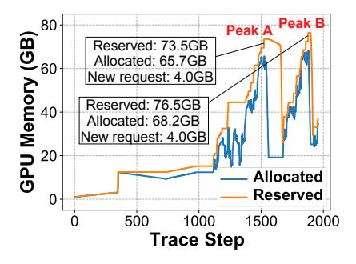

> **[图片提取文字 (无描述)]:**
> **FlashAttention** 0.6 Layer Forward **Full Offload 6** 0.4 Time ( 128K 192K 320K 64K 256K Sequence Length
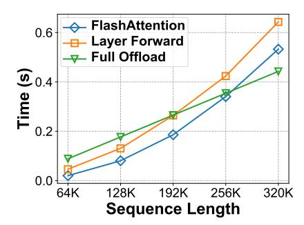

Fig. 1. The left figure, generated using PyTorch's snapshot API [10], shows the allocated and reserved GPU memory of PyTorch when training a 7B GPT model with sequence length 512K. The right figure shows the time consumption of FlashAttention computation, one transformer layer forward computation, and one-layer full activation offloading when training a 7B GPT on 8 A800 GPUs with a TP size of 8.

in Section 3). Such transient activations have distinct data life cycles and usually lead to frequent allocation and deallocation of GPU memory. Currently, most LLM training systems are built on top of PyTorch [60], including Megatron-LM [77] and DeepSpeed [69]. PyTorch employs a caching memory allocator designed to reduce the costly "cudaMalloc" and "cudaFree" operations by caching and reusing allocated memory blocks. However, the frequent memory (de)allocation requests in the caching allocator result in significant memory fragmentation [22]. This issue becomes more severe in long context training, considering the fact that the (de)allocated memory blocks are significantly larger than those in normal tasks. Memory fragmentation not only leads to Out-Of-Memory (OOM) error but also significantly hinders training efficiency because of the frequent triggering of the PyTorch memory reorganization process, which involves calls to "cudaFree" and "cudaMalloc" to release cached blocks and reclaim GPU memory. Figure 1(a) illustrates an example of GPU memory fragmentation. At the peaks of the curves, there is more than 4GB memory reserved but not allocated. However, when the training task tries to allocates 4GB memory, the allocator fails to find a continuous memory space to fulfill the allocation request. Consequently, it necessitates invoking a series of "cudaFree" and "cudaMalloc" to reorganize memory, which blocks GPU computation.

In this paper, we aim to tackle the memory challenges encountered during long context LLM training. Specifically, we propose and implement an LLM training framework Memo to address the activation data management problem. There are several key observations that inspire our design.

In the data management domain, when high-bandwidth memory is limited, rematerialization is a typical technique to free up memory by releasing data that is not immediately needed and reconstructing data structures on demand. For instance, Spark [91] supports rematerializing Resilient Distributed Datasets (RDDs) [90] through recomputation or swapping2 between CPU memory and disk storage when RAM is insufficient. Faiss [30], a widely used vector database, utilizes a CPU-GPU memory hierarchy to accommodate the high memory requirement. Additionally, the dynamic view materialization solution [64] employs an LRU cache to manage materialized views, and rematerializes cache-missed views upon needed. These methods leverage recomputation and swapping strategies to efficiently manage data structures within the memory hierarchy. Similarly, in deep learning training, to reduce the peak memory consumption caused by skeletal activations,

&lt;sup>2Swapping refers to moving data between different levels of memory hierarchy. More details are provided in Section 2.2.

53:4 Pinxue Zhao et al.

> **[图片提取文字 (无描述)]:**
> Backward Forward Bi-level Memory Planning Bi-level Memory Planning Flash Attention Flash Attention Activations Activations Discard Recompute GPU: Forward and Backward Computation Offload CPU Memory (Several Terabytes): Store Activations from GPUs Prefetch
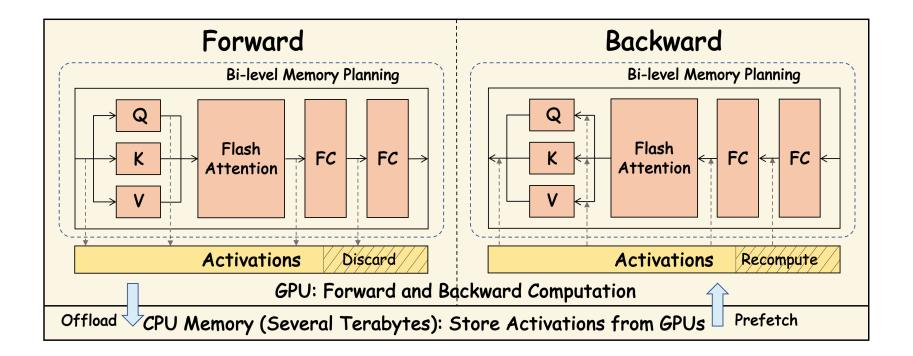

Fig. 2. An overview of MEMO. We devise a fine-grained recomputation and swapping mechanism to manage the skeletal activations for backward propagation, and leverage a bi-level memory planning method to reuse the memory space of transient activations across the transformer layers.

activation recomputation [8, 34, 35] and swapping [56, 71] are also widely adopted. 3 Typically, both of them reduce memory consumption at the price of extra time cost. The activation recomputation technique discards some activations in the forward pass and later recomputes them in the backward pass, leading to extra computation cost. The swapping technique offloads the activations to CPU memory in the forward pass to relieve the GPU memory pressure, and later fetches them back to GPU memory in the backward pass, incurring the overhead of data transmission between CPU and GPU memory.

Observation 1: Opportunity for activation swapping. Contemporary mainstream LLM training frameworks such as Megatron-LM and DeepSpeed prefer activation recomputation to swapping, which is due to the fact that the GPU computing ability has a far more rapid growth than the connectivity between CPU and GPU memory in the past few years (see Section 2.2 for details). However, we find that the situation is a bit different in long context training of LLMs. Denote s as the sequence length. The computation complexity of one transformer layer is  $O(s^2)$ , while the activation memory complexity is O(s) thanks to FlashAttention. During GPU computation, we can leverage the idle CPU-GPU bandwidth, offloading activations to CPU memory during the forward pass, and fetching the activations during the backward pass. As the sequence length increases, there is greater potential for overlapping computation and communication, given that their time requirements scale quadratically and linearly with the sequence length, respectively. As shown in Figure 1(b), eventually, after reaching a specific sequence length (192K in this case), the transmission of activations can be fully overlapped with GPU computation.

However, in practice, there is limited chance to swap all activations. On the one hand, extremely long training data is rare, and most of the time we need to train on data that doesn't fully overlap the activation transmission and the computation. On the other hand, offloading all activations may cause CPU OOM issues — the CPU memory is responsible for storing all activations from all GPUs on the same machine, but the current CPU memory is typically several terabytes, which is insufficient for very long sequence lengths. Considering the above challenges, we introduce a fine-grained activation recomputation and swapping mechanism to manage the skeletal activations. We consider both tensor-level and token-level activation management. For each layer, following previous works [37, 56], we consistently offload two activation tensors, the input of each transformer layer and the output of FlashAttention, to CPU memory. For other activation

&lt;sup>3Parallelism techniques like sequence parallelism [28, 35] and context parallelism [37, 42, 55] are also compelling approaches to reduce memory at the price of extra communication overhead. Our work is compatible with these parallelism techniques.

tensors, we only offload a fraction (denoted as  $\alpha$ ) of tokens, and recompute the rest part during the backward pass. We model the time cost of activation recomputation and transmission and determine the fraction  $\alpha$  through a well-formulated linear programming problem, which aims to maximize offloading activations without impeding GPU computation or causing CPU OOM issues. During the backward pass, prefetching activations can also overlap with GPU computation, because the backward computation is typically twice as much as the forward computation. With both tensor-level and token-level activation management, we make full use of the idle bandwidth and minimize the recomputation overhead to improve the overall efficiency.

Regarding memory fragmentation, research has utilized the characteristics of targeted workloads to analyze and resolve the issue, such as experimentally analyzing the impact of memory allocation on high-performance query engines [16] and addressing persistent memory fragmentation with efficient defragmentation algorithms [59]. In the same vein, for long-sequence LLM training, we aim to leverage the specific characteristics of LLM training to address memory fragmentation.

Observation 2: Deterministic memory (de)allocation pattern across iterations and layers. In long sequence LLM training, the memory fragmentation mainly comes from frequent and irregular memory (de)allocation requests. However, we observe that, typical LLM training adheres to a deterministic computation process across iterations and layers. All transformer layers in an LLM are identical, and each training iteration involves the same computation. While the general-purpose caching allocator is designed for dynamic computation routines, training LLMs can be conceptualized as static computation graphs [3], which have identical structures across layers. This provides an opportunity to design static planning for each layer and reuse the allocated memory of each layer, thereby mitigating memory fragmentation.

To enhance memory utilization while minimizing fragmentation, we leverage a <a href="Mixed Integer Programming">Mixed Integer Programming (MIP)</a> technique to tackle the memory planning problem. Before training, we profile the memory (de)allocation requests of one training iteration, then use MIP to solve an optimized memory plan for a single transformer layer. Since the memory requests of the transformer layers are identical, the entire memory block for one layer can be directly reused for the subsequent identical layer. Considering each transformer layer's memory block as a single memory allocation request, we further solve another MIP problem that plans memory allocation for the entire LLM training, including the initial embedding layer, all transformer layers, and the final classifier layer. We only need to solve the problem once before the actual training, since all iterations can utilize the same memory plan. The near-optimal memory plan eliminates the fragmentation issue and avoids PyTorch's time-consuming memory reorganization mechanism.

Putting them together, in response to the activation memory challenge in long context training, we propose <u>Memo</u>, an LLM training framework with fine-grained tensor memory management. We consider the challenge as an activation data management problem, and draw inspiration from the data rematerialization and memory defragmentation techniques to address the challenge. Figure 2 presents an overview of Memo. To make full use of the idle CPU-GPU bandwidth during training with different sequence lengths, we introduce a token-wise fine-grained activation recomputation and swapping strategy. We employ a bi-level hierarchical MIP technique to solve the memory planning problem and eliminate memory fragmentation. To the best of our knowledge, this is the first training framework that enables efficient training of a 7B LLM on 8 GPUs with a sequence length of 1 million.

We summarize our contributions as follows:

• We propose and implement an LLM training framework Memo to address the activation data management problem in long context LLM training.

53:6 Pinxue Zhao et al.

| Notation | Explanation                  |
|----------|------------------------------|
| b        | Batch size                   |
| S        | Context length               |
| n        | Number of transformer layers |
| h        | Hidden size                  |
| P        | Number of model parameters   |
| $\alpha$ | The fraction of swapping     |

Table 1. Commonly used notations in this work.

> **[图片提取文字 (无描述)]:**
> output layer norm classifier layer FC transformer layer (n-1) GeLU FC transformer layer 2 layer norm transformer layer 1 dense transformer layer 0 self attn embedding layer input tokens
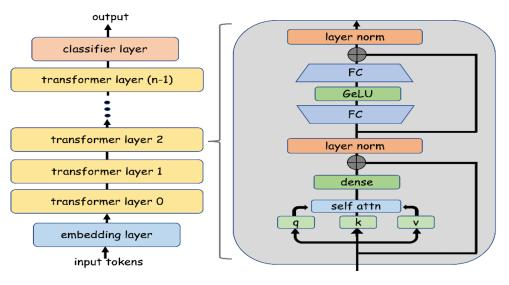

> **[图片提取文字 (无描述)]:**
> Forward Memory Request Backward Memory Request index instruction index instruction tensor\_id size tensor id size malloc 13 128MB 12 malloc 512MB 0 20 malloc 14 128MB 13 free 20 512MB 2 14 free 14 128MB malloc 21 1024MB 3 malloc 15 256MB 15 malloc 22 256MB 4 13 128MB 16 15 256MB free free 5 malloc 16 512MB 17 malloc 23 128MB 6 malloc 17 128MB 18 malloc 24 512MB malloc 18 128MB 19 free 21 1024MB 8 19 20 256MB malloc 256MB free 22 9 free 17 128MB 21 free 23 128MB 19 10 free 256MB 22 free 24 512MB 11 18 128MB 23 512MB free free 16
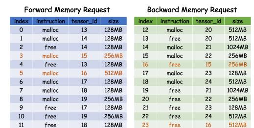

- (a) The architecture of a typical LLM.
- (b) An example memory request sequence.

Fig. 3. (a): The architecture of a typical LLM. (b): An example memory request sequence of a transformer layer's forward and backward pass. Tensors 15 and 16 are skeletal tensors, while the others are transient tensors.

- We introduce a fine-grained activation recomputation and swapping mechanism to fully utilize the idle CPU-GPU communication bandwidth during time-consuming GPU computation.
- We employ a bi-level MIP technique to solve the memory planning problem and significantly mitigate memory fragmentation.
- We evaluate Memo through extensive experiments, and demonstrate an average of 1.97× and 1.80× improvement in terms of MFU4 compared to Megatron-LM and DeepSpeed, respectively. Additionally, Memo is the first framework that enables the efficient training of 7B LLM with 1 million context length on only 8 A800 GPUs.

#### 2 Preliminary

In this section, we present an overview of the architecture and training process of LLMs, along with memory reduction strategies and distributed training techniques. Commonly used notations are listed in Table 1.

#### 2.1 Large Language Models

2.1.1 **Architecture**. As shown in Figure 3(a), the architecture of an LLM comprises an input embedding layer, multiple transformer layers, and a final classifier layer. The embedding layer converts input tokens into continuous representations. Each decoder-only transformer layer constitutes a multi-head self-attention module with causal mask, and an Feed-Forward Network (FFN) module

&lt;sup>4MFU (Model FLOPs Utilization) is a widely used efficiency metric that evaluates how well the accelerators are utilized in model training. It is calculated as the ratio of the observed throughput to the theoretical throughput which assumes the hardware operates at peak FLoating-point Operations Per Second (FLOPS) [65]. More details are provided in Section 5.1.

containing Fully-Connected (FC) networks. The classifier layer takes the hidden states produced by the transformer layers as input, and generates a probability distribution over the vocabulary.

2.1.2 **The Training Process**. The training process of LLM involves two phases: the forward pass and the backward pass. During the forward pass, the model processes the input data through its layers, and finally generates predictions. The output tensors of the operators in forward pass are called activation tensors, some of which are stored for backward pass computation according to gradient-based learning.

The backward pass, on the other hand, computes the gradients with regard to the model parameters. These gradients are used to update the model's parameters. Following the chain rule in gradient computation, the backward pass relies on the activation tensors from the forward pass to compute gradients.

2.1.3 The Challenge of Huge Memory Requirement in Long Context Training. Self-attention is the most critical module in LLMs. It facilitates information interaction between tokens: the input tensor is first projected into query (Q), key (K), and value (V), each with the shape (b, s, h); then the output is given by  $O = \operatorname{softmax}(QK^T/\sqrt{d}) \cdot V$ , which incurs  $O(s^2)$  time and space complexity due to the (b, s, s) matrices. FlashAttention [11, 12], the de-facto attention implementation in nowadays LLM computation, processes the computation in tiles, discards intermediate results, and maintains compact states to generate the final output O. This method avoids storing the  $O(s^2)$  matrices. During the backward pass, FlashAttention re-computes these intermediate results in a tiled manner for gradient calculation. Thanks to this design, FlashAttention significantly reduces memory requirements to just O(s) complexity. Although several alternative approaches like sparsification [48] (e.g., BigBird [92], Longformer [4]), kernelization (e.g., LinearAttn [32], CosFormer [67]), and low-rank approximation (e.g., Linformer [85], Nyströmformer [87]) also aim to reduce the quadratic memory demands of self-attention, these methods modify the attention mechanism and can potentially compromise accuracy. In this paper, we adopt FlashAttention as the default method, considering its prevalent use in practice.

Although FlashAttention has reduced the memory complexity of LLM training from  $O(s^2)$  to O(s), the linearly scaling activation memory remains the primary challenge in long context training. For example, as we will elaborate in Section 3, when training a 7B GPT model with 32 layers and a hidden size of 4096, using a single 1 million length sequence, the forward activation tensors required by the backward pass consume 4096GB (when using half-precision numbers), whereas the typical memory capacity of a GPU is much smaller. To cope with this issue, there are two lines of efforts, which are the memory reduction techniques and distributed parallelism strategies. In the rest of this section, we will introduce these two lines respectively. It is worth noting that although our work primarily concentrates on the memory reduction techniques, the proposed MEMO framework is compatible with a wide range of parallelism strategies.

#### 2.2 Memory Reduction Techniques

As mentioned in Section 1, when existing query processing engines face the challenge of limited high-bandwidth memory, a common strategy to mitigate memory pressure involves discarding certain data structures and rematerializing them as needed [30, 64, 91]. There are two prevalent techniques: (1) recomputing the results and (2) swapping data to lower-tier memory and retrieving it when necessary. Both methods are also widely-used in neural network training to rematerialize activation tensors

Activation recomputation [8, 34, 35] (a.k.a. activation checkpointing) selectively stores the inputs of certain layers rather than all intermediate activations. During the backward pass, the

53:8 Pinxue Zhao et al.

required activations are recomputed on-the-fly. While this approach reduces the activation memory footprint required for LLM training, it introduces additional computation, which impacts efficiency. Swapping [\[56,](#page-25-7) [70,](#page-26-11) [71\]](#page-26-8), also known as CPU offloading, aims to relieve the GPU memory pressure by offloading GPU tensors to CPU memory, and fetch them back to GPU when needed. Through careful scheduling, the data transmission overhead can be overlapped with GPU computation, a technique also popular in GPU databases [\[30,](#page-24-6) [74,](#page-26-12) [84\]](#page-26-13). However, if data transmission is too time-consuming to overlap, swapping can significantly slow down training. In general, both memory reduction techniques release the memory of activations in the forward pass, but need to rematerialize them in the backward pass, at the price of extra computation or data transmission overhead, respectively.

In the past few years, GPU computing capabilities have improved over 100× (e.g., the halfprecision performance of P100 and H100 are 18.7 and 1979 TFLOPS, respectively), while the improvement of CPU-GPU bandwidth is only 4× (from PCIe 3.0 to PCIe 5.0). As a consequence, mainstream LLM training frameworks favor the activation recomputation technique.[5](#page-7-0) In practice, when training LLMs with long context input, full activation recomputation is often employed, which involves storing only the input tensor of each transformer layer and recomputing the required activations during backward propagation.

## 2.3 Distributed Parallelism Strategies

Distributed training is essential for efficiently training LLMs, especially in scenarios of long context training. To facilitate the training of large-scale data and model, several distributed parallelism strategies have been proposed.

Data Parallelism (DP) [\[13,](#page-23-17) [38,](#page-24-12) [104\]](#page-27-9) duplicates model parameters and distributes the input data across multiple devices. Each device holds a complete copy of the model and processes its input data independently. After backward propagation, the devices synchronize parameter gradients to ensure consistency across the model copies.

Zero-Redundancy Optimizer (ZeRO) [\[68\]](#page-26-14) is a series of variants built upon DP, aiming to alleviate memory pressure. Naive DP replicates model parameters, gradients and optimizer states among all devices. ZeRO is designed in three stages to reduce these memory requirements respectively. First, ZeRO-1 partitions the optimizer states among all DP workers. Next, ZeRO-2 extends ZeRO-1 by also partitioning gradients, further reducing memory footprint. Finally, ZeRO-3, based on ZeRO-2, partitions model parameters among DP workers, further mitigating memory pressure but introducing additional communication to gather parameters during training.

Tensor Parallelism (TP) [\[77\]](#page-26-6) partitions the self-attention and feed-forward modules of transformer layers across multiple devices along either the column or row dimension. It addresses the problem that LLMs can not fit into the memory of a single device. It involves extra collective communication operations (i.e. AllReduce) to synchronize the intermediate results. Therefore, TP is usually applied within a computing node, where intra-node GPUs are connected via high-bandwidth NVLink.

Pipeline Parallelism (PP) [\[21,](#page-23-18) [26,](#page-24-13) [53\]](#page-25-12) is also proposed to address the problem that LLMs cannot be fit into a single device. Different from TP, PP partitions model layers into several stages, then distributes the stages to different devices. The input data is processed through these stages in a pipeline fashion. Given the peer-to-peer communication style, the PP stages are often distributed across nodes. However, PP introduces a phenomenon known as "bubble", which corresponds to GPU idle time. The issue becomes more severe when the number of micro-batches is small.

5Both Megatron-LM and DeepSpeed have supported activation recomputation for long. Nevertheless, Megatron-LM does not support swapping until the release of TransformerEngine v1.3 in Feb 2024. Besides, DeepSpeed primarily focuses on swapping of model states, encompassing model parameters, gradients and optimizer states [\[70\]](#page-26-11), as they constitutes the most significant portion of memory footprint in short context training tasks. However, in long context training scenarios, the memory consumption of activations has surpassed that of model states.

To facilitate efficient long context training, several novel parallelism strategies have been proposed recently.

Sequence Parallelism (SP) [\[35\]](#page-24-8) is built upon TP to further reduce activation memory overhead. It splits the sequence dimension in the part of the model that does not apply TP. The original AllReduce communication now transitions to AllGather and ReduceScatter.

DeepSpeed-Ulysses [\[28\]](#page-24-3), built upon ZeRO, is another form of sequence parallelism. During self-attention computation, it splits the head dimension, whereas in other model components, it partitions the sequence dimension. For transitioning between modules, it utilizes AllToAll communications, theoretically reducing communication overhead compared to SP. However, its SP degree is limited by the number of heads in self-attention. To further relieve the memory pressure, DeepSpeed-Ulysses leverages ZeRO to distribute model parameters.

Context Parallelism (CP) [\[37,](#page-24-9) [42,](#page-24-10) [55\]](#page-25-8) shards the query, key, and value matrices within the attention module along the sequence dimension across different devices. During attention computation, necessary communications are involved to ensure consistent results, which can be overlapped with computation by careful scheduling.

In practice, these parallelism strategies and memory reduction techniques can be integrated and employed simultaneously to facilitate efficient training of LLMs.

#### 3 Anatomy and System Desiderata

Managing fragmented massive data storage is a critical data management issue, particularly when workloads are constrained by limited high-bandwidth memory. Long-context LLM training demonstrates such a challenge, where huge fragmented activation memory significantly impedes efficient training within constrained GPU memory resources.

In this section, we first provide an in-depth anatomy of the key characteristics of activation data storage in long-context LLM training. Based on this analysis, we present the design desiderata that motivates the development of Memo.

#### 3.1 Categorization of Activation Tensors

In long-context LLM training, the primary memory consumption originates from activation tensors, which are the outputs of computing operators in LLMs. According to their life cycles, we can categorize activations generated during the forward propagation into two classes, which are the skeletal activations and the transient activations, where the former is necessary for the backward propagation while the latter is not.

For illustration, in Figure [3\(b\),](#page-5-3) tensors 13, 14, 17, 18, and 19 are produced during the forward pass of a transformer layer, and are discarded before the completion of this layer's forward pass. Similarly, tensors 20, 21, 22, 23, and 24 are generated during the backward pass of this layer, and are discarded after corresponding computation. We term them "transient tensors" because they are created and discarded within a single layer's forward or backward pass. Transient tensors usually serve as temporary results. Conversely, tensors 15 and 16 are generated during the forward propagation and are needed for backward propagation, so they are discarded in this layer's backward pass. We refer to these tensors as "skeletal tensors" because they are produced during the forward pass, and are essential for the gradient calculation during the backward pass.

#### 3.2 Analysis of Skeletal Activations

Figure [4](#page-9-0) presents all skeletal tensors generated within a transformer layer's forward propagation, along with their sizes. We can see that the total size of all skeletal activations in a single transformer layer amounts to 16ℎ. To exemplify, when training the GPT-7B model (ℎ = 4096, 32 layers) with

53:10 Pinxue Zhao et al.

> **[图片提取文字 (无描述)]:**
> add Skeletal Activation Tensors of a Transformer Layer 4h\_to\_h GeLU output (4bsh) GeLU h to 4h h\_to\_4h output(4bsh) post attn norm output (bsh) add & norm attn residual output (bsh) dense flash attn output (bsh) flash-attn q,k,v calculation q (bsh) k (bsh) v (bsh) input norm input norm output (bsh) input input (bsh)
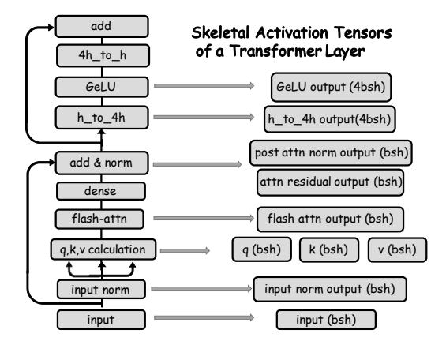

Fig. 4. Illustration of the transformer layer architecture. The sizes of skeletal activations are provided in the brackets.

> **[图片提取文字 (无描述)]:**
> Computation bwd of layer 2 Computation ( bwd of layer 5 fwd of layer 2 fwd of layer 3 fwd of layer 4 fwd of layer 5 bwd of layer 3 bwd of layer 4 Stream: Stream: H2D D2H swap buffer O swap buffer 1 swap buffer 1 swap buffer 1 swap buffer 1 swap buffer 0 swap buffer 0 swap buffer 0 Stream: Stream: recompute layer 2 recompute layer 4 recompute layer 5 recompute layer 3 GPU Memory buffer 0 GPU Memory buffer 0 buffer 1 buffer 1 GeLU output GeLU output GeLU output GeLU output h to 4h output h to 4h output h to 4h output h to 4h output post attn norm output post attn norm output post attn norm output post attn norm output attn residual output attn residual output attn residual output attn residual output flash attn output flash attn output flash attn output flash attn output input norm output input norm output input norm output input norm output input input input input discard recompute recompute discard offload prefetch 1 offload prefetch 1 CPU Memory CPU Memory
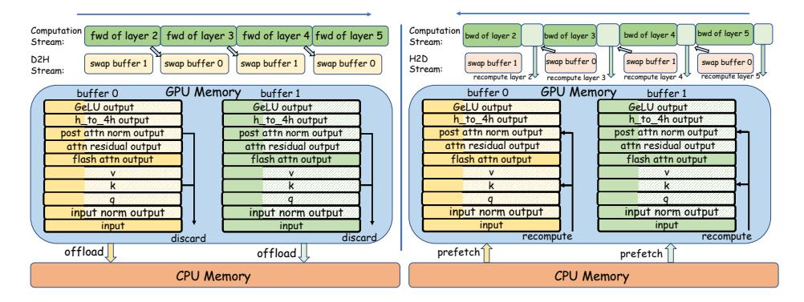

Fig. 5. Forward and backward propagation with rounding buffers for token-wise recomputation/swapping. During forward propagation, the darker part in the rounding buffers is offloaded to CPU, while the lighter part is discarded; during backward propagation, the darker part in the rounding buffers is prefetched from CPU, while the lighter part is recomputed.

a sequence length () of 1 million, if we store the skeletal activations in half-precision floating numbers, it would take 4096 GB for only one sequence ( = 1), exceeding the memory capacity of even 50 A100/H100 GPUs.

An important characteristic of skeletal activations is that they are needed by backward computation, so they must reside in GPU at least before the backward propagation of the corresponding transformer layer begins. However, maintaining all skeletal activations for backward propagation is infeasible. To this end, memory-saving techniques like recomputation and swapping, which are also prevalent in traditional data management problems [\[30,](#page-24-6) [64,](#page-25-6) [91\]](#page-27-5), become necessary for long context training.

In LLM training, these techniques first release the skeletal activations of a transformer layer in the forward propagation, and later rematerialize them before the corresponding backward propagation.

Unfortunately, naïvely applying activation recomputation or swapping is insufficient to tackle the challenge of managing large-scale skeletal activations. Both techniques trade time for memory — the activation recomputation technique incurs extra computation overhead while the swapping technique necessitates transmitting the activations from CPU memory to GPU memory. Using recomputation alone incurs significant additional computation overhead, while employing swapping alone can lead to CPU OOM error (when the sequence is too long) or block GPU computation (when the swapping time cannot be fully overlapped). As a result, we desiderate a meticulous orchestration of the two memory-saving techniques to manage the skeletal activations, so that we can minimize the extra overhead while accommodating the huge memory requirement in long context training of LLMs. To achieve this, we develop a token-wise activation recomputation and swapping mechanism, which will be demonstrated in Section [4.1.](#page-10-0)

#### 3.3 Analysis of Transient Activations

Transient activations are intermediate results generated and discarded during the forward (or backward) pass of a transformer layer. Actually, there are more transient activations than skeletal activations in a transformer layer. Specifically, we observe that the number of transient activations can exceed 5 times that of skeletal activations. Without careful management, the frequent allocation and deallocation can lead to memory fragmentation, which degrades system performance and poses a major concern for managing massive data storage. There have been studies in the data management community focusing on memory defragmentation [\[16,](#page-23-14) [59\]](#page-25-9), leveraging the characteristics of target workloads to devise appropriate and innovative methods. Following the methodology, we analyze the LLM training process and attempt to defragment the tensor memory. During training, memory requests are identical across both transformer layers and training iterations, providing an opportunity to manage and reuse these memory regions effectively to minimize fragmentation. In particular, the memory addresses of a single transformer layer's transient activation tensors can be reused by all other transformer layer's corresponding transient activation tensors. However, in practice, memory reuse is not fulfilled because the PyTorch caching allocator lack prior information of the memory request sequence during training iterations. This inspires us to statically plan the memory addresses of each transformer layer's transient tensors, which will be described in detail in Section [4.2.](#page-13-0)

#### 4 Memo Design

In this section, we propose Memo for fine-grained activation memory management. Our proposed method leverages fine-grained and structured activation management, akin to concise memos that share vital information. The main challenge of long context training is the large activation size which scales linearly w.r.t. sequence length. We propose token-wise activation recomputation and swapping, along with a bi-level memory planning to address the issue, which targets skeletal activations and transient activations, respectively. The overview of Memo is depicted in Figure [2.](#page-3-1)

#### 4.1 Token-wise Recomputation and Swapping

Skeletal tensors, generated during the forward pass of a transformer layer, must reside in GPU memory for the subsequent backward propagation. In practice, as sequence length grows, the size of skeletal activations increases linearly, which can easily exceed the capacity of GPU memory. As introduced in Section [2.2,](#page-6-0) currently the most widely-used technique to tackle this issue is activation recomputation, which stores only the input of each transformer layer, and discards the rest skeletal activation tensors of this layer. Prior to backward propagation of each layer, an additional forward pass of the layer is conducted to reconstruct all skeletal tensors so that the backward computation can be carried out. However, we note that the vanilla activation recomputation strategy is not an optimal choice to handle the challenge of linearly increasing skeletal activation memory, considering the following two reasons: (1) activation recomputation introduces redundant computation, thus diminishing training efficiency; and (2) the memory overhead of retaining the input tensor of each 53:12 Pinxue Zhao et al.

transformer layer can still be expensive, especially when the sequence length is too long or the number of layers is too large. Take the training of GPT-7B with a context length of 1 million as an example again. For only one sequence, the input tensors of all 32 transformer layers together consume 128GB. Even using a SP degree of 8, it takes 16GB for each GPU to store the input tensors of all 32 transformer layers, which already takes up to 20% of total GPU memory capacity.

As explained in Observation 1, the computation complexity of FlashAttention w.r.t. sequence length is  $O(s^2)$ , while the size of skeletal activations within a transformer layer scales linearly with sequence length. This provides us with the opportunity to offload skeletal activations to CPU memory, thereby saving GPU memory. We can prefetch them back to GPU before the backward propagation of the corresponding transformer layer. The swapping of skeletal activations can overlap with GPU computations in long context training, since the CPU-GPU data transmission does not consume GPU computation units.

To facilitate the overlapping, we utilize two rounding GPU buffers to store the skeletal activations for all transformer layers. The two rounding buffers are allocated before the actual training iterations begin. As shown in Figure 5, transformer layers with even layer indices place their skeletal activation tensors in rounding buffer 0, while layers with odd layer indices use rounding buffer 1.

After the computation of transformer layer i, rounding buffer (i%2) will be offloaded to CPU using a separate CUDA stream. This happens simultaneously with the computation of transformer layer (i+1). Before the forward computation of transformer layer (i+2), a CUDA event is employed to ensure the content of rounding buffer (i%2) has been fully offloaded to CPU memory, thus the transformer layer (i+2) can safely rewrite rounding buffer (i%2).

For backward propagation, after the backward pass of transformer layer (i+2) ends, the contents within rounding buffer (i%2) become useless, and we start prefetching the skeletal activations of transformer layer i to rounding buffer (i%2) using another CUDA stream. The prefetching of transformer layer i's skeletal activations happens simultaneously with the backward propagation of transformer layer (i+1). When the sequence length is sufficiently long, with careful computation-transmission overlapping and synchronization, CPU swapping can substitute activation recomputation without incurring additional overhead.

However, there are two constraints that prevent us from offloading all skeletal activations to CPU memory.

- For sequence lengths that are not sufficiently long, the time required to offload all skeletal activations to CPU memory surpasses the computation time for a single transformer layer. This discrepancy forces the computation of transformer layer (*i* + 2) to be delayed until the offloading of rounding buffer to CPU memory is completed, thereby blocks the normal GPU computation workflow. For instance, as illustrated in Figure 1(b), when training a 7B GPT model on 8 GPUs with a TP degree of 8, ideal overlap between the computation of a transformer layer and the offloading of its skeletal activations occurs only for sequence lengths exceeding 192K. In practice, the sequence lengths of most training datasets are moderate and may be not sufficient to ensure an ideal overlap between computation and transmission.
- In theory, a longer sequence length provides more opportunities for overlapping swapping with GPU computation. However, in practice, the CPU memory is often limited. For a typical GPU server which has several terabytes CPU memory (e.g. 2TB in our environment), it is insufficient to store all skeletal activations when the sequence length is excessively long or the number of transformer layers is too large. For instance, when training the 7B model on a server equipped with 8 GPUs using a sequence length of 1 million, the skeletal activations amount to a total size of 4096GB, which is double the capacity of CPU memory.

> **[图片提取文字 (无描述)]:**
> FlashAttention -90% इ Others 80% <del>ه</del> ‱05 384 640 128 192 256 320 448 512 576 Sequence Length (K)
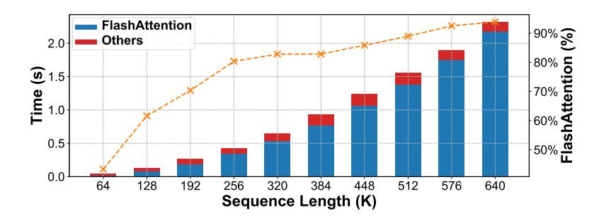

Fig. 6. Forward time of FlashAttention and other parts of a transformer layer when training a 7B GPT on 8 GPUs with a TP degree of 8.

Therefore, instead of simply offloading all skeletal activations to CPU memory, we employ selective activation swapping to ensure perfect overlap of computation and transmission for short sequences as well as to avoid depleting CPU memory for extremely long context lengths. Memo determines the selection of swapping at both the tensor and token granularities, as depicted in Figure 5.

At the tensor granularity, we consider the benefits of leveraging the swapping technique rather than the recomputation technique of different modules. As depicted in Figure 6, FlashAttention constitutes the most substantial portion of the forward computation of a transformer layer. Notably, when the sequence length exceeds 576K, FlashAttention accounts for more than 90% of the computation involved in a single transformer layer. However, as illustrated in Figure 4, the output of FlashAttention only accounts for 6.25% of total skeletal activation size. This inspires us to offload the entire output tensor of FlashAttention to CPU memory since recomputing its output is very time-consuming. Besides, since LLMs have a layered structure, in order to reconstruct the "input\_norm", "q", "k", "v" tensors, we also store the input of each transformer layer to CPU, following common recomputation strategy [8].

At the token granularity, we develop the token-wise activation recomputation and swapping technique to reduce the memory consumption of all skeletal activation tensors other than the output of FlashAttention and the input of each layer. To be specific, as shown in Figure 5, for each of these skeletal activation tensors, we offload a fraction (denoted as  $\alpha$ ) to CPU, while the remaining part is discarded, ensuring perfect overlapping and to avoid CPU OOM error. Before the backward pass, the discarded part is rematerialized via recomputation while the offloaded part is prefetched.

To determine the fraction  $\alpha$ , we solve the following problem:

max 
$$\alpha$$
,  
s.t.  $(S_{input} + S_{attn} + \alpha \cdot S_{others})/B \le T_{layer}$ ,  
 $(n-2)(S_{input} + S_{attn} + \alpha \cdot S_{others}) \le M_{CPU}$ .

where  $S_{input}$ ,  $S_{attn}$ , and  $S_{other}$  stand for the size of input tensor, the size of FlashAttention output tensor, the total size of other skeletal activation tensors, respectively; B is the PCIe bandwidth between GPU and CPU,  $T_{layer}$  is the forward time of a single transformer layer, n is the total number of transformer layers, and  $M_{CPU}$  stands for the capacity of CPU memory. It is worth noting that, the last two transformer layers can initiate the backward pass immediately after the forward pass, obviating the need for swapping. These variables can be easily obtained through profiling before training, so we can determine an appropriate  $\alpha$  without much effort.

53:14 Pinxue Zhao et al.

> **[图片提取文字 (无描述)]:**
> 2 fwd buffer 33 ••• 42 0 bwd buffer ••• 102 103 final mem plan second-level MIP MIP solver planned bwd buffer planned bwd buffer embedding fwd classifier embedding bwd 5 32 89 43 44 000 87 88 mem requests mem requests mem requests MIP solver MIP solver first-level MIP layer fwd mem requests layer bwd memory requests
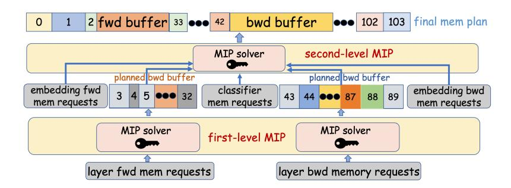

Fig. 7. Bi-level MIP algorithm.

#### 4.2 Bi-level Memory Planning

In the previous subsection, we have tackled the management of skeletal activations by the fine-grained recomputation and swapping technique. However, frequent allocation and deallocation of the transient activation tensors still lead to GPU memory fragmentation, which forces the allocator to frequently reorganize GPU memory using time-consuming "cudaFree" and "cudaMalloc" operations. To address the issue, and to achieve full reuse of GPU memory across all transformer layers, we design a bi-level Mixed Integer Programming (MIP) method.

In practice, our initial step involves profiling the sequence of memory requests during a single training iteration. Given the memory request sequence, the challenge lies in determining the address of each requested tensor while at the same time minimizing the peak memory usage. This task aligns with the well-established offline Dynamic Storage Allocation (DSA) problem [76], which can be formulated as a Mixed Integer Programming (MIP) problem. A concise overview of this formulation is shown as follows.

The offline DSA problem handles a sequence of memory allocations and deallocations, and aims to determine the address of each allocated memory block and at the same time minimizing the peak memory usage. Parameters of offline DSA problem includes:

- *n*, the number of requested tensors.
- $S_i$ , the size of requested tensor i, for  $\forall i \in \{1, 2, ..., n\}$ .
- $E = \{(i, j) | \text{tensor } i, j \text{ have overlapped lifespan} \}.$

And the problem can be written as

$$\min \ M,$$

$$s.t. \begin{cases} A_i + S_i \leq M, i \in \{1, 2, ..., n\}, \\ A_i + S_i \leq A_j + z_{ij} \cdot M_{cap}, (i, j) \in E, \\ A_j + S_j \leq A_i + (1 - z_{ij}) \cdot M_{cap}, (i, j) \in E, \\ 0 \leq M \leq M_{cap}, \\ A_i \geq 0, i \in \{1, 2, ..., n\}, \end{cases}$$

where  $A_i$  stands for the address of requested tensor i, M stands for the peak memory usage,  $M_{cap}$  is the memory capacity, and  $z_{ij}$  is defined as

$$z_{ij} = \begin{cases} 0, & A_i + S_i \le A_j, (i, j) \in E, \\ 1, & A_j + S_j \le A_i, (i, j) \in E. \end{cases}$$

Here the first constraint and the last two constraints define and limit peak memory, while the second and third constraints ensure non-overlapping tensors. Following this formulation, the

> **[图片提取文字 (无描述)]:**
> tensor id index operation size Requests for Embedding Layer fwd 0 malloc 13 128MB 14 malloc 128MB Requests for Transformer Layer O fwd free 14 128MB 3 malloc 15 256MB Requests for Transformer Layer 1 fwd 11 free 18 128MB Requests for Classifier Layer fwd Requests for Classifier Layer bwd index operation tensor\_id size malloc 1908 998 512MB malloc 1909 999 1024MB Requests for Transformer Layer n-2 bwd 1920 998 free 512MB malloc Requests for Transformer Layer n-1 bwd 1921 1000 256MB Requests for Embedding Layer bwd 1988 1054 128MB free
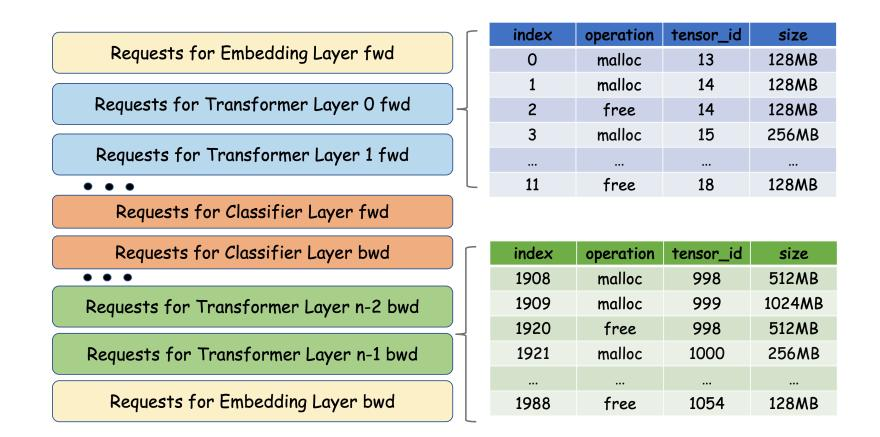

Fig. 8. Memory request sequence during training.

solution for each tensor's address is optimal. However, modern LLM training involves thousands of allocation and deallocation requests within a single training iteration, which makes this NP-hard MIP problem computationally intractable. Consequently, it's infeasible to solve this MIP problem in one pass, given the prohibitively high time cost.

Fortunately, all transformer layers have identical structures and memory request sequences, which presents repetitive substructures within the MIP problem. By leveraging this inherent repetitiveness, we can instead devise a bi-level hierarchical MIP optimization algorithm, which is both computationally feasible and effective.

As discussed in Section [2.1.1,](#page-5-4) a typical LLM consists of an embedding layer, consecutive transformer layers, and a final classification layer. As shown in Figure [8,](#page-14-0) each layer has forward memory request sequence and backward memory request sequence. The memory request sequence is in the form of a sequence of "malloc tensor\_id size" and "free tensor\_id size". Since all transformer layers in an LLM are identical, they have the same forward/backward pass memory request sequence.

As shown in the bottom of Figure [7,](#page-13-1) we first solve the offline DSA sub-problem for just one transformer layer's forward (backward) pass, which is called the first-level MIP. The scale of the first-level MIP is small enough to tackle. This offline DSA problem can be simply solved by any MIP solver (e.g. Gurobi [\[24\]](#page-24-14)). After this step, the peak memory needed for the forward (backward) propagation of a single transformer layer, as well as the address of each transient tensor within a transformer layer is determined. After solving the sub-problem for one transformer layer, all other transformer layers can reuse the same memory address for (de)allocation.

Besides identical transformer layers, LLMs also have other layers that process input tokens and classify output tokens. Therefore, after solving the first MIP for one-layer DSA problem, we conduct the second MIP for the whole LLM training to generate the peak memory requirement and addresses of all transient activation tensors. To simplify the optimization process, we can replace the original fine-grained memory request sequence of each transformer layer's forward (backward) propagation with a "pseudo" large memory request pair, as shown in Figure [7.](#page-13-1) The size of this "pseudo" memory block corresponds to the memory usage of each transformer layer as determined by the first-level MIP. After the substitution, this reformulated memory request sequence also satisfies the formulation of an offline DSA problem, with a size small enough to be efficiently solved. We then leverage the MIP solver again to solve this second-level MIP problem. 53:16 Pinxue Zhao et al.

> **[图片提取文字 (无描述)]:**
> Job Memory Runtime Profiler Planner Executor MIP solver Profile memory requests & Solve for swap fraction, MIP solver MIP solver
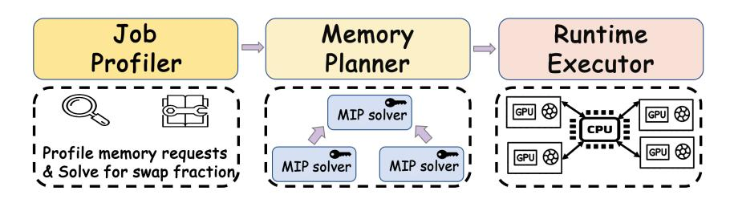

Fig. 9. Overall architecture of Memo.

After this step, the addresses of all activation tensors, and the peak memory needed for all transient activation tensors can be determined.

## 4.3 System Implementation

- 4.3.1 Overview. Figure [9](#page-15-0) illustrates the overall architecture of Memo. First, the job profiler takes in the model configuration, then executes a training iteration to profile the memory requests directed to the PyTorch CUDA allocator during the training phase. The job profiler also determines offloading fraction by solving optimization problem in Section [4.1.](#page-10-0) These memory requests comprise a sequence of allocation and deallocation instructions. Afterwards, the memory planner receives the memory requests, executes the bi-level MIP optimization algorithm and, generates a memory plan, which constitutes the addresses of all transient activation tensors during one training iteration. Finally, the runtime executor reads the memory plan and conducts the training process.
- 4.3.2 Job Profiler. The job profiler is designed to profile the memory request sequence during a training iteration. To implement the module, we have extended the PyTorch CUDA allocator with extra interfaces that log each memory request it receives, in the format of "malloc tenosr\_id size" and "free tensor\_id size".

However, naively recording all memory requests may lead to OOM error. For example, directly profiling a GPT-7B model with a sequence length of 512K on 8 GPUs can result in OOM error. Fortunately, all transformer layers have identical memory footprint. We leverage this property by only profiling one transformer layer's memory footprint and then applying it to all transformer layers.

When the sequence is too long, we cannot even profile one single transformer layer. In such extreme cases, we turn to the CUDA Unified Memory feature, which enables the swapping between GPU memory and CPU memory under the hook, creating an illusion of unlimited GPU memory. By integrating CUDA Unified Memory support into the PyTorch CUDA allocator, we have successfully managed to profile the training of extremely long context lengths.

The profiler also gathers the basic information to determine in Section [4.1,](#page-10-0) including the size of each skeletal activation tensor, and the forward time of a one layer. Subsequently, it solves for the optimal to maximize the overlapping of computation and transmission as well as to avoid CPU OOM error.

4.3.3 Memory Planner. Given the memory request sequence generated by the job profiler, memory planner executes the bi-level MIP optimization algorithm as introduced in Section [4.2](#page-13-0) to generate a memory plan, which includes the address of each transient activation tensor and the peak memory usage needed during training. Memo uses the Gurobi [\[24\]](#page-24-14) optimizer to solve the MIP problems. In all our experiments, memory planning takes less than 5 minutes, which is negligible compared to the training time of LLMs.

> **[图片提取文字 (无描述)]:**
> Timeline of Forward Pass Computation fwd computation of layer i fwd computation of layer (i+1) Stream: D2H offload layer (i-1) offload layer i Stream: Computation fwd computation of layer i fwd computation of layer (i+1) Stream: D2H token-wise offload layer (i-1) token-wise offload layer i Stream: Timeline of Backward Pass Computation bwd computation of layer (i-1) bwd computation of layer i Stream: H2D prefetch layer (i-1) prefetch layer (i-2) Stream: Computation bwd computation of layer i bwd computation of layer (i-1) Stream: H2D prefetch layer (i-1) prefetch layer (i-2) Stream: token-wise recomputation of layer (i-1) token-wise recomputation of layer i
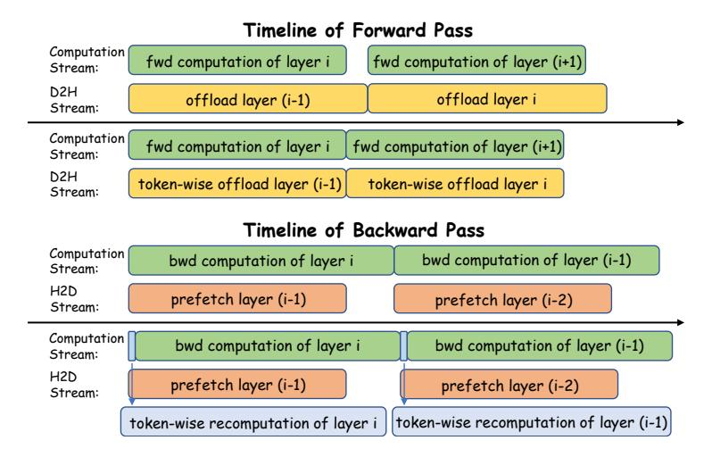

Fig. 10. Scheduling of computation, offloading and prefetching w/ and w/o token-wise recomputation. Given the superior computing ability of modern GPUs, the recomputation part is faster than the offloading part that blocks forward computation.

Table 2. Configurations of the evaluated models.

| Model Size | Hyper Parameters |      |        |       |        |  |  |  |
|------------|------------------|------|--------|-------|--------|--|--|--|
|            | 𝑛𝑙𝑎𝑦𝑒𝑟𝑠          | ℎ    | ℎ𝑓 𝑓 𝑛 | 𝑛ℎ𝑒𝑎𝑑 | 𝑛𝑣𝑜𝑐𝑎𝑏 |  |  |  |
| 7B         | 32               | 4096 | 16384  | 32    | 50257  |  |  |  |
| 13B        | 40               | 5120 | 20480  | 40    | 50257  |  |  |  |
| 30B        | 48               | 7168 | 28672  | 56    | 50257  |  |  |  |
| 65B        | 80               | 8192 | 32768  | 64    | 50257  |  |  |  |

4.3.4 Runtime Executor. The runtime executor takes the memory plan, and executes the training process. It is built on the top of Megatron-LM [\[77\]](#page-26-6) with TransformerEngine [\[56\]](#page-25-7), one of the most popular training frameworks. The runtime executor utilizes two rounding buffers for the storage of skeletal activations, as introduced in Section [4.1.](#page-10-0) Meanwhile, the transient activation tensors are (de)allocated according to the memory plan.

Three CUDA streams are employed for efficient overlapping of data transmission and GPU computation, which are for GPU computation, activation offloading from GPU to CPU, and activation prefetching from CPU to GPU, respectively. Figure [10](#page-16-0) shows the scheduling of computation and transmission. After the computation of one layer's forward pass, the skeletal activations of this layer are scheduled to be transferred to the CPU memory, which can overlap with the computation of the next layer. Before the backward computation of one layer, the forward skeletal activations of the previous layer are scheduled to be fetched back to GPU. In addition, token-wise tensor recomputation is scheduled before the layer's backward pass. By hiding the activation swapping with computation and enabling the lightweight, token-wise activation recomputation, Memo minimizes the overhead of activation rematerialization at full stretch.

