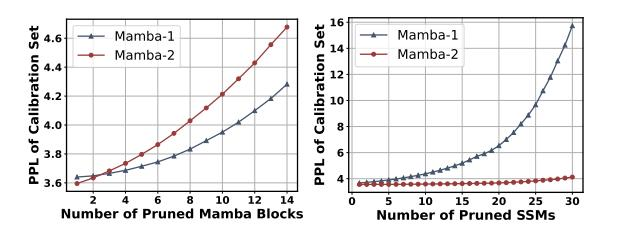

# 4.4 Inference Acceleration

Through the above analysis, we have gained a good understanding and insight into the impact of Mamba-Shedder's structured pruning on model accuracy and perplexity performance. In addition, through structured pruning, Mamba-Shedder achieves an additional speedup to these already highly efficient models. Next, we discuss the impact of inference acceleration. All the following tests were conducted on a single Tesla V100 32GB GPU.

Mamba-1 When removing entire Mamba blocks, as shown in Table [6,](#page-7-2) Mamba-Shedder speeds up the decoding stage up to 1.29x when removing 14 blocks, and 1.13x when removing only 7 blocks, which highlights the potential of Mamba-Shedder to optimize computational efficiency in Mamba models. The user's decision on how aggressively to prune will impact the average accuracy or the

| Model              | Method              | Num. of Pruned Hymba Blocks             | HellaS | PIQA | ARC-e | ARC-c | WinoG | Average |
|--------------------|---------------------|--------------------------------------------|--------|------|-------|-------|-------|---------|
|                    | Dense               | 0/32                                       | 53.5   | 77.1 | 76.6  | 45.4  | 66.1  | 63.8    |
| Hymba-1.5B-Base    |                     | $-\frac{1}{6} \frac{1}{32} - \frac{1}{32}$ | 50.5   | 75.8 | 76.0  | 44.9  | 64.1  | 62.3    |
| 11yiiiba-1.5D-Dase | Hymba Block Pruning | 7 / 32                                     | 49.9   | 74.9 | 74.8  | 43.9  | 64.9  | 61.7    |
|                    |                     | 8/32                                       | 49.2   | 74.3 | 74.2  | 43.2  | 61.5  | 60.5    |

Table 4: Results of Mamba-Shedder with *training-free* Hymba block pruning for Hymba-1.5B-Base (Dong et al., 2024). Five commonsense reasoning tasks are used for evaluation: HellaSwag, PIQA, ARC-e, ARC-c, and WinoGrande.

| Model           | Method              | Num. of Pruned Mamba Blocks / SSMs | Lambada PPL (↓)  | Lambada | HellaS | PIQA | ARC-e | ARC-c | WinoG | OBQA | Average |
|-----------------|---------------------|---------------------------------------|---------------------|---------|--------|------|-------|-------|-------|------|---------|
|                 | Dense               | 0 / 64                                | 3.15                | 74.3    | 80.3   | 82.0 | 84.4  | 58.9  | 75.1  | 49.0 | 72.0    |
|                 |                     | 5/64                                  | $-\frac{1}{4.01}$   | 69.2    | 78.6   | 81.9 | 82.2  | 54.6  | 72.5  | 47.6 | 69.5    |
|                 | Mamba Block Pruning | 10 / 64                               | 4.97                | 65.1    | 75.0   | 79.5 | 79.7  | 51.5  | 70.2  | 43.8 | 66.4    |
|                 |                     | 15 / 64                               | 5.63                | 62.4    | 71.2   | 77.8 | 76.1  | 49.1  | 70.2  | 41.8 | 64.1    |
| Falcon-Mamba-7B |                     | 20 / 64                               | 39.31               | 31.5    | 65.9   | 74.3 | 72.2  | 42.3  | 65.2  | 38.4 | 55.7    |
|                 |                     | 5/64                                  | - <del>3.47</del> - | 71.6    | 77.3   | 81.2 | 77.8  | 49.2  | 73.2  | 47.2 | 68.2    |
|                 | CCM Danning         | 10 / 64                               | 4.24                | 67.2    | 73.6   | 79.8 | 75.3  | 48.3  | 70.2  | 43.0 | 65.4    |
|                 | SSM Pruning         | 15 / 64                               | 5.37                | 63.3    | 69.6   | 78.2 | 72.4  | 43.4  | 68.8  | 41.8 | 62.5    |
|                 |                     | 20 / 64                               | 14.14               | 46.3    | 63.4   | 74.9 | 60.7  | 36.7  | 65.7  | 37.8 | 55.1    |

Table 5: Results of Mamba-Shedder with *training-free* Mamba block pruning and SSM pruning for Falcon-Mamba-7B.

Table 6: Inference benchmark results for Mamba-2.8B. The batch size is 1. Number of batches is 10. The prompt length is 512. Number of new tokens is 16.

| Model      | Method           | Num. of Pruned | Inference Speedup |        |  |
|------------|------------------|----------------|-------------------|--------|--|
| Model      | Wiethod          | Mamba Blocks   | Prefill           | Decode |  |
|            | Dense            | 0 / 64         | 1.00×             | 1.00×  |  |
| Mamba-2.8B | Mamba-Shedder    | 7 / 64         | 1.12×             | 1.13×  |  |
|            | ivianioa-Snedder | 14 / 64        | 1.31×             | 1.29×  |  |

Table 7: Inference benchmark results for Mamba2-2.7B, with test-related hyperparameters consistent with Table 6.

| Model       | Method        | Num. of     | Inference Speedup |        |  |
|-------------|---------------|-------------|-------------------|--------|--|
| Model       | Method        | Pruned SSMs | Prefill           | Decode |  |
|             | Dense         | 0 / 64      | 1.00×             | 1.00×  |  |
| Mamba2-2.7B |               | 16 / 64     | 1.13×             | 1.11×  |  |
| Mamba2-2.7B | Mamba-Shedder | 20 / 64     | $1.16 \times$     | 1.14×  |  |
|             |               | 24 / 64     | $1.20\times$      | 1.18×  |  |

Table 8: Inference benchmark results for Zamba2-2.7B, with test-related hyperparameters consistent with Table 6. The calculation of *Ratio* includes block pruning (Mamba Block, MHA, and MLP) and width pruning (MLP Channel). Refer to Table 3 for more information.

| Model | Method          | Ratio          | Additional | Inferen                | ce Speedup |
|-------|-----------------|----------------|------------|------------------------|------------|
| Model | Wiethod         | (Block, Width) | Pruned SSM | Prefill                | Decode     |
| Zamba | Dense           | 0%             | 0 / 54     | 1.00×                  | 1.00×      |
| -2.7B | Mamba-Shedder   | 15.48%         | 0 / 54     | 1.16×                  | 1.34×      |
| -2.7B | Maiiba-Sileddei | 15.48%         | 18 / 64    | $\textbf{1.25} \times$ | 1.39×      |

perplexity as observed in Table 1.

Mamba-2 As detailed in Table 7, removing 24 SSM modules (44% of the total number of modules) results in up to a 1.20x speedup in the prefill stage and a 1.18x speedup in the decoding stage during of inference. A more conservative pruning ratio achieves 1.11x speedup when removing 16 SSM modules. Based on previous observations, the impact on performance metrics is minimal (0.4% for accuracy and 0.16 for PPL). These results underscore the effectiveness of SSM pruning in enhancing computational efficiency while barely affecting model performance, making it a viable strategy for optimizing Mamba models.

**Zamba-2** As detailed in Table 8, we observe significant acceleration on inference after multiple granularities pruning of Zamba-2. Specifically, pruning Mamba blocks, MLP, and MHA blocks along with MLP channels results in a 1.34x speedup in the decoding stage. When SSM pruning is included, the speedup increases to 1.39x, indicating that a comprehensive pruning strategy that includes multiple components can significantly enhance inference speed while maximizing the preservation of model performance.

**Hymba** As shown in Table 9, the hymba block pruning of Hymba-1.5B-Base demonstrates notable improvements in inference speed. By removing 7

Table 9: Inference benchmark results for Hymba-1.5B-Base, where the test-related hyperparameters consistent with Table 6, except that number of new tokens is 256.

| Model           | Method                 | Num. of Pruned Hymba Blocks      |                | ce Speedup Decode |
|-----------------|------------------------|-------------------------------------|----------------|----------------------|
| Hymba-1.5B-Base | Dense Mamba-Shedder | <del>0 / 64</del> <del>7 / 64</del> | 1.00× 1.15× | - 1.00× 1.24×     |

| Model       | Method                | Num. of Pruned SSMs | Lambada PPL (↓) | U        |
|-------------|-----------------------|------------------------|--------------------|----------|
|             | Dense                 | 0 / 64                 | 4.10               | 60.2     |
| Mamba2-2.7B | Mamba-Shedder         | 20 / 64                | 5.89               | 58.6     |
|             | Mamba-Shedder w/ tune | 20 / 64                | 4.44-1.45          | 59.6+1.0 |

Table 10: Results of the compressed Mamba2-2.7B model with recovery tuning (post-training).

out of 64 Hymba blocks, Mamba-Shedder achieves a 1.15x speedup in the prefill stage and a 1.24x speedup in the decoding stage, suggesting that significant computational efficiency gains can be realized even with a relatively modest pruning ratio. The results highlight the potential of Mamba-Shedder to optimize the performance of Hymba models, making them more efficient for real-time applications without substantial sacrifices in model accuracy.

#### 4.5 Recovery Tuning of the Pruned Model

Following most of the work (Ma et al., 2023; Zhong et al., 2024), we performed post-training on the Mamba-Shedder compressed model using the cleaned version of Alpaca. The results summarized in Tables 10, 11, and 12 demonstrate substantial performance gains after just two epochs of recovery tuning (see Appendix for more hyperparameters). For instance, the Mamba-Shedder model obtained by removing Mamba Blocks & MLPs & MHAs + MLP Channels + SSM in Zamba-2 (Table 3), initially exhibits a perplexity of 5.18 and an average accuracy of 65.9 when 18 out of 54 SSMs are pruned. However, after recovery tuning, it achieves a significantly reduced PPL of 4.58 and an improved average accuracy of 67.0, which is almost on par with the Dense model. Similarly, as shown in Table 12, the recovery tuning of the Hymba-1.5B-Base model also yields significant improvements. Initially, the pruned model with 7 out of 32 Hymba blocks removed shows an average accuracy of 61.7. After recovery tuning, the average accuracy increases to 63.7, which is nearly equivalent to the dense model's accuracy of 63.8.

> **[图片提取文字 (无描述)]:**
> Mamba-1 Mamba-1 Mamba-2 Mamba-2 Calibration 10 3.8 ם 30 **Number of Pruned Mamba Blocks** Number of Pruned SSMs

Figure 4: Close examination of the impact of removing Mamba blocks or SSMs from the two versions of Mamba models reveals distinct differences in their tolerance levels. Mamba-1 exhibits a higher tolerance for removing its blocks, while Mamba-2 exhibits greater tolerance for removing the SSM subcomponent.

These results indicate that the recovery fine-tuning phase effectively enhances the performance of the pruned model, bringing it closer to the original dense model's performance while maintaining computational efficiency. In summary, recovery tuning is crucial to optimize pruned models, making them more viable for practical applications.

