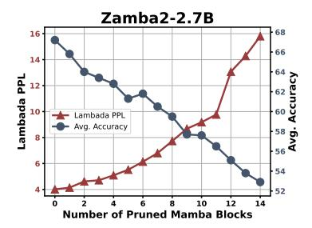
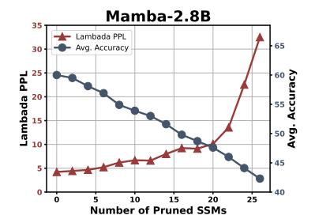
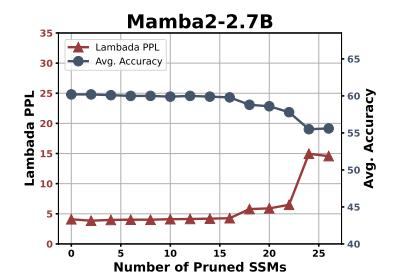
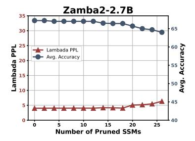

# <span id="page-2-0"></span>3 Methodology

Due to the large sizes of current state-of-the-art sequence models, Mamba-Shedder requires an efficient strategy to identify structures that can be removed without significantly affecting the model's accuracy. We approach this problem using a training-free approach, in which the least essential elements are considered for removal. Similar strategies have been explored in Transformer-based large language models [\(Ashkboos et al.,](#page-9-1) [2024;](#page-9-1) [Men](#page-11-3) [et al.,](#page-11-3) [2024;](#page-11-3) [Zhong et al.,](#page-11-4) [2024\)](#page-11-4). However, to our knowledge, no study explores the removal of structures in Selective Structured State Space models. Mamba-Shedder conducts structure removal of Mamba models and their hybrid variants at different granularities. As illustrated in the left of Figure [1,](#page-2-1) in the case of models with only Mamba blocks, we explore the iterative removal of entire Mamba blocks ([§2.1\)](#page-1-1), or their SSM subcomponents, either S6 or SSD modules depending on the version of Mamba (Figure [1\)](#page-2-1).

The proponents of the Mamba architecture do not provide a rationale for the number of Mamba blocks required to build robust models, opening an opportunity for Mamba-Shedder to investigate whether some components might be redundant and hence removed from the model with a minor impact in accuracy.

In addition to these components, in the case of hybrid models that also contain Transformer blocks (middle of Figure [1\)](#page-2-1), we also explore the removal of entire Transformer blocks or their subblocks: multilayer perceptrons (MLP) modules and multihead attention (MHA) modules. In hybrid models, Mamba-Shedder also explores the removal of structures at a finer granularity by targeting groups of channels in the MLP's linear layers, i.e., based on a channel group size, g, Mamba-Shedder explores the removal of ng channels, where n is the number of groups that could be removed based on their impact of the overall model performance.

#### <span id="page-2-2"></span>Algorithm 1 Block / Module Pruning

Input: Set of blocks/modulesMfrom a model m, Calibration dataset C, Metric ϕ, Target pruning steps t. Output: Pruned model m<sup>∗</sup>

```
1: for k ← 1 to t do
2: for all Mi ∈ M do
3: Si ← Importance(Mi, m, C, ϕ)
4: end for
5: Mmin ← arg minMi∈M Si
6: M ← M \ {Mmin} ▷ Block/Module Pruning
7: end for
8: return m∗ with the remaining blocks/modules in M
```

Algorithm [1](#page-2-2) details the procedure to remove en-

<span id="page-3-2"></span>> **[图片提取文字 (无描述)]:**
> Mamba-2.8B Lambada PPL Avg. Accuracy Lambada PPL AV9.85 Number of Pruned Mamba Blocks


> **[图片提取文字 (无描述)]:**
> Mamba2-2.7B Lambada PPL Avg. Accuracy Lambada PPL 58 BA Number of Pruned Mamba Blocks


> **[图片提取文字 (无描述)]:**
> Zamba2-2.7B Lambada PPL Lambada PPL 58 BA Avg. Accuracy Number of Pruned Mamba Blocks


Figure 2: Pruning Mamba blocks. *Avg. Accuracy* indicates the average accuracy for seven tasks. The model composed of Mamba 1 blocks (left) can tolerate the removal of entire blocks without significantly increasing its perplexity or decreasing accuracy compared to Mamba-2 and Zamba-2. In all three models, removing each Mamba block reduces 0.04B parameters from the model. These are *training-free* results, and drops in accuracy can be reduced by a subsequent fine-tuning stage (§4.5).

<span id="page-3-3"></span>

| Model       | Method                  | Num. of Pruned<br>Mamba Blocks | Ratio            | Lambada<br>PPL (↓)                              | Lambada      | HellaS       | PIQA         | ARC-e        | ARC-c        | WinoG        | OBQA         | Average                                       |
|-------------|-------------------------|--------------------------------|------------------|-------------------------------------------------|--------------|--------------|--------------|--------------|--------------|--------------|--------------|-----------------------------------------------|
|             | Dense                   | 0 / 64                         | 0%               | 4.23                                            | 69.2         | 66.1         | 75.2         | 69.7         | 36.3         | 63.5         | 39.6         | 59.9                                          |
| Mamba-2.8B  | Mamba Block Pruning     | 7 / 64                         | 10.43%           | $4.94_{+0.71}$                                  | 65.8         | 63.7         | 73.8         | 68.0         | 33.5         | 62.5         | 36.8         | 57.7.2.2                                      |
|             | Mailloa Block Fluilling | 14 / 64                        | 20.86%           | $7.51_{+3.28}$                                  | 58.9         | 57.6         | 71.0         | 62.7         | 32.0         | 61.1         | 33.2         | 53.8-6.1                                      |
|             | Dense                   | 0 / 64                         | 0%               | 4.10                                            | 69.7         | 66.6         | 76.4         | 69.6         | 36.4         | 64.0         | 38.8         | 60.2                                          |
| Mamba2-2.7B | Mamba Block Pruning     | 7 / 64                         | 10.42%           | 8.43+4.33                                       | 53.0         | 63.8         | 73.9         | 66.6         | 36.4         | 64.5         | 35.0         | 56.2.4.0                                      |
|             | Mailloa Block Fluilling | 14 / 64                        | 20.83%           | 11.53+7.43                                      | 47.0         | 59.4         | 71.1         | 60.6         | 35.6         | 60.8         | 35.0         | 52.8-7.4                                      |
|             | Dense                   | 0 / 54                         | 0%               | 4.01                                            | 69.7         | 77.0         | 79.8         | 77.5         | 48.5         | 72.1         | 45.8         | 67.2                                          |
| Zamba2-2.7B | Mamba Block Pruning     | 7 / 54<br>14 / 54              | 10.38%<br>20.77% | 6.80 <sub>+2.79</sub><br>15.8 <sub>+11.79</sub> | 58.9<br>44.3 | 69.7<br>62.8 | 77.0<br>72.7 | 69.8<br>54.3 | 39.6<br>34.5 | 67.0<br>64.3 | 41.8<br>37.2 | 60.5 <sub>-6.7</sub><br>52.9 <sub>-14.3</sub> |

Table 1: Detailed results of Mamba-Shedder with *training-free* Mamba block pruning. Lambada, HellaS, PIQA, ARC-e, ARC-c, WinoG, and OBQA represent their respective accuracies. <u>Underlined</u> numbers indicate the smallest average accuracy gap with the dense model under the same level of pruning.

tire structures, e.g., Mamba or Transformer blocks, MLPs, MHA, or SSM modules. Given a set  $\mathcal{M}$  of structures selected for potential removal, a proxy data set C and a metric  $\phi$  are used to measure the importance of an individual structure and the impact of removing it from the model (Zhong et al., 2024). In addition to entire structures, Mamba-Shedder follows the same logic to remove channel groups as detailed in Algorithm 2.

#### <span id="page-3-1"></span>**Algorithm 2** MLP Channel Pruning

**Input:** Set of MLP blocks  $\mathcal{M}_{\text{MLP}}$  from a model m, Calibration dataset  $\mathcal{C}$ , Metric  $\phi$ , Target pruning steps t, MLP channel group size q.

Output: Pruned model  $m^*$ 

```
1: for k \leftarrow 1 to t do

2: for all M_i \in \mathcal{M}_{\text{MLP}} do

3: S_i \leftarrow \text{Importance}(M_i[:,:-g], m, \mathcal{C}, \phi)

4: end for

5: M_{\min} = \arg\min_{M_i \in \mathcal{M}_{\text{MLP}}} S_i

6: M_{\min} = M_{\min}[:,:-g] \triangleright Channel Pruning

7: end for

8: return m^* with the altered MLP blocks in \mathcal{M}
```

Depending on the pruning objective, Mamba-Shedder might treat these pruning targets in isolation, but Section 4 also presents the results of configurations in which Mamba-Shedder sequentially prunes larger structures (e.g., Mamba blocks) and, at a later stage, smaller components, e.g., SSM modules in the remaining Mamba blocks. Future work will explore larger search spaces with more complex configurations of candidate structures for removal. For example, the importance of Mamba blocks and their SSM modules can be assessed in the same pruning iteration.

#### <span id="page-3-0"></span>4 Experiments

We evaluate Mamba-Shedder and study the removal of structures from SSM-based models utilizing several open-source models and datasets. We analyze their absolute and relative drop in accuracy and quantify the inference speedup obtained by the pruned models. Next, we discuss the resources utilized for our experiments and details of our setup and results.

#### 4.1 Models

Our experiments employed the following pretrained Mamba and hybrid models: Mamba-

<span id="page-4-7"></span>> **[图片提取文字 (无描述)]:**
> Mamba-2.8B Lambada PPL Avg. Accuracy Tampada PPL 10 Number of Pruned SSMs


> **[图片提取文字 (无描述)]:**
> Mamba2-2.7B Lambada PPL Avg. Accuracy eo 5 Lambada PPL Number of Pruned SSMs


> **[图片提取文字 (无描述)]:**
> Zamba2-2.7B Lambada PPL Lambada PPL Avg. Accuracy Number of Pruned SSMs


Figure 3: Pruning SSM (S6 and SSD modules). Mamba-2.8B and Mamba2-2.7B have 64 SSM modules, while Zamba2-2.7B has 54 SSM (SSD) modules. *Avg. Accuracy* is for the seven tasks evaluated.

<span id="page-4-6"></span>

| Model         | Method      | Num. of<br>Pruned SSMs | Lambada<br>PPL (↓) | Lambada | HellaS | PIQA | ARC-e | ARC-c | WinoG | OBQA | Average              |
|---------------|-------------|------------------------|--------------------|---------|--------|------|-------|-------|-------|------|----------------------|
|               | Dense       | 0 / 64                 | 4.23               | 69.2    | 66.1   | 75.2 | 69.7  | 36.3  | 63.5  | 39.6 | 59.9                 |
| Mamba-2.8B    |             | 16 / 64                | 9.23+5.00          | 55.2    | 52.1   | 68.1 | 57.8  | 28.4  | 55.6  | 31.6 | 49.8.10.1            |
| Mamba-2.6D    | SSM Pruning | 20 / 64                | $10.10_{+5.87}$    | 57.1    | 48.2   | 65.5 | 50.9  | 25.9  | 56.0  | 29.4 | 47.6-12.3            |
|               |             | 24 / 64                | 22.55+18.32        | 44.4    | 43.2   | 64.4 | 47.4  | 25.8  | 53.6  | 29.8 | 44.1.15.8            |
|               | Dense       | 0 / 64                 | 4.10               | 69.7    | 66.6   | 76.4 | 69.6  | 36.4  | 64.0  | 38.8 | 60.2                 |
| Mamba2-2.7B   | SSM Pruning | 16 / 64                | $4.26_{+0.16}$     | 66.9    | 66.1   | 76.4 | 68.6  | 37.2  | 64.0  | 39.2 | 59.8-0.4             |
| Maiiiba2-2.7B |             | 20 / 64                | $5.89_{+1.79}$     | 59.8    | 66.0   | 76.1 | 68.9  | 36.7  | 63.6  | 39.2 | 58.6-1.6             |
|               |             | 24 / 64                | $14.95_{+10.85}$   | 43.4    | 65.8   | 74.8 | 67.1  | 36.6  | 62.9  | 38.0 | 55.5 <sub>-4.7</sub> |
|               | Dense       | 0 / 54                 | 4.01               | 69.7    | 77.0   | 79.8 | 77.5  | 48.5  | 72.1  | 45.8 | 67.2                 |
| Zamba2-2.7B   |             | 16 / 54                | $4.14_{+0.13}$     | 69.2    | 75.8   | 79.2 | 75.8  | 46.5  | 72.2  | 45.8 | 66.4 <sub>-0.8</sub> |
|               | SSM Pruning | 20 / 54                | 5.07+1.06          | 64.2    | 75.8   | 79.3 | 75.5  | 46.2  | 73.2  | 46.0 | 65.7-1.5             |
|               |             | 24 / 54                | 5.46+1.45          | 62.3    | 74.7   | 79.0 | 75.4  | 44.3  | 70.9  | 46.4 | 64.7 <sub>-2.5</sub> |

Table 2: Detailed results of Mamba-Shedder with *training-free* SSM pruning. The remaining tasks represent their respective accuracy. Here, we do not consider the pruning ratio, as the number of SSM's parameter weights is small. Its benefit is the reduction of computational overhead. <u>Underlined</u> numbers indicate the smallest gap with Dense under the same level of pruning.

**2.8b** (Gu and Dao, 2023), consists of 64 S6 blocks<sup>1</sup>. Mamba2-2.7b (Dao and Gu, 2024), consists of 64 SSD blocks <sup>2</sup>. Both Mamba models were trained on 300B tokens on the Pile dataset (Gao et al., 2020). For our choice of a hybrid model, we explored **Zamba2-2.7B** (Glorioso et al., 2024)<sup>3</sup>. It has 54 layers, including 45 single Mamba-2 Blocks and 9 hybrid layers composed of both Mamba-2 Blocks and Transformer Blocks. Zamba-2 was trained on 3T tokens from open web datasets, including Zyda (Tokpanov et al., 2024), and subsequently annealed with 100B additional tokens. The aforementioned models are all of the same size and can be compared directly. For Mamba models of different sizes, we also explored Falcon-Mamba-7B (Zuo et al., 2024)<sup>4</sup>, which is based on the Mamba-1 architecture and is the best-performing Mamba model at this scale in the literature, as well as Hymba-**1.5B-Base** (Dong et al., 2024)<sup>5</sup>, which features a

hybrid architecture incorporating both Mamba and Attention heads.

#### 4.2 Datasets

Following the language modeling evaluation of Mamba (Gu and Dao, 2023; Dao and Gu, 2024), we utilize *lm-eval-harness* (Gao et al., 2023) to assess the zero-shot performance, which includes measuring perplexity on Lambada (Paperno et al., 2016), and accuracy on the following downstream tasks: HellaSwag (Zellers et al., 2019), Physical Interaction Question Answering (PIQA) (Bisk et al., 2020), AI2 Reasoning Challenges (Arc-e, Arc-c) (Clark et al., 2018), Large-scale Winograd Schema Challenge (WinoGrande) (Sakaguchi et al., 2021), and the Open Book Question Answering (Mihaylov et al., 2018) dataset.

Regarding the calibration dataset, we follow BlockPruner (Zhong et al., 2024) in using the Alpaca dataset <sup>6</sup> as the calibration dataset and employ perplexity as the metric for calculating importance scores. All the hyperparameters used in our experi-

<span id="page-4-0"></span><sup>&</sup>lt;sup>1</sup>https://huggingface.co/state-spaces/mamba-2.8b

<span id="page-4-1"></span><sup>&</sup>lt;sup>2</sup>https://huggingface.co/state-spaces/mamba2-2.7b

<span id="page-4-2"></span><sup>&</sup>lt;sup>3</sup>https://huggingface.co/Zyphra/Zamba2-2.7B

<span id="page-4-3"></span><sup>&</sup>lt;sup>4</sup>https://huggingface.co/tiiuae/falcon-mamba-7b

<span id="page-4-4"></span><sup>&</sup>lt;sup>5</sup>https://huggingface.co/nvidia/Hymba-1.5B-Base

<span id="page-4-5"></span><sup>&</sup>lt;sup>6</sup>https://github.com/tatsu-lab/stanford\_alpaca

ments are detailed in the Appendix.

#### 4.3 Results

#### 4.3.1 Pruning Target: Mamba Block

This section explores the impact of pruning Mamba blocks on model performance. Figure [2](#page-3-2) and Table [1](#page-3-3) present the results of applying Mamba-Shedder to Mamba-2.8B, Mamba2-2.7B, and Zamba2-2.7B models with a focus on removing redundant entire Mamba blocks. The model that utilizes the first version of Mamba blocks (S6) appears to tolerate a higher number of removed blocks without significantly affecting its performance. Specifically, the Mamba-2.8B model demonstrates robustness, with its perplexity (PPL) increasing from 4.23 to 7.51 and average accuracy dropping from 59.9 to 53.8 when the pruning ratio reaches 20.86%. In contrast, the Mamba2-2.7B and Zamba2-2.7B models exhibit more significant performance degradation, although they performed better before pruning (Dense). The poorer pruning performance of Zamba2-2.7B may be attributed to the pruning of Mamba blocks disrupting a certain balance within the hybrid layers. Overall, the effects of Mamba block pruning vary across different models, depending on the model architecture and the characteristics of the pre-training stage. In this round, Mamba-1 comes out on top.

#### <span id="page-5-0"></span>4.3.2 Pruning Target: SSM Module

In this section, we delve into assessing the impact of pruning only the SSM modules within Mamba blocks on the performance of various models, as illustrated in Table [2](#page-4-6) and Figure [3.](#page-4-7) When using the same target in Mamba-2.8B, we observe that further pruning SSMs results in a noticeable increase in perplexity, soaring to 22.55 and decreasing average accuracy to 44.1. This result indicates a significant sensitivity to SSM pruning for Mamba-1, where performance degradation is pronounced even at moderate pruning levels. Conversely, Mamba2-2.7B and Zamba2-2.7B exhibit remarkable resilience to SSM pruning. Even with 24 SSMs pruned, the model maintains a relatively stable performance. This robustness suggests that Mamba-2 blocks can tolerate higher SSM module pruning, potentially due to Mamba-2's optimizations or different training strategies with Mamba-1. The Zamba2-2.7B model, with the hybrid architecture, outperforms both Mamba-1 and Mamba-2. Pruning 12 out of its 54 SSMs results in a negligible PPL increase from 4.01 to 4.02, while the average

accuracy slightly decreases from 67.2% to 67.0%. The hybrid nature of Zamba2-2.7B may contribute to its ability to maintain performance despite SSM pruning. Overall, these findings underscore the importance of model architecture and training strategies in determining the impact of SSM pruning. They offer valuable insights for optimizing model efficiency without compromising performance. In this round, the model with Mamba-2 blocks comes out on top.

