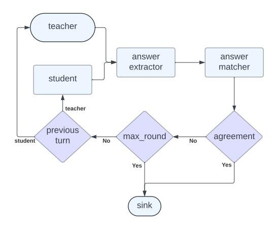
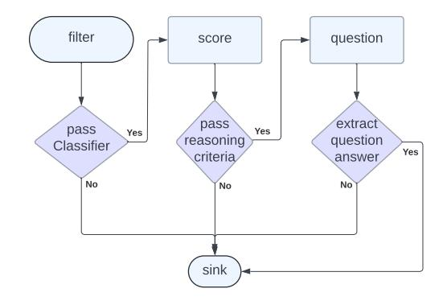
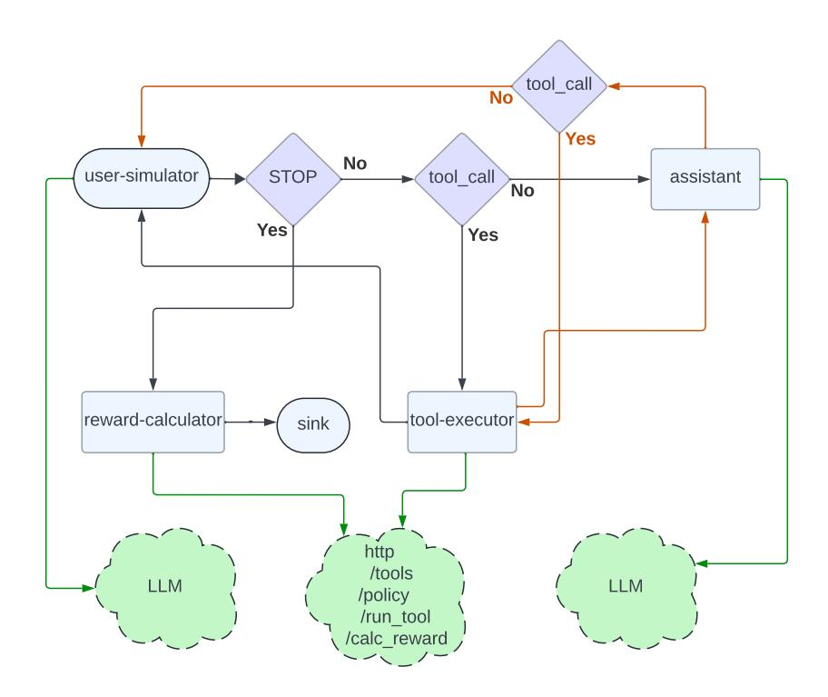

# 4 Agent Environment Design for Matrix

This section describes the system's internal design, including its orchestration model, distributed service layer, parallelism strategies, scheduling policies, fault tolerance mechanisms and network bandwidth optimization.

## 4.1 P2P Orchestration

As illustrated in Figure [2a,](#page-5-0) centralized orchestration must manage execution order (control flow), message passing (data flow), and the full lifecycle of requests and responses for LLMs and containerized environments. Handling all of this for tens of thousands of concurrent workflows quickly becomes a scalability bottleneck. Matrix addresses this by representing workflows as serializable orchestrators that can be updated and exchanged

<span id="page-5-0"></span>> **[图片提取文字 (无描述)]:**
> Centralized Agent Environment Agent Workflows Orchestrator Agent1 Agent2 LLM Input or Output Container


> **[图片提取文字 (无描述)]:**
> P2P Agent Environment Driver Node Ray Node 1 orchestrator create Agent1 orchestrator orchestrator Ray Node 3 Ray Node 2 Sink Agent2 orchestrator LLM Input or Output Container


(a) Traditional centralized orchestration.

(b) P2P Orchestration in Matrix.

Figure 2 Compare Centralized vs P2P Orchestration.

among distributed agents (Figure [2b\)](#page-5-0). The driver, which runs the generation framework, plays a lightweight role: it simply publishes an orchestrator to start a task, enabling an asynchronous initiation model. Agents equipped with LLMs and tools consume messages, perform local actions, update both control and data states, and forward the updated orchestrator to the next agent. Execution continues until the orchestrator signals completion, at which point a designated sink collects the final message and persists it to the output dataset. Using P2P orchestration, Matrix avoids bottlenecks, improves scalability, and enables fully asynchronous execution among agents.

## 4.2 Distributed Services

Matrix offloads computationally intensive tasks to distributed services, allowing them to scale independently of the agents. For LLM inference, Matrix employs gRPC-based communication to avoid HTTP overhead. Because the Ray head node can become network-bound, Matrix maintains a local cache of active model replica URLs, enabling direct load-balanced traffic through worker nodes. Sticky routing can reuse prefix cache for multi-turn long conversations. In addition to Huggingface models, proxies are built for commercial LLM API services. For stateful services such as Apptainer containers, agents acquire containers by ID to be able to route multiple commands to the same container instance, rather than a randomly selected one. This is managed via a resource pool and a registry that maps container IDs to Ray actors running the corresponding containers. This design allows agents to efficiently route messages and reuse shared resources.

## 4.3 Parallel Execution Strategies

Matrix supports multiple forms of parallelism to maximize scalability and cluster utilization.

- Data parallelism. Similar to distributed processing systems such as Spark [Zaharia et al.](#page-18-5) [\(2012\)](#page-18-5) and Ray Data [Moritz et al.](#page-17-2) [\(2018\)](#page-17-2), Matrix can partition large input datasets consisting of many small files for independent processing. For multi-file inputs, Matrix automatically distributes files across partitions. Datasets containing a few large files can be preprocessed into smaller shards to enable higher parallelism.
- Task parallelism. Multiple generation tasks can execute concurrently using asynchronous programming, threads, or processes. Matrix adopts an asyncio-based model: the driver initializes orchestrators, and agents process tasks asynchronously. Since computationally heavy operations are offloaded to distributed services, lightweight agents can handle tens of thousands of concurrent tasks efficiently without I/O blocking.
- Agent parallelism. Each agent role is implemented as Ray actors with configurable CPU, GPU, and memory allocations. Roles can scale horizontally by launching multiple distributed agent instances,

each processing assigned tasks independently. Ray system distributes these actors across cluster nodes, enabling each role to scale without the resource contention commonly seen in centralized orchestration.

For LLM-based agents, computational cost dominates over input pipeline overhead. Usually data loading is not a bottleneck (one exception is the NaturalReasoning task in Section [5.2\)](#page-9-0). Matrix's peer-to-peer architecture and distributed services ensure efficient utilization of cluster resources even with moderate data and agent-level parallelism. This efficiency arises from Matrix's ability to run tens of thousands of asynchronous tasks concurrently, each processing one data item independently.

## 4.4 Row-Level Scheduling

In batch processing systems, such as Ray Data, tasks are grouped into fixed-size batches and executed by actors. While this approach can reduce per-task scheduling overhead for homogeneous workloads, it introduces inefficiencies when tasks have variable computational demands or diverging control flows. A long-running or complex task within a batch can keep the current batch running and stall the execution of subsequent batches, creating idle resources and underutilized GPUs. We refer to this phenomenon as batch-level scheduling.

In contrast, Matrix schedules each task independently as soon as prior tasks complete, a mechanism called row-level scheduling. Each orchestrator message representing a single task flows through the P2P agent network. This design eliminates the bubble effects inherent in batch processing, achieves higher GPU utilization, and reduces end-to-end latency for heterogeneous, multi-agent workloads. Row-level pipelining, combined with distributed services and asynchronous agent execution, is a key factor in Matrix's scalability and efficiency for large-scale data synthesis tasks.

## <span id="page-6-0"></span>4.5 Agent Fault Tolerance

Matrix currently provides at-most-once execution semantics. Tasks may fail for various reasons, including network errors, timeouts, and actor crashes. Failed tasks can be collected from the output dataset and re-run offline if needed. Matrix workflows are implemented by extending a base agent class, and use-case-specific logic may introduce bugs that crash an agent. Ray can restart crashed agent actors, however, any in-flight orchestrator messages that were dequeued by the crashed agent are not recoverable under at-most-once semantics. To track in-flight orchestrators and surface failures reliably, Matrix uses per-role message brokers. All agents of the same role share a broker, and all incoming and outgoing orchestrator messages for that role are routed through it. Each broker maintains (i) an incoming queue of orchestrators waiting to be processed and (ii) an assignment map that records which orchestrators are currently assigned to which agent instance. The broker dispatches orchestrators to agents in a round-robin manner. After an agent finishes processing an orchestrator, it returns the updated orchestrator to the broker, the broker then removes the corresponding entry from the assignment map and forwards the orchestrator to the next role's broker. When an agent crashes and is restarted by Ray, it re-registers with its broker. The broker detects that the previous instance has died, marks all orchestrators assigned to that instance as failed based on the assignment map, and forwards them to the sink for persistence as failed trajectories. With this design, use-case-specific agents can crash and restart without halting the system, as long as the brokers and sink remain available. Brokers and the sink are framework components (not customized per use case), and we rely on them for reliability. If a broker or the sink fails, the generation job terminates. To mitigate transient network issues, Matrix uses retries for communication between agents, brokers and sink.

## <span id="page-6-1"></span>4.6 Message Offloading

The orchestrator is serialized and exchanged among agents. As shown in Algorithm [1,](#page-4-0) its history field stores inter-agent conversations, which can be large. A common optimization is to offload this history to an external cache such as Redis. While this reduces orchestrator size, it simply shifts network traffic from occurring between agents to occurring between agents and the cache. Since the history is frequently updated and used for constructing LLM prompts, the total network bandwidth can actually double because each agent must retrieve, update, and store the complete history every turn.

Matrix instead retains the history structure within the orchestrator, while storing large conversation content that exceed a configurable size threshold in Ray's distributed object store. The history holds only the object identifiers, and content is retrieved on demand. Objects are immutable once stored, and all history-related objects are deleted when the orchestrator signals completion. This design keeps the orchestrator compact, reduces redundant transfers, and minimizes network load. Section 5.3.1 quantifies these benefits experimentally.

## 4.7 System Debugging

Debugging distributed systems is challenging, especially under peer-to-peer message passing. Matrix relies on structured logging and trajectory recording for debuggability. Ray streams actor logs back to the driver process, enabling a "local-like" debugging experience even when agents are distributed across the cluster. Matrix also records a full trajectory for each input task. When a task encounters an issue, the trajectory includes the relevant error context for offline analysis (e.g., timeouts, connection failures, and service errors). For unexpected exceptions, including agent implementation bugs, each agent runs an asyncio event loop and tracks pending futures. Unhandled exceptions propagate to the corresponding future. Matrix then marks the orchestrator as failed and routes it to the sink, which persists the failed trajectory to the output dataset. Users can subsequently filter failed trajectories and re-run them if needed.

## 5 Experiments

We evaluate Matrix across three case studies on synthetic data generation. Together, these experiments demonstrate the framework's scalability, robustness, and adaptability to diverse workloads. In this section, the terms "Matrix" and "P2P-agent" are used interchangeably to refer to the same framework.

#### 5.1 Collaborative Reasoner (Coral)

Collaborative Reasoner (Coral) Ni et al. (2025a) evaluates and improves multi-agent collaborative reasoning in LLMs through dialogue-driven tasks. Unlike single-agent evaluations, Coral requires two agents to discuss, disagree, and reach consensus over multi-turn interactions. Scalable training data is generated via self-collaboration, where an LLM plays both roles. In this work, we adopt the same agent setup, implemented as distributed agents in Figure 3.

<span id="page-7-0"></span>> **[图片提取文字 (无描述)]:**
> teacher answer answer extractor matcher student teacher previous max\_round agreement student turn No No Yes Yes sink


> **[图片提取文字 (无描述)]:**
> collaborative-reasoner p2p\_agent Data Generated Per Minute Max Concurrency


Figure 3 P2P-agents for Collaborative Reasoner.

Figure 4 Scalability of P2P-agents vs Coral baseline.

We directly compare Matrix to the official Collaborative Reasoner implementation Ni et al. (2025b) as the baseline. Both systems use asyncio for concurrency. The baseline framework uses a single orchestrator to coordinate thousands of concurrent generation tasks, while Matrix distributes coordination responsibilities across agents in a peer-to-peer fashion. To compare the two, we run the same number of MMLU-Pro questions by changing the number of A100 nodes, and in both cases use Llama-3.1-8B-Instruct Grattafiori et al. (2024) as the underlying language model for all agents. Task concurrency is adjusted according to the number of A100 nodes as  $50 \times N_{GPU}$ , leveraging all 8 GPUs per node with 50 concurrent queries per GPU. As shown in Figure 4, the Matrix implementation scales almost linearly as more GPU nodes are added, while the

centralized orchestration approach of the baseline system becomes a bottleneck and plateaus due to the overhead of scheduling a large number of asynchronous tasks from a single control point.

Large-Scale Results. We further tested both systems on 31 A100 nodes (248 GPUs) using LLaMA-3.1-8B-Instruct. For P2P-agent, we set the concurrency to 248 × 50 ≡ 12, 400, while Coral was configured with its optimal concurrency of 5,000 based on Figure [4.](#page-7-0) As shown in Table [1,](#page-8-0) P2P-agent generates 2B tokens in 4 hours, achieving 6.8× higher throughput than the official Coral implementation on the same hardware. Importantly, both systems attain nearly identical agreement correctness, the metric used to measure data quality, consistent with Coral's reported result of 0.456 for LLaMA-3.1-8B-Instruct [Ni et al.](#page-17-3) [\(2025a\)](#page-17-3).

<span id="page-8-0"></span>Table 1 P2P-Agent achieves 6.8× higher token throughput than Coral baseline.

| Metric                | Coral Baseline | P2P-Agent     |
|-----------------------|----------------|---------------|
| Runtime               | 9:03:22        | 4:17:05       |
| Concurrent tasks      | 5,000          | 12,400        |
| Total trajectories    | 300k           | 1 Million     |
| Agreement correctness | 0.4732         | 0.4778        |
| Tokens generated      | 616,759,036    | 2,002,025,810 |
| Tokens per second     | 18,917         | 129,833       |

#### 5.1.1 Overhead Analysis

We analyze system performance to identify overhead and potential bottlenecks in Matrix. Unless otherwise noted, experiments use 8 H100 nodes (64 GPUs) to generate 200k Coral trajectories.

Latency breakdown. We find that Matrix incurs minimal queuing and orchestration overhead at scale. We instrument end-to-end task latency and attribute it to: (i) agent processing, (ii) queuing delay, and (iii) task initialization. Table [2](#page-8-1) reports the breakdown over all trajectories, and Table [3](#page-8-1) reports the breakdown for the slowest 10% of trajectories. For typical trajectories, agent processing accounts for ∼80% of end-to-end latency and queuing is negligible. For the slowest trajectories, processing dominates even more (∼99%).

<span id="page-8-1"></span>Table 2 Latency breakdown.

| Stage            | Median  | P90    | P99    |
|------------------|---------|--------|--------|
| Agent processing | 80.12%  | 99.30% | 99.92% |
| Queuing          | 0.0289% | 0.851% | 5.73%  |
| Initialization   | 0.0051% | 1.18%  | 7.34%  |

Table 3 Latency breakdown for slow tasks.

| Stage            | Median    | P90    | P99    |
|------------------|-----------|--------|--------|
| Agent processing | 99.72%    | 99.92% | 99.97% |
| Queuing          | 0.00172%  | 0.025% | 0.093% |
| Initialization   | 0.000005% | 0.034% | 0.128% |

Network bandwidth We estimate the network bandwidth required to transmit orchestration messages. Under the Coral workload, peer-to-peer orchestration generates 2.26M serialized messages and consumes ∼1.6 MB/s of network bandwidth (median ∼1.63 MB/s; P99 ∼3.47 MB/s), indicating that orchestration traffic is modest relative to cluster network capacity.

Bottleneck study To isolate Matrix runtime overhead from model inference cost, we construct dummy Coral agents that do not invoke an LLM and instead return pre-formatted text by concatenation. We ensure that the synthetic responses match the expected response lengths and turn structure, yielding a "best-case compute" setting that exposes runtime bottlenecks. In this configuration, the system sustains ∼1.1k trajectories/s and processes 12k orchestration messages per second. The corresponding estimated network bandwidth for orchestration is ∼77.9 MB/s (median ∼82.9 MB/s; P99 ∼97 MB/s). As shown in Table [4,](#page-9-1) agent processing drops to ∼37% of end-to-end latency, task initialization becomes visible, and queuing remains small. The remaining overhead likely comes from RPC, serialization, and network costs. While this experiment suggests a limit of roughly 12k orchestration messages/s per run, Matrix can exceed this throughput via data parallelism, as discussed in Section [5.2.](#page-9-0)

<span id="page-9-1"></span>Table 4 Latency breakdown of dummy agents without real compute.

| Stage            | Median | P90    | P99    |
|------------------|--------|--------|--------|
| Agent processing | 36.72% | 62.81% | 82.63% |
| Queuing          | 0.074% | 1.13%  | 6.95%  |
| Initialization   | 0.768% | 10.72% | 24.51% |

#### 5.1.2 Actor Crash Recovery

We evaluate robustness by generating 200k Coral trajectories under two settings: (i) no faults, and (ii) injected faults where we randomly kill an agent actor every 12 minutes. Under the at-most-once semantics described in Section [4.5,](#page-6-0) killing an actor may drop any in-flight orchestrators assigned to it, we therefore report the number of lost tasks. As shown in Table [5,](#page-9-2) actors are killed 7 times and each time Ray restarts them within seconds on average. Table [6](#page-9-2) shows that approximately 2% of tasks are lost in the fault-injection setting, while throughput decreases by only 5%.

<span id="page-9-2"></span>Table 5 Coral actors restarts.

| Agent                            | Restarts | Duration | Lost Tasks |
|----------------------------------|----------|----------|------------|
| answer                           | 2        | 0.322    | 424        |
| _extractor<br>answer<br>_matcher | 2        | 0.000    | 2          |
| student                          | 1        | 2.304    | 1474       |
| teacher                          | 2        | 2.069    | 2180       |

Table 6 Impact of agent restarts.

| Metric                | No Crash    | With Crash  |
|-----------------------|-------------|-------------|
| Runtime               | 1:26:16     | 1:18:43     |
| Total trajectories    | 200k        | 200k        |
| Lost trajectories     | 0           | 4080        |
| Agreement correctness | 0.4781      | 0.4856      |
| Tokens generated      | 391,200,916 | 340,338,986 |
| Tokens per second     | 75,579      | 72,059      |

## <span id="page-9-0"></span>5.2 NaturalReasoning

NaturalReasoning [Yuan et al.](#page-18-6) [\(2025\)](#page-18-6) is a large-scale dataset designed to advance the reasoning capabilities of LLMs across diverse domains, including STEM, Economics, and Social Sciences. It contains 2.8M challenging questions generated automatically by LLMs. These questions are extracted and synthesized from pretraining corpora, ensuring high diversity and difficulty. Models fine-tuned on NaturalReasoning demonstrate improved sample efficiency and reasoning accuracy compared to prior datasets. In this experiment, we use Matrix to curate a NaturalReasoning-style dataset from raw web documents. This workflow stresses Matrix in a different regime than multi-turn dialogue: most inputs are filtered out early, while the remaining fraction triggers expensive downstream processing. The curation pipeline consists of three agents, as illustrated in Figure [5:](#page-10-0)

- Filter: English-language web documents are identified, and a fine-tuned LLaMA-3.1-3B-Instruct model classifies whether a document contains reasoning content. The classifier is trained on a subset of NaturalReasoning examples as positives and randomly sampled web documents as negatives.
- Score: Each document is evaluated along multiple quality axes using LLaMA-3.3-70B-Instruct, following prompts derived from the original NaturalReasoning methodology.
- Question: Questions are extracted from the filtered web documents, reference answers are identified when available, and independent reasoning steps leading to a final answer are generated, all using LLaMA-3.3-70B-Instruct. Optionally, we grade the extracted answer and check its consistency against the independently generated answer to further filter low-quality examples.

> **[图片提取文字 (无描述)]:**
> filter question score extract pass pass Yes Yes reasoning question Classifier Yes criteria answer No No No sink


| Filter step               | Percentage |
|---------------------------|------------|
| filter_by_en              | 3.68       |
| filter_by_classifier      | 90.24      |
| filter_by_score           | 0.44       |
| filter_by_no_boxed_answer | 0.19       |
| success                   | 5.45       |

<span id="page-10-0"></span>Figure 5 P2P-agents for NaturalReasoning data curation.

<span id="page-10-1"></span>**Table 7** Filtering statistics on 25M DCLM web documents.

For large-scale curation, we process up to 25M web documents from DCLM Li et al. (2025). The 3B filter model is efficient because most documents are rejected with a single-token (Yes/No) output. Overall, 5.45% of documents pass all filters, yielding approximately 1M high-quality reasoning questions and answers (Table 7).

#### 5.2.1 Evaluating Parallelism and Throughput

Using a 500k DCLM subset, we evaluate the impact of the three types of parallelism supported by Matrix represented as a tuple (data parallelism, task parallelism, and agent parallelism) in Table 8. We deployed 32 A100 nodes with 8 GPUs each. The fine-tuned 3B model was replicated 32 times, while the 70B model used 56 replicas. We set the maximum concurrent tasks to be 14k. The estimated concurrent requests per 70B replica is  $14k \times (1-3.68\%-90.24\%) \div 56 \approx 15$ , which can maintain high GPU utilization without introducing long latencies or timeouts. The 3B model in Filter agents are not the bottleneck even though they handle 97% of the data after English filter.

<span id="page-10-2"></span>Table 8 P2P-agent throughput for 500k webdoc.

| Settings Name | Three Parallelisms | Normalized Throughput |
|---------------|--------------------|-----------------------|
| 1             | (1, 14000,1)       | 1                     |
| 2             | (20, 700, 1)       | 1.61                  |
| 3             | (240, 1, 1)        | 0.38                  |
| 4             | (240, 50, 1)       | 1.43                  |
| 5             | (1, 14000, 2)      | 1.03                  |
| 6             | (1, 14000, 10)     | 0.91                  |

**Data parallelism.** The first two settings present the results for data parallelism. In Setting 1, although the system was configured to allow up to 14k concurrent tasks, only about 700 were observed during the experiment, which is well below the target concurrency. This shortfall occurs because 93% of the input documents are filtered out early (Table 7), so that the input pipeline can not keep up with the Filter agent. To address the input bottleneck, we increased data parallelism by splitting the dataset into 20 partitions for Setting 2. This raises the effective concurrency to  $20 \times 700 \equiv 14k$ , matching our target. This adjustment yields a  $1.61 \times$  speedup, demonstrating how data parallelism helps alleviate the input pipeline bottleneck. Increasing the number of partitions beyond 20 provides little additional benefit, since task-level parallelism within each partition already saturates the GPUs.

**Task parallelism.** Comparing Settings 3 and 4, running 50 concurrent tasks per data partition yields a  $3.8 \times$  speedup compared to single-task execution, even with 240 data partitions. This result shows that increasing asynchronous task concurrency is more effective than simply creating a larger number of data partitions. Moreover, further increasing data parallelism would require additional agent instances, which in turn demands more CPU resources.

Agent parallelism. Comparing Settings 1 and 5, doubling the number of agent instances (excluding the sink) results in a modest throughput gain; while Setting 6 shows further increasing agent instances has no benefits. This is because LLM inference is handled by Ray Serve, agents remain I/O-bound. While increasing the number of instances offers limited benefit for the NaturalReasoning workflow, Matrix can efficiently scale agent instances when agents perform heavier CPU or GPU computations, highlighting the framework's flexibility and readiness for diverse workloads.

Although the design space of the three kinds of parallelism can be huge, our setup prefers 14k max concurrency given the number of GPUs. We further determined 700 as the maximum achievable asyncio task concurrency per data partition. Moreover, increasing data partitions beyond 20 or increasing agent parallelism beyond 2 has small effect on throughput. Because of the peer-to-peer architecture, task parallelism alone often achieves high resource utilization. Therefore, small degrees of data and agent parallelism are typically sufficient as the initial configuration for new use cases.

#### 5.2.2 Impact of Scheduling Granularity

We compare Matrix's row-level scheduling to a batch-level baseline implemented with Ray Data (Algorithm [2\)](#page-11-0). We emphasize that Ray Data is a general-purpose batch processing engine designed primarily for data-parallel ETL and batched model inference. Our goal in this comparison is not to claim that Ray Data is an optimized framework for agentic workflows, but to use it as a representative and widely used batch-oriented alternative for practitioners building scalable LLM-calling pipelines on Ray.

In the Ray Data baseline, each batch is processed by a Ray actor BatchProcessing (Lines 1–12), which launches multiple asynchronous tasks to process rows concurrently (Line 8). Each task executes an agentic workflow (Lines 10–12) that is functionally similar to the P2P-agent logic, except that (i) all agents are co-located within the same actor process and (ii) orchestration is implemented within the batch processor rather than being carried by peer-to-peer messages.

This baseline removes the single centralized orchestrator bottleneck and distributes orchestration across many CPU workers, each responsible for one batch. However, because multi-agent workflows have data-dependent control flow (e.g., branching, retries, early termination, and variable numbers of steps), conventional batchinference optimizations are difficult to apply: different rows within a batch may invoke different agents and different numbers of LLM/tool calls. As a result, even under Ray Data, each row must effectively be executed as an independent asynchronous workflow, and the batch mainly serves as a scheduling container rather than enabling true batched execution of LLM calls.

#### <span id="page-11-0"></span>Algorithm 2: Pseudo-code of Ray Data Baseline.

```
1 @ray.remote
2 class BatchProcessing: # base class to run as a Ray actor
3 def __call__(self, batch):
4 async def _process_batch(rows):
5 tasks = [self.process(row) for row in rows]
6 return await asyncio.gather(*tasks) # use asyncio to process all tasks in the batch
8 return asyncio.run(_process_batch(batch))
10 async def process(self, row: Dict[str, Any]): # base class method to be overwritten for each use case
11 """abstract␣method␣to␣process␣one␣input␣task"""
12 pass
14 ds = ray.data.read_json(data_dir) # read input jsonl files into Ray data
15 output = ds.map_batches( # split input to batches for concucurrent processing
16 BatchProcessing,
17 batch_size=cfg.batch_size,
18 num_cpus=1,
19 concurrency=cfg.data_parallelism # max number of batches to run concurrently
20 )
```

Large-Scale Results. We then compare Matrix P2P-agent with the Ray Data baseline to run large scale curation over DCLM up to 25M web documents. Both setups utilize the same GPU resources and 14k concurrent tasks. For the P2P-agent configuration, we adopt Setting 2, i.e., (20, 700, 1), from Table [8.](#page-10-2) For the Ray Data baseline, we use Setting 4, i.e., (240, 50, 1). Through experiment, Setting 2 with 700 as batch size would result in peaks and valleys in GPU requests, the smaller batch size of 50 in Setting 4 can smooth GPU requests. The two setups have similar throughputs in P2P-agent experiment and the latter fits Ray Data based implementation.

Each setup is executed for over 10 hours, measuring token throughput. Results in Table [9](#page-12-0) show that P2Pagent achieves 2.1× higher token throughput than the batch-level baseline. The efficiency gap stems from scheduling granularity: in batch-level scheduling, a new batch cannot begin until all tasks in the current batch complete. Due to control divergence and variable task length, a few slow tasks in a batch block downstream processing, creating idle GPU time. In contrast, row-level scheduling in P2P-agent allows each completed row to immediately trigger the next task without waiting for others, fully utilizing compute resources. Similar behaviour has been observed in LLM inference systems, where "continuous batching" or token-level scheduling can replace completed requests dynamically to avoid idle slots and maintain high throughput.

<span id="page-12-0"></span>Table 9 P2P-Agent achieves 2.1× higher token throughput than Ray Data baseline.

| Metric              | Ray Data Baseline | P2P-Agent   |
|---------------------|-------------------|-------------|
| Runtime             | 12:57:28          | 17:57:55    |
| Concurrent tasks    | 14,000            | 14,000      |
| Webdoc processed    | 9.3M              | 25M         |
| Questions generated | 410,755           | 1,192,799   |
| Tokens generated    | 129,622,944       | 378,591,258 |
| Tokens per second   | 2,778             | 5,853       |

In Ray Data, decreasing the batch size can partially mitigate idle time. However, each concurrent batch requires a dedicated actor and CPU allocation. Maintaining the same level of task concurrency at smaller batch sizes therefore demands higher data parallelism, which introduces substantial CPU overhead. Moreover, batch-level scheduling incurs additional costs for batch creation and actor management, further compounding inefficiency. Overall, these results demonstrate that fine-grained, row-level scheduling enables more efficient scaling for multi-agent, dynamically controlled workflows than batch-level scheduling in traditional distributed data processing engines.

## 5.3 Tau2-bench

Tau2-bench [Barres et al.](#page-15-6) [\(2025a\)](#page-15-6) is a recently introduced benchmark for evaluating conversational agents in dual-control environments, where both an AI agent and a user simulator interact with a shared environment through tools and APIs. In this experiment, we use Tau2-bench to generate task-solving trajectories for realworld customer support or troubleshooting in the telecom domain. Following prior work such as Kimi K2 [Bai](#page-15-2) [et al.](#page-15-2) [\(2025\)](#page-15-2) and AgentBank [Song et al.](#page-18-15) [\(2024\)](#page-18-15), these trajectories—after filtering and reward validation—can serve as post-training data to enhance LLM reasoning and tool-use performance.

P2P-Agent Implementation. Matrix implements Tau2-Bench as a distributed P2P-agent workflow comprising four functional agents and one orchestrator (Figure [6\)](#page-13-0).

- User-simulator: Represents the human user, initiating and responding to the tau2-agent's queries.
- Assistant: Acts as the assistant agent, performing reasoning and tool-use steps.
- Tool-executor: Executes HTTP-based tool calls issued by either the user or assistant. Tool APIs are adapted from the official Tau2-agent implementation [Barres et al.](#page-15-10) [\(2025b\)](#page-15-10) and deployed in distributed containers to enable concurrent execution and isolation.
- Reward-calculator: Validates each trajectory by replaying all tool calls from the initial state and computing task-specific rewards using assertions over the database state. The calculator container reuses the official Tau2-agent implementation, ensuring comparability with benchmark metrics.

Matrix exposes two categories of services: (1) LLM inference services using gpt-oss-120b [OpenAI](#page-18-16) [\(2025\)](#page-18-16), which provide scalable access to model reasoning and dialogue generation, and (2) containerized task services,

<span id="page-13-0"></span>> **[图片提取文字 (无描述)]:**
> tool\_call No Yes No user-simulator STOP tool\_call assistant No Yes Yes reward-calculator tool-executor sink http /tools LLM LLM /policy /run\_tool /calc\_reward


Figure 6 P2P-agent for Tau2-Bench.

derived from Tau2-Bench's reference implementation. Each container exposes standardized HTTP endpoints for retrieving tool signatures, executing actions, and evaluating rewards. Service calls are depicted in green in Figure 6.

Comparison with Tau2 Baseline. To evaluate scalability, we compare Matrix's P2P-agent execution with the official Tau2-agent implementation Barres et al. (2025b). The baseline runs all tools and environment logic directly in Python threads on a single node with distributed LLM service. In contrast, P2P-agent distributes agents, LLM and tool-call container services across the Ray cluster.

As shown in Figure 7, throughput for the Tau2-agent baseline saturates at around 500 threads due to the single-machine constraint. In contrast, P2P-agent continues to scale with concurrency, leveraging distributed placement of agents and containers across the cluster.

> **[图片提取文字 (无描述)]:**
> tau2\_agent p2p\_agent Trajectories Generated Per Minute 10 100 Max Concurrency


<span id="page-13-1"></span>

| Figure 7 Scalability of P2P-agent vs Tau2-ag | ent baseline. |
|----------------------------------------------|---------------|
|----------------------------------------------|---------------|

| Metric             | Baseline   | P2P-Agent   |
|--------------------|------------|-------------|
| Runtime            | 1:13:41    | 1:15:21     |
| Concurrent tasks   | 500        | 1,500       |
| Total trajectories | 1519       | 22,800      |
| Average reward     | 0.5918     | 0.5921      |
| Tokens generated   | 11,080,385 | 185,376,127 |
| Tokens per second  | 2,654      | 41,003      |

<span id="page-13-2"></span>**Table 10** P2P-Agent achieves  $15.4 \times$  higher token throughput than Tau2-Agent baseline.

Large-Scale Results. We further test on 13 H100 nodes, deploying 1.5k containers and 56 gpt-oss-120b replicas. As shown in Table 10, P2P-agent generates  $15.4 \times$  more tokens per second than the Tau2-agent

<span id="page-14-0"></span>baseline, while maintaining comparable task rewards.

#### 5.3.1 Effect of Message Offloading

Matrix orchestrator contains the conversation history. Conversations exchanged in P2P-agent Tau2-bench trajectories vary widely in size, as shown in Figure [8.](#page-14-1) When orchestrators are routed through distributed agents, large conversation content can cause network overhead and congestion within the cluster. To mitigate this overhead, Matrix offloads large conversation content to the Ray Object Store, as discussed in Section [4.6.](#page-6-1) In this case, contents exceeding 512 bytes are stored in Ray object store and retrieved on demand, which corresponds to about 12% of the conversations.

<span id="page-14-1"></span>> **[图片提取文字 (无描述)]:**
> 31.9% Histogram Distribution 18.2% 14.5% 11.6% 11.5% 6.6% 5.7% <32 <1K ≥1K <512 <64 <128 <256 Message Size in Bytes


> **[图片提取文字 (无描述)]:**
> Node Network ① 1 GB/s 800 MB/s 600 MB/s 400 MB/s 200 MB/s 0 B/s 18:40 18:00 18:10 18:20 18:30 18:50


Figure 8 Distribution of conversation sizes in Tau2-Bench.

Figure 9 Compare Total Node Network with and without Message Offloading.

Figure [9](#page-14-1) compares the total cluster network bandwidth during two identical runs: one with message offloading enabled (before 18:30) and one without it (after 18:30). Excluding transient spikes, peak utilization drops from roughly 1 GB/s to 760 MB/s, a reduction of about 20%. This demonstrates that offloading large conversation contents effectively reduces network traffic and improves scalability under communication-heavy workloads such as Tau2-bench. It also makes the system well suited for future multi-modal data generation tasks.

