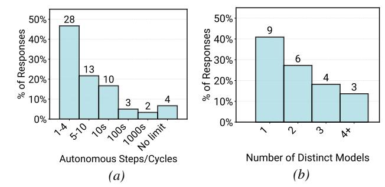

# 6. RQ3 Results: How Are Agents Evaluated For Deployment?

We examine how practitioners assess agents for production readiness and runtime correctness, including what teams compare against and verification methods.

#### 6.1. Baselines and Benchmarks

Survey data shows most teams lack standardized evaluation frameworks during agents development. Only 39% compare their agents systems to non-agentic baselines (existing software, human execution), while 26% report no meaningful baseline exists (Figure 10a). Interview data reveals that even when baselines exist, comparison proves challenging, where non-agentic systems often combine multiple components (human procedures, legacy software, document systems), making isolated technical comparison difficult (e.g., C17: HR agent replacing hybrid human-software workflow).

> **[图片提取文字 (无描述)]:**
> 50% 50% 28 se 40% of Responses 20% % 10% of Responses 30% 20% 10% 10% 6 13 10 3 10% 10% 3 0% 0% 7.4 5.10 105,005,005 linit ზ ν× Number of Distinct Models Autonomous Steps/Cycles (a)

Figure 7. Agent architecture and model selection of deployed agents. (a) Number of autonomous execution steps before user intervention (N=60); (b) Number of models used in deployed systems (N=22).

Case study data shows formal benchmarks are even rarer: 75% evaluate without benchmark sets, relying instead on A/B testing, user feedback, and production monitoring. We refer to benchmarks as curated task sets with expected outputs for systematic evaluation. Five teams build custom benchmarks, one from scratch with expert-labeled ground truth, four by synthesizing existing data (test cases, logs, support tickets). These benchmarks are not easily reusable across deployments due to domain-specific tasks. Case studies reveal a convergent pattern across diverse domains (HR, infrastructure, analytics): establish golden question-answer sets, collect user interactions, and iteratively expand with expert review. This pattern extends to agent runtime through LLM-as-a-judge (§6.2), suggesting opportunities for reusable curation methods and synthetic data generation.

**Finding 11:** Both studies show evaluation lacks standardization. 75% of cases evaluate without benchmarks relying on A/B testing and direct user feedback.

#### **6.2. Evaluation Methods**

Survey data shows human verification dominates evaluation despite automated alternatives. Seventy-four percent rely on human-in-the-loop, where domain experts, operators, or end-users validate the outputs for correctness (Figure 8).

Case study interviews reveal humans verify during both development and production. Development teams work with domain experts to create benchmarks and validate responses (e.g., C15: live systems incident configurations). In production, humans serve as final verifiers—agents suggest actions, experts approve execution (C10: engineers execute on SRE agent recommendation). One team forgoes all automated methods, hand-tuning agent configurations per client through feedback.

Model-based evaluation is second most common (52%), but survey data shows 39% combine it with human verification (Figure 10b). All case study teams using LLM-as-a-judge pair them with human review: judges score confidence for

each response, routing low-confidence cases to experts while randomly sampling some percentages of high-confidence outputs for ongoing validation (C01, C15).

Survey data shows human-in-the-loop (74%) and LLM-as-a-judge (52%) far exceed rule-based methods (42%). Case study interviews suggest this pattern reflects task complexity—customer support, HR operations, and compliance tasks require nuanced expertise that syntactic checks cannot capture. See §B.3 for detailed method descriptions and co-occurrence patterns.

**Finding 12:** Human judgment dominates evaluation (74%), with LLM-as-a-judge (52%) as complement—revealing agents tackle tasks requiring nuanced expertise beyond rule-based verification.

