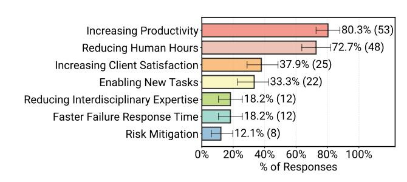
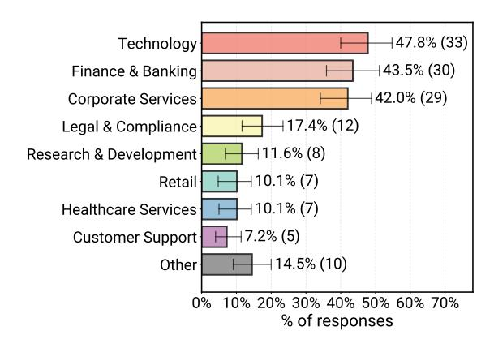

# **Measuring Agents in Production**

Melissa Z. Pan 1\* Negar Arabzadeh 1\* Riccardo Cogo 2 Yuxuan Zhu 3 Alexander Xiong 1 Lakshya A Agrawal 1 Huanzhi Mao 1 Emma Shen 1 Sid Pallerla 1 Liana Patel 4 Shu Liu 1 Tianneng Shi 1 Xiaoyuan Liu 1 Jared Quincy Davis 4 Emmanuele Lacavalla 2 Alessandro Basile 2 Shuyi Yang 2 Paul Castro 5 Daniel Kang 3 Koushik Sen 1 Dawn Song 1 Joseph E. Gonzalez 1 Ion Stoica 1 Matei Zaharia 1\* Marquita Ellis 5\* 1UC Berkeley 2 Intesa Sanpaolo 3 UIUC 4 Stanford University 5 IBM Research

## **Abstract**

LLM-based agents already operate in production across many industries, yet we lack an understanding of what technical methods make deployments successful. We present the first systematic study of Measuring Agents in Production, MAP, using first-hand data from agent developers. We conducted 20 case studies via in-depth interviews and surveyed 86 deployed systems practitioners across 26 domains. We investigate why organizations build agents, how they build them, how they evaluate them, and their top development challenges. Our study finds that production agents are built using simple, controllable approaches: 68% execute at most 10 steps before human intervention, 70% rely on prompting off-the-shelf models instead of weight tuning, and 74% depend primarily on human evaluation. Reliability (consistent correct behavior over time) remains the top development challenge, which practitioners currently address through systems-level design. MAP documents the current state of production agents, providing the research community with visibility into deployment realities and underexplored research avenues.

#### 1. Introduction

Large language models enable a new class of software systems—agents—that combine foundation models with tools, memory, and reasoning to autonomously execute multi-step tasks (Wang et al., 2024b). LLM-based agents

Proceedings of the  $43^{rd}$  International Conference on Machine Learning, Seoul, South Korea. PMLR 306, 2026. Copyright 2026 by the author(s).

> **[图片提取文字 (无描述)]:**
> 80.3% (53) Increasing Productivity 72.7% (48) Reducing Human Hours Increasing Client Satisfaction 137.9% (25) 33.3% (22) Enabling New Tasks 18.2% (12) Reducing Interdisciplinary Expertise 18.2% (12) Faster Failure Response Time 12.1% (8) Risk Mitigation 60% 80% 20% 100% 0% % of Responses

Figure 1. Reasons practitioners build and deploy AI agents (N=66). The question is multi-select, so proportions do not sum to 1. Error bars indicate 95th percentile intervals estimated from 1,000 bootstrap samples with replacement.

have gained substantial research interest, demonstrating potential in areas such as drug discovery and scientific discovery (Huang et al., 2025; Novikov et al., 2025; Lu et al., 2024). Industry is also now deploying agents in domains central to society: finance, healthcare, and education (IACPM, McKinsey, 2025; UHS, Inc., 2025; Linsenmayer, 2025).

Despite widespread excitement about agents, studies show agent deployments often fail or underdeliver (Xue et al., 2025; Reuters Staff, 2025; Shome et al., 2026). The stark contrast between the potential of agents and their failures raises the fundamental question of what enables successful agent deployment. The field can only advance collectively through shared understanding of real-world challenges and lessons learned. Yet, unfortunately, little information is publicly available on how production agents are built.

To address this knowledge gap, we present MAP, the first large-scale systematic study of AI agents in production. We study the practices of developers and teams behind successful real-world systems via four research questions (*RQ*s):

- *RQ1*. What are the applications of agents?
- RQ2. What models, architectures, and methods are used?
- *RQ3*. How are agents evaluated?
- *RQ4*. What are the top challenges in deployment?

We answer these questions by conducting 20 in-depth interviews with deployment teams ranging from major tech-

\*Project Co-Leads 1University of California at Berkeley 2Intesa Sanpaolo 3University of Illinois at Urbana-Champaign 4Stanford University 5IBM Research. Correspondence to: Melissa Z. Pan, Negar Arabzadeh, Marquita Ellis <{melissapan,negara,mme}@berkeley.edu>.

nology companies with AI research labs to agent startups (Figure [15\)](#page-22-0), and surveying 306 practitioners actively building agents across 26 domains (Figure [2\)](#page-1-0). We conducted the study from April to November of 2025. We filtered survey responses to 86 systems in production or pilot phases (Figure [14b\)](#page-21-0), serving hundreds to millions of daily users (Figure [14c\)](#page-21-0). We refer to these production and pilot systems as *deployed agents* and focus our analysis on them in the main paper. Full unfiltered survey data appear in [§D.](#page-24-0) Our key findings for each RQ are the following:

*RQ1*: Productivity gains drive agent adoption. Practitioners deploy agents primarily to increase productivity (80%), mainly serving human users rather than other systems. Deployed agents operate in latency-tolerant applications: 66% allow response times of minutes or longer, as agents outperform human baselines even with these latencies.

*RQ2*: Production agents favor simplicity and control. Teams use off-the-shelf models rather than weight tuning (70%), rely on manual prompt construction (79%), and use static workflows (68% execute ≤10 steps before human intervention). Organizations deliberately trade capability for controllability to maintain reliability.

*RQ3*: Human-in-the-loop evaluation dominates. Deployed agents rely primarily on human-in-the-loop evaluation (74%); other methods (e.g., LLM-as-a-judge) serve as complementary verification. Due to limited available benchmarks and challenges in creating them, 75% of teams forgo formal benchmarking, relying instead on A/B testing or expert feedback to improve reliability.

*RQ4*: Reliability is the top development challenge. Other critical challenges include evaluation (limited by benchmark scarcity and delayed feedback) and security (mitigated via operational constraints).

Our findings suggest an underlying principle: practitioners achieve reliability through best practices in system-level design rather than model-level or algorithmic advances. For example, despite the popularity of RL in research and its benchmark gains, practitioners default to prompting closedsource models because this approach is more robust to model upgrades and more sample-efficient. Thus, teams deliberately choose simple, controllable methods not from lack of sophistication, but because they offer reliable agent performance and fast development cycles.

MAP documents real-world agent practices with first-hand data from practitioners. By sharing deployment data, which are typically kept proprietary, we connect research advances with real-world constraints and challenges. We hope these data-driven insights can help inspire the community to address the underexplored research directions and technical challenges revealed by our study, advancing the field of agents together to deliver value in the real-world. The con-

> **[图片提取文字 (无描述)]:**
> 147.8% (33) Technology 43.5% (30) Finance & Banking 42.0% (29) Corporate Services 17.4% (12) Legal & Compliance 11.6% (8) Research & Development 10.1% (7) Retail 10.1% (7) Healthcare Services 7.2% (5) Customer Support 14.5% (10) Other 10% 20% 30% 40% 50% 60% 70% % of responses

*Figure 2.* Application domains where practitioners deploy Agents (N = 69). ("other") domains are listed in Table [1.](#page-15-0) The question is multi-select i.e., a system may be assigned to multiple categories.

tributions of this paper are as follows:

- 1. First large-scale empirical study of production agents: We conduct 20 in-depth interviews with deployment teams and survey 306 practitioners, including 86 in deployments, providing systematic data on agents serving real users.
- 2. Characterization across 17 design dimensions: We provide quantitative and qualitative data on technical decisions, including models, architectures, prompting, evaluation, applications, and operational constraints.
- 3. Data-driven insights: We show practitioners achieve reliability through system-level design rather than algorithmic advances. Our data provides foundational evidence to support diverse research directions in agent systems.

