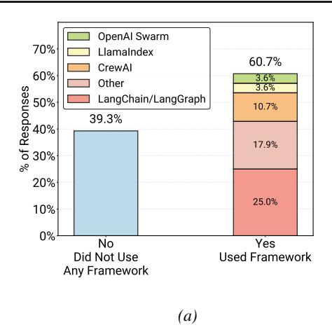
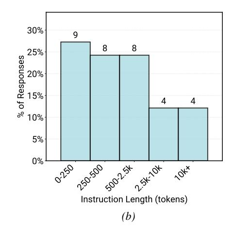
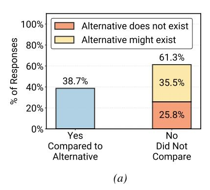
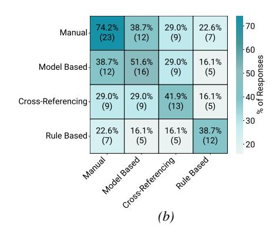
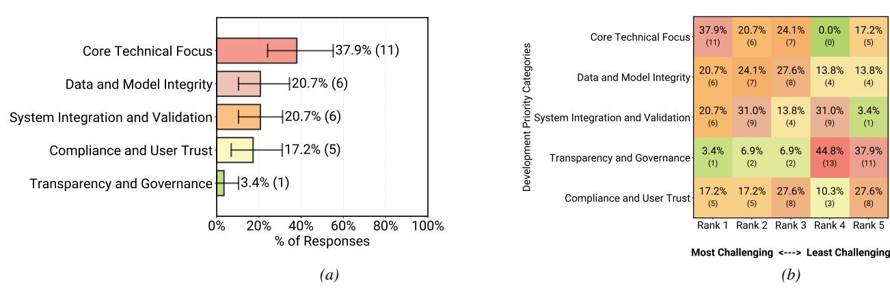
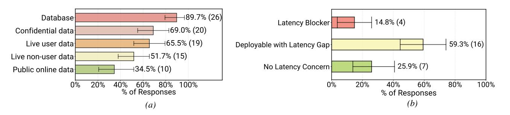
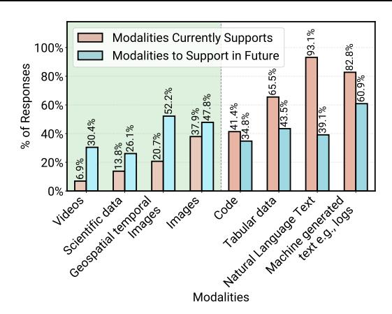
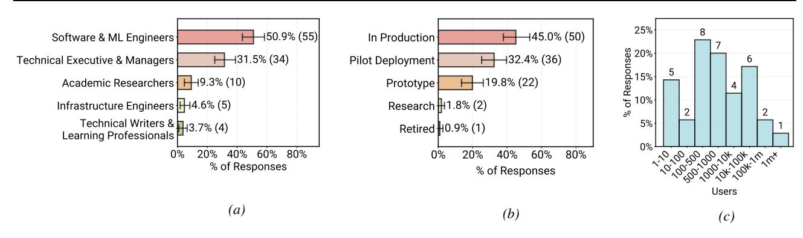
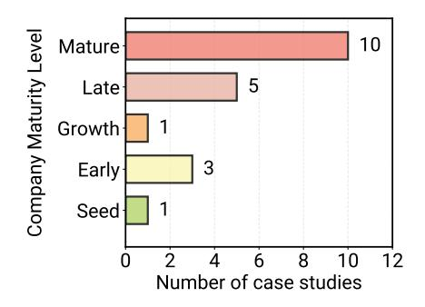
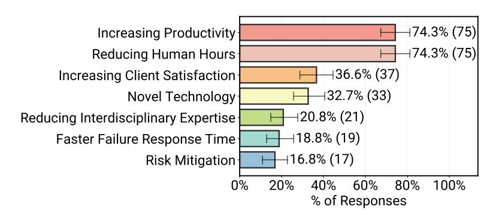

# <span id="page-14-0"></span>B. Supplementary Results and Analysis

In this appendix, we provide additional analysis and details related to the research questions discussed throughout the paper. We note that throughout the paper and appendix, for survey questions involving categorical comparisons, we report 95% confidence intervals computed using 1,000 bootstrap samples with replacement, where applicable.

#### <span id="page-14-2"></span>B.1. Agents application Requirements

## B.1.1. AGENTS USERS

According to our study, the vast majority of agentic systems are designed to serve human users rather than other agents or software systems. Figure [3](#page-3-2) shows the types and scale of users served by deployed agentic systems. As shown in this Figure, 92.5% of deployed agents report humans as their primary users. Among these, internal employees constitute the largest user group (52.2%), followed by external customers (40.3%). Only a small fraction of deployed systems (7.5%) primarily serve non-human consumers, such as downstream software or automated services.

Case study evidence suggests that the emphasis on internal users is often a deliberate deployment choice. Organizations frequently restrict early or initial deployments to internal settings to manage unresolved reliability, safety, and security risks. Internal deployments allow agent outputs to remain within organizational boundaries, where human oversight is readily available and errors typically carry lower external consequences. For example, several interviewed teams described internal operational agents that respond to employee requests, with human engineers able to intervene or override decisions when necessary. Across both internal- and external-facing systems, agents commonly support domain experts rather than operate autonomously. Many deployments require specialized domain knowledge to interpret agent outputs correctly—for instance, insurance authorization agents assisting nurses or incident response agents supporting site reliability engineers. This pattern reflects a broader role for agents as productivity-enhancing tools that augment expert workflows, with humans acting as final decision-makers or verifiers.

#### <span id="page-14-1"></span>B.1.2. APPLICATION DOMAINS

Figure [2](#page-1-0) summarizes the application domains of deployed Agentic AI systems in our survey data, spanning 26 distinct domains. These domains reflect a broad range of real-world use cases, from enterprise and software operations to healthcare, scientific discovery, and communication services. In this section, we describe how domain labels were derived from free-text survey responses and how infrequently occurring domains (outliers) were handled.

Domain Normalization The survey response for the question related to agent application domains (QN4 in Appendix [G.3\)](#page-32-0) was collected in free-text form. Therefore, we normalized the domain responses to enable systematic analysis. We first applied the state-of-the-art semantic parser LOTUS [\(Patel et al.,](#page-11-5) [2025\)](#page-11-5) to perform semantic aggregation, deriving a set of candidate domain categories by grouping semantically similar phrases (e.g., healthcare, medical, patient monitoring) into unified labels (e.g., Healthcare Services). Based on the LOTUS output and as shown in Figure [2,](#page-1-0) this resulted in nine categories in total: eight high-level application domains and one residual "Other" category capturing long-tail responses.

*Table 1.* Survey Responses Recorded as 'Other' For Domain Analysis and Topic Normalization.

<span id="page-15-0"></span>

| chemical               | proprietary-based networks | Telco             | GTM Operations |
|------------------------|----------------------------|-------------------|----------------|
| supply chain           | food & beverage industry   | construction      | automotive     |
| travel                 | Advertising                | Beauty & wellness | Privacy        |
| entertainment & gaming | film & TV                  | social media      | Paint industry |

Each survey response was then independently annotated by three annotators, who assigned one or more relevant domain labels from this LOTUS-derived category set. We measured inter-annotator agreement across all pairwise combinations of the three annotators and across all labels, yielding a mean Cohen's κ of 0.636. This level of agreement is commonly interpreted as substantial for multi-class semantic labeling tasks, particularly given the multi-select nature of the question and the fact that many deployed agent systems naturally span adjacent or overlapping domains.

Disagreements primarily arose in borderline cases where systems plausibly fit multiple related categories (e.g., Corporate Services vs. Finance & Banking, or Technology vs. Research & Development), rather than from ambiguity in category definitions. In cases where no consensus was reached among the three annotators, a fourth expert annotator adjudicated the final label. Figure [2](#page-1-0) reports results based on these final consensus annotations. Additional implementation and normalization details, including representative LOTUS programs, are provided below in this appendix section.

```
Domain Normalization with LOTUS Semantic Aggregation
df.sem_agg(
    f"Given user answers to a survey question in {QN4}, create a comprehensive bullet
        point list of answer categories. The survey question was: {header_map["QN4"]}."
)
```

Outlier Domains Figure [2](#page-1-0) includes an "Other" category, which captures the long-tailed distribution of categories not shown explicitly in the figure. Table [1](#page-15-0) presents domains that were mentioned only once across all reported deployed agent use cases. These outlier domains highlight the long-tail diversity of agent applications beyond the dominant sectors observed in the main analysis, illustrating how agentic systems are being explored across a diverse set of real-world problems.

#### <span id="page-15-2"></span>B.1.3. LATENCY REQUIREMENTS

Relaxed latency requirements are commonly observed among deployed agents. Figure [4](#page-4-0) shows the distribution of maximum allowable end-to-end latency. Minutes is the most common target, followed by seconds. Notably, 17.0% report no defined limit yet. The latency tolerance reflects the productivity focus from Section [4.1.](#page-3-3) Agents are often used to automate tasks that can take humans hours to complete. Consequently, an agent taking multiple minutes to respond remains orders of magnitude faster than non-agentic baselines. Interview participants emphasized this advantage: even if an agent takes five minutes, that remains more than 10× faster than assigning the task to a person on the team, especially when staffing shortages exist and the task is secondary to the user's core responsibilities. Examples include nurses examining insurance details and software engineers responding to internal pager duty. Some deployed agents from case studies even batch requests hourly or overnight, further indicating latency is not a primary constraint.

However, this pattern breaks for real-time interactive applications. For example, practitioners building voice-driven systems report latency as their top challenge (Section [B.4.2\)](#page-19-0) during detailed case study. These systems compete against human conversation speeds rather than task completion baselines. Among our 20 detailed case studies, only 5 require real-time responsiveness. The remaining 15 cases tolerate extended processing times: 7 involve human review with relaxed timing, 5 operate as asynchronous background processes, and 3 have hybrid operation patterns. For these systems, processing times of minutes remain acceptable because the alternative can be days of human effort.

#### <span id="page-15-1"></span>B.2. Agents Architecture

## B.2.1. AGENTIC FRAMEWORKS

We find a divergence in framework adoption between survey respondents and interview case studies. As shown in Figure [9a,](#page-16-0) among deployed agents from the survey, two-thirds (60.7%) use third-party agentic frameworks. Reliance concentrates

<span id="page-16-0"></span>> **[图片提取文字 (无描述)]:**
> OpenAl Swarm 70% LlamaIndex 60.7% CrewAl 60% 3.6% Other so of Responses 40% 30% 3.6% LangChain/LangGraph 10.7% 39.3% 17.9% % 20% 25.0% 10% 0% No Yes Did Not Use Used Framework Any Framework (a)


> **[图片提取文字 (无描述)]:**
> 30% 9 8 8 25% % of Responses 20% 15% 4 4 10% 5% 0% 0/20 120 20 20 134 124 104 Instruction Length (tokens) (b)


Figure 9. Overview of core configuration and infrastructure choices in deployed Agentic AI systems. (a) Frameworks reported to use among teams building production agents (N=29). (b) Distribution of system prompt lengths measured in tokens (N=33).

around three primary frameworks: LangChain/LangGraph (lan; LangChain Inc., 2025) leads with 25.0%, followed by CrewAI (crewAI, 2025) at 10.7%, with LlamaIndex (LlamaIndex, 2025) and OpenAI Swarm (OpenAI, 2025b) both at 3.6%.

In sharp contrast, our detailed case studies reveal a strong preference for custom in-house agent implementations. Only 3 of 20 (15%) detailed case studies rely on external agent frameworks (2 use LangChain/LangGraph (lan; LangChain Inc., 2025), 1 uses DSPy (Khattab et al., 2024)). The remaining 17 teams (85%) build their agent application entirely in-house with direct model API calls. For example, one interview case explicitly shared that their agents are their own implementation of ReAct loops. Notably, two additional teams report starting with frameworks like CrewAI during the experimental prototyping phase but migrating to custom in-house solutions for production deployment to reduce dependency overhead.

We identify three core motivations for building custom solutions from the detailed case studies. First, *flexibility and control* are critical. Deployed agents often require vertical integration with proprietary infrastructure and customized data pipelines that rigid frameworks struggle to support. For example, one agent-native company deploys customer-facing agents across varied client environments, necessitating a bespoke orchestration layer. Second, *simplicity* drives the decision. Practitioners report that core agent loops are straightforward to implement using direct API calls. They prefer building minimal, purpose-built scaffolds rather than managing the dependency bloat and abstraction layers of large frameworks. Third, *security and privacy* policies sometime prohibit the use of certain external libraries in enterprise environments, compelling teams to develop compliant solutions internally.

#### **B.2.2. PROMPTING**

As shown in Figure 6 Across deployed systems, prompt construction remains predominantly human-driven, with limited adoption of fully automated methods. We further examine system prompt length distributions among our survey deployed agents in Figure 9b. While a majority of agents use relatively concise prompts (51.5% under 500 tokens), prompt length exhibits a pronounced long tail. Among deployed agents, 24.2% use prompts between 500 and 2,500 tokens, 12.1% between 2,500 and 10,000 tokens, and an additional 12.1% exceed 10,000 tokens (Figure 9b). These longer prompts are rarely the result of a single design decision; instead, interview data suggests they often accumulate over time as systems incorporate guardrails, exception handling, policy constraints, and domain-specific instructions. As systems mature, prompts increasingly serve as centralized coordination artifacts rather than minimal task descriptions.

#### <span id="page-16-1"></span>**B.3. Evaluation**

This section provides additional detail on how practitioners evaluate deployed agentic AI systems. We complement the results for *RQ3* by exploring further on (i) whether deployed agents are explicitly compared against non-agentic alternatives, and (ii) the distribution of overlapping evaluation and verification strategies used in practice among deployed agents.

<span id="page-17-0"></span>> **[图片提取文字 (无描述)]:**
> 100% Alternative does not exist Alternative might exist % of Responses 80% 61.3% 60% 38.7% 35.5% 40% 20% 25.8% 0% Yes No Compared to Did Not Alternative Compare (a)


> **[图片提取文字 (无描述)]:**
> 22.6% 70 74.2% 38.7% 29.0% Manual-(23)(12)(9)(7)60 % of Responses 38.7% 51.6% 29.0% 16.1% Model Based (12)(9) (5)(16)29.0% 29.0% 16.1% 41.9% Cross-Referencing (9)(9)(5)(13)-30 Marua 16.1.
> 
> Horde Breed Cross Referencing 16.1% 38.7% Rule Based (5)(12)-20 Rule Based (b)


Figure 10. Evaluation Practices in Agentic AI Systems: (a) Comparison to Alternatives: Shows whether participants explicitly compared their deployed agent against a non-agentic baseline (e.g., existing software, traditional workflows). (b) Evaluation Strategies Co-occurrence: Visualizes the pairwise overlap between evaluation strategies. Manual human-in-the-loop evaluation has the highest overlap with other strategies, suggesting that teams commonly rely on manual review to complement automated checks.

#### B.3.1. COMPARISON TO BASELINES.

Figure 10a reports whether teams explicitly compare their deployed agentic systems against non-agentic baselines, such as existing software systems, traditional automated workflows, or human execution. 38.7% of respondents report conducting such comparisons, while the majority do not. In-depth interviews suggest several contributing factors: in some cases, agents are designed for tasks with no clear pre-existing alternative; in others, the baseline consists of a heterogeneous process involving multiple tools and human steps, making systematic technical comparison difficult. As a result, teams often evaluate agents based on task success, user outcomes, or qualitative improvements rather than direct performance deltas against a single baseline system.

#### B.3.2. EVALUATION STRATEGIES OVERLAP.

As discussed in § 6.2 and Figure 8, human-in-the-loop evaluation (74.2%) and LLM-as-a-judge approaches (51.6%) are the most commonly adopted evaluation strategies among deployed agentic systems. We further dive deeper into analyzing different evaluation strategies in Figure 10b, where we explore which evaluation methods are commonly used together.

Figure 10b illustrates the co-occurrence of evaluation strategies across deployed agents, showing that human-in-the-loop evaluation is most frequently used in combination with other methods. Rather than relying on automated techniques in isolation, practitioners typically anchor rule-based verification, cross-referencing, and LLM-based judgments around human annotation. This pattern suggests that human judgment plays a central coordinating role in evaluation pipelines for production agentic systems.

This distribution indicates that many production agents operate in settings where correctness cannot be fully determined through deterministic rules or simple pattern matching. Instead, agents are deployed in domains requiring contextual understanding and nuanced judgment, such as customer support voice assistance or human resource operations. In these settings, practitioners rely on human and LLM-based evaluation to assess output quality, appropriateness, and task success, with automated checks serving a complementary role.

#### <span id="page-17-1"></span>**B.4. Challenges**

Like any emerging system, building agentic systems is not immune to challenges. We asked survey participants to rank the major categories of challenges they encounter during the development or operation of Agentic AI systems. Table 2 provides detailed descriptions of each challenge category identified in the survey, outlining the main technical and organizational issues practitioners reported when building Agentic AI systems. The five categories and their detailed definitions are provided in Table 2. Figure 11b illustrates how frequently each challenge category was assigned a given rank. For example, 'Core Technical Performance' was ranked as the most significant challenge (#1) by 37.9% of respondents, by far more than any other category, indicating it remains the dominant source of difficulty in current Agentic AI system development. 'Core Technical Performance' encompasses a wide range of issues, including robustness, reliability, scalability, latency, and resource constraints. Its prevalence suggests that much of the community's current effort is devoted to ensuring that systems perform consistently and dependably under real-world conditions. Following closely as shown in Figure 11a 'Data and

<span id="page-18-2"></span>> **[图片提取文字 (无描述)]:**
> 37.9% 24.1% 0.0% 17.2% Core Technical Focus (7) (5)37.9% (11) Categories Core Technical Focus 27.6% 13.8% 13.8% Data and Model Integrity 20.7% (6) (8) Data and Model Integrity (4) (4) 20.7% 31.0% 13.8% 31.0% 3.4% 20.7% (6) System Integration and Validation System Integration and Validation (6) (4) (9) 17.2% (5) Compliance and User Trust 3.4% 6.9% 6.9% 44.8% 37.9% Transparency and Governance (13)(11) Transparency and Governance 17.2% 27.6% 10.3% 27.6% Compliance and User Trust (8) (3) (5) 100% 20% 80% Rank 2 Rank 3 Rank 4 0% 60% Rank 1 % of Responses Most Challenging <---> Least Challenging (b) (a)


Figure 11. Major challenges encountered across agents deployment (N=29). (a) Distribution of top-ranked (Rank 1) challenges reported for deployed agentic systems. Lower-ranked categories reflect areas that respondents perceived as *lower priority relative to other challenges*, rather than challenges that are fully resolved or unimportant (e.g., compliance and governance). (b) Heatmap showing how frequently each challenge category was assigned to different difficulty ranks (1 = most challenging, 5 = least challenging) across deployed agents. Overall, the results indicate that  $Core\ Technical\ Focus\ remains$  the dominant source of friction in current deployments.

Table 2. Major categories of challenges reported by participants.

<span id="page-18-1"></span>

| Challenge Category                | Representative Issues and Focus Areas                                                                                                                                                                                                                                                                                                         |  |
|-----------------------------------|-----------------------------------------------------------------------------------------------------------------------------------------------------------------------------------------------------------------------------------------------------------------------------------------------------------------------------------------------|--|
| Core Technical Performance        | Robustness and reliability—ensuring consistent, correct behavior in diverse and unpredictable environments; scalability—supporting growth in users, data, and tasks without performance degradation; real-time responsiveness—meeting latency and timing requirements; resource constraints—managing compute, memory, and energy efficiently. |  |
| Data and Model Integrity          | Data quality and availability—access to clean, timely, and relevant data; model and concept drift—adapting to changes in data distributions and task definitions; versioning and reproducibility—tracking models, data, and configurations for auditability.                                                                                  |  |
| System Integration and Validation | Integration with legacy systems—connecting with existing infrastructure and APIs; testing and validation—simulating and verifying agent behavior before deployment; security and adversarial robustness—defending against manipulation and exploitation.                                                                                      |  |
| Transparency and Governance       | Explainability and interpretability—making decisions understandable to humans; bias and fairness—preventing discriminatory or unjust outcomes; accountability and responsibility—clarifying who is liable for agentic decisions.                                                                                                              |  |
| Compliance and User Trust         | Privacy and data protection—ensuring adherence to data regulations (e.g., GDPR); user trust and adoption—building confidence through transparency and reliability; regulatory compliance—meeting legal standards for autonomy, safety, and transparency.                                                                                      |  |

Model Integrity' and 'System Integration and Validation' were reported as second-ranked persistent sources of friction when transitioning systems from research prototypes to production environments. In contrast, 'Transparency and Governance' and Compliance and User Trust were ranked as lower-priority concerns, indicating that while practitioners recognize its long-term importance, it is not yet perceived as a primary bottleneck in current development cycles.

#### <span id="page-18-0"></span>**B.4.1. SECURITY AND PRIVACY CHALLENGES**

Security and privacy consistently rank as secondary concerns in both of our studies, with practitioners prioritizing output quality and correctness. Figure 11a shows that Compliance and User Trust ranks fourth among challenge categories. Given that §4.3 shows 52.2% of systems serve internal employees and many systems with human supervision, this prioritization reflects current deployment environments and requirements rather than dismissing security's importance.

**Data ingestion and handling.** Survey results in Figure 12a show that 89.7% of systems ingest information from databases, 65.5% ingest real-time user input, and 51.7% ingest other real-time signals. Notably, 69.0% of systems retrieve confidential or sensitive data, while only 34.5% retrieve persistent public data. Given the high prevalence of sensitive data usage and user inputs, preserving privacy is critical. Our interview case studies reveal that teams address this through legal methods.

<span id="page-19-1"></span>> **[图片提取文字 (无描述)]:**
> ⊣89.7% (26) Database 14.8% (4) Latency Blocker 169.0% (20) Confidential data <sup>+</sup>65.5% (19) Live user data 59.3% (16) Deployable with Latency Gap 151.7% (15) Live non-user data 25.9% (7) No Latency Concern **+34.5% (10)** Public online data 0% 20% 40% 60% 80% 100% 0% 20% 40% 60% 80% 100% % of Responses % of Responses (b)(a)


*Figure 12.* Supplementary deployment characteristics of agentic systems (N = 27–29). (a) Overview of data ingestion and handling capabilities in deployed agents. The question was multi-select, allowing participants to indicate all data handling methods integrated into their systems. The distribution highlights a strong reliance on internal infrastructure over public data sources. (b)Degree to which latency is reported as a deployment challenge. The results suggest that latency is rarely a strict blocker for most deployed agentic systems.

For example, a team building healthcare agents report relying on standard data-handling practices and strict contractual agreements with model providers to prevent training on their user data.

Security practices. In-depth interview participants describe four approaches to managing security risks through *constrained agent design*. First, six teams restrict agents to "read-only" operations to prevent state modification. For example, one SRE agent case study generate bug reports and proposes action plans, but leaves the final execution to human engineers. Second, three teams deploy agents in sandboxed or simulated environments to isolate live systems. In one instance, a code migration agent generates and tests changes in a mirrored sandbox, merging code only after software verification. Third, one team builds an abstraction layer between agents and production environments. This team constructs wrapper APIs around production tools, restricting the agent to this intermediate layer and hiding internal function details. Finally, one team enforces role-based access controls that mirror agent user's permissions. However, the agent team reports this remains challenging, as agents can bypass these configurations when accessing tools or documents with conflicting permissions.

## <span id="page-19-0"></span>B.4.2. LATENCY CHALLENGES

We examine the degree to which agent execution latency hinders deployment. Survey results indicate that latency represents a manageable friction rather than a hard stop for most teams. Figure [12b](#page-19-1) shows that only 14.8% of deployed survey agents identify latency as a critical deployment blocker requiring immediate resolution, while the majority (59.3%) report it as a marginal issue, where current latency is suboptimal but sufficient for deployment. We suspect that this tolerance correlates with the prevalence (15/20 in detailed interview case studies) of asynchronous agent execution paradigm (Section [B.1.3\)](#page-15-2) and (52.2% from survey) internal user bases (Section [4.3\)](#page-3-1). Notably, we observe a consistent latency distribution across the full survey dataset, including experimental systems (Figure [24b\)](#page-28-0). We believe this consistency signals a broader preference for building offline agents, as discussed in Section [B.1.3.](#page-15-2)

Interactive agent latency requirements. While latency is not a critical challenge for most agent applications, it remains a critical bottleneck for real-time interactive agents. Two interviewed teams, building voice agents, report continuous engineering efforts to match human conversational speeds. Unlike asynchronous workflows, these systems require seamless turn-taking where delays disrupt the user experience. Achieving fluid real-time responsiveness beyond rigid turn-based exchanges remains an open research question and development challenge.

Practical latency management. Interview participants describe two approaches to managing latency. First, teams commonly implement hard limits on maximum steps or model inference calls, typically derived from heuristics. Second, one team adopts a creative solution by pre-building a database of request types and agent actions (tool calls), then employing semantic similarity search at runtime to identify similar requests and serve prebuilt actions, reducing response times by orders of magnitude compared to reasoning and generating new responses. These workarounds demonstrate that practitioners currently rely on system-level engineering to bypass the inherent latency costs of foundation models.

## B.4.3. MODALITIES

Supporting multiple data modalities emerges as an additional deployment challenge for production agent systems. Beyond text-based interactions, practitioners increasingly aim to extend agents to handle richer inputs and outputs, including speech, images, video, spatiotemporal data, and domain-specific scientific formats. While these capabilities unlock new application

<span id="page-20-0"></span>> **[图片提取文字 (无描述)]:**
> 93.1% Modalities Currently Supports 82.8% 100% Modalities to Support in Future % of Responses 80% 9% 60% 43.5% 41.4% 39.1% 34.8% 13.8% 40% 20.7% 20% %6.9 Watutal and the three of e.g. defe Scientific data Schenius of the threads Tabular data 0% Video<sup>5</sup> code Images Modalities


Figure 13. Data modalities already supported (red) versus modalities planned for future support (blue) in production agent systems (N=29). Bars to the left of the dashed line indicate modalities with expected increases in future support, whereas modalities to the right are already widely supported with limited planned expansion. Interestingly, the modalities with the largest planned growth are all non-textual, pointing toward increasingly multimodal agent systems.

opportunities, they also introduce substantial engineering, evaluation, and reliability challenges.

To understand current practice and future direction, we asked survey participants to report (1) which data modalities their deployed agents currently support and (2) which additional modalities they plan to add. Figure 13 summarizes these responses for deployed agent systems, contrasting modalities already supported (red) with those planned for future support (blue). As shown in this Figure, text dominate current deployments: 93% of surveyed production agents accept natural-language text input. In contrast, support for non-textual modalities remains relatively limited today. However, the strongest expected growth is concentrated precisely in these less mature modalities. Bars to the left of the dashed line indicate modalities with anticipated increases in future support, while modalities to the right are already relatively more adopted with comparatively limited planned expansion. Notably, the modalities with the largest projected growth—such as images, video, spatiotemporal data, and scientific data—are all non-textual, pointing toward increasingly multimodal agent systems.

Interview data helps contextualize this pattern. Participants consistently report that early deployments prioritize modalities that are easy to measure, validate, and debug. Text-based agents benefit from established evaluation workflows, human verification, and relatively fast iteration cycles. In contrast, multimodal agents face weaker correctness signals, higher infrastructure complexity, and more expensive data pipelines. As a result, teams often defer multimodal expansion until text-centric deployments achieve sufficient reliability.

This trend presents both challenges and opportunities. On the challenge side, multimodal agents complicate evaluation, observability, and failure detection, exacerbating issues already present in text-only systems. On the opportunity side, growing practitioner demand suggests a clear need for research on multimodal agent architectures, modality-aware evaluation methods, and system designs that support reliable multimodal execution at runtime. As production agents mature, we expect modality expansion to follow successful stabilization of text-based deployments, extending agent capabilities toward richer, more complex real-world inputs.

#### <span id="page-20-1"></span>C. Collected Data Details

In this section, we provide additional details about our collected data sources, including (i) the survey respondent population and the deployment characteristics of the reported agentic systems (Appendix C.1), and (ii) supplementary information on the in-depth interview case studies such as demographics and organizational context (Appendix C.2). In total, our survey collected 306 valid responses and, together with 20 in-depth interviews, this data forms the empirical basis of this study on AI agents in production.

<span id="page-21-0"></span>> **[图片提取文字 (无描述)]:**
> 25% **---**150.9% (55) 445.0% (50) Software & ML Engineers In Production of Responses 15% 131.5% (34) 132.4% (36) Technical Executive & Managers Pilot Deployment Academic Researchers H-19.3% (10) -19.8% (22) Prototype ! Research #1.8% (2) Infrastructure Engineers H4.6% (5) Technical Writers & H3.7% (4) Learning Professionals 5% Retired #0.9% (1) 60% 80% 0% 20% 40% 0% 20% 40% 60% 80% % of Responses % of Responses Users (a) (b) (c)


Figure 14. Overview of survey respondent and system characteristics across all agents the survey data: (a) roles of survey participants by primary contribution area (N=108), (b) deployment stages of Agentic AI systems (N=111) that survey participants contributed to, and (c) reported number of end users (N=35) for the Agentic systems survey participants contributed to.

<span id="page-21-1"></span>Table 3. Case studies grouped by application domain. There are 20 cases total, but similar cases are merged for clarity and confidentiality.

| Business Operations                                        |
|------------------------------------------------------------|
| C01: Insurance claims workflow automation                  |
| C02: Customer care internal operations assistance          |
| C03: Human resources workflow automation and assistance    |
| Communication Tech, Multi-lingual Multi-dialect            |
| C04: Communication automation services                     |
| C05: Automotive communication services                     |
| Scientific Discovery                                       |
| C06: Biomedical sciences workflow automation               |
| C07: Materials safety and regulatory analysis automation   |
| C08: Chemical data interactive exploration                 |
| Software DevOps                                            |
| C09: Spark version code and runtime migration              |
| C10: Software development life cycle assistance end-to-end |
| C11: Software engineer/developer slack support             |
| C12: SQL optimization                                      |
| C13: Code auto-completion and syntax error correction      |
| Software & Business Operations                             |
| C14: Data analysis and visualization                       |
| C15: Enterprise cloud engineer and business assistance     |
| C16: Site reliability incident diagnoses and resolution    |
| C17: Software products technical question answering        |

## <span id="page-21-2"></span>C.1. Survey Data Details

Survey respondents self-identified as practitioners actively building AI agents across 26 application domains (Figure 2), spanning areas such as finance, healthcare, and legal services. Of the 306 respondents, 294 reported that they have directly contributed to building and designing at least one agent system. As reported in Figure 14a (N=108), among those who disclosed their role, respondents are predominantly technical professionals, with a large share identifying as software and machine learning engineers. Figure 14b reports the deployment stages of the agentic systems respondents contributed to (N=111); among those who reported deployment stage, 82% indicated that their systems are in *production* or *pilot* phases, reflecting rapid transition from experimental prototypes to real-world deployments.

Beyond deployment stage, we examine the scale of the user base for deployed systems. Figure 14c summarizes reported end-user counts (N=35), showing substantial variation in deployment scale. In particular, 42.9% of reported deployments serve user bases in the hundreds, while 25.7% serve tens of thousands to over one million daily users. Together, these distributions indicate that our survey captures both smaller deployments and high-impact systems operating at significant scale, motivating our focus on deployed agents in the main analysis.

> **[图片提取文字 (无描述)]:**
> Company Maturity Level 10 Mature 5 Late Growth 3 Early Seed 10 12 Number of case studies


<span id="page-22-0"></span>*Figure 15.* The distribution of source institution maturities across in-depth interview-based case studies. The minority (5/20) are from seed-stage startups (validating product-market fit), early-stage startups (proving scalable business models), and growth-stage startups (rapidly expanding market share and operations). The majority (15/20) are from late-stage and mature institutions (with established market positions). The stages are approximated from limited public information e.g. size, sector, and annual recurring revenue.

### <span id="page-22-2"></span>C.2. In-Depth Case Study Details

This appendix provides details on the in-depth case studies to support the qualitative findings. In total, we curated 20 interview-based case studies, selected to reflect diversity in application settings, organizational maturity, and geographic reach. The anonymized case studies and their representative use-case descriptions are summarized in Table [3.](#page-21-1) These cases span multiple application categories, including business operations (C01-C03), communication technologies and multilingual or multidialect systems (C04-C05), scientific discovery (C06-C08), software DevOps and infrastructure (C09-C13), and software and business operations (C14-C16). Each case is referenced throughout the paper using anonymized identifiers (C01, C02, . . . ). When organizations operated multiple agent deployments, we prioritized selecting distinct use cases to avoid over-representing any single institution and to capture a broader range of deployment patterns.

## C.2.1. DEPLOYMENT STAGE AND ORGANIZATIONAL MATURITY

All interviewed systems serve real-world users: 14 cases are in full production and 6 are in final pilot phases. The studied systems support both internal users (5 cases) and external enterprise users (15 cases), and originate from organizations spanning a wide range of maturity levels—from seed-stage startups to large enterprises with global footprints (Figure [15\)](#page-22-0). To respect confidentiality agreements with case study sources, we report only aggregate statistics about organizational characteristics and geographic footprint.

<span id="page-22-1"></span>> **[图片提取文字 (无描述)]:**
> ms


*Figure 16.* Case study sources are present in one to hundreds of countries. This shows the distribution of cases by sources' country spread.

> **[图片提取文字 (无描述)]:**
> 5 to 6 Continents 1 Continent 2 to 4 Continents


*Figure 17.* Case study sources are present in 1 to 6 continents. This shows the distribution of cases by sources' continental spread.

#### C.2.2. GEOGRAPHIC DISTRIBUTION.

Figures [16](#page-22-1) and [17](#page-22-1) summarize the geographic footprint of organizations in our case studies. As shown in Figure [16,](#page-22-1) case study sources operate across a wide range of country-level presence, from organizations active in a single country to globally distributed deployments spanning hundreds of countries. Figure [17](#page-22-1) shows that case study sources operate across one to six continents, indicating that the interviewed systems include both regionally focused deployments and globally distributed services. These distributions suggest that the qualitative findings reflect agent deployments operating under heterogeneous regulatory, linguistic, and operational environments, rather than being confined to a single geographic context.

#### C.2.3. PARTICIPANT BACKGROUND, RECRUITMENT, AND DATA COLLECTION TIMELINE

We conducted interviews with technical practitioners directly responsible for the design, implementation, or operation of the studied agentic systems, including ML engineers, software engineers, and senior technical leads. To protect confidentiality, we do not report individual-level demographic attributes; however, participants represented a range of engineering roles and experience levels spanning system architecture, deployment, evaluation, and ongoing operations. Although studied systems may have been publicly announced, public-facing materials (e.g., product documentation, marketing releases, or high-level technical overviews) do not capture the implementation- and operations-level detail central to our analysis. As such, access to practitioners with the required depth of expertise typically occurs through professional networks and practitioner-oriented events. Participants were therefore recruited via the authors' professional networks as well as outreach through presentations at agent-focused technical venues (anonymized), and were screened to ensure active, hands-on involvement in the development or maintenance of the systems under study.

Data collection occurred across multiple phases: initial survey and interview design began in March, followed by interviews with upstream stakeholders from mid-April through mid-May. Three subsequent recruitment rounds were conducted through agent-focused technical events spaced roughly two months apart—late May, early August, and mid-October—with the final interview completed in November.

Considerations for fast-evolving systems. Because agentic systems and their supporting infrastructure evolve rapidly, collecting data across multiple phases allowed us to capture changes in engineering practices as they emerged over the study period. This staggered timeline also broadened the range of contexts represented, as participants engaged with different system states, model versions, or operational conditions. However, we recognize that later interviews may reflect different technical environments than earlier ones, which can complicate synthesis and introduce recency-related bias. To mitigate these issues, we analyzed interviews with close attention to their temporal context, distinguishing themes that appeared consistently across phases from those tied to time-specific system developments.

#### <span id="page-23-0"></span>C.3. Interviews Details

### C.3.1. STANDARDIZED INTERVIEW PROCEDURES.

We followed a consistent sequence of pre-, in-, and post-interview procedures across all case studies. Interviews adhered to a shared semi-structured protocol spanning 11 topic areas (Appendix [C.3.2\)](#page-23-1), covering system architecture, evaluation practices, deployment challenges, operational constraints, and measures of agent value. Each interview lasted 30–90 minutes and involved 2–5 participants with fixed roles to improve consistency and reduce interviewer effects. Interviewers were selected to maintain organizational neutrality with respect to participating teams.

Pre-interview context gathering, when applicable, was restricted to publicly available sources (e.g., product documentation or engineering blogs) to avoid introducing private or leading assumptions. Depending on participant preference, interviews were either recorded or documented through detailed human notes. Post-interview summaries were cross-validated among interviewers to ensure accuracy and internal consistency. In accordance with confidentiality agreements, all data are anonymized and reported only in aggregate. Interview discussions were guided by the predefined topic groups, with interviewers instructed to prioritize topics 1–5, followed by 6–8, and then 9–11 as time permitted. Topics with available public information were used primarily for verification rather than open-ended elicitation.

## <span id="page-23-1"></span>C.3.2. INTERVIEW OUTLINE

- 1. The root problem (benefit) the system is addressing (providing): What is the ultimate benefit? What is the system replacing and why?
- 2. Key success metrics and evaluation mechanism: What tools, techniques, systems, etc. are used to ensure the system meets user and stakeholder objectives? Is data corresponding to the expected or past system behavior available for the evaluation?
- 3. Key aspects of the system design and implementation: What programming framework was used? What is the general architecture? What are the steps, stages, and cycles? How are common components (e.g. routers, LLM-as-a-Judge, other verifiers, HIL) combined and why? What is the ratio of automation to human interaction and why—by design or limitation?

<span id="page-24-1"></span>> **[图片提取文字 (无描述)]:**
> <sup>1</sup>74.3% (75) Increasing Productivity 74.3% (75) Reducing Human Hours 36.6% (37) Increasing Client Satisfaction 32.7% (33) Novel Technology 120.8% (21) Reducing Interdisciplinary Expertise 18.8% (19) Faster Failure Response Time 16.8% (17) Risk Mitigation 20% 40% 60% 80% 100% 0% % of Responses


*Figure 18.* [All Data] Reasons practitioners build AI agents across all development stages (Production, Pilot, Prototype, and Research). Increasing productivity remains the most selected benefit across the full dataset (N = 101).

- 4. The state of the system or its development: Is the system in production, or was it never meant for production (purely for AI research, learning, upskilling)? Was the system prototyped for production but abandoned—why, and what were the critical limitations? Were there surprises in the development or evaluation process? Did some things work better or worse than expected, and if so, what?
- 5. Known constraints or requirements of end-users and stakeholders: What are the security, confidentiality, regulatory, latency, SLO/SLA, or other requirements?
- 6. Advantage of an agentic AI system solution over alternative approaches: Do reasonable alternative solutions exist for this problem, or is this a novel solution made possible with Agentic AI? Against existing alternatives, has comparative analysis been conducted? What are the comparative benefits, costs, and return on investment (ROI)?
- 7. System dependencies and complexity: what is the quantity, quality, and availability of tools and data for verification and generation?
- 8. End-user quantity, expertise levels, and organizational domains. is it a product for internal-use only or public external use? Does it support multiple institutions? Are there institution-specific or regulatory boundaries limiting the quantity of users? Are target users domain experts or novices? How many of each user group are there and how many are targeted (order of magnitude)?...
- 9. Estimated cost versus value or benefit: What is the estimated cost (sunk and expected ongoing costs) of developing and operating the system versus the estimated value or benefit? Is the respondent aware? What is the value, how is ROI being calculated?
- 10. System stakeholders: Who ultimately benefits from deployment? Who is impacted by safety, security, etc. failures and limitations? What is the expected impact on the company/institution (e.g. reduced hiring, retraining, broader user-base etc.)?
- 11. Your role and activities: What is your role in the development of the agentic AI system(s) you are describing?

